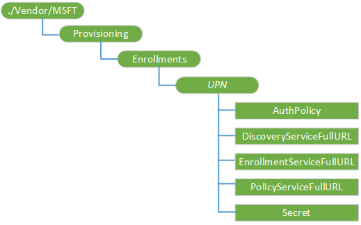

# 资源调配 CSP

资源调配配置服务提供程序用于 MDM 服务的大量用户登记。

> **请注意** 启用两个因素的身份验证后，大量登记不起作用。

 

有关批量注册的分步指南，请参阅[批量注册](bulk-enrollment-using-windows-provisioning-tool.md)。

下面的关系图以树格式显示资源调配配置服务提供程序。

**./Vendor/MSFT**  
资源调配 CSP 的根节点。

**资源调配注册**  
用于定义用户批量注册到 MDM 服务节点。

**资源调配注册 / ***_UPN_**  
注册的唯一标识符。 对于批量注册，这必须允许多个用户注册的服务帐户。 示例中，"generic-device@contoso.com"

**资源调配注册/*UPN*/DiscoveryServiceFullURL**  
发现服务的完整 URL。

**资源调配注册/*UPN*/Secret**  
此信息是依赖于正在使用 AuthPolicy。 可能的值︰

-   内部部署身份验证注册的密码字符串
-   联合的安全联盟的注册标记
-   Certificated 基于注册打印证书缩略图

**资源调配注册/*UPN*/AuthPolicy**  
指定使用 MDM 服务的身份验证策略。 有效值︰

-   OnPremise
-   证书

**资源调配注册/*UPN*/PolicyServiceFullURL**  
指定的策略服务 URL。

**资源调配注册/*UPN*/EnrollmentServiceFullURL**  
指定的注册服务 URL。

 

 

