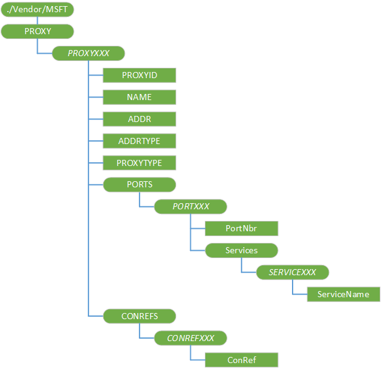

# 代理服务器 CSP

代理配置服务提供程序用于配置代理服务器连接。

> **请注意** 使用[厘米\_ProxyEntries CSP](cm-proxyentries-csp.md)而不是代理的 CSP，它将否决在将来的版本中。

此配置服务提供商要求使用 ID\_CAP\_CSP\_基础和 ID\_CAP\_网络\_管理功能从网络配置应用程序进行访问。

 

对于代理的 CSP，不能使用替换命令，除非该节点已存在。

下图显示了代理配置服务提供程序管理对象以树格式由 OMA DM。 OMA 客户端资源调配协议不支持此配置服务提供程序。

**./Vendor/MSFT/Proxy**  
代理服务器连接的根节点。

***ProxyName***  
定义的代理服务器连接的名称。

建议此元素名称，被指定为从零开始的编号的节点。 例如，若要设置两个代理服务器连接，使用"PROXY0"和"PROXY1"元素名。 可以使用任何唯一的名称，如果需要 （例如"GPRS 的 NAP")，但不能含有空格可能出现在名称 （而是使用 20%）。

添加、 更新和删除此子树中的节点具有指定单个原子事务中。

***ProxyName*/PROXYID**  
指定的代理服务器连接的唯一标识符。

***ProxyName*/NAME**  
指定的代理服务器连接的用户友好名称。

***ProxyName*/ADDR**  
指定代理服务器的地址。

此值可能是该服务器或任何其他字符串 （如 IP 地址） 用来唯一标识该代理服务器连接的网络名称。

***ProxyName*/ADDRTYPE**  
指定用于确定代理服务器的地址的类型。

有效值为 IPV4、 IPV6、 E164、 ALPHA。

***ProxyName*/PROXYTYPE**  
指定的代理服务器连接的类型。

根据 ProxyID，有效值为 ISA、 WAP、 SOCKS，则为 NULL。

***ProxyName*/Ports**  
有关端口的信息节点。

****ProxyName/端口 / ***_端口名_**  
定义端口的名称。

建议此元素名称，被指定为从零开始的编号的节点。 例如，若要设置两个端口，使用"PORT0"和"PORT1"元素名。

/PortNbr** * * *ProxyName*/Ports/*端口名*  
指定要与父端口相关联的端口号。

/Services** * * *ProxyName*/Ports/*端口名*  
服务信息的节点。

****ProxyName/端口/服务 / ***_服务_**  
定义服务的名称。

建议此元素名称，被指定为从零开始的编号的节点。 例如，若要设置两个服务，使用"SERVICE0"和"服务 1"用作元素名称。

* * **ProxyName/端口/服务/*站点*/ServiceName**  
指定要与父端口相关联的协议。

一个常用的值是"HTTP"。

***ProxyName*/ConRefs**  
节点连接的参考信息

****ProxyName/ConRefs / ***_ConRefName_**  
定义连接引用的名称。

建议此元素名称，被指定为从零开始的编号的节点。 例如，若要设置两个连接的引用，使用"CONREF0"和"CONREF1"元素名。

* * *ProxyName*/ConRefs/*ConRefName*/ConRef**  
指定一个代理服务器连接相关联的单个连接对象。

## 相关的主题

[配置服务提供程序的引用](configuration-service-provider-reference.md)

 

 

