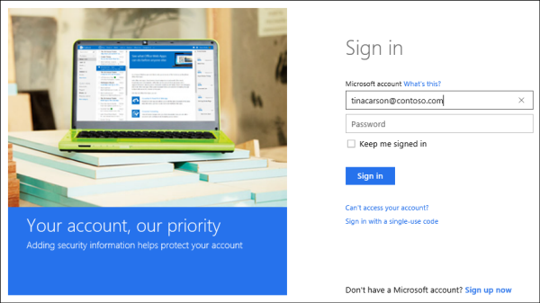
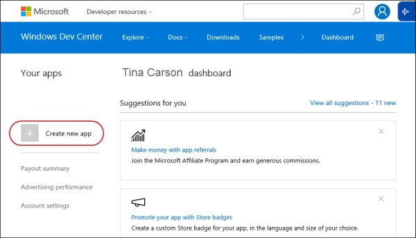
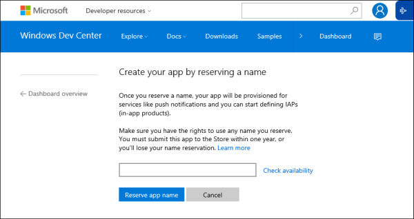
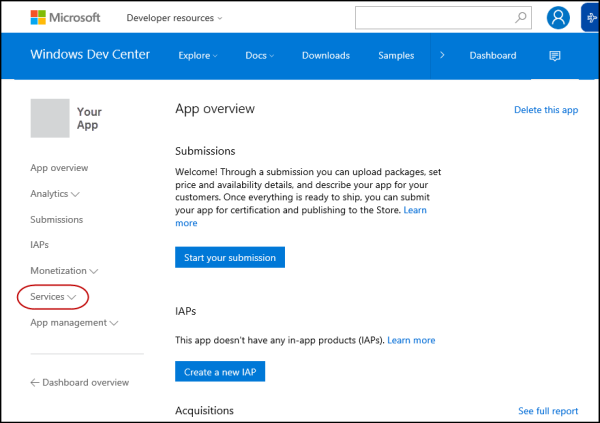
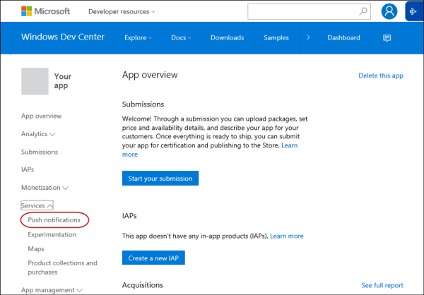
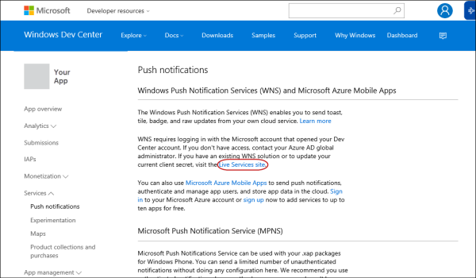
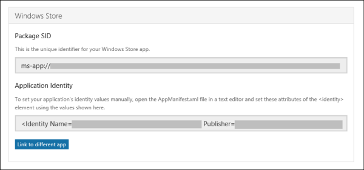
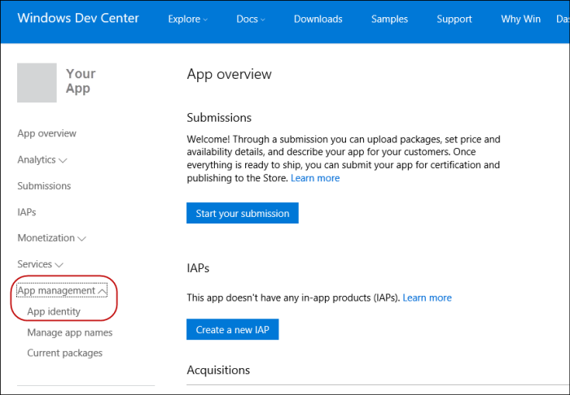

# 推送通知支持的设备管理

[DMClient 的 CSP](dmclient-csp.md)支持配置推启动设备管理会话的能力。 使用[Windows 通知服务 (WNS)](http://go.microsoft.com/fwlink/p/?linkid=528800)，管理服务器可以请求设备进行管理与服务器建立会话通过推式通知。 设备被配置为支持推由管理服务器通过为应用程序提供 PFN 设备。 设备配置后，它将向 WNS 云 （电池检测和数据意义上允许的条件） 注册的持久连接。

要启动设备管理会话，管理服务器必须首先验证与 WNS 使用其 SID 和客户的机密。 身份验证后，服务器将收到一个标记，它可以使用任何 ChannelURI 的启动原始推式通知。 当要启动设备管理会话与设备管理服务器时，它可以利用其标记和设备 ChannelURI 并开始与该设备进行通信。

有关如何获取推凭据 （SID 和客户端密钥） 和 PFN 用于 WNS，请参阅[获取 WNS 凭据和 PFN 的 MDM 推式通知](#get-wns-credentials-and-pfn-for-mdm-push-notification)。

因为设备可能不总是连接到 internet，WNS 支持传递到设备的缓存通知，一旦它重新连接。 若要确保您的通知将被缓存以传递，设置为缓存 X WNS 缓存策略头。 此外，如果要发送时间绑定原始推式通知服务器，服务器可以使用将提供 WNS 生存时间绑定，以便通知将过期时间过后的 X-WNS TTL 头。 有关详细信息，请参阅[原始通知概述 （Windows 运行时应用程序）](http://go.microsoft.com/fwlink/p/?LinkId=733254)。

请注意有关推式通知和 WNS 以下限制︰

-   设备管理的强制使用原始的推式通知。 这意味着，这些原始的推送通知不支持或使用推式通知有效载荷。
-   推式通知的收据很敏感设备上的电池保护程序和数据检测设置。 例如，如果电池低于特定阈值时，将终止与 WNS 设备的永久连接。 此外，如果用户正在使用的数据有意义，并已超过其每月分配的数据，与 WNS 设备的永久连接也将被终止。
-   提供到管理服务器的设备 ChannelURI 30 天内才有效。 设备自动续订后 15 天 ChannelURI 和触发管理会话的 ChannelURI 成功续订。 强烈建议，在每个管理单元中，管理服务器查询 ChannelURI 值，以确保它获得的最新值。 这将确保管理服务器将不尝试使用已过期的 ChannelURI。
-   推式不能替代具有轮询计划。
-   WNS 有权阻止您 PFN 到推式通知，如果检测到不正确使用的通知。 将停止使用此 PFN 管理具有强制任何设备启动设备管理支持。
-   在 Windows 10、 版本 1511年以及 Windows 8 和 8.1，MDM 推可能不能更新会自动使其过期的 WNS 推入通道。 它还可能会挂起设置通道 PFN 时。

    解决此问题，请 410 时尝试发送推式通知到设备 PFN WNS 服务器返回时应设置在下一次同步会话期间。 要防止推通道较旧版本过期，服务器可以通道过期 （~ 30 天） 前复位 PFN。 如果他们已经正在运行 Windows 10，应该有更新可用，则他们可以安装程序应能修复此问题。

-   在第 10 Windows 版本 1511，我们使用以下的重试逻辑为 DMClient:
    -   如果 ExpiryTime 大于 15 天日程安排设置为时 15 天。
    -   如果 ExpiryTime 是从现在的 4 + /-1 小时设置的日程安排从现在到 15 天。
    -   如果已通过 ExpiryTime 计划将设置为 1 天 + /-4 个小时从现在。

-   在第 10 Windows 版本 1607，我们检查网络连接然后重试。 我们不检查 internet 连接。 如果网络连接不可用，我们将跳过重试并设置日程安排 4 + /-1 小时再试一次。

## 获取 WNS 凭据和 PFN MDM 推式通知

若要获取 PFN 和 WNS 凭据，您必须创建 Windows 应用商店应用程序。

1.  转到 Windows[的仪表板](https://dev.windows.com/en-US/dashboard)，以您的开发人员帐户登录。

    
2.  创建新的应用程序。

    
3.  保留应用程序名称。

    
4.  单击**服务**。

    
5.  单击**推式通知**。

    
6.  单击**Live 服务网站**。 为**应用程序注册门户**页面中打开一个新窗口。

    
7.  在**应用程序注册门户**页面中，您将看到如创建该应用程序的属性︰
    -   应用程序 Id
    -   应用程序密码
    -   Windows 应用商店包 SID、 应用程序标识和出版商。

    
8.  单击**保存**。
9.  关闭**应用程序注册门户**窗口并返回到 Windows 开发人员中心仪表板。
10. 从左侧列表中选择您的应用程序。
11. 从左侧的导航中，展开**应用程序管理**，然后单击**应用程序标识**。

    
12. 在**应用程序标识**页上，您将看到您的应用程序的**包系列名称 (PFN)** 。

 

