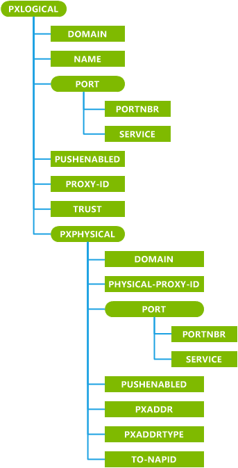
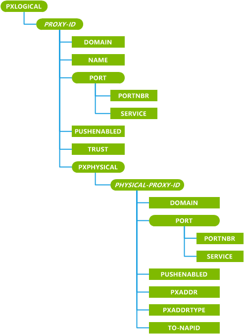

# PXLOGICAL 配置服务提供程序

用于添加、 删除或修改 WAP 逻辑和物理代理通过使用 WAP 或标准的 Windows 方法 PXLOGICAL 配置服务提供程序。

> **请注意**  此配置服务提供商要求使用 ID\_CAP\_CSP\_基础和 ID\_CAP\_网络\_管理功能从网络配置应用程序进行访问。

 

下图显示了 PXLOGICAL 配置服务提供程序管理对象由 OMA 客户端资源调配使用初始引导设备的树格式。 OMA DM 协议不支持此配置服务提供程序。

下图显示了 PXLOGICAL 配置服务提供程序管理对象以树格式如由 OMA 客户端资源调配，用于更新设备的引导。 OMA DM 协议不支持此配置服务提供程序。

**PXPHYSICAL**  
定义一组逻辑的代理服务器设置。

元素的 mwid 特性是 Microsoft 置备 XML 特性，并且是可选的添加盹或代理服务器时。 它是必需的更新和删除现有 NAPs 和代理服务器时，必须有它的值设置为 1。

**域**  
指定与代理相关的域 (例如，"\*.com")。

Windows 设备支持只有一个代理，没有域参数，或者有一个空的域值。 也就是说，设备仅支持一个默认代理服务器。 所有其他代理服务器配置必须具有非空值的域参数。 此参数的查询返回以分号分隔的与代理相关的所有域。

**名称**  
指定逻辑的代理服务器的名称。

当一起显示在单个行中的用户将显示代理服务器列表时，因此此值的长度应该短，无法用于可读性。

**端口**  
定义的端口号和一个或多个协议或服务之间的绑定。

此配置服务提供程序可以接受最多为每个物理的代理服务器的两个端口。 此特征的查询返回到第一个端口相关的信息。

**PORTNBR**  
指定与此代理服务器上的某些服务相关联的端口号。

如果 PORTNBR 是 80 或 443 或端口特征是丢失，则将其视为一个 HTTP 代理。

**服务**  
指定的端口号与关联的服务。

Windows 支持通过短消息服务 (SMS) 的持有者为 WAP 推邮件接受 WAP 推无连接会话。 互联网浏览使用 HTTP 协议，WAP 代理。 此参数的查询返回以分号分隔的只有第一端口的服务。

**PUSHENABLED**  
指定启用推式操作。

如果在 PXLOGICAL 中使用此元素，则它将适用于所有嵌入 PXLOGICAL 元素中的 PXPHYSICAL 元素。 值为"0"指示代理不支持推入操作。 "1"表示该代理支持推送操作。

**代理服务器 ID**  
在初始引导过程中使用。 指定逻辑代理的唯一标识符。

***代理服务器 ID***  
引导的更新过程中使用。 指定逻辑代理的唯一标识符。

**代理服务器 ID**元素的名称是在初始引导过程中传递的值相同。

**信任**  
指定在此逻辑的代理服务器的物理代理特权。 SECPOLICY\_信任\_WAP\_代理安全策略 (4121) 控制哪些角色可以设置此元素。

**PXPHYSICAL**  
定义一组物理代理设置与父逻辑代理关联。

元素的 mwid 特性是 Microsoft 置备 XML 特性，并且是可选的添加盹或代理服务器时。 它是必需的更新和删除现有 NAPs 和代理服务器时，必须有它的值设置为 1。

**物理的代理的 ID**  
在初始引导过程中使用。 指定的标识符的实际代理。

当一起显示在单个行中的用户将显示代理服务器列表时，因此此值的长度应该短，无法用于可读性。

***物理的代理的 ID***  
引导的更新过程中使用。 指定的标识符的实际代理。

**物理的代理 ID**元素的名称是在初始引导过程中传递的值相同。

**PXADDR**  
指定物理的代理服务器的地址。

**PXADDRTYPE**  
物理的代理服务器指定的格式和协议的 PXADDR 元素。

唯一受支持的值是"E164"和"IPv4"。

**对 NAPID**  
指定与该物理的代理服务器的网络访问点。 支持每个代理的只有一个。

如果使用**TO NAPID** ，则还必须添加的**NAPID**引用了**TO NAPID** NAP。

## Microsoft 的自定义元素

下表显示了此配置服务提供程序支持 OMA 客户端资源调配的 Microsoft 自定义元素。

这些功能是仅适用于设备技术。 此外，对于所有的 PXADDR 类型的所有 PXPHYSICAL 代理参数不支持参数查询和特性查询功能。 当 PXPHYSICAL 代理 PXADDRType IPv4 可以查询所有参数。 例如，如果 PXADDR 类型是 E164 移动运营商查询 PXPHYSICAL 代理的 TO NAPID 参数，则返回 noparm。

<table>
<colgroup>
<col width="50%" />
<col width="50%" />
</colgroup>
<thead>
<tr class="header">
<th>功能</th>
<th>可用</th>
</tr>
</thead>
<tbody>
<tr class="odd">
<td>
参数查询
</td>
<td>
是
</td>
</tr>
<tr class="even">
<td>
noparm
</td>
<td>
是
</td>
</tr>
<tr class="odd">
<td>
nocharacteristic
</td>
<td>
是
</td>
</tr>
<tr class="even">
<td>
特征查询
</td>
<td>
是
</td>
</tr>
</tbody>
</table>

 

## 相关的主题

[配置服务提供程序的引用](configuration-service-provider-reference.md)

 

 

