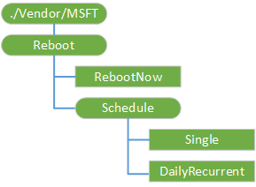

# 重新启动 CSP

重新启动配置服务提供程序用于配置重新启动设置。

下图显示重新配置服务提供程序管理对象以树格式由开放移动联盟设备管理 (OMA DM)，OMA 客户端资源调配和企业 DM。

**./Vendor/MSFT/Reboot**  
重新启动配置服务提供程序的根节点。

受支持的操作是获得。

**RebootNow**  
此节点执行的设备重新启动。

> **请注意** 如果此节点处于执行状态，设备将重新启动，在每个同步。 我们建议您清除的执行状态，一旦发生同步。

 

受支持的操作被执行。

**日程安排**  
受支持的操作是获得。

**计划/单**  
此节点将执行重新启动在预定的日期和时间。 设置为 null （空） 日期将会删除现有的计划。 日期和时间值是 ISO8601，和所需的日期和时间。 例如︰ 2015年-12-15T07:36:25Z

受支持的操作是获得和替换。

**计划/DailyRecurrent**  
此节点将执行重新启动在预定的时间，在配置的起始时间和日期开始每一天。 设置为 null （空） 日期将会删除现有的计划。 日期和时间值是 ISO8601，和所需的日期和时间。 例如︰ 2015年-12-15T07:36:25Z

受支持的操作是获得和替换。

## 相关的主题

[配置服务提供程序的引用](configuration-service-provider-reference.md)

 

 

