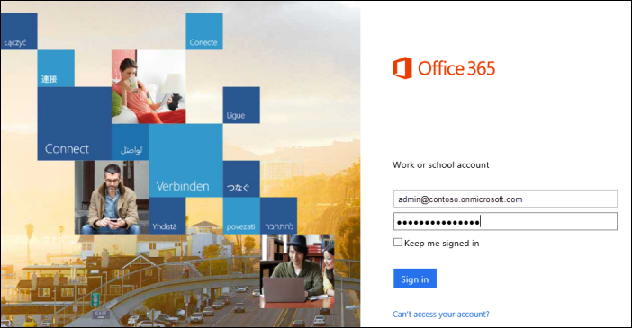
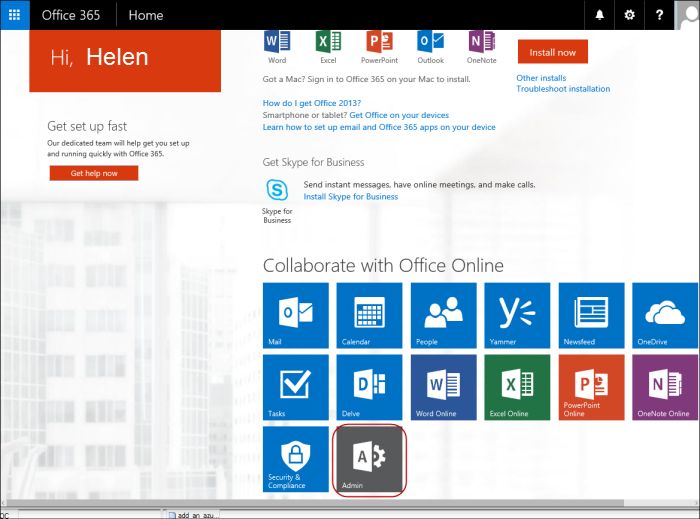
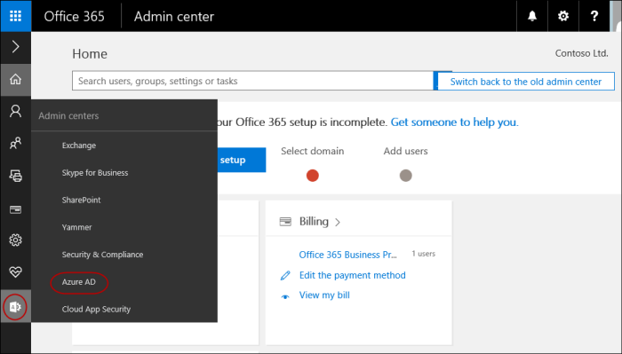
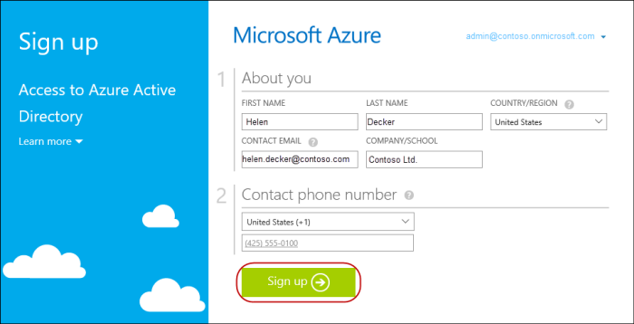
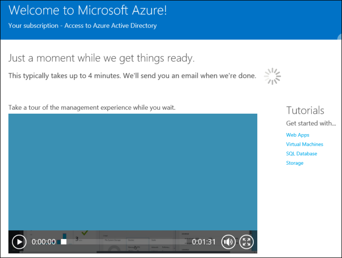
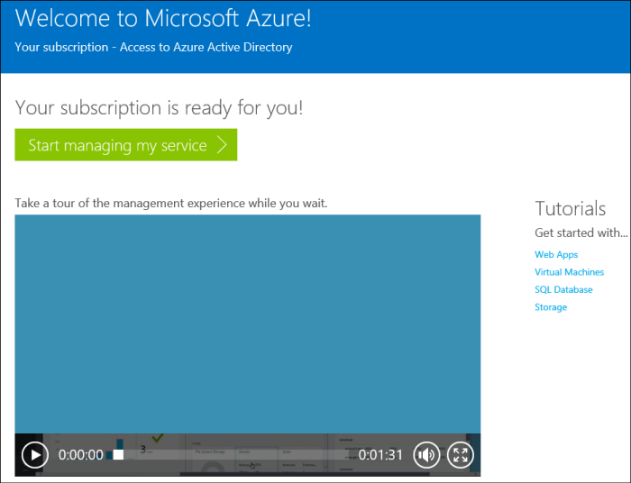

# 注册免费 Azure Active Directory 订阅

如果您已支付给 Office 365、 Microsoft Dynamics CRM Online、 企业移动套件或其他 Microsoft 服务的订阅，必须对 Azure 广告的免费订阅。 下面是一个分步指南，以注册免费使用 Office 365 增值业务订购的 Azure 广告订阅。

> **请注意** 如果您没有任何附带免费 Azure 的 Microsoft 服务广告订阅遵循分步指南中[添加 Azure AD 租户和 Azure 广告订阅](add-an-azure-ad-tenant-and-azure-ad-subscription.md)设置一个租户，添加订阅，并通过 Azure 门户管理它。

 
## 注册免费 Azure Active Directory 订阅

1.  登录到 Office 365 门户网站位于<https://portal.office.com>使用贵组织的帐户。

    

2.  在**主页**页中，单击管理工具图标。

    

3.  在**管理中心**页中，将鼠标悬停在左侧管理工具图标，然后单击**Azure 的广告**。 这会将您带到 Azure Active Directory 注册页面并将现有的 Office 365 组织帐户信息显示。

    

4.  在**注册**页上，请确保输入有效的电话号码，然后单击**注册**。

    

5.  它可能需要几分钟的时间来处理该请求。

    

6.  当此过程完成时，您将看到欢迎页面。

    

 

