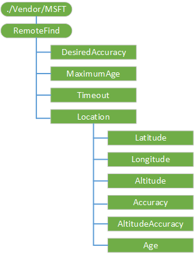

# <a name="remotefind-csp"></a>RemoteFind 的 CSP


RemoteFind 配置服务提供程序中检索某个特定设备的位置信息。

下图显示了 RemoteFind 配置服务提供程序管理对象以树格式由 OMA 客户端资源调配使用。



<a href="" id="desiredaccuracy"></a>**DesiredAccuracy**  
可选项。 该节点接受请求的半径值以米为单位。 要准确的有效值为 1 到 1000年米之间的任何值。

默认值为 50。 替换此值只将其替换为当前会话。 不保留值。

支持的操作包括替换和获取。 添加命令不受支持。

<a href="" id="timeout"></a>**超时**  
可选项。 值以秒为单位为 dword 值。

默认值是 7，范围为 0 到 1800年秒。 替换此值只将其替换为当前会话。 不保留值。

支持的操作包括替换和获取。 添加命令不受支持。

<a href="" id="maximumage"></a>**MaximumAge**  
可选项。 值表示在几分钟内，服务器将接受成功的位置检索所需的时间窗口。 该节点使服务器能够将请求的生存期值设置在 100 十亿分之一秒内。 要准确的有效值包括 0 和 1440 分钟之间的任意整数值。

默认值为 60。 替换此值只将其替换为当前会话。 不保留值。

支持的操作包括替换和获取。 添加命令不受支持。

<a href="" id="location"></a>**位置**  
必需。 节点在此路径下的要想取得成功必须以原子方式进行查询。 这是为了防止服务器查询数据集不完整。

<a href="" id="latitude"></a>**纬度**  
必需。 提供最后一次成功的远程查找的纬度。

返回的值是双重的。

默认值为 Null。

受支持的操作是获得。

<a href="" id="longitude"></a>**经度**  
必需。 提供最后一次成功的远程查找的经度。

返回的值是双重的。

默认值为 Null。

受支持的操作是获得。

<a href="" id="altitude"></a>**海拔**  
必需。 提供最后一次成功的远程查找的海拔高度。

返回的值是双重的。

默认值为 Null。

受支持的操作是获得。

<a href="" id="accuracy"></a>**准确性**  
必需。 提供了查找以米为单位的最后一次成功的远程位置修补程序的准确性。 值的范围是从 0 到 1000 米。

返回的值是一个整数。

默认值为 0。

受支持的操作是获得。

<a href="" id="altitudeaccuracy"></a>**AltitudeAccuracy**  
必需。 提供高度准确性以米为单位的最后一次成功的远程位置的修补程序的查找。 值的范围是从 0 到 1000 米。

返回的值是一个整数。

默认值为 0。

受支持的操作是获得。

<a href="" id="age"></a>**年龄**  
必需。 提供当前的位置数据 100 纳秒的时间。

返回的值是一个整数。

默认值为 0。

受支持的操作是获得。

## <a name="examples"></a>示例


``` syntax
<SyncML xmlns="SYNCML:SYNCML1.2">
    <SyncBody>
        <Atomic>  
            <CmdID>1</CmdID>  
            <Sequence> 
                <CmdID>10</CmdID>  
                <Get>         
                    <CmdID>30</CmdID>  
                    <Item>  
                        <Target>  
                            <LocURI>./Vendor/MSFT/RemoteFind/Location/Latitude</LocURI>  
                        </Target>  
                    </Item>  
                </Get> 
                <Get> 
                    <CmdID>40</CmdID>  
                    <Item>  
                        <Target>  
                            <LocURI>./Vendor/MSFT/RemoteFind/Location/Longitude</LocURI>  
                        </Target>  
                    </Item>  
                </Get> 
                <Get> 
                    <CmdID>40</CmdID>  
                    <Item>  
                        <Target>  
                            <LocURI>./Vendor/MSFT/RemoteFind/Location/Altitude</LocURI>  
                        </Target>  
                    </Item>  
                </Get> 
                <Get> 
                    <CmdID>45</CmdID>  
                    <Item>  
                        <Target>  
                            <LocURI>./Vendor/MSFT/RemoteFind/Location/Accuracy</LocURI>  
                        </Target>  
                    </Item>  
                </Get> 
                <Get> 
                    <CmdID>50</CmdID>  
                    <Item>  
                        <Target>  
                            <LocURI>./Vendor/MSFT/RemoteFind/Location/AltitudeAccuracy</LocURI>  
                        </Target>  
                    </Item>  
                </Get> 
                <Get> 
                    <CmdID>60</CmdID>  
                    <Item>  
                        <Target>  
                            <LocURI>./Vendor/MSFT/RemoteFind/Location/Age</LocURI>  
                        </Target>  
                    </Item>  
                </Get>                  
            </Sequence> 
        </Atomic> 
    </SyncBody>
</SyncML>
```

## <a name="related-topics"></a>相关的主题


[配置服务提供程序的引用](configuration-service-provider-reference.md)

 

 


