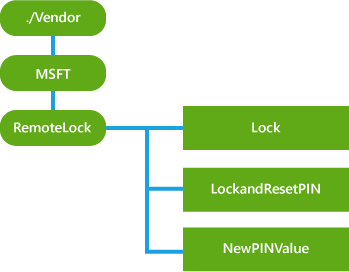

# <a name="remotelock-csp"></a>RemoteLock 的 CSP


RemoteLock 的 CSP 支持锁定了在设备上设置或重置设备，也可能没有设置 PIN 针针的设备的能力。

> **请注意**  在 Windows 10 Mobile 只支持 RemoteLock CSP。

 

下面的关系图以树格式显示 RemoteLock 配置服务提供程序。



<a href="" id="lock"></a>**锁定**  
必需。 该节点接受请求锁定设备屏幕。 如果尚未设置 PIN，将立即锁定设备屏幕。 如果设置没有针，锁请求将被忽略，OMA DM (405) 禁止错误则返回通过管理通道。 列出了所有的 OMA DM 错误[这里](http://go.microsoft.com/fwlink/p/?LinkId=522607)协议规范中。 受支持的操作被执行。

<table>
<colgroup>
<col width="20%" />
<col width="40%" />
<col width="40%" />
</colgroup>
<thead>
<tr class="header">
<th>。</th>
<th>说明</th>
<th>[标准] 的含义</th>
</tr>
</thead>
<tbody>
<tr class="odd">
<td><p>(200) 确定</p></td>
<td><p>设备已成功地锁定。</p></td>
<td><p>成功完成命令和关联的警报动作。</p></td>
</tr>
<tr class="even">
<td><p>(405)</p></td>
<td><p>未能锁定设备，由于设备上当前设置无针脚。</p></td>
<td><p>在目标系统上不允许所请求的命令。</p></td>
</tr>
<tr class="odd">
<td><p>(500) 命令失败</p></td>
<td><p>由于某种未知的原因无法锁定设备。</p></td>
<td><p>试图完成命令收件人创建非特定错误。</p></td>
</tr>
</tbody>
</table>

 

<a href="" id="lockandresetpin"></a>**LockAndResetPIN**  
此节点可以用于锁定和重置该设备上的针脚。 它与 NewPINValue 节点一起使用。 在此节点上成功调用**Exec**操作后，以前的针将不再起作用，并且不能恢复。 受支持的操作被执行。

此节点将返回下面的状态。 列出了所有的 OMA DM 错误[这里](http://go.microsoft.com/fwlink/p/?LinkId=522607)协议规范中。

<table>
<colgroup>
<col width="20%" />
<col width="40%" />
<col width="<40></40>%" />
</colgroup>
<thead>
<tr class="header">
<th>。</th>
<th>说明</th>
<th>含义</th>
</tr>
</thead>
<tbody>
<tr class="odd">
<td><p>(200) 确定</p></td>
<td><p>该设备已拥有一个新密码已重置的锁定。</p></td>
<td><p>成功完成命令和关联的警报动作。</p></td>
</tr>
<tr class="even">
<td><p>(500) 命令失败</p></td>
<td><p>N/A</p></td>
<td><p>试图完成命令收件人创建非特定错误。</p></td>
</tr>
</tbody>
</table>

 

<a href="" id="newpinvalue"></a>**NewPINValue**  
此节点包含 PIN，在 /RemoteLock/LockAndResetPIN 上调用 Exec 后。 如果 LockAndResetPIN 不会被调用，则值将为 null。 如果获取此节点上调用 Exec 调用/RemoteLock/LockAndResetPIN 上成功后，将提供新的 pin 码。 如果在此节点上调用另一个 Get 命令，则值将为 null。 如果您需要再次重置 PIN，可以为该设备生成一个新的 PIN 传达另一个 LockAndResetPIN 执行。 PIN 值符合最小针复杂性要求在设备上设置的合并策略。 如果没有 PIN 策略已在设备上设置，设备将生成 8 位数字的 pin 码，并设置具有此插针的设备。

返回数据类型是一个字符串。

受支持的操作是获得。

获取此节点上的操作必须遵循按正确的顺序，在同一消息中 SyncML 的 /RemoteLock/LockAndResetPIN 节点上执行操作。 顺序标记可以用于保证处理命令时的顺序。

## <a name="examples"></a>示例


启动远程设备的锁定。

``` syntax
<Exec>
   <CmdID>1</CmdID> 
   <Item> 
      <Target> 
         <LocURI>./Vendor/MSFT/RemoteLock/Lock </LocURI> 
      </Target> 
   </Item> 
</Exec>
```

启动远程锁定和设备的重置 PIN。 若要成功检索设备生成的新 PIN，命令必须执行在一起并按正确的顺序如下所示。

``` syntax
<Sequence>
    <CmdID>1</CmdID> 
    <Exec>
        <CmdID>2</CmdID> 
        <Item> 
            <Target> 
                <LocURI>./Vendor/MSFT/RemoteLock/LockAndResetPIN </LocURI> 
            </Target> 
        </Item> 
    </Exec>
    <Get>
       <CmdID>3</CmdID> 
       <Item> 
            <Target> 
                <LocURI>./Vendor/MSFT/RemoteLock/NewPINValue </LocURI> 
            </Target> 
        </Item> 
    </Get>
</Sequence>
```

> **请注意** 如果将远程锁定或远程锁定和 PIN 重置命令发送到设备已被锁定，则设备将重新启动。

 

## <a name="related-topics"></a>相关的主题


[配置服务提供程序的引用](configuration-service-provider-reference.md)

 

 


