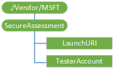

# SecureAssessment 的 CSP

SecureAssessment 配置服务提供程序用于提供安全评估浏览器的配置信息。

下图显示的 SecureAssessment 配置服务提供程序管理对象以树格式由开放移动联盟设备管理 (OMA DM)，OMA 客户端资源调配和企业 DM。

**./Vendor/MSFT/SecureAssessment**  
SecureAssessment 配置服务提供程序的根节点。

受支持的操作是获得。

**LaunchURI**  
URI 指向安全评估浏览器启动时自动加载的评估。

受支持的操作是添加、 删除、 获取，并替换。

**TesterAccount**  
考虑测试的用户名称。

-   若要指定域帐户，请使用域\\用户。
-   若要指定 AAD 帐户，请使用 username@tenant.com。
-   若要指定本地帐户，使用的用户名。

受支持的操作是添加、 删除、 获取，并替换。

## 相关的主题

[配置服务提供程序的引用](configuration-service-provider-reference.md)

 

 

