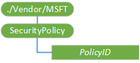

# <a name="securitypolicy-csp"></a>SecurityPolicy 的 CSP


SecurityPolicy 配置服务提供程序用于配置 WAP 推送，OMA 客户端资源调配，OMA DM、 服务指示 (SI)、 服务加载 (SL) 和 MMS 的安全策略设置。

>  **请注意**  此配置服务提供商要求使用 ID\_CAP\_CSP\_基础和 ID\_CAP\_设备\_管理\_安全\_策略功能可从网络配置应用程序。

 

对于 SecurityPolicy 的 CSP，不能使用替换命令，除非该节点已存在。

下图显示了 SecurityPolicy 配置服务提供程序管理对象以树格式由 OMA DM 和 OMA 客户端资源调配使用。



<a href="" id="policyid"></a>***PolicyID***  
作为十进制值定义的安全策略标识符。

支持以下安全策略。

<table>
<colgroup>
<col width="15%" />
<col width="25%" />
<col width="55%" />
</colgroup>
<thead>
<tr class="header">
<th>PolicyID</th>
<th>策略名称</th>
<th>策略说明</th>
</tr>
</thead>
<tbody>
<tr class="odd">
<td><p>4104</p>
<p>1008 十六进制表示︰</p></td>
<td><p>TPS 策略</p></td>
<td><p>此设置指示是否可以指定移动运营商受信任资源调配服务器 (TPS) SECROLE_OPERATOR_TPS 角色。</p>
<p>默认值︰ 1</p>
<p>受支持的值︰</p>
<p>0: TPS 角色分配处于禁用状态。</p>
<p>1: TPS 角色分配被启用，并且可以分配给移动运营商。</p></td>
</tr>
<tr class="even">
<td><p>4105</p>
<p>1009 十六进制表示︰</p></td>
<td><p>消息身份验证重试策略</p></td>
<td><p>此设置指定允许用户尝试进行身份验证的无线应用协议 (WAP) 针签名的邮件的最大次数。</p>
<p>默认值︰ 3</p>
<p>可能的值︰ 0 到 256。</p></td>
</tr>
<tr class="odd">
<td><p>4108</p>
<p>十六进制︰ 100 c</p></td>
<td><p>服务加载策略</p></td>
<td><p>此设置指示是否接受 SL 的消息，通过指定可接受 SL 消息的安全角色。 SL 邮件下载到设备新的服务或置备 XML。</p>
<p>默认值︰ 256 (SECROLE_KNOWN_PPG)</p>
<p>受支持的值︰ SECROLE_ANY_PUSH_SOURCE、 SECROLE_KNOWN_PPG</p>
<p></p></td>
</tr>
<tr class="even">
<td><p>4109</p>
<p>十六进制︰ 100 d</p></td>
<td><p>服务指示策略</p></td>
<td><p>此设置指示是否接受 SI 的消息，通过指定的可接受 SI 消息的安全角色。 SI 消息发送到设备，来告知用户的新服务，服务的更新，并提供服务。</p>
<p>默认值︰ 256 (SECROLE_KNOWN_PPG)</p>
<p>受支持的值︰ SECROLE_ANY_PUSH_SOURCE、 SECROLE_KNOWN_PPG</p></td>
</tr>
<tr class="odd">
<td><p>4111</p>
<p>100f 十六进制表示︰</p></td>
<td><p>OTA 资源调配策略</p></td>
<td><p>此设置确定是否针签名的 OMA 客户端资源调配将处理邮件。 此策略的值指定一个角色掩码。 如果下列角色角色掩码中至少包含一条消息，然后处理该消息。 若要确保正确签名 OMA 客户端资源调配接受邮件配置客户端，所有角色加以 4141，4142，和 4143 策略还必须设置此策略中。 例如，确保正确签名的 USERNETWPIN 签名 OMA 客户端资源调配的消息被接受的设备，如果策略 4143 设置为 4096 (SECROLE_ANY_PUSH_SOURCE) 对运营商解锁设备，策略 4111 还必须设置 SECROLE_ANY_PUSH_SOURCE 角色。</p>
<p>默认值︰ 384 (SECROLE_OPERATOR_TPS |SECROLE_KNOWN_PPG)</p>
<p>受支持的值︰ SECROLE_KNOWN_PPG，SECROLE_ANY_PUSH_SOURCE，SECROLE_OPERATOR_TPS</p>
<p></p></td>
</tr>
<tr class="even">
<td><p>4113</p>
<p>1011 十六进制表示︰</p></td>
<td><p>WSP 推送策略</p></td>
<td><p>此设置指示是否从 WAP 堆栈的无线会话协议 (WSP) 通知传送。</p>
<p>默认值︰ 1</p>
<p>受支持的值︰</p>
<p>0︰ 不允许路由的 WSP 通知。</p>
<p>1︰ 路由的 WSP 通知允许的。</p></td>
</tr>
<tr class="odd">
<td><p>4132</p>
<p>十六进制表示︰ 1024</p></td>
<td><p>网络针签名 OTA 提供消息用户提示策略</p></td>
<td><p>此策略指定设备是否会提示用户界面来处理纯网络针签名 Ota 消息之前获取用户确认。 如果提示，用户将必须放弃 OTA 配置消息的能力。</p>
<p>默认值︰ 0</p>
<p>受支持的值︰</p>
<p>0︰ 设备会提示用户界面以 OTA WAP 提供消息签名纯粹与网络针时获取用户确认。</p>
<p>1︰ 不没有进行任何用户提示。</p></td>
</tr>
<tr class="even">
<td><p>4141</p>
<p>102d 十六进制表示︰</p></td>
<td><p>OMA CP NETWPIN 策略</p></td>
<td><p>此设置确定是否 OMA 网络签名的针将接受消息。 消息的角色掩码和策略的角色掩码使用 AND 运算符组合。 如果结果为非零值，则接受邮件。</p>
<p>默认值︰ 0</p>
<p>受支持的值︰ SECROLE_KNOWN_PPG，SECROLE_ANY_PUSH_SOURCE，SECROLE_OPERATOR_TPS</p>
<p></p></td>
</tr>
<tr class="odd">
<td><p>4142</p>
<p>102e 十六进制表示︰</p></td>
<td><p>OMA CP USERPIN 策略</p></td>
<td><p>此设置确定是否将接受 OMA 用户 PIN 或用户 MAC 已签名的邮件。 消息的角色掩码和策略的角色掩码使用 AND 运算符组合。 如果结果为非零值，则接受邮件。</p>
<p>默认值︰ 256</p>
<p>受支持的值︰ SECROLE_OPERATOR_TPS，SECROLE_ANY_PUSH_SOURCE，SECROLE_KNOWN_PPG</p></td>
</tr>
<tr class="even">
<td><p>4143</p>
<p>十六进制表示︰ 102f</p></td>
<td><p>OMA CP USERNETWPIN 策略</p></td>
<td><p>此设置确定是否将接受 OMA 用户网络针已签名的邮件。 消息的角色掩码和策略的角色掩码使用 AND 运算符组合。 如果结果为非零值，则接受邮件。</p>
<p>默认值︰ 256</p>
<p>受支持的值︰ SECROLE_KNOWN_PPG，SECROLE_ANY_PUSH_SOURCE，SECROLE_OPERATOR_TPS</p>
<p></p></td>
</tr>
<tr class="odd">
<td><p>4144</p>
<p>1030 十六进制表示︰</p></td>
<td><p>MMS 消息策略</p></td>
<td><p>此设置确定是否将处理 MMS 消息。 此策略的值指定一个角色掩码。 如果邮件包含至少一个角色掩码中的角色，被处理该消息。</p>
<p>默认值︰ 256 (SECROLE_KNOWN_PPG)</p>
<p>受支持的值︰ SECROLE_KNOWN_PPG、 SECROLE_ANY_PUSH_SOURCE</p></td>
</tr>
</tbody>
</table>

 

## <a name="remarks"></a>备注


安全角色允许或限制对设备资源的访问。 安全角色基于消息来源和如何对邮件进行签名。 通过组合要分配的角色的十进制值，可以将多个角色分配给安全策略 XML 文档中的邮件。 例如，若要指定两个 SECROLE\_已知\_PPG 和 SECROLE\_运算符\_TPS 角色使用十进制值 384 (256 + 128)。

支持以下安全角色。

<table>
<colgroup>
<col width="15%" />
<col width="25%" />
<col width="33%" />
</colgroup>
<thead>
<tr class="header">
<th>安全角色</th>
<th>十进制值</th>
<th>说明</th>
</tr>
</thead>
<tbody>
<tr class="odd">
<td><p>SECROLE_OPERATOR_TPS</p></td>
<td><p>128</p></td>
<td><p>受信任的服务器配置。</p>
<p>分配给 WAP 消息来自推发起程序，则身份验证 (SECROLE_PPG_AUTH) 通过受信任推送代理网关 (SECROLE_TRUSTED_PPG)，并推动发起的统一资源标识符 (URI) 位置对应于 URI 受信任资源调配服务器 (TPS) 的设备上。</p>
<p>移动运营商可以确定此角色和 SECROLE_OPERATOR 角色是否需要相同的权限。</p></td>
</tr>
<tr class="even">
<td><p>SECROLE_KNOWN_PPG</p></td>
<td><p>256</p></td>
<td><p>已知的推送代理网关。</p>
<p>分配了此角色的消息指示设备，知道到推送代理网关的地址。</p></td>
</tr>
<tr class="odd">
<td><p>SECROLE_ANY_PUSH_SOURCE</p></td>
<td><p>4096</p></td>
<td><p>将路由器。</p>
<p>推式路由器接收到的邮件将分配给此角色。</p></td>
</tr>
</tbody>
</table>

 

## <a name="oma-client-provisioning-examples"></a>OMA 客户端资源调配示例


设置安全策略︰

``` syntax
<wap-provisioningdoc>
    <characteristic type="SecurityPolicy">
        <parm name="4141" value="0"/>
    </characteristic>
<wap-provisioningdoc>
```

查询安全策略︰

``` syntax
<wap-provisioningdoc>
    <characteristic type="SecurityPolicy">
        <parm-query name="4141"/>
    </characteristic>
<wap-provisioningdoc>
```

## <a name="oma-dm-examples"></a>OMA DM 示例


设置安全策略︰

``` syntax
<SyncML xmlns='SYNCML:SYNCML1.2'>
    <SyncHdr>
    …
    </SyncHdr>
    <SyncBody>
        <Replace>
            <CmdID>1</CmdID>
            <Item>
                <Target><LocURI>./Vendor/MSFT/SecurityPolicy/4141</LocURI></Target>
                <Meta>
                    <Format xmlns="syncml:metinf">int</Format> 
                </Meta>
                <Data>0</Data>
            </Item>
        </Replace>
        <Final/>
    </SyncBody>
</SyncML>
```

查询安全策略︰

``` syntax
<SyncML xmlns='SYNCML:SYNCML1.2'>
    <SyncHdr>
    …
    </SyncHdr>
    <SyncBody>
        <Get>
            <CmdID>1</CmdID>
            <Item>
            <Target><LocURI>./Vendor/MSFT/SecurityPolicy/4141</LocURI></Target> 
            </Item>
        </Get>
        <Final/>
    </SyncBody>
</SyncML>
```

## <a name="microsoft-custom-elements"></a>Microsoft 的自定义元素


下表显示了此配置服务提供程序支持 OMA 客户端资源调配的 Microsoft 自定义元素。

<table>
<colgroup>
<col width="50%" />
<col width="50%" />
</colgroup>
<thead>
<tr class="header">
<th>元素</th>
<th>可用</th>
</tr>
</thead>
<tbody>
<tr class="odd">
<td><p>参数查询</p></td>
<td><p>是</p></td>
</tr>
<tr class="even">
<td><p>noparm</p></td>
<td><p>是。 如果使用，则该策略，默认情况下设置为 0 (对应于最严格的策略值)。</p></td>
</tr>
</tbody>
</table>

 

## <a name="related-topics"></a>相关的主题


[配置服务提供程序的引用](configuration-service-provider-reference.md)

 

 


