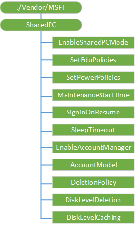

# SharedPC 的 CSP

SharedPC 配置服务提供程序用于为共享电脑使用配置设置。

下图显示的 SharedPC 配置服务提供程序管理对象以树格式由开放移动联盟设备管理 (OMA DM)，OMA 客户端资源调配和企业 DM。

**./Vendor/MSFT/SharedPC**  
SharedPC 配置服务提供程序的根节点。

受支持的操作是获得。

**EnableSharedPCMode**  
一个布尔值，它指定是否启用共享 PC 模式。

支持的操作包括获取和替换。

将该值设置为 True 的触发器配置为共享 PC 模式设备的操作。

默认值为 False。

**SetEduPolicies**  
可选项。 一个布尔值，它指定配置 SharedPC 模式时，应设置为一个教育环境定义的策略。

>  **请注意** 如果使用，需要在**EnableSharedPCMode**节点上操作之前设置此值。

 

支持的操作包括获取和替换。

默认值为 True。

**SetPowerPolicies**  
可选项。 一个布尔值，它指定配置 SharedPC 模式时，应设置电源策略。

>  **请注意** 如果使用，需要在**EnableSharedPCMode**节点上操作之前设置此值。

 

支持的操作包括获取和替换。

默认值为 True。

**MaintenanceStartTime**  
可选项。 一个整数值，指定每日维护时间的开始时间。 在几分钟内给出从午夜。 范围是 0-1440年。

>  **请注意** 如果使用，需要在**EnableSharedPCMode**节点上操作之前设置此值。

 

支持的操作包括获取和替换。

默认值为 0 (12 AM)。

**SignInOnResume**  
可选项。 一个布尔值，如果设置为 True，则需要的符号中只要设备唤醒从睡眠模式。

>  **请注意** 如果使用，需要在**EnableSharedPCMode**节点上操作之前设置此值。

 

支持的操作包括获取和替换。

默认值为 True。

**SleepTimeout**  
可选项。 一个整数值，以秒为单位的设备在用户签出之前位于登录屏幕中指定的时间。 将此值设置为 0 可以防止睡眠超时发生。

>  **请注意** 如果使用，需要在**EnableSharedPCMode**节点上操作之前设置此值。

 

支持的操作包括获取和替换。

默认值为 3600 （1 小时）。

**EnableAccountManager**  
一个布尔值，使客户经理共享 PC 模式。

>  **请注意** 如果使用，需要在**EnableSharedPCMode**节点上操作之前设置此值。

 

支持的操作包括获取和替换。

默认值为 True。

**AccountModel**  
配置允许哪种类型的帐户使用电脑。

>  **请注意** 如果使用，需要在**EnableSharedPCMode**节点上操作之前设置此值。

 

支持的操作包括获取和替换。

下面的列表显示了受支持的值︰

-   0 （缺省值）-允许仅来宾帐户。
-   1-只被启用加入域的帐户。
-   2 的允许使用域加入和来宾帐户。

**DeletionPolicy**  
删除帐户时，请配置此选项。

>  **请注意** 如果使用，需要在**EnableSharedPCMode**节点上操作之前设置此值。

 

支持的操作包括获取和替换。

下面的列表显示了受支持的值︰

-   0-立即删除。
-   1 （缺省值）-删除磁盘空间阈值。

**DiskLevelDeletion**  
设置缓存的帐户将被删除，以释放磁盘空间之前，在 PC 上剩余磁盘空间的百分比。 将首先删除时间最长的已被停用的帐户。

>  **请注意** 如果使用，需要在**EnableSharedPCMode**节点上操作之前设置此值。

 

默认值为 25。

例如，如果**DiskLevelCaching**号设置为 50， **DiskLevelDeletion**号设置为 25 （这两个默认值）。 超过 25%的可用磁盘空间时，帐户将被缓存。 如果可用磁盘空间低于 25%（删除编号） 在维护期间，帐户不会被删除 （旧姓氏使用的名字），超过 50%（缓存数） 的可用磁盘空间之前。 帐户将立即被删除从一个帐户的符号如果删除阈值下的可用空间和磁盘空间是非常低，无论是否 PC 正在使用中。

支持的操作包括获取和替换。

**DiskLevelCaching**  
设置停止删除缓存的帐户之前应该有一台电脑的可用磁盘空间的百分比。

>  **请注意** 如果使用，需要在**EnableSharedPCMode**节点上操作之前设置此值。

 

默认值为 50。

例如，如果**DiskLevelCaching**号设置为 50， **DiskLevelDeletion**号设置为 25 （这两个默认值）。 超过 25%的可用磁盘空间时，帐户将被缓存。 如果可用磁盘空间低于 25%（删除编号） 在维护期间，帐户不会被删除 （旧姓氏使用的名字），超过 50%（缓存数） 的可用磁盘空间之前。 帐户将立即被删除从一个帐户的符号如果删除阈值下的可用空间和磁盘空间是非常低，无论是否 PC 正在使用中。

## 相关的主题

[配置服务提供程序的引用](configuration-service-provider-reference.md)

 

 

