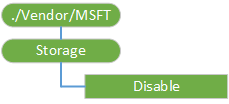

# 存储 CSP

存储企业配置服务提供程序用于配置存储卡设置。 目前，唯一需要配置的设置是启用或禁用存储卡。

> **请注意** 存储 CSP 不再支持 Windows 10 中，它仅支持在 Windows 10 移动向后兼容性。 使用系统/AllowStorageCard 中[策略的 CSP](policy-configuration-service-provider.md) 。

 

下面的关系图以树格式显示存储配置服务提供程序。

**禁用**  
必需。 一个布尔值，指定是否要启用或禁用存储卡。 如果值为**True**禁用存储卡。 如果值为**False**使存储卡。 默认值为**False**。 值是区分大小写。

支持的操作包括获取和替换。

> **请注意**  如果设备返回一个 404 错误代码时服务器将 Get 命令应用于./Vendor/MSFT/Storage/禁用，则意味着该设备没有 SD 卡。

 

## 相关的主题

[配置服务提供程序的引用](configuration-service-provider-reference.md)

 

 

