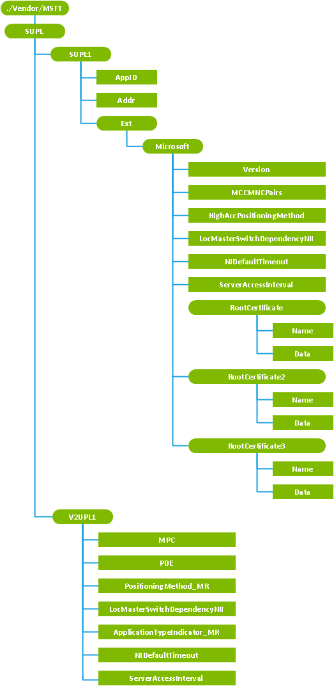

# <a name="supl-csp"></a>SUPL CSP


SUPL 配置服务提供程序用于配置客户端的位置上下, 表中所示。

<table>
<colgroup>
<col width="20%" />
<col width="40%" />
<col width="40%" />
</colgroup>
<thead>
<tr class="header">
<th>位置服务</th>
<th>SUPL</th>
<th>V2 UPL</th>
</tr>
</thead>
<tbody>
<tr class="odd">
<td><p>连接类型</p></td>
<td><p>CDMA 之外的所有连接</p></td>
<td><p>CDMA</p></td>
</tr>
<tr class="even">
<td><p>配置</p></td>
<td><ul>
<li><p>推入到 GNSS 驱动程序配置 SUPL 行为所需的设置︰</p>
<ul>
<li><p>家庭 SUPL (H SLP) 服务器的地址。</p></li>
<li><p>H SLP 服务器证书。</p></li>
<li><p>定位的方法。</p></li>
<li><p>默认情况下使用的协议版本。</p></li>
</ul></li>
<li><p>MCC/mnc 值对用于指定哪些网络的 UUIC SUPL 帐户匹配。</p></li>
</ul></td>
<td><ul>
<li><p>服务器地址 — — 不受信任模式移动定位中心。</p></li>
<li><p>对于不受信任模式使用 MPC 的定位方法。</p></li>
</ul></td>
</tr>
</tbody>
</table>

 

将系统重新配置 SUPL 或 V2 UPL 连接，每次重新启动设备时，插入新 UICC，或新设置调配使用 OMA 客户端资源调配，OMA DM 或测试工具。 在漫游模式下的设备时，它将恢复为移动站独立模式，在其中仅内置 – 使用 Microsoft 位置的组件。

下图显示了 SUPL 配置服务提供程序管理对象以树格式由 OMA DM 和 OMA 客户端资源调配使用。

> **请注意**  此配置服务提供商要求使用 ID\_CAP\_CSP\_基础功能从网络配置应用程序进行访问。

 




<a href="" id="supl1"></a>**SUPL1**  
对于 SUPL 必需。 定义 SUPL 启用终端 （集） 节点的帐户。 在给定的时间支持只有一个 SUPL 帐户。

<a href="" id="appid"></a>**应用程序标识**  
必需。 对于 SUPL AppID 将自动设置为`"ap0004"`。 这是一个只读的值。

<a href="" id="addr"></a>**地址**  
可选项。 指定非代理模式下的家庭 SUPL 定位平台 (H SLP) 服务器的地址。 值被指定为完全限定的域名，并指定为一个整数格式的*服务器*使用的端口的服务器地址︰*端口*。

如果不指定此值，则该设备会推断出 IMSI SUPL 标准中所规定的 H SLP 地址。 若要使用自动生成的基于 IMSI H SLP 地址，mnc 长度必须正确设置 UICC 上。 通常情况下，此值为 2 或 3。

对于 OMA DM，如果此节点的格式不正确项将被忽略并将返回一个错误，但配置服务提供程序将继续处理其余的参数。

<a href="" id="version"></a>**版本**  
可选项。 决定要使用的 SUPL 协议的版本。 对于 SUPL 1.0，将此值设置为`1`。 SUPL 2.0 将此值设置为`2`。 默认值为 1。

<a href="" id="mccmncpairs"></a>**MCCMNCPairs**  
必需。 列出所有的移动运营商所拥有的 MCC 和 mnc 对。 此列表用于验证 UICC 匹配网络，并且可以使用 SUPL。 当 UICC 和网络不匹配时，该设备使用的默认位置服务，并且不使用 SUPL。

此值是一个字符串的格式"(X1,Y1)(X2,Y2)...（Yn Xn)"，其中`X`是 MCC 和`Y`为 mnc 是否。

对于 OMA DM，如果此节点的格式不正确项将被忽略并将返回一个错误，但配置服务提供程序将继续处理其余的参数。

<a href="" id="highaccpositioningmethod"></a>**HighAccPositioningMethod**  
可选项。 指定 SUPL 客户端将使用移动的起源的位置请求的定位方法。 值可以是下列整数之一︰

<table>
<colgroup>
<col width="15%" />
<col width="85%" />
</colgroup>
<thead>
<tr class="header">
<th>值</th>
<th>说明</th>
</tr>
</thead>
<tbody>
<tr class="odd">
<td><p>0</p></td>
<td><p>无︰ 该设备使用的默认定位方法。 在这一默认模式，GNSS 从 Microsoft 定位服务获取 （注入时间、 粗糙位置注入和 ephemeris 数据） 的协助。</p></td>
</tr>
<tr class="even">
<td><p>1</p></td>
<td><p>移动站辅助︰ 设备与 H SLP 服务器联系以获得职位。 H SLP 进行计算的位置，并将其返回到设备。</p></td>
</tr>
<tr class="odd">
<td><p>2</p></td>
<td><p>移动站根据︰ 设备位置帮助数据 （almanac ephemeris 数据、 时间和粗糙的初始位置，该设备） 从服务器上获取 H SLP，和设备使用此信息来帮助获取修复的 GPS。 所有位置计算的设备中都完成。</p></td>
</tr>
<tr class="even">
<td><p>3</p></td>
<td><p>移动站独立︰ 设备从 Microsoft 位置服务获取所需的协助。</p></td>
</tr>
<tr class="odd">
<td><p>4</p></td>
<td><p>OTDOA</p></td>
</tr>
<tr class="even">
<td><p>5</p></td>
<td><p>AFLT</p></td>
</tr>
</tbody>
</table>

 

默认值为 0。 默认的方法在 Windows 设备提供了高质量协助 GNSS 定位的移动的起源的位置请求不加载移动运营商网络或位置服务。

> **重要**  移动站协助、 OTDOA 和 AFLT 定位方法只必须配置用于测试目的。

 

对于 OMA DM，如果此节点的格式不正确项将被忽略并将返回一个错误，但配置服务提供程序将继续处理其余的参数。

<a href="" id="locmasterswitchdependencynii"></a>**LocMasterSwitchDependencyNII**  
可选项。 布尔值。 指定是否**设置**中的**位置**屏幕上的位置切换还用于管理 SUPL 网络启动 (NI) 请求的位置。 如果该值设置为 0，NI 行为是独立于当前的位置切换设置。 如果该值设置为 1，NI 行为遵循当前的位置切换设置。 默认值为 1。

此值管理 SUPL 和 v2 的设置 UPL。 如果将设备配置为 SUPL 和 V2 UPL 并且这些值不同，将始终使用 SUPL 设置。

<table>
<colgroup>
<col width="33%" />
<col width="33%" />
<col width="33%" />
</colgroup>
<thead>
<tr class="header">
<th>设置位置切换</th>
<th>LocMasterSwitchDependencyNII 设置</th>
<th>允许的 NI 请求处理</th>
</tr>
</thead>
<tbody>
<tr class="odd">
<td><p>开启</p></td>
<td><p>0</p></td>
<td><p>是</p></td>
</tr>
<tr class="even">
<td><p>开启</p></td>
<td><p>1</p></td>
<td><p>是</p></td>
</tr>
<tr class="odd">
<td><p>关闭</p></td>
<td><p>0</p></td>
<td><p>是</p></td>
</tr>
<tr class="even">
<td><p>关闭</p></td>
<td><p>1</p></td>
<td><p>否 （除非设置为 privacyOverride）</p></td>
</tr>
</tbody>
</table>

 

当设置为 Off 时位置切换并此值设置为 1 时，下列应用程序请求将会失败︰

-   `noNotificationNoVerification`

-   `notificationOnly`

-   `notificationAndVerficationAllowedNA`

-   `notificationAndVerficationDeniedNA`

但是，如果`privacyOverride`设置将在邮件中，返回的位置。

当位置切换设置为 Off，并且此值设置为 0 时，位置切换不会阻止 SUPL 网络发起的请求处理。

对于 OMA DM，如果此节点的格式不正确项将被忽略并将返回一个错误，但配置服务提供程序将继续处理其余的参数。

<a href="" id="nidefaulttimeout"></a>**NIDefaultTimeout**  
可选项。 以秒为单位网络启动位置请求显示给用户，在等待响应时和在执行默认操作之前的时间。 默认值为 30 秒。 建议 20 和 60 秒之间的一个值。

此值管理 SUPL 和 v2 的设置 UPL。 如果将设备配置为 SUPL 和 V2 UPL 并且这些值不同，将始终使用 SUPL 设置。

<a href="" id="serveraccessinterval"></a>**ServerAccessInterval**  
可选项。 整数。 以秒为单位移动起源于请求发送到服务器以避免重载移动运营商网络之间定义的最小时间间隔。 默认值为 60。

<a href="" id="rootcertificate"></a>**RootCertificate**  
必需。 指定为 H SLP 服务器的根证书。 Windows 不支持不安全模式。 如果未包含此节点，配置服务提供程序将失败，但可能不会返回一个特定的错误。

<a href="" id="rootcertificate-name"></a>**RootCertificate/名称**  
指定的字符串，格式*名称*.cer H SLP 根证书的名称。

<a href="" id="rootcertificate-data"></a>**RootCertificate/数据**  
Base 64 编码的 H SLP 根证书的 blob。

<a href="" id="rootcertificate2-name"></a>**RootCertificate2/名称**  
指定的字符串，格式*名称*.cer H SLP 根证书的名称。

<a href="" id="rootcertificate2-data"></a>**RootCertificate2/数据**  
Base 64 编码的 H SLP 根证书的 blob。

<a href="" id="rootcertificate3-name"></a>**RootCertificate3/名称**  
指定的字符串，格式*名称*.cer H SLP 根证书的名称。

<a href="" id="rootcertificate3-data"></a>**RootCertificate3/数据**  
Base 64 编码的 H SLP 根证书的 blob。

<a href="" id="v2upl1"></a>**V2UPL1**  
所需的 V2 为 CDMA UPL。 指定用户平面位置的帐户设置和 IS-801 个 CDMA。 在给定的时间支持只有一个帐户。

<a href="" id="mpc"></a>**MPC**  
可选项。 *Ip 地址*格式的移动定位中心 (MPC) 的地址︰*端口号*。 对于不受信任的操作模式，此参数是必需参数和 PDE 参数必须为空。

<a href="" id="pde"></a>**PDE**  
可选项。 地址的位置确定实体 (PDE)，在格式*ip 地址*︰*端口号*。 对于不受信任模式下的操作，此参数必须为空。

<a href="" id="positioningmethod-mr"></a>**PositioningMethod\_先生**  
可选项。 指定 SUPL 客户端将使用移动的起源的位置请求的定位方法。 值可以是下列整数之一︰

<table>
<colgroup>
<col width="15%" />
<col width="85%" />
</colgroup>
<thead>
<tr class="header">
<th>值</th>
<th>说明</th>
</tr>
</thead>
<tbody>
<tr class="odd">
<td><p>0</p></td>
<td><p>无︰ 该设备使用的默认定位方法。 在这一默认模式，GNSS 从 Microsoft 定位服务获取 （注入时间、 粗糙位置注入和 ephemeris 数据） 的协助。</p></td>
</tr>
<tr class="even">
<td><p>1</p></td>
<td><p>移动站辅助︰ 设备与 H SLP 服务器联系以获得职位。 H SLP 进行计算的位置，并将其返回到设备。</p></td>
</tr>
<tr class="odd">
<td><p>2</p></td>
<td><p>移动站根据︰ 设备位置帮助数据 （almanac ephemeris 数据、 时间和粗糙的初始位置，该设备） 从服务器上获取 H SLP，和设备使用此信息来帮助获取修复的 GPS。 所有位置计算的设备中都完成。</p></td>
</tr>
<tr class="even">
<td><p>3</p></td>
<td><p>移动站独立︰ 设备从 Microsoft 位置服务获取所需的协助。</p></td>
</tr>
<tr class="odd">
<td><p>4</p></td>
<td><p>AFLT</p></td>
</tr>
</tbody>
</table>

 

默认值为 0。 默认的方法提供了高质量协助 GNSS 定位的移动的起源的位置请求不加载移动运营商网络或位置服务。

>  **重要**  仅用于测试目的必须配置移动站协助和 AFLT 定位方法。

 

对于 OMA DM，如果此节点的格式不正确项将被忽略并将返回一个错误，但配置服务提供程序将继续处理其余的参数。

<a href="" id="locmasterswitchdependencynii"></a>**LocMasterSwitchDependencyNII**  
可选项。 布尔值。 指定是否**设置**中的**位置**屏幕上的位置切换还用于管理网络启动位置的请求。 如果该值设置为 0，NI 行为是独立于当前的位置切换设置。 如果该值设置为 1，NI 行为遵循当前的位置切换设置。 对于 CDMA 设备，此值必须设置为 1。 默认值为 1。

此值管理 SUPL 和 v2 的设置 UPL。 如果将设备配置为 SUPL 和 V2 UPL 并且这些值不同，将始终使用 SUPL 设置。

<table>
<colgroup>
<col width="33%" />
<col width="33%" />
<col width="33%" />
</colgroup>
<thead>
<tr class="header">
<th>设置位置切换</th>
<th>LocMasterSwitchDependencyNII 设置</th>
<th>允许的 NI 请求处理</th>
</tr>
</thead>
<tbody>
<tr class="odd">
<td><p>开启</p></td>
<td><p>0</p></td>
<td><p>是</p></td>
</tr>
<tr class="even">
<td><p>开启</p></td>
<td><p>1</p></td>
<td><p>是</p></td>
</tr>
<tr class="odd">
<td><p>关闭</p></td>
<td><p>0</p></td>
<td><p>是</p></td>
</tr>
<tr class="even">
<td><p>关闭</p></td>
<td><p>1</p></td>
<td><p>否 （除非设置为 privacyOverride）</p></td>
</tr>
</tbody>
</table>

 

当设置为 Off 时位置切换并此值设置为 1 时，下列应用程序请求将会失败︰

-   `noNotificationNoVerification`

-   `notificationOnly`

-   `notificationAndVerficationAllowedNA`

-   `notificationAndVerficationDeniedNA`

但是，如果`privacyOverride`设置将在邮件中，返回的位置。

当位置切换设置为 Off，并且此值设置为 0 时，位置切换不会阻止 SUPL 网络发起的请求处理。

对于 OMA DM，如果此节点的格式不正确项将被忽略并将返回一个错误，但配置服务提供程序将继续处理其余的参数。

<a href="" id="applicationtypeindicator-mr"></a>**ApplicationTypeIndicator\_先生**  
必需。 此值必须始终设置为`00000011`。

<a href="" id="nidefaulttimeout"></a>**NIDefaultTimeout**  
可选项。 以秒为单位网络启动位置请求显示给用户，在等待响应时和在执行默认操作之前的时间。 默认值为 30 秒。 建议 20 和 60 秒之间的一个值。

此值管理 SUPL 和 v2 的设置 UPL。 如果将设备配置为 SUPL 和 V2 UPL 并且这些值不同，将始终使用 SUPL 设置。

<a href="" id="serveraccessinterval"></a>**ServerAccessInterval**  
可选项。 整数。 以秒为单位移动起源于请求发送到服务器以避免重载移动运营商网络之间定义的最小时间间隔。 默认值为 60。

## <a name="unsupported-nodes"></a>不支持的节点


在 Windows 设备上不支持以下可选节点。

-   ProviderID

-   名称

-   PrefConRef

-   ToConRef

-   ToConRef /&lt;X&gt;

-   ToConRef /&lt;X&gt;/ConRef

-   AddrType

如果配置应用程序尝试设置、 删除或查询这些节点，表示未实现此节点的响应将返回超过 OMA DM。 在 OMA 客户端资源调配，以设置此节点的请求将被忽略并配置服务提供程序将继续处理其他节点。

如果移动运营商需要与 H SLP 通过特定连接，而不是默认的蜂窝连接，进行通信，则这必须通过使用配置[厘米\_CellularEntries 配置服务提供商](cm-cellularentries-csp.md)和[厘米\_ProxyEntries 配置服务提供商](cm-proxyentries-csp.md)映射 H SLP 服务器具有所需的连接。

## <a name="oma-client-provisioning-examples"></a>OMA 客户端资源调配示例


添加新的服务器配置信息 H SLP SUPL 有关。 必须将以斜体显示的值替换为正确设置移动运营商网络。 有效的二进制 blob 必须包括根证书数据值。

``` syntax
<?xml version="1.0" encoding="utf-8"?>
<wap-provisioningdoc>
  <characteristic type="SUPL">
    <characteristic type="SUPL1">
      <parm name="Addr" value="supl.abc.def.example.com: 7777" />
      <characteristic type="Ext">
      <characteristic type="Microsoft">
      <characteristic type="RootCertificate">
        <parm name="Name" value="certName.cer" />
        <parm name="Data" value="" datatype="binary"/>
      </characteristic>
         <parm name="MCCMNCPairs" value="(111,000)(222,111)(333,333)(444,222)" />
         <parm name="HighAccPositioningMethod" datatype="integer" value="0" />
         <parm name="LocMasterSwitchDependencyNII" datatype="integer" value="1" />
      </characteristic>
      </characteristic>
    </characteristic>
  </characteristic>
</wap-provisioningdoc>
```

将 SUPL 和 V2 UPL 帐户添加到相同的设备。 必须将以斜体显示的值替换为正确设置移动运营商网络。 有效的二进制 blob 必须包括根证书数据值。

``` syntax
<?xml version="1.0" encoding="utf-8"?>
<wap-provisioningdoc>
  <characteristic type="SUPL">
    <characteristic type="V2UPL1">
      <parm name="MPC" value="192.0.2.1:7777" />
      <parm name="PDE" value="192.0.2.1:7778" />
      <parm name="PositioningMethod_MR" datatype="integer" value="1" />
    </characteristic>
    <characteristic type="SUPL1">
      <parm name="Addr" value="supl.abc.def.example.com:7777" />
      <characteristic type="Ext">
      <characteristic type="Microsoft">
      <characteristic type="RootCertificate">
        <parm name="Name" value="certName.cer" />
        <parm name="Data" value="" datatype="binary"/>
      </characteristic>
         <parm name="MCCMNCPairs" value="(111,000)(222,111)(333,333)(444,222)" />
         <parm name="HighAccPositioningMethod" datatype="integer" value="2" />
         <parm name="LocMasterSwitchDependencyNII" datatype="integer" value="1" />
      </characteristic>
      </characteristic>
    </characteristic>
  </characteristic>
</wap-provisioningdoc>
```

## <a name="oma-dm-examples"></a>OMA DM 示例


向设备中添加 SUPL 帐户。 必须将以斜体显示的值替换为正确设置移动运营商网络。 有效的二进制 blob 必须包括根证书数据值。

``` syntax
<SyncML xmlns="SYNCML:SYNCML1.1">
    <SyncBody>
        <Add>
            <CmdID>Add FQDN</CmdID>
            <Item>
                <Target><LocURI>./Vendor/MSFT/SUPL/SUPL1/Addr</LocURI></Target>
                <Meta>
                <Format xmlns="syncml:metinf">chr</Format>
                </Meta>
                <Data>supl.abc.def.example.com:2222</Data>
            </Item>
        </Add>
        <Add>
            <CmdID>Add MCCMNC</CmdID>
            <Item>
                <Target><LocURI>./Vendor/MSFT/SUPL/SUPL1/Ext/Microsoft/MCCMNCPairs</LocURI></Target>
                <Meta>
                <Format xmlns="syncml:metinf">chr</Format>
                </Meta>
                <Data>(111,000)(222,111)(333,333)(444,222)</Data>
            </Item>
        </Add>
        <Add>
            <CmdID>Add HighAccPositioningMethod</CmdID>
            <Item>
                <Target><LocURI>./Vendor/MSFT/SUPL/SUPL1/Ext/Microsoft/HighAccPositioningMethod</LocURI></Target>
                <Meta>
                <Format xmlns="syncml:metinf">int</Format>
                </Meta>
                <Data>2</Data>
            </Item>
        </Add>
        <Add>
            <CmdID>Add LocMasterSWDepend</CmdID>
            <Item>
                <Target><LocURI>./Vendor/MSFT/SUPL/SUPL1/Ext/Microsoft/LocMasterSwitchDependencyNII</LocURI></Target>
                <Meta>
                <Format xmlns="syncml:metinf">int</Format>
                </Meta>
                <Data>1</Data>
            </Item>
        </Add>
        <Add>
            <CmdID>Add Cert name</CmdID>

            <Item>
                <Target><LocURI>./Vendor/MSFT/SUPL/SUPL1/Ext/Microsoft/RootCertificate/Name</LocURI></Target>
                <Meta>
                <Format xmlns="syncml:metinf">chr</Format>
                </Meta>
                <Data>certName.cer</Data>
            </Item>
        </Add>
        <Add>
            <CmdID>Add Cert data - 200</CmdID>

            <Item>
                <Target><LocURI>./Vendor/MSFT/SUPL/SUPL1/Ext/Microsoft/RootCertificate/Data</LocURI></Target>
                <Meta>
                <Format xmlns="syncml:metinf">b64</Format>
                </Meta>
                <Data></Data>
            </Item>
        </Add>
        <Final/>
    </SyncBody>
</SyncML>
```

## <a name="microsoft-custom-elements"></a>Microsoft 的自定义元素


下表显示了此配置服务提供程序支持 OMA 客户端资源调配的 Microsoft 自定义元素。

<table>
<colgroup>
<col width="50%" />
<col width="50%" />
</colgroup>
<thead>
<tr class="header">
<th>元素</th>
<th>可用</th>
</tr>
</thead>
<tbody>
<tr class="odd">
<td><p>参数查询</p></td>
<td><p>是</p></td>
</tr>
<tr class="even">
<td><p>特征查询</p></td>
<td><p>是</p>
<p>递归查询︰ 否</p>
<p>顶级查询︰ 否</p></td>
</tr>
</tbody>
</table>

 

## <a name="related-topics"></a>相关的主题


[配置服务提供程序的引用](configuration-service-provider-reference.md)

 

 


