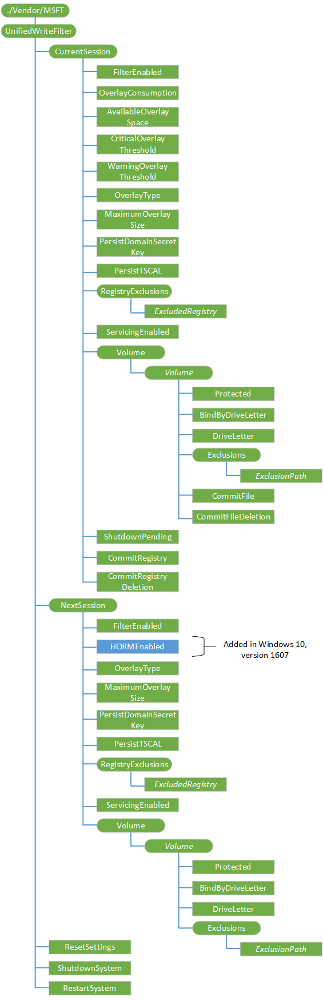

# UnifiedWriteFilter 的 CSP

UnifiedWriteFilter (UWF) 配置服务提供程序使 IT 管理员能够远程管理来帮助保护物理存储介质包括任何可写入存储类型 UWF。

> **请注意** UnifiedWriteFilter CSP 只支持 Windows 10 企业和 Windows 10 教育。

 

下面的关系图以树格式显示 UWF 配置服务提供程序。

**CurrentSession**  
必需。 表示当前的 UWF 配置中当前会话 （电源重启）。

**CurrentSession/FilterEnabled**  
必需。 指示当前会话是否启用 UWF。

唯一受支持的操作是获得。

**CurrentSession/OverlayConsumption**  
必需。 当前的大小，以兆字节为单位，UWF 覆盖。

唯一受支持的操作是获得。

**CurrentSession/AvailableOverlaySpace**  
必需。 （兆字节），可用于 UWF 覆盖的可用空间量。

唯一受支持的操作是获得。

**CurrentSession/CriticalOverlayThreshold**  
必需。 临界阈值大小 （以兆字节为单位）。 UWF 将发送 UWF 覆盖大小达到或超过此值时的临界阈值通知事件。

支持的操作包括获取和替换。

**CurrentSession/WarningOverlayThreshold**  
必需。 警告阈值大小，以兆字节为单位。 UWF 将发送警告阈值通知事件的 UWF 覆盖大小达到或超过此值时。

支持的操作包括获取和替换。

**CurrentSession/OverlayType**  
必需。 指示当前会话中的覆盖的类型。

唯一受支持的操作是获得。

**CurrentSession/MaximumOverlaySize**  
必需。 指示的最大高速缓存大小，以兆字节表示的当前会话中覆盖。

唯一受支持的操作是获得。

**CurrentSession/PersisitDomainSecretKey**  
必需。 指示此域机密的注册表项是否在注册表的排除列表中。 如果注册表项不是在排除列表中，请不要重新启动后不保留更改。

唯一受支持的操作是获得。

**CurrentSession/PersistTSCAL**  
必需。 指示是否在 UWF 注册表的排除列表中的终端服务器客户端访问许可证 (TSCAL) 注册表项。 如果注册表项不是在排除列表中，请不要重新启动后不保留更改。

唯一受支持的操作是获得。

**CurrentSession/RegistryExclusions**  
必需。 包含所有注册表排除的根节点。

**CurrentSession/RegistryExclusions / ***_ExcludedRegistry_**  
可选项。 注册表项在注册表的排除列表中的 UWF 在当前会话中。

唯一受支持的操作是获得。

**CurrentSession/ServicingEnabled**  
必需。 指示当服务在当前会话中启用。

唯一受支持的操作是获得。

**CurrentSession/卷**  
必需。 要包含 UWF 受当前会话中的所有卷的根节点。

**CurrentSession/卷 / ***_卷_**  
可选项。 在当前会话中代表特定的卷。

* *CurrentSession/卷/*卷*/ 保护 * *  
必需。 指示是否卷目前受 UWF 在当前会话中。

唯一受支持的操作是获得。

* *CurrentSession/卷/*卷*/BindByDriveLetter**  
必需。 表明该卷在当前会话中使用的绑定类型。

唯一受支持的操作是获得。

* *CurrentSession/卷/*卷*/DriveLetter**  
必需。 卷的驱动器号。 如果卷没有驱动器号，则此值为 NULL。

唯一受支持的操作是获得。

* *CurrentSession/卷/*卷*/Exclusions**  
必需。 根节点包含该卷的所有文件排除。

* *CurrentSession/卷/*卷*/排除 / ***_ExclusionPath_**  
可选项。 一个字符串，包含该文件或文件夹相对于该卷的完整路径。

唯一受支持的操作是获得。

* *CurrentSession/卷/*卷*/CommitFile**  
必需。 此方法为指定的文件在受保护的统一编写筛选器 (UWF) 的卷上的物理卷从重叠提交更改。

支持的操作包括获取和执行。

* *CurrentSession/卷/*卷*/CommitFileDeletion**  
必需。 此方法删除指定的文件，并提交给物理卷删除。

支持的操作包括获取和执行。

**CurrentSession/ShutdownPending**  
必需。 此值为 True，如果系统即将关闭。 否则，它将为 False。

唯一受支持的操作是获得。

**CurrentSession/CommitRegistry**  
必需。 此方法将更改提交到指定的注册表项和值。

支持的操作包括获取和执行。

**CurrentSession/CommitRegistryDeletion**  
必需。 此方法删除指定的注册表项或注册表值并提交删除操作。

支持的操作包括获取和执行。

**NextSession**  
必需。

（重新启动） 后的下一步 UWF 会话包含设置根节点。

**NextSession/FilterEnabled**  
必需。 布尔值，指示是否为下一步的会话启用 UWF。

支持的操作包括获取和替换。

**NextSession/HORMEnabled**  
添加到 Windows 10，1607年版本中。 必需。 布尔值，该值指示如果一次休眠 / 下一个会话启用恢复许多 (HORM)。

支持的操作包括获取和替换。

**NextSession/OverlayType**  
必需。 表示下一个会话的覆盖的类型。

支持的操作包括获取和替换。

**NextSession/MaximumOverlaySize**  
必需。 指示的最大高速缓存大小，以兆字节为单位下, 一次会话的重叠。

支持的操作包括获取和替换。

**NextSession/PersisitDomainSecretKey**  
必需。 指示此域机密的注册表项是否在注册表的排除列表中。 如果注册表项不是在排除列表中，请不要重新启动后不保留更改。

支持的操作包括获取和替换。

**NextSession/PersistTSCAL**  
必需。 指示是否在 UWF 注册表的排除列表中的终端服务器客户端访问许可证 (TSCAL) 注册表项。 如果注册表项不是在排除列表中，请不要重新启动后不保留更改。

支持的操作包括获取和替换。

**NextSession/RegistryExclusions**  
必需。 根节点包含所有注册表排除下一个会话。

支持的操作是添加，删除，并替换。

**NextSession/RegistryExclusions / ***_ExcludedRegistry_**  
可选项。 UWF 注册表项在注册表的排除列表中。

支持的操作是添加，删除，获取和替换。

**NextSession/ServicingEnabled**  
必需。 指示何时启用服务。

支持的操作包括获取和替换。

**NextSession/卷**  
必需。 根节点包含下一个会话受 UWF 的所有卷。

**NextSession/卷 / ***_卷_**  
可选项。 在下一次会话中代表特定的卷。

支持的操作是添加，删除，并替换。

* *NextSession/卷/*卷*/ 保护 * *  
必需。 指示是否卷目前受 UWF 在下次会话。

支持的操作包括获取和替换。

* *NextSession/卷/*卷*/BindByDriveLetter**  
必需。 表明该卷在下次会话中使用的绑定类型。

支持的操作包括获取和替换。

* *NextSession/卷/*卷*/DriveLetter**  
卷的驱动器号。 如果卷没有驱动器号，则此值为 NULL。

唯一受支持的操作是获得。

* *NextSession/卷/*卷*/Exclusions**  
必需。 根节点包含此卷的所有文件排除在下次会话。

* *NextSession/卷/*卷*/排除 / ***_ExclusionPath_**  
可选项。 一个字符串，包含该文件或文件夹相对于该卷的完整路径。

支持的操作是添加，删除，获取和替换。

**ResetSettings**  
必需。 将 UWF 设置恢复到安装时被捕获的原始状态。

支持的操作包括获取和执行。

**ShutdownSystem**  
必需。 安全地关闭系统由 UWF，保护，即使覆盖已满。

支持的操作包括获取和执行。

**RestartSystem**  
必需。 安全地重新启动 UWF，通过受保护的系统，即使覆盖已满。

支持的操作包括获取和执行。

## 相关的主题

[配置服务提供程序的引用](configuration-service-provider-reference.md)

 

 

