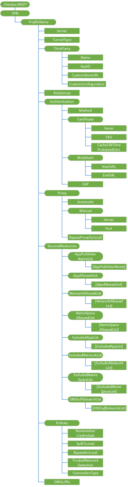

# VPN 的 CSP

VPN 配置服务提供程序允许 MDM 服务器配置 VPN 配置文件的设备。 Windows 10 支持 IKEv2 VPN 和 SSL VPN 配置文件。 IKEv2 有关的信息，请参阅[配置 IKEv2 基于远程访问](http://technet.microsoft.com/library/ff687731%28v=ws.10%29.aspx)。

> **请注意**  VPN 的 CSP 被否决 Windows 10 中，它仅支持在 Windows 10 移动向后兼容性。 而是使用[VPNv2 的 CSP](vpnv2-csp.md) 。

 

重要注意事项︰

-   对于 VPN 要求客户端证书，服务器必须首先部署 VPN 配置文件以确保在设备正常工作的 VPN 配置文件之前，先注册所需的客户端证书。 这是尤为重要，因为强制隧道 VPN。

-   VPN 配置命令必须包装与原子的命令，如下面的示例中所示。

-   支持每个 OMA 请求资源调配的只有一个 VPN 配置文件。 不支持多个 VPN 配置文件，每一个 OMA 消息请求。

-   对于 VPN 的 CSP，不能使用替换命令，除非该节点已存在。

下面的关系图以树格式显示 VPN 配置服务提供程序。

***ProfileName***  
唯一的字母数字标识符的配置文件。 配置式名称不能包含正斜杠 （/）。

值类型是 chr。 支持的操作包括获取，添加、 替换和删除。

**服务器**  
必需。 公共的或可路由的 IP 地址或 DNS 名称的 VPN 网关服务器场。 它可以指向外部 IP 网关或服务器场的虚拟 IP。

支持的操作是 Get，添加和替换。

值类型是 chr。 一些示例有︰ 208.23.45.130 或 vpn.contoso.com。

**TunnelType**  
可选，但需要部署第三方 IKEv2 VPN 配置文件时。 此版本支持 IKEv2 的值。

值类型是 chr。 支持的操作包括获取和添加。

**第三方**  
可选，但需要部署第三方 SSL VPN 插件配置文件。 定义一组应用于 SSL VPN 配置文件设置的设置。

支持的操作包括获取和添加。

**第三方/名称**  
需要第三方定义用于 SSL VPN 配置文件设置。

值类型是 chr。 支持的操作包括获取和添加。

有效值︰

-   JunOS 脉冲

-   使 SonicWall 移动连接

-   F5 大 IP 边缘客户端

-   检查点移动 VPN

**第三方/应用程序标识**  
可选，但需要部署私有企业店面从一个第三方 SSL VPN 插件应用程序时。 这是与存储应用程序相关联的产品 id。 客户端将使用此产品 id 来确保只批准的插件初始化的企业。

值类型是 chr。 支持的操作是 Get，添加、 替换和删除。

**第三方/CustomStoreURL**  
可选的但需要企业如果部署私有企业店面从一个第三方 SSL VPN 插件应用程序。 此节点指定第三方 SSL VPN 插件应用程序的 URL。

值类型是 chr。 支持的操作是 Get，添加、 替换和删除。

**第三方/CustomConfiguration**  
可选项。 这是 HTML 编码的 SSL VPN 插件特定的配置部署到该设备以使其可用于 SSL VPN 插件的 XML blob。

值类型为 char。 支持的操作是 Get，添加、 替换和删除。

**RoleOrGroup**  
未实现。 可选项。

值类型为 char。 支持的操作是 Get，添加，删除和替换。

**身份验证**  
对于第三方 VPN 配置文件，但对于 IKEv2 为必需的可选节点。 这是一个集合的配置对象，以确保正确的身份验证策略使用基于所选设备上的 TunnelType。

支持的操作包括获取和添加。

**身份验证/方法**  
所需的 IKEv2 配置文件以及可选的第三方配置。 此参数指定要用于 VPN 客户端身份验证的身份验证提供程序。 只有 EAP 方法 IKEv2 配置文件支持。

支持的操作包括获取和添加。

值类型是 chr。

> **请注意** 对于 EAP，改为使用 EAP 身份验证 /。

 

**身份验证中的证书**  
可选的节点。 使用 VPN 时为最终用户启用简单身份验证体验的节点集合。 这和它的子节点不应使用 IKEv2 配置文件。

支持的操作包括获取和添加。

**颁发者的身份验证/证书**  
可选项。 带有私钥存储在注册表或 TPM 中筛选出已安装的证书。 这可以用于配合 EKU 更精细的筛选。

值类型是 chr。 支持的操作是 Get，添加，删除和替换。

> **请注意** 不要 IKev2 配置文件中使用此元素。

 

**身份验证/证书/EKU**  
可选项。 此扩展密钥用法 (EKU) 元素用于带有私钥存储在注册表或 TPM 中筛选出已安装的证书。 可以使用此配合与颁发者进行更精细的筛选。

值类型是 chr。 支持的操作是 Get，添加，删除和替换。

> **请注意** 不要 IKev2 配置文件中使用此元素。

 

**身份验证/证书/CacheLifeTimeForProtectedCert**  
未实现。 可选项。

值类型是 int。 支持的操作是 Get，添加、 替换和删除。

**EAP 身份验证 /**  
所需 IKEv2 当选。 定义要用于 IKEv2 身份验证的 EAP blob。 您可以使用 EAP-MSCHAPv2 或 EAP-TLS。 EAP blob 是 HTML 编码中 EAP 主机配置架构定义的 XML。 您可以在[Microsoft EAP MsChapV2 架构](http://go.microsoft.com/fwlink/p/?LinkId=523885)和[Microsoft EAP TLS 架构](http://go.microsoft.com/fwlink/p/?LinkId=523884)查找架构。

支持的操作是 Get，添加和替换。

值类型是 chr。

**代理服务器**  
可选的节点。 若要启用的配置对象的集合，代理服务器支持 VPN 连接后。 此配置文件处于活动状态，连接时，将应用此配置文件定义的代理服务器。

支持的操作是添加，删除，并替换。

**代理/手册/服务器**  
可选项。 将此元素设置以及端口。 值为代理服务器地址为完全限定的主机名或 IP 地址，例如，proxy.constoso.com。

支持的操作是 Get，添加、 替换和删除。

值类型是 chr。

**代理/手册/端口**  
可选项。 设置此元素与服务器一起。 值为 1-65535，区域中的代理服务器端口号，例如 8080。

支持的操作是 Get，添加、 替换和删除。

值类型是 int。

**代理/BypassForLocal**  
可选项。 启用此设置后，任何对 intranet 区域中的资源的 web 请求将不发送到代理。 如果是 false，应禁用该设置和所有请求应都转到代理服务器。 在这种情况，设置已经启用并且 intranet 的请求不会路由到该代理。

支持的操作是 Get，添加、 替换和删除。

值类型是布尔值。

默认值为 False。

**SecuredResources**  
可选的节点。 定义包含资源的配置对象的集合，列出了哪些可以通过 VPN 进行保护。 仅当策略/SplitTunnel 元素被设置为 True 时应用允许的列表。 不支持 VPN 排除.

**SecuredResources/AppAllowedList/AppAllowedList**  
可选项。 指定一个或多个 ProductIDs 的企业业务线应用程序生成的窗口。 定义此元素后，然后所有来自指定的应用程序将受保护的通讯通过 VPN （假设定义受保护的网络允许访问）。 他们不能够连接直接绕过 VPN 连接。 自动触发配置文件时，这些应用程序自动触发 VPN。

支持的操作是获取、 添加、 替换和删除。

值类型是 chr。

示例包括 {F05DC613-E223-40AD-ABA9-CCCE04277CD9} 和 ContosoApp.ContosoCorp\_jlsnulm3s397u。

**SecuredResources/NetworkAllowedList/NetworkAllowedList**  
当策略/SplitTunnel 设置为可选，但所需的 IKEv2 配置文件，则返回 true。 指定一个或多个要通过 VPN 安全的 IP 范围。 连接到与此列表匹配的受保护资源的应用程序将通过 VPN 进行保护。 否则，他们将继续直接连接。 在格式 10.0.0.0/8 中定义的 IP 范围。 自动触发配置文件时，这些受保护的网络自动触发 VPN。

支持的操作是 Get，添加、 替换和删除。

值类型是 chr。

例如，172.31.0.0/16。

**SecuredResources/NameSpaceAllowedList/NameSpaceAllowedList**  
可选项。 指定一个或多个命名空间所需安全通过 VPN。 通过 VPN，到指定的命名空间的所有请求应受到都保护。 应用程序连接到命名空间是通过 VPN 安全。 否则，他们将继续直接连接。 命名空间定义格式\*。 corp.contoso.com。 如限制\*或\*。\* 或\*。 com。\* 不允许使用。 NetworkAllowedList 是 IKEv2 配置拆分隧道上正确路由通信的需要。

支持的操作是 Get，添加、 替换和删除。

值类型是 chr。

一个例子是\*。 corp.contoso.com。

**SecuredResources/ExcluddedAppList/ExcludedAppList**  
可选项。 指定一个或多个 ProductIDs 的企业业务线应用程序生成的窗口。 当定义该元素时，这些应用程序不应使用 VPN。 他们将直接连接和绕过 VPN 连接。

支持的操作是 Get，添加、 替换和删除。

值类型是 chr。

示例包括 {F05DC613-E223-40AD-ABA9-CCCE04277CD9} 和 ContosoApp.ContosoCorp\_jlsnulm3s397u。

**SecuredResources/ExcludedNetworkList/ExcludedNetworkList**  
可选项。 指定一个或多个 IP 地址，将永远不会使用 VPN。 任何应用程序连接到已配置的 IP 排除列表将直接使用互联网，并绕过 VPN。 值定义格式 10.0.0.0/8。

支持的操作是 Get，添加、 替换和删除。

值类型是 chr。

例如，172.31.0.0/16。

**SecuredResources/ExcludedNameSpaceList/ExcludedNameSpaceList**  
可选项。 指定一个或多个命名空间的主机将永远不会使用 VPN。 任何应用程序连接到已配置排除的主机列表将使用互联网，并绕过 VPN。 如限制\*或\*。\* 或\*。 com。\* 不允许使用。

支持的操作是 Get，添加、 替换和删除。

值类型是 chr。

一个例子是\*。 corp.contoso.com。

**SecuredResources/DNSSuffixSearchList/DNSSuffixSearchList**  
可选项。 指定一个或多个将被追加到短名称的 Url 对 DNS 解析和连接的 DNS 后缀。

支持的操作是 Get，添加、 替换和删除。

值类型是 chr。

一个示例是。 corp.contoso.com。

**策略**  
可选的节点。 配置对象的集合，您可以使用强制配置文件特定的限制。

**策略/SplitTunnel**  
可选项。 如果是 False，所有通信都转到强制隧道模式中的 VPN 网关。 如果是 True，只到已定义的受保护资源的特定通信转到 VPN 网关。

支持的操作是 Get，添加、 替换和删除。

值类型是布尔值。

默认值为 True。

**策略/ByPassForLocal**  
可选项。 当此设置为 True，则 VPN 客户端所在的 Wi-Fi 网络上可用的本地资源的请求可以绕过 VPN。 例如，如果 VPN 的企业策略需要强制隧道的 VPN，但企业打算允许远程用户进行本地连接到其家中的媒体中心，然后应设置此选项，为 True。 为本地子网流量，用户可以绕过 VPN。 当此选项设置为 False 时，该设置被禁用，并且允许无网例外。

支持的操作是 Get，添加、 替换和删除。

值类型是布尔值。

默认值为 False。

**策略/TrustedNetworkDetection**  
可选项。 当此设置被设置为 True 时，当用户在其公司的无线网络设备直接访问受保护的资源在哪里上无法连接 VPN。 如果是 False，VPN 连接通过公司的无线网络。 此节点的 DNSSuffix 节点设置，以检测该公司的无线网络上具有依赖项。

支持的操作是 Get，添加、 替换和删除。

值类型是布尔值。

默认值为 False。

**策略/连接**  
可选项。 有效值包括︰

-   触发︰ VPN 自动将连接应用程序需要连接到受保护的资源时。 使用 VPN 应用程序基于 VPN 的生命周期。 为优化电力资源的使用推荐的设置。

-   手动︰ 用户必须手动连接/断开 VPN。

支持的操作是 Get，添加和替换。

值类型是 chr。

默认值为 Triggering。

**DNSSuffix**  
可选，但它需要设置的主连接特定的 DNS 后缀。 支持的操作是 Get，添加，删除和替换。

值类型是 chr。

例如，corp.contoso.com。

## 相关的主题

[配置服务提供程序的引用](configuration-service-provider-reference.md)

 

 

