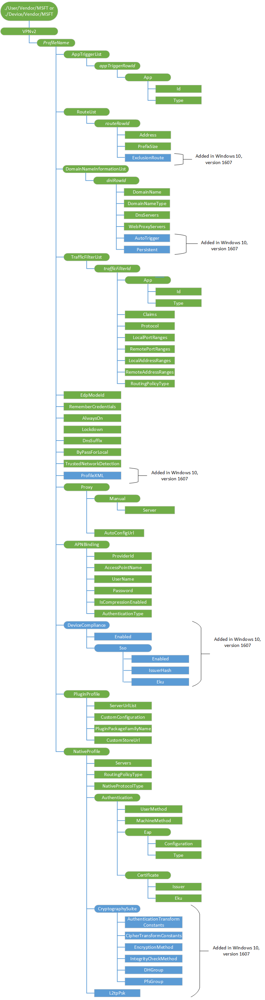

# <a name="vpnv2-csp"></a>VPNv2 的 CSP


VPNv2 配置服务提供程序允许移动设备管理 (MDM) 服务器配置 VPN 配置文件的设备。

以下是该 CSP 的要求︰

-   VPN 配置命令必须包装在原子中 SyncML 块。
-   为了获得最佳结果，配置 VPN 证书首先向 VPN 配置文件下之前推到设备。 如果您使用的 Windows 的信息保护 (WIP) （以前称为企业数据保护），则应配置 VPN 首先配置 WIP 策略之前。
-   而不是更改单独的属性，请按照以下步骤进行任何更改︰

    -   发送 ProfileName 要删除整个配置文件的删除命令。
    -   使用新的值包括在原子块中重新发送整个配置文件。

    在某些情况下可以更改某些属性直接，但我们不建议这样做。

Xsd 所有 EAP 方法的包装盒中，可以在以下位置找到︰

-   C:\\Windows\\架构\\EAPHost
-   C:\\Windows\\架构\\EAPMethods

下面的关系图以树格式显示 VPNv2 配置服务提供程序。



<a href="" id="device-or-user-profile"></a>**设备或用户的配置文件**  
为用户配置文件，使用**./User/Vendor/MSFT**路径并为设备配置文件，使用**./Device/Vendor/MSFT**路径。

<a href="" id="vpnv2-profilename"></a>**VPNv2 /***ProfileName*  
该配置文件的唯一字母数字标识符。 配置式名称不能包含正斜杠 （/）。

支持的操作包括获取，添加和删除。

> **请注意** 如果配置文件名称中有空格或其他非字母数字字符，它必须被正确地转义 URL 编码标准。

 

<a href="" id="vpnv2-profilename-apptriggerlist"></a>**VPNv2 /***ProfileName***/AppTriggerList**  
可选的节点。 设置为触发 VPN 应用程序的列表。 如果任何这些应用程序将启动并且 VPN 配置文件是当前活动的配置文件，则将触发此 VPN 配置文件进行连接。

<a href="" id="vpnv2-profilename-apptriggerlist-apptriggerrowid"></a>**VPNv2 /***ProfileName***/AppTriggerList/***appTriggerRowId*  
连续的整数标识符，它允许应用程序触发的指定多个应用程序的能力。 先后顺序必须从 0 开始，并且不应该跳过编号。

支持的操作包括获取，添加、 替换和删除。

<a href="" id="vpnv2-profilename-apptriggerlist-apptriggerrowid-app"></a>**VPNv2 /***ProfileName***/AppTriggerList/***appTriggerRowId***/App**  
应用程序节点位于行 id。

<a href="" id="vpnv2-profilename-apptriggerlist-apptriggerrowid-app-id"></a>**VPNv2 /***ProfileName***/AppTriggerList/***appTriggerRowId***/App/Id**  
应用程序标识为应用程序的包系列名称或文件路径。 类型推断的 id，并因此无法获取唯一的应用程序/类型字段中指定

<a href="" id="vpnv2-profilename-apptriggerlist-apptriggerrowid-app-type"></a>**VPNv2 /***ProfileName***/AppTriggerList/***appTriggerRowId***/App/Type**  
返回**Id 的应用程序**的类型。 此值可以是下列任一项︰

-   PackageFamilyName-此返回时，应用程序 Id 的值表示应用程序的 PackageFamilyName。 PackageFamilyName 是 Windows 应用商店应用程序的唯一名称。
-   文件路径-这返回时，应用程序 Id 的值表示应用程序的完整文件路径。 例如， `C:\Windows\System\Notepad.exe`。

值类型是 chr。 受支持的操作是获得。

<a href="" id="vpnv2-profilename-routelist-"></a>**VPNv2 /***ProfileName***/RouteList/**  
可选的节点。 路由添加到 VPN 接口的路由表的列表。 这是必需的拆分隧道情况下，VPN 服务器站点有多个默认网根据指派给该接口的 IP 的子网。

每台运行 TCP/IP 的计算机作出路由决定。 这些决定由 IP 路由表控制。 添加此节点下的值使用 VPN 接口后连接的路由更新路由表。 在此节点下的值表示 IP 路由的目标前缀。 目标前缀包含 IP 地址前缀和前缀长度。

添加以下路由允许网络堆栈来标识需要讲解拆分隧道 VPN 的 VPN 接口的通信。 某些 VPN 服务器可以配置此期间连接协商并不需要 VPN 配置文件中的此信息。 请与您的 VPN 服务器管理员联系以确定您是否需要此 VPN 配置文件中的信息。

<a href="" id="vpnv2-profilename-routelist-routerowid"></a>**VPNv2 /***ProfileName***/RouteList/***routeRowId*  
RouteList 连续的整数标识符。 这是必需的如果您要添加的路由。 先后顺序必须从 0 开始。

支持的操作包括获取，添加、 替换和删除。

<a href="" id="vpnv2-profilename-routelist-routerowid-address"></a>**VPNv2 /***ProfileName***/RouteList/***routeRowId***/Address**  
以 IPv4/v6 地址格式的前缀以及将用于确定要通过 VPN 接口发送的目标前缀的子网地址。 这是目标前缀的 IP 地址部分。

支持的操作包括获取，添加、 替换和删除。 值类型是 chr。 示例中，`192.168.0.0`

<a href="" id="vpnv2-profilename-routelist-routerowid-prefixsize"></a>**VPNv2 /***ProfileName***/RouteList/***routeRowId***/PrefixSize**  
子网前缀大小的目标前缀的路由条目的一部分。 这一点，以及地址将用于确定要穿 VPN 接口的目标前缀。

值类型是 int。 支持的操作包括获取，添加、 替换和删除。

<a href="" id="vpnv2-profilename-routelist-routerowid-exclusionroute"></a>**VPNv2 /***ProfileName***/RouteList/***routeRowId***/ExclusionRoute**  
添加到 Windows 10，1607年版本中。 一个布尔值，它指定要添加的路由应指向 VPN 接口或物理接口作为网关。 有效值︰

-   False （默认值）-此路由将通过 VPN 直接通信
-   True-此路由将通过物理接口直接通信。

支持的操作包括获取，添加、 替换和删除。

<a href="" id="vpnv2-profilename-domainnameinformationlist"></a>**VPNv2 /***ProfileName***/DomainNameInformationList**  
可选的节点。 名称解析策略表 (NRPT) 的 VPN 配置文件的规则。

名称解析策略表 (NRPT) 是一个表的命名空间和存储在 Windows 注册表中发出查询和处理响应时确定 DNS 客户端行为的相应设置。 NRPT 中的每一行代表其 DNS 客户端发出的查询的命名空间部分的规则。 在签发之前的名称解析查询，DNS 客户端查询 NRPT 来确定是否必须在查询中设置任何其他标志。 在收到响应，客户端再次查询 NRPT 检查有任何特殊的处理或策略要求。 如果没有 NRPT，在客户端运行，根据 DNS 服务器并在该接口上设置后缀。

<a href="" id="vpnv2-profilename-domainnameinformationlist-dnirowid"></a>**VPNv2 /***ProfileName***/DomainNameInformationList/***dniRowId*  
域的名称信息的顺序的整数标识符。 先后顺序必须从 0 开始。

支持的操作包括获取，添加、 替换和删除。

<a href="" id="vpnv2-profilename-domainnameinformationlist-dnirowid-domainname"></a>**VPNv2 /***ProfileName***/DomainNameInformationList/***dniRowId***/DomainName**  
用于指示该策略所应用到的命名空间。 当发出一个名称查询时，DNS 客户端比较下 DomainNameInformationList 以查找匹配的命名空间的所有查询中的名称。 此参数可以是以下类型之一︰

-   FQDN 的完全合格的域名称
-   后缀的域名后缀将附加到的简短名称查询的 DNS 解析。 若要指定后缀，前面添加**.** 为 DNS 后缀。

值类型是 chr。 支持的操作包括获取，添加、 替换和删除。

<a href="" id="vpnv2-profilename-domainnameinformationlist-dnirowid-domainnametype"></a>**VPNv2 /***ProfileName***/DomainNameInformationList/***dniRowId***/DomainNameType**  
返回命名空间的类型。 此值可以是下列项之一︰

-   FQDN-如果域名不预先以**.** 并且仅适用于指定主机的完全限定的域名 (FQDN)。
-   后缀-如果域名被预置以**.** 并应用于指定的命名空间，该命名空间中的所有记录以及所有子域。

值类型是 chr。 受支持的操作是获得。

<a href="" id="vpnv2-profilename-domainnameinformationlist-dnirowid-dnsservers"></a>**VPNv2 /***ProfileName***/DomainNameInformationList/***dniRowId***/DnsServers**  
列表中的逗号分隔的 DNS 服务器的 IP 地址，要用于名称空间。

值类型是 chr。 支持的操作包括获取，添加、 替换和删除。

<a href="" id="vpnv2-profilename-domainnameinformationlist-dnirowid-webproxyservers"></a>**VPNv2 /***ProfileName***/DomainNameInformationList/***dniRowId***/WebProxyServers**  
可选项。 如果您把通信重定向到您的 intranet web 代理服务器的 IP 地址。

> **请注意** 当前只有一个 web 代理服务器被支持。

 

值类型是 chr。 支持的操作包括获取，添加、 替换和删除。

<a href="" id="vpnv2-profilename-domainnameinformationlist-dnirowid-autotrigger"></a>**VPNv2 /***ProfileName***/DomainNameInformationList/***dniRowId***/AutoTrigger**  
添加到 Windows 10，1607年版本中。 可选项。 布尔值确定此域的名称规则是否会触发 VPN。

如果设置为 False，该域名的规则将不会触发 VPN。

如果设置为 True，此域名规则将触发 VPN

默认情况下，此值为 false。

值类型是布尔值。 持久性

<a href="" id="vpnv2-profilename-domainnameinformationlist-dnirowid-persistent"></a>**VPNv2 /***ProfileName***/DomainNameInformationList/***dniRowId***/ 持久性**  
添加到 Windows 10，1607年版本中。 一个布尔值，指定是否所添加的规则应保持甚至当 VPN 没有连接。 值值︰

-   False （默认值）-此 VPN 连接时，只能将应用规则的域名。
-   True-此域名规则将始终存在，且已应用。

支持的操作包括获取，添加、 替换和删除。

<a href="" id="vpnv2-profilename-trafficfilterlist"></a>**VPNv2 /***ProfileName***/TrafficFilterList**  
指定的规则列表可选节点。 与这些规则相匹配的通信可以通过 VPN 接口发送。

> **请注意** 一旦添加 TrafficFilterList，阻止所有通信流匹配规则之外。

 

添加多个规则，每个规则操作或规则与其他规则基础。 在每个规则，每个属性的操作基于彼此和。

<a href="" id="vpnv2-profilename-trafficfilterlist-trafficfilterid"></a>**VPNv2 /***ProfileName***/TrafficFilterList/***trafficFilterId*  
通信量筛选规则顺序的整数标识符。 先后顺序必须从 0 开始。

<a href="" id="vpnv2-profilename-trafficfilterlist-trafficfilterid-app"></a>**VPNv2 /***ProfileName***/TrafficFilterList/***trafficFilterId***/App**  
每个应用程序 VPN 规则。 这将允许仅指定要允许通过 VPN 接口的应用程序。 值类型是 chr。

<a href="" id="vpnv2-profilename-trafficfilterlist-trafficfilterid-app-id"></a>**VPNv2 /***ProfileName***/TrafficFilterList/***trafficFilterId***/App/Id**  
基于应用程序的通信筛选器的应用程序标识。

此节点的值可以是下列项之一︰

-   PackageFamilyName-此应用程序 Id 的值表示应用程序的 PackageFamilyName。 PackageFamilyName 是一个 Windows 应用商店应用程序的唯一名称。
-   文件路径-此应用程序 Id 的值表示应用程序的完整文件路径。 例如， `C:\Windows\System\Notepad.exe`。
-   系统 — 此值将启用内核驱动程序发送到 VPN （例如，PING 或 SMB） 通信。

值类型是 chr。 支持的操作包括获取，添加、 替换和删除。

<a href="" id="vpnv2-profilename-trafficfilterlist-trafficfilterid-app-type"></a>**VPNv2 /***ProfileName***/TrafficFilterList/***trafficFilterId***/App/Type**  
返回的 ID，该**Id 的应用程序**的类型。

值类型是 chr。 受支持的操作是获得。

<a href="" id="vpnv2-profilename-trafficfilterlist-trafficfilterid-claims"></a>**VPNv2 /***ProfileName***/TrafficFilterList/***trafficFilterId***/Claims**  
保留供将来使用。

<a href="" id="vpnv2-profilename-trafficfilterlist-trafficfilterid-protocol"></a>**VPNv2 /***ProfileName***/TrafficFilterList/***trafficFilterId***/Protocol**  
从 0-255 表示 IP 协议允许的数值。 例如，TCP = 6 和 UDP = 17。

值类型是 int。 支持的操作包括获取，添加、 替换和删除。

<a href="" id="vpnv2-profilename-trafficfilterlist-trafficfilterid-localportranges"></a>**VPNv2 /***ProfileName***/TrafficFilterList/***trafficFilterId***/LocalPortRanges**  
列表中的逗号分隔的值指定要允许的本地端口范围。 例如， `100-120, 200, 300-320`。

> **请注意** 当该协议设置为 TCP 端口才有效 = 6 个或 UDP = 17。

 

值类型是 chr。 支持的操作包括获取，添加、 替换和删除。

<a href="" id="vpnv2-profilename-trafficfilterlist-trafficfilterid-remoteportranges"></a>**VPNv2 /***ProfileName***/TrafficFilterList/***trafficFilterId***/RemotePortRanges**  
列表中的逗号分隔的值指定要允许的远程端口范围。 例如， `100-120, 200, 300-320`。

> **请注意** 当该协议设置为 TCP 端口才有效 = 6 个或 UDP = 17。

 

值类型是 chr。 支持的操作包括获取，添加、 替换和删除。

<a href="" id="vpnv2-profilename-trafficfilterlist-trafficfilterid-localaddressranges"></a>**VPNv2 /***ProfileName***/TrafficFilterList/***trafficFilterId***/LocalAddressRanges**  
列表中的逗号分隔的值指定本地 IP 地址范围以允许。

值类型是 chr。 支持的操作包括获取，添加、 替换和删除。

<a href="" id="vpnv2-profilename-trafficfilterlist-trafficfilterid-remoteaddressranges"></a>**VPNv2 /***ProfileName***/TrafficFilterList/***trafficFilterId***/RemoteAddressRanges**  
列表中的逗号分隔的值指定远程 IP 地址范围以允许。

值类型是 chr。 支持的操作包括获取，添加、 替换和删除。

<a href="" id="vpnv2-profilename-trafficfilterlist-trafficfilterid-routingpolicytype"></a>**VPNv2 /***ProfileName***/TrafficFilterList/***trafficFilterId***/RoutingPolicyType**  
如果通信量筛选器中使用的应用程序或索赔类型，指定的路由策略。 此属性的范围是仅此通信量筛选规则。 值可以是下列项之一︰

-   SplitTunnel-此通信量筛选规则只意味着对于 VPN 接口 （如由网络栈） 经过接口的通信。 互联网流量可以继续转到其他接口。
-   ForceTunnel-对于所有的 IP 通信必须经过 VPN 接口仅此通信规则。

对于应用程序 ID 基于通信筛选规则才适用。

值类型是 chr。 支持的操作包括获取，添加、 替换和删除。

<a href="" id="vpnv2-profilename-edpmodeid"></a>**VPNv2 /***ProfileName***/EdpModeId**  
企业标识，对于使用 WIP 策略连接此 VPN 配置文件是必需的。 当设置了此网络堆栈查找应用程序标记中该企业 ID，以确定是否允许该通信通过 VPN 转。 如果配置文件处于活动状态，它还可以自动触发 VPN 连接。 建议您制定每个设备只有一个此类的配置文件。

此外当连接与 Windows 的信息保护 (WIP) （以前称为企业数据保护），管理员不需要 （除非需要更高级的配置） 分别指定此配置文件中的 AppTriggerList 和 TrafficFilterList 规则因为 WIP 策略和应用程序列表会自动生效。

值类型是 chr。 支持的操作包括获取，添加、 替换和删除。

<a href="" id="vpnv2-profilename-remembercredentials"></a>**VPNv2 /***ProfileName***/RememberCredentials**  
布尔值 （true 或 false） 的缓存凭据。 默认值为 false，这意味着没有缓存的凭据。 如果设置为 true，凭据缓存任何可能的时候。

支持的操作包括获取，添加、 替换和删除。

<a href="" id="vpnv2-profilename-alwayson"></a>**VPNv2 /***ProfileName***/AlwaysOn**  
若要启用总在模式可选标志。 这将自动连接处签到 VPN 和将保持连接，直到用户手动断开连接。

> **请注意** 总在仅适用于活动配置文件。 不能使用强制隧道设置始终上。 第一个配置文件设置可自动触发将自动设置为活动状态。

 

有效值︰

-   False （默认值）-总是在处于关闭状态。
-   True-始终被打开的。

值类型是布尔值。 支持的操作包括获取，添加、 替换和删除。

<a href="" id="vpnv2-profilename-lockdown"></a>**VPNv2 /***ProfileName***/LockDown**  
锁定的配置文件。

有效值︰

-   False （默认值）-这不是一个锁定的配置文件。
-   True-这是一个锁定的配置文件。

启用锁定配置文件后，它将执行以下操作︰

-   首先，它将自动成为"永不中断"的配置文件。
-   第二，它可以永远不会被断开。
-   第三，如果未连接配置文件，则该用户拥有没有网络。
-   第四，可以连接任何其他配置文件或将其修改。

您可以添加、 删除或连接的其他配置文件之前，必须删除一个锁定的配置文件。

值类型是布尔值。 支持的操作包括获取，添加、 替换和删除。

<a href="" id="vpnv2-profilename-dnssuffix"></a>**VPNv2 /***ProfileName***/DnsSuffix**  
可选项。 指定一个或多个以逗号分隔的 DNS 后缀。 在列表中的第一个还用作 VPN 接口主连接特定的 DNS 后缀。 整个列表也会添加到 SuffixSearchList 中。

值类型是 chr。 支持的操作包括获取，添加、 替换和删除。

<a href="" id="vpnv2-profilename-bypassforlocal"></a>**VPNv2 /***ProfileName***/ByPassForLocal**  
保留供将来使用。

<a href="" id="vpnv2-profilename-trustednetworkdetection"></a>**VPNv2 /***ProfileName***/TrustedNetworkDetection**  
可选项。 以逗号分隔的字符串来标识受信任的网络。 VPN 将不自动连接用户时其企业的无线网络设备直接访问受保护的资源在哪里。

值类型是 chr。 支持的操作包括获取，添加、 替换和删除。

<a href="" id="vpnv2-profilename-profilexml"></a>**VPNv2 /***ProfileName***/ProfileXML**  
添加到 Windows 10，1607年版本中。 供应的 VPN 的所有字段的 XML 架构。 XSD，请参阅[ProfileXML XSD](vpnv2-profile-xsd.md)。

值类型是 chr。 支持的操作包括获取，添加、 替换和删除。

<a href="" id="vpnv2-profilename-proxy"></a>**VPNv2 /***ProfileName***/Proxy**  
若要启用的配置对象的集合，代理服务器支持 VPN 连接后。 此配置文件处于活动状态，连接时，将应用此配置文件定义的代理服务器。

<a href="" id="vpnv2-profilename-proxy-manual"></a>**VPNv2 /***ProfileName***/Proxy/Manual**  
包含手动服务器设置可选节点。

<a href="" id="vpnv2-profilename-proxy-manual-server"></a>**VPNv2 /***ProfileName***/Proxy/Manual/Server**  
可选项。 作为一个完全合格的主机名或 IP 地址的代理服务器地址。 应将此元素设置以及端口。 例如，proxy.contoso.com。

值类型是 chr。 支持的操作包括获取，添加、 替换和删除。

<a href="" id="vpnv2-profilename-proxy-autoconfigurl"></a>**VPNv2 /***ProfileName***/Proxy/AutoConfigUrl**  
可选项。 若要自动检索代理服务器设置的 URL。

值类型是 chr。 支持的操作包括获取，添加、 替换和删除。

<a href="" id="vpnv2-profilename-apnbinding"></a>**VPNv2 /***ProfileName***/APNBinding**  
保留供将来使用。

<a href="" id="vpnv2-profilename-apnbinding-providerid"></a>**VPNv2 /***ProfileName***/APNBinding/ProviderId**  
保留供将来使用。 可选的节点。

<a href="" id="vpnv2-profilename-apnbinding-accesspointname"></a>**VPNv2 /***ProfileName***/APNBinding/AccessPointName**  
保留供将来使用。

<a href="" id="vpnv2-profilename-apnbinding-username"></a>**VPNv2 /***ProfileName***/APNBinding/UserName**  
保留供将来使用。

<a href="" id="vpnv2-profilename-apnbinding-password"></a>**VPNv2 /***ProfileName***/APNBinding/Password**  
保留供将来使用。

<a href="" id="vpnv2-profilename-apnbinding-iscompressionenabled"></a>**VPNv2 /***ProfileName***/APNBinding/IsCompressionEnabled**  
保留供将来使用。

<a href="" id="vpnv2-profilename-apnbinding-authenticationtype"></a>**VPNv2 /***ProfileName***/APNBinding/AuthenticationType**  
保留供将来使用。

<a href="" id="vpnv2-profilename-devicecompliance"></a>**VPNv2 /***ProfileName***/DeviceCompliance**  
添加到 Windows 10，1607年版本中。 在 DeviceCompliance 下的节点可以用于启用基于 AAD 的条件访问 vpn。

<a href="" id="vpnv2-profilename-devicecompliance-enabled"></a>**VPNv2 /***ProfileName***/DeviceCompliance/Enabled**  
添加到 Windows 10，1607年版本中。 允许从客户端的设备符合性流程。 标记为，则返回 True，如果 VPN 客户端将尝试与 AAD 获取用于身份验证的证书进行通信。 VPN 还应设置为使用证书身份验证，VPN 服务器必须信任由 Azure Active Directory 的服务器。

值类型是布尔值。 支持的操作包括获取，添加、 替换和删除。

<a href="" id="vpnv2-profilename-devicecompliance-sso"></a>**VPNv2 /***ProfileName***/DeviceCompliance/Sso**  
添加到 Windows 10，1607年版本中。 SSO 下的子节点可以用于为 Kerberos 身份验证，在设备法规遵从性的情况下选择不同的 VPN 身份验证证书的证书。

<a href="" id="vpnv2-profilename-devicecompliance-sso-enabled"></a>**VPNv2 /***ProfileName***/DeviceCompliance/Sso/Enabled**  
添加到 Windows 10，1607年版本中。 如果此字段设置为 True 时，VPN 客户端将寻找单独的证书进行 Kerberos 身份验证。

值类型是布尔值。 支持的操作包括获取，添加、 替换和删除。

<a href="" id="vpnv2-profilename-devicecompliance-sso-issuerhash"></a>**VPNv2 /***ProfileName***/DeviceCompliance/Sso/IssuerHash**  
添加到 Windows 10，1607年版本中。 VPN 客户端进行 Kerberos 身份验证查找正确的证书哈希值。

值类型是 chr。 支持的操作包括获取，添加、 替换和删除。

<a href="" id="vpnv2-profilename-devicecompliance-sso-eku"></a>**VPNv2 /***ProfileName***/DeviceCompliance/Sso/Eku**  
添加到 Windows 10，1607年版本中。 VPN 客户端进行 Kerberos 身份验证中寻找正确的证书的 Eku 的逗号分隔列表。

值类型是 chr。 支持的操作包括获取，添加、 替换和删除。

<a href="" id="vpnv2-profilename-pluginprofile"></a>**VPNv2 /***ProfileName***/PluginProfile**  
在使用 Windows 应用商店基于 VPN 插件时，PluginProfile 下的子节点是必需的。

<a href="" id="vpnv2-profilename-pluginprofile-serverurllist"></a>**VPNv2 /***ProfileName***/PluginProfile/ServerUrlList**  
所需的插件配置文件。 以逗号分隔 URL、 主机名或 IP 格式中的服务器的列表。

值类型是 chr。 支持的操作包括获取，添加、 替换和删除。

<a href="" id="vpnv2-profilename-pluginprofile-customconfiguration"></a>**VPNv2 /***ProfileName***/PluginProfile/CustomConfiguration**  
可选项。 这是 HTML 编码 XML blob 用于 SSL VPN 插件特定的配置包括部署到该设备以使其可用于 SSL VPN 插件程序的身份验证信息。 格式和其他详细信息，请与插件提供商联系。 大多数插件还可以配置基于服务器协商以及默认值。

值类型是 chr。 支持的操作包括获取，添加、 替换和删除。

<a href="" id="vpnv2-profilename-pluginprofile-pluginpackagefamilyname"></a>**VPNv2 /***ProfileName***/PluginProfile/PluginPackageFamilyName**  
所需的插件配置文件。 SSL vpn 插件包系列名称。

支持的操作包括获取，添加、 替换和删除。

<a href="" id="vpnv2-profilename-pluginprofile-customstoreurl"></a>**VPNv2 /***ProfileName***/PluginProfile/CustomStoreUrl**  
保留供将来使用。

<a href="" id="vpnv2-profilename-nativeprofile"></a>**VPNv2 /***ProfileName***/NativeProfile**  
如果使用的是 Windows 的收件箱 VPN 协议 (IKEv2，PPTP，L2TP) NativeProfile 下的子节点是必需的。

<a href="" id="vpnv2-profilename-nativeprofile-servers"></a>**VPNv2 /***ProfileName***/NativeProfile/Servers**  
所需的本地配置文件。 公共的或可路由的 IP 地址或 DNS 名称的 VPN 网关。 它可以指向外部 IP 网关或服务器场的虚拟 IP。 示例中，208.147.66.130 或 vpn.contoso.com。

值类型是 chr。 支持的操作包括获取，添加、 替换和删除。

<a href="" id="vpnv2-profilename-nativeprofile-routingpolicytype"></a>**VPNv2 /***ProfileName***/NativeProfile/RoutingPolicyType**  
对于本机配置文件是可选的。 路由策略的类型。 此值可以是下列项之一︰

-   SplitTunnel 的流量可以通过任何接口由网络栈。
-   ForceTunnel-所有的 IP 通信必须通过 VPN 接口转。

值类型是 chr。 支持的操作包括获取，添加、 替换和删除。

<a href="" id="vpnv2-profilename-nativeprofile-nativeprotocoltype"></a>**VPNv2 /***ProfileName***/NativeProfile/NativeProtocolType**  
所需的本地配置文件。 使用隧道协议的类型。 此值可以是下列项之一︰

-   PPTP
-   L2TP
-   IKEv2
-   自动

值类型是 chr。 支持的操作包括获取，添加、 替换和删除。

<a href="" id="vpnv2-profilename-nativeprofile-authentication"></a>**VPNv2 /***ProfileName***/NativeProfile/Authentication**  
本机配置文件的所需的节点。 它包含本机 VPN 配置文件的身份验证信息。

<a href="" id="vpnv2-profilename-nativeprofile-authentication-usermethod"></a>**VPNv2 /***ProfileName***/NativeProfile/Authentication/UserMethod**  
此值可以是下列项之一︰

-   EAP
-   MSChapv2 （这不支持 IKEv2）

值类型是 chr。 支持的操作包括获取，添加、 替换和删除。

<a href="" id="vpnv2-profilename-nativeprofile-authentication-machinemethod"></a>**VPNv2 /***ProfileName***/NativeProfile/Authentication/MachineMethod**  
在 IKEv2 才支持此选项。

此值可以是下列项之一︰

-   证书

值类型是 chr。 支持的操作包括获取，添加、 替换和删除。

<a href="" id="vpnv2-profilename-nativeprofile-authentication-eap"></a>**VPNv2 /***ProfileName***/NativeProfile/Authentication/Eap**  
在本机配置文件指定的 EAP 身份验证要求。 EAP 配置 XML。

支持的操作包括获取，添加、 替换和删除。

<a href="" id="vpnv2-profilename-nativeprofile-authentication-eap-configuration"></a>**VPNv2 /***ProfileName***/NativeProfile/Authentication/Eap/Configuration**  
HTML 编码的 EAP 配置的 XML。 有关 EAP 配置 XML 的详细信息，请参阅[配置 EAP](eap-configuration.md)。

值类型是 chr。 支持的操作包括获取，添加、 替换和删除。

<a href="" id="vpnv2-profilename-nativeprofile-authentication-eap-type"></a>**VPNv2 /***ProfileName***/NativeProfile/Authentication/Eap/Type**  
保留供将来使用。

<a href="" id="vpnv2-profilename-nativeprofile-authentication-certificate"></a>**VPNv2 /***ProfileName***/NativeProfile/Authentication/Certificate**  
保留供将来使用。

<a href="" id="vpnv2-profilename-nativeprofile-authentication-certificate-issuer"></a>**VPNv2 /***ProfileName***/NativeProfile/Authentication/Certificate/Issuer**  
保留供将来使用。

<a href="" id="vpnv2-profilename-nativeprofile-authentication-certificate-eku"></a>**VPNv2 /***ProfileName***/NativeProfile/Authentication/Certificate/Eku**  
保留供将来使用。

<a href="" id="vpnv2-profilename-nativeprofile-cryptographysuite"></a>**VPNv2 /***ProfileName***/NativeProfile/CryptographySuite**  
添加到 Windows 10，1607年版本中。 IPSec 隧道的属性。

<a href="" id="vpnv2-profilename-nativeprofile-cryptographysuite-authenticationtransformconstants"></a>**VPNv2 /***ProfileName***/NativeProfile/CryptographySuite/AuthenticationTransformConstants**  
添加到 Windows 10，1607年版本中。

下面的列表包含有效的值︰

-   MD596
-   SHA196
-   SHA256128
-   GCMAES128
-   GCMAES192
-   GCMAES256

值类型是 chr。 支持的操作包括获取，添加、 替换和删除。

<a href="" id="vpnv2-profilename-nativeprofile-cryptographysuite-ciphertransformconstants"></a>**VPNv2 /***ProfileName***/NativeProfile/CryptographySuite/CipherTransformConstants**  
添加到 Windows 10，1607年版本中。

下面的列表包含有效的值︰

-   DES
-   DES3
-   AES128
-   AES192
-   AES256
-   GCMAES128
-   GCMAES192
-   GCMAES256

值类型是 chr。 支持的操作包括获取，添加、 替换和删除。

<a href="" id="vpnv2-profilename-nativeprofile-cryptographysuite-encryptionmethod"></a>**VPNv2 /***ProfileName***/NativeProfile/CryptographySuite/EncryptionMethod**  
添加到 Windows 10，1607年版本中。

下面的列表包含有效的值︰

-   DES
-   DES3
-   AES128
-   AES192
-   AES256

值类型是 chr。 支持的操作包括获取，添加、 替换和删除。

<a href="" id="vpnv2-profilename-nativeprofile-cryptographysuite-integritycheckmethod"></a>**VPNv2 /***ProfileName***/NativeProfile/CryptographySuite/IntegrityCheckMethod**  
添加到 Windows 10，1607年版本中。

下面的列表包含有效的值︰

-   MD5
-   SHA196
-   SHA256
-   SHA384

值类型是 chr。 支持的操作包括获取，添加、 替换和删除。

<a href="" id="vpnv2-profilename-nativeprofile-cryptographysuite-dhgroup"></a>**VPNv2 /***ProfileName***/NativeProfile/CryptographySuite/DHGroup**  
添加到 Windows 10，1607年版本中。

下面的列表包含有效的值︰

-   Group1
-   组 2
-   Group14
-   ECP256
-   ECP384
-   Group24

值类型是 chr。 支持的操作包括获取，添加、 替换和删除。

<a href="" id="vpnv2-profilename-nativeprofile-cryptographysuite-pfsgroup"></a>**VPNv2 /***ProfileName***/NativeProfile/CryptographySuite/PfsGroup**  
添加到 Windows 10，1607年版本中。

下面的列表包含有效的值︰

-   PFS1
-   PFS2
-   PFS2048
-   ECP256
-   ECP384
-   PFSMM
-   PFS24

值类型是 chr。 支持的操作包括获取，添加、 替换和删除。

<a href="" id="vpnv2-profilename-nativeprofile-l2tppsk"></a>**VPNv2 /***ProfileName***/NativeProfile/L2tpPsk**  
添加到 Windows 10，1607年版本中。 用于 L2TP 连接的预共享的密钥。

值类型是 chr。 支持的操作包括获取，添加、 替换和删除。

## <a name="examples"></a>示例


配置文件示例

``` syntax
<SyncML xmlns="SYNCML:SYNCML1.2" xmlns:A="syncml:metinf">
  <SyncBody>
    <Atomic>
      <CmdID>10000</CmdID>

      <!-- Configure VPN Server Name or Address (PhoneNumber=) [Comma Separated]-->
      <Add>
        <CmdID>10001</CmdID>
        <Item>
          <Target>
            <LocURI>./Vendor/MSFT/VPNv2/VPN_Demo/ProfileXML</LocURI>
          </Target>
          <Data>&lt;VPNProfile&gt;
  &lt;ProfileName&gt;VPN_Demo&lt;/ProfileName&gt;
  &lt;NativeProfile&gt;
    &lt;Servers&gt;VPNServer.contoso.com&lt;/Servers&gt;
    &lt;NativeProtocolType&gt;Automatic&lt;/NativeProtocolType&gt;
    &lt;Authentication&gt;
      &lt;UserMethod&gt;Eap&lt;/UserMethod&gt;
      &lt;Eap&gt;
        &lt;Configuration&gt;
&lt;EapHostConfig xmlns=&quot;http://www.microsoft.com/provisioning/EapHostConfig&quot;&gt; &lt;EapMethod&gt; &lt;Type xmlns=&quot;http://www.microsoft.com/provisioning/EapCommon&quot;&gt;25&lt;/Type&gt; &lt;VendorId xmlns=&quot;http://www.microsoft.com/provisioning/EapCommon&quot;&gt;0&lt;/VendorId&gt; &lt;VendorType xmlns=&quot;http://www.microsoft.com/provisioning/EapCommon&quot;&gt;0&lt;/VendorType&gt; &lt;AuthorId xmlns=&quot;http://www.microsoft.com/provisioning/EapCommon&quot;&gt;0&lt;/AuthorId&gt; &lt;/EapMethod&gt; &lt;Config xmlns=&quot;http://www.microsoft.com/provisioning/EapHostConfig&quot;&gt; &lt;Eap xmlns=&quot;http://www.microsoft.com/provisioning/BaseEapConnectionPropertiesV1&quot;&gt; &lt;Type&gt;25&lt;/Type&gt; &lt;EapType xmlns=&quot;http://www.microsoft.com/provisioning/MsPeapConnectionPropertiesV1&quot;&gt; &lt;ServerValidation&gt; &lt;DisableUserPromptForServerValidation&gt;false&lt;/DisableUserPromptForServerValidation&gt; &lt;ServerNames&gt;&lt;/ServerNames&gt; &lt;/ServerValidation&gt; &lt;FastReconnect&gt;true&lt;/FastReconnect&gt; &lt;InnerEapOptional&gt;false&lt;/InnerEapOptional&gt; &lt;Eap xmlns=&quot;http://www.microsoft.com/provisioning/BaseEapConnectionPropertiesV1&quot;&gt; &lt;Type&gt;13&lt;/Type&gt; &lt;EapType xmlns=&quot;http://www.microsoft.com/provisioning/EapTlsConnectionPropertiesV1&quot;&gt; &lt;CredentialsSource&gt; &lt;CertificateStore&gt; &lt;SimpleCertSelection&gt;false&lt;/SimpleCertSelection&gt; &lt;/CertificateStore&gt; &lt;/CredentialsSource&gt; &lt;ServerValidation&gt; &lt;DisableUserPromptForServerValidation&gt;false&lt;/DisableUserPromptForServerValidation&gt; &lt;ServerNames&gt;&lt;/ServerNames&gt; &lt;/ServerValidation&gt; &lt;DifferentUsername&gt;false&lt;/DifferentUsername&gt; &lt;PerformServerValidation xmlns=&quot;http://www.microsoft.com/provisioning/EapTlsConnectionPropertiesV2&quot;&gt;false&lt;/PerformServerValidation&gt; &lt;AcceptServerName xmlns=&quot;http://www.microsoft.com/provisioning/EapTlsConnectionPropertiesV2&quot;&gt;false&lt;/AcceptServerName&gt; &lt;TLSExtensions xmlns=&quot;http://www.microsoft.com/provisioning/EapTlsConnectionPropertiesV2&quot;&gt; &lt;FilteringInfo xmlns=&quot;http://www.microsoft.com/provisioning/EapTlsConnectionPropertiesV3&quot;&gt; &lt;EKUMapping&gt; &lt;EKUMap&gt; &lt;EKUName&gt;Unknown Key Usage&lt;/EKUName&gt; &lt;EKUOID&gt;1.3.6.1.4.1.311.87&lt;/EKUOID&gt; &lt;/EKUMap&gt; &lt;/EKUMapping&gt; &lt;ClientAuthEKUList Enabled=&quot;true&quot;&gt; &lt;EKUMapInList&gt; &lt;EKUName&gt;Unknown Key Usage&lt;/EKUName&gt; &lt;/EKUMapInList&gt; &lt;/ClientAuthEKUList&gt; &lt;/FilteringInfo&gt; &lt;/TLSExtensions&gt; &lt;/EapType&gt; &lt;/Eap&gt; &lt;EnableQuarantineChecks&gt;false&lt;/EnableQuarantineChecks&gt; &lt;RequireCryptoBinding&gt;false&lt;/RequireCryptoBinding&gt; &lt;PeapExtensions&gt; &lt;PerformServerValidation xmlns=&quot;http://www.microsoft.com/provisioning/MsPeapConnectionPropertiesV2&quot;&gt;false&lt;/PerformServerValidation&gt; &lt;AcceptServerName xmlns=&quot;http://www.microsoft.com/provisioning/MsPeapConnectionPropertiesV2&quot;&gt;false&lt;/AcceptServerName&gt; &lt;/PeapExtensions&gt; &lt;/EapType&gt; &lt;/Eap&gt; &lt;/Config&gt; &lt;/EapHostConfig&gt;
    &lt;/Configuration&gt;
      &lt;/Eap&gt;
    &lt;/Authentication&gt;
    &lt;RoutingPolicyType&gt;SplitTunnel&lt;/RoutingPolicyType&gt;
  &lt;/NativeProfile&gt;
  &lt;DomainNameInformation&gt;
    &lt;DomainName&gt;.contoso.com&lt;/DomainName&gt;
    &lt;DNSServers&gt;10.5.5.5&lt;/DNSServers&gt;
  &lt;/DomainNameInformation&gt;
 &lt;TrafficFilter&gt;  
    &lt;App&gt;%ProgramFiles%\Internet Explorer\iexplore.exe&lt;/App&gt; 
  &lt;/TrafficFilter&gt; 
  &lt;TrafficFilter&gt;  
    &lt;App&gt;Microsoft.MicrosoftEdge_8wekyb3d8bbwe&lt;/App&gt;  
  &lt;/TrafficFilter&gt;
  &lt;Route&gt;
    &lt;Address&gt;10.0.0.0&lt;/Address&gt;
    &lt;PrefixSize&gt;8&lt;/PrefixSize&gt;
  &lt;/Route&gt;
  &lt;Route&gt;
    &lt;Address&gt;25.0.0.0&lt;/Address&gt;
    &lt;PrefixSize&gt;8&lt;/PrefixSize&gt;
  &lt;/Route&gt;
    &lt;RememberCredentials&gt;true&lt;/RememberCredentials&gt;
  &lt;/VPNProfile&gt;</Data>
        </Item>
      </Add>

    </Atomic>
    <Final/>
  </SyncBody>
</SyncML>
```

AppTriggerList

``` syntax
<!-- Internet Explorer -->
      <Add>
        <CmdID>10013</CmdID>
        <Item>
          <Target>
            <LocURI>./Vendor/MSFT/VPNv2/VPNProfileName/AppTriggerList/0/App/Id</LocURI>
          </Target>
          <Data>%PROGRAMFILES%\Internet Explorer\iexplore.exe</Data>
        </Item>
      </Add>
      <Add>
        <CmdID>10014</CmdID>
        <Item>
          <Target>
            <LocURI>./Vendor/MSFT/VPNv2/VPNProfileName/AppTriggerList/1/App/Id</LocURI>
          </Target>
          <Data>%PROGRAMFILES% (x86)\Internet Explorer\iexplore.exe</Data>
        </Item>
      </Add>
      <!-- Edge -->
      <Add>
        <CmdID>10015</CmdID>
        <Item>
          <Target>
            <LocURI>./Vendor/MSFT/VPNv2/VPNProfileName/AppTriggerList/2/App/Id</LocURI>
          </Target>
          <Data>Microsoft.MicrosoftEdge_8wekyb3d8bbwe</Data>
        </Item>
      </Add>
```

RouteList 和 ExclusionRoute

``` syntax
 
     <Add>
        <CmdID>10008</CmdID>
        <Item>
          <Target>
           <LocURI>./Vendor/MSFT/VPNv2/VPNProfileName/RouteList/0/Address</LocURI>
          </Target>
          <Data>192.168.0.0</Data>
        </Item>
      </Add>
      <Add>
        <CmdID>10009</CmdID>
        <Item>
          <Target>
            <LocURI>./Vendor/MSFT/VPNv2/VPNProfileName/RouteList/0/PrefixSize</LocURI>
          </Target>
          <Meta>
            <Format xmlns="syncml:metinf">int</Format>
          </Meta>
          <Data>24</Data>
        </Item>
      </Add>
      <Add>
        <CmdID>10010</CmdID>
        <Item>
          <Target>
            <LocURI>./Vendor/MSFT/VPNv2/VPNProfileName/RouteList/0/ExclusionRoute</LocURI>
          </Target>
          <Meta>
            <Format xmlns="syncml:metinf">bool</Format>
          </Meta>
          <Data>true</Data>
        </Item>
      </Add>
 
```

DomainNameInformationList

``` syntax
 
      <!-- Domain Name rule with Suffix Match with DNS Servers -->
      <Add>
        <CmdID>10013</CmdID>
        <Item>
          <Target>
            <LocURI>./Vendor/MSFT/VPNv2/VPNProfileName/DomainNameInformationList/0/DomainName</LocURI>  
          </Target>
          <Data>.contoso.com</Data>
        </Item>
      </Add>
      <Add>
        <CmdID>10014</CmdID>
        <Item>
          <Target>
            <LocURI>./Vendor/MSFT/VPNv2/VPNProfileName/DomainNameInformationList/0/DnsServers</LocURI>  
          </Target>
          <Data>192.168.0.11,192.168.0.12</Data>
        </Item>
      </Add>
 
<!-- Domain Name rule with Suffix Match with Web Proxy -->
      <Add>
        <CmdID>10013</CmdID>
        <Item>
          <Target>
            <LocURI>./Vendor/MSFT/VPNv2/VPNProfileName/DomainNameInformationList/1/DomainName</LocURI>  
          </Target>
          <Data>.contoso.com</Data>
        </Item>
      </Add>
 
      <Add>
        <CmdID>10015</CmdID>
        <Item>
          <Target>
<LocURI>./Vendor/MSFT/VPNv2/VPNProfileName/DomainNameInformationList/1/WebProxyServers</LocURI>  
          </Target>
          <Data>192.168.0.100:8888</Data>
        </Item>
      </Add>
 
<!-- Domain Name rule with FQDN Match with DNS Servers -->
 
      <Add>
        <CmdID>10016</CmdID>
        <Item>
          <Target>
            <LocURI>./Vendor/MSFT/VPNv2/VPNProfileName/DomainNameInformationList/2/DomainName</LocURI>  
          </Target>
          <Data>finance.contoso.com</Data>
        </Item>
      </Add>
      <Add>
        <CmdID>10017</CmdID>
        <Item>
          <Target>
            <LocURI>./Vendor/MSFT/VPNv2/VPNProfileName/DomainNameInformationList/2/DnsServers</LocURI>  
          </Target>
          <Data>192.168.0.11,192.168.0.12</Data>
        </Item>
      </Add>
 
<!-- Domain Name rule with FQDN Match with Proxy Server -->
 
      <Add>
        <CmdID>10016</CmdID>
        <Item>
          <Target>
            <LocURI>./Vendor/MSFT/VPNv2/VPNProfileName/DomainNameInformationList/3/DomainName</LocURI>  
          </Target>
          <Data>finance.contoso.com</Data>
        </Item>
      </Add>
      <Add>
        <CmdID>10017</CmdID>
        <Item>
          <Target>
            <LocURI>./Vendor/MSFT/VPNv2/VPNProfileName/DomainNameInformationList/3/WebProxyServers</LocURI>  
          </Target>
          <Data>192.168.0.11:8080</Data>
        </Item>
      </Add>
 
<!-- Domain Name rule for all other (any) traffic through DNS Servers -->
      <Add>
        <CmdID>10016</CmdID>
        <Item>
          <Target>
            <LocURI>./Vendor/MSFT/VPNv2/VPNProfileName/DomainNameInformationList/4/DomainName</LocURI>  
          </Target>
          <Data>.</Data>
        </Item>
      </Add>
      <Add>
        <CmdID>10017</CmdID>
        <Item>
          <Target>
            <LocURI>./Vendor/MSFT/VPNv2/VPNProfileName/DomainNameInformationList/4/DnsServers</LocURI>  
          </Target>
          <Data>192.168.0.11,192.168.0.12</Data>
        </Item>
      </Add>
 
<!-- Domain Name rule for all other (any) traffic through Proxy -->
 
      <Add>
        <CmdID>10016</CmdID>
        <Item>
          <Target>
            <LocURI>./Vendor/MSFT/VPNv2/VPNProfileName/DomainNameInformationList/5/DomainName</LocURI>  
          </Target>
          <Data>.</Data>
        </Item>
      </Add>
      <Add>
        <CmdID>10017</CmdID>
        <Item>
          <Target>
            <LocURI>./Vendor/MSFT/VPNv2/VPNProfileName/DomainNameInformationList/5/WebProxyServers</LocURI>  
          </Target>
          <Data>192.168.0.11</Data>
        </Item>
      </Add>
```

AutoTrigger

``` syntax
<Add>
        <CmdID>10010</CmdID>
        <Item>
          <Target>
            <LocURI>./Vendor/MSFT/VPNv2/VPNProfileName/DomainNameInformationList/0/AutoTrigger</LocURI>
          </Target>
          <Meta>
            <Format xmlns="syncml:metinf">bool</Format>
          </Meta>
          <Data>true</Data>
        </Item>
      </Add>
```

持久性

``` syntax
<Add>
        <CmdID>10010</CmdID>
        <Item>
          <Target>
            <LocURI>./Vendor/MSFT/VPNv2/VPNProfileName/DomainNameInformationList/1/Persistent</LocURI>
          </Target>
          <Meta>
            <Format xmlns="syncml:metinf">bool</Format>
          </Meta>
          <Data>true</Data>
        </Item>
      </Add>
```

TrafficFilterLIst 应用程序

``` syntax
  Desktop App
    <Add>
        <CmdID>10013</CmdID>
        <Item>
          <Target>
            <LocURI>./Vendor/MSFT/VPNv2/VPNProfileName/TrafficFilterList/0/App/Id</LocURI>
          </Target>
          <Data>%ProgramFiles%\Internet Explorer\iexplore.exe</Data>
        </Item>
      </Add>
  Store App
      <Add>
        <CmdID>10014</CmdID>
        <Item>
          <Target>
            <LocURI>./Vendor/MSFT/VPNv2/VPNProfileName/TrafficFilterList/1/App/Id</LocURI>  
          </Target>
          <Data>Microsoft.MicrosoftEdge_8wekyb3d8bbwe</Data>
        </Item>
      </Add>
  SYSTEM
      <Add>
        <CmdID>10015</CmdID>
        <Item>
          <Target>
            <LocURI>./Vendor/MSFT/VPNv2/VPNProfileName/TrafficFilterList/3/App/Id</LocURI>  
          </Target>
          <Data>SYSTEM</Data>
        </Item>
      </Add>
```

协议，LocalPortRanges、 RemotePortRanges、 LocalAddressRanges、 RemoteAddressRanges、 RoutingPolicyType、 EDPModeId、 RememberCredentials、 AlwaysOn、 锁定、 DnsSuffix、 TrustedNetworkDetection

``` syntax
Protocol
      <Add>
        <CmdID>$CmdID$</CmdID>
        <Item>
          <Target>
            <LocURI>./Vendor/MSFT/VPNv2/VPNProfileName/TrafficFilterList/3/Protocol</LocURI>  
          </Target>
          <Meta>
            <Format xmlns="syncml:metinf">int</Format>
          </Meta>
          <Data>6</Data>
        </Item>
      </Add>
  LocalPortRanges
      <Add>
        <CmdID>$CmdID$</CmdID>
        <Item>
          <Target>
            <LocURI>./Vendor/MSFT/VPNv2/VPNProfileName/TrafficFilterList/3/LocalPortRanges</LocURI>  
          </Target>
          <Data>10,20-50,100-200</Data>
        </Item>
      </Add>
 
  RemotePortRanges
      <Add>
        <CmdID>$CmdID$</CmdID>
        <Item>
          <Target>
            <LocURI>./Vendor/MSFT/VPNv2/VPNProfileName/TrafficFilterList/3/RemotePortRanges</LocURI>  
          </Target>
          <Data>20-50,100-200,300</Data>
        </Item>
      </Add>
 
  LocalAddressRanges
      <Add>
        <CmdID>$CmdID$</CmdID>
        <Item>
          <Target>
            <LocURI>./Vendor/MSFT/VPNv2/VPNProfileName/TrafficFilterList/3/LocalAddressRanges/LocURI>  
          </Target>
          <Data>3.3.3.3/32,1.1.1.1-2.2.2.2</Data>
        </Item>
      </Add>
 
  RemoteAddressRanges
      <Add>
        <CmdID>$CmdID$</CmdID>
        <Item>
          <Target>
            <LocURI>./Vendor/MSFT/VPNv2/VPNProfileName/TrafficFilterList/3/RemoteAddressRanges</LocURI>  
          </Target>
          <Data>30.30.0.0/16,10.10.10.10-20.20.20.20</Data>
        </Item>
      </Add>
 
  RoutingPolicyType
<Add>
        <CmdID>$CmdID$</CmdID>
        <Item>
          <Target>
            <LocURI>./Vendor/MSFT/VPNv2/VPNProfileName/TrafficFilterList/0/RoutingPolicyType</LocURI>
          </Target>
          <Data>ForceTunnel</Data>
        </Item>
      </Add>
 
  EDPModeId
    <Add>
      <CmdID>$CmdID$</CmdID>
      <Item>
        <Target>
          <LocURI>./Vendor/MSFT/VPNv2/VPNProfileName/EDPModeID</LocURI>
        </Target>
        <Data>corp.contoso.com</Data>
      </Item>
    </Add>
 
  RememberCredentials
<Add>
        <CmdID>$CmdID$</CmdID>
        <Item>
          <Target>
            <LocURI>./Vendor/MSFT/VPNv2/VPNProfileName/RememberCredentials</LocURI>
          </Target>
          <Meta>
            <Format xmlns="syncml:metinf">bool</Format>
          </Meta>
          <Data>true</Data>
        </Item>
      </Add>
 
  AlwaysOn
      <Add>
        <CmdID>$CmdID$</CmdID>
        <Item>
          <Target>
            <LocURI>./Vendor/MSFT/VPNv2/VPNProfileName/AlwaysOn</LocURI>
          </Target>
          <Meta>
            <Format xmlns="syncml:metinf">bool</Format>
          </Meta>
          <Data>true</Data>
        </Item>
      </Add>
 
  Lockdown
<Add>
        <CmdID>$CmdID$</CmdID>
        <Item>
          <Target>
            <LocURI>./Vendor/MSFT/VPNv2/VPNProfileName/Lockdown</LocURI>
          </Target>
          <Meta>
            <Format xmlns="syncml:metinf">bool</Format>
          </Meta>
          <Data>true</Data>
        </Item>
      </Add>
 
  DnsSuffix
      <Add>
        <CmdID>$CmdID$</CmdID>
        <Item>
          <Target>
            <LocURI>./Vendor/MSFT/VPNv2/VPNProfileName/DnsSuffix</LocURI>
          </Target>
          <Data>Adatum.com</Data>
        </Item>
      </Add>
 
  TrustedNetworkDetection
     <!-- Configure Trusted Networks (TrustedNetworks=) [Comma separated] -->
      <Add>
        <CmdID>$CmdID$</CmdID>
        <Item>
          <Target>
            <LocURI>./Vendor/MSFT/VPNv2/VPNProfileName/TrustedNetworkDetection</LocURI>
          </Target>
          <Data>Adatum.com</Data>
        </Item>
      </Add>
```

代理-手动或 AutoConfigUrl

``` syntax
Manual
      <Add>
        <CmdID>$CmdID$</CmdID>
        <Item>
          <Target>
            <LocURI>./Vendor/MSFT/VPNv2/VPNProfileName/Proxy/Manual/Server</LocURI>
          </Target>
          <Data>192.168.0.100:8888</Data>
        </Item>
      </Add>
 
  AutoConfigUrl
      <Add>
        <CmdID>$CmdID$</CmdID>
        <Item>
          <Target>
            <LocURI>./Vendor/MSFT/VPNv2/VPNProfileName/Proxy/AutoConfigUrl</LocURI>
          </Target>
          <Data>HelloWorld.com</Data>
        </Item>
      </Add>
```

设备法规遵从性-Sso

``` syntax
  Enabled
<Add>
        <CmdID>10011</CmdID>
        <Item>
          <Target>
            <LocURI>./Vendor/MSFT/VPNv2/VPNProfileName/DeviceCompliance/SSO/Enabled</LocURI>
          </Target>
          <Meta>
            <Format xmlns="syncml:metinf">bool</Format>
          </Meta>
          <Data>true</Data>
        </Item>
      </Add>
 
  IssuerHash
<Add>
        <CmdID>10011</CmdID>
        <Item>
          <Target>
            <LocURI>./Vendor/MSFT/VPNv2/VPNProfileName/DeviceCompliance/SSO/IssuerHash</LocURI>
          </Target>
          <Data>ffffffffffffffffffffffffffffffffffffffff;ffffffffffffffffffffffffffffffffffffffee</Data>
        </Item>
      </Add>
 
  Eku
<Add>
        <CmdID>10011</CmdID>
        <Item>
          <Target>
            <LocURI>./Vendor/MSFT/VPNv2/VPNProfileName/DeviceCompliance/SSO/EKU</LocURI>
          </Target>
          <Data>1.3.6.1.5.5.7.3.2</Data>
        </Item>
      </Add>
```

PluginProfile

``` syntax
PluginPackageFamilyName
      <!-- Configure VPN Server Name or Address (PhoneNumber=) [Comma Separated]-->
      <Add>
        <CmdID>10001</CmdID>
        <Item>
          <Target>
            <LocURI>./Vendor/MSFT/VPNv2/VPNProfileName/PluginProfile/ServerUrlList</LocURI>
          </Target>
          <Data>selfhost.corp.contoso.com</Data>
        </Item>
      </Add>
 
      <!-- Configure VPN Plugin AppX Package ID (ThirdPartyProfileInfo=) -->
      <Add>
        <CmdID>10002</CmdID>
        <Item>
          <Target>
            <LocURI>./Vendor/MSFT/VPNv2/VPNProfileName/PluginProfile/PluginPackageFamilyName</LocURI>
          </Target>
          <Data>TestVpnPluginApp-SL_8wekyb3d8bbwe</Data>
        </Item>
      </Add>
 
      <!-- Configure Microsoft's Custom XML (ThirdPartyProfileInfo=) -->
      <Add>
        <CmdID>10003</CmdID>
        <Item>
          <Target>
            <LocURI>./Vendor/MSFT/VPNv2/VPNProfileName/PluginProfile/CustomConfiguration</LocURI>
          </Target>
          <Data>&lt;pluginschema&gt;&lt;ipAddress&gt;auto&lt;/ipAddress&gt;&lt;port&gt;443&lt;/port&gt;&lt;networksettings&gt;&lt;routes&gt;&lt;includev4&gt;&lt;route&gt;&lt;address&gt;172.10.10.0&lt;/address&gt;&lt;prefix&gt;24&lt;/prefix&gt;&lt;/route&gt;&lt;/includev4&gt;&lt;/routes&gt;&lt;namespaces&gt;&lt;namespace&gt;&lt;space&gt;.vpnbackend.com&lt;/space&gt;&lt;dnsservers&gt;&lt;server&gt;172.10.10.11&lt;/server&gt;&lt;/dnsservers&gt;&lt;/namespace&gt;&lt;/namespaces&gt;&lt;/networksettings&gt;&lt;/pluginschema&gt;</Data>
        </Item>
      </Add>
```

NativeProfile

``` syntax
Servers
<Add>
        <CmdID>10001</CmdID>
        <Item>
          <Target>
            <LocURI>./Vendor/MSFT/VPNv2/VPNProfileName/NativeProfile/Servers</LocURI>
          </Target>
          <Data>Selfhost.corp.contoso.com</Data>
        </Item>
      </Add>
 
  RoutingPolicyType
      <Add>
        <CmdID>10007</CmdID>
        <Item>
          <Target>
            <LocURI>./Vendor/MSFT/VPNv2/VPNProfileName/NativeProfile/RoutingPolicyType</LocURI>
          </Target>
          <Data>ForceTunnel</Data>
        </Item>
      </Add>
 
  NativeProtocolType
    <!-- Configure VPN Protocol Type (L2tp, Pptp, Ikev2) -->
      <Add>
        <CmdID>10002</CmdID>
        <Item>
          <Target>
            <LocURI>./Vendor/MSFT/VPNv2/VPNProfileName/NativeProfile/NativeProtocolType</LocURI>
          </Target>
          <Data>Automatic</Data>
        </Item>
      </Add>
 
  Authentication
  UserMethod
      <!-- Configure VPN User Method (Mschapv2, Eap) -->
      <Add>
        <CmdID>10003</CmdID>
        <Item>
          <Target>
            <LocURI>./Vendor/MSFT/VPNv2/VPNProfileName/NativeProfile/Authentication/UserMethod</LocURI>
          </Target>
          <Data>Eap</Data>
        </Item>
      </Add>
 
  MachineMethod
      <!-- Configure VPN Machine Method (Certificate, Eap, PresharedKey) -->
      <Add>
        <CmdID>10004</CmdID>
        <Item>
         <Target>
            <LocURI>./Vendor/MSFT/VPNv2/VPNProfileName/NativeProfile/Authentication/MachineMethod</LocURI>
          </Target>
          <Data>Eap</Data>
        </Item>
      </Add>
 
  CryptographySuite
        <Add>
        <CmdID>10004</CmdID>
        <Item>
          <Target>
            <LocURI>./Vendor/MSFT/VPNv2/VPNProfileName/NativeProfile/Authentication/CryptographySuite/AuthenticationTransformConstants</LocURI>
          </Target>
          <Data>SHA196</Data>
        </Item>
      </Add>
      <Add>
        <CmdID>10004</CmdID>
        <Item>
          <Target>
            <LocURI>./Vendor/MSFT/VPNv2/VPNProfileName/NativeProfile/Authentication/CryptographySuite/CipherTransformConstants</LocURI>
          </Target>
          <Data>AES192</Data>
        </Item>
      </Add>
      <Add>
        <CmdID>10004</CmdID>
        <Item>
          <Target>
            <LocURI>./Vendor/MSFT/VPNv2/VPNProfileName/NativeProfile/Authentication/CryptographySuite/EncryptionMethod</LocURI>
          </Target>
          <Data>PFS2048</Data>
        </Item>
      </Add>
      <Add>
        <CmdID>10004</CmdID>
        <Item>
          <Target>
            <LocURI>./Vendor/MSFT/VPNv2/VPNProfileName/NativeProfile/Authentication/CryptographySuite/IntegrityCheckMethod</LocURI>
          </Target>
          <Data>Eap</Data>
        </Item>
      </Add>
      <Add>
        <CmdID>Group14</CmdID>
        <Item>
          <Target>
            <LocURI>./Vendor/MSFT/VPNv2/VPNProfileName/NativeProfile/Authentication/CryptographySuite/DHGroup</LocURI>
          </Target>
          <Data>SHA256</Data>
        </Item>
     </Add>
      <Add>
        <CmdID>10004</CmdID>
        <Item>
          <Target>
            <LocURI>./Vendor/MSFT/VPNv2/VPNProfileName/NativeProfile/Authentication/CryptographySuite/PfsGroup</LocURI>
          </Target>
          <Data>AES128</Data>
        </Item>
      </Add>
   
  DisableClassBasedDefaultRoute 
        <CmdID>10011</CmdID>
        <Item>
          <Target>
            <LocURI>./Vendor/MSFT/VPNv2/VPNProfileName/NativeProfile/DisableClassBasedDefaultRoute</LocURI>
          </Target>
          <Meta>
            <Format xmlns="syncml:metinf">bool</Format>
          </Meta>
          <Data>true</Data>
        </Item>
      </Add>
```

## <a name="related-topics"></a>相关的主题


[配置服务提供程序的引用](configuration-service-provider-reference.md)

 

 


