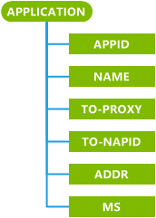

# w4 应用 CSP

使用具有 w4 应用程序标识配置多媒体消息服务 (MMS)**应用程序**配置服务提供程序。

除非特定权限授予子节点中的根本特征和映射到每个节点定义默认安全角色。 默认安全角色是管理器、 运算符和运算符 – TPS。

> **请注意**  此配置服务提供商要求使用 ID\_CAP\_CSP\_基础和 ID\_CAP\_CSP\_W4\_应用程序功能，从网络配置应用程序进行访问。

 

下图显示了配置服务提供程序，以树格式由 OMA 客户端资源调配使用。

**应用程序标识**  
必需。 此参数接受字符串值。 用于配置 MMS 唯一受支持的值是"w4"。

**名称**  
可选项。 指定用户 – 读取应用程序标识。 此参数还用于定义应用程序参数的注册表路径的一部分。

此参数接受字符串值。 配置名称参数的可能值包括︰

-   包含名称的字符串。

-   没有指定值

> **请注意** MDM 服务器应将重新发送应用程序中的名称到 DMAcc 升级后因为此值显示在 UI 中但不是保存在 Windows Phone 8.1 和无法迁移到 Windows 10。

 

如果未不指定任何值，将默认的注册表位置&lt;命名&gt;。

如果`Name`超过 40 个字符，它将被截断为 40 个字符。

**为代理服务器**  
必需。 具有匹配的代理 ID 指定一个逻辑的代理服务器 才可以引用同一个配置文件中定义的代理服务器。 只有一个代理可能会列出。

必须定义 MMS 特定代理服务器的 PXLOGICAL 中的代理 ID 的值设置到代理服务器值。

**对 NAPID**  
必需。 指定网络访问点标识名称 (NAPID) 在配置文件中定义。 此参数接受字符串值。 才可以指 （除如果 INTERNET 属性设置中的 NAPDEF 特征） 同一配置文件中定义的网络接入点。 有关 NAPDEF 特征的详细信息，请参阅[NAPDEF 配置服务提供程序](napdef-csp.md)。

**地址**  
必需。 以字符串形式指定 MMS 应用程序服务器的地址。 若要配置地址参数的可能值包括︰

-   统一资源标识符 (URI)

-   作为分隔符加点的十进制格式表示的 IPv4 地址

-   完全限定的互联网域名

**MS**  
可选项。 最大授权的大小，以 kb 为单位，对多媒体内容。 此参数接受字符串格式的数值。 如果值不是数字，或者小于或等于 10，它将被忽略并传出 MMS 不能调整大小。

## 备注

Windows Phone MMS 不支持 – 选择用户的配置文件。 虽然可以提供，仅最后一次接收到的配置文件处于活动状态时，同时保存多个 MMS 配置文件。

如果 XML 资源调配接收与现有名称，值的配置文件，配置文件将被覆盖的新值。

有关使用 w4 应用程序配置服务提供程序以及如何使用它们的参数的详细信息，请参阅 OMA MMS 标准文档 (OMA-TS 的 MMS 的 CONF 的 V1\_3-20051027-C) 可从[OMA 网站](http://go.microsoft.com/fwlink/p/?LinkId=526900)。

## 相关的主题

[配置服务提供程序的引用](configuration-service-provider-reference.md)

 

 

