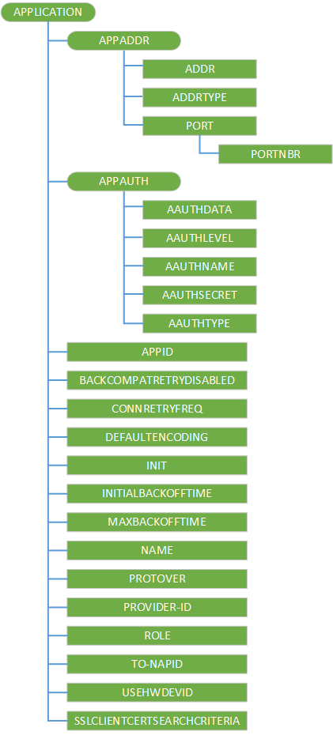

# <a name="w7-application-csp"></a>w7 应用 CSP


有 w7 的应用程序标识应用程序配置服务提供程序用于引导的 OMA DM 帐户的设备。 虽然此配置服务提供程序用于设置 OMA DM 帐户，它对 OMA 客户端资源调配管理。

> **请注意** 此配置服务提供商要求使用 ID\_CAP\_CSP\_基础和 ID\_CAP\_设备\_管理\_管理功能从网络配置应用程序进行访问。

 

下图显示了配置服务提供程序以树格式由 OMA 客户端资源调配使用。



> **请注意**  所有参数的名称和特征类型区分大小写，并且必须使用全部大写。
在调配 XML 必须提供 APPSRV 和客户端的凭据。

 

<a href="" id="appaddr"></a>**APPADDR**  
此特征在 w7 应用程序特性用于指定的 DM 服务器地址。

<a href="" id="appaddr-addr"></a>**APPADDR/地址**  
可选项。 APPADDR 特性中使用地址参数可以获取或设置 OMA DM 服务器的地址。 此参数接受字符串值。

<a href="" id="appaddr-addrtype"></a>**APPADDR/ADDRTYPE**  
可选项。 APPADDR 特性中使用 ADDRTYPE 参数来获取或设置地址参数的格式。 此参数接受字符串值。

在 OMA DM XML 中，如果有多个实例的此参数，则使用第一个有效的参数值。

<a href="" id="appaddr-port"></a>**APPADDR/端口**  
此特性中的 APPADDR 特性用于指定端口信息。

<a href="" id="appaddr-port-portnbr"></a>**PORTNBR/APPADDR/端口**  
必需。 端口特性中使用 PORTNBR 参数来获取或设置要连接到的端口数。 此参数接受字符串格式的数值。

<a href="" id="appauth"></a>**APPAUTH**  
此特征在 w7 应用程序特性用于指定身份验证信息。

<a href="" id="appauth-aauthdata"></a>**APPAUTH/AAUTHDATA**  
可选项。 APPAUTH 特性中使用 AAUTHDATA 参数来获取或设置身份验证中使用的其他数据。 使用此参数来传达 nonce 摘要式身份验证类型。 此参数接受字符串值。 此参数的值是 base64 编码形式的一系列字节。 请注意，如果 AAUTHTYPE 是摘要，这可作为在 MD5 哈希运算中，一个 nonce 值计算哈希值，在服务器端和设备端时，应使用八进制形式的二进制数据。

<a href="" id="appauth-aauthlevel"></a>**APPAUTH/AAUTHLEVEL**  
必需。 AAUTHLEVEL 参数中的 APPAUTH 特性用于指示是否对服务器身份验证或客户端身份验证凭据。 此参数接受字符串值。 您可以设置此值。

有效值︰

-   APPSRV-指定客户端到 DM 协议级的 OMA DM 服务器验证自身。

-   客户端-指定服务器到 OMA DM DM 协议级别的客户端验证自身。

<a href="" id="appauth-aauthname"></a>**APPAUTH/AAUTHNAME**  
可选项。 AAUTHNAME 参数中的 APPAUTH 特征用于区分 OMA DM 客户端名称。 此参数接受字符串值。 您可以设置此值。

<a href="" id="appauth-aauthsecret"></a>**APPAUTH/AAUTHSECRET**  
必需。 AAUTHSECRET 参数采用的 APPAUTH 特性来获取或设置用于验证用户的身份验证机密。 此参数接受字符串值。

<a href="" id="appauth-aauthtype"></a>**APPAUTH/AAUTHTYPE**  
可选项。 APPAUTH 特征的 AAUTHTYPE 参数用于获取或设置身份验证方法。 此参数接受字符串值。

有效值︰

-   基本-指定 SyncML DM syncml:auth-基本身份验证类型。

-   摘要-指定的 SyncML DM syncml:auth-md5 身份验证类型。

-   当 AAUTHLEVEL 是客户端时，则 AAUTHTYPE 必须是摘要。 当 AAUTHLEVEL APPSRV，AAUTHTYPE 可以是基本或摘要式。

<a href="" id="appid"></a>**应用程序标识**  
必需。 应用程序标识参数中的应用程序特征用于区分可用的应用程序服务和协议的类型。 此参数接受字符串值。 您可以获取或设置此值。 唯一有效的值来配置 OMA 客户端资源调配引导 APPID 是 w7。

<a href="" id="backcompatretrydisabled"></a>**BACKCOMPATRETRYDISABLED**  
可选项。 BACKCOMPATRETRYDISABLED 参数中的应用程序特性用于指定是否尝试重新发送使用较旧的协议版本 (例如，1.1) 包中 （不包括第一次） SyncHdr。

> **请注意**  此参数不包含一个值。 此参数的存在意味着向后兼容性重试被禁用。 如果缺少此参数，则表示已启用向后兼容性重试。

 

<a href="" id="connretryfreq"></a>**CONNRETRYFREQ**  
可选项。 CONNRETRYFREQ 参数中的应用程序特征用于指定数量的重试次数 DM 客户端执行连接管理器级别或 WinInet 级错误时。 此参数接受字符串格式的数值。 默认值为"3"。 您可以设置此参数。

<a href="" id="defaultencoding"></a>**DEFAULTENCODING**  
可选项。 DEFAULTENCODING 参数中的应用程序特性用于指定是否 DM 客户端应使用 WBXML 或 XML DM 包与服务器通信时。 您可以获取或设置此参数。

有效值包括︰

-   application/vnd.syncml.dm+xml （默认值）

-   application/vnd.syncml.dm+wbxml

<a href="" id="init"></a>**初始化**  
可选项。 初始化参数中的应用程序特性用于指示管理服务器需要客户端启动设置审批后立即管理会话。 如果当前 w7 应用程序文档将被存放在 ROM 中，INIT 参数不能存在。

> **请注意**  此节点是仅对移动运营商，尝试使用这样的 MDM 服务器将失败。 企业 MDM 登记方案中不支持此节点。
此参数会强制要尝试用 OMA DM 服务器进行连接的设备。 如果 XML 设置 coldinit 阶段，连接尝试将失败。 这种失败的一个常见原因是，立即完成 coldinit 后无线电设备尚未准备好。

 

<a href="" id="initialbackofftime"></a>**INITIALBACKOFFTIME**  
可选项。 INITIALBACKOFFTIME 参数中的应用程序特性用于指定初始的等待时间 （毫秒） 时 DM 客户端重试第一次。 等待时间呈指数增长。 此参数接受字符串格式的数值。 默认值为"16000"。 您可以获取或设置此参数。

<a href="" id="maxbackofftime"></a>**MAXBACKOFFTIME**  
可选项。 MAXBACKOFFTIME 参数用于应用程序特性中指定的最大包发送后睡眠状态的毫秒数失败。 此参数接受字符串格式的数值。 默认值为"86400000"。 您可以设置此参数。

<a href="" id="name"></a>**名称**  
可选项。 NAME 参数中的应用程序特性用于指定用户可读的应用程序标识。 此参数用于定义应用程序参数的注册表路径的一部分。 您可以设置此参数。

NAME 参数可以是字符串或 null （没有值）。 如果未不指定任何值，将默认的注册表位置&lt;命名&gt;。

<a href="" id="protover"></a>**PROTOVER**  
可选项。 使用 PROTOVER 参数中指定的 OMA DM 协议的应用程序特征版本的服务器支持。 假定没有默认值。 通过此节点设置的协议版本将匹配 DM 客户端向服务器在 SyncHdr 包 1 报告的协议版本。 如果此节点添加 DM 服务器帐户时未指定，则使用客户端支持的最新 DM 协议版本。 在 Windows Phone 是 1.2。 这是 Microsoft 的自定义参数。 您可以设置此参数。

可能的值︰

-   1.1

-   1.2

<a href="" id="provider-id"></a>**提供程序 ID**  
可选项。 提供程序 ID 参数中的应用程序特征用于区分 OMA DM 服务器。 它指定当前管理会话中使用管理服务器的服务器标识符。 此参数接受字符串值。 您可以设置此参数。

<a href="" id="role"></a>**角色**  
可选项。 角色参数中的应用程序特性用于指定与 DM 服务器通信时，应使用运行 DM 会话安全应用程序宝剑。 唯一受支持的角色为 8 （移动运营商） 和 32 （企业）。 如果此参数不存在，则假定的移动运营商的角色。 企业角色只能通过企业注册客户端设置。 企业客户端不能设置移动运营商的角色。 这是 Microsoft 的自定义参数。 此参数接受字符串格式的数值。 您可以获取或设置此参数。

<a href="" id="to-napid"></a>**对 NAPID**  
可选项。 TO NAPID 参数中的应用程序特性用于指定客户端将用于连接到 OMA DM 服务器与网络接入点。 如果指定了多个收件人 NAPID 参数，仅第一个 TO NAPID 值将存储。 此参数接受字符串值。 您可以设置此参数。

<a href="" id="usehwdevid"></a>**USEHWDEVID**  
可选项。 USEHWDEVID 参数中的应用程序特征用于指定的设备硬件标识使用。 它没有价值。

-   如果没有该参数，则默认行为是使用特定于应用程序的 GUID，而不是硬件设备 id。

-   如果该参数存在，硬件设备 ID 将提供**./DevInfo/DevID**节点和源 LocURI DM 包发送到服务器。 国际移动用户标识 (IMEI) 的 GSM 设备返回。

<a href="" id="sslclientcertsearchcriteria"></a>**SSLCLIENTCERTSEARCHCRITERIA**  
可选项。 SSLCLIENTCERTSEARCHCRITERIA 参数中的应用程序特性用于指定客户端证书的搜索条件。 此参数支持主题特性和证书存储区的搜索。 如果不提供任何其他条件，则它将被忽略。

该字符串是串联组成的名称/值对，对"&"字符分隔的每个成员。 名称和值由"="字符分隔。 如果有多个值，由"U + F000"Unicode 字符分隔每个值。 如果名称或值包含设置 （按指定 RFC2396） UNRESERVED 以外的字符，这些字符是 URI 转义每 RFC。

所支持的名称是主题和存储;不支持通配符证书搜索。

存储区指定 DM 客户端将搜索要查找的 SSL 客户端证书的证书存储区。 有效的存储值是我 %5cuser。 存储区名称不区分大小写。

> **注意**%EF%80 %80 是 UTF8 编码字符 U + F000。

 

主题指定要搜索的证书。 例如，若要指定所需的证书具有特定的主题属性 ("CN = 测试人员，O = Microsoft")，使用以下内容︰

``` syntax
<parm name="SSLCLIENTCERTSEARCHCRITERIA" 
   value="Subject=CN%3DTester,O%3DMicrosoft&amp;Stores=My%5CUser" />
```

## <a name="related-topics"></a>相关的主题


[配置服务提供程序的引用](configuration-service-provider-reference.md)

 

 


