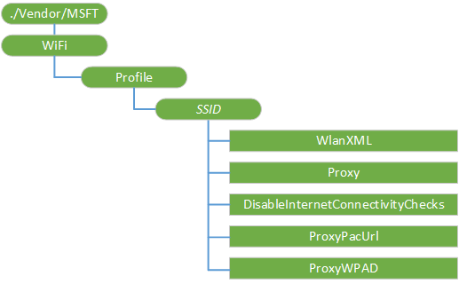

# <a name="wifi-csp"></a>WiFi CSP


WiFi 配置服务提供程序提供的功能来添加或删除 Windows 设备上的 Wi-Fi 网络。 配置服务提供程序接受 SyncML 输入并将其转换为设备安装一个网络配置文件。 此配置式启用设备在有效范围时，连接到 Wi-fi 网络。

编程注意事项︰

-   如果该身份验证方法需要一个证书，例如，EAP-TLS 需要客户端证书，您必须通过 CertificateStore 配置服务提供程序对其进行配置。 WiFi 配置服务提供程序不提供该功能;相反，Wi-Fi 配置文件可以指定用于选择该网络的适当证书的证书的特征。 首先之前部署 Wi-Fi 网络配置证书，必须成功注册服务器。 例如，对于 EAP-TLS 模板，服务器成功必须配置，并部署 Wi-Fi 配置文件之前，先注册所需的客户端证书。 自行签署式证书适用于 EAP-TLS/PEAP-MSCHAPv2，但它不支持 EAP-TLS。
-   因为 Windows 10 移动模拟器不支持 Wi-Fi，您无法测试与仿真器的 Wi-Fi 配置。 仍然可以调配使用 WiFi 的 CSP，Wi-Fi 网络，然后将其签入 Wi-Fi 设置页面中，但您不能在仿真程序中测试网络连接。
-   WEP、 WPA，和基于 WPA2 的网络，包括以纯文本形式的网络配置中的密钥。 存储设备上时，将自动加密密钥。
-   LocURI 节点的 Wi-Fi 网络一部分的 SSID 必须根据 RFC 2396 进行有效的 URI。 这就要求必须使用 %字符转义所有的非 ASCII 字符。 不支持 Unicode 字符，而不需要转义。
-   &lt;名称&gt;*名称\_转\_这里*&lt;/名称&gt;&lt;SSIDConfig&gt;必须匹配&lt;SSID&gt;&lt;名称&gt;*名称\_转\_在此处*&lt;/名称&gt;&lt;/SSID&gt;。
-   WiFi csp，不能使用替换命令，除非该节点已存在。
-   使用 Proxyis 只支持 Windows 10 移动。 对于桌面版本 （家庭、 Pro、 企业和教育） 在 Windows 10 使用此配置将导致失败。

下面的图像以树格式显示 WiFi 配置服务提供程序。



下面的列表显示的特征和参数。

<a href="" id="profile"></a>**配置文件**  
Wi-Fi 网络配置标识。 配置文件对象表示每个 Wi-Fi 网络配置。 此网络配置文件包含将设备连接到该网络--例如，SSID、 身份验证和加密方法以及在 WEP 或 WPA2 网络的密码所需的所有信息。

受支持的操作是获得。

<a href="" id="-ssid-"></a>***&lt;SSID&gt;***  
指定的名称来创建、 配置、 查询，或删除的 Wi-Fi 网络 （最多 32 个字节）。 该名称区分大小写，并且可以用 ASCII 表示。 当添加了 WlanXML 节点中添加 SSID。 SSID 节点被删除时，则也将删除所有的子节点。

SSID 是的网络相连，在配置文件名称包含 WiFi 设置信息的配置文件的名称的名称。 如果未设置正确配置文件名称在 MDM SyncML，按照 WiFi 设置 XML 中的信息可能导致一些意外的错误。 例如， &lt;LocURI&gt;./Vendor/MSFT/WiFi/Profile/&lt;*必须是名称的配置文件 AS / WIFI XML*&gt;/WlanXml&lt;/LocURI&gt;。

支持的操作是添加 Get，删除和替换。

<a href="" id="wlanxml"></a>**WlanXML**  
XML 的描述网络配置并遵循[WLAN\_配置文件架构](http://go.microsoft.com/fwlink/p/?LinkId=325608)在 MSDN 上。

支持的操作是 Get，添加，删除和替换。

值类型是 chr。

必须转义 XML 配置文件，如下面的示例中所示。

如果它存在于该 blob，**关键字类型**和**受保护的**元素必须用**keyMaterial**，前面， [WPA2-个人配置文件示例](http://go.microsoft.com/fwlink/p/?LinkId=523870)中的示例所示。

> **请注意** 如果需要指定其他高级的条件，例如指定条件的 Wi-Fi 配置文件，可以使用的证书可以通过指定该通过 WlanXML EapHostConfig 部分将这样做。 有关详细信息，请参阅[配置 EAP](http://go.microsoft.com/fwlink/p/?LinkId=618963)。

 

支持的操作是添加 Get，删除和替换。

<a href="" id="proxy"></a>**代理服务器**  
可选项。 指定网络代理的配置。 每个 Windows 10 移动的连接，可以指定代理服务器主机和端口。 此代理配置只支持 Windows 10 移动。 对于桌面版本在 Windows 10 使用此配置将导致失败。

格式为*主机 / 端口*，主机可以是下列项之一︰

-   已注册的主机名称，例如服务器名称、 FQDN 或单标签名称，如 myweb 即可，而不是 myweb.contoso.com。
-   IPV4 地址
-   IPv6/IPvFuture 地址。

如果是一个 IPvFuture 地址，则它必须被指定为文本作为 IP"\["(IP v6 地址 / IPvFuture)"\]"，如"\[2441:4880:28:3:204:76ff:f43f:6eb\]: 8080"。

支持的操作是 Get，添加，删除和替换。

<a href="" id="disableinternetconnectivitychecks"></a>**DisableInternetConnectivityChecks**  
添加到 Windows 10，1511.Optional 版本中。 禁用 internet 连接检查配置文件。

值类型是 chr。

-   True-已禁用 internet 连接检查。
-   False-启用了 internet 连接检查。

支持的操作是 Get，添加，删除和替换。

<a href="" id="proxypacurl"></a>**ProxyPacUrl**  
添加到 Windows 10，1607年版本中。 可选项。 指定代理服务器自动配置 (PAC) 文件的位置的 URL 的值。 此代理配置只支持 Windows 10 移动。

值类型是 chr，例如 http://www.contoso.com/wpad.dat。

<a href="" id="proxywpad"></a>**ProxyWPAD**  
添加到 Windows 10，1607年版本中。 可选项。 当设置为 true，则启用 Web 代理服务器自动发现协议 (WPAD) 代理查阅。此代理配置只支持 Windows 10 移动。

值类型是布尔值。

## <a name="examples"></a>示例


这些 XML 示例显示如何执行使用 OMA DM 的各种任务。

### <a name="add-a-network"></a>添加网络

下面的示例演示如何添加 SSID 'MyNetwork'，方法是代理服务器 URL testproxy，使用 PEAP MSCHAPv2 网络和为端口 80。

``` syntax
<SyncML xmlns="SYNCML:SYNCML1.2">
  <SyncBody>
    <Atomic>
      <CmdID>301</CmdID>
      <Add>
        <CmdID>302</CmdID>
        <Item>
          <Target>
            <LocURI>./Vendor/MSFT/WiFi/Profile/MyNetwork/WlanXml</LocURI>
          </Target>
          <Meta>
            <Format xmlns="syncml:metinf">chr</Format>
          </Meta>
          <Data>&lt;?xml version=&quot;1.0&quot;?&gt;&lt;WLANProfile xmlns=&quot;http://contoso.com/networking/WLAN/profile/v1&quot;&gt;&lt;name&gt;MyNetwork&lt;/name&gt;&lt;SSIDConfig&gt;&lt;SSID&gt;&lt;hex&gt;412D4D534654574C414E&lt;/hex&gt;&lt;name&gt;MyNetwork&lt;/name&gt;&lt;/SSID&gt;&lt;nonBroadcast&gt;false&lt;/nonBroadcast&gt;&lt;/SSIDConfig&gt;&lt;connectionType&gt;ESS&lt;/connectionType&gt;&lt;connectionMode&gt;manual&lt;/connectionMode&gt;&lt;MSM&gt;&lt;security&gt;&lt;authEncryption&gt;&lt;authentication&gt;WPA2&lt;/authentication&gt;&lt;encryption&gt;AES&lt;/encryption&gt;&lt;useOneX&gt;true&lt;/useOneX&gt;&lt;/authEncryption&gt;&lt;OneX xmlns=&quot;http://contoso.com/networking/OneX/v1&quot;&gt;&lt;authMode&gt;user&lt;/authMode&gt;&lt;EAPConfig&gt;&lt;EapHostConfig xmlns=&quot;http://contoso.com/provisioning/EapHostConfig&quot;&gt;&lt;EapMethod&gt;&lt;Type xmlns=&quot;http://contoso.com/provisioning/EapCommon&quot;&gt;25&lt;/Type&gt;&lt;VendorId xmlns=&quot;http://contoso.com/provisioning/EapCommon&quot;&gt;0&lt;/VendorId&gt;&lt;VendorType xmlns=&quot;http://contoso.com/provisioning/EapCommon&quot;&gt;0&lt;/VendorType&gt;&lt;AuthorId xmlns=&quot;http://contoso.com/provisioning/EapCommon&quot;&gt;0&lt;/AuthorId&gt;&lt;/EapMethod&gt;&lt;Config xmlns=&quot;http://contoso.com/provisioning/EapHostConfig&quot;&gt;&lt;Eap xmlns=&quot;http://contoso.com/provisioning/BaseEapConnectionPropertiesV1&quot;&gt;&lt;Type&gt;25&lt;/Type&gt;&lt;EapType xmlns=&quot;http://contoso.com/provisioning/MsPeapConnectionPropertiesV1&quot;&gt;&lt;ServerValidation&gt;&lt;DisableUserPromptForServerValidation&gt;true&lt;/DisableUserPromptForServerValidation&gt;&lt;ServerNames&gt;&lt;/ServerNames&gt;&lt;/ServerValidation&gt;&lt;FastReconnect&gt;true&lt;/FastReconnect&gt;&lt;InnerEapOptional&gt;false&lt;/InnerEapOptional&gt;&lt;Eap xmlns=&quot;http://contoso.com/provisioning/BaseEapConnectionPropertiesV1&quot;&gt;&lt;Type&gt;26&lt;/Type&gt;&lt;EapType xmlns=&quot;http://contoso.com/provisioning/MsChapV2ConnectionPropertiesV1&quot;&gt;&lt;UseWinLogonCredentials&gt;false&lt;/UseWinLogonCredentials&gt;&lt;/EapType&gt;&lt;/Eap&gt;&lt;EnableQuarantineChecks&gt;false&lt;/EnableQuarantineChecks&gt;&lt;RequireCryptoBinding&gt;false&lt;/RequireCryptoBinding&gt;&lt;PeapExtensions&gt;&lt;PerformServerValidation xmlns=&quot;http://contoso.com/provisioning/MsPeapConnectionPropertiesV2&quot;&gt;false&lt;/PerformServerValidation&gt;&lt;AcceptServerName xmlns=&quot;http://contoso.com/provisioning/MsPeapConnectionPropertiesV2&quot;&gt;false&lt;/AcceptServerName&gt;&lt;/PeapExtensions&gt;&lt;/EapType&gt;&lt;/Eap&gt;&lt;/Config&gt;&lt;/EapHostConfig&gt;&lt;/EAPConfig&gt;&lt;/OneX&gt;&lt;/security&gt;&lt;/MSM&gt;&lt;/WLANProfile&gt; </Data>
        </Item>
      </Add>
      <Add>
        <CmdID>$CmdID$</CmdID>
        <Item>
          <Target>
            <LocURI>./Vendor/MSFT/WiFi/Profile/MyNetwork/Proxy</LocURI>
          </Target>
          <Meta>
            <Format xmlns="syncml:metinf">chr</Format>
          </Meta>
          <Data>testproxy:80</Data>
        </Item>
      </Add>
    </Atomic>
    <Final/>
  </SyncBody>
</SyncML>
```

### <a name="query-network-profiles"></a>查询网络配置文件

下面的示例演示如何查询 Wi-Fi MDM 服务器上安装的配置文件。

``` syntax
<Get> 
   <CmdID>301</CmdID> 
   <Item> 
      <Target> 
         <LocURI>./Vendor/MSFT/WiFi/Profile</LocURI> 
      </Target> 
   </Item> 
</Get>
```

下面的示例显示了响应。

``` syntax
<Results> 
   <CmdID>3</CmdID> 
   <MsgRef>1</MsgRef> 
   <CmdRef>301</CmdRef>
   <Item> 
      <Source><LocURI>./Vendor/MSFT/WiFi/Profile</LocURI></Source> 
      <Meta><Format xmlns="syncml:metinf">node</Format></Meta> 
      <Data>TestWLAN1/TestWLAN2</Data> 
   </Item> 
</Results>
```

### <a name="remove-a-network"></a>删除网络

下面的示例演示如何移除与 MyNetwork 的 SSID 的网络和无代理。 删除所有网络的身份验证类型是这种相同的方式完成的。

``` syntax
<Atomic>
      <CmdID>300</CmdID>
      <Delete>
        <CmdID>301</CmdID>
        <Item>
          <Target>
            <LocURI>./Vendor/MSFT/WiFi/Profile/MyNetwork/WlanXml</LocURI>
          </Target>
        </Item>
      </Delete>
</Atomic>
```

### <a name="add-a-network-and-certification-authority-for-a-server-certificate"></a>添加一个服务器证书的网络和证书颁发机构

下面的示例演示如何添加 PEAP MSCHAPv2 网络的 SSID 'MyNetwork' 和根 CA 的服务器证书的有效性。

``` syntax
<Atomic>
      <CmdID>300</CmdID>
      <Add>
        <CmdID>301</CmdID>
        <Item>
          <Target>
            <LocURI>./Vendor/MSFT/WiFi/Profile/MyNetwork/WlanXml</LocURI>
          </Target>
          <Meta>
            <Format xmlns="syncml:metinf">chr</Format>
          </Meta>
          <Data>&lt;?xml version=&quot;1.0&quot;?&gt;&lt;WLANProfile xmlns=&quot;http://www.microsoft.com/networking/WLAN/profile/v1&quot;&gt;&lt;name&gt;MyNetwork&lt;/name&gt;&lt;SSIDConfig&gt;&lt;SSID&gt;&lt;name&gt;MyNetwork&lt;/name&gt;&lt;/SSID&gt;&lt;nonBroadcast&gt;false&lt;/nonBroadcast&gt;&lt;/SSIDConfig&gt;&lt;connectionType&gt;ESS&lt;/connectionType&gt;&lt;connectionMode&gt;manual&lt;/connectionMode&gt;&lt;MSM&gt;&lt;security&gt;&lt;authEncryption&gt;&lt;authentication&gt;WPA2&lt;/authentication&gt;&lt;encryption&gt;AES&lt;/encryption&gt;&lt;useOneX&gt;true&lt;/useOneX&gt;&lt;/authEncryption&gt;&lt;OneX xmlns=&quot;http://www.microsoft.com/networking/OneX/v1&quot;&gt;&lt;authMode&gt;user&lt;/authMode&gt;&lt;EAPConfig&gt;&lt;EapHostConfig xmlns=&quot;http://www.microsoft.com/provisioning/EapHostConfig&quot;&gt;&lt;EapMethod&gt;&lt;Type xmlns=&quot;http://www.microsoft.com/provisioning/EapCommon&quot;&gt;25&lt;/Type&gt;&lt;VendorId xmlns=&quot;http://www.microsoft.com/provisioning/EapCommon&quot;&gt;0&lt;/VendorId&gt;&lt;VendorType xmlns=&quot;http://www.microsoft.com/provisioning/EapCommon&quot;&gt;0&lt;/VendorType&gt;&lt;AuthorId xmlns=&quot;http://www.microsoft.com/provisioning/EapCommon&quot;&gt;0&lt;/AuthorId&gt;&lt;/EapMethod&gt;&lt;Config xmlns=&quot;http://www.microsoft.com/provisioning/EapHostConfig&quot;&gt;&lt;Eap xmlns=&quot;http://www.microsoft.com/provisioning/BaseEapConnectionPropertiesV1&quot;&gt;&lt;Type&gt;25&lt;/Type&gt;&lt;EapType xmlns=&quot;http://www.microsoft.com/provisioning/MsPeapConnectionPropertiesV1&quot;&gt;&lt;ServerValidation&gt;&lt;DisableUserPromptForServerValidation&gt;true&lt;/DisableUserPromptForServerValidation&gt;&lt;ServerNames&gt;&lt;/ServerNames&gt;&lt;TrustedRootCA&gt; InsertCertThumbPrintHere &lt;/TrustedRootCA&gt;&lt;/ServerValidation&gt;&lt;FastReconnect&gt;true&lt;/FastReconnect&gt;&lt;InnerEapOptional&gt;false&lt;/InnerEapOptional&gt;&lt;Eap xmlns=&quot;http://www.microsoft.com/provisioning/BaseEapConnectionPropertiesV1&quot;&gt;&lt;Type&gt;26&lt;/Type&gt;&lt;EapType xmlns=&quot;http://www.microsoft.com/provisioning/MsChapV2ConnectionPropertiesV1&quot;&gt;&lt;UseWinLogonCredentials&gt;false&lt;/UseWinLogonCredentials&gt;&lt;/EapType&gt;&lt;/Eap&gt;&lt;EnableQuarantineChecks&gt;false&lt;/EnableQuarantineChecks&gt;&lt;RequireCryptoBinding&gt;false&lt;/RequireCryptoBinding&gt;&lt;PeapExtensions&gt;&lt;PerformServerValidation xmlns=&quot;http://www.microsoft.com/provisioning/MsPeapConnectionPropertiesV2&quot;&gt;true&lt;/PerformServerValidation&gt;&lt;AcceptServerName xmlns=&quot;http://www.microsoft.com/provisioning/MsPeapConnectionPropertiesV2&quot;&gt;false&lt;/AcceptServerName&gt;&lt;/PeapExtensions&gt;&lt;/EapType&gt;&lt;/Eap&gt;&lt;/Config&gt;&lt;/EapHostConfig&gt;&lt;/EAPConfig&gt;&lt;/OneX&gt;&lt;/security&gt;&lt;/MSM&gt;&lt;/WLANProfile&gt; </Data>
        </Item>
      </Add>
</Atomic>
```

## <a name="related-topics"></a>相关的主题


[配置服务提供程序的引用](configuration-service-provider-reference.md)

 

 


