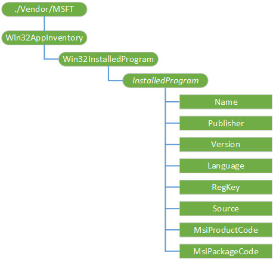

# Win32AppInventory 的 CSP

Win32AppInventory 配置服务提供程序用于在设备上提供安装的应用程序清单。

下图显示的 Win32AppInventory 配置服务提供程序管理对象以树格式由开放移动联盟设备管理 (OMA DM)，OMA 客户端资源调配和企业 DM。

**./Vendor/MSFT/Win32AppInventory**  
Win32AppInventory 配置服务提供程序的根节点。

受支持的操作是获得。

**Win32InstalledProgram**  
这是安装在设备上的 Win32 应用程序的清单。

受支持的操作是获得。

**Win32InstalledProgram /***InstalledProgram*  
一个包含有关特定应用程序的节点。

**Win32InstalledProgram /***InstalledProgram***/Name**  
一个字符串，指定应用程序的名称。

受支持的操作是获得。

**Win32InstalledProgram /***InstalledProgram***/Publisher**  
一个字符串，指定应用程序的发行者。

受支持的操作是获得。

**Win32InstalledProgram /***InstalledProgram***/Version**  
一个字符串，指定应用程序的版本。

受支持的操作是获得。

**Win32InstalledProgram /***InstalledProgram***/Language**  
一个字符串，指定应用程序的语言。

受支持的操作是获得。

**Win32InstalledProgram /***InstalledProgram***/RegKey**  
一个字符串，指定产品代码或注册表子项。

基于 MSI 的应用程序，这是产品代码。

对于在添加/删除程序中找到的应用程序，这是注册表子项。

受支持的操作是获得。

**Win32InstalledProgram /***InstalledProgram***/Source**  
一个字符串，指定应用程序被发现，如 MSI 或添加/删除程序。

受支持的操作是获得。

**Win32InstalledProgram /***InstalledProgram***/MsiProductCode**  
用于唯一标识特定的 MSI 产品的 GUID。

受支持的操作是获得。

**Win32InstalledProgram /***InstalledProgram***/MsiPackageCode**  
MSI 软件包标识的 GUID。 多个产品可以构成一个软件包。

受支持的操作是获得。

## 相关的主题

[配置服务提供程序的引用](configuration-service-provider-reference.md)

 

 

