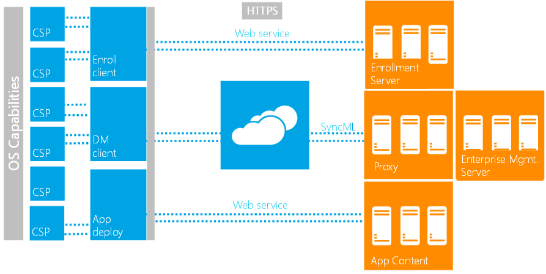

# 企业设置、 策略和应用程序管理

在设备和服务器之间的实际管理交互是通过 DM 客户端来完成的。 DM 客户端与 DM v1.2 SyncML 语法通过企业管理服务器进行通信。 [OMA 网站](http://go.microsoft.com/fwlink/p/?LinkId=267526)上找不到 OMA DM 协议 v1.2 的完整说明。

Windows 目前支持一个 MDM 服务器。 通过注册过程配置 DM 客户端被授予访问权限与企业相关的设置。 通过对 DM 客户端的各种配置服务提供程序公开企业 MDM 设置。 有关可用配置服务提供程序的列表，请参阅[配置服务提供程序的引用](configuration-service-provider-reference.md)。

在注册过程中要调用任务计划程序定期轮询 MDM 服务器配置 DM 客户端。

下图显示了服务器和客户机之间的工作流。

## 管理工作流

此协议定义为执行管理要求和执行结果包负载与 DM SyncML XML 基于 HTTPS 的客户端/服务器的通信。 通过托管对象 (MO) 发送配置请求。 概念的树状结构中表示支持的托管对象的设置。 配置设备设置此逻辑视图简化了服务器地址的设备设置通过隔离概念的树状结构的实现详细信息的方法。

为了促进与企业管理的远程服务器的安全增强型通讯，Windows 通过 DM 客户端和管理服务之间加密 SSL 的 HTTP 通道支持基于证书的双向身份验证。 在注册过程中调配服务器和客户端证书。

DM 客户端配置、 实施公司策略、 业务应用程序管理和设备清单是所有公开或通过配置服务提供程序 (Csp) 表示。 Csp 是托管对象的窗口一词。 DM 客户端与服务器通信，并将配置请求发送到 Csp。 服务器只需知道逻辑本地 Uri 由这些 CSP 节点定义为使用 XML 的 DM 协议来管理设备。

以下是支持企业管理的 DM 任务的摘要︰

-   公司策略管理︰ 公司通过策略 CSP 支持策略允许企业管理不同的设置。 它使管理服务来配置设备锁定相关的策略、 停用/启用此存储卡，和查询设备加密状态。 RemoteWipe CSP 允许 IT 专业人员可以远程完全擦除内部用户数据存储。
-   企业应用程序管理︰ 通过企业 ModernApp 管理 CSP 和几个与 ApplicationManagement 相关的策略解决该问题。 它用来安装企业令牌，查询安装业务应用程序名称和版本等。该 CSP 才可以访问企业服务。
-   证书管理︰ CertificateStore CSP、 RootCACertificate CSP 和 ClientCertificateInstall CSP 可用于安装的证书。
-   基本设备库存和资产管理︰ 可以通过 DevInfo CSP、 Csp DevDetail 和 DeviceStatus CSP 检索的一些基本设备信息。 这提供了基本的设备信息，如 OEM 名称、 设备模型、 硬件版本、 操作系统版本、 处理器类型等。这是用于资产管理和目标设备。 NodeCache CSP 启用设备仅发送增量库存设置到服务器以减少无线数据使用量。 NodeCache CSP 才可以访问企业服务。

 

