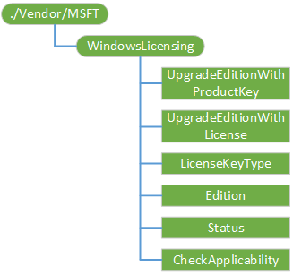

# <a name="windowslicensing-csp"></a>WindowsLicensing 的 CSP


WindowsLicensing 配置服务提供程序用于授权相关的管理方案。 当前范围仅限于为 Windows 10 版本升级等专业到 Windows 10 企业的 10 Windows 桌面和移动设备。 此外，该 CSP 提供激活或更改产品密钥的 Windows 10 桌面设备的能力。

下面的关系图以树格式显示 WindowsLicensing 配置服务提供程序。



<a href="" id="--vendor-msft-windowslicensing"></a>**./Vendor/MSFT/WindowsLicensing**  
这是 WindowsLicensing 配置服务提供程序的根节点。

受支持的操作是获得。

<a href="" id="upgradeeditionwithproductkey"></a>**UpgradeEditionWithProductKey**  
进入 Windows 10 桌面设备的升级版的产品密钥。

> **请注意**  此升级过程需要重新启动系统。

 

日期类型为 chr。

受支持的操作被执行。

当一个产品密钥被从 MDM 服务器推送到用户的设备时， **changepk.exe**运行使用的产品密钥。 完成后，显示通知给用户是新版本的 Windows 10 时可用。 用户可以然后手动重新启动系统，或者，两个小时后，该设备将自动重新启动以完成升级。 用户会收到一个提醒通知 10 分钟，然后自动重新启动。

设备重新启动后，版升级过程完成。 用户会收到升级成功的通知。

> **重要** 如果另一个策略要求系统重新引导后，运行**changepk.exe**时，在版本升级将失败。

 

如果用户开始安装程序包设置包中输入产品密钥，通知是向用户显示其系统将重新启动以完成安装软件包。 从用户的明确同意后若要继续，包，将继续安装并使用产品密钥**changepk.exe**运行。 用户会收到一个提醒通知 30 秒后自动重新启动。

设备重新启动后，版升级过程完成。 用户会收到升级成功的通知。

此节点还可以用来激活或更改的特定版本的 Windows 10 桌面设备产品密钥输入产品密钥。 激活或更改产品密钥不需要重新启动并且用户一个静默的过程。

> **重要** 输入的产品密钥必须是 29 个字符 （即，它应包括短划线），否则激活、 版本升级或产品密钥更改 Windows 10 桌面设备上的将失败。 从 Microsoft 卷授权服务中心会获取产品密钥。 您的组织必须有批量许可合同与微软访问该门户。

 

以下是使用 MDM 通过此节点有效版本的升级路径︰

-   Windows 10 企业到 Windows 10 教育
-   Windows 10 教育的 Windows 10 家
-   Windows 10 为 Windows 10 教育专业
-   Windows 10 到 Windows 10 企业专业人员

激活或更改产品密钥可以在执行在以下版本︰

-   Windows 10 教育
-   Windows 10 企业
-   Windows 10 家
-   Windows 10 专业

<a href="" id="edition"></a>**版**  
返回一个值，它将映射到在桌面或移动设备上运行的 Windows 10 版。 获取值，将其转换为它的等效十六进制搜索 GetProductInfo 函数在 MSDN 上页面版本的信息。

数据类型是 int。

受支持的操作是获得。

<a href="" id="status"></a>**状态**  
返回的版本状态升级 Windows 10 桌面或移动设备。 状态对应于以下值之一︰

-   0 = 失败
-   1 = 挂起
-   2 = 正在进行
-   3 = 已完成
-   4 = 未知

数据类型是 int。

受支持的操作是获得。

<a href="" id="upgradeeditionwithlicense"></a>**UpgradeEditionWithLicense**  
有关版本升级的 Windows 10 移动设备提供许可证。

> **请注意** 此升级过程不需要重新启动系统。

 

日期类型是 XML。

受支持的操作被执行。

> **重要** 必须正确地转义 XML 许可证文件的内容 （即，不应该只是复制的 XML），否则将无法完成版本升级 Windows 10 移动设备上的。 有关正确转义 XML 许可证文件的详细信息，请参见[W3C XML 规范](http://www.w3.org/TR/xml/)的部分 2.4。 从 Microsoft 卷授权服务中心会获取 XML 许可证文件。 您的组织必须有批量许可合同与微软访问该门户。

 

以下是使用 MDM 或设置包通过此节点有效版本的升级路径︰

-   Windows 10 Mobileto 窗口 10 移动企业

<a href="" id="licensekeytype"></a>**LicenseKeyType**  
返回版本升级、 激活或产品密钥更改为 Windows 10 设备所使用的参数类型。

-   桌面设备的 Windows 10 需要产品密钥。
-   10 Windows Mobile 设备需要 XML 许可证文件的版本升级。

数据类型是 chr。

受支持的操作是获得。

<a href="" id="checkapplicability"></a>**CheckApplicability**  
如果输入的产品密钥可以用于版本升级，激活，则返回 TRUE 或更改产品密钥的 Windows 10 的桌面设备。

数据类型是 chr。

受支持的操作被执行。

## <a name="syncml-examples"></a>SyncML 示例


**CheckApplicability**

``` syntax
<SyncML xmlns="SYNCML:SYNCML1.1">
  <SyncBody>
    <Exec>
    <CmdID>3</CmdID>
    <Item>
      <Target>
        <LocURI>./Device/Vendor/MSFT/WindowsLicensing/CheckApplicability</LocURI>
      </Target>
      <Meta>
        <Format xmlns="syncml:metinf">chr</Format>
      </Meta>
      <Data>XXXXX-XXXXX-XXXXX-XXXXX-XXXXX</Data> 
    </Item>
   </Exec>
   <Final/>
  </SyncBody>
</SyncML>
```

> **注意**  `XXXXX-XXXXX-XXXXX-XXXXX-XXXXX`在**数据**标记应替换为您的产品密钥。

 

**版**

``` syntax
<SyncML xmlns="SYNCML:SYNCML1.1">
  <SyncBody>
    <Get>
      <CmdID>17</CmdID>
        <Item>
          <Target>
            <LocURI>./Device/Vendor/MSFT/WindowsLicensing/Edition</LocURI>
          </Target>
        </Item>
    </Get>
    <Final/>
  </SyncBody>
</SyncML>
```

**LicenseKeyType**

``` syntax
<SyncML xmlns="SYNCML:SYNCML1.1">
  <SyncBody>
    <Get>
      <CmdID>17</CmdID>
        <Item>
          <Target>
            <LocURI>./Device/Vendor/MSFT/WindowsLicensing/LicenseKeyType</LocURI>
          </Target>
        </Item>
    </Get>
    <Final/>
  </SyncBody>
</SyncML>
```

**状态**

``` syntax
<SyncML xmlns="SYNCML:SYNCML1.1">
  <SyncBody>
    <Get>
      <CmdID>17</CmdID>
        <Item>
          <Target>
            <LocURI>./Device/Vendor/MSFT/WindowsLicensing/Status</LocURI>
          </Target>
        </Item>
    </Get>
    <Final/>
  </SyncBody>
</SyncML>
```

**UpgradeEditionWithProductKey**

``` syntax
<SyncML xmlns="SYNCML:SYNCML1.1">
  <SyncBody>
    <Exec>
    <CmdID>3</CmdID>
    <Item>
      <Target>
        <LocURI>./Device/Vendor/MSFT/WindowsLicensing/UpgradeEditionWithProductKey</LocURI>
      </Target>
      <Meta>
        <Format xmlns="syncml:metinf">chr</Format>
      </Meta>
      <Data>XXXXX-XXXXX-XXXXX-XXXXX-XXXXX</Data> 
    </Item>
   </Exec>
   <Final/>
  </SyncBody>
</SyncML>
```

> **注意**  `XXXXX-XXXXX-XXXXX-XXXXX-XXXXX`在**数据**标记应替换为您的产品密钥。

 

**UpgradeEditionWithLicense**

``` syntax
<SyncML xmlns="SYNCML:SYNCML1.1">
  <SyncBody>
    <Exec>
      <CmdID>2</CmdID>
      <Item>
        <Target>
          <LocURI>./Device/Vendor/MSFT/WindowsLicensing/UpgradeEditionWithLicense</LocURI>
        </Target>
        <Meta>
          <Format xmlns="syncml:metinf">chr</Format>
        </Meta>
        <Data><!-- XML ENCODED LICENSE GOES HERE --></Data>
      </Item>
    </Exec>
    <Final/>
  </SyncBody>
</SyncML>
```

## <a name="related-topics"></a>相关的主题


[配置服务提供程序的引用](configuration-service-provider-reference.md)

 

 


