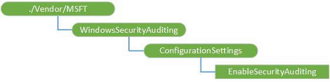

# <a name="windowssecurityauditing-csp"></a>WindowsSecurityAuditing 的 CSP


WindowsSecurityAuditing 配置服务提供程序 (CSP) 用于启用安全审核事件日志。 Windows 10 1511年版本中添加了该 CSP。

下面的关系图以树格式显示 WindowsSecurityAuditing 配置服务提供程序。



<a href="" id="windowssecurityauditing"></a>**WindowsSecurityAuditing**  
根节点。

<a href="" id="configurationsettings"></a>**ConfigurationSettings**  
处理所有的审核配置设置的内部节点。 在此节点中不使用获取操作。 它仅用于分组配置设置。

<a href="" id="configurationsettings-enablesecurityauditing"></a>**ConfigurationSettings/EnableSecurityAuditing**  
指定是否启用或禁用审核的设备。

值类型是布尔值。 如果为 true，将上载; 日志文件到捕获一组默认的审核事件如果为 false，则禁用审核，未记录的事件。 默认值为 false。

支持的操作包括获取和替换。

## <a name="examples"></a>示例


启用日志记录审核事件。

``` syntax
<SyncML xmlns="SYNCML:SYNCML1.2">
  <SyncBody>
    <Replace>
      <CmdID>1</CmdID>
      <Item>
        <Target>
          <LocURI>
            ./Vendor/MSFT/WindowsSecurityAuditing/ConfigurationSettings/EnableSecurityAuditing
          </LocURI>
        </Target>
        <Meta>
          <Format xmlns="syncml:metinf">bool</Format>
          <Type>text/plain</Type>
        </Meta>
        <Data>true</Data>
      </Item>
    </Replace>
    <Final/> 
  </SyncBody>
</SyncML>
```

有关 Windows 安全审核的详细信息，请参阅[安全审计中的新增](https://technet.microsoft.com/itpro/windows/whats-new/security-auditing)。

 

 


