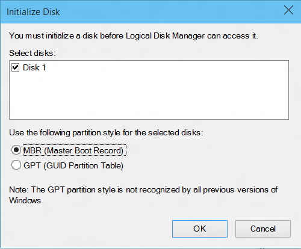

# <a name="hardware-compatibility-specification-for-systems-for-windows-10-version-1607"></a>系统为窗口 10 版本 1607年硬件兼容性规范

本节文档提供系统运行 Windows 10，1607年版本的硬件兼容性指标。

 - [System.Client.BluetoothController.Base](#system-client-bluetoothcontroller-base)
 - [System.Client.BluetoothController.NonUSB](#system-client-bluetoothcontroller-nonusb)
 - [System.Client.BluetoothController.USB](#system-client-bluetoothcontroller-usb)
 - [System.Client.BrightnessControls](#system-client-brightnesscontrols)
 - [System.Client.Buttons](#system-client-buttons)
 - [System.Client.Camera](#system-client-camera)
 - [System.Client.Digitizer](#system-client-digitizer)
 - [System.Client.Digitizer.Pen](#system-client-digitizer-pen)
 - [System.Client.Digitizer.PrecisionTouchpad](#system-client-digitizer-precisiontouchpad)
 - [System.Client.Digitizer.Touch](#system-client-digitizer-touch)
 - [System.Client.Firmware.UEFI.GOP](#system-client-firmware-uefi-gop)
 - [System.Client.Graphics](#system-client-graphics)
 - [System.Client.MobileBroadBand](#system-client-mobilebroadband)
 - [System.Client.PCContainer](#system-client-pccontainer)
 - [System.Client.RadioManagement](#system-client-radiomanagement)
 - [System.Client.RadioManagement.ConnectedStandby](#system-client-radiomanagement-connectedstandby)
 - [System.Client.SystemConfiguration](#system-client-systemconfiguration)
 - [System.Client.SystemImage](#system-client-systemimage)
 - [System.Client.SystemPartition](#system-client-systempartition)
 - [System.Client.ScreenRotation](#system-client-screenrotation)
 - [System.Client.Tablet.Graphics](#system-client-tablet-graphics)
 - [System.Client.WLAN.BasicConnectivity](#system-client-wlan-basicconnectivity)
 - [System.Client.WLAN.HangDetectionAndRecovery](#system-client-wlan-hangdetectionandrecovery)
 - [System.Client.WLAN.HostedNetwork](#system-client-wlan-hostednetwork)
 - [System.Client.WLAN.WiFiDirect](#system-client-wlan-wifidirect)
 - [System.Client.WLAN.Miracast](#system-client-wlan-miracast)
 - [System.Fundamentals.DebugPort](#system-fundamentals-debugport)
 - [System.Fundamentals.DebugPort.USB](#system-fundamentals-debugport-usb)
 - [System.Fundamentals.EnergyEstimation](#system-fundamentals-energyestimation)
 - [System.Fundamentals.Firmware](#system-fundamentals-firmware)
 - [System.Fundamentals.Firmware.Boot](#system-fundamentals-firmware-boot)
 - [System.Fundamentals.Firmware.CS](#system-fundamentals-firmware-cs)
 - [System.Fundamentals.Firmware.TPR](#system-fundamentals-firmware-tpr)
 - [System.Fundamentals.Graphics](#system-fundamentals-graphics)
 - [System.Fundamentals.Graphics.DisplayRender](#system-fundamentals-graphics-displayrender)
 - [System.Fundamentals.Graphics.HybridGraphics](#system-fundamentals-graphics-hybridgraphics)
 - [System.Fundamentals.Graphics.InternalDisplay](#system-fundamentals-graphics-internaldisplay)
 - [System.Fundamentals.Graphics.MultipleDevice](#system-fundamentals-graphics-multipledevice)
 - [System.Fundamentals.Graphics.RenderOnly](#system-fundamentals-graphics-renderonly)
 - [System.Fundamentals.HAL](#system-fundamentals-hal)
 - [System.Fundamentals.Input](#system-fundamentals-input)
 - [System.Fundamentals.MarkerFile](#system-fundamentals-markerfile)
 - [System.Fundamentals.Network](#system-fundamentals-network)
 - [System.Fundamentals.NX](#system-fundamentals-nx)
 - [System.Fundamentals.PowerManagement](#system-fundamentals-powermanagement)
 - [System.Fundamentals.PowerManagement.CS](#system-fundamentals-powermanagement-cs)
 - [System.Fundamentals.PXE](#system-fundamentals-pxe)
 - [System.Fundamentals.Reliability](#system-fundamentals-reliability)
 - [System.Fundamentals.Security](#system-fundamentals-security)
 - [System.Fundamentals.ServerNano](#system-fundamentals-servernano)
 - [System.Fundamentals.SignedDrivers](#system-fundamentals-signeddrivers)
 - [System.Fundamentals.SMBIOS](#system-fundamentals-smbios)
 - [System.Fundamentals.StorageAndBoot](#system-fundamentals-storageandboot)
 - [System.Fundamentals.StorageClassMemory](#system-fundamentals-storageclassmemory)
 - [System.Fundamentals.SystemAudio](#system-fundamentals-systemaudio)
 - [System.Fundamentals.SystemPCIController](#system-fundamentals-systempcicontroller)
 - [System.Fundamentals.SystemUSB](#system-fundamentals-systemusb)
 - [System.Fundamentals.TPM20](#system-fundamentals-tpm20)
 - [System.Fundamentals.TrustedPlatformModule](#system-fundamentals-trustedplatformmodule)
 - [System.Fundamentals.USBBoot](#system-fundamentals-usbboot)
 - [System.Fundamentals.USBDevice](#system-fundamentals-usbdevice)
 - [System.Fundamentals.WatchDogTimer](#system-fundamentals-watchdogtimer)
 - [System.Server.Assurance](#system-server-assurance)
 - [System.Server.AzureStack](#system-server-azurestack)
 - [System.Server.AzureStack.Storage](#system-server-azurestack-storage)
 - [System.Server.AzureStack.Networking](#system-server-azurestack-networking)
 - [System.Server.AzureStack.Firmware](#system-server-azurestack-firmware)
 - [System.Server.AzureStack.Security](#system-server-azurestack-security)
 - [System.Server.AzureStack.Security.Base](#system-server-azurestack-security-base)
 - [System.Server.AzureStack.BMC](#system-server-azurestack-bmc)
 - [System.Server.AzureStack.BMC.Base](#system-server-azurestack-bmc-base)
 - [System.Server.Base](#system-server-base)
 - [System.Server.BMC](#system-server-bmc)
 - [System.Server.DynamicPartitioning](#system-server-dynamicpartitioning)
 - [System.Server.FaultTolerant](#system-server-faulttolerant)
 - [System.Server.Firmware.UEFI.GOP](#system-server-firmware-uefi-gop)
 - [System.Server.Firmware.VBE](#system-server-firmware-vbe)
 - [System.Server.Graphics](#system-server-graphics)
 - [System.Server.Manageability.Redfish](#system-server-manageability-redfish)
 - [System.Server.PowerManageable](#system-server-powermanageable)
 - [System.Server.RemoteFX](#system-server-remotefx)
 - [System.Server.SMBIOS](#system-server-smbios)
 - [System.Server.StorageManageability.Smapi](#system-server-storagemanageability-smapi)
 - [System.Server.StorageManageability.Smapi.BlockStorage](#system-server-storagemanageability-smapi-blockStorage)
 - [System.Server.StorageManageability.Smapi.BlockStorage.RemoteReplication](#system-server-storagemanageability-smapi-blockStorage-remotereplication)
 - [System.Server.StorageManageability.Smapi.FileStorage](#system-server-storagemanageability-smapi-filestorage)
 - [System.Server.StorageManageability.Smapi.Smi](#system-server-storagemanageability-smapi-smi)
 - [System.Server.SVVP](#system-server-svvp)
 - [System.Server.SystemStress](#system-server-systemstress)
 - [System.Server.Virtualization](#system-server-virtualization)
 - [System.Server.WHEA](#system-server-whea)
 - [System.Solutions.AzureStack](#system-solutions-azurestack)
 - [System.Solutions.StorageSpacesDirect](#system.solutions-storagespacesdirect)

## <a name="systemclientbluetoothcontrollerbase"></a>System.Client.BluetoothController.Base

*这些要求适用于具有一般 Bluetooth 控制器系统。*


### <a name="systemclientbluetoothcontrollerbase4lespecification"></a>System.Client.BluetoothController.Base.4LeSpecification

*如果系统包含启用了 Bluetooth 控制器必须支持 Bluetooth 4.0 规范要求。*

<table>
<tr>
<th>适用于</th>
<td>
<p>（家庭、 Pro、 企业和教育） 的桌面版本的 Windows 10 x64</p>
<p>（家庭、 Pro、 企业和教育） 的桌面版本的 Windows 10 x86</p>
<p>Windows 10 移动 ARM</p>
<p>Windows 10 Mobile x86</p>
</td></tr></table>

**说明**

Bluetooth 启用的控制器必须遵守的基本速率 (BR) 和低能耗 (LE) 的组合核心配置控制器部分和法规遵从性 Bluetooth 版本 4.0 规范中列出的主机控制器接口 (HCI) 核心配置需求。


### <a name="systemclientbluetoothcontrollerbasecs"></a>System.Client.BluetoothController.Base.CS

*使用启用了 Bluetooth 控制器支持连接备用系统必须提供与 Microsoft 的收件箱 Bluetooth 堆栈。*

<table>
<tr>
<th>适用于</th>
<td>
<p>（家庭、 Pro、 企业和教育） 的桌面版本的 Windows 10 x64</p>
<p>（家庭、 Pro、 企业和教育） 的桌面版本的 Windows 10 x86</p>
<p>Windows 10 移动 ARM</p>
<p>Windows 10 Mobile x86</p>
</td></tr></table>


**说明**

支持连接待机附带了 Bluetooth 启用控制器的系统必须提供与 Microsoft 的收件箱 Bluetooth 堆栈。 


### <a name="systemclientbluetoothcontrollerbasehciextensions-if-implemented"></a>System.Client.BluetoothController.Base.HciExtensions （如果实现）

*广告和 RSSI 监视卸载 MSFT 定义 HCI 扩展支持的硬件。*                                                                                                                                                       

<table>
<tr>
<th>适用于</th>
<td>
<p>（家庭、 Pro、 企业和教育） 的桌面版本的 Windows 10 x64</p>
<p>（家庭、 Pro、 企业和教育） 的桌面版本的 Windows 10 x86</p>
<p>Windows 10 移动 ARM</p>
<p>Windows 10 Mobile x86</p>
</td></tr></table>


**说明**  

 支持 Microsoft OSG 定义 Bluetooth HCI 扩展的无线电收发器必须符合规范，并通过相关的 HLKWLK 测试。 晚些时候，将共享的规范的详细信息。 通过连接，将会通知合作伙伴。


### <a name="systemclientbluetoothcontrollerbaselestatecombinations"></a>System.Client.BluetoothController.Base.LEStateCombinations

*启用 Bluetooth 控制器的系统必须支持最小的一组 LE 状态组合。*

<table>
<tr>
<th>适用于</th>
<td>
<p>（家庭、 Pro、 企业和教育） 的桌面版本的 Windows 10 x64</p>
<p>（家庭、 Pro、 企业和教育） 的桌面版本的 Windows 10 x86</p>
<p>Windows 10 移动 ARM</p>
<p>Windows 10 Mobile x86</p>
</td></tr></table>


**说明**

启用 Bluetooth 控制器必须允许指标 LE 状态组合 (允许在部分\[音量 6\]部件 B、 Bluetooth 4.0 版规范部分 1.1.1)。


### <a name="systemclientbluetoothcontrollerbaselewhitelist"></a>System.Client.BluetoothController.Base.LEWhiteList

*启用 Bluetooth 控制器的系统必须支持的至少 LE 允许列表大小的 25 项。*

<table>
<tr>
<th>适用于</th>
<td>
<p>（家庭、 Pro、 企业和教育） 的桌面版本的 Windows 10 x64</p>
<p>（家庭、 Pro、 企业和教育） 的桌面版本的 Windows 10 x86</p>
<p>Windows 10 移动 ARM</p>
<p>Windows 10 Mobile x86</p>
</td></tr></table>


**说明**

在系统上的启用了 Bluetooth 控制器必须支持至少 25 个条目中的其允许远程低能源 (LE) 设备的列表。


### <a name="systemclientbluetoothcontrollerbasenobluetoothlefilterdriver"></a>System.Client.BluetoothController.Base.NoBluetoothLEFilterDriver

*不允许 Bluetooth LE 筛选器驱动程序在 BTHLEENUM 上加载。SYS。*

<table>
<tr>
<th>适用于</th>
<td>
<p>（家庭、 Pro、 企业和教育） 的桌面版本的 Windows 10 x64</p>
<p>（家庭、 Pro、 企业和教育） 的桌面版本的 Windows 10 x86</p>
<p>Windows 10 移动 ARM</p>
<p>Windows 10 Mobile x86</p>
</td></tr></table>


**说明**

若要确保在整个 Windows 应用商店应用程序使用 Bluetooth LE (GATT) WinRT API 的统一体验，筛选器驱动程序应加载在 BTHLEENUM 上。SYS。


### <a name="systemclientbluetoothcontrollerbaseonoffstatecontrollableviasoftware"></a>System.Client.BluetoothController.Base.OnOffStateControllableViaSoftware

*启用 Bluetooth 控制器的开/关状态必须为可以通过软件控制。*

<table>
<tr>
<th>适用于</th>
<td>
<p>（家庭、 Pro、 企业和教育） 的桌面版本的 Windows 10 x64</p>
<p>（家庭、 Pro、 企业和教育） 的桌面版本的 Windows 10 x86</p>
<p>Windows 10 移动 ARM</p>
<p>Windows 10 Mobile x86</p>
</td></tr></table>


**说明**

当关闭无线电设备，应到其最低电源控制器启用的 Bluetooth 受支持的电源状态，没有传输/接收应发生。 Windows 将通过卸载的收件箱协议驱动程序和他们的孩子，提交 HCI 终止 Bluetooth 活动\_重置到控制器中，然后又将控制器设置为 D3 逻辑电源状态时，它允许根据无线电关闭的电源总线驱动程序的命令。 如果总线支持的方法可用来打开无线电，无线电可以被完全关闭。 我们将不支持任何其他供应商的软件控制组件。

在重新打开无线电设备，Windows 的 Bluetooth 堆栈应恢复为 D0，它允许重新启动设备总线驱动程序的设备。 Windows Bluetooth 堆栈应再重新启用 Bluetooth 组件控制器的初始化。

只应为内部启用 Bluetooth 4.0 控制器启用 Bluetooth 无线电管理。

启用 Bluetooth 的控制器的开/关状态应可通过软件所述 Bluetooth 软件无线电开关控制。 Off 状态被定义，至少，作为禁用启用 Bluetooth 模块的天线组件，因此可能没有传输/接收。 不得有任何的纯硬件开关来控制启用 Bluetooth 无线电设备的电源。

无线电设备必须保持关闭状态睡眠并重新启动。


### <a name="systemclientbluetoothcontrollerbasesimultaneousbredrandletraffic"></a>System.Client.BluetoothController.Base.SimultaneousBrEdrAndLeTraffic

*启用 Bluetooth 控制器必须支持同时 BR/EDR 和 LE 通信。*

<table>
<tr>
<th>适用于</th>
<td>
<p>（家庭、 Pro、 企业和教育） 的桌面版本的 Windows 10 x64</p>
<p>（家庭、 Pro、 企业和教育） 的桌面版本的 Windows 10 x86</p>
<p>Windows 10 移动 ARM</p>
<p>Windows 10 Mobile x86</p>
</td></tr></table>


**说明**

启用 Bluetooth 控制器必须允许基本速率 BR/增强数据速率 (EDR) 和低能耗 (LE) 无线电收发器同时使用。


### <a name="systemclientbluetoothcontrollerbasewidebandspeech"></a>System.Client.BluetoothController.Base.WidebandSpeech

<table>
<tr>
<th>适用于</th>
<td>
<p>Windows 10 移动 ARM</p>
<p>Windows 10 Mobile x86</p>
</td></tr></table>


**说明**

宽带语音启用高清晰度语音质量 （音频的采样率而不是仅 8 KHz 16 KHz） 在 Windows 设备用户通信通过外围还支持宽带语音 Bluetooth 时的电话录音。

这意味着 Bluetooth 无线电收发器，必须在所定义的 Bluetooth SIG[免提配置文件 (HFP) 1.6 规范](https://www.bluetooth.org/docman/handlers/downloaddoc.ashx?doc_id=238193)和[核心版本 4.1](https://www.bluetooth.org/DocMan/handlers/DownloadDoc.ashx?doc_id=282159) Bluetooth 规范中包含[核心规范附录 (CSA) 2](https://www.bluetooth.org/docman/handlers/downloaddoc.ashx?doc_id=245127)的硬件支持宽带语音。 至少，它必须使用至少一个 Bluetooth SIG 定义的宽带语音编码解码器 (目前为 mSBC)。

**业务理由︰**

我们希望用户在 Windows 上使用 Bluetooth 外围设备时遇到最佳可能的质量的音频。 宽带语音正成为支持 HFP 配置文件的外围设备的标准。 我们的竞争对手已经支持它。


### <a name="systemclientbluetoothcontrollerbasewlanbtcoexistence"></a>System.Client.BluetoothController.Base.WLANBTCoexistence

*支持 WLAN 和 Bluetooth 的 Windows 系统必须满足 WLAN BT 共存性要求。*

<table>
<tr>
<th>适用于</th>
<td>
<p>（家庭、 Pro、 企业和教育） 的桌面版本的 Windows 10 x64</p>
<p>（家庭、 Pro、 企业和教育） 的桌面版本的 Windows 10 x86</p>
<p>Windows 10 移动 ARM</p>
<p>Windows 10 Mobile x86</p>
</td></tr></table>


**说明**

支持 WLAN 和 Bluetooth 的 Windows 系统必须满足下面列出的要求的 WLAN BT 共存。 要求是适用于所有的 WLAN 设备在所有总线类型。

 - 当 Bluetooth 正在扫描新设备时，必须除去与 WLAN 接入点的连接。

 - 必须能够同时扫描 WLAN 和 Bluetooth 网络。


## <a name="systemclientbluetoothcontrollernonusb"></a>System.Client.BluetoothController.NonUSB

*这些要求适用于具有启用非 USB Bluetooth 控制器系统。*


### <a name="systemclientbluetoothcontrollernonusbnonusbusesmicrosoftsstack"></a>System.Client.BluetoothController.NonUSB.NonUsbUsesMicrosoftsStack

*任何平台使用非 USB 连接启用了 Bluetooth 控制器必须随附 Microsoft 的收件箱 Bluetooth 堆栈。*

<table>
<tr>
<th>适用于</th>
<td>
<p>（家庭、 Pro、 企业和教育） 的桌面版本的 Windows 10 x64</p>
<p>（家庭、 Pro、 企业和教育） 的桌面版本的 Windows 10 x86</p>
<p>Windows 10 移动 ARM</p>
<p>Windows 10 Mobile x86</p>
</td></tr></table>


**说明**

任何平台使用非 USB 连接启用了 Bluetooth 控制器必须随附*Microsoft 的收件箱 Bluetooth*堆栈。 


### <a name="systemclientbluetoothcontrollernonusbscosupport"></a>System.Client.BluetoothController.NonUSB.ScoSupport

*任何平台上的用非 USB 连接启用了 Bluetooth 控制器必须使用 SCO 的旁带通道。*

<table>
<tr>
<th>适用于</th>
<td>
<p>（家庭、 Pro、 企业和教育） 的桌面版本的 Windows 10 x64</p>
<p>（家庭、 Pro、 企业和教育） 的桌面版本的 Windows 10 x86</p>
<p>Windows 10 移动 ARM</p>
<p>Windows 10 Mobile x86</p>
</td></tr></table>


**说明**

任何平台使用非 USB 连接启用了 Bluetooth 控制器必须使用 （如在 I2S/PCM 接口 SCO) SCO 旁带通道。


## <a name="systemclientbluetoothcontrollerusb"></a>System.Client.BluetoothController.USB

*这些要求适用于具有启用 USB Bluetooth 控制器系统。*


### <a name="systemclientbluetoothcontrollerusbscodatatransportlayer"></a>System.Client.BluetoothController.USB.ScoDataTransportLayer

*启用 Bluetooth 的主控制器支持 Bluetooth 2.1 + EDR 规范中规定 SCO 数据传输层。*

<table>
<tr>
<th>适用于</th>
<td>
<p>（家庭、 Pro、 企业和教育） 的桌面版本的 Windows 10 x64</p>
<p>（家庭、 Pro、 企业和教育） 的桌面版本的 Windows 10 x86</p>
<p>Windows 10 移动 ARM</p>
<p>Windows 10 Mobile x86</p>
</td></tr></table>


**说明**

启用 Bluetooth 控制器的系统必须符合与同步连接方向 (SCO)-详列 Bluetooth 系统、 2.1 版 + 增强数据速率 (EDR) 一部分的规范的 USB 要求部分 3.5。


## <a name="systemclientbrightnesscontrols"></a>System.Client.BrightnessControls 

*本节介绍了亮度控制系统的要求。*


### <a name="systemclientbrightnesscontrolsbacklightoptimization"></a>System.Client.BrightnessControls.BacklightOptimization

Windows 显示驱动程序模型 (*WDDM) 1.2 驱动程序必须启用方案基于背光电源优化，以减少所使用的集成面板背光级别。*

<table>
<tr>
<th>适用于</th>
<td>
<p>（家庭、 Pro、 企业和教育） 的桌面版本的 Windows 10 x64</p>
<p>（家庭、 Pro、 企业和教育） 的桌面版本的 Windows 10 x86</p>
<p>Windows 10 移动 ARM</p>
<p>Windows 10 Mobile x86</p>
<p>Windows 服务器 2016 x64</p>
</td></tr></table>


**说明**

 - 如果 WDDM 驱动程序支持方案基于背光电源优化，它必须表明支持，通过实施 DXGK\_亮度\_接口 2 接口。

 - 当 Windows 将使用 DxgkDdiSetBacklightOptimization 函数来设置当前方案时，WDDM 驱动程序需要接受该方案的目的如下︰

     - DxgkBacklightOptimizationDisable︰ 完全禁用所有背光优化需要的驱动程序。

     - DxgkBacklightOptimizationDesktop︰ 需要驱动程序才能启用背景光在较低级别的优化。 驱动程序必须优化方案，如照片查看浏览器、 Office 文档。

     - DxgkBacklightOptimizationDynamic︰ 启用进取级别较高的背光优化需要的驱动程序。 驱动程序必须优化方案，如视频播放和游戏。

     -  DxgkBacklightOptimizationDimmed︰ 启用进取级别较高的背光优化需要的驱动程序。 驱动程序必须确保在屏幕上的内容是可见的但它需要不太清晰。

 - 驱动程序可以动态地更改级别根据屏幕上的内容。

 - 驱动程序，则需要处理 Windows （根据用户输入或环境光线传感器） 的亮度级别同时保持背光优化已启用的更改请求。

 - 驱动程序需要进取级别之间逐渐转换︰

     - 当用户简要调用回放控件，这是在这种情况的重要。 在那时，Windows 将重置从 DxgkBacklightOptimizationDynamic 到 DxgkBacklightOptimizationDesktop 的方案。 转换不能一步，但必须逐步升级。<br/><br/>

 - WDDM 驱动程序，则需要提供准确的信息，当窗口查询 DxgkDdiGetBacklightReduction。

 - 其他显示设备连接到系统必须不会影响系统的集成面板上执行背光优化的能力。

 

### <a name="systemclientbrightnesscontrolsbrightnesscontrolbuttons"></a>System.Client.BrightnessControls.BrightnessControlButtons

*具有内置的物理亮度控制功能键的系统使用标准的 ACPI 事件和系统固件支持 ACPI 方法通过液晶屏背光灯亮度控制。*

<table>
<tr>
<th>适用于</th>
<td>
<p>（家庭、 Pro、 企业和教育） 的桌面版本的 Windows 10 x64</p>
<p>（家庭、 Pro、 企业和教育） 的桌面版本的 Windows 10 x86</p>
<p>Windows 10 移动 ARM</p>
<p>Windows 10 Mobile x86</p>
<p>Windows 服务器 2016 x64</p>
</td></tr></table>


**说明**

窗口为用户提供液晶屏亮度控制用户界面。 如果系统实现了对操作系统是不可见的项，这些项必须使用高级配置和电源接口 (ACPI) 的方法。 这些密钥必须不直接控制亮度后的第 2 位\_DOS 方法已被设置。 这就要求系统固件中的 ACPI 亮度方法的实现。

下列方法是必需的︰

 - \_BCL
 - \_BCM

2 位\_必须禁用 DOS 方法，以便系统固件无法自动更改亮度级别。

下列方法是可选的︰

为支持\_BQC 方法是强烈建议，但不是必需。 系统必须为下列 ACPI 通知值映射键︰

 - ACPI\_通知\_周期\_亮度\_0x85 的热键

 - ACPI\_通知\_INC\_亮度\_0x86 的热键

 - ACPI\_通知\_12 月\_亮度\_0x87 热键

 - ACPI\_通知\_0\_亮度\_0x88 的热键

 
*设计备注︰*

\_BCL 和\_的固件中的 BCM 方法使操作系统查询的亮度范围和值，并设置新值。 请参阅 ACPI 3.0 规范有关更多详细信息。


### <a name="systemclientbrightnesscontrolssmoothbrightness"></a>System.Client.BrightnessControls.SmoothBrightness

*驱动程序必须在所有亮度更改请求响应来自 Windows 支持平稳过渡。*

<table>
<tr>
<th>适用于</th>
<td>
<p>（家庭、 Pro、 企业和教育） 的桌面版本的 Windows 10 x64</p>
<p>（家庭、 Pro、 企业和教育） 的桌面版本的 Windows 10 x86</p>
<p>Windows 10 移动 ARM</p>
<p>Windows 10 Mobile x86</p>
<p>Windows 服务器 2016 x64</p>
</td></tr></table>


**说明**

1.  支持平滑亮度控制所需的亮度控件支持的所有 Windows 系统

2.  所有系统都需要向 Windows 报告 101 亮度级别。 因此，这意味着 0 到 100 级别，包括 0 和 100 %会报告亮度。 内部的驱动程序可能支持更细粒度的亮度控制。

3.  这是为了确保 Windows 能够更改屏幕亮度的精细。 但是，亮度滑块 UI 可能公开滑块通过较少的级别，因为可能要调整很多级别的用户的麻烦。

4.  WDDM 驱动程序需要该驱动程序没有平滑的嵌入式控制器 (EC) 根据在实现平滑的亮度控制。

5.  WDDM 驱动程序需要表明支持使用 DXGK 中定义的功能位的平滑的亮度控制\_亮度\_接口 2 接口。

6.  WDDM 驱动程序必须启用/禁用基于使用 DxgkDdiSetBrightnessState 设置的状态的平滑的亮度控制。

7.  当 Windows 请求亮度的变化时，驱动程序需要逐渐随着时间的推移改变亮度级别，以便更改不是一步。

8.  允许选择过渡适当斜度 WDDM 驱动程序。 但是，过渡必须完成在不到 2 秒。

9.  WDDM 驱动程序允许改变斜率根据面板特性以确保流畅的亮度控制。

10. WDDM 驱动程序，则需要启动新的亮度级别请求立即响应。 即使系统已在现有过渡的过程中，这必须进行确认。 这种一次，系统必须停止在当前级别的现有过渡并从当前位置开始新的转变。 这将确保当用户使用该滑块若要手动调整亮度，亮度控制是仍然响应并不缓慢。

11. WDDM 驱动程序，则需要继续支持平滑亮度控制，即使基于内容的自适应亮度优化目前正在生效。

12. WDDM 驱动程序时即插即用启动，它必须检测应用由固件的亮度级别和平稳过渡从该级别由 Windows 设置的水平。

13. 其他显示设备连接到系统必须不会影响执行平滑集成系统的面板上的亮度控制的能力。

14. 为在 Windows %表示亮度级别。 因此，没有绝对映射级别和物理亮度亮度 %之间。 针对 Windows 8，下面是指导。


<table>
<thead>
<tr class="header">
<th>表示窗口的百分比</th>
<th>用户体验</th>
</tr>
</thead>
<tbody>
<tr class="odd">
<td>0%</td>
<td>亮度级别如屏幕上的内容是勉强可见的用户</td>
</tr>
<tr class="even">
<td>100%</td>
<td>面板所支持的最大亮度</td>
</tr>
</tbody>
</table>


## <a name="systemclientbuttons"></a>System.Client.Buttons

<!--There is no content provided here in the original Word file.-->

### <a name="systemclientbuttonshardwarebuttons"></a>System.Client.Buttons.HardwareButtons

*正确实现的硬件按钮*

<table>
<tr>
<th>适用于</th>
<td>
<p>（家庭、 Pro、 企业和教育） 的桌面版本的 Windows 10 x64</p>
<p>（家庭、 Pro、 企业和教育） 的桌面版本的 Windows 10 x86</p>
<p>Windows 10 移动 ARM</p>
<p>Windows 10 Mobile x86</p>
</td></tr></table>


**说明**

这一要求是当前可选，直到 2017年将不会强制执行。

必须根据以下页面上的指导实现硬件按钮︰ <https://msdn.microsoft.com/en-us/library/windows/hardware/dn957423(v=vs.85).aspx>

必须使用标准化的 ACPI 一般按钮设备 (ACPI0011) 指定 GPIO 按钮︰ <https://msdn.microsoft.com/en-us/library/windows/hardware/dn957422(v=vs.85).aspx>

其中按钮不有线通过 GPIO 中断的情况下，按钮必须申报到 Windows 作为 HID 集合。 隐藏的按钮报告描述符必须遵循下面的页中指定的报告描述符︰ <https://msdn.microsoft.com/en-us/library/windows/hardware/dn457881(v=vs.85).aspx>


## <a name="systemclientcamera"></a>System.Client.Camera

<!--No content was provided here in the original Word file.-->

### <a name="systemclientcameradevice"></a>System.Client.Camera.Device

*集成摄像头的系统必须满足照相机设备要求。*

<table>
<tr>
<th>适用于</th>
<td>
<p>（家庭、 Pro、 企业和教育） 的桌面版本的 Windows 10 x64</p>
<p>（家庭、 Pro、 企业和教育） 的桌面版本的 Windows 10 x86</p>
<p>Windows 10 移动 ARM</p>
<p>Windows 10 Mobile x86</p>
</td></tr></table>


**说明**

在系统上的每个集成的摄像头必须遵守**Device.Streaming.Camera.Base**和所有相关的要求。 如果集成的摄像头为 USB 相机，它必须为系统查找认证来遵守**Device.Streaming.Camera.UVC** 。

注意︰ 使用方面为 '**Device.Streaming.Camera.Base.UsageIndicator'**如果系统中安装了多个摄像头，然后一个物理指标 （例如指示灯） 是可以接受的只要它指示使用只要一个或更多的照相机正在使用中。 不带显示器的系统必须有一个物理指标。


### <a name="systemclientcameraphysicallocation"></a>System.Client.Camera.PhysicalLocation

*集成摄像头的系统必须报告每个相机的物理位置。*

<table>
<tr>
<th>适用于</th>
<td>
<p>（家庭、 Pro、 企业和教育） 的桌面版本的 Windows 10 x64</p>
<p>（家庭、 Pro、 企业和教育） 的桌面版本的 Windows 10 x86</p>
<p>Windows 10 移动 ARM</p>
<p>Windows 10 Mobile x86</p>
</td></tr></table>


**说明**

对于任何相机设备内置的系统的机箱，以机械方式具有固定的方向，固件必须提供\_PLD 方法和设置面板字段 (位\[69:67\]) 为适当的值，在其上安装摄像头的面板。 例如，"前面"指示摄像头面对用户，而"上一步"表示摄像机朝从最终用户。

此外，位 143:128 （垂直位移），并位 159:144 （水平位移） 必须提供关于显示相机的相对位置。 此原点是相对于中显示组件的本机像素寻址。 原点是显示，左下角的水平和垂直偏移值为正向右部，分别是。 有关详细信息，请参阅 ACPI 版本 5.0 部分 6.1.8"设备配置\_PLD （物理设备的位置）。"

必须指定照相机设备方向相对于默认的系统显示方向 （也称为本机系统显示方向） \_PLD 旋转字段 （115-118 位）。 当像素读出从相机传感器可以正确显示不带任何旋转，然后相机传感器的\_PLD 的旋转值必须设置为 0。 当读取相机传感器的像素必须是要能正确显示，顺时针旋转 90 度，然后相机传感器的\_PLD 的旋转值必须设置为 2，依此类推。

中的所有其他字段\_PLD 是可选的。


### <a name="systemclientcameravideocaptureandcameracontrols"></a>System.Client.Camera.VideoCaptureAndCameraControls

*集成摄像头的系统满足的需求，并可支持 Windows 捕获基础结构。*

<table>
<tr>
<th>适用于</th>
<td>
<p>（家庭、 Pro、 企业和教育） 的桌面版本的 Windows 10 x64</p>
<p>（家庭、 Pro、 企业和教育） 的桌面版本的 Windows 10 x86</p>
<p>Windows 10 移动 ARM</p>
<p>Windows 10 Mobile x86</p>
</td></tr></table>


**说明**

*系统内存︰*

系统内存必须得到支持。

*独立于流︰*

所有集成的照相机必须支持独立流之间不同的针脚和不同的筛选器 （照相机），根据广告的设备配置文件中列出的功能。 如果照相机不支持配置文件，然后为*所有*系统照相机的并发流是可选的。

*镜像︰*

镜像的默认状态必须是"未镜像的。

*相机上的控制 （*如果实现)*:*

每个下面相机上的控制是可选的。

 - 关注 (率 ROI) 的地区

 - Focus

 - 曝光

 - 白平衡

 - 缩放

 - 照相机闪光灯

 - 场景模式

 - 优化提示

 - 光学图像稳定

 - 逆光对比

 - Brightness

 - Contrast

 - 曝光补偿

 - 色相

 - 全景

 - 倾斜

 - 前滚

 - 视频稳定化

 - 可变帧速率

 - 人脸检测

 - 视频的 HDR

 - 直方图

 - 高级的照片

如果照相机驱动程序中实现的任何单个控件时，必须遵守在 WDK 控制规范。

*照片序列 （*如果实现)*:*

照片序列捕获一系列响应单击一张照片的照片。 捕获管线将发送给照相机驱动程序连续序列中捕获照片的缓冲区。 这种模式还允许捕获照片前"用户单击"让用户不会丢失片刻的时间。

如果照相机硬件支持照片序列，它必须公开通过照片模式属性的功能，而且符合性能要求。

设备和驱动程序，必须启用照片序列︰

 - 在正常模式下支持公开的相同分辨率

 - 报告可能照片序列模式中的当前帧速率根据当前光条件。 设备必须遵守，不得超过由应用程序设置的最大帧速率。

 - 在测量的最小 4 fps 时支持图像针或 8MP 所公开的最大分辨率的较小者。

 - 在过去提供至少 4 帧图像针或 8MP 所公开的最大分辨率的较小者。

 - 开/关应独立地执行，无论预览照片序列。

 - 提供照片序列模式中连续帧图像针或 8MP 所公开的最大分辨率的较小者。

 - 如果驱动程序输出 JPEG 格式照片序列它还必须支持缩略图，根据请求，在 1/2 x、 x 1/4、 1/8 x 和 1/16 x 的宽度和高度原始图像分辨率。

 - 由照相机的 JPEG 图像 （可选） 可能有 EXIF 元数据，指示"flash 激发"信息。 EXIF 信息将不包括个人身份信息，如位置，唯一的 id，以及其他。

*变量的照片序列 （*如果实现)*:*

变量的照片序列捕获有限数量的图像和支持捕捉到的图像的每个变化捕获参数的能力。 如果照相机驱动程序中实现该驱动程序应能够返回所请求的图像数按照顺序，每一个都有不同的捕获参数按照应用程序的说明。 驱动程序应该能够 preprogram 的需要设置每个框架的独立捕获参数之前启动捕获的帧数。

建议变量相片序列允许应用程序指定以下参数，每个框架，但至少是一种必须实现副支持︰

 - 曝光

 - ISO

 - 在 EV 曝光补偿

 - 焦点位置

 - 闪存

如果未设置任何参数，则在每个框架设置驱动程序应遵循的全局设置和 3A 锁。 例如当使用 EV 括号，驱动程序应确保相关曝光等收益和风险根据 EV 括号设置设置的参数。  驱动程序可能会自动白平衡设置不同图像帧中，除非为每个框架设置使用手动白平衡设置，或在应用程序的情况下使用白平衡锁。 不推荐 （除非手动指定由应用程序），镜头位置自动更改 VP 帧之间。


## <a name="systemclientdigitizer"></a>System.Client.Digitizer

<!--No content was provided here in the original Word file.-->

### <a name="systemclientdigitizerbasesystemdigitizerbase"></a>System.Client.Digitizer.Base.SystemDigitizerBase

*系统数字化仪基座*

<table>
<tr>
<th>适用于</th>
<td>
<p>（家庭、 Pro、 企业和教育） 的桌面版本的 Windows 10 x64</p>
<p>（家庭、 Pro、 企业和教育） 的桌面版本的 Windows 10 x86</p>
<p>Windows 10 移动 ARM</p>
<p>Windows 10 Mobile x86</p>
<p>Windows 服务器 2016 x64</p>
</td></tr></table>


**说明**

必须满足并集成到一个系统时验证以下数字化基础设备级要求。 请以下**Device.Input.Digitizer.Base**要求全部要求的详细信息，参阅︰

 - Device.Input.Digitizer.Base.ContactReports
 - Device.Input.Digitizer.Base.HIDCompliant
 - Device.Input.Digitizer.Base.ThirdPartyDrivers


### <a name="systemclientdigitizersystempen"></a>System.Client.Digitizer.SystemPen

*系统笔*

<table>
<tr>
<th>适用于</th>
<td>
<p>Windows 10 移动 ARM</p>
<p>Windows 10 Mobile x86</p>
</td></tr></table>


**说明**

必须满足并集成到一个系统时验证以下笔设备级要求。 请以下**Device.Input.Digitizer.Pen**要求全部要求的详细信息，参阅︰

 - Device.Input.Digitizer.Pen.Accuracy
 - Device.Input.Digitizer.Pen.Buffering
 - Device.Input.Digitizer.Pen.CustomGestures
 - Device.Input.Digitizer.Pen.Eraser
 - Device.Input.Digitizer.Pen.HoverRange
 - Device.Input.Digitizer.Pen.Jitter
 - Device.Input.Digitizer.Pen.Latency
 - Device.Input.Digitizer.Pen.Pressure
 - Device.Input.Digitizer.Pen.ReportRate
 - Device.Input.Digitizer.Pen.Resolution


### <a name="systemclientdigitizersystemtouch"></a>System.Client.Digitizer.SystemTouch

*系统触摸*

<table>
<tr>
<th>适用于</th>
<td>
<p>（家庭、 Pro、 企业和教育） 的桌面版本的 Windows 10 x64</p>
<p>（家庭、 Pro、 企业和教育） 的桌面版本的 Windows 10 x86</p>
<p>Windows 10 移动 ARM</p>
<p>Windows 10 Mobile x86</p>
</td></tr></table>


**说明**

下面的触摸设备级别要求必须满足并集成到一个系统时验证。 请以下**Device.Input.Digitizer.Touch**要求全部要求的详细信息，参阅︰

 - Device.Input.Digitizer.Touch.Accuracy
 - Device.Input.Digitizer.Touch.Buffering
 - Device.Input.Digitizer.Touch.CustomGestures
 - Device.Input.Digitizer.Touch.FingerSeparation
 - Device.Input.Digitizer.Touch.Jitter
 - Device.Input.Digitizer.Touch.Latency
 - Device.Input.Digitizer.Touch.MinContactCount
 - Device.Input.Digitizer.Touch.ReportRate
 - Device.Input.Digitizer.Touch.Resolution

Microsoft 强烈建议能够报告 5 个或更多同时接触点触摸解决方案。  这可确保平台与第三方应用程序依赖于触摸屏输入兼容，并且最终用户就能够调用所有 Windows 提供的系统笔势。

Microsoft 认识到 extenuating 的情况下存在，由此扩展的笔势的体验不是必要。  为适应这套系统的非常有限，我们作出以下补助︰

生成配置，自定义企业级的图像，或用于特定垂直企业市场，销售的系统可以提供触摸屏能够报告的单一联系点。  例如，系统设计用于卫生保健、 军事应用和销售点。

任何系统能支持多个单一的联系点将无法调用泛型类似鼠标的行为之外的任何系统笔势。 

可以选择依赖于键盘和鼠标的主输入模态，而无需将 tablet 模式设备，转化能力作为一个系统集成触摸解决方案能够支持最少 2 个联系点。  示例包括︰ 外部显示，多功能一体台式机系统。 

任何能支持 2 个以上同时接触点的系统将无法调用 4 手指辅助手势。
所有其它系统必须支持至少 5 个接触点


### <a name="systemclientdigitizersystemprecisiontouchpad"></a>System.Client.Digitizer.SystemPrecisionTouchpad

*精度触摸板*

<table>
<tr>
<th>适用于</th>
<td>
<p>（家庭、 Pro、 企业和教育） 的桌面版本的 Windows 10 x64</p>
<p>（家庭、 Pro、 企业和教育） 的桌面版本的 Windows 10 x86</p>
<p>Windows 服务器 2016 x64</p>
</td></tr></table>


**说明**

必须满足并集成到一个系统时验证以下精度触摸板设备级要求。 请以下**Device.Input.Digitizer.PrecisionTouchpad**要求全部要求的详细信息，参阅︰

 - Device.Input.Digitizer.PrecisionTouchpad.Accuracy
 - Device.Input.Digitizer.PrecisionTouchpad.Buffering
 - Device.Input.Digitizer.PrecisionTouchpad.Buttons
 - Device.Input.Digitizer.PrecisionTouchpad.ContactTipSwitchHeight
 - Device.Input.Digitizer.PrecisionTouchpad.DeviceTypeReporting
 - Device.Input.Digitizer.PrecisionTouchpad.Dimensions
 - Device.Input.Digitizer.PrecisionTouchpad.FingerSeparation
 - Device.Input.Digitizer.PrecisionTouchpad.Jitter
 - Device.Input.Digitizer.PrecisionTouchpad.Latency
 - Device.Input.Digitizer.PrecisionTouchpad.MinMaxContacts
 - Device.Input.PrecisionTouchpad.Precision.InputResolution
 - Device.Input.Digitizer.PrecisionTouchpad.SelectiveReporting
 
不可能根据精度触摸板如果设备需要 3<sup>研发</sup>方驱动程序安装，以报告为精度触摸板推广触摸板。


## <a name="systemclientdigitizerpen"></a>System.Client.Digitizer.Pen

<!--No content was provided here in the original Word file.-->

### <a name="systemclientdigitizerpenaccuracy"></a>System.Client.Digitizer.Pen.Accuracy

*联系系统笔的精确度*

<table>
<tr>
<th>适用于</th>
<td>
<p>Windows 10 移动 ARM</p>
<p>Windows 10 Mobile x86</p>
</td></tr></table>


**说明**

必须满足并集成到一个系统时验证以下笔设备水平要求。 请**Device.Input.Digitizer.Pen.Accuracy**要求将完全要求的详细信息，参阅。


### <a name="systemclientdigitizerpenbuffering"></a>System.Client.Digitizer.Pen.Buffering

*系统对于高恢复延迟与总线缓冲的笔*

<table>
<tr>
<th>适用于</th>
<td>
<p>Windows 10 移动 ARM</p>
<p>Windows 10 Mobile x86</p>
</td></tr></table>


**说明**

必须满足并集成到一个系统时验证以下笔设备水平要求。 请**Device.Input.Digitizer.Pen.Buffering**要求将完全要求的详细信息，参阅。


### <a name="systemclientdigitizerpencontactreports"></a>System.Client.Digitizer.Pen.ContactReports

*系统笔数字化器的可靠性*

<table>
<tr>
<th>适用于</th>
<td>
<p>Windows 10 移动 ARM</p>
<p>Windows 10 Mobile x86</p>
</td></tr></table>


**说明**

必须满足并集成到一个系统时验证以下笔设备水平要求。 请**Device.Input.Digitizer.Pen.ContactReports**要求将完全要求的详细信息，参阅。


### <a name="systemclientdigitizerpencustomgestures"></a>System.Client.Digitizer.Pen.CustomGestures

*系统自定义的运行时系统笔势*

<table>
<tr>
<th>适用于</th>
<td>
<p>Windows 10 移动 ARM</p>
<p>Windows 10 Mobile x86</p>
</td></tr></table>


**说明**

必须满足并集成到一个系统时验证以下笔设备水平要求。 请**Device.Input.Digitizer.Pen.CustomGestures**要求将完全要求的详细信息，参阅。


### <a name="systemclientdigitizerpeneraser"></a>System.Client.Digitizer.Pen.Eraser

*系统笔橡皮擦功能可见性︰*

<table>
<tr>
<th>适用于</th>
<td>
<p>Windows 10 移动 ARM</p>
<p>Windows 10 Mobile x86</p>
</td></tr></table>


**说明**

必须满足并集成到一个系统时验证以下笔设备水平要求。 请**Device.Input.Digitizer.Pen.Eraser**要求将完全要求的详细信息，参阅。


### <a name="systemclientdigitizerpenhidcompliant"></a>System.Client.Digitizer.Pen.HIDCompliant

*系统笔 HID 标准的设备的固件和/或隐藏微型端口驱动程序*

<table>
<tr>
<th>适用于</th>
<td>
<p>Windows 10 移动 ARM</p>
<p>Windows 10 Mobile x86</p>
</td></tr></table>


**说明**

必须满足并集成到一个系统时验证以下笔设备水平要求。 请**Device.Input.Digitizer.Pen.HIDCompliant**要求将完全要求的详细信息，参阅。


### <a name="systemclientdigitizerpenhoverrange"></a>System.Client.Digitizer.Pen.HoverRange

*系统笔悬停范围*

<table>
<tr>
<th>适用于</th>
<td>
<p>Windows 10 移动 ARM</p>
<p>Windows 10 Mobile x86</p>
</td></tr></table>


**说明**

必须满足并集成到一个系统时验证以下笔设备水平要求。 请**Device.Input.Digitizer.Pen.HoverRange**要求将完全要求的详细信息，参阅。


### <a name="systemclientdigitizerpenjitter"></a>System.Client.Digitizer.Pen.Jitter

*系统笔抖动和线性*

<table>
<tr>
<th>适用于</th>
<td>
<p>Windows 10 移动 ARM</p>
<p>Windows 10 Mobile x86</p>
</td></tr></table>


**说明**

必须满足并集成到一个系统时验证以下笔设备水平要求。 请**Device.Input.Digitizer.Pen.Jitter**要求将完全要求的详细信息，参阅。


### <a name="systemclientdigitizerpenlatency"></a>System.Client.Digitizer.Pen.Latency

*系统笔响应延迟*

<table>
<tr>
<th>适用于</th>
<td>
<p>Windows 10 移动 ARM</p>
<p>Windows 10 Mobile x86</p>
</td></tr></table>


**说明**

必须满足并集成到一个系统时验证以下笔设备水平要求。 请**Device.Input.Digitizer.Pen.Latency**要求将完全要求的详细信息，参阅。


### <a name="systemclientdigitizerpenpressure"></a>System.Client.Digitizer.Pen.Pressure

*系统笔压力报告*

<table>
<tr>
<th>适用于</th>
<td>
<p>Windows 10 移动 ARM</p>
<p>Windows 10 Mobile x86</p>
</td></tr></table>


**说明**

必须满足并集成到一个系统时验证以下笔设备水平要求。 请**Device.Input.Digitizer.Pen.Pressure**要求将完全要求的详细信息，参阅。


### <a name="systemclientdigitizerpenreportrate"></a>System.Client.Digitizer.Pen.ReportRate

*系统报告率笔*

<table>
<tr>
<th>适用于</th>
<td>
<p>Windows 10 移动 ARM</p>
<p>Windows 10 Mobile x86</p>
</td></tr></table>


**说明**

必须满足并集成到一个系统时验证以下笔设备水平要求。 请**Device.Input.Digitizer.Pen.ReportRate**要求将完全要求的详细信息，参阅。


### <a name="systemclientdigitizerpenresolution"></a>System.Client.Digitizer.Pen.Resolution

*系统笔输入的分辨率*

<table>
<tr>
<th>适用于</th>
<td>
<p>Windows 10 移动 ARM</p>
<p>Windows 10 Mobile x86</p>
</td></tr></table>


**说明**

必须满足并集成到一个系统时验证以下笔设备水平要求。 请**Device.Input.Digitizer.Pen.Resolution**要求将完全要求的详细信息，参阅。


### <a name="systemclientdigitizerpenthirdpartydrivers"></a>System.Client.Digitizer.Pen.ThirdPartyDrivers

*系统笔服务和 3<sup>rd</sup>当事方的驱动程序的可用性*

<table>
<tr>
<th>适用于</th>
<td>
<p>Windows 10 移动 ARM</p>
<p>Windows 10 Mobile x86</p>
</td></tr></table>


**说明**

必须满足并集成到一个系统时验证以下笔设备水平要求。 请**Device.Input.Digitizer.Pen.ThirdPartyDrivers**要求将完全要求的详细信息，参阅。


## <a name="systemclientdigitizerprecisiontouchpad"></a>System.Client.Digitizer.PrecisionTouchpad

<!--No content was provided here in the original Word file.-->

### <a name="systemclientdigitizerprecisiontouchpadaccuracy"></a>System.Client.Digitizer.PrecisionTouchpad.Accuracy

*系统精度触摸板精度*

<table>
<tr>
<th>适用于</th>
<td>
<p>Windows 10 移动 ARM</p>
<p>Windows 10 Mobile x86</p>
</td></tr></table>


**说明**

必须满足并集成到一个系统时验证以下精度触摸板设备级别要求。 请**Device.Input.Digitizer.PrecisionTouchpad.Accuracy**要求将完全要求的详细信息，参阅。


### <a name="systemclientdigitizerprecisiontouchpadbuffering"></a>System.Client.Digitizer.PrecisionTouchpad.Buffering

*系统总线缓冲，高恢复延迟精度触摸板*

<table>
<tr>
<th>适用于</th>
<td>
<p>Windows 10 移动 ARM</p>
<p>Windows 10 Mobile x86</p>
</td></tr></table>


**说明**

必须满足并集成到一个系统时验证以下精度触摸板设备级别要求。 请**Device.Input.Digitizer.PrecisionTouchpad.Buffering**要求将完全要求的详细信息，参阅。


### <a name="systemclientdigitizerprecisiontouchpadbuttons"></a>System.Client.Digitizer.PrecisionTouchpad.Buttons

*系统精度触摸板物理按钮和报告按钮*

<table>
<tr>
<th>适用于</th>
<td>
<p>Windows 10 移动 ARM</p>
<p>Windows 10 Mobile x86</p>
</td></tr></table>


**说明**

必须满足并集成到一个系统时验证以下精度触摸板设备级别要求。 请**Device.Input.Digitizer.PrecisionTouchpad.Buttons**要求将完全要求的详细信息，参阅。


### <a name="systemclientdigitizerprecisiontouchpadcontactreports"></a>System.Client.Digitizer.PrecisionTouchpad.ContactReports

*系统精度触摸板数字化仪的可靠性*

<table>
<tr>
<th>适用于</th>
<td>
<p>Windows 10 移动 ARM</p>
<p>Windows 10 Mobile x86</p>
</td></tr></table>


**说明**

必须满足并集成到一个系统时验证以下精度触摸板设备级别要求。 请**Device.Input.Digitizer.PrecisionTouchpad.ContactReports**要求将完全要求的详细信息，参阅。


### <a name="systemclientdigitizerprecisiontouchpadcontacttipswitchheight"></a>System.Client.Digitizer.PrecisionTouchpad.ContactTipSwitchHeight

*系统精度触摸板联系提示开关高度*

<table>
<tr>
<th>适用于</th>
<td>
<p>Windows 10 移动 ARM</p>
<p>Windows 10 Mobile x86</p>
</td></tr></table>


**说明**

必须满足并集成到一个系统时验证以下精度触摸板设备级别要求。 请**Device.Input.Digitizer.PrecisionTouchpad.ContactTipSwitchHeight**要求将完全要求的详细信息，参阅。


### <a name="systemclientdigitizerprecisiontouchpaddevicetypereporting"></a>System.Client.Digitizer.PrecisionTouchpad.DeviceTypeReporting

*系统精度触摸板设备类型*

<table>
<tr>
<th>适用于</th>
<td>
<p>Windows 10 移动 ARM</p>
<p>Windows 10 Mobile x86</p>
</td></tr></table>


**说明**

必须满足并集成到一个系统时验证以下精度触摸板设备级别要求。 请**Device.Input.Digitizer.PrecisionTouchpad.DeviceTypeReporting**要求将完全要求的详细信息，参阅。


### <a name="systemclientdigitizerprecisiontouchpaddimensions"></a>System.Client.Digitizer.PrecisionTouchpad.Dimensions

*系统精度触摸板尺寸*

<table>
<tr>
<th>适用于</th>
<td>
<p>Windows 10 移动 ARM</p>
<p>Windows 10 Mobile x86</p>
</td></tr></table>


**说明**

必须满足并集成到一个系统时验证以下精度触摸板设备级别要求。 请**Device.Input.Digitizer.PrecisionTouchpad.Dimensions**要求将完全要求的详细信息，参阅。


### <a name="systemclientdigitizerprecisiontouchpadfingerseparation"></a>System.Client.Digitizer.PrecisionTouchpad.FingerSeparation

*系统精度触摸板手指分离*

<table>
<tr>
<th>适用于</th>
<td>
<p>Windows 10 移动 ARM</p>
<p>Windows 10 Mobile x86</p>
</td></tr></table>


**说明**

必须满足并集成到一个系统时验证以下精度触摸板设备级别要求。 请**Device.Input.Digitizer.PrecisionTouchpad.FingerSeparation**要求将完全要求的详细信息，参阅。


### <a name="systemclientdigitizerprecisiontouchpadhidcompliant"></a>System.Client.Digitizer.PrecisionTouchpad.HIDCompliant

*系统精度触摸板 HID 标准的设备的固件和/或隐藏微型端口驱动程序*

<table>
<tr>
<th>适用于</th>
<td>
<p>Windows 10 移动 ARM</p>
<p>Windows 10 Mobile x86</p>
</td></tr></table>


**说明**

必须满足并集成到一个系统时验证以下精度触摸板设备级别要求。 请**Device.Input.Digitizer.PrecisionTouchpad.HIDCompliant**要求将完全要求的详细信息，参阅。


### <a name="systemclientdigitizerprecisiontouchpadinputresolution"></a>System.Client.Digitizer.PrecisionTouchpad.InputResolution

*系统精度触摸板输入的分辨率*

<table>
<tr>
<th>适用于</th>
<td>
<p>Windows 10 移动 ARM</p>
<p>Windows 10 Mobile x86</p>
</td></tr></table>


**说明**

必须满足并集成到一个系统时验证以下精度触摸板设备级别要求。 请对**Device.Input.Digitizer.PrecisionTouchpad.Input 分辨率**要求全部要求的详细信息，参阅。


### <a name="systemclientdigitizerprecisiontouchpadjitter"></a>System.Client.Digitizer.PrecisionTouchpad.Jitter

*系统精度触摸板抖动和线性*

<table>
<tr>
<th>适用于</th>
<td>
<p>Windows 10 移动 ARM</p>
<p>Windows 10 Mobile x86</p>
</td></tr></table>


**说明**

必须满足并集成到一个系统时验证以下精度触摸板设备级别要求。 请**Device.Input.Digitizer.PrecisionTouchpad.Jitter**要求将完全要求的详细信息，参阅。


### <a name="systemclientdigitizerprecisiontouchpadlatency"></a>System.Client.Digitizer.PrecisionTouchpad.Latency

*系统精度触摸板响应延迟*

<table>
<tr>
<th>适用于</th>
<td>
<p>Windows 10 移动 ARM</p>
<p>Windows 10 Mobile x86</p>
</td></tr></table>


**说明**

必须满足并集成到一个系统时验证以下精度触摸板设备级别要求。 请**Device.Input.Digitizer.PrecisionTouchpad.Latency**要求将完全要求的详细信息，参阅。


### <a name="systemclientdigitizerprecisiontouchpadminmaxcontacts"></a>System.Client.Digitizer.PrecisionTouchpad.MinMaxContacts

*系统精度触摸板联系人计数*

<table>
<tr>
<th>适用于</th>
<td>
<p>Windows 10 移动 ARM</p>
<p>Windows 10 Mobile x86</p>
</td></tr></table>


**说明**

必须满足并集成到一个系统时验证以下精度触摸板设备级别要求。 请**Device.Input.Digitizer.PrecisionTouchpad.MinMaxContacts**要求将完全要求的详细信息，参阅。


### <a name="systemclientdigitizerprecisiontouchpadreportrate"></a>System.Client.Digitizer.PrecisionTouchpad.ReportRate

*系统精度触摸板报告率*

<table>
<tr>
<th>适用于</th>
<td>
<p>Windows 10 移动 ARM</p>
<p>Windows 10 Mobile x86</p>
</td></tr></table>


**说明**

必须满足并集成到一个系统时验证以下精度触摸板设备级别要求。 请**Device.Input.Digitizer.PrecisionTouchpad.ReportRate**要求全部要求的详细信息，参阅。


### <a name="systemclientdigitizerprecisiontouchpadselectivereporting"></a>System.Client.Digitizer.PrecisionTouchpad.SelectiveReporting

*系统精度触摸板选择性报告*

<table>
<tr>
<th>适用于</th>
<td>
<p>Windows 10 移动 ARM</p>
<p>Windows 10 Mobile x86</p>
</td></tr></table>


**说明**

必须满足并集成到一个系统时验证以下精度触摸板设备级别要求。 请**Device.Input.Digitizer.PrecisionTouchpad.SelectiveReporting**要求全部要求的详细信息，参阅。


### <a name="systemclientdigitizerprecisiontouchpadthirdpartydrivers"></a>System.Client.Digitizer.PrecisionTouchpad.ThirdPartyDrivers

*系统精度触摸板服务和 3<sup>rd</sup>当事方的驱动程序的可用性*

<table>
<tr>
<th>适用于</th>
<td>
<p>Windows 10 移动 ARM</p>
<p>Windows 10 Mobile x86</p>
</td></tr></table>


**说明**

必须满足并集成到一个系统时验证以下精度触摸板设备级别要求。 请**Device.Input.Digitizer.PrecisionTouchpad.ThirdPartyDrivers**要求全部要求的详细信息，参阅。


## <a name="systemclientdigitizertouch"></a>System.Client.Digitizer.Touch

<!--No content was provided here in the original Word file.-->

### <a name="systemclientdigitizertouchaccuracy"></a>System.Client.Digitizer.Touch.Accuracy

*系统触摸精确度*

<table>
<tr>
<th>适用于</th>
<td>
<p>（家庭、 Pro、 企业和教育） 的桌面版本的 Windows 10 x64</p>
<p>（家庭、 Pro、 企业和教育） 的桌面版本的 Windows 10 x86</p>
<p>Windows 10 移动 ARM</p>
<p>Windows 10 Mobile x86</p>
</td></tr></table>


**说明**

下面的触摸设备级别要求必须满足并集成到一个系统时验证。 请参考以下**Device.Input.Digitizer.Touch.Accuracv**要求全部要求的详细信息。


### <a name="systemclientdigitizertouchbuffering"></a>System.Client.Digitizer.Touch.Buffering

*对于总线缓冲，高恢复延迟系统触摸*

<table>
<tr>
<th>适用于</th>
<td>
<p>（家庭、 Pro、 企业和教育） 的桌面版本的 Windows 10 x64</p>
<p>（家庭、 Pro、 企业和教育） 的桌面版本的 Windows 10 x86</p>
<p>Windows 10 移动 ARM</p>
<p>Windows 10 Mobile x86</p>
</td></tr></table>


**说明**

下面的触摸设备级别要求必须满足并集成到一个系统时验证。 请参考以下**Device.Input.Digitizer.Touch.Buffering**要求全部要求的详细信息。


### <a name="systemclientdigitizertouchcontactreports"></a>System.Client.Digitizer.Touch.ContactReports

*系统触控数字化器的可靠性*

<table>
<tr>
<th>适用于</th>
<td>
<p>（家庭、 Pro、 企业和教育） 的桌面版本的 Windows 10 x64</p>
<p>（家庭、 Pro、 企业和教育） 的桌面版本的 Windows 10 x86</p>
<p>Windows 10 移动 ARM</p>
<p>Windows 10 Mobile x86</p>
</td></tr></table>


**说明**

下面的触摸设备级别要求必须满足并集成到一个系统时验证。 请参考以下**Device.Input.Digitizer.Touch.ContactReports**要求全部要求的详细信息。


### <a name="systemclientdigitizertouchcustomgestures"></a>System.Client.Digitizer.Touch.CustomGestures

*系统触摸屏输入自定义运行时系统笔势*

<table>
<tr>
<th>适用于</th>
<td>
<p>（家庭、 Pro、 企业和教育） 的桌面版本的 Windows 10 x64</p>
<p>（家庭、 Pro、 企业和教育） 的桌面版本的 Windows 10 x86</p>
<p>Windows 10 移动 ARM</p>
<p>Windows 10 Mobile x86</p>
</td></tr></table>


**说明**

下面的触摸设备级别要求必须满足并集成到一个系统时验证。 请参考以下**Device.Input.Digitizer.Touch.CustomGestures**要求全部要求的详细信息。


### <a name="systemclientdigitizertouchfingerseparation"></a>System.Client.Digitizer.Touch.FingerSeparation

*系统触摸手指分离*

<table>
<tr>
<th>适用于</th>
<td>
<p>（家庭、 Pro、 企业和教育） 的桌面版本的 Windows 10 x64</p>
<p>（家庭、 Pro、 企业和教育） 的桌面版本的 Windows 10 x86</p>
<p>Windows 10 移动 ARM</p>
<p>Windows 10 Mobile x86</p>
</td></tr></table>


**说明**

下面的触摸设备级别要求必须满足并集成到一个系统时验证。 请参考以下**Device.Input.Digitizer.Touch.FingerSeparation**要求全部要求的详细信息。


### <a name="systemclientdigitizertouchhidcompliant"></a>System.Client.Digitizer.Touch.HIDCompliant

*系统触摸 HID 标准的设备的固件和/或隐藏微型端口驱动程序*

<table>
<tr>
<th>适用于</th>
<td>
<p>（家庭、 Pro、 企业和教育） 的桌面版本的 Windows 10 x64</p>
<p>（家庭、 Pro、 企业和教育） 的桌面版本的 Windows 10 x86</p>
<p>Windows 10 移动 ARM</p>
<p>Windows 10 Mobile x86</p>
</td></tr></table>


**说明**

下面的触摸设备级别要求必须满足并集成到一个系统时验证。 请参考以下**Device.Input.Digitizer.Touch.HIDCompliant**要求全部要求的详细信息。


### <a name="systemclientdigitizertouchjitter"></a>System.Client.Digitizer.Touch.Jitter

*系统触摸抖动和线性*

<table>
<tr>
<th>适用于</th>
<td>
<p>（家庭、 Pro、 企业和教育） 的桌面版本的 Windows 10 x64</p>
<p>（家庭、 Pro、 企业和教育） 的桌面版本的 Windows 10 x86</p>
<p>Windows 10 移动 ARM</p>
<p>Windows 10 Mobile x86</p>
</td></tr></table>


**说明**

下面的触摸设备级别要求必须满足并集成到一个系统时验证。 请参考以下**Device.Input.Digitizer.Touch.Jitter**要求全部要求的详细信息。


### <a name="systemclientdigitizertouchlatency"></a>System.Client.Digitizer.Touch.Latency

*系统触摸响应延迟*

<table>
<tr>
<th>适用于</th>
<td>
<p>（家庭、 Pro、 企业和教育） 的桌面版本的 Windows 10 x64</p>
<p>（家庭、 Pro、 企业和教育） 的桌面版本的 Windows 10 x86</p>
<p>Windows 10 移动 ARM</p>
<p>Windows 10 Mobile x86</p>
</td></tr></table>


**说明**

下面的触摸设备级别要求必须满足并集成到一个系统时验证。 请参考以下**Device.Input.Digitizer.Touch.Latency**要求全部要求的详细信息。


### <a name="systemclientdigitizertouchmincontactcount"></a>System.Client.Digitizer.Touch.MinContactCount

*系统接触最小同时可报告的联系人*

<table>
<tr>
<th>适用于</th>
<td>
<p>（家庭、 Pro、 企业和教育） 的桌面版本的 Windows 10 x64</p>
<p>（家庭、 Pro、 企业和教育） 的桌面版本的 Windows 10 x86</p>
<p>Windows 10 移动 ARM</p>
<p>Windows 10 Mobile x86</p>
</td></tr></table>


**说明**

下面的触摸设备级别要求必须满足并集成到一个系统时验证。 请参考以下**Device.Input.Digitizer.Touch.MinContactCount**要求全部要求的详细信息。


### <a name="systemclientdigitizertouchreportrate"></a>System.Client.Digitizer.Touch.ReportRate

*系统触摸报告率*

<table>
<tr>
<th>适用于</th>
<td>
<p>（家庭、 Pro、 企业和教育） 的桌面版本的 Windows 10 x64</p>
<p>（家庭、 Pro、 企业和教育） 的桌面版本的 Windows 10 x86</p>
<p>Windows 10 移动 ARM</p>
<p>Windows 10 Mobile x86</p>
</td></tr></table>


**说明**

下面的触摸设备级别要求必须满足并集成到一个系统时验证。 请参考以下**Device.Input.Digitizer.Touch.ReportRate**要求全部要求的详细信息。


### <a name="systemclientdigitizertouchresolution"></a>System.Client.Digitizer.Touch.Resolution

*系统触摸输入的分辨率*

<table>
<tr>
<th>适用于</th>
<td>
<p>（家庭、 Pro、 企业和教育） 的桌面版本的 Windows 10 x64</p>
<p>（家庭、 Pro、 企业和教育） 的桌面版本的 Windows 10 x86</p>
<p>Windows 10 移动 ARM</p>
<p>Windows 10 Mobile x86</p>
</td></tr></table>


**说明**

下面的触摸设备级别要求必须满足并集成到一个系统时验证。 请参考以下**Device.Input.Digitizer.Touch.Resolution**要求全部要求的详细信息。


### <a name="systemclientdigitizertouchthirdpartydrivers"></a>System.Client.Digitizer.Touch.ThirdPartyDrivers

*系统接触服务和 3<sup>rd</sup>当事方的驱动程序的可用性*

<table>
<tr>
<th>适用于</th>
<td>
<p>（家庭、 Pro、 企业和教育） 的桌面版本的 Windows 10 x64</p>
<p>（家庭、 Pro、 企业和教育） 的桌面版本的 Windows 10 x86</p>
<p>Windows 10 移动 ARM</p>
<p>Windows 10 Mobile x86</p>
</td></tr></table>


**说明**

下面的触摸设备级别要求必须满足并集成到一个系统时验证。 请参考以下**Device.Input.Digitizer.Touch.ThirdPartyDrivers**要求全部要求的详细信息。


## <a name="systemclientfirmwareuefigop"></a>System.Client.Firmware.UEFI.GOP

<!--No content was provided here in the original Word file.-->

### <a name="systemclientfirmwareuefigopdisplay"></a>System.Client.Firmware.UEFI.GOP.Display

*系统固件必须支持图形输出协议 (GOP) 和 Windows 显示要求。*

<table>
<tr>
<th>适用于</th>
<td>
<p>（家庭、 Pro、 企业和教育） 的桌面版本的 Windows 10 x64</p>
<p>（家庭、 Pro、 企业和教育） 的桌面版本的 Windows 10 x86</p>
<p>Windows 10 移动 ARM</p>
<p>Windows 10 Mobile x86</p>
<p>Windows 服务器 2016 x64</p>
</td></tr></table>


**说明**

每个 Windows 客户机系统上的固件必须支持 GOP UEFI 2.3.1 中定义。 显示控制系统 （uefi） 之前接管 WDDM 图形驱动程序。 当 Windows EFI 引导管理器加载，GOP 必须可用。  不支持 VBIOS。 还有以前 UI，例如，OEM 徽标、 固件安装或密码提示屏幕允许 GOP 的需要。 在此期间，固件时在控件中，下列是的要求。

**拓扑结构选择**

 - （uefi） 可靠地检测到连接至开机自检适配器的所有显示器。 在安装操作系统之前屏幕只能在连接至后适配器的显示器上显示。

 - 如果检测到多个显示器，UEFI 必须显示安装操作系统之前屏幕根据以下逻辑︰

     - 系统具有集成显示器 (便携式计算机，所有在一个 Tablet): UEFI 必须在安装操作系统之前屏幕上显示只显示集成显示器。

     - 系统**没有**集成显示器 （集成的显示器是关闭或桌面系统）: （uefi） 必须在一个显示器上显示在安装操作系统之前屏幕。 （uefi） 必须通过优先考虑基于连接器类型显示选择显示。 该优先顺序如下︰ DisplayPort、 HDMI、 DVI、 HD15、 组件，S-视频。 如果有多台监视器连接使用相同的接口类型，则固件可以选择使用哪一个。

**模式选择**

 - 一旦 UEFI 已确定哪些显示启用以显示安装操作系统之前屏幕，它必须选择要应用基于以下逻辑的模式。

     - 系统具有集成显示器 (便携式计算机，所有在一个 Tablet): 显示必须始终设置为其原始分辨率和本机计时。

     - 系统**没有**集成显示器 （桌面）︰

         - UEFI 必须尝试通过从 EDID 设置的原始分辨率和显示时间。

         - 如果不支持，UEFI 必须选择备用模式匹配与显示器的本机分辨率相同的纵横比。

         - 在最低级别，UEFI 必须设置为 1024 x 768 的模式。

         - 如果显示设备不提供 EDID，（uefi） 必须设置为 1024 x 768 的模式。

     - 固件必须始终使用 32 位线性帧缓冲区以便显示屏幕的能力。

     - PixelsPerScanLine 必须等于 HorizontalResolution。

     - PixelFormat 必须是 PixelBlueGreenRedReserved8BitPerColor。 请注意的物理帧缓存器是必需的;不支持 PixelBltOnly。  

**修剪模式**

 - （uefi） 必须修剪 EFI 中提出的要求根据可用模式的列表\_图形\_输出\_协议。QueryMode() （按指定 UEFI 规范 2.1 版）

**提供 EDID**

 - UEFI 一旦 UEFI 相应的显示 （基于拓扑结构的选择） 上设置一种模式，必须获取显示器的 EDID 并传递到 Windows 时 Windows 使用 EFI\_EDID\_DISCOVERED\_（按指定 UEFI 规范版本 2.1） 查询的 EDID 的协议︰

     - 有可能某些集成的面板中显示面板本身可能具有 EDID。  在这种情况下，（uefi） 必须制造 EDID。 EDID 必须准确地指定本机计时和集成面板的物理尺寸。

     - 如果显示器未集成，并且没有 EDID，然后不需要制造 EDID （uefi）。


## <a name="systemclientgraphics"></a>System.Client.Graphics

<!--No content was provided here in the original Word file.-->

### <a name="systemclientgraphicsfullgpu"></a>System.Client.Graphics.FullGPU

*Windows 客户机系统上必须有"完全"图形设备，该设备必须开机自检设备。*

<table>
<tr>
<th>适用于</th>
<td>
<p>（家庭、 Pro、 企业和教育） 的桌面版本的 Windows 10 x64</p>
<p>（家庭、 Pro、 企业和教育） 的桌面版本的 Windows 10 x86</p>
<p>Windows 10 移动 ARM</p>
<p>Windows 10 Mobile x86</p>
</td></tr></table>


**说明**

WDDM 1.3 引入了多个驱动程序/设备类型︰ 完全、 仅呈现和只显示。 有关每个的详细说明，请参阅在**Device.Graphics.WDDM13.Base**要求 WDDM 1.3。
每个驱动程序/设备类型旨在用于特定方案和使用情况。 所有客户端方案中预期的"完整的"图形设备。 另外很多应用程序假定开机自检设备是"最佳"的图形设备和以独占方式使用该设备。 由于这个原因，Windows 客户机系统必须具有"完全"的图形驱动程序/设备能够显示、 呈现和视频。


### <a name="systemclientgraphicsnomorethanoneinternalmonitor"></a>System.Client.Graphics.NoMoreThanOneInternalMonitor

*图形驱动程序必须枚举为内部的多台监视器。*

<table>
<tr>
<th>适用于</th>
<td>
<p>（家庭、 Pro、 企业和教育） 的桌面版本的 Windows 10 x64</p>
<p>（家庭、 Pro、 企业和教育） 的桌面版本的 Windows 10 x86</p>
<p>Windows 10 移动 ARM</p>
<p>Windows 10 Mobile x86</p>
</td></tr></table>


**说明**

图形驱动程序必须列举多个显示目标的 D3DKMDT\_VOT\_在任何适配器上的内部类型。
*设计备注︰*有关详细信息，请参阅 Windows 7 在[http://go.microsoft.com/fwlink/?LinkId=237084](http://www.microsoft.com/whdc/device/display/graphicsguidewin7.mspx)的图形指南。 


### <a name="systemclientgraphicswddm"></a>System.Client.Graphics.WDDM

*所有的 Windows 图形驱动程序必须是 Windows 显示驱动程序模型 (WDDM)。*

<table>
<tr>
<th>适用于</th>
<td>
<p>（家庭、 Pro、 企业和教育） 的桌面版本的 Windows 10 x64</p>
<p>（家庭、 Pro、 企业和教育） 的桌面版本的 Windows 10 x86</p>
<p>Windows 10 移动 ARM</p>
<p>Windows 10 Mobile x86</p>
</td></tr></table>


**说明**

WDDM 体系结构提供的功能要启用功能，如桌面元素、 增强了故障容差、 视频内存管理器、 调度程序、 跨进程共享 D3D 曲面的等。 WDDM 特别设计的 Direct3D 10 功能级别 9 的最小值的现代图形设备\_与像素着色器 2.0 3 或更好的和有所有必要的硬件功能来支持的内存管理，计划，WDDM 功能和容错能力。

WDDMv1.3 是系统所需要的所有附带 Windows 10。

下表说明了方案中使用的图形驱动程序类型︰


<table>
<thead>
<tr class="header">
<th>模式</th>
<th>客户端</th>
<th>服务器</th>
<th>在虚拟环境中运行的客户端</th>
<th>虚拟服务器</th>
</tr>
</thead>
<tbody>
<tr class="odd">
<td>所有的图形</td>
<td>要求在过帐设备</td>
<td>可选</td>
<td>可选</td>
<td>可选</td>
</tr>
<tr class="even">
<td>仅显示</td>
<td>不允许</td>
<td>可选</td>
<td>可选</td>
<td>可选</td>
</tr>
<tr class="odd">
<td>仅呈现</td>
<td>非主适配器为可选</td>
<td>可选</td>
<td>可选</td>
<td>可选</td>
</tr>
<tr class="even">
<td>无外设</td>
<td>不允许</td>
<td>可选</td>
<td>N/A</td>
<td>N/A</td>
</tr>
</tbody>
</table>


### <a name="systemclientgraphicswddmsupportrotatedmodes"></a>System.Client.Graphics.WDDMSupportRotatedModes

*如果存在加速感应器，Windows 显示驱动程序模型 (WDDM) 驱动程序必须支持所有的旋转的模式。*

<table>
<tr>
<th>适用于</th>
<td>
<p>（家庭、 Pro、 企业和教育） 的桌面版本的 Windows 10 x64</p>
<p>（家庭、 Pro、 企业和教育） 的桌面版本的 Windows 10 x86</p>
<p>Windows 10 移动 ARM</p>
<p>Windows 10 Mobile x86</p>
</td></tr></table>


**说明**

具有加速感应器的系统，WDDM 驱动程序需要支持所有的旋转的模式集成面板枚举每个解决方法︰
 

 - WDDM 驱动程序，则需要枚举源集成的显示模式。 WDDM 驱动程序必须支持集成面板则列举每个模式的旋转的模式 （0、 90、 180 和 270）。

 - 旋转是即使在重复或扩展拓扑结构中，与其他显示设备集成的面板必须支持。 对于重复的模式，是可以接受的旋转旋转源相连的所有目标。 每个路径旋转是允许但不是要求。

上述的要求是可选的立体 3D 支持的解决办法。


### <a name="systemclientgraphicswirelessusbdisplay"></a>System.Client.Graphics.WirelessUSBDisplay

*无线系统限制和 USB 连接显示。*

<table>
<tr>
<th>适用于</th>
<td>
<p>（家庭、 Pro、 企业和教育） 的桌面版本的 Windows 10 x64</p>
<p>（家庭、 Pro、 企业和教育） 的桌面版本的 Windows 10 x86</p>
<p>Windows 10 移动 ARM</p>
<p>Windows 10 Mobile x86</p>
</td></tr></table>


**说明**

 - 显示设备 （监视器、 液晶屏、 电视） 投影仪只能通过图形 WDDM 驱动程序枚举到 Windows。 以间接方式显示此文档的目的是 WDDM 驱动程序

 - 必须至少一个显示设备物理连接到支持至少一个完整 WDDM 图形硬件 DX 9\_1 的硬件中。

 - Windows 仅支持一套固定的显示连接器 WDDM 中定义的一部分的[D3DKMDT\_视频\_输出\_技术](http://msdn.microsoft.com/en-us/library/windows/hardware/ff546605%28v=vs.85%29.aspx)枚举。

 - WDDM （或间接显示） 的驱动程序需要准确报告连接介质用来显示设备连接到系统。

 - Windows 支持通过 Miracast 连接的无线显示或间接显示，通过 WDDM1.3 或 WDDM2.0 的显示驱动程序。

 - 系统可能连接 DisplayPort，使用 USB 类型 C 替换模式的显示，并应该作为典型 DisplayPort 连接枚举此显示。

 - 系统可能使用的间接显示的驱动程序来连接 USB 显示。


## <a name="systemclientmobilebroadband"></a>System.Client.MobileBroadBand

*这些是集成到系统中的移动宽带设备的要求。*


### <a name="systemclientmobilebroadbandclassdriver"></a>System.Client.MobileBroadBand.ClassDriver

*移动宽带设备固件的基于 USB 接口的 GSM 和 CDMA 的类必须符合 USB-如果的移动宽带接口模型规范。*

<table>
<tr>
<th>适用于</th>
<td>
<p>（家庭、 Pro、 企业和教育） 的桌面版本的 Windows 10 x64</p>
<p>（家庭、 Pro、 企业和教育） 的桌面版本的 Windows 10 x86</p>
<p>Windows 10 移动 ARM</p>
<p>Windows 10 Mobile x86</p>
<p>Windows 服务器 2016 x64</p>
</td></tr></table>


**说明**

移动宽带设备固件实现的基于 USB 接口的 GSM 和 CDMA 的类必须符合 USB-如果的移动宽带接口模型 (MBIM) 规范。 没有其他的 IHV 驱动程序所需的设备的功能和设备必须使用微软手机 Broadband(MB) 类驱动程序实现。 请注意 Microsoft 泛型类驱动程序不支持非 USB 接口设备。 不基于 USB 的设备需要符合 MB 驱动程序模型规范的设备制造商的设备驱动程序。

更多详细信息︰ 
 - [移动宽带接口模型规范](http://www.usb.org/developers/devclass_docs/MBIM10.zip)
 - [移动宽带驱动程序模型规范](http://msdn.microsoft.com/en-us/library/windows/hardware/ff560543.aspx)

例外情况︰ 

 - 作为淘汰 (EOL) 截至 2011 年 12 月，宣布的设备模型。
 - 将不再生产订单行中的设备模型。 

请注意，上述例外适用才︰

 - 在 Windows 8 客户端 x86 和 x64 的 Windows 8 客户使用设备。
 - 设备是为多个运算符 (至少 20) 预认证。


### <a name="systemclientmobilebroadbandconcurrentradiousage"></a>System.Client.MobileBroadBand.ConcurrentRadioUsage

*系统构建者必须确保 RF 性能非常适合移动宽带、 Wi-Fi 和启用 Bluetooth 无线电收发器在同一时间运行。*

<table>
<tr>
<th>适用于</th>
<td>
<p>（家庭、 Pro、 企业和教育） 的桌面版本的 Windows 10 x64</p>
<p>（家庭、 Pro、 企业和教育） 的桌面版本的 Windows 10 x86</p>
<p>Windows 10 移动 ARM</p>
<p>Windows 10 Mobile x86</p>
<p>Windows 服务器 2016 x64</p>
</td></tr></table>


**说明**

系统构建者必须确保 RF 性能非常适合移动宽带、 Wi-Fi 和启用 Bluetooth 无线电收发器在同一时间运行。 启用 internet 连接共享 (tethering)、 多主页和网络交换所有的系统都需要多个无线电收发器，可同时处于活动状态。 高吞吐量、 高可靠性、 最佳电源效率和最小的 RF 干扰而不考虑系统的外观设置在这些情况下，应确保系统。


### <a name="systemclientmobilebroadbandmobilebroadband"></a>System.Client.MobileBroadBand.MobileBroadBand

*系统包括宽带支持满足 Windows 要求。*

<table>
<tr>
<th>适用于</th>
<td>
<p>（家庭、 Pro、 企业和教育） 的桌面版本的 Windows 10 x64</p>
<p>（家庭、 Pro、 企业和教育） 的桌面版本的 Windows 10 x86</p>
<p>Windows 10 移动 ARM</p>
<p>Windows 10 Mobile x86</p>
<p>Windows 服务器 2016 x64</p>
</td></tr></table>


**说明**

固件的要求

基于 USB 的 GSM 和 CDMA 技术 （基于 3GPP/3GPP2 标准） 的设备一定要符合移动宽带接口模型规范的固件。 这些设备需要 （可用的 MB 设备） 时，USB 论坛针对法规遵从性认证。

除上述固件需要支持下面列出的功能指定 NDIS 的。


<table>
<thead>
<tr class="header">
<th>固件功能</th>
<th>要求</th>
</tr>
</thead>
<tbody>
<tr class="odd">
<td>在没有暂停挂起</td>
<td>是否必需</td>
</tr>
<tr class="even">
<td>USB 选择性挂起</td>
<td>必需 – 如果基于 USB</td>
</tr>
<tr class="odd">
<td>无线电管理</td>
<td>是否必需</td>
</tr>
<tr class="even">
<td>唤醒移动宽带</td>
<td>是否必需</td>
</tr>
<tr class="odd">
<td>快速的非活跃状态</td>
<td>是否必需</td>
</tr>
</tbody>
</table>


没有其他的连接管理器软件是必需的移动宽带设备的运作。
将值添加移动宽带连接管理器，如果实现，需要实现移动宽带 API (<http://msdn.microsoft.com/en-us/library/dd323271 (VS.85).aspx)>。

Microsoft 强烈建议如模拟 USB，HSIC 的基于 USB 总线接口 （如果适用） 以及 SSIC （可用时）。 在 Windows 8 中的移动宽带堆栈旨在支持只有 USB 协议基于总线接口。 下表总结了所需的移动宽带功能。


<table>
<thead>
<tr class="header">
<th>属性</th>
<th>要求</th>
</tr>
</thead>
<tbody>
<tr class="odd">
<td>总线</td>
<td>USB HSCI （首选） 或 USB</td>
</tr>
</tbody>
</table>

<ul>
<li><p>设备必须支持 128 字节的 16 位图的唤醒的模式。</p></li>
<li><p>设备必须唤醒上注册状态更改的系统。</p></li>
<li><p>设备必须唤醒媒体上的系统连接。</p></li>
<li><p>设备必须唤醒上媒体断开连接的系统。</p></li>
<li><p>GSM 和 CDMA 类设备必须唤醒设备上接收传入的 SMS 消息的系统。</p></li>
<li><p>设备支持 USSD 必须唤醒在接收 USSD 消息系统。</p></li>
<li><p>设备必须支持唤醒数据包指示。 NIC 应缓存导致唤醒硬件并安装操作系统时准备好接收的传入数据包。</p></li>
<li><p>移动宽带设备的类必须支持在移动宽带上的唤醒。 上面提到的事件，它应在唤醒系统。 注意该唤醒 USSD 是必需的只有当设备报告它支持 USSD。 否则它是可选的。 有关 SMS，请参阅以下 MSDN 文档以了解更多信息并注册状态唤醒事件。</p>
<ul>
<li><p>NDIS_STATUS_WWAN_REGISTER_STATE</p></li>
<li><p>NDIS_STATUS_WWAN_SMS_RECEIVE</p></li>
</ul>
</li>
</ul>


## <a name="systemclientpccontainer"></a>System.Client.PCContainer

*窗口正朝着一个以中心设备演示文稿的计算机和设备。 计算机和所有连接到计算机的设备，将显示设备和打印机文件夹中，例如 Windows 用户界面 (UI) 元素。 此部分详细内容都需要电脑的要求作为 Windows 用户界面中的单个对象。*


### <a name="systemclientpccontainerpcappearsassingleobject"></a>System.Client.PCContainer.PCAppearsAsSingleObject

*计算机必须作为设备和打印机文件夹中的单个对象。*

<table>
<tr>
<th>适用于</th>
<td>
<p>（家庭、 Pro、 企业和教育） 的桌面版本的 Windows 10 x64</p>
<p>（家庭、 Pro、 企业和教育） 的桌面版本的 Windows 10 x86</p>
<p>Windows 10 移动 ARM</p>
<p>Windows 10 Mobile x86</p>
<p>Windows 服务器 2016 x64</p>
</td></tr></table>


**说明**

计算机必须作为设备和打印机文件夹中的单个对象。 Windows 包含它分组到单个对象所公开的计算机的所有功能的平台层。 此对象被称为计算机设备容器。 计算机设备容器必须包含所有实际位于计算机机箱里的设备功能。 这包括但不限于键盘、 触摸板;媒体控制/媒体传输密钥、 无线无线电收发器、 存储设备和音频设备。 计算机设备容器使用在 Windows 平台上，可见到设备和打印机用户界面中的用户。 这一要求通过实施设备和打印机文件夹中的"一个对象的每个物理设备"规则确保一致和高质量的用户体验。

计算机必须作为设备和打印机文件夹中的单个设备容器，原因如下︰ 不能为用户提供计算机的逻辑和理解表示设备和打印机。 哪些设备物理集成在一起的计算机的准确信息必须提供支持和相关的 Windows 功能。

*设计备注︰*

窗口正朝着一个以中心设备演示文稿的计算机和设备。 在计算机和所有连接到计算机的设备，将显示设备和打印机文件夹。 在设备和打印机中用一个图标来表示计算机。 所有计算机所公开的功能将可通过此单个图标对象，提供了一个用于用户发现设备与计算机集成在一起并在这些集成设备上执行特定操作的位置。 若要启用此经验，计算机必须能够检测并分组所有集成的计算机设备 （实际在电脑内的所有设备）。 这就要求该计算机集成的设备正确识别本身为集成的组件。 这可以通过表明该设备不从计算机中移除、 正确地连接到设备，端口配置 ACPI 或创建注册表的设备的 DeviceOverride 项。 (注︰ 每个总线类型具有不同的机制，用于标识与该总线连接的设备的可移动关系。

若要分组到单个设备的容器由计算机所公开的功能，Windows 将使用可用设备硬件、 总线驱动程序和系统 （uefi） 或 BIOS 和 Windows 注册表中的信息。 附加到给定的设备的总线类型确定启发式 Windows 适用于该设备进行分组。  白皮书，标题为"多功能设备支持，设备容器分组在 Windows 7 中，"可在<http://www.microsoft.com/whdc/Device/DeviceExperience/ContainerIDs.mspx>找到，说明启发式多总线类型，包括︰
 

 - 通用串行总线 (USB)
 - Bluetooth
 - IP 连接的设备使用插扩展 (PnP-X)
 - 1394
 - eSATA
 - PCI Express (PCIe)

必须检查如果尚未满足这一要求在系统上执行单个计算机显示对象测试 (ComputerSingleDDOTest.exe)。 该工具可用于 Windows 实验室工具包。


## <a name="systemclientradiomanagement"></a>System.Client.RadioManagement

*此功能包含的按钮控制的便携式计算机或 Tablet/转换的 PC 中任何无线电管理的要求。它还包含了对 GPS 无线电收发器，要求靠近字段近程无线电收发器，并且 Bluetooth 启用无线电收发器不使用本机 Windows Bluetooth 堆栈。*


### <a name="systemclientradiomanagementhardwarebutton"></a>System.Client.RadioManagement.HardwareButton

*如果一台电脑有物理 （硬件） 按钮打开和关闭无线无线电收发器电脑上切换，必须是可控制的软件并适当地与无线电管理 UI 交互。*

<table>
<tr>
<th>适用于</th>
<td>
<p>（家庭、 Pro、 企业和教育） 的桌面版本的 Windows 10 x64</p>
<p>（家庭、 Pro、 企业和教育） 的桌面版本的 Windows 10 x86</p>
<p>Windows 10 移动 ARM</p>
<p>Windows 10 Mobile x86</p>
<p>Windows 服务器 2016 x64</p>
</td></tr></table>


**说明**

那里不需要 Windows 10 便携式计算机或 tablet/转换电脑无线无线电的硬件按钮。 无线硬件按钮是下列之一︰

 - 切换按钮 （笔记本电脑和平板电脑）
 - 切换按钮与 LED （非连接备用支持笔记本电脑和平板电脑）
 - A-B 滑块开关 （笔记本电脑和平板电脑）
 - A-B 滑块开关指示灯 （非连接备用支持笔记本电脑和平板电脑）

无线无线电的硬件按钮时不必须有多个，并且它必须控制计算机中存在的所有无线电。LED，用于指示状态是开关的可选的。 请注意，不允许进行无线状态指示灯在支持连接的备用系统上。 如果指示灯和按钮，则它必须像此处定义︰

 - 只能有一个 LED，用于指示无线状态 （必须不有一个 LED 的 Bluetooth，一个 Wi-fi 等。）。
 - 如果全球无线状态为 ON，则必须亮指示灯。
 - 当全球的无线状态为 OFF 时，必须不亮指示灯。
 - 当按下按钮或翻转开关时，它必须发送无线电管理 API 可以占用的 HID 消息。
 - 当无线电管理 API 发送 HID 消息时，按钮或开关必须收到消息，并相应地更改指示灯的状态。


### <a name="systemclientradiomanagementradiomaintainsstate"></a>System.Client.RadioManagement.RadioMaintainsState

*收音机在睡眠和重新启动电源周期维护开/关状态。*

<table>
<tr>
<th>适用于</th>
<td>
<p>（家庭、 Pro、 企业和教育） 的桌面版本的 Windows 10 x64</p>
<p>（家庭、 Pro、 企业和教育） 的桌面版本的 Windows 10 x86</p>
<p>Windows 10 移动 ARM</p>
<p>Windows 10 Mobile x86</p>
<p>Windows 服务器 2016 x64</p>
</td></tr></table>


**说明**

无线功能的状态必须睡眠引导之后都会保留，请重新启动，用户注销用户切换和休眠。


### <a name="systemclientradiomanagementradiomanagementapihid"></a>System.Client.RadioManagement.RadioManagementAPIHID

*无线硬件按钮必须通信的无线电管理 api 使用 HID 的状态的更改。*

<table>
<tr>
<th>适用于</th>
<td>
<p>（家庭、 Pro、 企业和教育） 的桌面版本的 Windows 10 x64</p>
<p>（家庭、 Pro、 企业和教育） 的桌面版本的 Windows 10 x86</p>
<p>Windows 10 移动 ARM</p>
<p>Windows 10 Mobile x86</p>
<p>Windows 服务器 2016 x64</p>
</td></tr></table>


**说明**

当无线功能的状态切换更改，无论是滑块 A B 开关 （有或没有指示灯） 或切换按钮 （带有或不带 LED） 时，这符合 HID 标准的硬件开关/按钮必须公开要由无线电管理 API 的 HID 集合。 切换按钮不得直接更改设备无线电设备的状态。 A-B 命令行可以直接连接到无线电收发器，只要通信的无线电管理 api 使用的 HID 驱动程序状态的更改和更改的状态中存在电脑中的所有无线电收发器更改其状态。 HID 使用 Id 是︰ 


<table>
<thead>
<tr class="header">
<th>使用标识</th>
<th>使用名称</th>
<th>使用类型</th>
</tr>
</thead>
<tbody>
<tr class="odd">
<td>0x0C</td>
<td>无线电控制</td>
<td>CA</td>
</tr>
<tr class="even">
<td>0xC6</td>
<td>无线单选按钮</td>
<td>OOC</td>
</tr>
<tr class="odd">
<td>0xC7</td>
<td>无线设备指示灯</td>
<td>OOC</td>
</tr>
<tr class="even">
<td>0xC8</td>
<td>无线通讯滑块开关</td>
<td>OOC</td>
</tr>
</tbody>
</table>


下表显示集合。
<!--These tables, which were simple lists in the original Word document, seem like they should and could be unified. 
However, based on the text in the first columns, they aren't ready to simply have their columns of values packed into
the same table. Creating a table that accommodates the differences is beyond the scope of this conversion to Markdown.-->

**表 1。而便携式计算机、 平板电脑和改装为 LED （无状态按钮） – 按钮**

<table border="2">
<tr>
<td>使用\_页 （普通台式计算机）</td>
<td>05 01</td>
</tr>
<tr>
<td>使用 （无线电控制）</td>
<td>09 0 C</td>
</tr>
<tr>
<td>集 （应用程序）</td>
<td>A1 01</td>
</tr>
<tr>
<td>&nbsp;&nbsp;&nbsp;逻辑\_最小值 (0)</td>
<td>15 00</td>
</tr>
<tr>
<td>&nbsp;&nbsp;&nbsp;逻辑\_(1) 的最大值</td>
<td>25 01</td>
</tr>
<tr>
<td>&nbsp;&nbsp;&nbsp;使用 （无线单选按钮）</td>
<td>09 C6</td>
</tr>
<tr>
<td>&nbsp;&nbsp;&nbsp;报告\_计数 (1)</td>
<td>95 01</td>
</tr>
<tr>
<td>&nbsp;&nbsp;&nbsp;报告\_大小 (1)</td>
<td>75 01</td>
</tr>
<tr>
<td>&nbsp;&nbsp;&nbsp;输入 (数据，方差，Rel)</td>
<td>81 06</td>
</tr>
<tr>
<td>&nbsp;&nbsp;&nbsp;报告\_大小 (7)</td>
<td>75 07</td>
</tr>
<tr>
<td>&nbsp;&nbsp;&nbsp;输入 (Cnst，Var，Abs)</td>
<td>81 03</td>
</tr>
<tr>
<td>最终\_集合</td>
<td>C0</td>
</tr>
</table>


**表 2。带有 LED — 为便携式计算机、 平板电脑和改装不支持连接的待机按钮**

<table border="2" cellpadding="0" cellspacing="0" width="0">
<tr>
<td>使用\_页 （普通台式计算机）</td>
<td>05 01</td>
</tr>
<tr>
<td>使用 （无线电控制）</td>
<td>09 0 C</td>
</tr>
<tr>
<td>集 （应用程序）</td>
<td>A1 01</td>
</tr>
<tr>
<td>&nbsp;&nbsp;&nbsp;逻辑\_最小值 (0)</td>
<td>15 00</td>
</tr>
<tr>
<td>&nbsp;&nbsp;&nbsp;逻辑\_(1) 的最大值</td>
<td>25 01</td>
</tr>
<tr>
<td>&nbsp;&nbsp;&nbsp;使用 （无线单选按钮）</td>
<td>09 C6</td>
</tr>
<tr>
<td>&nbsp;&nbsp;&nbsp;报告\_计数 (1)</td>
<td>95 01</td>
</tr>
<tr>
<td>&nbsp;&nbsp;&nbsp;报告\_大小 (1)</td>
<td>75 01</td>
</tr>
<tr>
<td>&nbsp;&nbsp;&nbsp;输入 (数据，方差，Rel)</td>
<td>81 06</td>
</tr>
<tr>
<td>&nbsp;&nbsp;&nbsp;报告\_大小 (7)</td>
<td>75 07</td>
</tr>
<tr>
<td>&nbsp;&nbsp;&nbsp;输入 (Cnst，Var，Abs)</td>
<td>81 03</td>
</tr>
<tr>
<td>&nbsp;&nbsp;&nbsp;使用 （无线电指示灯）</td>
<td>09 C7</td>
</tr>
<tr>
<td>&nbsp;&nbsp;&nbsp;报告\_大小 (1)</td>
<td>75 01</td>
</tr>
<tr>
<td>&nbsp;&nbsp;&nbsp;(数据，方差，Rel) 输出</td>
<td>91 02</td>
</tr>
<tr>
<td>&nbsp;&nbsp;&nbsp;报告\_大小 (7)</td>
<td>75 07</td>
</tr>
<tr>
<td>&nbsp;&nbsp;&nbsp;输出 (Cnst，Var，Abs)</td>
<td>91 03</td>
</tr>
<tr>
<td>最终\_集合</td>
<td>C0</td>
</tr>
</table>
                                   

**表 3。（不带指示灯）-为便携式计算机、 平板电脑和改装的滑块开关**

<table border="2" cellpadding="0" cellspacing="0" width="0">
<tr>
<td>使用\_页 （普通台式计算机）</td>
<td>05 01</td>
</tr>
<tr>
<td>使用 （无线电控制）</td>
<td>09 0 C</td>
</tr>
<tr>
<td>集 （应用程序）</td>
<td>A1 01</td>
</tr>
<tr>
<td>&nbsp;&nbsp;&nbsp;逻辑\_最小值 (0)</td>
<td>15 00</td>
</tr>
<tr>
<td>&nbsp;&nbsp;&nbsp;逻辑\_(1) 的最大值</td>
<td>25 01</td>
</tr>
<tr>
<td>&nbsp;&nbsp;&nbsp;使用 （无线电滑块开关）</td>
<td>09 C8</td>
</tr>
<tr>
<td>&nbsp;&nbsp;&nbsp;报告\_计数 (1)</td>
<td>95 01</td>
</tr>
<tr>
<td>&nbsp;&nbsp;&nbsp;报告\_大小 (1)</td>
<td>75 01</td>
</tr>
<tr>
<td>&nbsp;&nbsp;&nbsp;输入 (数据，方差，Abs)</td>
<td>81 02</td>
</tr>
<tr>
<td>&nbsp;&nbsp;&nbsp;报告\_大小 (7)</td>
<td>75 07</td>
</tr>
<tr>
<td>&nbsp;&nbsp;&nbsp;输入 (Cnst，Var，Abs)</td>
<td>81 03</td>
</tr>
<tr>
<td>最终\_集合</td>
<td>C0，</td>
</tr>
</table>                                      
 

**表 4。滑块开关指示灯的笔记本电脑、 平板电脑和不支持连接的待机的改装与**

<table border="2" cellpadding="0" cellspacing="0" width="0">
<tr>
<td>使用\_页 （普通台式计算机）</td>
<td>05 01</td>
</tr>
<tr>
<td>使用 （无线电控制）</td>
<td>09 0 C</td>
</tr>
<tr>
<td>集 （应用程序）</td>
<td>A1 01</td>
</tr>
<tr>
<td>&nbsp;&nbsp;&nbsp;逻辑\_最小值 (0)</td>
<td>15 00</td>
</tr>
<tr>
<td>&nbsp;&nbsp;&nbsp;逻辑\_(1) 的最大值</td>
<td>25 01</td>
</tr>
<tr>
<td>&nbsp;&nbsp;&nbsp;使用 （无线电滑块开关）</td>
<td>09 C8</td>
</tr>
<tr>
<td>&nbsp;&nbsp;&nbsp;报告\_计数 (1)</td>
<td>95 01</td>
</tr>
<tr>
<td>&nbsp;&nbsp;&nbsp;报告\_大小 (1)</td>
<td>75 01</td>
</tr>
<tr>
<td>&nbsp;&nbsp;&nbsp;输入 (数据，方差，Abs)</td>
<td>81 02</td>
</tr>
<tr>
<td>&nbsp;&nbsp;&nbsp;报告\_大小 (7)</td>
<td>75 07</td>
</tr>
<tr>
<td>&nbsp;&nbsp;&nbsp;输入 (Cnst，Var，Abs)</td>
<td>81 03</td>
</tr>
<tr>
<td>&nbsp;&nbsp;&nbsp;使用 （无线电指示灯）</td>
<td>09 C7</td>
</tr>
<tr>
<td>&nbsp;&nbsp;&nbsp;报告\_大小 (1)</td>
<td>75 01</td>
</tr>
<tr>
<td>&nbsp;&nbsp;&nbsp;(数据，方差，Rel) 输出</td>
<td>91 02</td>
</tr>
<tr>
<td>&nbsp;&nbsp;&nbsp;报告\_大小 (7)</td>
<td>75 07</td>
</tr>
<tr>
<td>&nbsp;&nbsp;&nbsp;输出 (Cnst，Var，Abs)</td>
<td>91 03</td>
</tr>
<tr>
<td>最终\_集合</td>
<td>C0</td>
</tr>
</table>
                                                       

**表 5。指示灯只 （没有按钮或滑块） 的便携式计算机、 平板电脑和改装不支持备用连接**

<table border="2" cellpadding="0" cellspacing="0" width="0">
<tr>
<td>使用\_页 （普通台式计算机）</td>
<td>05 01</td>
</tr>
<tr>
<td>使用 （无线电控制）</td>
<td>09 0 C</td>
</tr>
<tr>
<td>集 （应用程序）</td>
<td>A1 01</td>
</tr>
<tr>
<td>&nbsp;&nbsp;&nbsp;逻辑\_最小值 (0)</td>
<td>15 00</td>
</tr>
<tr>
<td>&nbsp;&nbsp;&nbsp;逻辑\_(1) 的最大值</td>
<td>25 01</td>
</tr>
<tr>
<td>&nbsp;&nbsp;&nbsp;使用 （无线电指示灯）</td>
<td>09 C7</td>
</tr>
<tr>
<td>&nbsp;&nbsp;&nbsp;报告\_计数 (1)</td>
<td>95 01</td>
</tr>
<tr>
<td>&nbsp;&nbsp;&nbsp;报告\_大小 (1)</td>
<td>75 01</td>
</tr>
<tr>
<td>&nbsp;&nbsp;&nbsp;(数据，方差，Rel) 输出</td>
<td>91 02</td>
</tr>
<tr>
<td>&nbsp;&nbsp;&nbsp;报告\_大小 (7)</td>
<td>75 07</td>
</tr>
<tr>
<td>&nbsp;&nbsp;&nbsp;输出 (Cnst，Var，Abs)</td>
<td>91 03</td>
</tr>
<tr>
<td>最终\_集合</td>
<td>C0</td>
</tr>
</table> 


 
无线设备指示灯必须符合 HID 标准的驱动程序，以反映在用户界面中的飞机模式开关的状态。  无线设备指示灯只输出 （因为没有按钮没有输入） 使用 HID。 

当无线电管理 API 发送 HID 消息，因为全球的无线状态 （飞机模式） 已更改时，交换机必须使用该消息并切换的状态。

A-B 开关，制造商的专用嵌入式的控制器必须正确的开关状态始终通过报告 HID 将消息发送到的 HID 驱动程序，包括每次计算机开启后。 在重新打开计算机时报告的 A-B 命令行状态是在 PC 时处于 S3/S4/S5 状态开关，更改状态的情况下尤其重要。
 

## <a name="systemclientradiomanagementconnectedstandby"></a>System.Client.RadioManagement.ConnectedStandby

*此功能包含的按钮控制的便携式计算机或 Tablet/转换的 PC 中任何无线电管理的要求。此要求适用于无线电是 GPS。*


### <a name="systemclientradiomanagementconnectedstandbynoradiostatusindicatorlights"></a>System.Client.RadioManagement.ConnectedStandby.NoRadioStatusIndicatorLights

*支持连接待机状态的系统中不能包含表明状态的无线电系统中的光源。*

<table>
<tr>
<th>适用于</th>
<td>
<p>（家庭、 Pro、 企业和教育） 的桌面版本的 Windows 10 x64</p>
<p>（家庭、 Pro、 企业和教育） 的桌面版本的 Windows 10 x86</p>
<p>Windows 10 移动 ARM</p>
<p>Windows 10 Mobile x86</p>
</td></tr></table>


**说明**

为了节省能源，支持连接待机状态的系统不能包含状态指示符，指示是否在无线电。 


## <a name="systemclientsystemconfiguration"></a>System.Client.SystemConfiguration


### <a name="systemclientsystemconfigurationwindows10requiredcomponents"></a>System.Client.SystemConfiguration.Windows10RequiredComponents

*Windows 10 系统必须包含某些设备。*

<table>
<tr>
<th>适用于</th>
<td>
<p>（家庭、 Pro、 企业和教育） 的桌面版本的 Windows 10 x64</p>
<p>（家庭、 Pro、 企业和教育） 的桌面版本的 Windows 10 x86</p>
<p>Windows 10 移动 ARM</p>
<p>Windows 10 Mobile x86</p>
</td></tr></table>


**说明**

对于所有其他 Windows 10 系统下, 表列出了必需的组件以使其能够兼容 Windows 10 的系统中存在。 所有组件必须满足兼容性要求，并通过设备兼容性测试 Windows 10。
<!--This table was also broken in the original Word document.-->


<table>
<thead>
<tr class="header">
<th><strong> </strong></th>
<th><strong> </strong></th>
<th><strong> </strong></th>
</tr>
</thead>
<tbody>
<tr class="odd">
<td><strong> </strong></td>
<td>存储类型</td>
<td>满足最低的 Microsoft Windows 存储要求</td>
</tr>
<tr class="even">
<td><strong>系统固件</strong></td>
<td> </td>
<td>根据 System.Fundamentals.Firmware 要求中定义 （uefi)</td>
</tr>
<tr class="odd">
<td><strong>网络连接</strong></td>
<td>以太网或者 Wi-fi</td>
<td>必须为每个认证以太网或者 Wi-fi® 适配器</td>
</tr>
<tr class="even">
<td><strong>图形</strong></td>
<td>GPU</td>
<td>Direct3D 10 特征级 9_3，看 System.Fundamentals.Graphics.WDDM 的最小值</td>
</tr>
</tbody>
</table>


## <a name="systemclientsystemimage"></a>System.Client.SystemImage

*此节中的要求描述硬件 + 软件 + OEM 的品质两个图像*


### <a name="systemclientsystemimagesystemrecoveryenvironment"></a>System.Client.SystemImage.SystemRecoveryEnvironment

*系统包括一个单独的分区上的 Windows 恢复环境。*

<table>
<tr>
<th>适用于</th>
<td>
<p>（家庭、 Pro、 企业和教育） 的桌面版本的 Windows 10 x64</p>
<p>（家庭、 Pro、 企业和教育） 的桌面版本的 Windows 10 x86</p>
<p>Windows 10 移动 ARM</p>
<p>Windows 10 Mobile x86</p>
</td></tr></table>


**说明**

使用可引导的 Windows 恢复环境图像文件 (winre.wim)，系统必须包含一个单独的分区。 GPT 分区的分区类型应为\_MSFT\_恢复\_GUID，包括 GPT\_属性\_平台\_必需和 GPT\_基本\_数据\_特性\_无\_驱动器\_字母属性，并且包含至少 50 兆字节 (MB) 的可用空间后 Windows 恢复环境图像文件已复制到它。


## <a name="systemclientsystempartition"></a>System.Client.SystemPartition

*此节中的要求介绍了 PC 的系统分区配置要求。*


### <a name="systemclientsystempartitiondiskpartitioning"></a>System.Client.SystemPartition.DiskPartitioning

*Windows 操作系统所附带的系统必须满足分区的要求。*

<table>
<tr>
<th>适用于</th>
<td>
<p>（家庭、 Pro、 企业和教育） 的桌面版本的 Windows 10 x64</p>
<p>（家庭、 Pro、 企业和教育） 的桌面版本的 Windows 10 x86</p>
<p>Windows 10 移动 ARM</p>
<p>Windows 10 Mobile x86</p>
</td></tr></table>


**说明**

Windows 系统都必须附带除了操作系统分区 （配置为引导、 页面文件、 崩溃转储，等等。） 活动的系统分区。 此活动的系统分区必须有至少 250 MB 的可用空间，超出所需的文件所占用的所有空间。 这个额外的系统磁盘分区可以用于承载 Windows 恢复环境 (RE) 和 OEM 工具 （由 OEM 提供），只要该分区仍然满足 250 MB 的可用空间要求。

实施此分区允许支持当前和未来 Windows 功能，例如 BitLocker，并简化了配置和部署。
可以在中找到的工具和文档，以实施拆分加载程序配置**Windows OEM 预安装工具包/自动安装工具包 (OPK/AIK)。**


### <a name="systemclientsystempartitionoempartition"></a>System.Client.SystemPartition.OEMPartition

*恢复和 OEM 分区的 Windows 系统必须满足分区的要求。*

<table>
<tr>
<th>适用于</th>
<td>
<p>（家庭、 Pro、 企业和教育） 的桌面版本的 Windows 10 x64</p>
<p>（家庭、 Pro、 企业和教育） 的桌面版本的 Windows 10 x86</p>
<p>Windows 10 移动 ARM</p>
<p>Windows 10 Mobile x86</p>
</td></tr></table>


**说明**

如果系统包含一个单独的分区进行恢复或 OEM 分区用于其他任何目的，必须使用 GPT 标识此单独的分区\_属性\_平台\_必需的属性。 此属性定义为一部分的[分区\_信息\_GPT](http://msdn.microsoft.com/en-us/library/aa365449.aspx)结构。
例如︰

 - 如果这个单独的磁盘分区包含一个可引导的 Windows 恢复环境图像文件，必须是类型分区 GPT 分区\_MSFT\_恢复\_GUID 包含 GPT 和\_属性\_平台\_必需的属性。

标识使用 GPT 分区\_属性\_平台\_必需的属性必须不能用于存储用户数据 (如通过数据的备份，例如)。


## <a name="systemclientscreenrotation"></a>System.Client.ScreenRotation

<!--No content was provided here in the original Word file.-->

### <a name="systemclientscreenrotationsmoothrotation"></a>System.Client.ScreenRotation.SmoothRotation

*在 300 毫秒内并无任何视频失灵，加速计的系统执行屏幕旋转。*

<table>
<tr>
<th>适用于</th>
<td>
<p>（家庭、 Pro、 企业和教育） 的桌面版本的 Windows 10 x64</p>
<p>（家庭、 Pro、 企业和教育） 的桌面版本的 Windows 10 x86</p>
<p>Windows 10 移动 ARM</p>
<p>Windows 10 Mobile x86</p>
</td></tr></table>


**说明**

所有的 Windows 系统的加速感应器必须具有足够的图形性能，以满足性能要求的屏幕旋转︰ 

 - WDDM 驱动程序，则需要枚举源集成的显示模式。 WDDM 驱动程序必须支持集成面板则列举每个模式的旋转的模式 （0、 90、 180 和 270）。

 - 旋转是即使在重复或扩展拓扑结构中，与其他显示设备集成的面板必须支持。 对于重复的模式，是可以接受的旋转旋转源相连的所有目标。 每个路径旋转是允许但不是要求。

上述的要求是可选的立体 3D 支持的解决办法。


## <a name="systemclienttabletgraphics"></a>System.Client.Tablet.Graphics

<!--No content was provided here in the original Word file.-->

### <a name="systemclienttabletgraphicssupportallmodeorientations"></a>System.Client.Tablet.Graphics.SupportAllModeOrientations

*支持所有模式方向所需触系统上的图形驱动程序。*

<table>
<tr>
<th>适用于</th>
<td>
<p>（家庭、 Pro、 企业和教育） 的桌面版本的 Windows 10 x64</p>
<p>（家庭、 Pro、 企业和教育） 的桌面版本的 Windows 10 x86</p>
<p>Windows 10 移动 ARM</p>
<p>Windows 10 Mobile x86</p>
</td></tr></table>


**说明**

要支持枚举用于集成面板每次解析所有模式方向需要触系统上的图形驱动程序︰
 

 - 图形驱动程序，则需要枚举源集成的显示模式。 为枚举的每个源模式图形驱动程序需要支持每个方向 （0、 90、 180 和 270）。

 - 即使在重复或扩展拓扑结构中，与其他显示设备是集成面板中，每个方向是必需的。 对于重复的模式，是可以接受的旋转旋转源相连的所有目标。 每个路径旋转是允许但不是要求。

上述的要求是可选的立体 3D 支持的解决办法。


## <a name="systemclientwlanbasicconnectivity"></a>System.Client.WLAN.BasicConnectivity

<!--No content was provided here in the original Word file.-->

### <a name="systemclientwlanbasicconnectivitywlanbasicconnectivity"></a>System.Client.WLAN.BasicConnectivity.WlanBasicConnectivity

<table>
<tr>
<th>适用于</th>
<td>
<p>（家庭、 Pro、 企业和教育） 的桌面版本的 Windows 10 x64</p>
<p>（家庭、 Pro、 企业和教育） 的桌面版本的 Windows 10 x86</p>
<p>Windows 10 移动 ARM</p>
<p>Windows 10 Mobile x86</p>
</td></tr></table>


**说明**

如果存在 WLAN 允许无约束允许进行范围广泛的方案，例如 web 浏览或传送视频内容流的网络连接。 当存在 WLAN 设备必须支持，至少连接到 WPA2 psk AES ap 和所有关联的操作，以便建立该连接。 这包括以下内容︰

 - 扫描可用的网络
 - 设备枚举
 - 功能检查
 - 无线电开 / 关
 - 查询接口属性
 - 如 Windows 10 WLAN 要求中所述的指定时间内到 WPA2 PSK AES ap 连接
 
上述操作的计时可以找到 Windows 10 WLAN 设备需求。


## <a name="systemclientwlanhangdetectionandrecovery"></a>System.Client.WLAN.HangDetectionAndRecovery

<!--No content was provided here in the original Word file.-->

### <a name="systemclientwlanhangdetectionandrecoverywlanhangdetectionandrecovery-if-implemented-wdi-drivers-only"></a>（如果执行） 的 System.Client.WLAN.HangDetectionAndRecovery.WlanHangDetectionAndRecovery **（仅 WDI 驱动程序）**

<table>
<tr>
<th>适用于</th>
<td>
<p>（家庭、 Pro、 企业和教育） 的桌面版本的 Windows 10 x64</p>
<p>（家庭、 Pro、 企业和教育） 的桌面版本的 Windows 10 x86</p>
<p>Windows 10 移动 ARM</p>
<p>Windows 10 Mobile x86</p>
</td></tr></table>


**说明**

已经知道 Wi-fi 设备固件挂起和/或获取处于停滞状态。 一旦发生这种情况，下边驱动程序会导致 9F 或者崩溃 （蓝屏） 或 Wi-fi 子系统进入一种状态，这就需要重新启动系统才能重新正常工作的设备。 在任一情况下，用户在其连接面对负面体验和中断及其一般的系统使用。 WDI 的一个有机组成部分，为我们设计了一种机制来检测当固件进入这些状态和无缝恢复设备。 这将确保该用户将看到通过确保 WI-FI 设备堆栈中恢复并继续到网络的连接，无需重新启动系统的最低程度的服务中断。 设备必须报告支持挂起检测和恢复 WDI\_获得\_适配器\_功能。 请到 WDI 规范实现的详细信息，参阅。

需求 — 硬件 / 固件

ACPI 系统固件︰ 系统将提供 PDLR 的 ACPI 方法 at 总线或在设备级别的设备。

系统硬件︰ 系统，可实现 PDLR （完整设备级别重置）。 所有系统都必须都支持 PDLR。

系统︰ 系统将指示支持 PDLR 的支持。

设备︰ 下边驱动程序将能够收集 25 ms，250 Kb 大小的转储

系统︰ 系统必须完成重置在 10 秒钟之内。


## <a name="systemclientwlanhostednetwork"></a>System.Client.WLAN.HostedNetwork

<!--No content was provided here in the original Word file.-->

### <a name="systemclientwlanhostednetworkwlanhostednetwork-if-implemented"></a>System.Client.WLAN.HostedNetwork.WlanHostedNetwork （如果实现）

<table>
<tr>
<th>适用于</th>
<td>
<p>（家庭、 Pro、 企业和教育） 的桌面版本的 Windows 10 x64</p>
<p>（家庭、 Pro、 企业和教育） 的桌面版本的 Windows 10 x86</p>
<p>Windows 10 移动 ARM</p>
<p>Windows 10 Mobile x86</p>
</td></tr></table>


**说明**使用此功能，Windows 计算机可以使用单个物理无线适配器作为硬件接入点 (AP)，而在同一时间作为一种软件允许其他无线功能的设备的接入点连接到该客户端连接。


## <a name="systemclientwlanwifidirect"></a>System.Client.WLAN.WiFiDirect

<!--No content was provided here in the original Word file.-->

### <a name="systemclientwlanwifidirectwlanwifidirect-if-implemented"></a>System.Client.WLAN.WiFiDirect.WlanWiFiDirect （如果实现）

<table>
<tr>
<th>适用于</th>
<td>
<p>（家庭、 Pro、 企业和教育） 的桌面版本的 Windows 10 x64</p>
<p>（家庭、 Pro、 企业和教育） 的桌面版本的 Windows 10 x86</p>
<p>Windows 10 移动 ARM</p>
<p>Windows 10 Mobile x86</p>
</td></tr></table>


**说明**

对 Wi-Fi 直接通过 Wi-fi 驱动程序启用 Miracast，Wi-Fi 直接允许配对到和电脑、 接受和设备连接到其他 Wi-fi 直接转到与客户端角色的公共 Api 的支持。 这包括支持并发操作通过 Wi-fi 直接及站。


## <a name="systemclientwlanmiracast"></a>System.Client.WLAN.Miracast

<!--No content was provided here in the original Word file.-->

### <a name="systemclientwlanmiracastwlanmiracast-if-implemented"></a>System.Client.WLAN.Miracast.WlanMiracast （如果实现）

<table>
<tr>
<th>适用于</th>
<td>
<p>（家庭、 Pro、 企业和教育） 的桌面版本的 Windows 10 x64</p>
<p>（家庭、 Pro、 企业和教育） 的桌面版本的 Windows 10 x86</p>
<p>Windows 10 移动 ARM</p>
<p>Windows 10 Mobile x86</p>
</td></tr></table>


**说明**

Miracast 要求 WiFiDirect 支持 WLAN 适配器中的和在图形驱动程序的支持。 Miracast 允许用户扩展到 Miracast 支持同步设备的显示。


## <a name="systemfundamentalsdebugport"></a>System.Fundamentals.DebugPort

*要调试的系统的能力对客户支持中的域和根导致内核中的行为至关重要。 在这一区域支持内核的功能要求调试 Windows 系统。*


### <a name="systemfundamentalsdebugportsystemexposesdebuginterface"></a>System.Fundamentals.DebugPort.SystemExposesDebugInterface

*系统公开与调试端口技术指标相符的调试接口。*

<table>
<tr>
<th>适用于</th>
<td>
<p>（家庭、 Pro、 企业和教育） 的桌面版本的 Windows 10 x64</p>
<p>（家庭、 Pro、 企业和教育） 的桌面版本的 Windows 10 x86</p>
<p>Windows 10 移动 ARM</p>
<p>Windows 10 Mobile x86</p>
<p>Windows 服务器 2016 x64</p>
</td></tr></table>


**说明**

Windows 10 支持几种不同的调试传输。 它们如下所示实现的首选顺序。
**硬件调试运输** 

 - 从受支持列表的以太网网络接口卡︰ <http://msdn.microsoft.com/en-us/library/windows/hardware/hh830880>

 - USB 3.0-xHCI 控制器对 xHCI 调试技术指标符合标准。

 - 1394 OHCI 符合火线控制器。

 - 此传输已从 Windows 10 年 2016年，无效 Windows 10 的未来版本中的要求。

 - USB2 OTG （在 Windows 中，XHCI 改用调试的建议支持硬件）。

 - （启用调试端口必须是可访问的用户） 的 USB 2.0 EHCI 调试。

 - 传统的串行 （16550 兼容的编程接口）。

 
**其他要求**对于所有上述实现以下必须适用︰
 

 - 计算机上必须至少一个用户访问调试端口。 是选择不公开 USB 端口或上面而需要单独调试板或能够通过一个 （或多个） 以上运输调试的设备列表中的任何其他可接受端口的系统上可以接受的。 该设备/主板必须终止在相同的标准端口，板载时使用的传输机。 如果需要该设备，则它必须记录在了系统的规范，被用户维修，用户可安装的计算机上，并可从机器的供应商的销售。

 - 在零售 PC 平台上，强烈建议机有两个用户可以访问的调试端口从上面的列表中。 辅助调试端口是需要调试的情况的第一个调试端口作为方案的一部分使用。 Microsoft 不负责调试或处理问题，不能调试在零售平台上，或在开发平台上重现。

 - SoC 开发或原型平台向 Microsoft 提供的评估必须有专用的调试端口可用于调试。 如果调试端口用于预计也将在零售装运设备上使用的任何方案，在这种情况下，必须有辅助调试端口可用于调试。 这是为了确保 SoC 开发平台可以被用来测试和调试的所有可用的传输，包括 USB 主机和函数的所有方案。

 - 所有调试设备寄存器必须都是内存或 I/O 映射。 例如，不必须隐藏共享如 SPI 或 I2C 总线连接调试设备。 这可以防止在同一总线上的其他设备正在调试。

 - 启用时，应打开调试设备，并且在启动前，通过 UEFI 固件上班之前将控制转移到引导块。  

有关其他信息，请参见<http://go.microsoft.com/fwlink/?LinkId=237141>


## <a name="systemfundamentalsdebugportusb"></a>System.Fundamentals.DebugPort.USB

*要调试的 USB3 系统的能力对客户支持中的域和根导致内核中的行为至关重要。 在这一区域支持的 xHCI 控制器基于系统通过调试的调试功能要求注册。每个系统有 xHCI 控制器和 USB3 外部端口应支持通过该端口。*


### <a name="systemfundamentalsdebugportusbsystemexposesdebuginterfaceusb"></a>System.Fundamentals.DebugPort.USB.SystemExposesDebugInterfaceUsb

*USB 3 系统公开与调试端口技术指标相符的调试接口。*

<table>
<tr>
<th>适用于</th>
<td>
<p>（家庭、 Pro、 企业和教育） 的桌面版本的 Windows 10 x64</p>
<p>（家庭、 Pro、 企业和教育） 的桌面版本的 Windows 10 x86</p>
<p>Windows 10 移动 ARM</p>
<p>Windows 10 Mobile x86</p>
<p>Windows 服务器 2016 x64</p>
</td></tr></table>


**说明**

支持 USB 3 的系统都需要有对 xHCI 调试技术指标符合标准的 xHCI 控制器。 应为 xHCI 控制器的内存映射。

计算机上必须至少一个用户访问 USB 3.0 调试端口。

所有 USB 3.0 端口必须都防范 VBus 针在一个短的另一个 USB 主机连接，如果 USB 电路是否未损坏。

USB 3.0 集线器不必须集成到 SoC 的 PCH/南桥。

有关其他信息，请参阅<http://go.microsoft.com/fwlink/?LinkId=58376>。


## <a name="systemfundamentalsenergyestimation"></a>System.Fundamentals.EnergyEstimation

<table>
<tr>
<th>适用于</th>
<td>
<p>（家庭、 Pro、 企业和教育） 的桌面版本的 Windows 10 x64</p>
<p>（家庭、 Pro、 企业和教育） 的桌面版本的 Windows 10 x86</p>
<p>Windows 10 移动 ARM</p>
<p>Windows 10 Mobile x86</p>
</td></tr></table>


### <a name="systemfundamentalsenergyestimationdiscretional"></a>System.Fundamentals.EnergyEstimation.Discretional

<table>
<tr>
<th>适用于</th>
<td>
<p>（家庭、 Pro、 企业和教育） 的桌面版本的 Windows 10 x64</p>
<p>（家庭、 Pro、 企业和教育） 的桌面版本的 Windows 10 x86</p>
<p>Windows 10 移动 ARM</p>
<p>Windows 10 Mobile x86</p>
<p>Windows 服务器 2016 x64</p>
</td></tr></table>

包括主存储、 网络和主显示器 HLK 中有三个能源微基准测试。 这些准则旨在在任何由电池供电的设备上执行。 虽然在执行中，基准测试模拟一套稳定状态的某一特定组件的工作负载。 同时，他们还观察耗尽的电池。

<ol style="list-style-type: decimal">
<li><p>电池必须在执行基准测试之前中几乎完全充电。 基准测试通常有多个评估。 一种评估服务开始之前，基准测试将估计预期的运行时。 如果剩余的电池寿命期小于执行整个评估所需的估计时间，然后将立即停止执行并显示错误消息。</p></li>
<li><p>此外请注意，某些设备没有正确释放报告在 100%容量时的电池。 请确保它小于或等于 99%电池的产能剩余，执行基准测试之前。</p></li>
<li><p>显示基准要求︰</p>
<p>显示基准测试电池电量在不同的亮度设置。 因此该设备具有能够调整通过软件控制的亮度级别。</p>
<ol style="list-style-type: lower-alpha">
<li><p>以管理员身份打开命令窗口</p></li>
<li><p>运行下面的命令以查看是否亮度变化︰</p>
<code>
<p>powercfg /setacvalueindex scheme_current sub_video aded5e82-b909-4619-9949-f5d71dac0bcb 10</p>
<p>powercfg /setdcvalueindex scheme_current sub_video aded5e82-b909-4619-9949-f5d71dac0bcb 10</p>
<p>powercfg /setactive scheme_current</p>
</code></li>
<li><p>如果亮度不发生变化，则不适合此基准测试设备。</p></li>
</ol></li>
<li><p>网络准则要求︰ 无</p></li>
<li><p>基准测试的存储需求︰<br />
存储准则需要设置虚假驱动器获取基准电源。</p>
<ol style="list-style-type: lower-alpha">
<li><p>此步骤需要在 testsigning 和启用 WTT 服务系统。 一旦通过 HLK 控制器测试计算机的设置，这些应自动设置。</p></li>
<li><p>打开一个命令窗口作为管理员和 cd 文件夹的 e3hlk\storhba。 Storhba 文件夹中还可以找到<em>&lt;控制器名称&gt;\Tests\&lt; 处理器体系结构&gt;\e3hlk。</em></p></li>
<li><p>cscript Scripts\Install_Storhba.wsf /storhba:1 /TestParameter:6 /LogicalUnitDiskSizeInMB:4096 /PhysicalLuns:1</p></li>
<li><p>Diskmgmt.msc （若要打开磁盘管理）。</p></li>
<li><p>查找具有 4 GB 大小的新磁盘。</p></li>
<li><p>初始化使用 MBR 分区形式的磁盘。</p>

</li>
<li><p>右键单击，选择"新建简单卷"。 按照 GUI 来使用 4 GB 的空间创建一个卷并将其格式化 NTFS 中。</p></li>
<li><p>请记住新磁盘分配的驱动器号，然后关闭磁盘管理器。</p></li>
<li><p><em>Set\storapp_set.exe /flag-重置</em></p></li>
<li><p>一旦完成测试，您可以通过运行删除虚假的驱动器</p>
<p><em>cscript Scripts\Install_Storhba.wsf /storhba:0</em></p>
<p>可能删除了虚设的一些问题后的驱动程序重置它。 要解决这个问题，可以创建另一个虚假的驱动器首次通过运行"<em>Scripts\Install_Storhba.wsf /storhba:1 /TestParameter:6 /LogicalUnitDiskSizeInMB:4096 /PhysicalLuns:1"后, 跟"Scripts\Install_Storhba.wsf /storhba:0"。</em></p></li>
</ol></li>
</ol>


## <a name="systemfundamentalsfirmware"></a>System.Fundamentals.Firmware

<!--No content was provided here in the original Word file.-->

### <a name="systemfundamentalsfirmwareacpi"></a>System.Fundamentals.Firmware.ACPI

*ACPI 系统要求*

<table>
<tr>
<th>适用于</th>
<td>
<p>（家庭、 Pro、 企业和教育） 的桌面版本的 Windows 10 x64</p>
<p>（家庭、 Pro、 企业和教育） 的桌面版本的 Windows 10 x86</p>
<p>Windows 10 移动 ARM</p>
<p>Windows 10 Mobile x86</p>
<p>Windows 服务器 2016 x64</p>
</td></tr></table>


**说明**

所有的系统必须满足以下的 ACPI 表要求。

| ACPI 表要求                                  |
|----------------------------------------------------------|
| 根系统描述指针 (RSDP)                   |
| 超级用户或扩展的系统描述表 （RSDT 或 XSDT） |
| 固定的 ACPI 说明表 (FADT)                      |
| 多个 APIC 说明表 (MADT)                   |
| 核心系统资源说明 (CSRT)                 |
| 调试端口表 (DBGP)                                  |
| 与众不同的系统描述表 (DSDT)           |

 
**DSDT 要求**

根据 ACPI 4.0 a，必须包括在 ACPI 名称空间中的所有设备︰
 
 - 供应商分配、 符合 ACPI 标准的硬件 ID (\_HID 对象)。

 - 一组消耗的资源 (\_CRS 对象)。

此外，适用以下条件要求︰

 - 如果该命名空间中的所有设备都共享相同的硬件 ID，则每个都需要具有独特唯一的标识符 (\_UID 对象)。

 - 如果该命名空间中的任何设备枚举通过其父级总线 （插总线），在其父级总线上设备的地址 (\_ADR 对象) 是必需的。

 - 如果 Microsoft 提供的驱动程序，兼容 ID 与兼容的命名空间中的任何设备 (\_CID 对象) 定义为该设备类型是必需的。

**常规用途输入/输出 (GPIO) 支持连接备用系统上**

Asl 是控制方法必须表现为在 ACPI 名称空间中的设备或 GPIO 针脚的控制器使用的 Windows 驱动程序。

必须连接到枚举的控制器设备上的 GPIO 针脚命名空间中的设备︰

 - 包括 GPIO IO 连接资源描述符在其\_CRS 的 I/O GPIO 针脚连接。  包括 GPIO 中断连接资源描述符在其\_CRS 对象的针脚 GPIO 中断连接。

**简单外设总线 (SPB) 支持连接备用系统上**

Asl 是控制方法必须表现为在 ACPI 名称空间中的设备或连接的存储控制器使用的 Windows 驱动程序。

命名空间中的设备连接到枚举的存储控制器设备 (UART，I2C，SPI) 必须包括 SPB 连接资源描述符中的其\_CRS 为 SPB 连接使用。

**电源按钮**

电源按钮是否为 ACPI 控制方法电源按钮或属于 Windows 兼容按钮数组，必须实现︰

 - 能够导致系统开机时所需。

 - 生成该电源按钮重写事件 (ACPI 4.0 a 部分 4.7.2.2.1.3 规范) 时按住 4 秒钟。

**控制方法电源按钮**

系统依赖于内置 （或连接） 键盘/鼠标的输入必须符合 ACPI 控制方法电源按钮 (ACPI 4.0 a 4.7.2.2.1.2 部分技术指标)。  此外，必须支持备用连接的系统︰

 - 实现 ACPI 控制方法电源按钮 (ACPI 4.0 a 部分 4.7.2.2.1.2 规范) 使用专用的 GPIO 中断 pin 对信号按钮按下事件。

 - 将电源按钮的 GPIO 中断 pin 配置为非共享，唤醒 (ExclusiveAndWake) GPIO 中断连接资源。

 - 电源按钮的 GPIO 中断连接的 ACPI 事件信息中的资源的列表 (\_AEI 对象) GPIO 控制器设备所连接到。

 - 提供事件方法 (\_Lxx 或\_Exx 对象) 在 ACPI 名称空间中的 GPIO 控制器设备电源按钮事件。

注意︰ 对于需要单独的驱动程序来处理按下电源按钮的系统，它是评估一种控制方法控制方法电源按钮而不是使用上述的 GPIO 基于解决方案设备上执行 notify （） 该驱动程序，可以。

**基于阵列的电源按钮**

触摸屏输入第一个 （键盘免） 系统必须︰

 - 实现 Windows 兼容按钮阵列设备。

 - 将电源按钮连接到专用的 GPIO 中断插针。

 - 将电源按钮的 GPIO 中断 pin 配置为非共享，唤醒 (ExclusiveAndWake)，边缘触发 （边缘） GPIO 中断连接资源，能够中断 (ActiveBoth) 这两个边缘上。

 - 电源按钮的 GPIO 中断连接资源第一次列入按钮阵列设备的\_CRS 对象。

注意︰ 对于需要单独的驱动程序来处理按下电源按钮的系统，是可以接受有 5 按钮阵列驱动程序的电源按钮而不是使用上述的 GPIO 基于解决方案的事件接口调用该驱动程序。

**时间和警报设备**

所有电池供电的系统是不能够支持连接待机状态都所需实现的 ACPI 时间和警报控制方法设备报警功能。

支持连接的备用，设置"CMOS RTC 不存在"任何系统中 IAPC 位\_启动\_拱门标志字段的 FADT 必须实现设备的时间功能。


### <a name="systemfundamentalsfirmwarefirmwaresupportsbootingfromdvddevice"></a>System.Fundamentals.Firmware.FirmwareSupportsBootingFromDVDDevice

*系统固件支持由 El Torito 规范定义从 DVD 设备启动*

<table>
<tr>
<th>适用于</th>
<td>
<p>Windows 服务器 2016 x64</p>
</td></tr></table>


**说明**

系统固件必须支持启动 DVD 系统，如果系统包含 DVD。 选项 ROM 的系统固件必须支持无仿真模式中"El Torito"可引导光盘格式规范版本 1.0，从光学媒体，如可启动的 DVD 介质安装 Windows® 的。 主要光学设备必须是可引导的。 此要求适用于主光存储和主总线设备附加到。


### <a name="systemfundamentalsfirmwarefirmwaresupportsusbdevices"></a>System.Fundamentals.Firmware.FirmwareSupportsUSBDevices

*系统固件提供 USB 键盘、 鼠标和集线器的 USB 启动支持*

<table>
<tr>
<th>适用于</th>
<td>
<p>Windows 服务器 2016 x64</p>
</td></tr></table>


**说明**

如果系统包含支持 USB 键盘和指针设备，则系统固件必须︰ 支持 USB 键盘和指针设备在系统引导期间继续从休眠，以及操作系统的设置和安装。

支持 USB 输入设备至少三个级别的物理主机控制器之下的集线器。

支持复合输入的设备引导协议定义的 HID。

对于 Windows 服务器系统，那么就可以枚举，但不是初始化所有设备。 如果访问设备，它必须完全初始化之前。

USB 控制器和 USB 设备必须完全枚举时︰

 - 任何非 Windows 启动管理器是在系统引导顺序的顶部
 - 启动下一个变量已经被设置为引导成非 Windows 引导管理器
 - 其中 Windows 启动管理器是在列表的顶部的系统，在错误情况下已命中，以致固件故障转移从 Windows 启动管理器到列表中的下一项
 - 如果系统已休眠时从 USB 启动，恢复从休眠，
 - 固件安装可访问。
 
### <a name="systemfundamentalsfirmwarehardwarememoryreservation"></a>System.Fundamentals.Firmware.HardwareMemoryReservation

*System.Fundamentals.Firmware.HardwareMemoryReservation*

<table>
<tr>
<th>适用于</th>
<td>
<p>（家庭、 Pro、 企业和教育） 的桌面版本的 Windows 10 x64</p>
<p>（家庭、 Pro、 企业和教育） 的桌面版本的 Windows 10 x86</p>
<p>Windows 10 移动 ARM</p>
<p>Windows 10 Mobile x86</p>
</td></tr></table>


**说明**

这一要求限制保留的硬件 （包括驱动程序或固件），到系统上的操作系统或用户应用程序无法使用的内存量。 考虑到满足这一要求所需的更改，它将引入以分阶段的方式。 &lt;= 2 GB 系统 – 3%+ 2 gb (86.5 MB) 25 MB 的最大值

 - 2-3 GB 系统 – 最大的 3%，为 3 GB + 25 MB (为 1.172 MB)

 - 对于所有其他系统，最大值为 120 MB

 - 如果屏幕分辨率超过 1366 x 768，将允许额外的 8 字节，每个像素。 注︰ 上述预算旨在涵盖 2 全屏幕视频内存预留在 1366 x 768 @ 32 个字节，每个像素 — 8 MB 的图形驱动程序。 上述调整考虑考虑机具有较高的分辨率。

| RAM 的大小 | 屏幕分辨率 | 阈值     |
|----------|-------------------|---------------|
| 1 GB      | 1366 x 768          | 86.5 MB        |
| 2 GB      | 1366 x 768          | 86.5 MB        |
| 2 GB      | 1920 x 1080         | 86.5 MB + 8 MB  |
| 3 GB      | 1366 x 768          | 为 1.172 MB       |
| 3 GB      | 1920 x 1080         | 117.2 MB + 8 MB |
| 4 GB      | 任意               | 120 MB         |

适用于 Windows 客户端操作系统 Sku 只

**设计备注︰**

 - 与计算机上安装的 RAM 比较硬件内存预留计算为物理内存的映射相同的可见性 （不包括所有的设备/固件预留） Windows 操作系统之间的差异。

通过查询[GetPhysicallyInstalledSystemMemory](http://msdn.microsoft.com/en-us/library/windows/desktop/cc300158.aspx)查询已安装的内存时，操作系统可见的内存通过[GlobalMemoryStatusEx](http://msdn.microsoft.com/en-us/library/aa366589.aspx) -ullTotalPhys 查询。


### <a name="systemfundamentalsfirmwarenoexternaldmaonboot"></a>System.Fundamentals.Firmware.NoExternalDMAOnBoot

*所有外部的 DMA 端口必须处于关闭状态，默认情况下，直到操作系统显式动力它们通过相关的控制器。*

<table>
<tr>
<th>适用于</th>
<td>
<p>（家庭、 Pro、 企业和教育） 的桌面版本的 Windows 10 x64</p>
<p>（家庭、 Pro、 企业和教育） 的桌面版本的 Windows 10 x86</p>
<p>Windows 10 移动 ARM</p>
<p>Windows 10 Mobile x86</p>
</td></tr></table>


**说明**

从未经授权的内部 DMA （例如 GPU 访问内存视频特定内存以外） 的物理内存并启动，启动，期间，直到通电 DMA 端口通过相关操作系统桥接控制器如次所有未经授权支持 DMA 的外部端口之前，必须保护固件。 当设备进入低功耗状态时，则必须保存，并且恢复时返回到活动状态 DMA 端口的设备上下文。

如果固件有一个选项来启用和禁用此保护，传送配置必须与保护关闭的启用，并将保护必须加以保护，例如与平台通过 BIOS 密码的身份验证。

如果它仅可以通过外部支持 DMA 的端口，请注意，此要求排除使用作为引导媒体附加存储。


### <a name="systemfundamentalsfirmwareuefibitlocker"></a>System.Fundamentals.Firmware.UEFIBitLocker

*在安装操作系统之前支持有线的 LAN 的 tpm 系统必须支持 UEFI 2.3.1 EFI\_DHCP4\_协议协议和 UEFI 2.3.1 EFI\_DHCP6\_协议 （和相应的服务绑定协议）。*

<table>
<tr>
<th>适用于</th>
<td>
<p>（家庭、 Pro、 企业和教育） 的桌面版本的 Windows 10 x64</p>
<p>（家庭、 Pro、 企业和教育） 的桌面版本的 Windows 10 x86</p>
<p>Windows 10 移动 ARM</p>
<p>Windows 10 Mobile x86</p>
<p>Windows 服务器 2016 x64</p>
</td></tr></table>


**说明**

支持 TPM 和有线的局域网的系统必须支持 EFI\_DHCP4\_协议，EFI\_DHCP4\_服务\_绑定\_协议，EFI\_DHCP6\_协议和 EFI\_DHCP6\_服务\_绑定\_在 UEFI 2.3.1 有线 LAN 协议。

在启动前，BitLocker 必须能够发现其解除锁定网络提供 Windows 部署服务器 (WDS) 通过 DHCP，并检索一个秘密从 WDS 后解锁操作系统卷。

**详细信息**所有 UEFI 系统与 TPM 存在和有线的 LAN 端口必须支持 BitLocker 网络解锁。 这期间通过 DHCP UEFI 驱动程序启动前有线 lan 要求 DHCP 的完全支持。 具体来说，必须有 efi UEFI 驱动程序实现\_DHCP4\_协议，EFI\_DHCP4\_服务\_绑定\_协议，EFI\_DHCP6\_协议和 EFI\_DHCP6\_服务\_绑定\_有线 LAN，协议在 UEFI 2.3.1 中定义。

这一要求是"如果实现"服务器系统，仅适用于服务器系统的能力 （uefi）


### <a name="systemfundamentalsfirmwareuefibootentries"></a>System.Fundamentals.Firmware.UEFIBootEntries

*UEFI 固件采用软件控制负载选项变量。*

<table>
<tr>
<th>适用于</th>
<td>
<p>（家庭、 Pro、 企业和教育） 的桌面版本的 Windows 10 x64</p>
<p>（家庭、 Pro、 企业和教育） 的桌面版本的 Windows 10 x86</p>
<p>Windows 10 移动 ARM</p>
<p>Windows 10 Mobile x86</p>
</td></tr></table>


**说明**

（uefi） 系统必须允许操作系统创建泛型和设备特定的启动项目与消息传递设备的路径，尤其是 USB 类设备路径 （UEFI 2.3 版主要规范 9.3.5.9 节）。 固件必须尊重这些设置并不修改后操作系统更改它们。 此外，固件必须准确报告启动项目到操作系统。

**功能说明︰**

如果找不到对应的启动项目的设备，最好的系统继续进行的下一个启动项目以无提示方式 （而不显示一条错误消息，也不需要用户干预）。

如果在引导顺序的顶部具有 USB 类条目从内部 USB 设备引导系统时，系统应首先尝试从外部 USB 设备启动之前内部 USB 启动设备。

**设计备注︰**

UEFI 规范要求允许软件 bootmanager 进行引导顺序编程 (UEFI v。 2.3 节 3.1.1"启动管理器编程"）。
固件应该解释加载选项和指定的设备路径在第 9 节"协议的设备路径协议。"

UEFI 规范描述了必须在第 3.2 节表 10 中的运行时可修改的变量。

<Http://www.UEFI.org>提供了 UEFI 规范。 这一要求是"如果实现"服务器系统，仅适用于服务器系统的能力 （uefi）。


### <a name="systemfundamentalsfirmwareueficompatibility"></a>System.Fundamentals.Firmware.UEFICompatibility

*系统固件必须满足 Windows 兼容性要求。*

<table>
<tr>
<th>适用于</th>
<td>
<p>（家庭、 Pro、 企业和教育） 的桌面版本的 Windows 10 x64</p>
<p>（家庭、 Pro、 企业和教育） 的桌面版本的 Windows 10 x86</p>
<p>Windows 10 移动 ARM</p>
<p>Windows 10 Mobile x86</p>
<p>Windows 服务器 2016 x64</p>
</td></tr></table>


**说明**

UEFI 兼容操作系统所附带的所有系统都必须符合 UEFI 2.3.1 的以下各节说明︰ 2.3、 3.1、 4.3、 6.1 ~ 6.5、 7.1 ~ 7.5、 8.1、 8.2、 9.1、 9.5、 11.2 ~ 11.4、 11.8、 11.9、 12.4、 12.7、 12.8、 12.9、 18.5、 21.1、 21.3、 21.5、 27.1 ~ 27.8。

中列出的其他指南"（uefi） 支持和要求︰ Microsoft Windows Server 2008"文档 （网址<http://www.microsoft.com/whdc/system/platform/firmware/uefireg.mspx>），如果有的话，应该也是需要。

默认情况下，所有 Windows 8 系统必须都引导 UEFI 模式。 其他要求可以将兼容性的其他部分添加到此列表中，但这是基线。

服务器，除外的所有系统，必须在 UEFI 模式下无需激活网吧点点通经过都认证。 如果系统是使用 32 位和 64 位的/或 UEFI 可用，这两种配置必须对证书进行测试。 对于服务器，在 UEFI 模式下认证只是要求如果实现 （uefi）。

Oem 可能会附带网吧点点通模式激活企业及政府客户的许可的 OS 选项请求时。


### <a name="systemfundamentalsfirmwareuefidefaultboot"></a>System.Fundamentals.Firmware.UEFIDefaultBoot

*所有客户端系统必须能够进入 UEFI 启动模式启动，并尝试引导到这种模式下，默认情况。*

<table>
<tr>
<th>适用于</th>
<td>
<p>（家庭、 Pro、 企业和教育） 的桌面版本的 Windows 10 x64</p>
<p>（家庭、 Pro、 企业和教育） 的桌面版本的 Windows 10 x86</p>
<p>Windows 10 移动 ARM</p>
<p>Windows 10 Mobile x86</p>
<p>Windows 服务器 2016 x64</p>
</td></tr></table>


**说明**

系统固件必须能够通过默认实现 UEFI 模式启动。  这样的系统可能还支持回退到旧版 BIOS 模式启动部署操作系统映像不支持 （uefi），如果用户显式启动前 UEFI BIOS 菜单中选择该选项。

此要求适用于服务器系统"如果实现"。


### <a name="systemfundamentalsfirmwareuefilegacyfallback"></a>System.Fundamentals.Firmware.UEFILegacyFallback

*系统固件必须不回到旧的 BIOS 模式下不需要显式的用户操作。*

<table>
<tr>
<th>适用于</th>
<td>
<p>（家庭、 Pro、 企业和教育） 的桌面版本的 Windows 10 x64</p>
<p>（家庭、 Pro、 企业和教育） 的桌面版本的 Windows 10 x86</p>
<p>Windows 10 移动 ARM</p>
<p>Windows 10 Mobile x86</p>
<p>Windows 服务器 2016 x64</p>
</td></tr></table>


**说明**

如果系统附带一个 UEFI 兼容的操作系统，系统固件必须实现 （uefi），它必须能够实现 UEFI 启动模式为默认。  这样的系统也可能与操作系统不支持 （uefi），但仅当用户选择该选项的预启动固件用户界面中的系统上支持回退到旧版 BIOS 启动。 旧版的选项 Rom 也可能不会加载默认情况。

"显式的用户操作"指该最终用户 （或在企业客户中，IT 专业人员的情况下） 必须手动访问预启动固件配置屏幕并更改设置。 它可能不提供 BIOS 模式在默认情况下，它会受到恶意软件的编程方法不可接受。

与类 2 （uefi） 的所有系统必须不回到旧的 BIOS 模式也不加载旧版选项 ROM 的无需预引导 UEFI 配置 UI 中的显式用户操作。"
OEM 不可能运送到旧版 BIOS 默认值，或如果该系统随 UEFI 兼容操作系统加载旧版的选项 Rom 的 64 位系统。

启用安全启动时，必须加载兼容性支持模块 (CSM)。 支持连接的备用系统上始终禁止使用兼容性支持模块。 

这一要求是"如果实现"服务器系统，仅适用于服务器系统的能力 （uefi）。


### <a name="systemfundamentalsfirmwareuefisecureboot"></a>System.Fundamentals.Firmware.UEFISecureBoot

*所有客户端系统必须支持 UEFI 安全启动。*

<table>
<tr>
<th>适用于</th>
<td>
<p>（家庭、 Pro、 企业和教育） 的桌面版本的 Windows 10 x64</p>
<p>（家庭、 Pro、 企业和教育） 的桌面版本的 Windows 10 x86</p>
<p>Windows 10 移动 ARM</p>
<p>Windows 10 Mobile x86</p>
<p>Windows 服务器 2016 x64</p>
</td></tr></table>


**说明**

注意︰ 这些要求"如果实现"用于服务器系统而服务器系统支持 UEFI 安全引导的情况下才适用。


<ol style="list-style-type: decimal">
<li><p>安全启动必须交付启用与最小值为 UEFI 2.3.1 堪误表 c。</p></li>
<li><p>为了 UEFI 安全启动，该平台应公开安全启动，由此系统固件是符合以下部分和子节 UEFI 2.3.1 版本的接口堪误表 c:</p>
<ol style="list-style-type: lower-alpha">
<li><p>7.1</p></li>
<li><p>7.2</p></li>
<li><p>7.2.1</p></li>
<li><p>27.2</p></li>
<li><p>27.5 27.8 （为进一步分析下面）。</p></li>
</ol>
</li>

<li><p>UEFI 版本 2.3.1 堪误表 C 变量必须设置为 SecureBoot = 1，SetupMode = 0 且必要启动机安全预设置，并包括设置 PK 签名数据库 (EFI_IMAGE_SECURITY_DATABASE) 和有效的 KEK 数据库。 系统使用此数据库来验证该仅受信任的代码 (例如︰ 可信任的签名的引导加载程序) 被初始化，以及任何未签名图像或由未经授权的发行者签名，则不会执行。 由 OEM，根据需要本机和第三方 UEFI 驱动程序、 各自恢复需求和 OS 引导加载程序在计算机上安装确定签名数据库的内容。 应签名数据库中包含下面的 Microsoft 提供的 EFI_CERT_X509 签名︰ &quot;CN = Microsoft Windows 生产 PCA 2011&quot;和&quot;证书 Hash(sha1): 58 0a 6f 4c c4 e4 b6 69 b9 eb dc 1b 2b 3e 08 7b 80 d0 67 8 d&quot;它应使用以下 SignatureOwner GUID: {77fa9abd-0359年-4 d 32-bd60-28f4e78f784b}，还必须包括在 EFI_CERT_X509_GUID 或 EFI_CERT_RSA2048_GUID 类型的窗体:</p>


<ol style="list-style-type: lower-alpha">
<li><p>注意︰ 不能包含下列证书︰ &quot;CN = Microsoft Windows PCA 2010&quot;和&quot;Hash(sha1) 证书︰ c0 13 86 a9 07 49 64 04 f2 76 c3 c1 85 3a bf 4a 52 74 af 88&quot;</p></li>
<li><p>注二︰ Windows 服务器系统可能附带安全启动禁用，但必须满足此子要求的所有其他规定</p></li>
</ol></li>
<li><p>启用安全启动时，必须加载兼容性支持模块 (CSM)。</p></li>
<li><p>初始 UEFI 签名数据库 (db) 应创建存储在闪存固件 EFI_VARIABLE_TIME_BASED_AUTHENTICATED_WRITE_ACCESS 特性，可能仅与 OEM 签名固件更新或 UEFI 经过身份验证的变量写入更新。</p></li>
<li><p>支持 （uefi）&quot;被禁止&quot;必须实现签名数据库 (EFI_IMAGE_SECURITY_DATABASE1)。</p></li>
<li><p>该平台应配备&quot;被禁止&quot;使用 EFI_VARIABLE_TIME_BASED_AUTHENTICATED_ACCESS 属性创建签名数据库 (EFI_IMAGE_SECURITY_DATABASE1)。 当签名添加到禁止的签名数据库，请在重新启动时，该签名与认证的任何图像必须不能初始化/执行。</p></li>
<li><p>安全启动必须被根中受保护的或基于 ROM 的公钥。 安全启动必须植根于模数大小至少为 2048 位的 RSA 公钥，要么到基于不可更改的 ROM 中或以其他方式防止篡改安全固件更新过程中，通过定义如下。</p></li>
<li><p>安全固件更新过程。 如果服务平台固件，它必须遵循安全更新过程。 若要确保不会危及安全的最低级别的代码层，平台必须支持可确保仅使用特征码数据库进行验证 （并且将不会禁用的签名数据库失效） 签名的固件组件可安装安全固件更新过程。 必须硬件保护并保留闪存更新间 UEFI 引导服务变量。 Flash ROM 存储 UEFI BIOS 代码必须受到保护。 闪存在重置 （以允许已通过身份验证的固件更新） 通常打开的任何未经授权的代码在运行之前必须随后处于锁定状态。 在固件更新过程还必须设法防止回滚到不安全的版本或非生产版本可能会禁用安全启动或包含非生产键。 实际存在的用户可能但是手动覆盖回滚保护。 在这样的情况下 （在回滚保护重写），必须清除 TPM。 此外，建议，编写 BIOS 制造商符合 NIST 800-147 (http://csrc.nist.gov/publications/nistpubs/800-147/NIST-SP800-147-April2011.pdf)，提供指南用于帮助保护其不被修改或损坏的攻击在 bios 生成功能的 BIOS 保护准则在 NIST SP 中设置。 例如，通过使用加密的数字签名来验证 BIOS 更新。</p></li>
<li><p>签名的固件代码完整性检查。 固件由 OEM 安装并且是只读或受安全固件更新过程中，所定义的上方，可能被视为受保护的。 系统应验证所有受保护的固件的组件、 UEFI 驱动程序和 （uefi） 的应用程序是否签名使用 sha-256 最低的 RSA 2048 （MD5 和 sha-1 禁止的），并验证 （uefi） 应用程序和按照这些要求未签名的驱动程序将无法运行 （这是可接受的签名算法的默认策略）。 如果图像签名授权数据库中找不到或禁止数据库中找到，该图像不能开始，并相反，有关它的信息应放置在图像执行信息表。</p></li>
<li><p>（uefi） 固件和驱动程序实现必须抵抗来自不受信任源的恶意输入。 不完整的输入的验证可能会导致缓冲区溢出、 整数和指针损坏，内存覆盖，和其他漏洞，会影响运行时完整性的验证 （uefi） 组件。</p></li>
<li><p>验证签名的所有启动应用程序和引导加载程序。 在加电时平台应开始执行启动固件，并使用公钥加密算法策略根据验证引导顺序上移至并包括 Windows 启动管理器中的所有图像的签名。</p></li>
<li><p>配置 Microsoft 密钥加密密钥 (KEK) 有效 Microsoft 提供 KEK 包括 KEK 数据库中。 Microsoft 提供的任一形式 KEK EFI_CERT_X509_GUID 或 EFI_CERT_RSA2048_GUID 类型签名。 Microsoft KEK 签名使用以下 SignatureOwner GUID: {77fa9abd-0359-4d32-bd60-28f4e78f784b}。</p></li>
<li><p>PKpub 验证。 PKpub 键是由 OEM 负责，并存储在闪存固件。 专用密钥对应于 PKpub 是 PKpriv，它控制着所有的 OEM 制造设备上的安全引导策略，以及它的保护和使用必须加以保护以防未经授权的使用或泄漏。 PKpub 必须存在，并且操作系统必须能够读取值，并验证存在适当的密钥长度。</p></li>
<li><p>行中未不提供任何机制，用户可以绕过安全启动故障和引导仍不允许签名验证在启动时启用了安全引导过程的重写。 实际存在的用户覆盖不允许的 （uefi） 图像，会在启动过程的签名验证失败。 如果用户想要引导不能通过签名验证的图像，它们必须显式禁用目标系统上的安全启动。</p></li>
<li><p>UEFI 外壳和相关的应用程序。 存储在任何生产证书必须不签名不需要启动该平台的 UEFI 模块&quot;db&quot;，如 （uefi） 的应用程序可以降低安全启动的安全性。 例如，这包括并不限于 UEFI 外壳，以及制造，测试，调试，RMA，&amp;停止使用工具。 运行这些工具和外壳必须要求平台管理器禁用安全启动。</p></li>
<li><p>安全启动变量。 在第 3.2 部分中所述，固件应实现 SecureBoot 变量&quot;全局范围内定义的变量的 UEFI 规范版本 2.3.1 堪误表 C 的&quot;</p></li>
<li><p>对于设计为始终使用特定的安全启动配置启动的设备，两个以下要求以支持自定义模式并禁用安全引导功能是可选的。</p></li>
<li><p>在非 ARM 系统中，平台必须实现实际存在用户在固件安装程序中的两种安全启动模式之间进行选择的能力︰&quot;自定义&quot;和&quot;标准&quot;。 自定义模式允许在下列指定更大的灵活性︰</p>
<ol style="list-style-type: upper-alpha">
<li><p>应实际存在用户使用自定义模式固件安装选项来修改安全引导签名数据库和 PK.的内容 这可以通过简单地提供选项以清除所有安全启动数据库 （PK、 KEK、 数据库、 dbx），它使系统进入设置模式来实现。</p></li>
<li><p>如果用户结束后退出自定义模式固件安装程序，然后删除 PK 系统与 SecureBoot 关闭安装模式下运行。</p></li>
<li><p>固件安装应指明如果安全启动处于打开状态，并且在标准或自定义模式下操作。 固件安装程序必须提供一个选项来从自定义返回到标准模式，后者将恢复出厂默认值。 在 ARM 的系统，它将禁止启用自定义模式。 标准的模式可能会启用。</p></li>
</ol></li>
<li><p>启用/禁用安全启动。 实际存在的用户必须允许通过而无需拥有的 PKpriv 固件设置禁用安全启动。 Windows Server 还可能会禁用安全启动远程使用强身份验证 （最好是基于公钥） 带外管理连接，如基板管理控制器或服务处理器。 以编程方式禁用安全启动引导服务期间或之后退出 EFI 引导服务必须不有可能。 不得在 ARM 系统上禁用安全启动。</p></li>
<li><p>如果固件是重置为出厂默认设置，则任何自定义的安全引导变量还出厂重置。 如果固件设置重置为出厂默认设置，应删除所有自定义设置变量和 OEM PKpub 应为制造商提供的原始签名数据库以及重新建立。</p></li>
<li><p>OEM 的机制，来纠正失败到 EFI 启动组件，包括 Windows 操作系统加载程序 (bootmgr.efi)。 EFI 引导路径故障安全引导签名验证的图像必须不能执行，并为该组件的 EFI_IMAGE_EXECUTION_INFO_TABLE 条目应更新失败的原因。 （uefi） 启动管理器应启动恢复根据所有组件达和包括 Windows bootmgr.efi OEM 特定战略。</p></li>
<li><p>在所有窗口中出厂映像在每个安全引导能力系统上存在 Windows 恢复图像必须是客户端系统上必须存在可用的 Windows RE 映像。 以支持自动的恢复，并安全启动的系统上提供良好的用户体验，必须存在并已启用，默认情况下 Windows RE 映像。 作为 Windows 信任引导工作的一部分进行增强到 Windows RE 中安全启动允许优化的复产签名验证失败。 Oem 必须包含 Windows RE 作为其出厂映像中所有 Windows 客户端系统上的一部分。</p></li>
<li><p>基于固件的备份和恢复。 如果 OEM 提供某种机制来备份启动关键文件 (例如︰ EFI 驱动程序，然后启动应用程序)，它必须在安全的位置，仅可访问和可通过固件维修。 OEM 可以通过固件或其他备份存储区来存储备份副本的启动关键文件和恢复工具的能力。 如果实现这种商店时，该解决方案还必须还原到系统上不需要外部介质或用户干预的目标文件的能力。 这是 OEM 在故障切换保护，使用 Windows 操作系统加载程序 (bootmgr.efi) 或其他引导关键组件发生故障，如果阻止 Windows 本地恢复解决方案，以执行一项独特优势。</p></li>
<li><p>基于固件的备份同步。 引导关键组件的备份副本 (例如︰ EFI 驱动程序和引导应用程序) 中存储固件必须维修与更新相同的文件系统，如果系统有能力存储备份副本的 Windows 操作系统加载程序 (bootmgr.efi)，并且可能是其他关键启动组件，则这些文件必须得到与对应在实时系统中使用相同的时间表上同步。 如果通过 Windows Update 更新 Windows 操作系统加载程序，则必须在下一次启动更新 bootmgr.efi 固件中存储的备份副本。</p></li>
<li><p>所有 Windows 客户端系统必须都支持辅助启动路径。 所有 Windows 系统为安全启动配置，必须都有的主 Windows 操作系统加载程序跟固件备用根路径选项。 第二个引导路径可能点到由 Windows 安装到系统备份存储的默认卷影复制 (&lt;EFI 系统卷&gt;\EFI\Boot\boot&lt;平台&gt;.efi)，或通过 OEM 基于固件的机制存储副本。 这一路径可能是可执行内存中的文件，或指向滚出 OEM 副本基于固件更新过程预先确定备份存储。</p></li>
<li><p>所有 Windows 客户端系统必须都支持 USB 启动路径进行恢复。 对于所有的 Windows 系统配置的安全引导，没有从 USB 启动的最后一招。</p></li>
<li><p>支持 GetVariable() EFI_IMAGE_SECURITY_DATABASE （授权和禁止签名数据库） 和 SecureBoot 变量。</p></li>
<li><p>支持 SetVariable() 的 EFI_IMAGE_SECURITY_DATABASE （授权和禁止签名数据库），使用授权的 KEK 进行身份验证。</p></li>
<li><p>对于 Windows 安全引导 UEFI 变量保留的内存。 必须保留至少 64 KB 的非易失性存储内存 NVRAM 总共作为内华达州 （uefi） 的变量 （经过身份验证和身份验证，学士和 RT） 由 UEFI 安全启动和窗口，和最大支持可变大小必须至少为 32 kB。 没有最大 NVRAM 存储限制。</p></li>
<li><p>在正常的固件必须保留以下更新︰</p>
<ol style="list-style-type: lower-alpha">
<li><p>安全启动状态&amp;配置 (PK KEK、 数据库、 dbx，SetupMode，SecureBoot)</p></li>
<li><p>所有 UEFI 变量 VendorGuid {77fa9abd-0359-4d32-bd60-28f4e78f784b}</p></li>
<li><p>对固件进行身份验证的物理存在用户可能更改、 重置或删除这些值</p></li>
</ol></li>
<li><p>该平台应支持 EFI 变量︰</p>
<ol style="list-style-type: lower-alpha">
<li><p>访问仅在启动服务，要么也可以在运行时阶段;</p></li>
<li><p>非易失性;和</p></li>
<li><p>更新仅在适当授权，例如后, 被正确签名的可能。</p></li>
</ol></li>
<li><p>该平台必须支持以下 UEFI 2.3.1 任何有效组合的 EFI 变量变量属性集︰</p>
<blockquote>
<p>复制</p>
<p>EFI_VARIABLE_NON_VOLATILE</p>
<p>EFI_VARIABLE_BOOTSERVICE_ACCESS</p>
<p>EFI_VARIABLE_RUNTIME_ACCESS</p>
<p>EFI_VARIABLE_AUTHENTICATED_WRITE_ACCESS</p>
<p>EFI_VARIABLE_APPEND_WRITE</p>
<p>EFI_VARIABLE_TIME_BASED_AUTHENTICATED_WRITE_ACCESS</p>
</blockquote>
</li>
<li><p>Microsoft UEFI CA 密钥必须包含 SecureBoot 数据库中，除非该平台，按照设计，阻止所有 3<sup>研发</sup>方 UEFI 扩展。</p></li>
<li><p>所有 Windows 客户端系统必须都随附最新 DBX 内容的的瓜。</p></li>
<li><p>平台必须公开 dbDefault，dbxDefault，KEKDefault， &amp; PKDefault 可用于操作系统的读访问。</p></li>
<li><p>[如果实现]如果平台支持自定义的安全部署启动 （部分 30.3 修订 1263年） 随 UEFI 2.5，然后在部署模式必须提供设备。 设备可能会出厂在用户模式下自定义订单的企业客户。</p></li>
<li><p>[如果实现]如果平台支持 HTTP 引导 （部分 23.7 修订 1214年） 随 UEFI 2.5，到服务器的客户端连接必须基于强大的服务器身份验证。 对于 HTTP，它必须是 HTTPS EV SSL 身份验证或相当的少。</p></li>
<li><p>[如果实现]如果平台支持平台恢复 （部分 23.7 修订 1227年） 随 UEFI 2.5，然后平台还必须支持 HTTP 引导如上所述。</p></li>
<li><p>[如果实现]如果平台随 UEFI 2.5 平台必须提供"Windows 一致安全启动工作流"文档 （该文档是在连接可用） 中所规定的一致安全启动工作流。</p></li>
</ol>


### <a name="systemfundamentalsfirmwareuefitimingclass"></a>System.Fundamentals.Firmware.UEFITimingClass

*系统固件必须公开计时和类的信息。*

<table>
<tr>
<th>适用于</th>
<td>
<p>（家庭、 Pro、 企业和教育） 的桌面版本的 Windows 10 x64</p>
<p>（家庭、 Pro、 企业和教育） 的桌面版本的 Windows 10 x86</p>
<p>Windows 10 移动 ARM</p>
<p>Windows 10 Mobile x86</p>
</td></tr></table>


**说明**

 - 在 POST 期间，固件应衡量自己计时，记录持续时间的帖子，舍入到最接近的毫秒。

 - 这些排练时间应测量往往重设序列 （计时器值指出在 BIOS 初始化的开始-通常情况下在重置向量） 的 OS 加载程序的移交。


### <a name="systemfundamentalsfirmwareupdate"></a>System.Fundamentals.Firmware.Update

*系统固件必须满足的要求按顺序使用固件驱动程序软件包的支持系统和/或设备固件更新。*

<table>
<tr>
<th>适用于</th>
<td>
<p>（家庭、 Pro、 企业和教育） 的桌面版本的 Windows 10 x64</p>
<p>（家庭、 Pro、 企业和教育） 的桌面版本的 Windows 10 x86</p>
<p>Windows 10 移动 ARM</p>
<p>Windows 10 Mobile x86</p>
<p>Windows 服务器 2016 x64</p>
</td></tr></table>


**说明**

通过使用 Windows 固件驱动程序软件包机制的系统和/或设备固件更新的任何系统都必须满足这些要求。

 - ESRT 表必须定义至少一个固件资源 (ESRE) 在资源列表，它必须包括一个系统固件资源。

 - 只有一个系统固件资源可以在 ESRT。
 
 - 不允许 ESRT 表中的任何两个资源具有相同的固件类 GUID。
 
 - ESRE 必须提供适当的状态代码，包括成功或失败在后续启动，操作系统上的固件更新尝试。
 
 - 每个资源定义的 ESRT 固件必须升级到新版本
 
 - 固件版本的特定资源必须中断与其它资源的固件版本的兼容性。
 
 - 固件必须提供使用 ESRE 表中的"LowestSupportedFirmwareVersion"字段的最低支持的固件版本。 固件不允许回滚到任一版本低于最低支持的版本。 只要与安全性相关的成功进行更新，必须更新此字段以匹配 ESRE 中的"FirmwareVersion"字段。 当最低固件版本与当前的固件版本不匹配时，固件必须允许回滚到最新版本和最低支持的版本 （含） 之间的任何版本。

 - 如果不能将控制转移到操作系统，应用更新后，必须无缝地从失败的更新尝试恢复固件。


## <a name="systemfundamentalsfirmwareboot"></a>System.Fundamentals.Firmware.Boot

*本部分介绍启动所有客户端系统要求。*


### <a name="systemfundamentalsfirmwarebooteithergraphicsadapter"></a>System.Fundamentals.Firmware.Boot.EitherGraphicsAdapter

*系统固件必须能够引导系统具有板载或集成的图形和多个图形适配器。*

<table>
<tr>
<th>适用于</th>
<td>
<p>（家庭、 Pro、 企业和教育） 的桌面版本的 Windows 10 x64</p>
<p>（家庭、 Pro、 企业和教育） 的桌面版本的 Windows 10 x86</p>
<p>Windows 10 移动 ARM</p>
<p>Windows 10 Mobile x86</p>
<p>Windows 服务器 2016 x64</p>
</td></tr></table>


**说明**

使用 Gpu 系统主板上的系统和移动的坞站可用的 PCI 插槽的系统必须提供一种在系统固件设置实用程序以迫使系统使用板载图形设备进行引导。 该功能是必需的因此可以使用板载图形设备，在多监视器配置中和热脱开的移动系统。
如果系统包含 PCI 和 AGP，PCI Express 扩展插槽，系统固件必须能够使用多个图形适配器引导系统。  系统 BIOS 必须指定一个设备作为 VGA 设备和所有其他适配器上禁用 VGA。  具有集成的图形芯片组和一个或多个离散图形适配器的系统必须能够禁用集成的图形芯片组集成的图形芯片组不能作为非 VGA 芯片组。


### <a name="systemfundamentalsfirmwarebootsystemwithbootdevicegreaterthan"></a>System.Fundamentals.Firmware.Boot.SystemWithBootDeviceGreaterThan

*启动设备超过 2.2 万亿字节容量的系统必须符合要求。*

<table>
<tr>
<th>适用于</th>
<td>
<p>（家庭、 Pro、 企业和教育） 的桌面版本的 Windows 10 x64</p>
<p>（家庭、 Pro、 企业和教育） 的桌面版本的 Windows 10 x86</p>
<p>Windows 10 移动 ARM</p>
<p>Windows 10 Mobile x86</p>
<p>Windows 服务器 2016 x64</p>
</td></tr></table>


**说明**

启动设备超过 2.2 万亿字节容量的系统必须符合下列要求︰

 - 系统必须是 64 位。

 - 系统必须遵守部分 system.fundamentals.firmware （uefi） 要求。

 - 系统必须符合高级配置和电源接口 (ACPI) 规范版本 4.0。 具体来说，系统必须能够支持旧版或导向操作系统配置和电源管理 (OSPM) / ACPI 模式。


## <a name="systemfundamentalsfirmwarecs"></a>System.Fundamentals.Firmware.CS

<!--No content was provided here in the original Word file.-->

### <a name="systemfundamentalsfirmwarecscryptocapabilities"></a>System.Fundamentals.Firmware.CS.CryptoCapabilities

*支持连接待机的系统必须包含加密功能，以满足客户的期望上平台的速度和性能。*

<table>
<tr>
<th>适用于</th>
<td>
<p>（家庭、 Pro、 企业和教育） 的桌面版本的 Windows 10 x64</p>
<p>（家庭、 Pro、 企业和教育） 的桌面版本的 Windows 10 x86</p>
<p>Windows 10 移动 ARM</p>
<p>Windows 10 Mobile x86</p>
</td></tr></table>


**说明**

由于启动路径中的所有组件以及许多性能关键型操作系统子系统将调用加密函数，这些函数的运行时性能是关键。 为了确保足够的加密功能均已到位，以满足客户的期望上平台的速度和性能,，已计划以下要求︰

<ol style="list-style-type: decimal">
<li><p>如表 1 所述，平台必须满足加密的性能要求。 该平台可以满足这些要求通过硬件或软件的任意组合。 对下表中的所有算法应用以下一般说明︰</p>
<ol style="list-style-type: lower-alpha">
<li><p>多线程测试中，必须获得目标的性能。 线程数取决于查询的属性名为 L&quot;HardwareThreads&quot; BCrypt 提供程序通过 CNG BCryptGetProperty 界面上。 该提供程序需要在响应中返回一个 DWORD 值。 如果提供程序不支持此属性，则测试将运行单线程。</p></li>
<li><p>当使用加密加速引擎︰ 由于硬件加速引擎调度请求所涉及的开销，而建议在软件中处理小的请求。 同样，建议供应商考虑使用基于 CPU 的加密技术来提高吞吐量，完全利用所有加密加速引擎、 闲置产能可用的 cpu，并且设备处于一种高性能模式时 (例如，当连接到交流电源)。</p></li>
</ol></li>
<li><p>基于 ARM 平台必须实现从 UEFI 行业组，统一可扩展固件接口规范版本 2.3.1 勘误表 B.EFI_HASH_PROTOCOLEFI_HASH_PROTOCOL 实现必须从 Windows 操作系统 （即在平台引导的引导服务阶段） 系统代码预可访问性。 同时必须支持 UEFI 希协议 EFI_HASH_ALGORITHM_SHA1_NOPAD_GUID 和 EFI_HASH_ALGORITHM_SHA256_NOPAD_GUID，并实现必须支持传递长消息至少 10 兆字节数 (注︰ 没有空白必须随时应用到输入的数据)。 </p></li>
<li><p>为了使熵生成功能使用到 Windows 操作系统系统代码预，平台应支持 EFI_RNG_PROTOCOL 预运行系统读取至少 256 位的熵的一次调用 （即 256 位的源的数据的完整熵具有至少 256 位安全强度）。 在微软公司中找不到协议定义&quot;UEFI 熵收集协议&quot;<sup>2</sup>。</p></li>
<li><p>根据表 1 的所有加密功能应能从运行时操作系统在内核模式下，通过在 Microsoft 公司指定的接口访问&quot;BCrypt 配置文件用于 SoC 加速&quot; <sup>2</sup> 。</p></li>
<li><p><strong>可选。</strong> 建议该平台的加密功能还可以从运行时操作系统在用户模式下，通过先前要求 4 中所引用的接口访问。</p></li>
<li><p>这样，当非特权的进程运行在给定上下文中给定键时，它将不能访问密钥材料或执行与其他上下文相关联的密钥操作应实现操作系统接口库。</p></li>
<li><p><strong>可选</strong>。 强烈建议通过 OS 熵源通过在 Microsoft 公司指定的接口公开平台的 RNG 功能&quot;BCrypt 配置文件用于 SoC 加速&quot;以前要求 4 中引用。</p></li>
<li><p><strong>可选。</strong>  （适用时使用的密码加速引擎）它应该是可以保持并加速引擎中同时执行至少三个不同的对称密钥或两个对称密钥和一个非对称密钥的加密操作。 </p></li>
</ol>

**表︰ 特定算法的要求。"类别"列将分类为强制 (M) 根据每个需求 4 软件界面支持或可选 (O) 的算法。请注意所有的硬件加速的算法必须还公开通过软件界面。**

<table>
<thead>
<tr class="header">
<th>算法</th>
<th>Category</th>
<th>模式</th>
<th>强制性支持的密钥大小</th>
<th>备注</th>
</tr>
</thead>
<tbody>
<tr class="odd">
<td>3 DES</td>
<td>O</td>
<td>ECB，CBC，CFB8</td>
<td>112、 168</td>
<td> </td>
</tr>
<tr class="even">
<td>AES</td>
<td>M</td>
<td>ECB，CBC、 CFB8、 CFB128、 CCM，CMAC，GCM GMAC</td>
<td>128、 192、 256</td>
<td>性能&gt;= 60 Mb/秒的 AES-128-CBC 和 ECB-128-AES 加密和解密处理 32 Kb 块时测量在 CNG 内核模式 BCrypt 接口。</td>
</tr>
<tr class="odd">
<td></td>
<td>O</td>
<td>CTR，XTS，IAPM</td>
<td>128、 192、 256</td>
<td> </td>
</tr>
<tr class="even">
<td>RSA</td>
<td>O</td>
<td>PKCS #1 v1.5 OAEP 在 PSS，</td>
<td>512 到 16384 在 8 字节增量</td>
<td>2048 位密钥公共密钥性能 (和公用指数 F4 (0x10001)) 时验证 PKCS #1v1.5 填充签名，测量值是在内核模式 BCrypt 接口&lt;= 0.6 的 ms 验证。</td>
</tr>
<tr class="odd">
<td>ECC</td>
<td>O</td>
<td>ECDSA ECDH</td>
<td>256</td>
<td>如果实现，就必须支持 P-256 标准和技术，在国家标准中定义的椭圆曲线&quot;数字签名标准，&quot; <a href="http://www.nist.gov/customcf/get_pdf.cfm?pub_id=903873">FIPS 186-3</a>，2009 年 6 月。</td>
</tr>
<tr class="even">
<td>SHA-1</td>
<td>O</td>
<td> </td>
<td> </td>
<td>表现<br />
&gt;60 Mb/秒测量 CNG 内核模式 BCrypt 界面处理 4kByte 块时。</td>
</tr>
<tr class="odd">
<td>HMAC SHA1</td>
<td>O</td>
<td> </td>
<td> </td>
<td> </td>
</tr>
<tr class="even">
<td>SHA-256</td>
<td>O</td>
<td> </td>
<td> </td>
<td>表现<br />
&gt;60 Mb/秒测量 CNG 内核模式 BCrypt 界面处理 4kByte 块时。</td>
</tr>
<tr class="odd">
<td>HMAC SHA-256</td>
<td>O</td>
<td> </td>
<td> </td>
<td> </td>
</tr>
<tr class="even">
<td>RNG</td>
<td>M</td>
<td>带有可选 FIPS 800-90 基于 DRBG 的熵源</td>
<td> </td>
<td>安全强度必须至少 256 位为<sup>1</sup>。 请注意，公开此功能通过 UEFI 熵收集协议要求 （请参阅必需 3） 并公开其 OS 熵源是建议 （请参阅必需 7）。</td>
</tr>
</tbody>
</table>


<sup>1</sup>连接备用供应商应提供指示文档，并允许 Microsoft 来估计，熵源的质量。 平均信息量应使用最小熵方法的国家协会标准和技术，"推荐使用确定性随机位生成器，随机数字生成方法"的附录 C [FIPS 800-90](http://www.nist.gov/customcf/get_pdf.cfm?pub_id=50814)，2007 年 3 月评估和必须超过或等于 256 位运行时操作系统启动之前。

<sup>2</sup>本规范必须请求显式地从 Microsoft。 若要请求的当前版本，请联系[http://go.microsoft.com/fwlink/?LinkId=237130](http://go.microsoft.com/fwlink/?LinkId=237130 "http://go.microsoft.com/fwlink/?LinkId=237130")。
<p></p>


### <a name="systemfundamentalsfirmwarecsuefisecurebootconnectedstandby"></a>System.Fundamentals.Firmware.CS.UEFISecureBoot.ConnectedStandby

*支持连接待机的所有客户端系统必须支持 UEFI 安全启动。*

<table>
<tr>
<th>适用于</th>
<td>
<p>（家庭、 Pro、 企业和教育） 的桌面版本的 Windows 10 x64</p>
<p>（家庭、 Pro、 企业和教育） 的桌面版本的 Windows 10 x86</p>
<p>Windows 10 移动 ARM</p>
<p>Windows 10 Mobile x86</p>
</td></tr></table>


**说明**

1.  连接的备用系统必须满足所有引用此部分和 System.Fundamentals.Firmware.Uefisecureboot 部分下的要求。 此外必须满足以下要求。

2.  启动的完整性。 平台可用于载 ROM 或一次性可编程 (OTP) 的内存存储初始启动代码和初始公钥 （或初始公钥的哈希值） 用于提供启动的完整性，并提供电源上重设逻辑来执行从载 ROM 或安全片上 SRAM。

3.  安全引导启动的 Windows 8 BootMgr 必须不要求使用非 Microsoft 提供 EFI 允许数据库条目\_证书\_X509 签名"CN = Microsoft Windows 生产 PCA 2011"和"证书 Hash(sha1): 58 0a 6f 4c c4 e4 b6 69 b9 eb dc 1b 2b 3e 08 7b 80 d0 67 8d。

4.  在 ARM，UEFI 允许数据库 （"数据库"） 不能包含任何其他项不是 Microsoft 的提供 EFI\_证书\_X509 签名"CN = Microsoft Windows 生产 PCA 2011"和"证书 Hash(sha1): 58 0a 6f 4c c4 e4 b6 69 b9 eb dc 1b 2b 3e 08 7b 80 d0 67 8d。

5.  应更新接受签名算法 （和填充方案） 的策略。 更新策略的确切方法由每个机构 (例如︰ Microsoft 确定策略的二进制文件，它将负责;SOC 的供应商有固件更新）。 它将被识别，初始的 ROM 代码不需要更新的初始签名方案的能力。

6.  该平台应维护和实施关于固件和预运行的系统组件; 签名机构策略该策略 (和因此的一套机构) 应更新。 无论是实际存在的授权用户通过或提供由为此任务授权现有机构签名策略更新的操作必须发生更新。 在 ARM 平台上单独的物理存在是不够的。 更新特征码 （db 或 KEK） 的机构必须在 ARM 平台上进行身份验证。

7.  在加电时平台应开始执行只读启动固件存储片上，并使用公钥加密算法策略根据验证引导顺序向上的 Windows 启动管理器中的所有图像的签名。

8.  从未经授权的内部 DMA 的物理内存的保护 (例如︰ 访问特定于视频的内存以外的内存的 GPU) 以及对 SOC.没有未经身份验证的 DMA 访问 固件应使这种保护作为可行的情况下，最好是在初始启动固件中早期。

9.  可选︰ 包含初始启动固件 （在 SRAM 中执行） 的内存可能使在跳转到下一步验证阶段引导序列的时不可访问。 初始启动固件可能仍然不可访问，直到重置电源触发。

10. 该平台应实施有关固件组件的更换策略。 该策略必须包括防止回滚。 留给平台供应商定义的策略实施的具体方法，但必须经过签名验证的所有固件更新和更新必须标识在更高版本的组件不能未经正当授权的方式 (例如︰ 物理存在)、 早期的位置替换为早期版本的组件，并且以后可能由 （有符号） 版本号例如。

11. 可选︰ 该平台应提供至少 112 逻辑 eFuse 位，以支持根据上述要求平台固件版本控制。

12. 物理安全要求。 零售部分后平台配置为生产模式，, 硬件必须禁用所有外部硬件调试接口，可用于修改该平台的安全状态，并禁用所有硬件测试模式并都禁用所有扫描链的 JTAG 等。 禁用必须是永久性的除非重新支持无条件地导致影响安全引导、 TPM 中，并且存储安全呈现永久擦除的设备管理的所有键。

13. 在 ARM 平台上不允许安全启动自定义模式。

14. 实际存在的用户无法重写通过身份验证的安全引导变量 (例如︰ PK KEK、 数据库、 dbx)。

15. 平台安装或安装不兼容性支持模块应 UEFI 类三 （请参阅 （uefi） 工业组，评估 UEFI 使用商业上可用的平台和解决方案，有关定义的 0.3 版本）。 BIOS 仿真和传统 PC / 启动时必须将其禁用。

16. 每个设备，则需要将配有所有加密种子和键，则阻止对设备的安全引导，TPM 和安全持久存储实施攻击所需的制造。 种子和对称密钥应是不可变的每个设备的唯一，和非-可预知 (随机具有足够的长度，抵抗穷举搜索; 可接受的密钥大小，请参阅 NIST 800-31A)。

17. 该平台是要求实现硬件安全测试界面和共享文档和工具作为硬件安全测试接口规范文档中指定。 这一要求是如果服务器的实现。


## <a name="systemfundamentalsfirmwaretpr"></a>System.Fundamentals.Firmware.TPR

*此功能包括特定于系统的固件与 eDrive 支持的要求。*


### <a name="systemfundamentalsfirmwaretpruefiencryptedhdd"></a>System.Fundamentals.Firmware.TPR.UEFIEncryptedHDD

*系统随附自行加密硬盘，为存储设备必须支持 UEFI 2.3.1 EFI\_存储\_安全\_命令\_协议的协议，并应包含用于存储 WinRE 非 OS 分区。*

<table>
<tr>
<th>适用于</th>
<td>
<p>（家庭、 Pro、 企业和教育） 的桌面版本的 Windows 10 x64</p>
<p>（家庭、 Pro、 企业和教育） 的桌面版本的 Windows 10 x86</p>
<p>Windows 10 移动 ARM</p>
<p>Windows 10 Mobile x86</p>
<p>Windows 服务器 2016 x64</p>
</td></tr></table>


**说明**

如果实现自我加密的驱动器支持它必须有 UEFI 兼容操作系统和包含系统固件徽标要求为这两个符合 System.Fundamentals.Firmware 中定义的系统固件，并且还包含一个单独的 WINRE 分区。

BitLocker 应支持自我加密符合 eDrive 设备准则可以在 http://msdn.microsoft.com/en-us/library/windows/hardware/br259095 WHDC 的驱动程序

616 号或 UEFI 2.3.1 UEFI 2.3 + UEFI Mantis 可信命令支持更改 UEFI –

标准 v2.3 + 勘误表 Bv2 www.uefi.org

（这不是属于 v2.3） mantis 更改号码 616 www.uefi.org

所有必要的分区必须创建、 单独管理前/后加密。 单独和 OS/加密分区之外，必须始终是 WINRE 分区。

如果 WinRE 系统分区上，大小为 350 MB。 如果它不是系统分区，它是 300 MB。 这表现为 MBR 布局。 （对于 GPT，WinRE 始终是独立于 ESP，因此 300MB。）

这一要求是"如果实现"服务器系统，仅适用于服务器系统的能力 （uefi）。


## <a name="systemfundamentalsgraphics"></a>System.Fundamentals.Graphics

<!--No content was provided here in the original Word file.-->

### <a name="systemfundamentalsgraphicsfirmwaresupportslargeaperture"></a>System.Fundamentals.Graphics.FirmwareSupportsLargeAperture

*32 位和 64 位系统固件支持大口径图形适配器。*

<table>
<tr>
<th>适用于</th>
<td>
<p>（家庭、 Pro、 企业和教育） 的桌面版本的 Windows 10 x64</p>
<p>（家庭、 Pro、 企业和教育） 的桌面版本的 Windows 10 x86</p>
<p>Windows 10 移动 ARM</p>
<p>Windows 10 Mobile x86</p>
<p>Windows 服务器 2016 x64</p>
</td></tr></table>


**说明**

系统固件 (BIOS/UEFI) 必须支持大口径图形适配器。 32 位系统固件 (BIOS/UEFI) 必须支持至少 256 MB 口径。 在 64 位系统上的固件 (BIOS/UEFI) 必须能够支持至少 1 GB 口径。
支持多个图形适配器的系统必须确保足够的资源，为每个适配器。 例如在 32 位系统上有 4 图形适配器，每个适配器必须收到至少 256 MB 内存资源每个 PCI 总线上。


### <a name="systemfundamentalsgraphicsmicrosoftbasicdisplaydriver"></a>System.Fundamentals.Graphics.MicrosoftBasicDisplayDriver

*系统是与 Microsoft 基本显示驱动程序兼容。*

<table>
<tr>
<th>适用于</th>
<td>
<p>（家庭、 Pro、 企业和教育） 的桌面版本的 Windows 10 x64</p>
<p>（家庭、 Pro、 企业和教育） 的桌面版本的 Windows 10 x86</p>
<p>Windows 10 移动 ARM</p>
<p>Windows 10 Mobile x86</p>
<p>Windows 服务器 2016 x64</p>
</td></tr></table>


**说明**

系统必须启动模式时 Microsoft 显示驱动程序将写入帧缓存器 Microsoft 基本显示驱动程序所使用的帧缓存器的显示位置。 不涉及任何其他驱动程序来完成此输出。 线性和 BGRA 格式必须是帧缓存器。


### <a name="systemfundamentalsgraphicsnorebootupgrade"></a>System.Fundamentals.Graphics.NoRebootUpgrade

*图形驱动程序必须升级无需重新启动系统。*

<table>
<tr>
<th>适用于</th>
<td>
<p>（家庭、 Pro、 企业和教育） 的桌面版本的 Windows 10 x64</p>
<p>（家庭、 Pro、 企业和教育） 的桌面版本的 Windows 10 x86</p>
<p>Windows 10 移动 ARM</p>
<p>Windows 10 Mobile x86</p>
<p>Windows 服务器 2016 x64</p>
</td></tr></table>


**说明**

由于 Windows Vista WDDM 驱动程序模型支持无需重新启动升级。  对于 Windows 所有系统必须都支持图形驱动程序包的升级，而无需重新启动系统。
例如，图形驱动程序软件包包含图形驱动程序和所有相关的实用程序和服务。


## <a name="systemfundamentalsgraphicsdisplayrender"></a>System.Fundamentals.Graphics.DisplayRender

*此节中的要求强加于任何实现显示的图形设备和呈现 WDDM 部分。*


### <a name="systemfundamentalsgraphicsdisplayrenderstableandfunctional"></a>System.Fundamentals.Graphics.DisplayRender.StableAndFunctional

*显示设备工作正常，不会生成挂起或在长时间压力下的错误。*

<table>
<tr>
<th>适用于</th>
<td>
<p>（家庭、 Pro、 企业和教育） 的桌面版本的 Windows 10 x64</p>
<p>（家庭、 Pro、 企业和教育） 的桌面版本的 Windows 10 x86</p>
<p>Windows 10 移动 ARM</p>
<p>Windows 10 Mobile x86</p>
<p>Windows 服务器 2016 x64</p>
</td></tr></table>


**说明**

系统必须运行在长时间的压力之下，而不会生成挂起或错误。


## <a name="systemfundamentalsgraphicshybridgraphics"></a>System.Fundamentals.Graphics.HybridGraphics

*混合图形功能*


### <a name="systemfundamentalsgraphicshybridgraphicsmultigpu"></a>System.Fundamentals.Graphics.HybridGraphics.MultiGPU

*混合图形*

<table>
<tr>
<th>适用于</th>
<td>
<p>（家庭、 Pro、 企业和教育） 的桌面版本的 Windows 10 x64</p>
<p>（家庭、 Pro、 企业和教育） 的桌面版本的 Windows 10 x86</p>
<p>Windows 10 移动 ARM</p>
<p>Windows 10 Mobile x86</p>
<p>Windows 服务器 2016 x64</p>
</td></tr></table>


**说明**

Windows 10 中传送的新希望能够混合系统必须符合下列要求︰

 - 可以仅包含 Microsoft 支持混合系统，如一个集成 GPU (iGPU) 和一个离散 GPU (dGPU)

 - 不能有两个以上的 Gpu

 - 这两个 GPU 的必须是 DX11.0 或更高版本

 - 这两个 GPU 的驱动程序必须 WDDM 2.0 或更高版本

 - 同时，Gpu 必须实现添加到公里的标准分配类型和关联的 UM DDIs 支持跨适配器共享曲面。

 - 如果每个 GPU 具有单独的标准驱动程序，则它们必须是相互独立的能够独立而不会破坏混合功能更新

 - DGPU 必须是 iGPU 比相等或更高版本的性能

 - DGPU 适配器是设置离散混合线帽

所有其他多 GPU 配置得不到 Microsoft 混合支持。 所定义的"System.Fundamentals.Graphics.MultipleOperatingMode"要求，它们将被视为相同的方式。

**D-列表的要求**

这是由 dGPU IHV 维护选择让应用程序运行在混合模式下，或没有 GPU 的应用程序列表︰

 - 可以加载到进程中的 D 列表 DLL，并将其在 D3D 初始化过程中最大一次查询

 - DLL 的大小必须是下 200 KB

 - DLL 必须能够返回中 4ms GPU 选择选项

**电源管理要求**

以下是离散的 GPU 参与的混合配置的电源管理要求︰

<ul>
  <li>
    <p>驱动程序需要注册为运行时电源管理。</p>
  </li>
  <li>
    <p>驱动程序需要注册基于下列方案某些电源组件。</p>
    <table>
      <tr>
        <th>设备不需要 D3 的转换</th>
        <td>
          <p>DXGK\_电源\_组件\_引擎组件的每个 GPU 引擎 （节点）</p>
          <p>DXGK\_电源\_组件\_D3\_具有一个 F 状态的转换组件</p>
        </td>
      </tr>
      <tr>
        <th>设备需要 D3 过渡和没有自我刷新内存</th>
        <td>
          <p>DXGK\_电源\_组件\_D3\_转换组件的两个 F 指出</p>
          <p>DXGK\_电源\_组件\_引擎组件的每个 GPU 引擎 （节点）</p>
          <p>DXGK\_电源\_组件\_每个缓冲池内存段的内存组件。</p>
          <p>如果此组件的 TransitionalLatency &gt; 200us，组件也必须有 DXGK\_电源\_组件\_FLAGS::DriverCompletesFStateTransition 设置标志</p>
        </td>
      </tr>
      <tr>
        <th>设备需要 D3 过渡，而且还有自动更新内存</th>
        <td>
          <p>DXGK\_电源\_组件\_D3\_转换组件的两个 F 指出</p>
          <p>DXGK\_电源\_组件\_引擎组件的每个 GPU 引擎 （节点）</p>
          <p>DXGK\_电源\_组件\_内存组件的每个内存段 DXGK 与\_电源\_组件\_FLAGS::ActiveInD3 设置标志。</p>
          <p>该组件必须报告 2 F 状态以及 TransitionalLatency 的 F1 状态必须为 0。</p>
          <p>一个 DXGK\_电源\_组件\_内存\_适配器刷新组件。 此外，驱动程序必须将所有设备引擎的依赖项数组中的空间</p>
        </td>
      </tr>
    </table>
  </li>
  <li>
    <p>过渡期延迟报告的每个组件不能大于最大值。 下表中指定滞后时间容差为该组件。</p>
  </li>
</ul>

<table border="2">
  <tr>
    <th colspan="2"> </th>
    <th>延迟容</th>
  </tr>
  <tr>
    <th rowspan="3">引擎 （监视器打开）</th>
    <td>初始状态</td>
    <td>0.08 ms</td>
  </tr>
  <tr>
    <td>后 200 毫秒的空闲时间</td>
    <td>15 毫秒</td>
  </tr>
  <tr>
    <td>在引擎上没有上下文</td>
    <td>30 毫秒</td>
  </tr>
  <tr>
    <th rowspan="3">引擎 （关闭监视器）</th>
    <td>初始状态</td>
    <td>2 毫秒</td>
  </tr>
  <tr>
    <td>后 200 毫秒的空闲时间</td>
    <td>50 毫秒</td>
  </tr>
  <tr>
    <td>在引擎上没有上下文</td>
    <td>100 毫秒</td>
  </tr>
  <tr>
    <th rowspan="2">Memory</th>
    <td>存在活动的上下文</td>
    <td>15 毫秒</td>
  </tr>
  <tr>
    <td>不存在任何活动的上下文</td>
    <td>30 毫秒</td>
  </tr>
  <tr>
    <th rowspan="3">内存刷新</th>
    <td>初始状态</td>
    <td>0.08 ms</td>
  </tr>
  <tr>
    <td>不存在任何活动的上下文</td>
    <td>30 毫秒</td>
  </tr>
  <tr>
    <td>关闭监视并存在任何活动的上下文</td>
    <td>80 毫秒</td>
  </tr>
  <tr>
    <th rowspan="4">D3 的转换</th>
    <td>初始状态</td>
    <td>0.08 ms</td>
  </tr>
  <tr>
    <td>10 后的所有引擎空闲时间</td>
    <td>15 毫秒</td>
  </tr>
  <tr>
    <td>没有活动的上下文</td>
    <td>200 毫秒</td>
  </tr>
  <tr>
    <td>关闭监视和 (不活动状态的上下文或所有引擎空闲 60 s)</td>
    <td>250 毫秒</td>
  </tr>
</table>

## <a name="systemfundamentalsgraphicsinternaldisplay"></a>System.Fundamentals.Graphics.InternalDisplay

*在系统上的图形的基*


### <a name="systemfundamentalsgraphicsinternaldisplaynativeresolution"></a>System.Fundamentals.Graphics.InternalDisplay.NativeResolution

*具有集成显示系统必须默认使用本机分辨率。*

<table>
<tr>
<th>适用于</th>
<td>
<p>（家庭、 Pro、 企业和教育） 的桌面版本的 Windows 10 x64</p>
<p>（家庭、 Pro、 企业和教育） 的桌面版本的 Windows 10 x86</p>
<p>Windows 10 移动 ARM</p>
<p>Windows 10 Mobile x86</p>
<p>Windows 服务器 2016 x64</p>
</td></tr></table>


**说明**

具有集成显示器的系统必须支持显示器的原始分辨率，并用作默认值的本机分辨率。

"集成"显示器是内置于系统任何显示。 便携式计算机盖是一种集成显示器。

Windows 设计以达到最佳效果的本机分辨率。
此要求适用于使用 （uefi） 或 BIOS 的系统。 


## <a name="systemfundamentalsgraphicsmultipledevice"></a>System.Fundamentals.Graphics.MultipleDevice

*适用于系统具有多个图形设备的要求。*


### <a name="systemfundamentalsgraphicsmultipledeviceconfigure"></a>System.Fundamentals.Graphics.MultipleDevice.Configure

*在具有多个图形适配器的系统，系统固件将允许用户配置适配器的使用率。*

<table>
<tr>
<th>适用于</th>
<td>
<p>（家庭、 Pro、 企业和教育） 的桌面版本的 Windows 10 x64</p>
<p>（家庭、 Pro、 企业和教育） 的桌面版本的 Windows 10 x86</p>
<p>Windows 10 移动 ARM</p>
<p>Windows 10 Mobile x86</p>
<p>Windows 服务器 2016 x64</p>
</td></tr></table>


**说明**

在具有多个图形适配器的系统，系统固件 （BIOS、 UEFI 等），必须向用户提供能够修改以下设置︰
 

 - 启用/禁用任何适配器︰

     - 固件必须提供用户可以选择启用或禁用的适配器

     - 在任何给定时间至少一个适配器，支持开机自检，必须启用

     - 如果用户启用适配器，并且系统仅一次只支持一个活动适配器，所有其它适配器必须被禁用

     - 如果只启用适配器未检测到，固件将回退到集成的适配器。 如果没有集成的适配器，然后回退到第一个找到第一个总线上的适配器

 - 选择要用作开机自检设备适配器

     - 固件必须只允许用户选择一个适配器作为开机自检设备。

     - 集成的适配器与系统开机自检只允许对不能从系统中物理删除适配器

     - 在任何给定时间至少一个适配器，支持开机自检，必须启用

     - 如果启用了多个适配器的支柱，固件必须为用户提供一个选项以选择哪一个将用于过帐


### <a name="systemfundamentalsgraphicsmultipledevicesubsystemdeviceid"></a>System.Fundamentals.Graphics.MultipleDevice.SubsystemDeviceID

*支持多个离散图形适配器或芯片组组合的混合/Switchable 图形系统必须使用同一个子系统 id。*

<table>
<tr>
<th>适用于</th>
<td>
<p>（家庭、 Pro、 企业和教育） 的桌面版本的 Windows 10 x64</p>
<p>（家庭、 Pro、 企业和教育） 的桌面版本的 Windows 10 x86</p>
<p>Windows 10 移动 ARM</p>
<p>Windows 10 Mobile x86</p>
<p>Windows 服务器 2016 x64</p>
</td></tr></table>


**说明**

支持多个离散图形适配器或芯片组组合的多个 GPU 图形配置中配置每台设备必须使用相同的子系统 ID。
多个 GPU 图形系统不允许在某些情况下，从而使不同的事件 Id 具有异构的图形解决方案。
它将 GPU 组合来自不同供应商的多个 GPU 配置必须具有相同的 SUBSYS ID，以指示用于多个 GPU 系统的驱动程序包。  相同的设备应作为一个独立设备在其它系统中，该设备的实例必须使用不同的唯一 4part PNPid。

这不适用于系统实现 Microsoft 混合解决方案，此解决方案应具有不同的 HWID。
示例︰

1. 集成的 GPU 和离散的 GPU 可能有不同的事件 ID 和开发 ID，但必须具有相同的 SSID。 例如︰
<code><br/>
\-\-\-\-\-\-\-\-\-\-\-\-\-\-\-<br/>
Display Devices<br/>
\-\-\-\-\-\-\-\-\-\-\-\-\-\-\-<br/>
Card name: InField GFX<br/>
Manufacturer: OutStanding<br/>
Chip type: RUOK Family<br/>
DAC type: Integrated RAMDAC<br/>
Device Key: Enum\\PCI\\VEN\_AAAA&DEV\_EEEE&SUBSYS\_9025104D&REV\_A1<br/>
\-\-\-\-\-\-\-\-\-\-\-\-\-\-\-<br/>
Display Devices<br/>
\-\-\-\-\-\-\-\-\-\-\-\-\-\-\-<br/>
Card name: Rocking Fast GFX<br/>
Manufacturer: Awesome Chips<br/>
Chip type: 10Q Family<br/>
DAC type: Internal<br/>
Device Key: Enum\\PCI\\VEN\_BBBB&DEV\_DDDD&SUBSYS\_9025104D&REV\_07<br/>
</code>

2. 如果也用一个非种可切换到机中一种可切换到计算机使用 Gpu 必须使用不同的 SSID。 例如︰
<code><br/>
\-\-\-\-\-\-\-\-\-\-\-\-\-\-\-<br/>
Display Devices<br/>
\-\-\-\-\-\-\-\-\-\-\-\-\-\-\-<br/>
Card name: InField GFX<br/>
Manufacturer: OutStanding<br/>
Chip type: RUOK Family<br/>
DAC type: Integrated RAMDAC<br/>
Device Key: Enum\\PCI\\VEN\_AAAA&DEV\_EEEE&SUBSYS\_9999104D&REV\_A1<br/>
</code>

请注意，未完成的内场 GFX 在\#1。 与所述是相同的\#2;但是，尽管它们是相同的硬件，它们必须具有不同的 SSID。


## <a name="systemfundamentalsgraphicsrenderonly"></a>System.Fundamentals.Graphics.RenderOnly

*仅实施 WDDM 呈现 DDI 的对图形设备应用的要求。*


### <a name="systemfundamentalsgraphicsrenderonlyminimumdirectxlevel"></a>System.Fundamentals.Graphics.RenderOnly.MinimumDirectXLevel

*呈现器只在客户机上的设备或服务器系统必须是大于或等于支持 Direct3D 10。*

<table>
<tr>
<th>适用于</th>
<td>
<p>（家庭、 Pro、 企业和教育） 的桌面版本的 Windows 10 x64</p>
<p>（家庭、 Pro、 企业和教育） 的桌面版本的 Windows 10 x86</p>
<p>Windows 10 移动 ARM</p>
<p>Windows 10 Mobile x86</p>
<p>Windows 服务器 2016 x64</p>
</td></tr></table>


**说明**

如果客户端或服务器系统包括呈现唯一的设备，设备必须是大于或等于支持 Direct3D 10。   WDDMv1.2 呈现只有驱动程序才可以支持此设备。 呈现只有设备不允许在客户端系统上的主图形设备。  所有 Windows 客户端系统必须都具有完整的图形 WDDM v1.3 设备作为主引导设备。


## <a name="systemfundamentalshal"></a>System.Fundamentals.HAL

*此功能定义的硬件抽象层 (HAL) 的要求。*


### <a name="systemfundamentalshalifcsrtpresent"></a>System.Fundamentals.HAL.IfCSRTPresent

*有符号的 HAL 扩展所需的计时器和 DMA 控制器不支持机箱中*

<table>
<tr>
<th>适用于</th>
<td>
<p>Windows 10 移动 ARM</p>
</td></tr></table>


**说明**

不实现 ARM 平台定义泛型间隔计时器 (GIT)，该平台应具有描述计时器资源的资源组的 CSRT 表。 此外，在平台上的 OS 映像必须包含的 Microsoft 签名正确链接到 CSRT 和这些 HAL 中项扩展的 HAL 扩展必须注册以下 windows 所需的最低计时器资源︰

 - 计时器 （最小分辨率 1 毫秒），

 - 计数器 (最小分辨率 1 usec)

 -  始终打开计时器 （还必须至少一个毫秒的分辨率的注册），和

 -  （注册分辨率高达至少 1 毫秒） 永不计数器

如果该平台包括系统 （共享） DMA 控制器，CSRT 必须包括的项来描述此控制器。 此外，在该平台上的 OS 映像必须包含的 Microsoft 签名正确链接到 CSRT 和这些 HAL 中的这些项扩展的 HAL 扩展必须注册所需的 Windows 的 DMA 资源︰ 至少一个 DMA 控制器，并为每个已注册的 DMA 控制器的所有 DMA 通道。  

**其他信息**

|                        |                                                                                            |
|------------------------|----------------------------------------------------------------------------------------------------------------------------------------------------------------------------------------------------------------------------------------------------------------------------------------------------------------------------------------------------|
| 业务理由 | 表中的信息可帮助 Windows 标识需要加载支持硬件平台上实现的 HAL 扩展模块。 HAL 扩展这些表上如何实现并在此平台上，以适应任何变体在平台之间配置的核心系统资源中获取信息。 |
|                        |      |                                                                                      |


### <a name="systemfundamentalshalhpetrequired"></a>System.Fundamentals.HAL.HPETRequired

*系统提供了高精度事件计时器*

<table>
<tr>
<th>适用于</th>
<td>
<p>Windows 服务器 2016 x64</p>
</td></tr></table>


**说明**

系统必须实现高精度事件计时器 (HPET) 符合以下几点的英特尔

个人计算机 (PC IA) HPET 规范，体系结构︰

 - 主要计数器频率必须大于或等于 10 MHz 和小于或等于 500 MHz
 - 主要计数器必须单调增加，除非滚动事件。
 - 主要计数器和 comparators 必须至少 32 位宽。
 - 主要计数器都必须具有至少三个 comparators。
 - 所有 comparators 必须能够激发定期、"一劳永逸"中断。
 - 至少一个 comparators 必须能够激发定期中断。
 - 每个比较器必须能够激发独特而独立的中断。
 - HPET 必须支持边缘触发中断。
 - 在 LegacyIRQRouting 模式下，必须不能共享计时器中断。
 
 
## <a name="systemfundamentalsinput"></a>System.Fundamentals.Input

*此节中的要求不适用于在系统中集成的 HID 设备。*


### <a name="systemfundamentalsinputi2cdeviceuniquehwid"></a>System.Fundamentals.Input.I2CDeviceUniqueHWID

*I2C 连接的 HID 设备必须具有一个唯一 HWID 和 HID 兼容 id。*

<table>
<tr>
<th>适用于</th>
<td>
<p>（家庭、 Pro、 企业和教育） 的桌面版本的 Windows 10 x64</p>
<p>（家庭、 Pro、 企业和教育） 的桌面版本的 Windows 10 x86</p>
<p>Windows 10 移动 ARM</p>
<p>Windows 10 Mobile x86</p>
</td></tr></table>


**说明**

所有的 I2C 连接的 HID 设备必须具有唯一的 HWID 和 HID 兼容 ID，将允许 WU 来标识设备 （如果需要），并且允许从 WU 加载的驱动程序。

*设计备注*︰

Microsoft 发布了 HID I2C 协议规范，请参阅。


### <a name="systemfundamentalsinputps2uniquehwid"></a>System.Fundamentals.Input.PS2UniqueHWID

*所有的 PS/2 连接设备 （例如内部键盘） 必须具有唯一的硬件 id。*

<table>
<tr>
<th>适用于</th>
<td>
<p>（家庭、 Pro、 企业和教育） 的桌面版本的 Windows 10 x64</p>
<p>（家庭、 Pro、 企业和教育） 的桌面版本的 Windows 10 x86</p>
<p>Windows 10 移动 ARM</p>
<p>Windows 10 Mobile x86</p>
</td></tr></table>


**说明**

所有 PS/2 连接的设备 （如触摸和键盘） 必须使第三方驱动程序随 WU 的唯一的硬件 ID。

*设计备注*︰

看到[在便携式计算机上的 PS/2 输入设备的硬件 Id](http://www.microsoft.com/whdc/device/input/mobileHW-IDs.mspx)，为主题的白皮书。


## <a name="systemfundamentalsmarkerfile"></a>System.Fundamentals.MarkerFile

*标记文件用于帮助 WER 数据与特定的计算机模型。 要求在这一节中的描述的语法"标记文件。*


### <a name="systemfundamentalsmarkerfilesystemincludesmarkerfile"></a>System.Fundamentals.MarkerFile.SystemIncludesMarkerFile

*系统包含标记文件*

<table>
<tr>
<th>适用于</th>
<td>
<p>（家庭、 Pro、 企业和教育） 的桌面版本的 Windows 10 x64</p>
<p>（家庭、 Pro、 企业和教育） 的桌面版本的 Windows 10 x86</p>
<p>Windows 10 移动 ARM</p>
<p>Windows 10 Mobile x86</p>
<p>Windows 服务器 2016 x64</p>
</td></tr></table>


**说明**

标记文件提供有关决策者的电脑系统和模型的附加信息。 此信息用于收集和分发联机崩溃分析信息。 标记文件是带有.mrk 扩展名的文本文件。 。MRK 文件名必须是包括路径的长度在 256 个字符。 这些字符必须是字母、 数字、 句点、 连字符、 逗号和括号。

标记文件格式为︰ 

对于公司来说具有 PCI 供应商 Id:

&nbsp;&nbsp;&nbsp;*VendorID*\_*公司名称*\_*分部*\_*市场模型名称*\_*其他信息*。MRK

对于公司来说没有 PCI 供应商 ID:

&nbsp;&nbsp;&nbsp;*公司名称*\_*分部*\_*市场模型名称*\_*其他信息*。MRK

每一列均由下划线分开 '\_' 字符。 每个列中的值是︰

 - *VendorID* = PCI PC 制造商的供应商 ID。

 - *公司名称*= 的公司名称转到此处。 这应该是每个标记文件一致。

 - *除*= 此表示公司内的部门。 如果您的公司没有部门请以 na。

 - *市场营销模型名称*= 将为运输系统的产品名称。 这应该是市场营销的徽标提交时输入的名称相同。

 - *其他信息*= 可通过将多个下划线添加可选的广告。 附加字段可用于确定系统有关的任何其他重要信息。

（可选） \_I 字段可用作可用于链接到的市场模型名称的部件号。 

*设计备注︰*标记文件进 c:\\windows\\system32\\驱动程序文件夹。


## <a name="systemfundamentalsnetwork"></a>System.Fundamentals.Network

*这些都是系统级别的要求，可能会影响与一种网络设备的集成*。


### <a name="systemfundamentalsnetworknetworklistoffloads"></a>System.Fundamentals.Network.NetworkListOffloads

*支持连接备用系统上的无线 LAN 网络设备必须支持 NDIS 6.30，支持减轻。*

<table>
<tr>
<th>适用于</th>
<td>
<p>（家庭、 Pro、 企业和教育） 的桌面版本的 Windows 10 x64</p>
<p>（家庭、 Pro、 企业和教育） 的桌面版本的 Windows 10 x86</p>
<p>Windows 10 移动 ARM</p>
<p>Windows 10 Mobile x86</p>
<p>Windows 服务器 2016 x64</p>
</td></tr></table>


**说明**

以下要求适用于无线局域网设备。  WLAN 设备必须支持以下功能。

| 功能               | 要求            |
|-----------------------|------------------------|
| 在没有暂停挂起   | 是否必需               |
| D0 卸载            | 是否必需               |
| USB 选择性挂起 | 基于 Required-如果 USB |
| 卸载网络列表  | 是否必需               |
| Wi-Fi PSM             | 是否必需               |
| Wi-Fi 直          | 是否必需               |
| 无线电管理      | 是否必需               |
| WPS 2.0               | 是否必需               |
| WoWLAN                | 是否必需               |


支持连接待机状态的系统需要使用 NDIS 6.30 以太网驱动程序。 该设备必须支持下面列出的功能。

| 功能                                             | 是否必需 |
|-----------------------------------------------------|----------|
| LAN 上的唤醒                                       | 是      |
| D0 和 D3 协议减轻 （协议 2013 年时间 26 日） | 是      |
| 中断裁决                                | 是      |
| OS 可编程数据包筛选                    | 是      |


### <a name="systemfundamentalsnetworkpowerrequirements"></a>System.Fundamentals.Network.PowerRequirements

*（包括插接站） 系统中的所有物理网络设备必须满足设备电源管理要求的认证标准。*

<table>
<tr>
<th>适用于</th>
<td>
<p>（家庭、 Pro、 企业和教育） 的桌面版本的 Windows 10 x64</p>
<p>（家庭、 Pro、 企业和教育） 的桌面版本的 Windows 10 x86</p>
<p>Windows 10 移动 ARM</p>
<p>Windows 10 Mobile x86</p>
<p>Windows 服务器 2016 x64</p>
</td></tr></table>


**说明**

此功能支持是必需的。 包括在 （包括插接站） 系统中的所有物理网络设备必须满足该特定设备类型的设备级电源管理要求。 示例︰ 如果以太网设备中连接待机能力系统包含或关联停靠，该以太网设备必须满足的电源管理要求连接待机而不考虑或不在连接待机能力系统上测试是否实现单个设备认证。


## <a name="systemfundamentalsnx"></a>System.Fundamentals.NX

<!--No content was provided here in the original Word file.-->

### <a name="systemfundamentalsnxsystemincludesnxprocessor"></a>System.Fundamentals.NX.SystemIncludesNXProcessor

*系统必须配备的处理器，支持 NX 包括启用 NX 时正常工作的驱动程序*

<table>
<tr>
<th>适用于</th>
<td>
<p>Windows 服务器 2016 x64</p>
</td></tr></table>


**说明**

若要确保正确的设备及驱动程序行为系统中所有的驱动程序必须正常操作与执行保护。 具体来说，驱动程序必须不能执行代码从堆栈、 页面缓冲的池和会话池。 此外，驱动程序不能加载启用物理地址扩展 (PAE) 模式后，对 NX 的运行要求。此外，系统固件必须拥有 NX 并不必须数据执行保护 (DEP) 策略设置为"始终关闭。"


## <a name="systemfundamentalspowermanagement"></a>System.Fundamentals.PowerManagement

*电源管理是一种打开 PC 进入低电源状态或关闭功能。此节中的要求介绍了电源管理方面的要求。*


### <a name="systemfundamentalspowermanagementdockundock"></a>System.Fundamentals.PowerManagement.DockUndock

*系统支持插接或断接在休眠过渡。*

<table>
<tr>
<th>适用于</th>
<td>
<p>（家庭、 Pro、 企业和教育） 的桌面版本的 Windows 10 x64</p>
<p>（家庭、 Pro、 企业和教育） 的桌面版本的 Windows 10 x86</p>
<p>Windows 10 移动 ARM</p>
<p>Windows 10 Mobile x86</p>
<p>Windows 服务器 2016 x64</p>
</td></tr></table>


**说明**

对于使用坞站发运的系统，系统必须能够休眠和恢复从停靠更改时未连接的状态或移动到固定的状态。 这并不局限于，但应该包含，接驳或断开连接系统时，不应更改内存映射。


### <a name="systemfundamentalspowermanagementmultiphaseresume"></a>System.Fundamentals.PowerManagement.MultiPhaseResume

*存储子系统支持从休眠的多阶段简历*

<table>
<tr>
<th>适用于</th>
<td>
<p>（家庭、 Pro、 企业和教育） 的桌面版本的 Windows 10 x64</p>
<p>（家庭、 Pro、 企业和教育） 的桌面版本的 Windows 10 x86</p>
<p>Windows 10 移动 ARM</p>
<p>Windows 10 Mobile x86</p>
</td></tr></table>


**说明**

启动存储设备的驱动程序和硬件子系统必须支持多阶段继续从休眠。 要这样做，系统必须能够保持系统的能力，以明确确定所有恢复时所需的内存。 这并不局限于，但应包括这一问题︰
 

 - 任何故障转储过滤器/微筛选器必须支持读取
 - 安装无 whea 通过 pshed 插件
 - 虚拟机监控程序未启用


### <a name="systemfundamentalspowermanagementpcsupportslowpowerstates"></a>System.Fundamentals.PowerManagement.PCSupportsLowPowerStates

*系统支持 S4 和 S5 和任一 S0 低电源空闲或 S3 状态。*

<table>
<tr>
<th>适用于</th>
<td>
<p>（家庭、 Pro、 企业和教育） 的桌面版本的 Windows 10 x64</p>
<p>（家庭、 Pro、 企业和教育） 的桌面版本的 Windows 10 x86</p>
<p>Windows 10 移动 ARM</p>
<p>Windows 10 Mobile x86</p>
<p>Windows 服务器 2016 x64</p>
</td></tr></table>


**说明**

与客户端操作系统安装的桌面或移动系统必须支持 S4 （休眠） 和 S5 （软关机） 状态，或者 S0 较低的电源处于空闲状态或 S3 （睡眠）。 支持连接待机状态的系统还必须支持 S4 （休眠）。 每个系统必须支持所有实现的休眠状态唤醒。 从 S5 唤醒才需要使用电源按钮。

支持 S0 低功耗空闲的系统必须通过在 FACP 标志设置以下位报告这种行为。

| FACP 的字段                  | 位长度。 | 位偏移量 | 说明                                                                                |
|-------------------------------|----------|------------|----------------------------------------------------------------------------------------------------------------------------------------------------------------------------------------------------------------------------------------------------------------------------------------------------------------------------------------------------|
| 低\_电源\_S0\_空闲\_能够 | 1        | 21         | 此标志指示，是否系统处于 ACPI S0 状态支持低功率空闲状态。                 值为一 (1) 指示该平台支持较小的 S0 空闲能耗，以便过渡到 S3 状态不是必需的。  OSPM 可能解释它倾向于与许多设备断电在 S3 状态时用户不再互动平台处于 S0 状态离开平台的方式之一。  |
| *保留*                    | 10       | 22         | *保留供将来使用。*|
|   |   |   |   |   |

如果在系统中实现 USB 主机控制器，控制器上的至少一个外部端口必须支持从 S3 的唤醒功能。 如果系统中包含多个 USB 主机控制器，集成在系统主板 （即，没有附加卡） 上的所有主机控制器必须都支持从 S3 唤醒。 USB 主控制器不需要移动的系统依靠电池供电时支持唤醒。

服务器系统不需要实现空闲状态 S0、 S3、 S4 或 S5 状态。 如果服务器系统实现任何这些行为，他们必须能够正常工作。

电源管理是良好的用户体验的一个重要方面。 系统应该能够控制哪些设备不使用时将进入睡眠状态。 所有设备必须都符合系统进入睡眠状态并不能阻止请求的另一个消耗从而放电源的请求。


### <a name="systemfundamentalspowermanagementpowerprofile"></a>System.Fundamentals.PowerManagement.PowerProfile

*系统必须报告通过电源管理配置文件的外观。*

<table>
<tr>
<th>适用于</th>
<td>
<p>（家庭、 Pro、 企业和教育） 的桌面版本的 Windows 10 x64</p>
<p>（家庭、 Pro、 企业和教育） 的桌面版本的 Windows 10 x86</p>
<p>Windows 10 移动 ARM</p>
<p>Windows 10 Mobile x86</p>
<p>Windows 服务器 2016 x64</p>
</td></tr></table>


**说明**

首选\_PM\_FADT 表中的配置文件必须设置为一个值基于系统的外形，ACPI 规范版本 5.0 中所述。  此值不应为未指定 (0)。 
***设计备注︰***详细信息请参阅 ACPI 规范版本 5.0 119 页。


## <a name="systemfundamentalspowermanagementcs"></a>System.Fundamentals.PowerManagement.CS

*电源管理是一种打开 PC 进入低电源状态或关闭功能。 此节中的要求说明支持连接的备用系统的电源管理方面的要求。*


### <a name="systemfundamentalspowermanagementcscsquality"></a>System.Fundamentals.PowerManagement.CS.CSQuality

*运行时电源管理支持 S0 低功耗空闲的系统必须满足可靠性标准。*

<table>
<tr>
<th>适用于</th>
<td>
<p>（家庭、 Pro、 企业和教育） 的桌面版本的 Windows 10 x64</p>
<p>（家庭、 Pro、 企业和教育） 的桌面版本的 Windows 10 x86</p>
<p>Windows 10 移动 ARM</p>
<p>Windows 10 Mobile x86</p>
<p>Windows 服务器 2016 x64</p>
</td></tr></table>


**说明**

支持连接备用系统必须满足此要求的测试最低可靠性标准。 与此要求关联的测试将执行任何电源引擎已安装插件 (PEP)、 已安装的设备驱动程序和固件平台。
***设计备注︰***为了确保系统的可靠性，支持连接待机状态，系统将会受到以下测试︰
 

 - 使用 IO 连接备用压力

 - 运行时电源专注与 IO 的压力

用标准设置启用驱动程序验证程序时，将运行这些测试。
此外将使用驱动程序验证程序并发测试设置单独运行这些测试。
如果系统不具有加载 PEP PEP 设备枚举在 ACPI 名称空间中，则测试将失败。


## <a name="systemfundamentalspxe"></a>System.Fundamentals.PXE

<!--No content was provided here in the original Word file.-->

### <a name="systemfundamentalspxepxeboot"></a>System.Fundamentals.PXE.PXEBoot

*PXE 远程引导支持符合 BIOS 引导规范 1.01 或 EFI 引导管理器*

<table>
<tr>
<th>适用于</th>
<td>
<p>Windows 服务器 2016 x64</p>
</td></tr></table>


**说明**

所有系统都需要支持 PXE。 系统必须支持从网络启动，BIOS 引导规范版本 1.01，附录 C 中定义，或者由 EFI 引导管理器控制。 这一要求不受只能使用无线 LAN 配置的系统。

（uefi） 兼容的操作系统与装运和支持 PXE 引导的系统必须支持 PXE IPV4 和 IPV6 PXE 引导 UEFI 2.3.1 中定义。

UNDI 必须支持︰

 - 每个 IEFT 草稿 (http://tools.ietf.org/html/draft-narten-dhc-duid-uuid-01) 的 DUID UUID
 - DHCP6，DUID UUID，IPv6 的 IPV4 多播
 
设计备注︰

Microsoft 建议访问 PXE 的实现保持一致与 BIOS 引导规范、 版本 1.01 和附录 c。


## <a name="systemfundamentalsreliability"></a>System.Fundamentals.Reliability

<!--No content was provided here in the original Word file.-->

### <a name="systemfundamentalsreliabilitysystemreliability"></a>System.Fundamentals.Reliability.SystemReliability

*在系统中的驱动程序必须是可靠的。*

<table>
<tr>
<th>适用于</th>
<td>
<p>（家庭、 Pro、 企业和教育） 的桌面版本的 Windows 10 x64</p>
<p>（家庭、 Pro、 企业和教育） 的桌面版本的 Windows 10 x86</p>
<p>Windows 10 移动 ARM</p>
<p>Windows 10 Mobile x86</p>
<p>Windows 服务器 2016 x64</p>
</td></tr></table>


**说明**

在系统中的所有驱动程序都必须通过在**Device.DevFund.Reliability**下的所有要求。  所有系统都需要通过普遍压力︰

1.  启用/禁用与 IO 之前和之后

2.  睡眠压力与 IO 之前和之后


## <a name="systemfundamentalssecurity"></a>System.Fundamentals.Security

<!--No content was provided here in the original Word file.-->

### <a name="systemfundamentalssecuritycredentialguard-if-implemented"></a>System.Fundamentals.Security.CredentialGuard （如果实现）

*此功能检查凭据保护。*

<table>
<tr>
<th>适用于</th>
<td>
<p>（家庭、 Pro、 企业和教育） 的桌面版本的 Windows 10 x64</p>
<p>Windows 服务器 2016 x64</p>
</td></tr></table>

说明︰

下表显示凭据保护的硬件、 固件和软件要求。

 - 必须满足所有设备监护要求，如[System.Fundamentals.Security.DeviceGuard](#_System.Fundamentals.Security.Device)中所述。

 - 下表中所述，必须满足额外的要求︰

| **要求**                                                                                                                           | **说明**                                                                                                                               |
|-------------------------------------------------------------------------------------------------------------------------------------------|-----------------------------------------------------------------------------------------------------------------------------------------------|
| 受信任的平台模块 (TPM) 版本 1.2 或 2.0                                                                                          | TPM 1.2 和 2.0 提供的固件中存储的加密密钥的保护。 无论是离散或固件 tpm 会就足够了。       |
| [固件为安全 MOR 实施的安全修补程序](https://msdn.microsoft.com/en-us/library/windows/hardware/mt270973.aspx) | 安全 MOR 位可防止某些内存攻击它所必需的凭据保护。 这将进一步增强保护凭据的安全。 |


### <a name="systemfundamentalssecuritydeviceencryption"></a>System.Fundamentals.Security.DeviceEncryption

*支持备用连接的系统必须支持设备加密。*

<table>
<tr>
<th>适用于</th>
<td>
<p>（家庭、 Pro、 企业和教育） 的桌面版本的 Windows 10 x64</p>
<p>（家庭、 Pro、 企业和教育） 的桌面版本的 Windows 10 x86</p>
<p>Windows 10 移动 ARM</p>
<p>Windows 10 Mobile x86</p>
</td></tr></table>


**说明**

支持备用连接的系统必须满足安全要求，以支持设备加密的支持。 除非设备是预先调配使用第三方磁盘加密解决方案部署操作系统映像时，Oem 必须阻止设备加密的支持。 若要确保用户数据受到保护，将这些系统上启用设备加密。 设备加密的先决条件，为连接的备用系统必须满足 TPM 和安全启动 System.Fundamentals.TPM20 和 System.Fundamentals.Firmware.CS.UEFISecureBoot.ConnectedStandby 中所述。


### <a name="systemfundamentalssecuritydeviceguard-if-implemented"></a>System.Fundamentals.Security.DeviceGuard （如果实现）

*对于系统设备防护要求*

<table>
<tr>
<th>适用于</th>
<td>
<p>（家庭、 Pro、 企业和教育） 的桌面版本的 Windows 10 x64</p>
<p>Windows 服务器 2016 x64</p>
</td></tr></table>


**说明**

Windows 10 提供了调用[设备监护](http://blogs.msdn.com/b/windows_hardware_certification/archive/2015/05/22/driver-compatibility-with-device-guard-in-windows-10.aspx)程序将使组织能够锁定的方式提供新的和未知的恶意软件变种的高级恶意软件防护设备以及高级持久威胁 (APTs) 的可选功能。 下表显示设备保护的硬件、 固件和软件要求。

 - 必须满足所有[HVCI 兼容](http://go.microsoft.com/fwlink/p/?LinkId=627463)的驱动程序要求，如"Filter.Driver.DeviceGuard.DriverCompatibility"中所述。

 - 下表中所述，必须满足额外的要求︰


<table>
<thead>
<tr class="header">
<th><strong>要求</strong></th>
<th><strong>说明</strong></th>
</tr>
</thead>
<tbody>
<tr class="odd">
<td>Windows 10 企业</td>
<td>计算机必须运行 Windows 10 企业。</td>
</tr>
<tr class="even">
<td>x64 体系结构</td>
<td>在 64 位计算机只能运行在 Windows 虚拟机管理程序的基于虚拟化的安全使用的功能。</td>
</tr>
<tr class="odd">
<td>UEFI 固件版本 2.3.1 或更高版本与 UEFI 安全启动和平台安全启动</td>
<td><p>确保了 UEFI 安全引导设备引导已授权的代码。 此外，必须遵循系统为 Windows 10 硬件兼容性指标中技术指标的要求支持启动的完整性 （亦即平台安全启动）︰</p>
<p><a href="https://msdn.microsoft.com/en-us/library/windows/hardware/dn932805(v=vs.85).aspx#system_fundamentals_firmware_uefisecureboot">System.Fundamentals.Firmware.UEFISecureBoot</a></p>
<p><a href="https://msdn.microsoft.com/en-us/library/windows/hardware/dn932807(v=vs.85).aspx#system_fundamentals_firmware_cs_uefisecureboot_connectedstandby">System.Fundamentals.Firmware.CS.UEFISecureBoot.ConnectedStandby</a> （包括硬件安全测试接口）</p></td>
</tr>
<tr class="even">
<td>安全固件更新过程</td>
<td><p>系统固件必须支持通过 Windows 更新的字段更新。</p>
<p>UEFI 固件必须支持安全固件更新，如<a href="http://msdn.microsoft.com/library/windows/hardware/dn932805(v=vs.85).aspx#system_fundamentals_firmware_uefisecureboot">System.Fundamentals.Firmware.UEFISecureBoot</a>中所述。</p></td>
</tr>
<tr class="odd">
<td>固件 BIOS 锁定</td>
<td><p>所需的 BIOS 功能︰</p>
<p>BIOS 密码或更强的身份验证支持以确保只有经过验证平台 BIOS 管理员可以更改 BIOS 设置</p>
<p>OEM 支持功能，可在生产的时候安全引导数据库中添加 OEM 或企业证书。</p>
<p>受保护的 BIOS 选项，可配置允许的启动设备和引导设备的顺序将覆盖 BOOTORDER 操作系统 （例如启动只能从内部硬驱） 所做的修改的列表。</p>
<p>所需的配置︰</p>
<p>从安全引导数据库，必须删除 Microsoft UEFI CA。 支持第三方 （uefi） 模块允许的但应利用特定 UEFI 软件 （例如软件程序包"foo"证书） 的 ISV 提供的证书。</p>
<p>与安全和引导选项相关的 BIOS 选项必须加以保护，以防止其他操作系统的系统启动，以防止更改 BIOS 设置。</p>
<p>必须设置 BIOS 身份验证 （如 BIOS 必须先设置密码）</p></td>
</tr>
<tr class="even">
<td>虚拟化扩展</td>
<td><p>需要以下虚拟化扩展来支持基于虚拟化的安全︰</p>
<ul>
<li><p>英特尔 VT-X 或 AMD V</p></li>
<li><p>2 级地址翻译 (英特尔扩展页表，AMD 快速虚拟化索引)</p></li>
</ul></td>
</tr>
<tr class="odd">
<td>VT D 或 AMD‑Vi iommu 取消 （输入/输出内存管理单元）</td>
<td>在 Windows 10 iommu 取消增强了系统内存攻击的恢复能力。</td>
</tr>
<tr class="even">
<td>安全设备</td>
<td><p><strong>如果实现︰</strong>支持 （也称为 VTIO 表的 ACPI SDEV 表的存在表示） 的安全设备的系统必须支持虚拟化扩展和所有系统 IOMMUs。 所有系统设备都必须背后 iommu 取消。</p>
<ol style="list-style-type: decimal">
<li><p>所有同步 SMI 处理程序 SMM 应验证 MMIO 范围的安全设备，和 VT-d 设备不能被访问。</p></li>
</ol></td>
</tr>
<tr class="odd">
<td>签名的处理器微代码更新</td>
<td>如果处理器支持微代码更新，它必须要求签名的微代码更新。</td>
</tr>
<tr class="even">
<td>NX （uefi) 保护</td>
<td><ol style="list-style-type: decimal">
<li><p>必须实现 UEFI 2.6 规范 EFI_MEMORY_ATTRIBUTES_TABLE。 整个 UEFI 运行时必须由下表所述。</p></li>
<li><p>所有条目必须都包括 EFI_MEMORY_RO、 EFI_MEMORY_XP，和 / 或属性</p></li>
<li><p>与这两个以上的属性，指示可执行和可写入的内存，则必须不保留任何条目。 内存必须是既可读和可执行文件或可写和非可执行文件。</p></li>
</ol></td>
</tr>
<tr class="odd">
<td>SMM 保护的固件支持</td>
<td><p>SMM 通信缓冲区保护会防止因此所需的设备保护某些内存攻击。 这将进一步增强安全的家 （虚拟安全模式）。</p>
<ol style="list-style-type: decimal">
<li><p>系统必须实现"Windows SMM 的安全风险减轻表"文档。 所有非保留 WSMT 保护标志必须将字段设置，指出有案可稽的缓解方法实现。</p></li>
<li><p>SMM 必须从可写操作系统的内存执行代码。</p></li>
</ol></td>
</tr>
</tbody>
</table>

<br/>


### <a name="systemfundamentalssecuritynotdifilterandlsp"></a>System.Fundamentals.Security.NoTDIFilterAndLSP

*没有 TDI 筛选器或 Lsp 由驱动程序或关联的软件包安装期间安装或使用。*

<table>
<tr>
<th>适用于</th>
<td>
<p>（家庭、 Pro、 企业和教育） 的桌面版本的 Windows 10 x64</p>
<p>（家庭、 Pro、 企业和教育） 的桌面版本的 Windows 10 x86</p>
<p>Windows 10 移动 ARM</p>
<p>Windows 10 Mobile x86</p>
</td></tr></table>


**说明**

可以无需使用的 TDI 筛选器或 Lsp 由内核模式软件或驱动程序，或者用户模式软件或驱动程序。


### <a name="systemfundamentalssecurityplayreadymodule"></a>System.Fundamentals.Security.PlayReadyModule 

<table>
<tr>
<th>适用于</th>
<td>
<p>（家庭、 Pro、 企业和教育） 的桌面版本的 Windows 10 x64</p>
<p>（家庭、 Pro、 企业和教育） 的桌面版本的 Windows 10 x86</p>
<p>Windows 10 移动 ARM</p>
<p>Windows 10 Mobile x86</p>
<p>Windows 服务器 2016 x64</p>
</td></tr></table>


**说明**

PlayReadyModule，当安全固件结合兼容图形驱动程序，设备上的可用启用基于硬件的媒体内容保护。 如果实现，本模块提供了硬件根保护设备键、 内容密钥和媒体内容/样本流过的媒体管道。 它将使设备能够访问到高清 (1080p 及以上) 高级内容。 运输上有可用 （在窗体中的可用芯片组供应商安全固件的） PlayReadyModule/芯片组 SoCs Oem 必须包括 PlayReadyModule 或更高的 1080p 的屏幕分辨率的设备上。


## <a name="systemfundamentalsservernano"></a>System.Fundamentals.ServerNano

Windows 服务器 Nano 的基本要求。


### <a name="systemfundamentalsservernanodeployment"></a>System.Fundamentals.ServerNano.Deployment

适用于 Windows 服务器 Nano 的所有驱动程序必须满足这些要求。

<table>
<tr>
<th>适用于</th>
<td>
<p>Windows 服务器 2016 x64</p>
</td></tr></table>


**说明**

用于 Windows 服务器 Nano 的所有驱动程序必须满足下列部署要求︰

 - 驱动程序必须不能打包为 MSI。 必须提供一套可以复制到使用部署映像服务和管理 (DISM) 文件夹中的文件 （如.inf 和.sys 文件） 的所有驱动程序文件。

 - 驱动程序必须安装使用 DISM 脱机。

所有的工具、 实用程序或代理 Nano 服务器上安装必须是可用作 Windows 服务器应用程序 (WSA) 安装程序包。


### <a name="systemfundamentalsservernanodiagnostics"></a>System.Fundamentals.ServerNano.Diagnostics

适用于 Windows 服务器 Nano 的所有诊断实用程序必须满足这些要求。

<table>
<tr>
<th>适用于</th>
<td>
<p>Windows 服务器 2016 x64</p>
</td></tr></table>


**说明**

所有诊断工具和实用程序用于在 Microsoft Azure 堆栈解决方案必须都支持管理，通过下列方法之一︰

 - 远程使用 Windows PowerShell 或 Windows 管理规范 (WMI)。

 - 使用命令行工具，管理员可以通过连接到远程 Windows PowerShell 会话或 SSH 通过纳米服务器实例 Nano 服务器上运行。

如果工具或实用程序在 Nano 服务器上本地运行，它必须是可用作 Windows 服务器应用程序 (WSA) 安装程序包。

除上述系统运行 Windows 服务器 Nano 必须支持 Nano 服务器故障恢复控制台功能通过验证的所有相应的功能纳米服务器中使用的驱动程序正常工作。


### <a name="systemfundamentalsservernanofirmwareupdate"></a>System.Fundamentals.ServerNano.FirmwareUpdate

适用于 Windows 服务器 Nano 的所有诊断实用程序必须满足这些要求。

<table>
<tr>
<th>适用于</th>
<td>
<p>Windows 服务器 2016 x64</p>
</td></tr></table>


**说明**

所有固件更新工具和实用程序，用于 Windows 服务器 Nano 的必须都支持通过下列方法之一进行安装︰

 - 使用 Windows PowerShell 或 WMI 远程安装

 - 使用命令行工具，管理员可以通过连接到远程 Windows PowerShell 会话或 SSH 通过纳米服务器实例运行 Nano 服务器上本地安装

如果工具或实用程序在 Nano 服务器上本地运行，它必须是可用作 Windows 服务器应用程序 (WSA) 安装程序包。


### <a name="systemfundamentalsservernanomonitoringandtelemetry"></a>System.Fundamentals.ServerNano.MonitoringAndTelemetry

适用于 Windows 服务器 Nano 的所有诊断实用程序必须满足这些要求。

<table>
<tr>
<th>适用于</th>
<td>
<p>Windows 服务器 2016 x64</p>
</td></tr></table>


**说明**

所有监视工具、 实用程序和代理必须支持通过下列方法之一进行安装︰

 - 使用 Windows PowerShell 或 WMI 远程安装
 
 - 使用命令行工具，管理员可以通过连接到远程 Windows PowerShell 会话或 SSH 通过纳米服务器实例运行 Nano 服务器上本地安装
 
如果工具、 实用工具或代理 Nano 服务器在本地运行，它必须是可用作 Windows 服务器应用程序 (WSA) 安装程序包。

特别是，Microsoft Azure 堆栈，所有监视必须是无代理，和代理将不允许在主机上。 如果实施' 也会看到 Redfish 在 System.Server.Manageability.Redfish 的要求。


### <a name="systemfundamentalsservernanooperateinservernano"></a>System.Fundamentals.ServerNano.OperateInServerNano

适用于 Windows 服务器 Nano 的所有诊断实用程序必须满足这些要求。

<table>
<tr>
<th>适用于</th>
<td>
<p>Windows 服务器 2016 x64</p>
</td></tr></table>


**说明**

部署 Windows 服务器操作系统的硬件平台已在过去十年中大大发展。 随着这些图形较系统的设计成本和部署效率较高，客户希望完全安装、 部署、 配置和管理这些硬件平台上使用最少的命令行界面和 Windows 服务器 Nano 的自动化脚本。 Windows 服务器设备驱动程序必须发展以相似的方式，以使客户能够争取这些操作而没有影响。

设备驱动程序必须展示其能力来安装、 配置、 能提供服务，而无须依靠存在的 GUI 操作。

设计备注︰

任何不符合这一要求的设备驱动程序将不能使用 Windows 服务器纳米系统上。


### <a name="systemfundamentalsservernanopatchandupdate"></a>System.Fundamentals.ServerNano.PatchAndUpdate

修补程序对 Windows 服务器 Nano 的要求。

<table>
<tr>
<th>适用于</th>
<td>
<p>Windows 服务器 2016 x64</p>
</td></tr></table>


**说明**

所有修补程序和更新程序必须能够安装脱机或联机映像创建的一部分。


## <a name="systemfundamentalssigneddrivers"></a>System.Fundamentals.SignedDrivers

*此功能将检查签名的驱动程序。*


### <a name="systemfundamentalssigneddriversbootdriverembeddedsignature"></a>System.Fundamentals.SignedDrivers.BootDriverEmbeddedSignature

*启动驱动程序必须是使用嵌入式签名的自签名。*

<table>
<tr>
<th>适用于</th>
<td>
<p>（家庭、 Pro、 企业和教育） 的桌面版本的 Windows 10 x64</p>
<p>（家庭、 Pro、 企业和教育） 的桌面版本的 Windows 10 x86</p>
<p>Windows 10 移动 ARM</p>
<p>Windows 10 Mobile x86</p>
<p>Windows 服务器 2016 x64</p>
</td></tr></table>


**说明**

所有启动开始驱动程序必须嵌入的都签名使用从商业证书颁发机构软件发行者的证书 (SPC)。 SPC 必须是有效的内核模块。 驱动程序必须通过自我签名的驱动程序提交前嵌入的签名。
 
*设计备注︰*有关如何嵌入签名启动开始驱动程序的详细信息，请参阅"步骤 6:: 发布和签名的驱动程序图像文件通过使用嵌入式签名"在下面的网站︰     <http://www.microsoft.com/whdc/winlogo/drvsign/kmcs_walkthrough.mspx>

此文件是嵌入签名后，可以使用 SignTool 来验证签名。 检查的结果来验证内核策略的 SPC 证书链的根是"Microsoft 代码验证根"。 下面的命令行验证 toaster.sys 文件上的签名︰
```
    Signtool verify /kp /v amd64\\toaster.sys
    Verifying: toaster.sys
    SHA1 hash of file: 2C830C20CF15FCF0AC0A4A04337736987C8ACBE3
    Signing Certificate Chain:
    Issued to: Microsoft Code Verification Root
    Issued by: Microsoft Code Verification Root
    Expires: 11/1/2025 5:54:03 AM
    SHA1 hash: 8FBE4D070EF8AB1BCCAF2A9D5CCAE7282A2C66B3
    ...
    Successfully verified: toaster.sys
    Number of files successfully Verified: 1
    Number of warnings: 0
    Number of errors: 0
```

Windows 硬件实验室工具包中使用嵌入的签名验证测试将测试这一要求。


### <a name="systemfundamentalssigneddriversdigitalsignature"></a>System.Fundamentals.SignedDrivers.DigitalSignature

*系统必须包含兼容经鉴定的设备。*

<table>
<tr>
<th>适用于</th>
<td>
<p>（家庭、 Pro、 企业和教育） 的桌面版本的 Windows 10 x64</p>
<p>（家庭、 Pro、 企业和教育） 的桌面版本的 Windows 10 x86</p>
<p>Windows 10 移动 ARM</p>
<p>Windows 10 Mobile x86</p>
<p>Windows 服务器 2016 x64</p>
</td></tr></table>


**说明**

所有总线、 设备和系统中的其他组件必须满足他们各自的 Windows 兼容硬件需求和使用驱动程序附带 Windows 操作系统安装介质或由 Microsoft Windows 硬件兼容性计划通过数字签名相匹配的 Windows 操作系统版本提交以供和发货。

例如，如果符合 Windows 10 系统徽标，然后在系统上的所有驱动程序由 Microsoft 的 Windows 10 都必须签名或将 Windows 10 媒体发布的驱动程序。  此外需要将徽标资格或 Windows 10 的认证系统中的所有设备。  此要求适用于所有版本的 Microsoft Windows。

所有设备和驱动程序都需要进行完全安装，并且不包含任何问题代码。 


## <a name="systemfundamentalssmbios"></a>System.Fundamentals.SMBIOS

*系统管理 BIOS (SMBIOS) 要求定义数据结构中的系统固件，它允许用户或应用程序来存储和检索有关计算机的信息。*


### <a name="systemfundamentalssmbiossmbiosspecification"></a>System.Fundamentals.SMBIOS.SMBIOSSpecification

*SMBIOS 的系统固件支持符合的 SMBIOS 技术指标。*

<table>
<tr>
<th>适用于</th>
<td>
<p>（家庭、 Pro、 企业和教育） 的桌面版本的 Windows 10 x64</p>
<p>（家庭、 Pro、 企业和教育） 的桌面版本的 Windows 10 x86</p>
<p>Windows 10 移动 ARM</p>
<p>Windows 10 Mobile x86</p>
<p>Windows 服务器 2016 x64</p>
</td></tr></table>


**说明**

系统固件必须实现 SMBIOS 符合与系统管理 BIOS 参考技术指标，2.4 或更高版本的支持。 SMBIOS 实现必须遵循所有规则和包含所有所需的结构和字段 SMBIOS 技术指标，第 3.2 节中所述，都按照第 4 节中所述的所有标准要求。 必须设置 BIOS 特征扩展字节 2 字段中的 2 位 （规范的第 3.3.1.2.2 部分）。 键入 1 （系统信息） 表的长度必须至少为 1Bh 字节 （包括 SKU 编号和系列字段从 2.4 版本的规范）。

此外，下列字段必须具有准确描述计算机系统或计算机系统组件的非空值︰

 - （表 0，对方 04h）BIOS 供应商

 - （表 0，对方 08h）BIOS 版本日期

 - （表 0，对方 14 h）BIOS 主发行版本<sup>1</sup>

 - （表 0，对方 15h）BIOS 版本的次要版本<sup>1</sup>

 - （表 1，偏移量 04h）系统制造商<sup>2</sup>

 - （表 1，偏移量 05h）系统产品名称<sup>2</sup>

 - （表 1，偏移量 08h）通用的唯一 ID 号

 - （表 1，偏移量 19 h）系统的 SKU 编号<sup>2</sup>

Microsoft 建议以下字段具有准确描述计算机系统或计算机系统组件的非空值︰

 - （表 0，对方 05h）BIOS 版本

 - （表 0，对方 16h）嵌入式的控制器主发行版本<sup>3</sup>

 - （表 0，对方 17 h）嵌入式控制器次要版本版本<sup>3</sup>

 - （表 1，偏移量 06h）系统版本

 - (表 1，对方 1Bh)系统系列<sup>2</sup>

 - （表 2 偏移 04h）基板制造商

 - （表 2 偏移量 05h）基板产品

 - （表 2 偏移量 06h）基板版本

<sup>1</sup>这些字段不得包含值等于 0FFh。

<sup>2</sup>这些字段获得作为字段将用于标识遥测和提供服务的唯一的系统配置的突出部分。 制造商、 产品名称、 SKU 编号和系列字段不能超过 64 个字符的长度。 避免前导或尾随空格或其他不可见字符。

<sup>3</sup>如果系统有可升级的域嵌入控制器固件;这些值不应为 0FFh。

设计备注︰ SKU 号已被移动到必填字段以提高遥测报告。 我们鼓励 OEM 制造商统一填写并填写 SKU 编号可以识别 OEM 所认为的遥测和提供服务的唯一的系统配置值，一定要小心。


## <a name="systemfundamentalsstorageandboot"></a>System.Fundamentals.StorageAndBoot

*本节概述了存储和引导设备的要求。*


### <a name="systemfundamentalsstorageandbootbootperformance"></a>System.Fundamentals.StorageAndBoot.BootPerformance

*启动设备中支持连接备用系统必须满足以下要求。*

<table>
<tr>
<th>适用于</th>
<td>
<p>（家庭、 Pro、 企业和教育） 的桌面版本的 Windows 10 x64</p>
<p>（家庭、 Pro、 企业和教育） 的桌面版本的 Windows 10 x86</p>
<p>Windows 10 移动 ARM</p>
<p>Windows 10 Mobile x86</p>
<p>Windows 服务器 2016 x64</p>
</td></tr></table>


**说明**

以下要求应用于启动设备中支持连接的备用系统。

除了 SATA 和 USB，Windows 平台支持 SD 和 eMMC 的基于存储。 作为系统 （启动） 磁盘或数据磁盘，可以使用 eMMC 设备但 SD 设备仅用作数据磁盘。

| 刷新类型    | 启动 | 数据磁盘 |
|---------------|------|-----------|
| eMMC 4.5 +     | 是  | 是       |
| SD 2.0 或 3.0 | 否   | 是       |

ACPI 接口必须指定内部或外部存储设备是否和处于可移动或固定。

\_对于任何连接到 0 位置指非可移动 SD 主机控制器的嵌入式设备的 ACPI 名称空间中必须定义 RMV。 \_RMV （可选） 可定义为外部插槽为 1。

在"存储特定于类的信息"来返回的 ACPI 必须定义下列参数\_SD/eMMC 存储控制器的 DSM 方法︰

 - 插座数

 - 套接字地址

支持 SD/eMMC 存储控制器上的 GPIO 卡检测。

当使用 eMMC 作为主引导设备，eMMC 内存必须由 Windows 分区以便 EFI 固件启动关键部分驻留在区域中不能访问该设备的硬件。

CPU 供应商和/或固件提供程序必须提供了软件工具来维护和更新固件。

以下要求适用于启动存储介质，并经过与较小的 2%或 1 GB 的可用空间。


<table>
<thead>
<tr class="header">
<th>功能</th>
<th>范围大小</th>
<th>规范</th>
</tr>
</thead>
<tbody>
<tr class="odd">
<td>Power</td>
</tr>
<tr class="even">
<td>最大闲置功率</td>
<td>-</td>
<td>&lt;= 5 mW</td>
</tr>
<tr class="odd">
<td>随机性能</td>
</tr>
<tr class="even">
<td>4 KB 写入 IOPs</td>
<td>1 GB</td>
<td>&gt;= 200</td>
</tr>
<tr class="odd">
<td></td>
<td>* 5 GB</td>
<td>&gt;= 50</td>
</tr>
<tr class="even">
<td></td>
<td>†10 GB</td>
<td>&gt;= 50</td>
</tr>
<tr class="odd">
<td>64KB 写入 IOPs</td>
<td>1 GB</td>
<td>&gt;= 25</td>
</tr>
<tr class="even">
<td>4 KB 读 IOPs</td>
<td>* 5 GB</td>
<td>&gt;= 2000</td>
</tr>
<tr class="odd">
<td></td>
<td>†10 GB</td>
<td>&gt;= 2000</td>
</tr>
<tr class="even">
<td>4 KB 2:1 读/写混合 IOPs</td>
<td>1 GB</td>
<td>&gt;= 500</td>
</tr>
<tr class="odd">
<td></td>
<td>*5 GB</td>
<td>&gt;= 140</td>
</tr>
<tr class="even">
<td></td>
<td>†10 GB</td>
<td>&gt;= 140</td>
</tr>
<tr class="odd">
<td>连续的性能</td>
</tr>
<tr class="even">
<td>写入速度 (64 KB I/o)</td>
<td>* 5 GB</td>
<td>&gt;= 40 MB/s</td>
</tr>
<tr class="odd">
<td></td>
<td>†10 GB</td>
<td>&gt;= 40 MB/s</td>
</tr>
<tr class="even">
<td>写入速度 (1 MB I/o)</td>
<td>* 5 GB</td>
<td>&gt;= 40 MB/s</td>
</tr>
<tr class="odd">
<td></td>
<td>†10 GB</td>
<td>&gt;= 40 MB/s</td>
</tr>
<tr class="even">
<td>读取的速度 (64 KB I/o)</td>
<td>* 5 GB</td>
<td>&gt;= 60 MB/s</td>
</tr>
<tr class="odd">
<td></td>
<td></td>
<td>‡&gt;= (120 MB/s)</td>
</tr>
<tr class="even">
<td></td>
<td>†10GB</td>
<td>&gt;= 60 MB/s</td>
</tr>
<tr class="odd">
<td></td>
<td></td>
<td>‡&gt;= (120 MB/s)</td>
</tr>
<tr class="even">
<td>设备 I/O 延迟</td>
</tr>
<tr class="odd">
<td>最长延迟时间</td>
<td>-</td>
<td>&lt;500 毫秒</td>
</tr>
</tbody>
</table>


\*仅适用于具有 16 GB 的内部存储或更低的设备。

† 仅适用于具有大于 16 GB 的内部存储设备。

‡ 仅适用于该设备是支持 HS200。

额外的 I/O 延迟要求︰

**20 秒**-总和的用户感觉 I/O 等待时间的用户代表工作负荷，用户感觉 I/O 位置定义为至少 100 毫秒的延迟的任何**1 小时**的时段内的最大值。


### <a name="systemfundamentalsstorageandbootencrypteddrive"></a>System.Fundamentals.StorageAndBoot.EncryptedDrive

*随为启动存储设备加密驱动器的系统必须支持安全命令协议以确保始终保护存放的数据。*

<table>
<tr>
<th>适用于</th>
<td>
<p>（家庭、 Pro、 企业和教育） 的桌面版本的 Windows 10 x64</p>
<p>（家庭、 Pro、 企业和教育） 的桌面版本的 Windows 10 x86</p>
<p>Windows 10 移动 ARM</p>
<p>Windows 10 Mobile x86</p>
<p>Windows 服务器 2016 x64</p>
</td></tr></table>


**说明**

如果加密驱动器 (**System.Fundamentals.StorageAndBoot.EncryptedDrive**) 支持实现基于 UEFI 客户端系统或服务器系统，应用以下要求︰

1.  系统必须具有 TPM 1.2 或 TPM 2.0。

2.  系统必须实现了 EFI\_存储\_安全\_命令\_从协议︰

    一。  受信任的命令支持 UEFI 2.3 + UEFI Mantis 更改号码 616 或

    b。  2.3.1 UEFI

3.  只要清除内存，实现的受信任的计算组平台重置攻击缓解规范 (<http://www.trustedcomputinggroup.org/resources/pc_client_work_group_platform_reset_attack_mitigation_specification_version_10>) 必须*无条件地*为所有方案颁发 TPer 重置 (OPAL v2.0 3.2.3 部分中)。

4.  EFI\_存储\_安全\_命令\_协议和 TPer 重置命令必须包括在基本 UEFI 图像 （而不是在单独的图像 UEFI 驱动程序）。

5.  系统必须枚举所有加密驱动器和必须执行平台制造商基 （uefi） 图像中不提供任何固件代码之前发放的 TPer 重置。

6.  TPer 重置必须是无论是否 TPM 已拥有或不采取颁发的。

 注︰ TPer 重置操作将发生在内存清除动作比引导过程的后期因为它具有 EFI 的依赖项\_存储\_安全\_命令\_协议。


### <a name="systemfundamentalsstorageandbootsatabootstorage"></a>System.Fundamentals.StorageAndBoot.SATABootStorage

*使用 SATA 启动存储系统必须符合要求。*

<table>
<tr>
<th>适用于</th>
<td>
<p>（家庭、 Pro、 企业和教育） 的桌面版本的 Windows 10 x64</p>
<p>（家庭、 Pro、 企业和教育） 的桌面版本的 Windows 10 x86</p>
<p>Windows 10 移动 ARM</p>
<p>Windows 10 Mobile x86</p>
<p>Windows 服务器 2016 x64</p>
</td></tr></table>


**说明**

使用 Windows 启动支持 AHCI 主控制器必须符合 AHCI 规范。

| 主机控制器接口 | Revision      |
|---------------------------|---------------|
| AHCI                      | 1.1、 1.2、 1.3 |

与 SATA 控制器系统必须启用 AHCI 模式支持。

启动存储不支持外部连接的 SATA 设备 (eSATA)。

使用 SATA 时作为主引导设备，以确保可靠性和防止意外删除可能会导致设备不可用，固件的 UEFI 固件的启动关键部分必须驻留在单独的存储设备不可访问的主机操作系统。 CPU 供应商和/或固件提供程序必须提供了软件工具来维护和更新固件。

支持连接的待机系统中使用时，SATA 设备必须满足的**System.Fundamentals.StorageAndBoot.BootPerformance**节中所述的电源要求。


## <a name="systemfundamentalsstorageclassmemory"></a>System.Fundamentals.StorageClassMemory

<!--No content was provided here in the original Word file.-->

### <a name="systemfundamentalsstorageclassmemory"></a>System.Fundamentals.StorageClassMemory

*System.Fundamentals.StorageClassMemory*

<table>
<tr>
<th>适用于</th>
<td>
<p>Windows 服务器 2016 x64</p>
</td></tr></table>


**说明**

 - 支持使用存储类内存设备平台必须实现由 ACPI 6.1 NFIT 表。

 - 固件不应到 4 GB 区域 0xFFFF00000000 系统地址空间中的地址映射任何存储类内存设备。


### <a name="systemfundamentalsstorageclassmemorynvdimm-ndsmcompliance"></a>System.Fundamentals.StorageClassMemory.NVDIMM N.DSMCompliance

*System.Fundamentals.StorageClassMemory.NVDIMM N.DSMCompliance*

<table>
<tr>
<th>适用于</th>
<td>
<p>Windows 服务器 2016 x64</p>
</td></tr></table>


**说明︰**

支持使用 NVDIMM N 设备平台必须遵守*Microsoft \_JEDEC Byte-Addressable Energy-Backed 接口 NVDIMMs 的 DSM*规范中，位于此处︰

 - <http://go.microsoft.com/fwlink/?LinkId=620289>

注︰ NVDIMM N 设备标识通过固件的 ACPI 6.1 中定义的 NFIT 表。


### <a name="systemfundamentalsstorageclassmemorynvdimm-npersistence"></a>System.Fundamentals.StorageClassMemory.NVDIMM N.Persistence

*System.Fundamentals.StorageClassMemory.NVDIMM N.Persistence*

<table>
<tr>
<th>适用于</th>
<td>
<p>Windows 服务器 2016 x64</p>
</td></tr></table>


**说明**

平台支持 NVDIMM N 设备必须正确触发保存/还原在计划内和计划外电源周期系统的操作。 预计数据将会保持在停电时，提供设备表示为武装并准备好备份时的功率损耗。

注意︰ 强烈建议持久性通过平台中实现 ADR 的支持。


### <a name="systemfundamentalsstorageclassmemorynvdimm-nhealthnotificationsupport"></a>System.Fundamentals.StorageClassMemory.NVDIMM N.HealthNotificationSupport

*System.Fundamentals.StorageClassMemory.NVDIMM N.HealthNotificationSupport*

<table>
<tr>
<th>适用于</th>
<td>
<p>Windows 服务器 2016 x64</p>
</td></tr></table>


**说明**

平台支持 NVDIMM N 设备必须实现 NFIT 运行状况事件通知支持 ACPI 6.1 中所述，并如以下所示\_DSM 函数︰

 - 注册功能的"事件通知支持"字段为 1，返回"获得 NVDIMM N 标识"(1) 的"功能"字段

 - 注册事件\_通知\_支持必须指明，所有通知都受都支持，返回的"都支持通知事件"的"获得 NVDIMM N 标识"(1)


## <a name="systemfundamentalssystemaudio"></a>System.Fundamentals.SystemAudio

<!--No content was provided here in the original Word file.-->

### <a name="systemfundamentalssystemaudioaudio"></a>System.Fundamentals.SystemAudio.Audio

*系统包含符合 Windows 徽标要求的音频设备。*

<table>
<tr>
<th>适用于</th>
<td>
<p>（家庭、 Pro、 企业和教育） 的桌面版本的 Windows 10 x64</p>
<p>（家庭、 Pro、 企业和教育） 的桌面版本的 Windows 10 x86</p>
<p>Windows 10 移动 ARM</p>
<p>Windows 10 Mobile x86</p>
<p>Windows 服务器 2016 x64</p>
</td></tr></table>


**说明**

系统需要符合**Device.Audio**的所有要求。


### <a name="systemfundamentalssystemaudiomicrophonelocation"></a>System.Fundamentals.SystemAudio.MicrophoneLocation

*麦克风的位置报告要求*

<table>
<tr>
<th>适用于</th>
<td>
<p>（家庭、 Pro、 企业和教育） 的桌面版本的 Windows 10 x64</p>
<p>（家庭、 Pro、 企业和教育） 的桌面版本的 Windows 10 x86</p>
<p>Windows 10 移动 ARM</p>
<p>Windows 10 Mobile x86</p>
<p>Windows 服务器 2016 x64</p>
</td></tr></table>


**说明**

1.  所有活动的板载固定位置单个元素麦克风和固定位置的板载麦克风阵列 （多个组合元素） 的系统上必须能独立捕获。

2.  系统具有无固定位置的板载麦克风阵列，但是多个板载固定位置麦克风 （如前端/后端），并且没有组合的麦克风，必须有一个地理位置与 ="前面"（这将在该系统上设置的默认麦克风）。

3.  有多个固定位置的板载麦克风阵列的系统必须具有完全是一个地理位置与 ="前面"。

4.  "N"元素的麦克风阵列必须向系统提供原始音频。 RAW 格式必须有"n"通道中，并且数据必须直接来自于麦克风的元素，可用的信号处理。

5.  如果麦克风和一部摄像机都在同一物理位置必须匹配板载然后规定每个的位置信息。

6.  对于具有多个板载固定位置的麦克风或多个阵列的设备，这些终结点的名称应该是唯一的系统上。 若要指定一个唯一名称，有几种不同的方法使用 KSPROPERTY\_针\_名称、 IPinName 和.inf 附说明名称 GUID 注册。


### <a name="systemfundamentalssystemaudiosystemuseshdaudiopinconfigs"></a>System.Fundamentals.SystemAudio.SystemUsesHDAudioPinConfigs

*系统使用高清晰度音频设备 pin 配置寄存器来公开支持 Windows UAA HD 音频类驱动程序的逻辑设备。*

<table>
<tr>
<th>适用于</th>
<td>
<p>（家庭、 Pro、 企业和教育） 的桌面版本的 Windows 10 x64</p>
<p>（家庭、 Pro、 企业和教育） 的桌面版本的 Windows 10 x86</p>
<p>Windows 10 移动 ARM</p>
<p>Windows 10 Mobile x86</p>
<p>Windows 服务器 2016 x64</p>
</td></tr></table>


**说明**

高清晰度音频设备的即插即用 ID 匹配兼容任何音频类驱动程序与 Windows 打包在一起，如果设备时使用该驱动程序必须提供其终结点的所有基本功能。 音频设备必须按照 Microsoft HD 音频插针配置编程指南并公开设备划分为基于音频设备硬件功能资源的区域。

请参阅<http://go.microsoft.com/fwlink/?LinkId=58572>高清晰度音频设备白皮书针配置准则。


## <a name="systemfundamentalssystempcicontroller"></a>System.Fundamentals.SystemPCIController

<!--No content was provided here in the original Word file.-->

### <a name="systemfundamentalssystempcicontrollerpcirequirements"></a>System.Fundamentals.SystemPCIController.PCIRequirements

*系统设备和固件符合 PCI 要求*

<table>
<tr>
<th>适用于</th>
<td>
<p>Windows 服务器 2016 x64</p>
</td></tr></table>


**说明**

所有 PCI Express 设备必须都符合 PCI 基表达规范 1.1 版或更高版本，除非另有指定下面。

反向桥实现 PCI/PCI-X 桥到 PCI Express 的附录 A 中的定义。
Windows 不支持规范。
如果遵守的准则和建议在附录 A 中的 PCI Express PCI/PCI-X 桥梁规范，修订版本 1.0，将不支持反向桥。

系统固件会禁用扩展 (非 VC0) PCI Express 设备中的虚拟通道。
系统固件设置 VC 启用位 (PCI Express 基规范版本 1.0 a、 部分 7.11.7，"VC 资源控制寄存器︰ 位 31") 为 0 的所有扩展 (非 VC0) 所有 PCI Express 设备中的虚拟通道。 此要求不适用于 PCI Express 高清晰度音频控制器，使用类代码 04 和子类代码 03.，因为 VC 硬件扩展的支持是可选的这一要求解决不兼容的 VC 的硬件实现可能导致系统的可靠性、 稳定性和性能问题的方案。 硬件供应商被鼓励使用 Microsoft 来定义扩展虚拟通道支持的未来方向。

系统固件支持 PCI X 模式 2 和 PCI Express 系统实现 MCFG 表的配置空间的访问。 2 能够 PCI-X 模式和 PCI Express 系统必须实现 MCFG ACPI 表中 PCI 固件。 规范，修订 3.0.The PCI-X 模式 2 和 PCI Express 设备配置空间必须能够访问到此表中定义的内存映射配置空间区域。

PCI 到 PCI 桥符合 PCI 到 PCI 桥体系结构规范

所有 PCI 到 PCI 桥接器必须都符合 PCI 到 PCI 桥体系结构规范-修订版 1.2。

符合 PCI Express 的虚拟桥梁还遵守 PCI 到 PCI 桥体系结构规范-修订版 1.1。 此外，VGA 16 位解码 (部分 3.2.5.18，"桥控制寄存器，位 4")，还必须支持 SSID 和 SSVID （第 3.2.5.13 节） 从 PCI 到 PCI 桥体系结构规范，修订版 1.2。
2011 年 1 月 1 日之前不需要 SSID 和 SSVID 支持。 如果实现，SSID 和 SSVID 必须符合该规范。 SSVID 不需要有关 PCIe 到 PCI/PCI-X 的桥梁。

基于 x64 的系统提供了 PCI 子系统中的 64 位支持。 对于基于 x64 的系统，系统主板上的所有 PCI 桥接器必须为入站访问，都支持双访问周期 (DAC) 而 DAC 功能的设备必须不能连接下面不 DAC 功能的桥，如适配器卡上。

所有 64 位适配器都必须能够 DAC。 此 DAC 要求不适用于对 PCI 设备的出站访问。 但是，对于系统的 DAC 不支持在 PCI 设备的出站访问，系统固件必须主张上方 4 GB 边界之外，可以放置总线口径。


## <a name="systemfundamentalssystemusb"></a>System.Fundamentals.SystemUSB

*本部分包含与 USB 主机控制器的系统要求。*


### <a name="systemfundamentalssystemusbexternalusboncsisehciorxhci"></a>System.Fundamentals.SystemUSB.ExternalUSBonCSisEHCIorXHCI

*在系统上支持连接的待机的外部 USB 端口必须 EHCI 或 XHCI*

<table>
<tr>
<th>适用于</th>
<td>
<p>（家庭、 Pro、 企业和教育） 的桌面版本的 Windows 10 x64</p>
<p>（家庭、 Pro、 企业和教育） 的桌面版本的 Windows 10 x86</p>
<p>Windows 10 移动 ARM</p>
<p>Windows 10 Mobile x86</p>
<p>Windows 服务器 2016 x64</p>
</td></tr></table>


**说明**

USB 主机控制器上支持连接备用系统必须实现 xHCI （可扩展的主机控制器接口） 或 EHCI （增强主机控制器接口）。  不支持旧式副控制器 (UHCI/OHCI)。 

所有上暴露的端口必须支持的所有速度比主控制器，以支持旧式设备，包括键盘和鼠标的最高速度要慢。

| 所要求的速度支持 | EHCI 端口 (USB 2.0) | XHCI 端口 (USB 3.x 版) |
|------------------------|---------------------|---------------------|
| 低速度              | 是                 | 是                 |
| 最快速度             | 是                 | 是                 |
| 高速               | 是                 | 是                 |
| 超级速度            | 否                  | 是                 |

交易记录翻译员 (TTs) 与 EHCI 主控制器，集成不标准化的但 Windows EHCI 驱动程序所支持的集成控制器-TT 多种实现。 支持集成的 TT 实现必须标识在 ACPI 使用\_HRV 的 USB 控制器的硬件版本。 USB 小组，以确定是否支持您的实现以及有关的详细信息，请与联系\_应报告 HRV 值。

如果 USB EHCI 控制器并不介绍集成的 TT，外部公开的任何端口都必须通过嵌入式速率匹配集线器。

提高的能源效率和性能，支持连接备用系统上的 USB 主控制器建议至少将 USB 3.x 版兼容，与 XHCI 控制器集成到芯片组的 SoC。 操作系统支持标准的 EHCI 和 XHCI 控制器，包括调试寄存器。

| USB 主机控制器接口     | 建议            |
|-----------------------------------|---------------------------|
| 副 UHCI/OHCI 控制器   | 不受支持             |
| EHCI                              | 支持                 |
| XHCI （包括调试功能） | 支持和建议 |

 

### <a name="systemfundamentalssystemusbsuperspeedcapableconnectorrequirements"></a>System.Fundamentals.SystemUSB.SuperSpeedCapableConnectorRequirements

*每个公开的 SuperSpeed 功能连接器完全支持 SuperSpeed，高，和较低的速度经过它的 xHCI 控制器的 USB 设备。*

<table>
<tr>
<th>适用于</th>
<td>
<p>（家庭、 Pro、 企业和教育） 的桌面版本的 Windows 10 x64</p>
<p>（家庭、 Pro、 企业和教育） 的桌面版本的 Windows 10 x86</p>
<p>Windows 10 移动 ARM</p>
<p>Windows 10 Mobile x86</p>
<p>Windows 服务器 2016 x64</p>
</td></tr></table>


**说明**

xHCI 控制器完全，是向后兼容 SuperSpeed，高和低速度的 USB 设备。 向后兼容被定义为所有 USB 设备枚举和其预期的速度工作。 只要正确路由的 SuperSpeed 支持的端口，则可能会出现系统上多个 xHCI 控制器。 EHCI 控制器也可能存在于系统;但是，不应通过它们路由 SuperSpeed 能够端口。


### <a name="systemfundamentalssystemusbsystemexposesusbport"></a>System.Fundamentals.SystemUSB.SystemExposesUSBPort

*建议使用系统公开至少一个用户可访问的 USB 端口。*

<table>
<tr>
<th>适用于</th>
<td>
<p>（家庭、 Pro、 企业和教育） 的桌面版本的 Windows 10 x64</p>
<p>（家庭、 Pro、 企业和教育） 的桌面版本的 Windows 10 x86</p>
<p>Windows 10 移动 ARM</p>
<p>Windows 10 Mobile x86</p>
<p>Windows 服务器 2016 x64</p>
</td></tr></table>


**说明**

建议使用系统公开至少一个外置 USB 主机端口。 如果系统公开这些端口，则适用以下要求。

在 ACPI 与正确描述 USB 端口*mus*t \_UPC （USB 端口功能） 包类型参数中的 ACPI 6.1 规范，定义部分 9.14。 此信息允许窗口来确定何时公开 USB C 端口时，或当公开微-A/B 端口 （即 ID 针检测必需的）。

如果系统的外形是氧气公开标准的 USB 端口，则建议以公开类型 C 端口和公开微-A/B 端口可以接受。  请参阅下表中的选项的完整列表。 

USB 2.0 支持控制器都是可以接受的而最好是 3.1 XHCI USB 主控制器。 USB 端口必须完全符合 USB 3.1 或 USB 2.0 规范。 900mA USB 3.1 设备和 500 mA USB 2.0 和 1.1 设备，USB 3.1 连接器必须正确地支持。 USB 2.0 端口必须正确支持 500 mA USB 2.0 和 1.1 设备。

它也可包含转换答︰ USB 端口 USB 或 USB 类型 C 微适配器如果您捆绑一个适配器，适配器功能必须匹配的 USB 主机控制器的公开连接器。

| 外部 USB 端口                                                | 建议 |
|-------------------------------------------------------------------|----------------|
| 标准的 USB 端口                                            | 建议    |
| USB 类型 C 端口                                                | 建议    |
| 标准的 USB 端口 + USB 类型 C 端口                       | 建议    |
| 微 USB A / B 端口 + 1 或更多标准 USB A 端口                | 支持      |
| 微 USB A / B （主机 + 调试函数） 端口                        | 支持      |
| B 的微 USB 端口 + 1 或更多标准 USB A 端口                  | 支持      |
| 具有 USB 主机和/或调试功能的专有停靠端口 | 支持      |
| 迷你 USB，A / B 或 B 端口                                         | 不受支持  |
| 专有的 USB 主机端口                                         | 不受支持  |

 

定义为 USB 3.1 规格中定义的标准一个一个电缆可用于公开从标准的 USB A 端口 XHCI 主机调试传输。 这些端口必须忍受被后供电，并强烈建议标准的 USB 端口上 VBus 行，如果没有正确配置在调试模式下时 USB 端口连接到另一台主机可以出现这种情况提供了内置短路保护。 公开 XHCI 主机调试类型 C 端口可以通过 C 到 A 插座适配器连接到类型 C 端口首先作为一个标准的端口使用相同的机制。

如果系统公开多个双重角色能够端口，只有一个端口在任何给定时间应该在函数模式。 如果微 USB B 端口提供超出调试，*它必须在电池盒中或可方便地拆卸盖后面隐藏*任何其他功能。 为符合 USB-如果要求，VBUS 必须未被肯定微-A/B 端口上地面的 ID 针脚，微 USB A 的抵抗直到 B 端口是小于 10 欧姆。 这样，当用户连接到另一个 USB 主机，如桌面微 USB B 电缆短路。 另外，该端口可以实现 VBus 短保护电路。


### <a name="systemfundamentalssystemusbtestedusingmicrosoftusbstack"></a>System.Fundamentals.SystemUSB.TestedUsingMicrosoftUsbStack

*与 xHCI 控制器的系统必须经微软 xHCI 安装堆栈。*

<table>
<tr>
<th>适用于</th>
<td>
<p>（家庭、 Pro、 企业和教育） 的桌面版本的 Windows 10 x64</p>
<p>（家庭、 Pro、 企业和教育） 的桌面版本的 Windows 10 x86</p>
<p>Windows 10 移动 ARM</p>
<p>Windows 10 Mobile x86</p>
<p>Windows 服务器 2016 x64</p>
</td></tr></table>


**说明**

使用可扩展的主机控制器接口 (xHCI) 控制器的系统必须经微软 xHCI 堆栈安装并启用。


### <a name="systemfundamentalssystemusbusbdevicesandhostcontrollersworkafterpowercycle"></a>System.Fundamentals.SystemUSB.USBDevicesandHostControllersWorkAfterPowerCycle

*所有 USB 设备和主机控制器从休眠，休眠状态恢复后正常工作或不强制重置 USB 主机控制器的情况下重新启动。*

<table>
<tr>
<th>适用于</th>
<td>
<p>（家庭、 Pro、 企业和教育） 的桌面版本的 Windows 10 x64</p>
<p>（家庭、 Pro、 企业和教育） 的桌面版本的 Windows 10 x86</p>
<p>Windows 10 移动 ARM</p>
<p>Windows 10 Mobile x86</p>
<p>Windows 服务器 2016 x64</p>
</td></tr></table>


**说明**

所有 USB 设备和主机控制器从休眠，休眠状态恢复后正常工作或不强制重置 USB 主机控制器的情况下重新启动。

*设计备注︰*

ForceHCResetOnResume 记录下 kb 注册表项不是所需的设备能够正常运行后在 Windows 7 中的恢复或更高版本。 
<http://support.microsoft.com/kb/928631> 

请注意，一组已知的当前现有设备执行操作需要强制重设时，应保持，这将重置时恢复这些设备的操作系统列表中介绍这些设备。 这一要求的目的是要确保此设备需要重置起来后继续不会增长，并且设备正确可以无需重置处理休眠状态转换的列表。

在重置后的整个 USB 主控制器结果显著增加时所需的所有 USB 设备后系统恢复，因为有可能只有一个设备 0 一次变得可用，此枚举具有要序列化的总线上的所有 USB 设备。 我们也知道，重置主机控制器可能会导致非法 SE1 信号状态某些主机控制器，这反过来又会导致挂起或总线放置一些 USB 设备上。 此外，设备都无法保持任何私有状态在睡眠恢复为该状态将重置在丢失。


### <a name="systemfundamentalssystemusbusbtypeccharging"></a>System.Fundamentals.SystemUSB.USBTypeCCharging

*支持 USB 类型 C 充电的情况下*

<table>
<tr>
<th>适用于</th>
<td>
<p>（家庭、 Pro、 企业和教育） 的桌面版本的 Windows 10 x64</p>
<p>（家庭、 Pro、 企业和教育） 的桌面版本的 Windows 10 x86</p>
<p>Windows 10 移动 ARM</p>
<p>Windows 10 Mobile x86</p>
</td></tr></table>


**说明**

如果系统中包含可用于充电系统的 USB 类型 C 端口，该端口必须支持到 USB 类型 C 和 PD 规范中的要求添加以下内容︰

 - 系统可以通过类型 C 充电电池失效 （使用充电器随系统 / 销售与系统） 从

 - 对于多个 USB 类型 C 端口的系统，建议在系统上的所有 USB 类型 C 端口可都用于充电系统以减少用户的困扰。


### <a name="systemfundamentalssystemusbusbtypeccertifiedcables"></a>System.Fundamentals.SystemUSB.USBTypeCCertifiedCables

*USB 类型 C 系统和电缆装运设备附带认证的缆线*

<table>
<tr>
<th>适用于</th>
<td>
<p>（家庭、 Pro、 企业和教育） 的桌面版本的 Windows 10 x64</p>
<p>（家庭、 Pro、 企业和教育） 的桌面版本的 Windows 10 x86</p>
<p>Windows 10 移动 ARM</p>
<p>Windows 10 Mobile x86</p>
</td></tr></table>


**说明**

如果系统或设备是 USB 类型 C 和附带的 USB 类型 C 电缆或适配器、 电缆和/或适配器必须为 USB-如果认证。

此外，如果 USB 类型 C 电缆或适配器用于备用模式标准和行业组拥有标准具有相应证书，电缆或适配器必须获得该证书。


### <a name="systemfundamentalssystemusbusbtypecucm"></a>System.Fundamentals.SystemUSB.USBTypeCUCM

*USB 类型 C 系统必须支持 UCM*

<table>
<tr>
<th>适用于</th>
<td>
<p>（家庭、 Pro、 企业和教育） 的桌面版本的 Windows 10 x64</p>
<p>（家庭、 Pro、 企业和教育） 的桌面版本的 Windows 10 x86</p>
<p>Windows 10 移动 ARM</p>
<p>Windows 10 Mobile x86</p>
</td></tr></table>


**说明**

具有本地 USB C 端口 （如直接在系统相比可拆卸或单独的设备上或停靠） 不实现 UCSI 系统必须提供与第三方 UCMCx 客户机驱动程序。 第三方 UCMCx 客户机驱动程序必须实现按照下面的 MSDN 文档︰

 - <https://msdn.microsoft.com/en-us/library/windows/hardware/mt188011 (v=vs.85).aspx>

UCMCx 客户机驱动程序需要实现以下 Api:

 - UcmInitializeDevice

 - UcmConnectorCreate

 - UcmConnectorTypeCAttach

 - UcmConnectorTypeCDetach

 - UcmConnectorTypeCCurrentAdChanged

 - UcmConnectorChargingStateChanged

如果系统或控制器支持功率传输，适用于以下附加要求︰

 - UcmConnectorPowerDirectionChanged

 - UcmConnectorPdSourceCaps

 - UcmConnectorPdPartnerSourceCaps

 - UcmConnectorPdConnectionStateChanged

如果系统或控制器公开双重角色端口，将应用以下附加要求︰

 - UcmConnectorDataDirectionChanged


### <a name="systemfundamentalssystemusbusbtypecucsi"></a>System.Fundamentals.SystemUSB.USBTypeCUCSI

*支持 UCSI 的 USB 类型 C 系统必须正确实施 USCI*

<table>
<tr>
<th>适用于</th>
<td>
<p>（家庭、 Pro、 企业和教育） 的桌面版本的 Windows 10 x64</p>
<p>（家庭、 Pro、 企业和教育） 的桌面版本的 Windows 10 x86</p>
<p>Windows 10 移动 ARM</p>
<p>Windows 10 Mobile x86</p>
</td></tr></table>


**说明**

如果 USB 类型 C 系统具有本地 USB C 端口 （如直接在系统相比可拆卸或单独的设备上或停靠） 和一个嵌入式控制器中实现其 PD/USB 类型 C 状态机，它必须实现 UCSI 1.0 版 （或更高版本）。 此外，它必须实现 UCSI 规范中的以下可选功能。

*命令*

 - 获得\_替代\_模式

 - 获得\_CAM\_支持

 - 获得\_PDOS

 - 设置\_通知\_启用

     - 系统或控制器必须支持在此命令中的下列通知︰

         - 受支持的提供程序功能更改

         - 协商的电源级别更改

 - 获得\_连接器\_状态

     - 系统或控制器必须支持以下连接器状态更改此命令中︰

         - 受支持的提供程序功能更改

         - 协商的电源级别更改


 - 系统或控制器必须支持下面的字段中获取\_连接器\_状态结构

     - 提供程序功能受限的原因


### <a name="systemfundamentalssystemusbxhcibioshandofffollowsspec"></a>System.Fundamentals.SystemUSB.XhciBiosHandoffFollowsSpec

*xHCI BIOS 移交遵循规范*

<table>
<tr>
<th>适用于</th>
<td>
<p>（家庭、 Pro、 企业和教育） 的桌面版本的 Windows 10 x64</p>
<p>（家庭、 Pro、 企业和教育） 的桌面版本的 Windows 10 x86</p>
<p>Windows 10 移动 ARM</p>
<p>Windows 10 Mobile x86</p>
<p>Windows 服务器 2016 x64</p>
</td></tr></table>


**说明**

对于所有公开到操作系统的 xHCI 控制器，系统固件必须遵循部分 4.2.2.1 的 XHCI 规范中定义的 BIOS 移交过程。


### <a name="systemfundamentalssystemusbxhcicontrollersmusthaveembeddedinfo"></a>System.Fundamentals.SystemUSB.XHCIControllersMustHaveEmbeddedInfo

*与 xHCI 控制器的系统必须具有嵌入 ACPI 端口路由的信息。*

<table>
<tr>
<th>适用于</th>
<td>
<p>（家庭、 Pro、 企业和教育） 的桌面版本的 Windows 10 x64</p>
<p>（家庭、 Pro、 企业和教育） 的桌面版本的 Windows 10 x86</p>
<p>Windows 10 移动 ARM</p>
<p>Windows 10 Mobile x86</p>
<p>Windows 服务器 2016 x64</p>
</td></tr></table>


**说明**

请参阅 ACPI 规范版本 4.0。

USB 设备的 ACPI 名称空间层次结构应与枚举的 Windows 操作系统的设备层次结构完全匹配。 

可连接的所有 USB 端口都需要有\_PLD 对象。 此外，两个字段中\_PLD 对象︰ 组标记 (位 86:79) 和组位置 (位 94:87) 应正确定义所有 USB 连接点，包括外部不可见的 （这应该由设置位 64 为零）。

没有两个 USB 连接点应具有完全相同的标记组和组位置的组合。 如果两个端口共享的连接点上，它们应具有相同\_PLD 的对象。

此信息可帮助定义 USB 端口映射到唯一可识别的连接点。  USB Windows 3.x 堆栈将使用此信息来确定哪些端口被绑定到相同的连接点。 没有任何 USB 端口\_PLD 对象会被认为不是可连接和不可见 （即它未使用在所有）。  根据 ACPI 4.0 规范 （部分 9.13） 可连接端口的定义是用户可以在其连接设备的端口或连接到集成的设备。

请如何实现这一要求，参阅设计备注的其他信息。

*设计备注︰*示例本示例基于 xHCI 规范 （版本.95） 附录 d。硬件配置是完全相同的如该附录。 在此示例中; 不同的 ACPI 表示形式的硬件配置这些差异被突出显示。
以下是为实现高速的 xHCI 和 SuperSpeed 总线实例定义的 ACPI 对象分别与 USB2 和 USB3 协议根集线器端口相关联的示例。 XHCI 还支持集成的高速集线器，以便提供低速和完整的功能。 XHC 实现所定义的外部端口提供 USB2 数据总线 (即 D + / D 信号对) 或 SuperSpeed （或未来的 USB 速度） 数据总线 (亦即 SSRx + / SSRx 和 SSTx + / SSTx 信号对)。
其中： 

<ul>
<li><p>主板提供 5 用户可见连接器 C1-C5 以下内容︰</p>
<ul>
<li><p>主板接头 C1 和 C2 支持 USB2 (LS/FS/HS) 设备。</p></li>
<li><p>主板接头 C3、 C4 和 C5 支持 USB3 (LS/FS/HS/SS) 设备。</p></li>
</ul></li>
<li><p>XHCI 实现高速总线实例与 USB2 协议根集线器端口关联，例如 HCP1 和 HCP2 是高速，即他们提供不低速或完全支持。</p></li>
<li><p>XHCI 提供了 7 个外部端口 (P1-P7):</p>
<ul>
<li><p>外部端口 1 (P1) 仅 HS，不可见或可连接。</p></li>
<li><p>外部端口 2-5 (P2 的 P5) 支持 LS/FS/HS 设备︰</p>
<ul>
<li><p>P2 被连接到主板 USB2 接头 C1。</p></li>
<li><p>P3 连接到主板 USB2 接头 C2。</p></li>
<li><p>P4 主板上嵌入 USB3 集线器的 USB 2.0 逻辑集线器连接。 USB 2.0 逻辑中心支持的 LS/FS/HS 连接 2 个端口 (EP1-EP2)</p></li>
<li><p>主板 EP1 和 EP2 的集线器端口的 USB 2.0 连接连接到主板连接器 C3 和 C4 分别 USB3 连接器提供 LS/FS/HS 支持。</p></li>
</ul></li>
<li><p>P5 连接到主板连接器 C5，提供 LS/FS/HS 支持到主板 USB3 接头 C5。</p></li>
<li><p>外部端口 6 (P6) 连接到主板上嵌入 USB3 中心 SuperSpeed 逻辑中心。 SuperSpeed 逻辑中心支持两个端口 (EP1-EP2) SS 的连接。</p></li>
<li><p>SuperSpeed 的主板集线器端口 EP1 和 EP2 连接到主板连接器 C3 和 C4 分别 USB3 连接器提供 SS 的支持。</p></li>
<li><p>外部端口 7 (P7) 连接到主板连接器 C5，USB3 连接器提供 SS 的支持。</p></li>
</ul></li>

<li><p>XHCI 实现 4 内部 HS 根集线器端口 (HCP1-HCP4)，高速和 2 SuperSpeed 2:</p>
<ul>
<li><p>内部端口 1 (HCP1) 直接对应于外部端口 1 (P1)。</p></li>
<li><p>内部端口 2 (HCP2) 被连接到的 HS 集成集线器。 集成的集线器支持 4 个端口 （ip1 开始 IP4）︰</p>
<ul>
<li><p>集成集线器的端口 1 到 4 (ip1 开始 IP4) 附加到外部端口 2 到 5 (P2 的 P5) 分别。</p></li>
</ul></li>
<li><p>内部端口 3 和 4 （HCP3，HCP4） 分别连接到外部端口 6 和 7 （P6、 P7）。</p></li>
</ul></li>
<ul>
<li><p>所有连接器位于后面板上，分配给同一个组。</p></li>
<li><p>连接器 C1 和 C2 的 USB2 兼容并没有指定的颜色。 为 C5 的连接器 C3 是兼容 USB3 并指定它们的颜色。</p></li>
<li><p>外部端口 P1-P5 存在 USB2 数据总线 (即 D + / D 信号对)。 外部端口 P6 和 P7 提供了 SuperSpeed 数据总线 (亦即 SSRx + / SSRx 和 SSTx + / SSTx 信号对)。</p></li>
</ul>


```
Scope( \_SB ) {<br />
<br />
                Device( PCI0 ) {<br />
<br />
// Host controller ( xHCI )<br />
Device( USB0 ) {<br />
// PCI device#/Function# for this HC. Encoded as specified in the ACPI<br />
// specification<br />
Name( _ADR, 0xyyyyzzzz )<br />
// Root hub device for this HC #1.<br />
Device( RHUB ) {<br />
Name( _ADR, 0x00000000 ) // must be zero for USB root hub<br />
// Root Hub port 1 ( HCP1 )<br />
Device( HCP1 ) {// USB0.RHUB.HCP1<br />
Name( _ADR, 0x00000001 )<br />
// USB port configuration object. This object returns the system<br />
// specific USB port configuration information for port number 1<br />
Name( _UPC, Package() {<br />
0x01,// Port is connectable but not visible<br />
0xFF,// Connector type (N/A for non-visible ports)<br />
0x00000000,// Reserved 0 - must be zero<br />
0x00000000} )// Reserved 1 - must be zero<br />
} // Device( HCP1 )<br />
// Root Hub port 2 ( HCP2 )<br />
Device( HCP2 ) {// USB0.RHUB.HCP2<br />
Name( _ADR, 0x00000002 )<br />
Name( _UPC, Package() {<br />
0xFF,// Port is connectable<br />
0x00,// Connector type - (N/A for non-visible ports)<br />
0x00000000,// Reserved 0 - must be zero<br />
0x00000000} )// Reserved 1 - must be zero<br />
// Even an internal connection point should have a _PLD and<br />
// provide a valid Group Token and Position<br />
Name( _PLD, Buffer( 0x10) {<br />
0x00000081,// Revision 1,<br />
// color width height ignored for non-visible connector<br />
0x00000000,// connector type ignored for non-visible connector<br />
0x00808000,// Not User visible, Panel, position shape ignored,<br />
// Group Token = 1, Group Position = 1<br />
// This is the group of all internal connectors.<br />
// Each connector should have a unique position in this<br />
// group<br />
0x00000000} )// Ignored for non-visible connectors <br />
//<br />
// There is no separate node for the integrated hub itself<br />
//<br />
// Integrated hub port 1 ( IP1 )<br />
Device( IP1 ) {// USB0.RHUB.HCP2.IP1<br />
// Address object for the port. Because the port is<br />
// implemented on integrated hub port #1, this value must be 1<br />
Name( _ADR, 0x00000001 )<br />
Name( _UPC, Package() {<br />
0xFF,// Port is connectable<br />
0x00,// Connector type - Type 'A'<br />
0x00000000,// Reserved 0 - must be zero<br />
0x00000000} )// Reserved 1 - must be zero<br />
// provide physical connector location info<br />
Name( _PLD, Buffer( 0x10) {<br />
0x00000081,// Revision 1, Ignore color<br />
// Color (ignored), width and height not<br />
0x00000000,// required as this is a standard USB 'A' type<br />
// connector<br />
0x00800c69,// User visible, Back panel, Center, left,<br />
// shape = vert. rect, Group Token = 0,<br />
// Group Position 1 (i.e. Connector C1)<br />
0x00000003} )// ejectable, requires OPSM eject assistance<br />
} // Device( IP1 )<br />
// Integrated Hub port 2 ( IP2 )<br />
Device( IP2 ) {// USB0.RHUB.HCP2.IP2<br />
// Address object for the port. Because the port is<br />
// implemented on integrated hub port #2, this value must be 2<br />
Name( _ADR, 0x00000002 )<br />
Name( _UPC, Package() {<br />
0xFF,// Port is connectable<br />
0x00,// Connector type - Type 'A'<br />
0x00000000,// Reserved 0 - must be zero<br />
0x00000000} )// Reserved 1 - must be zero<br />
// provide physical connector location info<br />
Name( _PLD, Buffer( 0x10) {<br />
0x00000081,// Revision 1, Ignore color<br />
// Color (ignored), width and height not<br />
0x00000000,// required as this is a standard USB 'A' type<br />
// connector<br />
0x01000c69,// User visible, Back panel, Center, Left,<br />
// Shape = vert. rect, Group Token = 0,<br />
// Group Position 2 (i.e. Connector C2)<br />
0x00000003} )// ejectable, requires OPSM eject assistance<br />
} // Device( IP2 )<br />
// Integrated Hub port 3 ( IP3 )<br />
Device( IP3 ) { // USB0.RHUB.HCP2.IP3<br />
// Address object for the port. Because the port is implemented<br />
// on integrated hub port #3, this value must be 3<br />
Name( _ADR, 0x00000003 )<br />
<strong>// Must match the _UPC declaration for</strong> USB0.RHUB.HCP3 <strong>as</strong><br />
<strong>// this port shares the connection point</strong><br />
Name( _UPC, Package() {<br />
0xFF,// Port is not connectable<br />
0x00,// Connector type - (N/A for non-visible ports)<br />
0x00000000,// Reserved 0 - must be zero<br />
0x00000000} )// Reserved 1 - must be zero<br />
// Even an internal connection point should have a _PLD and<br />
// provide a valid Group Token and Position.<br />
<strong>// Must match the _PLD declaration for</strong> USB0.RHUB.HCP3 <strong>as</strong><br />
<strong>// this port shares the connection point</strong><br />
Name( _PLD, Buffer( 0x10) {<br />
0x00000081,// Revision 1,<br />
// color width height ignored for non-visible connector<br />
0x00000000,// connector type ignored for non-visible connector<br />
0x01008000,// Not User visible, Panel, position shape ignored,<br />
// Group Token = 1, Group Position = 2<br />
// This is the group of all internal connectors.<br />
// Each connector should have a unique position in this<br />
// group<br />
0x00000000} )// Ignored for non-visible connectors <br />
//<br />
// There is no separate node for the embedded hub itself<br />
//<br />
               <br />
// Motherboard Embedded Hub 2.0 Logical Hub port 1 ( EP1 )<br />
Device( EP1 ) {// USB0.RHUB.HCP2.IP3.EP1<br />
Name( _ADR, 0x00000001 )<br />
<strong>// Must match the _UPC declaration for</strong><br />
<strong>//</strong> USB0.RHUB.HCP3.EP1 <strong>as this port provides</strong><br />
<strong>// the LS/FS/HS connection for C3</strong><br />
Name( _UPC, Package() {<br />
0xFF,// Port is connectable<br />
0x03,// Connector type - USB 3 Type 'A'<br />
0x00000000,// Reserved 0 - must be zero<br />
0x00000000} )// Reserved 1 - must be zero<br />
// provide physical connector location info<br />
Name( _PLD, Buffer( 0x10) {<br />
0x0072C601,// Revision 1, Color valid<br />
// Color (0072C6h), width and height not<br />
0x00000000,// required as this is a standard USB<br />
// 'A' type connector<br />
0x01800c69,// User visible, Back panel, Center,<br />
// Left, shape = vert.<br />
// rect, Group Token = 0,<br />
// Group Position 3<br />
//(i.e. Connector C3)<br />
0x00000003} )// ejectable, requires OPSM eject<br />
// assistance<br />
} // Device(EP1)<br />
// Motherboard Embedded Hub 2.0 Logical Hub port 2 ( EP2 )<br />
Device( EP2 ) {// USB0.RHUB.HCP2.IP3.EP2<br />
Name( _ADR, 0x00000002 )<br />
<strong>// Must match the _UPC declaration for</strong><br />
<strong>//</strong> USB0.RHUB.HCP3.EHUB.EP2 <strong>as this port provides</strong><br />
<strong>// the LS/FS/HS connection for C4</strong><br />
Name( _UPC, Package() {<br />
0xFF,// Port is connectable<br />
0x03,// Connector type - USB 3 Type 'A'<br />
0x00000000,// Reserved 0 - must be zero<br />
0x00000000} )// Reserved 1 - must be zero<br />
// provide physical connector location info<br />
Name( _PLD, Buffer( 0x10) {<br />
0x0072C601,// Revision 1, Color valid<br />
// Color (0072C6h), width and height not<br />
0x00000000,// required as this is a standard USB<br />
// 'A' type connector<br />
0x02000c69,// User visible, Back panel, Center,<br />
// Left, Shape = vert.<br />
// rect, Group Token = 0,<br />
// Group Position 4 (i.e. Connector C4)<br />
0x00000003} )// ejectable, requires OPSM eject<br />
//assistance<br />
} // Device( EP2 )<br />
} // Device( IP3 )</p>
<p>// Integrated hub port 4 ( IP4 )<br />
Device( IP4 ) { // USB0.RHUB.HCP2.IP4<br />
Name(_ADR, 0x00000004)<br />
<strong>// Must match the _UPC declaration for USB0.RHUB.HCP4 as</strong><br />
<strong>// this port provides the LS/FS/HS connection for C5</strong><br />
Name( _UPC, Package() {<br />
0xFF,// Port is connectable<br />
0x03,// Connector type - USB 3 Type 'A'<br />
0x00000000,// Reserved 0 - must be zero<br />
0x00000000} )// Reserved 1 - must be zero<br />
// provide physical connector location info<br />
Name( _PLD, Buffer(0x10) {<br />
0x0072C601,// Revision 1, Color valid<br />
// Color (0072C6h), width and height not<br />
0x00000000,// required as this is a standard USB 'A' type<br />
// connector<br />
0x02800c69,// User visible, Back panel, Center, Left,<br />
// Shape = vert. rectangle, Group Token = 0,<br />
// Group Position 5 (i.e. Connector C5)<br />
0x00000003} )// ejectable, requires OPSM eject assistance<br />
} // Device( IP4 )<br />
} // Device( HCP2 )</p>
<p>// Root Hub port 3 ( HCP3 )<br />
Device( HCP3 ) {<br />
Name( _ADR, 0x00000003 )<br />
<strong>// Must match the _UPC declaration for</strong> USB0.RHUB.HCP2.IP3 <strong>as</strong><br />
<strong>// this port shares the connection point</strong><br />
Name( _UPC, Package() {<br />
0xFF,// Port is connectable<br />
0x00,// Connector type - (N/A for non-visible ports)<br />
0x00000000,// Reserved 0 - must be zero<br />
0x00000000} )// Reserved 1 - must be zero<br />
// Even an internal connection point should have a _PLD and<br />
// provide a valid Group Token and Position.<br />
<strong>// Must match the _PLD declaration for</strong> USB0.RHUB.HCP2.IP3 <strong>as</strong><br />
<strong>// this port shares the connection point</strong><br />
Name( _PLD, Buffer( 0x10) {<br />
0x00000081,// Revision 1,<br />
// color width height ignored for non-visible connector<br />
0x00000000,// connector type ignored for non-visible connector<br />
0x01008000,// Not User visible, Panel, position shape ignored,<br />
// Group Token = 1, Group Position = 2<br />
// This is the group of all internal connectors.<br />
// Each connector should have a unique position in this<br />
// group<br />
0x00000000} )// Ignored for non-visible connectors <br />
//<br />
// There is no separate node for the embedded hub itself<br />
//                                                                           <br />
// Motherboard Embedded Hub SS Logical Hub port 1 ( EP1 )<br />
Device( EP1 ) {// USB0.RHUB.HCP3.EP1<br />
Name( _ADR, 0x00000001 )<br />
<strong>// Must match the _UPC declaration for</strong><br />
<strong>//</strong> USB0.RHUB.HCP2.IHUB.IP3.EHUB.EP1 <strong>as this port</strong><br />
<strong>// provides the SS connection for C3</strong><br />
Name( _UPC, Package() {<br />
0xFF,// Port is connectable<br />
0x03,// Connector type - USB 3 Type 'A'<br />
0x00000000,// Reserved 0 - must be zero<br />
0x00000000} )// Reserved 1 - must be zero<br />
// provide physical connector location info<br />
Name( _PLD, Buffer( 0x10) {<br />
0x0072C601,// Revision 1, Color valid<br />
// Color (0072C6h), width and height not<br />
0x00000000,// required as this is a standard USB<br />
// 'A' type connector<br />
0x01800c69,// User visible, Back panel, Center,<br />
// Left, shape = vert.<br />
// rect, Group Token = 0,<br />
// Group Position 3<br />
//(i.e. Connector C3)<br />
0x00000003} )// ejectable, requires OPSM eject<br />
// assistance<br />
} // Device(EP1)<br />
// Motherboard Embedded Hub SS Logical Hub port 2 ( EP2 )<br />
Device( EP2 ) {// USB0.RHUB.HCP2.EP2<br />
Name( _ADR, 0x00000002 )<br />
<strong>// Must match the _UPC declaration for</strong><br />
<strong>//</strong> USB0.RHUB.HCP3.IP3.EP2 <strong>as this port</strong><br />
<strong>// provides the SS connection for C4</strong><br />
Name( _UPC, Package() {<br />
0xFF,// Port is connectable<br />
0x03,// Connector type - USB 3 Type 'A'<br />
0x00000000,// Reserved 0 - must be zero<br />
0x00000000} )// Reserved 1 - must be zero<br />
// provide physical connector location info<br />
Name( _PLD, Buffer( 0x10) {<br />
0x0072C601,// Revision 1, Color valid<br />
// Color (0072C6h), width and height not<br />
0x00000000,// required as this is a standard USB<br />
// 'A' type connector<br />
0x02000c69,// User visible, Back panel, Center,<br />
// Left, Shape = vert.<br />
// rect, Group Token = 0,<br />
// Group Position 4 (i.e. Connector C4)<br />
0x00000003} )// ejectable, requires OPSM eject<br />
// assistance<br />
} // Device( EP2 )<br />
} // Device( HCP3 )<br />
// Root Hub port 4 ( HCP4 )<br />
Device( HCP4 ) {// USB0.RHUB.HCP4<br />
Name( _ADR, 0x00000004 )<br />
<strong>// Must match the _UPC declaration for</strong> USB0.RHUB.HCP2.IP4 <strong>as</strong><br />
<strong>// this port provides the SS connection for C5</strong><br />
Name( _UPC, Package() {<br />
0xFF,// Port is connectable<br />
0x03,// Connector type - USB 3 Type 'A'<br />
0x00000000,// Reserved 0 - must be zero<br />
0x00000000} )// Reserved 1 - must be zero<br />
// provide physical connector location info<br />
Name( _PLD, Buffer( 0x10) {<br />
0x0072C601,// Revision 1, Color valid<br />
// Color (0072C6h), width and height not<br />
0x00000000,// required as this is a standard USB 'A' type<br />
// connector<br />
0x02800c69,// User visible, Back panel, Center, Left,<br />
// Shape = vert. rect, Group Token = 0,<br />
// Group Position 5 (i.e. Connector C5)<br />
0x00000003} )// ejectable, requires OPSM eject assistance<br />
} // Device( HCP4 )<br />
} // Device( RHUB )<br />
<br />
} // Device( USB0 )<br />
//<br />
// Define other control methods, etc.<br />
<br />
} // Device( PCIO )<br />
<br />
} // Scope( \_SB )
```


### <a name="systemfundamentalssystemusbxhcisupportsminimum31streams"></a>System.Fundamentals.SystemUSB.XhciSupportsMinimum31Streams

*xHCI 控制器必须支持至少 31 主要流，每个终结点。*

<table>
<tr>
<th>适用于</th>
<td>
<p>（家庭、 Pro、 企业和教育） 的桌面版本的 Windows 10 x64</p>
<p>（家庭、 Pro、 企业和教育） 的桌面版本的 Windows 10 x86</p>
<p>Windows 10 移动 ARM</p>
<p>Windows 10 Mobile x86</p>
<p>Windows 服务器 2016 x64</p>
</td></tr></table>


**说明**

请参阅可扩展的主机控制器接口规范 4.12.2 部分。

这一要求是在 HCCPARAMS 设置为至少 4 能够最好的数据传输速率 UAS 设备 MaxPSASize。

基于对 USB 连接 SCSI 协议 (UASP) 的存储设备将利用流以实现更快的数据传输速率。 若要启用这些设备的最佳体验，xHCI 中的每个控制器都需要支持至少 31 主数据流。


## <a name="systemfundamentalstpm20"></a>System.Fundamentals.TPM20

<!--No content was provided here in the original Word file.-->

### <a name="systemfundamentalstpm20ekcerts"></a>System.Fundamentals.TPM20.EKCerts 

*TPM 2.0 传送系统必须包含一个完整的认可证书。*

<table>
<tr>
<th>适用于</th>
<td>
<p>（家庭、 Pro、 企业和教育） 的桌面版本的 Windows 10 x64</p>
<p>（家庭、 Pro、 企业和教育） 的桌面版本的 Windows 10 x86</p>
<p>Windows 10 移动 ARM</p>
<p>Windows 10 Mobile x86</p>
<p>Windows 服务器 2016 x64</p>
</td></tr></table>


**说明**

所有 Tpm 必须都包含完全认可密钥 (EK) 证书存储在 TPM 非易失内存中，传统 bios，7.4.5 一节所述 TCG PC 客户端特定实现规范︰ TCG\_完整\_证书，或能够在首次启动体验的过程中被检索的设备。

| TPM 项目   | 内华达州索引   | 是否必需                                                                                                                                          |
|----------------|------------|---------------------------------------------------------------------------------------------------------------------------------------------------|
| EK 证书 | 0x01c00002 | 是。 这必须与 RSA 2048 位的密钥相关的证书。                                                                              |
| EK 现时       | 0x01c00003 | 如果要使用非默认值只需要可选。 **建议不使用此字段。相反，如果需要提供自定义的模板。**  |
| EK 模板    | 0x01c00004 | 如果要使用非默认值只需要可选。 而不是现时我们建议使用该模板的唯一字段。                  |
| EK 证书 | 0x01c0000a | 可选项。 如果存在，它必须是证书与 TPM\_ECC\_NIST\_P256 键。                                                     |
| EK 现时       | 0x01c0000b | 如果要使用非默认值只需要可选。 **建议不使用此字段。相反，如果需要提供自定义的模板。.** |
| EK 模板    | 0x01c0000c | 如果要使用非默认值只需要可选。 而不是现时我们建议使用该模板的唯一字段。                  |

ECC P256 EK 证书是必需的有效 2017，7 月 28。 在所有情况下，至少一个 EK 证书与 RSA 2048 位的密钥必须都被包括在内。

除 0x01c00002 和 0x01c0000a 中存储任何 EK 证书必须存储在内华达州从 0x01c00012 开始的索引处。 每个偶数索引可能会存储 EK 证书。 如果需要，随后奇数位置应存储关联的模板。 现时可能不会显示在一个单独的内华达州索引，而是必须包含在模板中如果需要。 如果需要自定义模板来生成相关联的 EK，它必须包括在整体相关联的索引中以便该模板可能会传递给 TPM2\_CreatePrimary。

**Windows 10 EK 证书 nonce 的处理方式**

如果现时存在于 0x01c00003，会将它复制到模板中的 unique.rsa.buffer 字段的开头。 将填充的唯一字段相匹配的键模数的长度。 将相应设置的 unique.rsa.size 字段相匹配。 生成的模板将被传递到 TPM2\_CreatePrimary 命令。 任何存在现时和模板必须当使用此过程中，处理生成 Nonce 和模板的关联与 EK 证书 EK。

如果现时存在于 0x01c0000b，它将复制到模板中的 unique.ecc.x.buffer 字段的起始。 将相应设置的 unique.ecc.x.size 字段相匹配。 生成的模板将被传递到 TPM2\_CreatePrimary 命令。 任何存在现时和模板必须时使用此过程中，生成的生成与 EK 证书关联 Nonce 和模板的 EK。

EK 证书必须能够写入到 TPM NVRAM 的方式清除 TPM 的操作不会删除 EK 证书。

证书必须具有指定 EKU 指示它确实是 EK 证书。 为此目的使用 OID 是"2.23.133.8.1"。

此外可以使用 ECDSA 签名 EK 证书。 为此目的支持的 ECC 曲线是 NIST 256，384 和 521。

EK 证书必须包含用于颁发 CA 证书的证书链中包含的 URL AIA 扩展。

AIA 扩展还必须存在于每个非根证书将颁发 CA 证书 （任何中间 CA 证书和根 CA 证书） – 的 Url 与链中发现并可通过迭代提取时只用单一的 EK 证书开始检索。 AIA 扩展的详细信息，请参阅 http://go.microsoft.com/fwlink/?LinkId=717890。


### <a name="systemfundamentalstpm20tpm20"></a>System.Fundamentals.TPM20.TPM20

*实施 TPM 2.0 规范的所有系统要求*

<table>
<tr>
<th>适用于</th>
<td>
<p>（家庭、 Pro、 企业和教育） 的桌面版本的 Windows 10 x64</p>
<p>（家庭、 Pro、 企业和教育） 的桌面版本的 Windows 10 x86</p>
<p>Windows 10 移动 ARM</p>
<p>Windows 10 Mobile x86</p>
<p>Windows 服务器 2016 x64</p>
</td></tr></table>


**说明**

**强制性︰**所有系统必须都包含 TPM 2.0，TPM 2.0 必须可供系统和发货配置中启用。 TPM 2.0 和平台必须遵守此节中的要求，以及任何其他适用的要求，除，如下所示

 - 这一要求是 x64 服务器为**可选**。 但是，如果 TPM 2.0 服务器 x64 平台上，平台必须符合 System.Fundamentals.TPM20 中的所有要求和所有子要求。

**强制性︰**实现为受信任的平台模块的系统必须包括 TPM 的符合 TCG 受信任的平台模块库规范、 系列"2.0"，00，修订 1.16 级别或稍后建议。

**强制性︰**使用 TPM 2.0 系统必须符合下列要求︰


<ol>
<li>
  <p>平台应实现下表中的所有"必需"的功能。</p>
  <table>
    <thead>
      <tr class="header">
        <th>完整性功能</th>
        <th>SOC 的硬件功能</th>
        <th>要求</th>
      </tr>
    </thead>
    <tbody>
      <tr class="odd">
        <td>可信的执行环境</td>
        <td>
          <p>
            <em>
              <strong>独立的存储</strong>
            </em>
          </p>
          <p>用于存储长期秘密存储的可用性。 该存储必须不可能通过不检测 OS 操作系统预系统组件的修改。</p>
        </td>
        <td>
          <strong>必填字段</strong>
        </td>
      </tr>
      <tr class="even">
        <td>安全存储</td>
        <td>
          <p>安全 （独立运行操作系统时中） 的存储︰</p>
          <ul>
            <li>
              <p>保留完整的平台电源关闭的值 （如认可主要种子），以及固件更新</p>
            </li>
            <li>
              <p>值 （如内华达州的计数器） 经受完整的平台的电源关闭，但不一定会经受住固件更新 （在此情况下，应将这些值重置为一个随机值）</p>
            </li>
            <li>
              <p>如果 TPM2_Shutdown (TPM_SU_STATE) 的调用，但可能在进一步断电时丢失经受平台为 ACPI S3 的等效电源关闭的值 （如注册平台配置）。</p>
            </li>
          </ul>
        </td>
        <td>
          <strong>必填字段</strong>
        </td>
      </tr>
      <tr class="odd">
        <td>平台的审计</td>
        <td>
          <blockquote>
            <p>启动测量记录在平台配置注册的所有固件代码加载后核心根信任量化指标的建立。</p>
          </blockquote>
        </td>
        <td>
          <strong>必填字段</strong>
        </td>
      </tr>
      <tr class="even">
        <td/>
        <td>
          <blockquote>
            <p>PCRs 0 到 23 的 sha-256，专门用来作为 TPM 1.2 相同的启动测量的实现。</p>
          </blockquote>
        </td>
        <td>
          <strong>必填字段</strong>
        </td>
      </tr>
      <tr class="odd">
        <td/>
        <td/>
        <td/>
      </tr>
      <tr class="even">
        <td/>
        <td>
          <blockquote>
            <p>针对侧信道攻击包括差异电源分析 (DPA) 和电磁 Emanations (EM) 的稳定性</p>
          </blockquote>
        </td>
        <td>
          <strong>建议</strong>
        </td>
      </tr>
      <tr class="odd">
        <td>物理接口</td>
        <td>
          <p>移动的 Sku: NoPPIClear 必须设置为 TRUE。</p>
          <p>服务器 Sku︰ 必须将 NoPPIClear 设置为 TRUE。</p>
          <p>IoT Sku︰ 必须将 NoPPIClear 设置为 TRUE。</p>
          <p>客户端 Sku: NoPPIClear 必须设置为 FALSE。</p>
        </td>
        <td>
          <strong>必填字段</strong>
        </td>
      </tr>
    </tbody>
  </table>
</li>
<li>
  <p>TPM<strong>必须</strong>具有对以下支持︰</p>
  <table>
    <thead>
      <tr class="header">
        <th>TPM 功能</th>
        <th>说明</th>
        <th>建议</th>
      </tr>
    </thead>
    <tbody>
      <tr class="odd">
        <td>命令</td>
        <td>
          <p><strong>强制性︰</strong> TPM2_HMAC 命令必须得到支持。</p>
          <p><strong>可选︰</strong> TPM2_EncryptDecrypt 的支持。</p>
          <p><strong>强制性︰</strong> TPM2_PolicyTicket 必须得到支持。</p>
          <p><strong>强制性︰</strong> TPM2_PolicySigned 必须得到支持。</p>
        </td>
        <td>
          <strong>必填字段</strong>
        </td>
      </tr>
      <tr class="even">
        <td>算法</td>
        <td>
          <p><strong>强制性︰</strong>支持以下算法︰ TPM_ALG_RSA、 TPM_ALG_SHA1、 TPM_ALG_AES、 TPM_ALG_HMAC、 TPM_ALG_SHA256、 TPM_ALG_RSAES、 TPM_ALG_RSAPSS、 TPM_ALG_OAEP。</p>
        </td>
        <td>
          <strong>必填字段</strong>
        </td>
      </tr>
      <tr class="odd">
        <td>ECC</td>
        <td>
          <p><strong>必需的</strong>:</p>
          <ul>
            <li>作为对上述算法的 TPM 库规范第 2 部分的表 8 中指定的 TPM_ECC_NIST_P256 曲线的支持。</li>
          </ul>
          <p><strong>强制性︰</strong>中需要使用以下命令。 TCG TPM 库规范第 3 部分中可以找到有关这些命令的详细信息</p>
          <ul>
            <li>
              <p>TPM2_ECDH_KeyGen</p>
            </li>
            <li>
              <p>TPM2_ECDH_ZGen</p>
            </li>
            <li>
              <p>TPM2_ECC_Parameters</p>
            </li>
            <li>
              <p>TPM2_Commit</p>
            </li>
          </ul>
        </td>
        <td>
          <strong>必填字段</strong>
        </td>
      </tr>
      <tr class="even">
        <td>PCR 银行</td>
        <td>
          <p><strong>强制性︰</strong>与 TPM 2.0 中启用，sha-256 PCR 银行所需按默认值启用。</p>
          <ul>
            <li>
              <p>系统必须在传送配置中进行 PCR 量化指标作为到这些 SHA 256 银行所需。</p>
            </li>
            <li>
              <p>是运送 Tpm 使用 sha-1 和 sha-256 量化指标的可利用单一种可切换到 PCR 银行可以接受的。</p>
            </li>
          </ul>
        </td>
        <td>
          <strong>必填字段</strong>
        </td>
      </tr>
      <tr class="odd">
        <td>事件日志</td>
        <td><strong>必需的</strong>︰ 必须支持加密敏捷的事件日志，因为在 TCG EFI TPM 系列 2.0 版本协议规范中指定 1.0 版 9</td>
        <td>
          <strong>必填字段</strong>
        </td>
      </tr>
    </tbody>
  </table>
</li>
<li>
  <p><strong>必需的</strong>: TPM 应遵守下列的性能要求。 这些要求适用于该命令发出到 TPM 从操作系统或 UEFI 返回结果之前的时间。 指定为平均值的时间指的平均值 100 或更多直接连续完成的操作。 对于非导入键的操作，可能要被完成在导入 （内部） 键假定操作。</p>
  <ol style="list-style-type: lower-alpha">
    <li>
      <p><strong>高速缓存</strong>︰ 用于 TPM\_创建操作，如果 TPM 是能够创建 10 个指定密钥 1s 内的类型，在直接连续，在最终用户首次启动后启动 5 条，它们可能否则生成密钥 3 倍以下分配的时间内。</p>
    </li>
    <li>
      <p><strong>受保护的导入</strong>︰ 受保护的导入指在其中 encryptedDuplication 在重复对象中设置的键上的导入操作。</p>
    </li>
  </ol>
  <table>
    <thead>
      <tr class="header">
        <th>命令</th>
        <th>度量和描述</th>
        <th>是否必需</th>
        <th>建议</th>
      </tr>
    </thead>
    <tbody>
      <tr class="odd">
        <td>PCR 扩展</td>
        <td><strong>强制性︰</strong>应完成 TPM 在 20 毫秒内扩展操作 (TPM_Extend)。</td>
        <td>X</td>
        <td/>
      </tr>
      <tr class="even">
        <td>RSA</td>
        <td>
          <p><strong>强制性︰</strong>的 RSA 2048 位密钥的生成时间分布必须小于或等于 25s 的意思。</p>
          <p><strong>必需的</strong>: RSA 2048 位密钥必须在毫秒内完成未受保护的导入。</p>
          <p><strong>必需的</strong>︰ 经历了受 RSA 2048 位的密钥保护导入的密钥应受保护的导入内完成 1600ms。</p>
        </td>
        <td>X</td>
        <td/>
      </tr>
      <tr class="odd">
        <td>RSA︰ 签名</td>
        <td>
          <p><strong>强制性︰</strong> TPM 应号 (TPM2_SIGN) 操作完成使用 2048 位的 RSA 密钥，在 600ms年中。</p>
        </td>
        <td>X</td>
        <td/>
      </tr>
      <tr class="even">
        <td>RSA︰ 加密</td>
        <td>
          <p><strong>强制性︰</strong>在 120ms年内，TPM 应完成 PKCS15 加密操作。</p>
          <p><strong>强制性︰</strong>在 600ms年内，TPM 应完成 PKCS15 解密操作。</p>
        </td>
        <td>X</td>
        <td/>
      </tr>
      <tr class="odd">
        <td>ECC</td>
        <td>
          <p><strong>必需的</strong>: TPM 应 250ms年内完成 P256 ECC 曲线 (TPM_ECC_NIST_256) 的签名操作。</p>
          <p><strong>强制性︰</strong> TPM_ECC_NIST_256 键必须是生成的平均时间为 400ms年或更少。</p>
          <p><strong>必需的</strong>: ECDH_ZGen 必须小于或等于 250ms年的平均时间内完成。</p>
          <p><strong>必需的</strong>︰ 正在导入受保护的密钥的密钥受 ECDH ECC P256 位密钥应完成 450 毫秒内受保护的导入。</p>
        </td>
        <td>X</td>
        <td/>
      </tr>
      <tr class="even">
        <td>HMAC</td>
        <td>
          <p><strong>必需的</strong>: HMAC 创建操作应在 320ms年内完成。</p>
          <p><strong>必需的</strong>: HMAC 操作应在 125ms年内完成。</p>
        </td>
        <td>X</td>
        <td/>
      </tr>
      <tr class="odd">
        <td>对称加密及解密︰ AES</td>
        <td>
          <p><strong>必需的</strong>: AES 创建操作应在 320ms年内完成。</p>
          <p><strong>必需的</strong>: AES 保护导入操作应在 250ms年内完成。</p>
          <p><strong>必需的</strong>: AES 加密/解密操作应在 250ms年内完成 1k 的数据。</p>
        </td>
        <td>X</td>
        <td/>
      </tr>
    </tbody>
  </table>
</li>
<li>
  <p>下面的性能要求取代项目 3 中的那些在冲突后它们就会生效。 下面的性能要求就应该考虑 2018，7 月 28 的影响。</p>
  <table>
    <thead>
      <tr class="header">
        <th>命令</th>
        <th>度量和描述</th>
        <th>是否必需</th>
        <th>建议</th>
      </tr>
    </thead>
    <tbody>
      <tr class="odd">
        <td>生成密钥</td>
        <td>
          <p><strong>强制性︰</strong>在 5 条现时必须生成 RSA 2048 位的密钥。</p>
          <p><strong>强制性︰</strong> ECC P256 （TPM_ECC_NIST_256 和 TPM_ECC_BN_256 的变体） 必须生成在 150ms年最长时间。</p>
        </td>
        <td>X</td>
        <td/>
      </tr>
      <tr class="even">
        <td>签名</td>
        <td>
          <p><strong>强制性︰</strong> TPM 应完成符号操作使用 2048 位的 RSA 密钥 250ms年内。</p>
          <p><strong>必需的</strong>: TPM 应在 150ms年内完成 P256 ECC 曲线的签名操作。</p>
        </td>
        <td>X</td>
        <td/>
      </tr>
      <tr class="odd">
        <td>导入</td>
        <td>
          <p><strong>必需的</strong>: TPM 应受保护的导入操作完成使用 2048 位的 RSA 受保护的密钥，250ms年内。</p>
          <p><strong>必需的</strong>: TPM 应受保护的导入操作完成与受保护的 ECC P256 键，在 150ms年内。</p>
        </td>
        <td>X</td>
        <td/>
      </tr>
    </tbody>
  </table>
</li>
<li>
  <p>以下要求取代项目 3 和 4 中的那些冲突的地方。 生效的 2019 7 月 28，下面的性能要求。</p>
  <table>
    <thead>
      <tr class="header">
        <th>命令</th>
        <th>度量和描述</th>
        <th>是否必需</th>
        <th>建议</th>
      </tr>
    </thead>
    <tbody>
      <tr class="odd">
        <td>生成密钥</td>
        <td><strong>必需的</strong>: ECC P256 键必须生成用 50 毫秒的平均时间。</td>
        <td>X</td>
        <td/>
      </tr>
      <tr class="even">
        <td>签名</td>
        <td><strong>必需的</strong>: TPM 应在 100 毫秒内完成 P256 ECC 曲线的签名操作。</td>
        <td>X</td>
        <td/>
      </tr>
      <tr class="odd">
        <td>导入</td>
        <td><strong>必需的</strong>: TPM 应受保护的导入操作完成与受保护的 ECC P256 键，在 100 毫秒内。</td>
        <td>X</td>
        <td/>
      </tr>
      <tr class="even">
        <td>加密</td>
        <td><strong>必需的</strong>: AES 加密/解密操作应在 50 毫秒内完成 1 kB 的数据。</td>
        <td>X</td>
        <td/>
      </tr>
      <tr class="odd">
        <td>算法</td>
        <td><strong>必需的</strong>: AES 256 是必需的。</td>
        <td>X</td>
        <td/>
      </tr>
    </tbody>
  </table>
</li>
<li>
  <p>平台不支持单独的、 并从主 CPU 隔离，加密处理单元必须支持受信任的执行模式。 受信任的执行模式必须具有权限级别高于正常执行模式，赋予其访问的数据和代码不可用的普通执行模式。</p>
</li>
<li>
  <p>在引导过程中，引导固件/软件应衡量所有固件和建立核心的度量的信任根之后加载的所有软件组件。 量化指标应被记录，以及扩展到平台配置寄存器以符合以下要求的方式。</p>
</li>
<li>
  <p>以致他们可靠且可验证允许第三方或者标识点之前在启动过程中的所有组件启动完成成功或有漏洞的软件加载 （例如，如果加载的第三个组件包含攻击的漏洞，则值为第一、 第二，并可信任的引导日志中的第三个组件正确反映的加载，但这之后的任何值可能是可疑的软件） 时，必须实现量化指标。 为此，可信的执行环境必须提供一种机制，用于信任引导的寄存器的值进行签名。 签名 （"审计"） 机制的接口应遵守在微软公司中定义的要求"可信执行环境 ACPI 配置文件 1.0 日期为 2012 年 3 月 2 日。</p>
</li>
<li>
  <p>系统应包括支持命令集中在微软公司中定义一个受信任的执行环境"2.0 版 TPM 命令和签名配置文件，1.0 日期为 3 月 2，2012年。</p>
</li>
<li>
  <p>系统应支持微软公司，在指定的接口"可信执行环境 ACPI 配置文件 1.0 日期为 2012 年 3 月 2 日。</p>
</li>
<li>
  <p>该系统需要测量数据到 PCR \[7\] TPM 系列 2.0 级别修订 00.21 日期为 8 月 2015 27 00 的 TCG PC 客户端平台固件配置规范中指定。</p>
</li>
<li>
  <p>在 UEFI 固件更新过程还必须设法防止回滚到不安全的固件版本或非生产版本可能会禁用定时器或包含非生产键。 实际存在的用户可能但是手动覆盖回滚保护。 在这样的情况下 （在回滚保护重写），必须清除 TPM。</p>
</li>
<li>
  <p>平台固件必须确保整个电源周期没有更改为静态核心平台的信任根为量化指标 (SRTM) PCRs 0、 2 和 4 的不变性。 平台固件必须确保不变性的 PCR\[7\]在 TCG TPM 系列 2.0 版本 1.0 版本 9 的 EFI 协议规范中指定，在电源周期的更改没有到该平台的静态核心 SRTM。 附加到该平台的 （不可引导） 的 USB 或连接到坞站平台应不会导致更改 SRTM。</p>
</li>
<li>
  <p>执行 TPM 2.0 命令 TPM2\_NV\_增量不能要求打开的对象插槽。</p>
</li>
<li>
  <p>该平台必须符合受信任计算组物理存在接口规范版本 1.30。</p>
</li>
<li>
  <p>如果在任何状态下，如一种制造模式，是平台调试模式或其他状态会在 PCR\[7\]绑定在风险资产，可以在内存转储，适用于制造调试，使用，或工程设备使用、 平台应延伸 PCR\[7\]以反映这样一种状态。</p>
</li>
<li>
  <p>该平台必须遵守 TPM 系列 2.0 版本 1.0 版本 9 TCG EFI 协议规范。</p>
</li>
</ol>


## <a name="systemfundamentalstrustedplatformmodule"></a>System.Fundamentals.TrustedPlatformModule

*受信任的平台模块 (TPM) 是一种微芯片，设计用于提供基本的安全相关功能。 在这一领域的需求反映需要的 TPM 版本和使用 Windows Bitlocker 的兼容性。*


### <a name="systemfundamentalstrustedplatformmoduletpmcomplieswithtcgtpmmainspecification"></a>System.Fundamentals.TrustedPlatformModule.TPMComplieswithTCGTPMMainSpecification

*实现受信任的平台模块 (TPM) 1.2 的系统必须包括 TPM 符合 TCG TPM 主要技术指标、 版本 1.2、 修订 103 （或以后的修订版），1、 2 和 3 部分。*

<table>
<tr>
<th>适用于</th>
<td>
<p>（家庭、 Pro、 企业和教育） 的桌面版本的 Windows 10 x64</p>
<p>（家庭、 Pro、 企业和教育） 的桌面版本的 Windows 10 x86</p>
<p>Windows 10 移动 ARM</p>
<p>Windows 10 Mobile x86</p>
</td></tr></table>


**说明**

实现受信任的平台模块 (TPM) 1.2 的系统必须包括 TPM 符合 TCG TPM 主要技术指标、 版本 1.2、 修订 103 （或以后的修订版），1、 2 和 3 部分。 

(<http://www.trustedcomputinggroup.org/resources/tpm_main_specification>)TPM 必须符合以下的附加要求︰

 - TPM 不能执行所有自测试由 TPM 执行所需的时间\_ContinueSelfTest 命令必须低于 1 秒。

 - 如果 TPM 的 TPM 在收到产品后收到命令，\_ContinueSelfTest 命令，但先前对 TPM 完成\_ContinueSelfTest 自检操作，不能返回 TPM\_需要\_自检。

 - TPM 的单调计数器必须用于每个平台引导周期至少两倍增加。

 - TPM 必须实施 TPM\_CAP\_DA\_TPM 的逻辑功能\_GetCapability 命令。

 - 默认情况下，TPM 字典攻击逻辑必须允许至少 9 授权失败，在 24 小时之前进入防御的第一级的时间周期。  不到五秒钟小持续时间是锁定的容许在 24 小时内与 9 授权失败如果 TPM 退出锁定状态自动间隔五秒钟后。  另外，默认系统图像必须包含非默认软件抗锤打的设置对应于 TPM 默认行为。  (在 Windows 8 操作系统可以运行 gpedit.msc 然后展开左侧的树视图中的以下查看设置︰ 本地计算机策略\\计算机配置\\管理模板\\系统\\受信任的平台模块服务。 若要自定义的值是︰ 标准用户锁定持续时间、 标准用户单个锁定阈值和标准用户总锁定阈值。) 

 - TPM 字典攻击逻辑必须允许每年超过 5000 名授权失败。

 - 为了帮助实现引导的速度，尽可能缩短 TPM 平台制造商\_ContinueSelfTest 执行时间，效果就越好。

 - 建议平台制造商提供有关 TPM 的词典攻击逻辑行为，包括明确的步骤来恢复后 TPM 进入锁定的状态的客户文档中的信息。

 - 建议启用发货时的 TPM 状态并将其激活。

**注意**︰ Windows 使用 TPM 功能比以前的版本中，因此 tpm 的 Windows 认证测试会更广泛。 


### <a name="systemfundamentalstrustedplatformmoduletpmenablesfullusethroughsystemfirmware"></a>System.Fundamentals.TrustedPlatformModule.TPMEnablesFullUseThroughSystemFirmware

*具有受信任的平台模块的系统使包括系统固件增强 TPM 的充分利用。*

<table>
<tr>
<th>适用于</th>
<td>
<p>（家庭、 Pro、 企业和教育） 的桌面版本的 Windows 10 x64</p>
<p>（家庭、 Pro、 企业和教育） 的桌面版本的 Windows 10 x86</p>
<p>Windows 10 移动 ARM</p>
<p>Windows 10 Mobile x86</p>
</td></tr></table>


**说明**

可信平台模块 1.2 (TPM) 的实现系统必须支持特定系统固件增强功能。 系统固件代码必须参与测量在每个电源周期为预先操作的系统引导环境建立的信任链。  系统固件代码必须支持 TPM v1.2 的保护的功能，并且必须维护 SRTM 信任链。
对于受信任的平台模块 (TPM) 1.2 实现系统，平台必须遵守以下规范︰

 - [TCG 平台重置攻击缓解规范](http://www.trustedcomputinggroup.org/resources/pc_client_work_group_platform_reset_attack_mitigation_specification_version_10)版本 1.00，修订.92 或更高版本。  修订 1.00 是强建议，包括实施检测有序操作系统关闭[(http://www.trustedcomputinggroup.org/resources/pc\_客户端\_工作\_组\_平台\_重置\_攻击\_缓解\_规范\_版本\_10](http://www.trustedcomputinggroup.org/resources/pc_client_work_group_platform_reset_attack_mitigation_specification_version_10))。

 - [TCG 物理存在接口规范](http://www.trustedcomputinggroup.org/resources/tcg_physical_presence_interface_specification)版本 1.0 版本 1.00 或更高版本 (<http://www.trustedcomputinggroup.org/resources/tcg_physical_presence_interface_specification>)。

 - [TCG PC 客户端工作组 PC 客户端特定 TPM 接口规范](http://www.trustedcomputinggroup.org/resources/pc_client_work_group_pc_client_specific_tpm_interface_specification_tis)(TIS) 1.20 版修订版 1.00 或更高版本。  实现 1.21 或更高版本是强烈建议。  TPM 必须实现规范中所述的映射的内存空间。  (<http://www.trustedcomputinggroup.org/resources/pc_client_work_group_pc_client_specific_tpm_interface_specification_tis>)

 - 如果平台实现 UEFI 固件，它必须实现︰

     - [TCG EFI 平台的规范](http://www.trustedcomputinggroup.org/resources/tcg_efi_platform_specification_version_120_revision_10)版本 1.20，修订版本 1.00 或以后， [(http://www.trustedcomputinggroup.org/resources/tcg\_efi\_平台\_规范\_版本\_120\_修订版\_10](http://www.trustedcomputinggroup.org/resources/tcg_efi_platform_specification_version_120_revision_10))。

     - [TCG EFI 协议](http://www.trustedcomputinggroup.org/resources/tcg_efi_protocol_version_120_revision_10)版本 1.20，修订 1.00 或更高版本， <http://www.trustedcomputinggroup.org/resources/tcg_efi_protocol_version_120_revision_10>中。

<!-- -->

 - 如果该平台实现了传统 BIOS，它必须实现 PC 客户端工作组具体实施规范传统 BIOS 版本 1.20 修订版本 1.00 或更高版本。 注意︰ 强烈建议实现勘误表版本 1.21。 (<http://www.trustedcomputinggroup.org/resources/pc_client_work_group_specific_implementation_specification_for_conventional_bios_specification_version_12>)

 - [TCG ACPI 一般规范](http://www.trustedcomputinggroup.org/resources/server_work_group_acpi_general_specification_version_10)版本 1.00，修订 1.00 (<http://www.trustedcomputinggroup.org/resources/server_work_group_acpi_general_specification_version_10>) 中。

 - Windows Vista BitLocker 客户端平台的要求，2006 年 5 月 16日日，过期或更高版本，网址<http://go.microsoft.com/fwlink/?LinkId=70763>。  而不是 Windows Vista BitLocker 客户端平台要求中列出的 PCR 度量的传统 BIOS 系统，系统可实现 TCG PC 客户端工作组具体实现规范中定义的传统 BIOS 版本 1.21、 修订 1.00 PCR 量化指标。

*设计备注︰*TPM 平台完整性度量和报告提供硬件根的信任。 TPM 还提供操作系统独立保护敏感信息和加密密钥。


### <a name="systemfundamentalstrustedplatformmoduletpmrequirements"></a>System.Fundamentals.TrustedPlatformModule.TPMRequirements

*实施 TPM 1.2 的系统必须满足的要求。*

<table>
<tr>
<th>适用于</th>
<td>
<p>（家庭、 Pro、 企业和教育） 的桌面版本的 Windows 10 x64</p>
<p>（家庭、 Pro、 企业和教育） 的桌面版本的 Windows 10 x86</p>
<p>Windows 10 移动 ARM</p>
<p>Windows 10 Mobile x86</p>
</td></tr></table>


**说明**

对于受信任的平台模块 (TPM) 1.2 实现系统，平台必须遵守以下规范︰


<ol style="list-style-type: decimal" start="0">
<li><p>PC 客户端工作组平台重置攻击缓解规范版本 1.0 版本 1.00，修订 1.00 或更高版本，http://www.trustedcomputinggroup.org/resources/pc_client_work_group_platform_reset_attack_mitigation_specification_version_10。</p></li>
<li><p>TCG 物理接口规范版本 1.2、 修订 1.00、 http://www.trustedcomputinggroup.org/resources/tcg_physical_presence_interface_specification。</p></li>
<li><p>TCG PC 客户端工作组 PC 客户端特定 TPM 接口规范 (TIS) 版本 1.21 修订 1.00 或更高版本 (http://www.trustedcomputinggroup.org/resources/pc_client_work_group_pc_client_specific_tpm_interface_specification_tis)。</p></li>
<li>
<p>如果平台实现 UEFI 固件，它必须实现</p>
<ol style="list-style-type: lower-alpha">
<li><p>TCG EFI 平台规范版本 1.20，修订版本 1.0 或以后，http://www.trustedcomputinggroup.org/resources/tcg_efi_platform_specification_version_120_revision_10。</p></li>
<li><p>TCG EFI 协议版本 1.20，修订 1.00 或更高版本，http://www.trustedcomputinggroup.org/resources/tcg_efi_protocol_version_120_revision_10。</p></li>
</ol>
</li>
<li><p>如果该平台实现了传统 BIOS，它必须实现 PC 客户端工作组具体实施规范传统 BIOS 版本 1.20 修订版本 1.00 或更高版本。 注意︰ 强烈而建议勘误表版本 1.21。 (http://www.trustedcomputinggroup.org/resources/pc_client_work_group_specific_implementation_specification_for_conventional_bios_specification_version_12)。</p></li>
<li><p>TCG ACPI 一般规范版本 1.00、 修订 1.00、 http://www.trustedcomputinggroup.org/resources/server_work_group_acpi_general_specification_version_10。</p></li>
<li><p>Windows Vista BitLocker 客户端平台的要求，2006 年 5 月 16 日或更高版本 (http://go.microsoft.com/fwlink/p/?LinkId=70763)。 而不是 Windows Vista BitLocker 客户端平台要求中列出的 PCR 度量的传统 BIOS 系统，系统可实现 TCG PC 客户端工作组具体实现规范中定义的传统 BIOS 版本 1.21、 修订 1.00 PCR 量化指标。</p></li>
</ol>

    
然后，系统必须满足以下附加要求︰


<ol style="list-style-type: decimal">
<li><p>平台固件必须确保不变性 PCRs 0，2，4 和还 PCR 7 如果实现 Microsoft corporation，附录 A 中所指定的&quot;可信执行环境 EFI 协议，1.00 日期为 2012 年 3 月第二次，&quot;电源跨文档更改没有循环到该平台的静态测量 (SRTM) 信任根。 附加到该平台的 （不可引导） 的 USB 或连接到坞站平台应不会导致更改 SRTM。</p></li>
<li><p>平台是一个服务器平台，它必须保留 PCRs 8 至 15 供操作系统使用。 (注︰ 相同的要求适用于客户端平台。)</p></li>
<li><p>该平台必须实施 TPM 接口映射的内存空间 （例如，基于传统端口 I/O 是不够的）。</p></li>
<li><p>当重新启动平台时，系统固件必须执行存在的物理接口操作。 强烈建议系统固件的运算存在的物理接口还关闭之后。 (具体而言，物理存在接口规范版本 1.2，部分 2.1.4︰ 过渡到能力环境获取特定于平台的操作必须返回值 2︰ 重新启动。)（此项要求允许远程管理员执行而无需以物理方式存在，重新打开该平台的物理存在操作）。</p></li>
<li><p>默认配置的系统必须在 TCG 物理存在接口规范中指定的 NoPPIProvision 标志的部分 2︰ 是否存在的物理接口设置为 TRUE。</p></li>
<li><p>默认的系统固件配置必须允许操作系统请求 6、 7、 10 和 15 的现场操作。 注意︰ 操作 TCG 物理存在接口规范版本 1.2，修订 1.00 的表 2 中介绍。</p></li>
<li><p>如果系统实现它应该这样做在 TCG 物理存在接口规范中指定的 NoPPIClear 标志，部分 2︰ 是否存在的物理接口。 该平台应提供系统固件配置设置以更改标志或实现 17 和 18 的现场操作。 注意︰ 操作和 NoPPIClear 标志进行说明 TCG 物理存在接口规范版本 1.2，修订 1.00 的表 2 中。 （实现此标志可帮助促进在 Windows 认证测试过程中的现场操作界面的自动测试和允许托管的环境完全自动化 TPM 管理从 OS 不物理存在的情况下，如果企业决定设置 NoPPIClear 标志。）</p></li>
<li><p>系统固件必须实现除了 TCG 物理存在接口规范第 2 部分中定义的物理存在接口方法的 _DSM 查询方法 （函数索引为 0）︰ ACPI 功能。 （请参阅为高级配置和电源接口规范版本 5.0 为 _DSM 查询方法的一个实现示例）</p></li>
<li><p>系统固件必须实现 _DSM 查询方法 （函数索引 0） 除了内存清除接口方法定义在 TCG 平台重置攻击缓解规范中的部分 6: ACPI _DSM 函数。 （请参阅为高级配置和电源接口规范版本 5.0 为 _DSM 查询方法的一个实现示例）</p></li>
<li><p>系统固件必须实现干净的操作系统关闭的自动检测和清除内存覆盖位 TCG 平台重置攻击缓解在规范中定义，第 2.3 节︰ 自动检测的干净静态 RTM 操作系统关闭。 例外︰ 如果系统能够无条件地而无需增加启动时间启动期间清除内存，系统可能实现 （但是引导前和 ACPI 接口实现是仍然需要） 的自动检测。</p></li>
<li><p>当系统传递到最终用户时，则 TPM 永久标志 TPM_PF_NV_LOCKED 必须设置为 TRUE。 （适用于系统的这一要求。 对于标志可能会设置为 FALSE 时传递到平台制造商的主板，但是说明/工具必须告知平台制造商在交付给最终用户之前将该标志设置为 TRUE。）</p></li>
<li><p>当系统传递到最终用户时，则 TPM 永久标志 TPM_PF_NV_ PHYSICALPRESENCELIFETIMELOCK 必须设置为 TRUE。 （适用于系统的这一要求。 对于标志可能会设置为 FALSE 时传递到平台制造商的主板，但是说明/工具必须告知平台制造商在交付给最终用户之前将该标志设置为 TRUE。）</p></li>
<li><p>系统必须包含完全认可密钥 (EK) 证书存储在 TPM 非易失内存中，传统 bios，7.4.5 一节所述 TCG PC 客户端特定实现规范︰ TCG_FULL_CERT。 用于存储 EK 证书的非易失内存索引必须是预定义和保留索引定义 TPM 主指标，第二节 19.1.2 TPM_NV_INDEX_EKCert︰ 保留索引值。 TCG PC 客户端特定实现规范中的建议对于传统 BIOS，部分 4.2.1: TPM 主规范保留索引，D 位属性必须设置为索引。 (注︰ 该证书可能由 TPM 制造商或平台制造商。)例外︰ 如果系统支持的新 EK 代它不是必需的 （但仍然强烈建议） 若要具有 EK 证书。</p></li>
<li><p>系统固件必须随附 TPM 枚举的默认值。 （这意味着 TPM 的 ACPI 设备对象必须是默认情况下系统 ACPI 表中存在。</p></li>
<li><p>系统固件必须支持清除 TPM 从设置菜单中。</p></li>
<li><p>至少为 256 字节的 TPM NVRAM 必须保留 （和使用） 的操作系统使用。</p></li>
<li>
<p>这样自检程序完成之前启动 OS 加载器时，固件必须在启动过程中发出 TPM_ContinueSelfTest。</p>
<ol style="list-style-type: lower-alpha">
<li><p>如果 TPM 设备执行自我测试同步，应优化固件 TPM 驱动程序与设备发出命令，但允许启动过程继续进行而不等待来自 TPM_ContinueSelfTest 命令的返回结果。 如果固件 TPM 驱动程序收到的后续命令，它应延迟后续命令在 TPM_ContinueSelfTest 命令完成而不是中止的 TPM_ContinueSelfTest 命令之前。）</p></li>
<li><p>建议是要开始自我测试某些操作至少一秒钟，但没有 TPM 上的依赖项之前。</p></li>
</ol>
</li>
<li><p>该平台可能会或可能不发出简历时 TPM_ContinueSelfTest 从 S3 （休眠）。</p></li>
<li><p>TPM 的设备对象的 ACPI 名称空间位置必须仅依赖于系统总线，由 Microsoft 提供的 ISA 或 PCI 总线驱动程序。 没有一个 ID，系统总线，但被标识为\_SB。 ISA 总线设备 Id 可能是 PNP0A00 或 PCI\CC_0601。 PCI 总线设备 Id 可能是 PNP0A03 或 PCI\CC_0604。 此外，TPM 设备对象可能还取决于这些泛型桥、 容器或模块︰ PNP0A05、 PNP0A06 和 ACPI0004。 TPM 设备对象 ACPI 名称空间位置允许其他设备依赖项。</p></li>
<li><p>可选项。 该平台支持度量值转换为指定的附录 A 的微软公司，PCR [7]，建议&quot;Trusted_Execution_Environment_EFI_Protocol，1.00 日期为 2012 年 3 月 2 日&quot;规范，UEFI 固件更新过程必须还设法防止回滚到不安全的固件版本或非生产版本，可能会禁用安全引导或包含非生产键。 实际存在的用户可能但是手动覆盖回滚保护。 在这样的情况下 （在回滚保护重写），必须清除 TPM。</p></li>
</ol>


注意︰ Bitlocker PCR7 利用了更好的用户体验和限制 PCR 脆弱性。 如果 Windows BootMgr 安全启动上市要求使用非 Microsoft 提供 EFI 允许数据库条目的\_证书\_X509 签名"CN = Microsoft Windows 生产 PCA 2011"和"证书 Hash(sha1): 58 0a 6f 4c c4 e4 b6 69 b9 eb dc 1b 2b 3e 08 7b 80 d0 67 8d，Bitlocker 将再无法利用 PCR7。 建议安全启动的只允许数据库条目是 Microsoft 提供 EFI\_证书\_X509 签名"CN = Microsoft Windows 生产 PCA 2011"和"证书 Hash(sha1): 58 0a 6f 4c c4 e4 b6 69 b9 eb dc 1b 2b 3e 08 7b 80 d0 67 8d。

"可信执行环境 EFI 协议，1.00 日期为 2012 年 3 月 2 日"规范必须明确地提出请求从 Microsoft。 要获取的当前版本，首先检查其可用性 Microsoft 连接站点上。 如果不可用，请联系 http://go.microsoft.com/fwlink/?LinkId=237130。


## <a name="systemfundamentalsusbboot"></a>System.Fundamentals.USBBoot

*特征和要求是能够从 USB 设备启动。*


### <a name="systemfundamentalsusbbootbootfromusb"></a>System.Fundamentals.USBBoot.BootFromUSB

*系统固件支持从所有公开的 USB 1.x、 2.x 和 3.x 端口启动*

<table>
<tr>
<th>适用于</th>
<td>
<p>（家庭、 Pro、 企业和教育） 的桌面版本的 Windows 10 x64</p>
<p>（家庭、 Pro、 企业和教育） 的桌面版本的 Windows 10 x86</p>
<p>Windows 10 移动 ARM</p>
<p>Windows 10 Mobile x86</p>
<p>Windows 服务器 2016 x64</p>
</td></tr></table>


**说明**

系统 BIOS 或 UEFI 固件必须按默认值︰ 

 - 支持引导通过 USB 1.x OHCI 控制器上

 - 支持通过 USB 启动 EHCI 控制器上的 2.x

 - 支持通过 USB 1.x、 2.x 和 3.x 在 XHCI 控制器上的启动。

 - 支持这些中心深度为 3 到所有公开的 USB 端口上。

系统还必须在不超过 90 秒使用扩展的 INT 13 或 UEFI 本机接口支持 USB 2.0 设备启动 Windows PE 映像。

*设计备注︰*还鼓励 Oem 测试启动功能，即使用 WinPE 创建可引导的 USB 闪存驱动器。 OPK 有关详细信息，请参阅。 供应商可能 （合同期） 许可证 WinPE。 有关信息，发送电子邮件至<licwinpe@microsoft.com>。


### <a name="systemfundamentalsusbbootsupportsecurestartupinpreos"></a>System.Fundamentals.USBBoot.SupportSecureStartUpInPreOS

*系统通过提供对写入和读取 USB 闪存设备预先操作的系统环境中的系统固件支持支持安全启动。*

<table>
<tr>
<th>适用于</th>
<td>
<p>（家庭、 Pro、 企业和教育） 的桌面版本的 Windows 10 x64</p>
<p>（家庭、 Pro、 企业和教育） 的桌面版本的 Windows 10 x86</p>
<p>Windows 10 移动 ARM</p>
<p>Windows 10 Mobile x86</p>
<p>Windows 服务器 2016 x64</p>
</td></tr></table>


**说明**

在 UEFI 的所有系统和实施 TPM 的所有系统上，系统必须支持 BitLocker 恢复和加强的身份验证方案。 这可以通过启用枚举并全速读取 / 写入的数据 （如备份和恢复的关键信息） 和 USB 大容量存储类设备和 UEFI 固件提供块访问到这些 USB 设备的 I/O 协议的实例。

*设计备注︰*请参阅 USB 大容量存储类 Bulk-Only 传输和 USB 大容量存储类 UFI 命令规格从<http://go.microsoft.com/fwlink/?LinkId=58382>下载。


## <a name="systemfundamentalsusbdevice"></a>System.Fundamentals.USBDevice

*这些要求适用于集成到系统的 USB 设备。*


### <a name="systemfundamentalsusbdeviceselectivesuspend"></a>System.Fundamentals.USBDevice.SelectiveSuspend

*所有内部连接的 USB 设备都必须支持选择性挂起默认情况。*

<table>
<tr>
<th>适用于</th>
<td>
<p>（家庭、 Pro、 企业和教育） 的桌面版本的 Windows 10 x64</p>
<p>（家庭、 Pro、 企业和教育） 的桌面版本的 Windows 10 x86</p>
<p>Windows 10 移动 ARM</p>
<p>Windows 10 Mobile x86</p>
<p>Windows 服务器 2016 x64</p>
</td></tr></table>


**说明**

选择性挂起是重要节能功能的 USB 设备。 因为它可以帮助节省电池电源，usb 选择性挂起功能在便携式计算机中，尤其有用。

如果内部连接的 USB 设备，则设备驱动程序必须启用选择性挂起默认情况。 每个 USB 设备驱动程序必须将设备放到选择性挂起在没有用户活动的 60 秒内。 良好的用户体验的同时，此超时值应该尽可能地短。 选择性挂起支持可通过查看生成的报表验证**powercfg-能源**命令。

**实现说明︰**当设备输入选择性挂起模式，他们被限制于绘图 USB 规范定义的电流从 USB 端口的 2.5mA。 务必验证设备可以快速恢复从选择性挂起时要求他们再次处于活动状态。

例如，当有选择地挂起，USB 触摸板必须检测无法检测到用户的触摸和信号恢复，而无需使用者按下一个按钮。 某些设备可能会丢失检测时限于选择性挂起当前唤醒事件的能力，每个单位的 500 microamps 加载，2.5mA 最大。这些设备，例如 USB Bluetooth 启用模块，必须是自行供电，不只依赖 USB 总线的电源。 通过从另一个源绘图电源，该设备可以检测唤醒事件

有关如何启用选择性挂起的 HID 设备，请参考 MSDN 本文<http://msdn.microsoft.com/en-us/library/ff538662(VS.85).aspx>

有关如何实现选择性挂起在驱动程序，请参阅本白皮书︰ <http://www.microsoft.com/whdc/driver/wdf/USB_select-susp.mspx>

 指定的端口被内部 （用户不可见） 可以连接到集成设备，ACPI 属性和\_UPC。PortIsConnectable 字节必须设置为 0xFF 和\_PLD。UserVisible 位必须设置为 0。 更多详细信息可在[MSDN](http://msdn.microsoft.com/en-us/library/ff553550(v=VS.85).aspx)上。


## <a name="systemfundamentalswatchdogtimer"></a>System.Fundamentals.WatchDogTimer

*监视程序计时器是硬件定时器由 Microsoft 硬件监视程序计时器资源表公开提供基本的监视程序支持的设备。*


### <a name="systemfundamentalswatchdogtimerifwatchdogtimerimplemented"></a>System.Fundamentals.WatchDogTimer.IfWatchDogTimerImplemented

*如果监视狗计时器被实现，并且公开通过 WDRT （对于 Windows 8 以前版本支持） 或 WDAT （所需的 Windows 8 及更高版本），必须符合 Windows 兼容性和功能的需求。*

<table>
<tr>
<th>适用于</th>
<td>
<p>（家庭、 Pro、 企业和教育） 的桌面版本的 Windows 10 x64</p>
<p>（家庭、 Pro、 企业和教育） 的桌面版本的 Windows 10 x86</p>
<p>Windows 10 移动 ARM</p>
<p>Windows 10 Mobile x86</p>
<p>Windows 服务器 2016 x64</p>
</td></tr></table>


**说明**

硬件监视程序计时器监视操作系统，并重新启动计算机，如果操作系统不能重置监视程序。 监视程序必须满足的要求，符合<http://MSDN.microsoft.com/en-us/windows/hardware/gg463320.aspx>规范。


## <a name="systemserverassurance"></a>System.Server.Assurance

此功能显示需要通过服务器，以获得硬件保证 AQ.能满足的要求


### <a name="systemserverassuranceenhancedplatformintegrityprotection"></a>System.Server.Assurance.EnhancedPlatformIntegrityProtection 

服务器支持的硬件和固件基于增强型平台的完整性保护。

<table>
<tr>
<th>适用于</th>
<td>
<p>Windows 服务器 2016 x64</p>
</td></tr></table>


**说明**

这是*如果实现*、 可选系统提供增强的安全性，Windows 服务器的系统要求。  服务器平台必须支持︰


<ul>
    <li>
      <p>（uefi) 2.3.1c 或以后定义以下的要求，并通过相应的测试; 测试</p>
      <ul>
        <li>
          <p>System.Fundamentals.Firmware.TPR.UEFIEncryptedHDD</p>
        </li>
        <li>
          <p>System.Fundamentals.Firmware.UEFIBitLocker</p>
        </li>
        <li>
          <p>System.Fundamentals.Firmware.UEFIBootEntries</p>
        </li>
        <li>
          <p>System.Fundamentals.Firmware.UEFICompatibility</p>
        </li>
        <li>
          <p>System.Fundamentals.Firmware.UEFIDefaultBoot</p>
        </li>
        <li>
          <p>System.Fundamentals.Firmware.UEFILegacyFallback</p>
        </li>
        <li>
          <p>System.Fundamentals.Firmware.Update</p>
        </li>
      </ul>
    </li>
    <li>
      <p>SecureBoot 作为定义以下的要求，并通过相应的测试; 测试</p>
      <ul>
        <li>
          <p>System.Fundamentals.Firmware.UEFILegacyFallback</p>
        </li>
        <li>
          <p>System.Fundamentals.Firmware.UEFISecureBoot</p>
        </li>
      </ul>
    </li>
    <li>
      <p>在系统中的处理器定义以下要求，就能够 iommu 取消，或通过相应的测试; 测试</p>
      <ul>
        <li>
          <p>System.Server.Virtualization.ProcessorVirtualizationAssist</p>
        </li>
      </ul>
    </li>
    <li>
      <p>如果处理器支持微代码更新然后它必须要求签名的微码更新在以下的要求，通过相应的测试; 验证</p>
      <ul>
        <li>
          <p>System.Fundamentals.Security.DeviceGuard</p>
        </li>
      </ul>
    </li>
    <li>
      <p>系统支持 TPM 2.0 定义以下的要求，并经过相应的测试;</p>
      <ul>
        <li>
          <p>System.Fundamentals.TPM20.EKCerts</p>
        </li>
        <li>
          <p>System.Fundamentals.TPM20.TPM20</p>
        </li>
      </ul>
    </li>
</ul>
<p>该平台是要求实现硬件安全测试界面和共享文档和工具为此位置可用的硬件安全测试接口规范文档中指定<a href="https://msdn.microsoft.com/en-us/library/windows/hardware/dn879006.aspx">https://msdn.microsoft.com/en-us/library/windows/hardware/dn879006.aspx</a>。 这一要求是如果实现服务器，但必需的硬件保证其他鉴定。</p>
<p>在系统中，如存储、 网络或图形适配器或电路，或其他系统的默认配置的组件或组件的客户可订购系统，与供应商的所有组件都必须都支持安全启动。 例如，必须对所有驱动程序进行签名，遵守安全启动和网卡需要支持 PXE 启动时系统配置的安全启动。</p>
<p>为了给予时要保证 AQ 系统，UEFI 标志 NoPPIClear 必须按默认值设置为 TRUE。 此外，默认情况下 NoPPIProvision 标志必须设置为 TRUE。 （uefi） 来确认这些变量的设置和更改它们必须是一种机制。 这一要求是为了允许进行总的 tpm 会开箱即用无需额外配置的远程管理。</p>
<p>为了让系统给予时要保证 AQ，UEFI 实现必须符合代码完整性的需求。 特别是;</p>
<ul>
    <li>
      <p>数据页必须独立于代码页。</p>
    </li>
    <li>
      <p>代码和数据页是在页级别粒度的对齐方式。</p>
    </li>
    <li>
      <p>同一页面<em>将不会</em>包含数据 [读取或写入] 和可执行的代码。</p>
    </li>
    <li>
      <p>内容页的代码和数据的内存映射亦是正确的不是这样，整个图像标记为数据或代码。</p>
    </li>
</ul>
<p>这将完成使用正确的生成选项创建 UEFI 二进制文件。 系统必须包含固件可以设置并声称遵守这一要求的 GUID。</p>

## <a name="systemserverazurestack"></a>System.Server.AzureStack

<!--No content was provided here in the original Word file.-->

### <a name="systemserverazurestackbase"></a>System.Server.AzureStack.Base

*应支持通过 Microsoft Azure 堆栈解决方案中使用的任何服务器的基本要求。*

<table>
<tr>
<th>适用于</th>
<td>
<p>Windows 服务器 2016 x64</p>
</td></tr></table>


**说明**

下表中捕获的 Microsoft Azure 堆栈解决方案中使用的服务器要求。


<table>
<thead>
<tr class="header">
<th>功能</th>
<th>要求</th>
</tr>
</thead>
<tbody>
<tr class="odd">
<td rowspan="8">System.Fundamentals.Firmware</td>
<td>System.Fundamentals.Firmware.FirmwareSupportsUSBDevices</td>
</tr>
<tr class="even">
<td>System.Fundamentals.Firmware.UEFIBitLocker</td>
</tr>
<tr class="odd">
<td>System.Fundamentals.Firmware.UEFIBootEntries</td>
</tr>
<tr class="even">
<td>System.Fundamentals.Firmware.UEFICompatibility</td>
</tr>
<tr class="odd">
<td>System.Fundamentals.Firmware.UEFIDefaultBoot</td>
</tr>
<tr class="even">
<td>System.Fundamentals.Firmware.UEFILegacyFallback</td>
</tr>
<tr class="odd">
<td>System.Fundamentals.Firmware.UEFISecureBoot</td>
</tr>
<tr class="even">
<td>System.Fundamentals.Firmware.Update</td>
</tr>
<tr class="odd">
<td>System.Server.Virtualization</td>
<td>System.Server.Virtualization.ProcessorVirtualizationAssist</td>
</tr>
<tr class="even">
<td rowspan="6">System.Fundamentals.ServerNano</td>
<td>System.Fundamentals.ServerNano.Deployment</td>
</tr>
<tr class="odd">
<td>System.Fundamentals.ServerNano.Diagnostics</td>
</tr>
<tr class="even">
<td>System.Fundamentals.ServerNano.FirmwareUpdate</td>
</tr>
<tr class="odd">
<td>System.Fundamentals.ServerNano.MonitoringAndTelemetry</td>
</tr>
<tr class="even">
<td>System.Fundamentals.ServerNano.OperateInServerNano</td>
</tr>
<tr class="odd">
<td>System.Fundamentals.ServerNano.PatchAndUpdate</td>
</tr>
</tbody>
</table>


另外，服务器必须具有︰

1.  是一种双插座系统使用 Intel® Xeon® 处理器 E5 v3 系列或更好的 CPU

2.  至少为 128 GB RAM


## <a name="systemserverazurestacksecurity"></a>System.Server.AzureStack.Security

*Azure 堆栈解决方案中使用的服务器的安全要求。*


### <a name="systemserverazurestackassurance"></a>System.Server.AzureStack.Assurance

*Azure 堆栈解决方案中使用的服务器的硬件保障要求。*

<table>
<tr>
<th>适用于</th>
<td>
<p>Windows 服务器 2016 x64</p>
</td></tr></table>


**说明**

在 Azure 堆栈解决方案中使用的服务器应该满足硬件保证 AQ.

| 功能 | 要求 |
|---------|--------------|
|System.Server.Assurance | System.Server.Assurance.EnhancedPlatformIntegrityProtection |


### <a name="systemserverazurestacksecurebootuefioverpxe"></a>System.Server.AzureStack.SecureBootUEFIOverPXE

*PXE 引导需求部署 Microsoft Azure 堆栈。*

<table>
<tr>
<th>适用于</th>
<td>
<p>Windows 服务器 2016 x64</p>
</td></tr></table>


**说明**

应该能够成功引导通过 PXE UEFI 模式与 SecureBoot 启用 Microsoft Azure 堆栈解决方案中使用的服务器。


## <a name="systemserverazurestackbmc"></a>System.Server.AzureStack.BMC

<!--No content provided in the Word file for this section.-->

### <a name="systemserverazurestackbmcbase"></a>System.Server.AzureStack.BMC.Base

*基板管理控制器要求 Microsoft Azure 堆栈。*

<table>
<tr>
<th>适用于</th>
<td>
<p>Windows 服务器 2016 x64</p>
</td></tr></table>


**说明**

下表中捕获 Microsoft Azure 堆栈解决方案 BMC 功能需求。

| 功能 | 要求 | Azure 堆栈认证 |
|---------|-------------|---------------------------|
| System.Server.BMC | System.Server.BMC.OutOfBandRemoteManageability | 是否必需 |
| System.Server.Manageability.Redfish | System.Server.Manageability.Redfish.Basic | 如果实现 |


### <a name="systemserverazurestackbmcbasereliability"></a>System.Server.AzureStack.BMC.Base.Reliability

*Microsoft Azure 堆栈的基板管理控制器的可靠性要求。*

<table>
<tr>
<th>适用于</th>
<td>
<p>Windows 服务器 2016 x64</p>
</td></tr></table>


**说明**

下面的 IPMI 功能将测试从可靠性的角度看，因为它对于成功部署和继续的访问到 Azure 堆栈的解决方案至关重要。 下面的 powershell cmdlet 将使用**-ManagementProtocol IPMI**参数，用于试验压力环境中的 IPMI 功能。 

 - **获得 PcsvDevice**
 - **获得 PcsvDeviecLog**
 - **重新启动 PcsvDevice**
 - **一组 PcsvDeviceBootConfiguration**
 - **一组 PcsvDeviceNetworkConfiguration**
 - **一组 PcsvDeviceUserPassword**
 - **开始-PcsvDevice**
 - **Stop PcsvDevice**
 - **清除-PcsvDeviceLog**


## <a name="systemserverbase"></a>System.Server.Base

*服务器系统的基本要求*


### <a name="systemserverbase64bit"></a>System.Server.Base.64Bit

*服务器系统可以以本机模式运行的 64 位版本的 Windows Server。*

<table>
<tr>
<th>适用于</th>
<td>
<p>Windows 服务器 2016 x64</p>
</td></tr></table>


**说明**

必须能够以本机方式支持和运行 64 位的 Windows Server 操作系统的服务器系统。
在服务器系统中的设备还必须具有 64 位驱动程序可用于 64 位操作。


### <a name="systemserverbasebmc"></a>System.Server.Base.BMC

*基板管理控制器解决方案必须满足的要求。*

<table>
<tr>
<th>适用于</th>
<td>
<p>Windows 服务器 2016 x64</p>
</td></tr></table>


**说明**

基板管理控制器 (BMC) 硬件使用 Microsoft 提供的 IPMI 驱动程序和服务提供商必须符合智能平台管理界面 (IPMI) 规范，版本 1.5 文档 (修订版 1.1，2002 年 2 月 20 日，6/1/04 标记) 或更高版本。

BMC 必须连接到系统通过键盘控制器样式 (KCS) 接口。 BMC 和其 KCS 接口必须通过 ACPI，附录 C3 的 IPMI V1.5 规范中的规定。

中断的支持是可选的 BMC。 如果支持的中断，则 BMC:

 - 不必须与其他硬件设备共享。

 - 必须支持设置全局标志的命令。

BMC 驱动程序必须支持根据 Windows 徽标计划要求中定义的最小设备基本要求的即插即用和电源管理。

驱动程序必须符合有关 Microsoft Windows 系列操作系统的 Windows 驱动程序框架 (WDF) 的内核模式驱动程序框架 (KMDF) 组件。 传统的驱动程序，用于向后兼容性方面的考虑，必须是 Windows 驱动程序模型 (WDM) 兼容。

驱动程序必须提供一个 WMI 接口，包括通过 WMI 接口的 ipmidrv.mof 文件中定义的 RequestResponseEx() 超时配置。
驱动程序必须支持 ACPI 控制︰

 - 硬件 ID-IPI0001

 - 兼容 ID-IPI0001 可选

 - \_SRV-IPMI 1.5 或 2.0

 - \_CRS /\_PRS 的资源的格式︰ 一个 2 字节或两个 1 个字节的每个 I/O 端口或内存映射 I/O

驱动程序必须调用 Windows ACPI 驱动程序以获取上面列出的 ACPI 数据。

支持的中断驱动程序中是可选的如果支持 IPMI 驱动程序必须︰
 

 - 分配一个中断

 - 不共享中断

 - 处理禁用的驱动程序不完全支持通过设置全局标志命令的非通信中断。

 - 能胜任处理通信和非通信中断。

*设计备注︰*为防止中断风暴，在它启动时驱动程序使 BMC 中断和禁用 BMC 中断支持时使用"设置 BMC 全局启用"IPMI 命令停止。 若要设置的字段需要是位\[0\] -接收消息队列中断。 但是，这位被共享 KCS 通讯中断和 KCS 非与通讯，以便驱动程序需要能够正确处理这两个中断。

KCS 通信中断被指在发送至 BMC 的请求消息和接收相应的响应的过程中出现的 OBF 生成中断。 它也处理 GET 过程遇到\_状态/中止的控制代码。

KCS 非通信中断被指当 BMC 不在进程中传送消息数据或获取错误状态时发生 OBF 生成中断。 这通常是当接口处于空闲时发生中断\_状态\]。
 

### <a name="systemserverbasebmcdiscovery"></a>System.Server.Base.BMCDiscovery

*基板管理控制器易于查找并可枚举。*

<table>
<tr>
<th>适用于</th>
<td>
<p>Windows 服务器 2016 x64</p>
</td></tr></table>


**说明**

系统具有底板管理控制器 (BMC)，存在必须公开其发现和 windows 即插即用和播放 (PnP) 方法适合于其设备接口通过枚举。 如果 BMC 连接到通过非 PnP 旧链接如键盘控制器样式 (KCS) 接口系统中，其资源必须通过公开 SMBIOS 或 ACPI 用于发现和枚举由 Windows。


### <a name="systemserverbasecompliance"></a>System.Server.Base.Compliance

*服务器系统包括组件和驱动程序符合 Windows 硬件认证计划。*

<table>
<tr>
<th>适用于</th>
<td>
<p>Windows 服务器 2016 x64</p>
</td></tr></table>


**说明**

所有总线、 设备和系统中的其他组件必须符合其各自的 Windows 硬件认证计划要求和使用的驱动程序或 Windows 附带的操作系统安装介质或 Microsoft 已进行数字签名。


### <a name="systemserverbasedevicepciexpress"></a>System.Server.Base.DevicePCIExpress

*服务器系统包括使用 PCI Express 架构的存储和网络解决方案*

<table>
<tr>
<th>适用于</th>
<td>
<p>Windows 服务器 2016 x64</p>
</td></tr></table>


**说明**

服务器系统必须使用安装在系统中的所有存储和网络设备的 PCI Express 连接。

设备可能是被安装在 PCI Express 插槽或下的芯片的适配器直接连接至系统主板。 此要求不适用于属于芯片组的集成设备。


### <a name="systemserverbaseecc"></a>System.Server.Base.ECC

*系统内存使用 ECC 或其他技术来防止单比特错误导致系统故障。*

<table>
<tr>
<th>适用于</th>
<td>
<p>Windows 服务器 2016 x64</p>
</td></tr></table>


**说明**

服务器系统必须支持错误纠正代码、 内存镜像，或另一种技术，可以检测并更正至少单比特内存错误。 系统内存和高速缓存必须设有 ECC） 或其他内存保护。 所有的 ECC 或否则保护内存，操作系统可以看到必须进行高速缓存。 解决方案必须能够检测一个单词中的至少一个双位错误并纠正单比特错误在一个 word 中，在"单词"指示位内存子系统中的宽度。 检测到的错误无法修复，必须导致系统故障。


### <a name="systemserverbasehotplugecn"></a>System.Server.Base.HotPlugECN

*支持本机热插拔功能的服务器系统符合热插拔 ECN 否 31 中定义的要求。*

<table>
<tr>
<th>适用于</th>
<td>
<p>Windows 服务器 2016 x64</p>
</td></tr></table>


**说明**

服务器系统必须满足在 PCI 热插拔 ECN 否定义要求 如果它支持热插拔 PCI Express 设备或适配器;，31例如作为内在行为的动态硬件分区设计，或在窗体中的直通模块或一个相当热插拔 PCI Express I/O 选项设计。


### <a name="systemserverbasenopata"></a>System.Server.Base.NoPATA

*PATA 不能归类为硬盘的服务器上永久存储设备。*

<table>
<tr>
<th>适用于</th>
<td>
<p>Windows 服务器 2016 x64</p>
</td></tr></table>


**说明**

永久存储设备归类为硬磁盘驱动器、 固定或可移动的不必须由下列任一控制︰ 并行高级技术附件 （也称为并行 ATA、 PATA、 IDE，EIDE 或 ATAPI） 控制器，以包括这些设备的 RAID 版本。 任何种类的 PATA 控制器只能连接到 CD、 DVD 或其他不属于硬磁盘驱动器的存储设备。

高级技术附件 （也称为并行 ATA、 PATA、 IDE，EIDE 或 ATAPI） 的并行控制器，以包括这些设备中，RAID 版本不支持热硬磁盘驱动器从系统中删除发生硬盘故障的能力和需要更换。 这会强制使系统长时间不可用。

高级技术附件 （也称为并行 ATA、 PATA、 IDE，EIDE 或 ATAPI） 的并行控制器，以包括这些设备中，RAID 版本不支持热硬磁盘驱动器从系统中删除发生硬盘故障的能力和需要更换。 这会强制使系统长时间不可用。
 

### <a name="systemserverbaseosinstall"></a>System.Server.Base.OSInstall

*服务器系统包括为紧急恢复或修复安装操作系统的方法。*

<table>
<tr>
<th>适用于</th>
<td>
<p>Windows 服务器 2016 x64</p>
</td></tr></table>


**说明**

服务器系统必须提供安装紧急修复支持的操作系统的方法。 以下是可能的解决方案的示例︰

 - PXE 支持

 -  内部或外部连接，可启动、 可重写的 DVD。


### <a name="systemserverbasepciaer"></a>System.Server.Base.PCIAER

*Windows 服务器系统提供的平台，可以实现 AER （高级错误报告） 和 PCI Express 基规范版本 2.1 和 ACPI 规范 3.0b 中指定*

<table>
<tr>
<th>适用于</th>
<td>
<p>Windows 服务器 2016 x64</p>
</td></tr></table>


**说明**

服务器系统供应商，他们选择在 PCI 中设置了高级错误报告 (AER) 位 (0x3) \_OSC 表中

系统 BIOS 必须实现以下︰

 - \_，以便操作系统可以发现设备 PCI Express，支持 AER，系统的根总线上的 HID 值必须是 PNP0A08。

 - 若要使用的 Windows 系统必须报告 PCI AER \_OSC 控制设备中的和\_SB/PC10 ACPI 对象。 必须启用以下位︰

   - 0x0-PCI Express 本机热插拔
   - 0x1-热插拔控制
   - 0x3-高级错误报告 (AER)
   - 0x4-PCI Express 可靠性结构控件<br/><br/>

 - MCFG ACPI 表在 PCI 固件规范-修订版 3.0b，，，以便操作系统可以访问在扩展配置空间 PCIe AER 功能寄存器。

设计备注︰

这是一项要求如果实现服务器系统供应商。 没有任何 Windows 服务器 8 要求提供 AER\_OSC 将控制权交给操作系统和系统可以实现"固件第一个"策略的错误。


### <a name="systemserverbaseremotemanagement"></a>System.Server.Base.RemoteManagement

*服务器系统支持远程、 无头，利用带外管理功能。*

<table>
<tr>
<th>适用于</th>
<td>
<p>Windows 服务器 2016 x64</p>
</td></tr></table>


**说明**

服务器系统必须提供不存在，操作系统或操作系统不能正常工作，所管理的功能。
系统必须提供以下遥控器上，无头，利用带外管理功能︰

 - 打开服务器电源
 - 关闭服务器的电源
 - 重置服务器
 - 在服务器上提供对 Windows 服务器紧急管理服务的访问
 - 查看服务器上的系统 Stop 错误

以下是不需要系统是否具有 8 GB 或更少的 RAM 的徽标将在 2007 年 12 月 31 日之前的 Windows Server 2003 的最大的立式/独立系统︰

 - 更改服务器的 BIOS 设置
 - 选择要在服务器上启动的操作系统

可以使用以下方法中的任意组合提供上述功能︰

 - 串行端口控制台重定向
 - 服务处理器
 - BIOS 重定向
 - 基板管理控制器
 - 其他管理设备

这一要求解决无头服务器支持所需的最小功能。
设计备注︰

使用安装程序的命令行开关，可以强制控制台重定向
```
[/emsport:{com1|com2|usebiossettings|off}
/emsbaudrate:*baudrate*]
```
EMS 安装、 SPCR 和 EFI 或 BIOS 重定向设置可以配置每个<http://msdn2.microsoft.com/en-us/library/ms791506.aspx>的信息。

请参阅 Microsoft 无头服务器和紧急服务设计的技术指标和[http://go.microsoft.com/fwlink/?linkid=36699](http://www.microsoft.com/whdc/system/platform/server/default.mspx)的 IPMI 规范。

在[http://go.microsoft.com/fwlink/?LinkId=58372](http://technet2.microsoft.com/WindowsServer/en/Library/04aa0d33-f24a-4f63-8977-bfab15706c8a1033.mspx)的服务处理器控制台重定向详细信息，请参阅。 


### <a name="systemserverbaseresourcerebalance"></a>System.Server.Base.ResourceRebalance

*服务器设备驱动程序必须支持重新平衡资源的请求*

<table>
<tr>
<th>适用于</th>
<td>
<p>Windows 服务器 2016 x64</p>
</td></tr></table>


**说明**

可以在 Windows 服务器上执行系统范围的资源重新平衡。 设备动态添加到一个服务器时，出现这种情况的一个事例。 设备驱动程序必须排定资源重新平衡流和插请求调度作为流程的一部分。 设备驱动程序必须在资源重新平衡操作期间排队所有 IO 请求。


### <a name="systemserverbaseserverrequiredcomponents"></a>System.Server.Base.ServerRequiredComponents

*服务器的系统必须包括必要的设备和功能。*

<table>
<tr>
<th>适用于</th>
<td>
<p>Windows 服务器 2016 x64</p>
</td></tr></table>


**说明**

服务器的系统必须包括以下的设备或功能。


<table>
<thead>
<tr class="header">
<th>设备或功能</th>
<th>要求</th>
<th>Comments</th>
</tr>
</thead>
<tbody>
<tr class="odd">
<td>IO 总线和设备</td>
<td></td>
<td></td>
</tr>
<tr class="even">
<td></td>
<td>System.Fundamentals.SystemPCIController.PCIRequirements</td>
<td>不同的 PCI 规范 reqts</td>
</tr>
<tr class="odd">
<td></td>
<td></td>
<td></td>
</tr>
<tr class="even">
<td></td>
<td>System.Server.Base.HotPlugECN</td>
<td>热插拔 ECN #31</td>
</tr>
<tr class="odd">
<td></td>
<td></td>
<td></td>
</tr>
<tr class="even">
<td></td>
<td></td>
<td></td>
</tr>
<tr class="odd">
<td>Memory</td>
<td>2008 – 1 TB，2008 R2-2 TB，2012年-4，服务器下一个-4 TB （取决于在 RTM 版本）</td>
<td>支持的最大内存</td>
</tr>
<tr class="even">
<td></td>
<td>512 MB</td>
<td>支持的最低内存</td>
</tr>
<tr class="odd">
<td></td>
<td>System.Server.Base.ECC</td>
<td>ECC</td>
</tr>
<tr class="even">
<td>Processor</td>
<td>System.Server.Virtualization.ProcessorVirtualizationAssist</td>
<td>Hyper-V 支持</td>
</tr>
<tr class="odd">
<td></td>
<td>1.4 g h z 64 位</td>
<td>支持的最低处理器速度</td>
</tr>
<tr class="even">
<td></td>
<td>2008 – 64、 2008 R2-256，2012年-640，服务器下一个-640 逻辑处理器 （这是根据修订版 rtm 阶段）</td>
<td>支持的处理器最大计数</td>
</tr>
<tr class="odd">
<td>Storage</td>
<td></td>
<td></td>
</tr>
<tr class="even">
<td></td>
<td>System.Server.Base.NoPATA</td>
<td>第 ATAPI EIDE，IDE 不允许并行 ATA</td>
</tr>
<tr class="odd">
<td></td>
<td>System.Fundamentals.Firmware.Boot.SystemWithBootDeviceGreaterThan</td>
<td>否 2.2 TB 引导 HD 支持基于 BIOS 的系统</td>
</tr>
<tr class="even">
<td>网络</td>
<td>Device.Network.LAN.Base</td>
<td>1GigE 和最小值分载功能的要求</td>
</tr>
<tr class="odd">
<td></td>
<td></td>
<td></td>
</tr>
<tr class="even">
<td></td>
<td></td>
<td></td>
</tr>
<tr class="odd">
<td>恢复</td>
<td>System.Server.Base.OSInstall</td>
<td>例如︰ DVD、 PXE</td>
</tr>
<tr class="even">
<td>调试</td>
<td>System.Fundamentals.DebugPort.SystemExposesDebugInterface</td>
<td>例如︰ COM，USB、 1394年</td>
</tr>
<tr class="odd">
<td>远程&amp;OOB Mngmt</td>
<td>System.Server.Base.RemoteManagement</td>
<td>例如︰ BMC，服务处理器适配器</td>
</tr>
<tr class="even">
<td>高精度计时器</td>
<td>System.Fundamentals.HAL.HPETRequired</td>
<td></td>
</tr>
<tr class="odd">
<td></td>
<td></td>
<td></td>
</tr>
<tr class="even">
<td>SMBIOS</td>
<td>System.Fundamentals.SMBIOS.SMBIOSSpecification</td>
<td></td>
</tr>
<tr class="odd">
<td></td>
<td>System.Server.SMBIOS.SMBIOS</td>
<td></td>
</tr>
<tr class="even">
<td>视频</td>
<td>System.Server.Graphics.WDDM</td>
<td>使用 MS 提供的驱动程序，或提供任何显示唯一或完整 WDDM 驱动程序</td>
</tr>
<tr class="odd">
<td></td>
<td>System.Fundamentals.Graphics.MicrosoftBasicDisplayDriver</td>
<td>视频的最小值，1024 x 768 x 32 位 / 像素、 VESA 计时和法规遵从性</td>
</tr>
<tr class="even">
<td>RemoteFX</td>
<td>System.Fundamentals.Firmware.SystemCanBootWithEitherGraphicsAdapter</td>
<td>多个适配器的 BIOS 支持</td>
</tr>
<tr class="odd">
<td></td>
<td>System.Fundamentals.Graphics.MultipleOperatingMode</td>
<td>多个 Gpu 要求的功能</td>
</tr>
<tr class="even">
<td>标记文件</td>
<td>System.Fundamentals.MarkerFile.SystemIncludesMarkerFile</td>
<td>OCA 的标记文件</td>
</tr>
<tr class="odd">
<td>单个容器</td>
<td>System.Client.PCContainer.PCAppearsAsSingleObject</td>
<td>计算机显示为设备和打印机文件夹中的单个对象</td>
</tr>
</tbody>
</table>


以下的设备或功能并不需要的服务器系统︰

<ol style="list-style-type: decimal">
<li><p>总线控制器&amp;端口︰</p>
<ol style="list-style-type: lower-alpha">
<li><p>高清晰度音频</p></li>
<li><p>Cardbus 启动&amp;PCMCIA</p></li>
<li><p>IEEE 1394</p></li>
<li><p>安全数字</p></li>
</ol></li>
<li><p>连接︰</p>
<ol style="list-style-type: lower-alpha">
<li><p>Bluetooth</p></li>
<li><p>Cardbus 启动&amp;PCMCIA</p></li>
<li><p>ExpressCard</p></li>
<li><p>IEEE 1394</p></li>
<li><p>红外设备</p></li>
<li><p>并行 [sysfund-0221]&amp;串行</p></li>
<li><p>无线 USB</p></li>
</ol></li>
<li><p>网络︰</p>
<ol style="list-style-type: lower-alpha">
<li><p>ISDN</p></li>
<li><p>TCP 烟囱 NIC</p></li>
</ol></li>
<li><p>显示︰</p>
<ol style="list-style-type: lower-alpha">
<li><p>辅助显示</p></li>
</ol></li>
<li><p>输入︰</p>
<ol style="list-style-type: lower-alpha">
<li><p>智能卡读卡器</p></li>
</ol></li>
<li><p>流媒体&amp;广播︰</p>
<ol style="list-style-type: lower-alpha">
<li><p>广播的接收器</p></li>
<li><p>解码器</p></li>
<li><p>编码器</p></li>
<li><p>视频捕获</p></li>
</ol></li>
<li><p>TPM:</p>
<ol style="list-style-type: lower-alpha">
<li><p>TPM。 如果实现，必须符合要求。</p></li>
<li><p>BitLocker 恢复的 USB 写</p></li>
</ol></li>
<li><p>监视程序计时器 (WDT)</p></li>
<li><p>基板管理控制器 (BMC)</p></li>
<li><p>增强的电源管理其他资格</p></li>
<li><p>动态分区的其他资格</p></li>
<li><p>故障容错其他资格</p></li>
<li><p>高可用性的其他资格</p></li>
<li><p>有关 S3 电源管理功能，系统 S4 和 S5 状态支持</p></li>
</ol>


### <a name="systemserverbasesystempciexpress"></a>System.Server.Base.SystemPCIExpress

*服务器系统 PCI Express 本地支持*

<table>
<tr>
<th>适用于</th>
<td>
<p>Windows 服务器 2016 x64</p>
</td></tr></table>


**说明**

服务器系统必须支持 PCI Express 根作为 CPU 与 I/O 系统连接复杂，1.0 a （或 1.1），内存必须遵守 PCI Express 中定义的要求基本规范和 PCI 局部总线规范-修订版 2.3，或更高版本。 如果存在差异，PCI Express 基规范优先。


## <a name="systemserverbmc"></a>System.Server.BMC

<!--No content was provided here in the original Word file.-->

### <a name="systemserverbmcoutofbandremotemanageability"></a>System.Server.BMC.OutOfBandRemoteManageability

*服务器支持带外远程管理功能。*

<table>
<tr>
<th>适用于</th>
<td>
<p>Windows 服务器 2016 x64</p>
</td></tr></table>


**说明**

服务器硬件支持带外远程管理功能，通过系统 KCS 接口 IPMI 驱动程序通过使用 IPMI 2.0 通过 LAN 和/或串行接口，以及带内的可管理性。

不必要的服务器支持的完整的 IPMI 2.0 规范，因为只有功能的一个子集时需要带外远程可管理性。

强制执行

这是自称使用领域事实上的标准 IPMI 带外远程管理服务器的"如果实现"可选系统要求。 这一要求实际上成为 Windows 服务器 2016年的版本。

业务理由

带外远程可管理性通过 IPMI 2.0 允许异构硬件平台的部署位置不同品牌和型号的服务器系统运行 Windows 服务器 2016 高效软件定义数据中心中运行，因此为客户降低运营成本。 为了实现这个目标，系统必须远程公开此功能。 BMC 专用 nic 的服务器可以使这可通过 IPMI 经局域网串连。 只公开通过串行接口，其 IPMI 功能的 BMC 的服务器必须是机箱或存储模块，它可以将翻译网络 （例如，通过机箱经理） 给远程操作员这些管理操作的一部分。


## <a name="systemserverdynamicpartitioning"></a>System.Server.DynamicPartitioning

*此功能定义了服务器系统的动态分区的要求。此功能不是必需的所有服务器系统。*


### <a name="systemserverdynamicpartitioningapplication"></a>System.Server.DynamicPartitioning.Application

*支持硬件分区的服务器必须提供为在 Windows 操作系统上运行的 Windows 应用程序的分区管理软件。*

<table>
<tr>
<th>适用于</th>
<td>
<p>Windows 服务器 2016 x64</p>
</td></tr></table>


**说明**

服务器支持硬件分区必须提供分区管理器软件，使用户界面的管理员将使用配置硬件分区。 为在 Windows 操作系统上运行的 Windows 应用程序，必须提供此软件。


### <a name="systemserverdynamicpartitioningapplicationinterface"></a>System.Server.DynamicPartitioning.ApplicationInterface

*支持硬件分区的服务器必须提供分区管理软件，提供一个 GUI 和脚本编写功能进行分区管理。*

<table>
<tr>
<th>适用于</th>
<td>
<p>Windows 服务器 2016 x64</p>
</td></tr></table>


**说明**

支持硬件分区的服务器必须提供分区管理软件，包括对手动分区管理的图形用户界面和远程或自动分区管理的脚本功能支持。
 

### <a name="systemserverdynamicpartitioningconfigurationpersist"></a>System.Server.DynamicPartitioning.ConfigurationPersist

*支持硬件分区的服务器必须通过重新启动和电源周期支持持久性的硬件分区配置信息。*

<table>
<tr>
<th>适用于</th>
<td>
<p>Windows 服务器 2016 x64</p>
</td></tr></table>


**说明**

硬件分区配置上支持硬件分区必须在重新启动系统，在保持休眠状态的服务器、 摘要和分区或服务器电源重启。 这一要求假定下分区时启动分区，情况没有变化。


### <a name="systemserverdynamicpartitioningcore"></a>System.Server.DynamicPartitioning.Core

*支持动态硬件分区的系统必须满足的要求。*

<table>
<tr>
<th>适用于</th>
<td>
<p>Windows 服务器 2016 x64</p>
</td></tr></table>


**说明**

系统必须满足下面列出的要求，并通过 Windows 硬件实验室工具包中的动态硬件分区测试，以作为支持动态分区的 Windows 服务器目录中列出︰

 - System.Server.DynamicPartitioning.Application

 - System.Server.DynamicPartitioning.ApplicationInterface

 - System.Server.DynamicPartitioning.ConfigurationPersist

 - System.Server.DynamicPartitioning.ErrorEffect

 - System.Server.DynamicPartitioning.Firmware

 - System.Server.DynamicPartitioning.HotAddLocal

 - System.Server.DynamicPartitioning.HotAddReplace

 - System.Server.DynamicPartitioning.HotAddVisual

 - System.Server.DynamicPartitioning.HotReplacePU

 - System.Server.DynamicPartitioning.PartialHotAdd

 - System.Server.DynamicPartitioning.SoftwareStatus

 - System.Server.DynamicPartitioning.Subsystem 


### <a name="systemserverdynamicpartitioningerroreffect"></a>System.Server.DynamicPartitioning.ErrorEffect

*支持硬件分区导致服务器上的硬件分区中没有其他分区上的操作系统检测效果检测错误。*

<table>
<tr>
<th>适用于</th>
<td>
<p>Windows 服务器 2016 x64</p>
</td></tr></table>


**说明**

（其中包括固件） 的硬件或软件错误发生在支持硬件分区的服务器上的硬件分区边界内不能影响其他硬件分区内的操作系统环境。


### <a name="systemserverdynamicpartitioningfirmware"></a>System.Server.DynamicPartitioning.Firmware

*支持硬件分区的服务器必须提供服务器描述和动态硬件分区要求规范与分区流固件中的遵守。*

<table>
<tr>
<th>适用于</th>
<td>
<p>Windows 服务器 2016 x64</p>
</td></tr></table>


**说明**

系统固件支持硬件分区服务器上的提供了 ACPI 服务器描述，在分区的事件，并表示要添加到一个分区，并且必须符合热替换流要求和热添加流和要求规范的硬件初始化期间的握手。

访问这些技术指标，请发送电子邮件至<DPFB@Microsoft.com>。


### <a name="systemserverdynamicpartitioninghotaddlocal"></a>System.Server.DynamicPartitioning.HotAddLocal

*硬件分区，是在一个热的部门内的支持添加到一个分区的服务器上的硬件组件不能访问其他硬件分区。*

<table>
<tr>
<th>适用于</th>
<td>
<p>Windows 服务器 2016 x64</p>
</td></tr></table>


**说明**

处理器、 内存和 I/O 组件内处于热状态添加到现有的硬件分区支持硬件分区服务器上任何单位不能直接访问任何其他硬件分区中运行的软件。


### <a name="systemserverdynamicpartitioninghotaddreplace"></a>System.Server.DynamicPartitioning.HotAddReplace

*服务器支持硬件分区必须支持热添加处理器、 内存和 I/O 和热更换的处理器和内存子系统。*

<table>
<tr>
<th>适用于</th>
<td>
<p>Windows 服务器 2016 x64</p>
</td></tr></table>


**说明**

支持硬件分区的服务器必须支持热添加和热替换的所有支持的操作系统的组件类型。 热插拔支持 PU 的组件类型的处理器、 内存和 I/O。 热替换的支持组件类型是处理器和内存子系统。
 

### <a name="systemserverdynamicpartitioninghotaddvisual"></a>System.Server.DynamicPartitioning.HotAddVisual

*支持硬件分区的服务器必须提供状态的视觉用户指示热插拔事件如果不提供任何基于软件的通知。*

<table>
<tr>
<th>适用于</th>
<td>
<p>Windows 服务器 2016 x64</p>
</td></tr></table>


**说明**

服务器的一个或多个支持热插拔组件功能必须提供每个的状态的视觉指示热插拔事件如果没有分区管理软件按原样提供。
 

### <a name="systemserverdynamicpartitioninghotreplacepu"></a>System.Server.DynamicPartitioning.HotReplacePU

*支持动态分区的服务器、 热更换 Pu 必须替换 PU 相等和兼容的硬件资源。*

<table>
<tr>
<th>适用于</th>
<td>
<p>Windows 服务器 2016 x64</p>
</td></tr></table>


**说明**

处理器或内存用作替代一台支持动态分区服务器上的必须具有相等的和兼容的硬件资源与所替换; PU PU也就是说，同一类型的处理器步进和相同的内存配置。


### <a name="systemserverdynamicpartitioningpartialhotadd"></a>System.Server.DynamicPartitioning.PartialHotAdd

*部分成功的热插拔支持动态分区的服务器上的操作不会影响服务器的分区的稳定性。*

<table>
<tr>
<th>适用于</th>
<td>
<p>Windows 服务器 2016 x64</p>
</td></tr></table>


**说明**

与相关联的组件热插拔操作支持动态分区，无法启动 （排队的组件） 的服务器上不能有 PU、 分区或服务器中的其他组件上不利的影响。


### <a name="systemserverdynamicpartitioningsoftwarestatus"></a>System.Server.DynamicPartitioning.SoftwareStatus

*支持硬件分区的服务器必须提供分区管理软件，为用户提供对每个 hot-add 或热替换事件状态。*

<table>
<tr>
<th>适用于</th>
<td>
<p>Windows 服务器 2016 x64</p>
</td></tr></table>


**说明**

支持硬件分区的服务器必须提供分区管理软件。 Hot-add 或热替换事件的状态可由 Windows 操作系统中受影响的分区。 PM 管理员下午软件必须提供此状态的视觉指标。


### <a name="systemserverdynamicpartitioningsubsystem"></a>System.Server.DynamicPartitioning.Subsystem

*在服务器上支持动态分区，在不同的分区单元为处理器和内存子系统提供了 I/O 子系统。*

<table>
<tr>
<th>适用于</th>
<td>
<p>Windows 服务器 2016 x64</p>
</td></tr></table>


**说明**

若要启用热替换功能的成功，必须在不同的处理器和内存子系统支持动态分区服务器上的 PU 实现 I/O 子系统。


## <a name="systemserverfaulttolerant"></a>System.Server.FaultTolerant

*此功能定义了服务器系统的故障容错的要求。*


### <a name="systemserverfaulttolerantcore"></a>System.Server.FaultTolerant.Core

*支持容错操作的系统必须满足的要求。*

<table>
<tr>
<th>适用于</th>
<td>
<p>Windows 服务器 2016 x64</p>
</td></tr></table>


**说明**

系统必须满足下面列出的要求，并通过 Windows 硬件认证工具包中的容错能力测试才能为具有容错功能的 Windows 服务器目录中列出。

一个容错集\[FT 集\]的系统是 FT 的单个系统中每个硬件组件设置并连接网络的客户端不受硬件故障，如通过的原因是由于主机名设置英尺到网络超时的连接丢失，可以屏蔽任何硬件故障提供冗余系统的分组域名、 MAC 地址或 IP 地址和服务或应用程序变得不可访问的 FT 集上承载网络连接的客户端。 此外，FT 集对网络连接客户端显示作为一个系统的单个主机名、 域名、 MAC 地址或 IP 地址和服务或应用程序的唯一实例。

FT 集必须包括实际保持同步，即操作的系统时钟、 亦没有 FT 集或虚拟保持同步，只有一个时钟域、 组成 FT 集系统时钟同步定期远小于一秒。 这样的 FT 集始终响应完全相同的时间，相同的中断并因此可执行相同的说明，在所有时间，从而提供必需的冗余完全相同的状态。

FT 集能够重新同步，例如，更正生成完全相同，在 FT 集的一个系统在硬件出现故障后的操作系统映像，以便连接网络的客户端不通过重新同步，如受影响的原因是由于主机名、 域名、 MAC 地址或 IP 地址设置英尺到网络超时的连接丢失和服务或应用程序变得不可访问的 FT 集上承载网络连接的客户端。 纠正问题的可能的替换或修理的故障的硬件组件，或者硬件失败是暂时的如果可能会清除系统重置强制重新初始化摘自 FT 系统中所有设备的设置。

FT 系统可能会禁用，或不包括设备而导致异步中断的发生，以致英尺冗余集中一个系统需要响应的中断的 FT 集的其他系统未遇到。 这种设备的例子会监视设备\[热量、 电压等\]，或将允许用户无意中中断或访问 FT 集，如 CD/DVD 设备、 键盘、 鼠标等中的只能有一个系统的外部设备。
 

## <a name="systemserverfirmwareuefigop"></a>System.Server.Firmware.UEFI.GOP

*本部分介绍了系统实现 UEFI 固件的要求。*


### <a name="systemserverfirmwareuefigopdisplay"></a>System.Server.Firmware.UEFI.GOP.Display

*系统固件必须支持 GOP 和窗口显示的要求。*

<table>
<tr>
<th>适用于</th>
<td>
<p>Windows 服务器 2016 x64</p>
</td></tr></table>


**说明**

如果系统固件支持 （uefi），它可以选择另外支持图形输出协议 (GOP)。 如果支持，则图形输出协议 (GOP) 是必须要在 UEFI 2.3.1 中定义。

在此期间，固件时在控件中，要求如下︰

**拓扑结构选择**

 - （uefi） 可靠地检测到连接至开机自检适配器的所有显示器。 在安装操作系统之前屏幕只能在连接至后适配器的显示器上显示。

 - 如果检测到多个显示器，UEFI 必须显示安装操作系统之前屏幕根据以下逻辑︰

     - 系统具有集成显示器 (便携式计算机，所有在一个 Tablet): UEFI 必须在安装操作系统之前屏幕上显示只显示集成显示器

     - 系统**没有**集成显示器 （集成的显示器是关闭或桌面系统）: （uefi） 必须在一个显示器上显示在安装操作系统之前屏幕。 （uefi） 必须通过优先考虑基于连接器类型显示选择显示。 该优先顺序如下︰ DisplayPort、 HDMI、 DVI、 HD15、 组件，S-视频。 如果有多台监视器连接使用相同的接口类型，则固件可以选择使用哪一个。

 
**模式选择**

 - 一旦 UEFI 已确定哪些显示启用以显示安装操作系统之前屏幕，它必须选择要应用基于以下逻辑的模式︰

     - 系统具有集成显示器 (便携式计算机，所有在一个 Tablet): 显示必须始终设置为其原始分辨率和本机计时

     - 系统**没有**集成显示器 （桌面）︰

         - UEFI 必须尝试通过从 EDID 设置的原始分辨率和显示时间。

         - 如果不支持，UEFI 必须选择备用模式匹配与显示器的本机分辨率相同的纵横比。

         - UEFI 必须至少设置为 1024 x 768 的模式

         - 如果显示设备不提供 EDID，UEDI 必须设置为 1024 x 768 的模式

     - 固件必须始终使用 32 位线性帧缓冲器安装操作系统之前屏幕显示

     - PixelsPerScanLine 必须等于 HorizontalResolution。

     - PixelFormat 必须是 PixelBlueGreenRedReserved8BitPerColor。 请注意的物理帧缓存器是必需的;不支持 PixelBltOnly。

**修剪模式**

 - （uefi） 必须修剪 EFI 中提出的要求根据可用模式的列表\_图形\_输出\_协议。QueryMode() （按指定 UEFI 规范版本 2.1）。

**提供 EDID**

 - UEFI 一旦 UEFI 相应的显示 （基于拓扑结构的选择） 上设置一种模式，必须获取显示器的 EDID 并传递到 Windows 时 Windows 使用 EFI\_EDID\_DISCOVERED\_查询的 EDID （按指定 UEFI 规范版本 2.1） 的协议。

 - 有可能某些集成的面板中显示面板本身可能具有 EDID。  在这种情况下，（uefi） 必须制造 EDID。 EDID 必须准确地指定本机计时和集成面板的物理尺寸。

 - 如果显示器未集成，并且没有 EDID，然后不需要制造 EDID （uefi）。


## <a name="systemserverfirmwarevbe"></a>System.Server.Firmware.VBE

*此节中的要求强制任何图形设备上的固件支持 VBE 并且实现显示部分 WDDM 驱动程序。*


### <a name="systemserverfirmwarevbedisplay"></a>System.Server.Firmware.VBE.Display

*系统固件支持 VBE 必须遵守 Windows 显示要求。*

<table>
<tr>
<th>适用于</th>
<td>
<p>Windows 服务器 2016 x64</p>
</td></tr></table>


**说明**

如果系统固件支持 VBE 用于显示控件，则必须满足以下要求︰ 显示由视频设备固件之前接管 WDDM 图形驱动程序。 在此期间，固件时在控件中，要求如下︰

**拓扑结构选择**

 - 视频设备固件必须可靠地检测到开机自检适配器连接的所有显示器。 在安装操作系统之前屏幕只能在连接至后适配器的显示器上显示。 

 - 如果检测到多个显示器，视频设备固件必须显示安装操作系统之前屏幕根据以下逻辑︰

     - 系统具有集成显示器 （便携式计算机，所有在一个 Tablet/转换）︰ 视频设备固件必须在安装操作系统之前屏幕上显示只显示集成显示器

     - 系统**没有**集成显示器 （集成的显示器是关闭或桌面系统）︰ 视频设备固件必须显示在安装操作系统之前屏幕在一个显示器上。 视频设备固件必须通过优先考虑基于连接器类型显示选择显示。 该优先顺序如下︰ DisplayPort、 HDMI、 DVI、 HD15、 组件，S-视频。 如果有多台监视器连接使用相同的接口类型，则固件可以选择使用哪一个。

**模式选择**

 - 只要确定有哪些显示启用以显示安装操作系统之前屏幕的视频设备固件，它必须选择要应用基于以下逻辑的模式︰

     - 系统具有集成显示器 （便携式计算机，所有在一个 Tablet/转换）︰ 显示必须始终设置为其原始分辨率和本机计时

     - 系统**没有**集成显示器 （桌面）︰

         - 视频设备固件必须尝试通过从 EDID 设置本机分辨率和显示器的计时

         - 如果不支持，视频设备固件必须选择备用模式匹配与显示器的本机分辨率相同的纵横比。

         - 视频设备固件必须至少设置为 1024 x 768 的模式

         - 如果显示设备不提供 EDID，UEDI 必须设置为 1024 x 768 的模式

     - 视频设备固件必须始终使用 32 位线性帧缓冲器安装操作系统之前屏幕显示

     - PixelsPerScanLine 必须等于 HorizontalResolution。

     - PixelFormat 必须是 PixelBlueGreenRedReserved8BitPerColor。 请注意的物理帧缓存器是必需的;不支持 PixelBltOnly。

**修剪模式**

 - Windows 使用 VESA BIOS 扩展核心功能标准 3.0 版中指定 01h （返回 VBE 模式信息） 的功能时，视频设备固件必须到 Windows 提供模式的列表。

 - 视频设备固件必须修剪与适当的模式。 它只应枚举中的当前处于活动状态的显示器 EDID 支持的模式。 它不需要支持所有 EDID 在受支持的分辨率。

 - 视频设备固件必须支持 800 x 600 和 1024 x 768

 - 所有的模式必须为 60 hz 的进度。

 
**提供 EDID**

 - 一旦视频设备固件适当的显示 （基于拓扑结构的选择） 上设置一种模式，必须获得显示器的 EDID 视频设备固件并将其传递到 Windows 时 Windows 使用命令 15 h （显示数据通道） 作为在 VESA BIOS 扩展核心功能标准 3.0 版中指定︰

     - 有可能某些集成的面板中显示面板本身可能具有 EDID。  在这种情况下，视频设备固件必须制造 EDID。 EDID 必须准确地指定本机计时和集成面板的物理尺寸

     - 如果显示器未集成，并且没有 EDID，然后视频设备固件不需要制造 EDID


## <a name="systemservergraphics"></a>System.Server.Graphics

*在服务器系统上的图形的基数。*


### <a name="systemservergraphicswddm"></a>System.Server.Graphics.WDDM

*所有的 Windows 图形驱动程序必须 WDDM。*

<table>
<tr>
<th>适用于</th>
<td>
<p>Windows 服务器 2016 x64</p>
</td></tr></table>


**说明**

WDDM 体系结构提供的功能要启用功能，如桌面元素、 增强了故障容差、 视频内存管理器、 调度程序、 跨进程共享 D3D 曲面的等。 WDDM 特别设计的 Direct3D 10 功能级别 9 的最小值的现代图形设备\_与像素着色器 2.0 3 或更好的和有所有必要的硬件功能来支持的内存管理，计划，WDDM 功能和容错能力。 WDDMv1.3 是系统所需要的所有附带 Windows 10。

下表说明了方案中使用的图形驱动程序类型。

|      &nbsp;         | 客户端                          | 服务器   | 在虚拟环境中运行的客户端 | 虚拟服务器 |
|---------------|---------------------------------|----------|-----------------------------------------|----------------|
| 所有的图形 | 要求在过帐设备         | 可选 | 可选                                | 可选       |
| 仅显示  | 不允许                     | 可选 | 可选                                | 可选       |
| 仅呈现   | 非主适配器为可选 | 可选 | 可选                                | 可选       |
| 无外设      | 不允许                     | 可选 | N/A                                     | N/A            |

 
## <a name="systemservermanageabilityredfish"></a>System.Server.Manageability.Redfish

<!--No content provided here in the original Word file.-->


### <a name="systemservermanageabilityredfishbasic"></a>System.Server.Manageability.Redfish.Basic

服务器的底板管理控制器 (BMC) 设备可以支持基于 DMTF Redfish 标准的带外管理功能。

<table>
<tr>
<th>适用于</th>
<td>
<p>Windows 服务器 2016 x64</p>
</td></tr></table>


**说明**

BMC 设备可能支持硬件服务器的带外管理功能使用 DMTF Redfish DSP0266 v1.0.1 规范和相关联的 Redfish 架构定义 (DSP8010)。 如果在执行 Redfish，所有以下的要求是必需的。

则没有必要 BMC 实现完整的 Redfish 规范，因为只有功能的一个子集，则需要进行带外管理。 BMC 必须支持以下功能和架构中定义的 Redfish:


<ol style="list-style-type: decimal">
<li>
<p>安全性</p>
<ol style="list-style-type: lower-alpha">
<li><p>支持使用 HTTPS (TLS) 会话连接。</p></li>
<li><p>基于对 LDAP 和半径的支持的身份验证。</p></li>
<li><p>BMC 不能有默认配置匿名用户帐户。 如果此帐户存在，它必须被禁用。</p></li>
<li><p>BMC 允许远程凭据管理。 BMC 必须支持通过 AccountService 架构更改的管理员密码。</p></li>
</ol>
</li>
<li>
<p>硬件事件日志可以通过使用 LogService 架构的 BMC。</p>
<ol style="list-style-type: lower-alpha">
<li><p>可以读取硬件事件日志条目。</p></li>
<li><p>硬件事件日志条目，可以清除。</p></li>
<li><p>硬件事件日志服务器的时间。</p></li>
<li><p>硬件事件日志容量信息。</p></li>
</ol>
</li>
<li>
<p>可以通过使用计算机系统架构 BMC 管理系统的电源状态。</p>
<ol style="list-style-type: lower-alpha">
<li>
<p>BMC 必须公开以下服务器系统信息︰</p>
<ol style="list-style-type: lower-roman">
<li><p>服务器的当前电源状态。</p></li>
</ol>
</li>
<li>
<p>BMC 必须支持在服务器系统上执行以下操作。</p>
<ol style="list-style-type: lower-roman">
<li><p>从 BMC，通过物理服务器的电源</p></li>
<li><p>通过 BMC 的物理服务器的电源。</p></li>
<li><p>通过 BMC 进行电源重启物理服务器</p></li>
</ol>
</li>
</ol>
</li>
<li>
<p>系统的启动源是通过 BMC 配置的。 使用计算机系统架构来实现此功能。</p>
<ol style="list-style-type: lower-alpha">
<li><p>可以将服务器配置为从 PXE 服务器启动下一步会重置的时间</p></li>
<li><p>可以将服务器配置为从硬盘启动下一步会重置的时间</p></li>
<li><p>可以将服务器配置为始终从 PXE 服务器启动</p></li>
<li><p>可以将服务器配置为始终从硬磁盘引导</p></li>
</ol>
</li>
<li>
<p>系统的 BMC 固件和 BIOS 版本 Redfish 通过公开的信息。</p>
<ol style="list-style-type: lower-alpha">
<li>
<p>BMC 必须公开以下组件的版本信息︰</p>
<ol style="list-style-type: lower-roman">
<li><p>BIOS/UEFI （计算机系统架构）。</p></li>
<li><p>BMC 管理固件 （管理器架构）。</p></li>
</ol>
</li>
</ol>
</li>
<li>
<p>OOB 管理 LAN 配置可以通过 BMC 更新。 这一要求是只适用于公开通过 Redfish 接口的 OOB 管理 LAN 配置的系统。</p>
<ol style="list-style-type: lower-alpha">
<li><p>BMC 必须公开其 BMC 局域网配置有关的以下信息︰ IP 地址、 子网掩码、 默认网关和指示器，BMC 配置了静态 IP 地址还是一个分配由 DHCP （BMC 的 EthernetInterface 架构）。</p></li>
</ol>
</li>
<li>
<p>通过 BMC 公开系统的基本库存。 BMC 必须公开以下服务器系统信息通过计算机系统架构︰</p>
<ol style="list-style-type: lower-alpha">
<li><p>服务器硬件制造商</p></li>
<li><p>服务器硬件型号</p></li>
<li><p>服务器 SMBIOS GUID</p></li>
<li><p>服务器的资产标签</p></li>
<li><p>服务器的序列号</p></li>
</ol>
</li>
<li>
<p>必须通过机箱、 散热、 和电源架构支持硬件监视系统︰</p>
<ol style="list-style-type: lower-alpha">
<li><p>检索的物理风扇运行状况</p></li>
<li><p>检索的电源供应状况</p></li>
<li><p>Retrievel 的 CPU 的传感器警报</p></li>
<li><p>板上网络适配器运行状况警报，如果支持的检索</p></li>
<li><p>检索的 HBA/控制器运行状况警报，如果支持</p></li>
<li><p>检索内存运行状况警报，如果受支持的</p></li>
</ol>
</li>
</ol>


**强制执行**

这是*如果实现*可选的设备要求。 这是自称带外管理使用 DMTF Redfish 标准的服务器的必备设备要求。 这一要求就成为有效的 Windows 服务器 vNext 版本。

**业务理由**

服务器部署移动到已表明它们是高度可扩展的 rest 风格的管理基础结构。 可扩展的部署变得越来越普遍，因为从 IPMI 移动基于 Redfish 接口，以提供与常见的 OData 约定 rest 风格的方法是很关键的支持现代数据中心的安全性和可扩展性要求的带外管理接口。


## <a name="systemserverpowermanageable"></a>System.Server.PowerManageable

*此功能定义了服务器系统的电源管理要求。*


### <a name="systemserverpowermanageableacpipowerinterface"></a>System.Server.PowerManageable.ACPIPowerInterface

*电源可管理服务器支持电源计量和预算 ACPI 接口。*

<table>
<tr>
<th>适用于</th>
<td>
<p>Windows 服务器 2016 x64</p>
</td></tr></table>


**说明**

服务器提供读取系统级功耗和读取和写入服务器使用电源、 Metering 和预算接口中的 ACPI 4.0 规范系统电源预算的支持。 系统电源预算提供支持的范围，预算可以设置为最小的预算值低于最大预算值。 电表支持广泛的平均时间间隔的最小值为一秒或更低，平均间隔最大为 5 分钟，平均间隔或更高版本。 若要对齐与规范，电表的采样时间间隔必须等于或小于平均间隔的最小值。
 

### <a name="systemserverpowermanageableperformancestates"></a>System.Server.PowerManageable.PerformanceStates

*如果在服务器系统中的处理器支持性能状态，服务器提供机制使得这些状态窗口。*

<table>
<tr>
<th>适用于</th>
<td>
<p>Windows 服务器 2016 x64</p>
</td></tr></table>


**说明**

如果在服务器上的处理器支持性能状态，服务器提供了将控制处理器性能状态传递给 Windows 固件机制。 默认情况下，服务器上必须启用该机制。


### <a name="systemserverpowermanageableremotepowercontrol"></a>System.Server.PowerManageable.RemotePowerControl

*电源可管理服务器提供基于标准的远程带外接口查询和控制系统的能力。*

<table>
<tr>
<th>适用于</th>
<td>
<p>Windows 服务器 2016 x64</p>
</td></tr></table>


**说明**

电源可管理服务器提供带外远程管理接口的不足从服务器的底板管理控制器 (BMC) 使用 IPMI，DCMI，或 SMASH （通过 WS-MAN) 投诉，电源状态管理配置文件以查询电源状态时，电源打开或关闭 （软关机） 服务器远程。
这是电源可管理其他鉴定为 Windows 服务器的要求。

在- <http://www.dmtf.org/standards/published_documents/DSP1027.pdf>分布式管理任务组网站上找不到 SMASH 配置文件上的更多详细信息。


## <a name="systemserverremotefx"></a>System.Server.RemoteFX

*此功能定义服务器系统的 RemoteFX 的要求。*


### <a name="systemserverremotefxremotefx"></a>System.Server.RemoteFX.RemoteFX

*支持 RemoteFX 的服务器系统必须满足的要求。*

<table>
<tr>
<th>适用于</th>
<td>
<p>Windows 服务器 2016 x64</p>
</td></tr></table>


**说明**

服务器必须满足以下要求︰

 - CPU SLAT-CPU 必须支持 SLAT。 这一要求有助于在 RemoteFX 虚拟化环境的性能。

 - GPU 要求-必须支持 Direct3D11 的 WDDM Gpu。 这些要求适用于只能用来支持 RemoteFX 工作负载的 Gpu。

 - 针对 RemoteFX-工作负载的同构的 Gpu 用于运行 RemoteFX 工作负载 Gpu 必须相同 GPU 运行相同的硬件驱动程序。


## <a name="systemserversmbios"></a>System.Server.SMBIOS

*此功能定义 SMBIOS 服务器系统要求*


### <a name="systemserversmbiossmbios"></a>System.Server.SMBIOS.SMBIOS

*系统固件必须完全、 准确地实现 SMBIOS 结构和类型 17 16 类型的*

<table>
<tr>
<th>适用于</th>
<td>
<p>Windows 服务器 2016 x64</p>
</td></tr></table>


**说明**

系统固件必须完全、 准确地实现类型 16 的 SMBIOS 结构 （物理内存阵列说明） 和类型 17 （内存设备说明），许可的 SMBIOS 技术指标。 -类型 19、 20 和 37-其他 SMBIOS 内存描述结构的实现是可选的。

JEDEC 标准 DRAM 内存支持串行存在检测 (SPD)。 通过此机制和定义的标准，可以按照其制造商、 序列号和其他有用的信息来标识模块。 JEDEC 标准需要驻留在较低的 128 字节的内存模块上的 EEPROM 中的特定数据。 此 EEPROM 编程通常由 DRAM 内存的不同供应商的制造，其来源，并可有选择地重做以后以满足其 Oem 的规范或零售商的需求，同时通过分销渠道品牌的目的。

系统固件 （BIOS 或 UEFI） 探测并通过其 SMBus 界面 DIMM 从中提取此信息。 系统固件使用此信息来配置内存控制器。 系统固件支持 SMBIOS V2.4 或更高版本，传达对操作系统和运行的应用程序的内存说明 SMBIOS 结构 （"表"） 一系列通过上面的 DIMM 特定信息。 这些 SMBIOS 结构还描述了系统内存拓扑、 几何和特征。 那些出于参考目的在此处简要介绍，并且可以找到当前 SMBIOS V2.5 规范中 （2006 年 9 月 5 日）︰

 - 物理内存数组 (类型为 16) 包含有关位置、 使用和错误更正类型;51-52 的页面。

 - 内存阵列映射地址 (类型 19) 包含地址映射的物理内存数组 （一个结构是提供给所述每个连续的地址范围内的）;56 页上。

 - 内存设备 (类型 17) 包含有关形态参数、 类型和类型的详细信息;52-54 页

 - 内存设备映射地址 (类型 20) 包含地址映射到设备级粒度 （一个结构是提供给所述每个连续的地址范围内的）;56 页上。

 - 包含相关内存通道之间 （每个设备提供一个或多个加载到通道） 及其相关的内存设备; 内存通道 (类型 37)第 68 页。 这种支持的系统固件中将︰

     - 允许客户管理已部署的 IT 资产，作为其服务器内存组件和维护全面了解这些资产在 RAS 能力方面的投资和总体拥有成本。

     - 允许服务器和数据中心管理解决方案来利用这些信息在诊断工具和 RAS 功能更好的方法。

     - 启用 ISV 产品 （RAM 磁盘等） 来利用此信息更好的性能和功能在 Windows 平台上的特定类。


## <a name="systemserverstoragemanageabilitysmapi"></a>System.Server.StorageManageability.Smapi

*此功能定义服务器连接的存储设备的可管理性要求。存储设备被认为是通过结构界面的 Windows 服务器系统运行时连接。这种类型的存储接口包括光纤通道，通过以太网 (FCoE)、 iSCSI 和 SMB3 光纤通道。*

*此连接的存储设备的管理意味着用户可以执行使用一个通用用户界面如 WMI、 PowerShell，或文件和存储服务在服务器管理工具中的的端到端存储工作流。此工作流必须在环境中部署 Windows Server 操作系统在运营目标之前甚至可以实现。必须在 Windows 服务器上，通过其存储管理 API (SMAPI) 可管理连接的存储设备。与 SMAPI 使用 SNIA 存储管理接口技术指标 (SMI-S) 或存储管理提供程序 (SMP) 的集成。实施 SMI-S 和 SMP 不是必需的。*

**业务理由**

可管理连接的存储设备允许有效部署和操作的软件定义数据中心中运行 Windows Server 并因此降低运营成本，为客户服务器系统异构硬件平台的部署位置。


## <a name="systemserverstoragemanageabilitysmapiblockstorage"></a>System.Server.StorageManageability.Smapi.BlockStorage

<!--No content provided here in the original Word file.-->

### <a name="systemserverstoragemanageabilitysmapiblockstoragebasicfunction"></a>System.Server.StorageManageability.Smapi.BlockStorage.BasicFunction

*Windows 通过其存储管理 API (SMAPI) 必须易于管理连接的块存储设备。*

<table>
<tr>
<th>适用于</th>
<td>
<p>Windows 服务器 2016 x64</p>
</td></tr></table>


**说明**

SMAPI 支持光纤通道、 FcoE、 iSCSI 和 SAS 块存储设备。
通过 SMAPI 连接的块存储设备必须支持以下的管理操作︰

-   发现存储池、 存储卷 (亦即 LUN)、 存储介质、 启动器端口、 目标端口的掩蔽视图、 一致性、 复制组

-   资源调配新的存储卷、 存储卷删除、 取消屏蔽掩码/存储卷

-   创建和删除本地存储卷快照、 克隆或镜像

-   创建、 修改、 删除一致性组 （也称为复制组）

-   计划内/计划外故障切换和反向复制的一致性组

-   快照和克隆一致性组

-   生命周期迹象并改变迹象

**强制执行**

这是必需的设备的要求。


## <a name="systemserverstoragemanageabilitysmapiblockstorageremotereplication"></a>System.Server.StorageManageability.Smapi.BlockStorage.RemoteReplication

<!--No content provided here in the original Word file.-->

### <a name="systemserverstoragemanageabilitysmapiblockstorageremotereplicationbasicfunction"></a>System.Server.StorageManageability.Smapi.BlockStorage.RemoteReplication.BasicFunction

*Windows 通过其存储管理 API (SMAPI) 必须易于管理连接的块存储设备远程复制。*

<table>
<tr>
<th>适用于</th>
<td>
<p>Windows 服务器 2016 x64</p>
</td></tr></table>


**说明**

SMAPI 支持光纤通道、 FcoE、 iSCSI 和 SAS 块存储设备。
通过 SMAPI 连接的块存储设备必须支持以下的管理操作︰

-   发现的一致性，复制组

-   本地或远程存储卷快照、 克隆或镜像的创建和删除

-   创建、 修改、 删除一致性组 （也称为复制组）

-   计划内/计划外故障切换和反向复制的一致性组

-   快照和克隆一致性组

-   生命周期迹象并改变迹象

**强制执行**

这是必需的设备的要求。


## <a name="systemserverstoragemanageabilitysmapifilestorage"></a>System.Server.StorageManageability.Smapi.FileStorage

<!--No content provided here in the original Word file.-->

### <a name="systemserverstoragemanageabilitysmapifilestoragebasicfunction"></a>System.Server.StorageManageability.Smapi.FileStorage.BasicFunction

*连接的文件存储设备必须由 Windows 通过其存储管理 API (SMAPI) 易于管理。*

<table>
<tr>
<th>适用于</th>
<td>
<p>Windows 服务器 2016 x64</p>
</td></tr></table>


**说明**

SMAPI 支持 SMB3 文件存储设备。 通过 SMAPI 连接的文件存储设备必须支持以下的管理操作︰

-   发现的文件系统
-   创建/删除文件系统卷
-   创建/删除文件共享
-   Fileshares 的修改权限
-   生命周期迹象并改变迹象

**强制执行**

这是必需的设备的要求。


## <a name="systemserverstoragemanageabilitysmapismi"></a>System.Server.StorageManageability.Smapi.Smi

<!--No content provided here in the original Word file.-->

### <a name="systemserverstoragemanageabilitysmapismictp"></a>System.Server.StorageManageability.Smapi.Smi.Ctp

*工业标准已连接的存储设备都可通过其本机的 SMI-S v1.6.1 提供程序接口管理演示通过成功的 CTP 测试阶段的这种一致性。*

<table>
<tr>
<th>适用于</th>
<td>
<p>Windows 服务器 2016 x64</p>
</td></tr></table>


**说明**

当它的可管理性目的支持存储网络 (SNIA) 存储管理计划规范 (SMI-S) v1.6.1 连接的存储设备被视为行业标准。 必须运行在一个单独的设备机箱外部配套提供程序的帮助没有已连接的存储设备中实现此 SMI-S v1.6.1 提供程序接口。 这应证明通过[SNIA SMI-S 一致性测试程序 (CTP)](http://snia.org/ctp/)，测试成功通过这种一致性，必须由 SNIA SMI 实验室符合委员会认可的测试结果。

**强制执行**

这是必需的设备要求声称自己行业标准，并可使用通过 Smi Smapi 的 Windows 服务器系统管理连接的存储设备。

但是，这和所有相关的子要求是必需的声称自己行业标准，并可从 Windows 服务器系统管理连接的存储设备。 支持 SMI-S 的已连接的存储设备必须支持此处详细的要求︰ <https://msdn.microsoft.com/en-us/library/windows/hardware/dn265461(v=vs.85).aspx>


## <a name="systemserversvvp"></a>System.Server.SVVP

*此功能定义的 SVVP 程序的要求。*


### <a name="systemserversvvpsvvp"></a>System.Server.SVVP.SVVP

*产品涉及的服务器虚拟化验证程序必须满足的要求。*

<table>
<tr>
<th>适用于</th>
<td>
<p>Windows 服务器 2016 x64</p>
</td></tr></table>


**说明**

服务器平台参与服务器虚拟化验证程序必须符合此处提出的要求︰ <http://www.windowsservercatalog.com/svvp.aspx>。


## <a name="systemserversystemstress"></a>System.Server.SystemStress

*此功能定义服务器系统的系统压力的要求。*


### <a name="systemserversystemstressserverstress"></a>System.Server.SystemStress.ServerStress

*服务器系统必须在压力下正常运行。*

<table>
<tr>
<th>适用于</th>
<td>
<p>Windows 服务器 2016 x64</p>
</td></tr></table>


**说明**

服务器系统必须高应力条件下长期如此，不确定，正确地操作。  服务器系统的硬件和软件组件必须不会导致数据损坏、 挂起、 泄漏、 内存资源碎片、 崩溃，或对其他组件的系统产生影响。  服务器系统必须能够可靠地关机并重新启动时压力可防止不必要的和计划外停机。
这将测试使用模拟加载，它可能被放在一个 Windows 服务器系统时的压力的工具。


## <a name="systemservervirtualization"></a>System.Server.Virtualization

*此功能定义服务器系统的虚拟化的要求。*


### <a name="systemservervirtualizationprocessorvirtualizationassist"></a>System.Server.Virtualization.ProcessorVirtualizationAssist

*可帮助您在服务器支持虚拟化硬件处理器。*

<table>
<tr>
<th>适用于</th>
<td>
<p>Windows 服务器 2016 x64</p>
</td></tr></table>


**说明**

在服务器中的所有处理器必须都支持以下处理器虚拟化硬件辅助技术之一︰

 - 英特尔技术
 - AMD V 技术

Windows 服务器 2008年虚拟化需求文档提供了有关上述每种技术的特定要求的详细信息。
访问 Windows 服务器 2008年虚拟化需求文档，请发送电子邮件至<lhvrtreq@microsoft.com>。


## <a name="systemserverwhea"></a>System.Server.WHEA

<!--No content was provided here in the original Word file.-->

### <a name="systemserverwheacore"></a>System.Server.WHEA.Core

*服务器可以向操作系统报告了系统硬件错误。*

<table>
<tr>
<th>适用于</th>
<td>
<p>Windows 服务器 2016 x64</p>
</td></tr></table>


**说明**

服务器所需提供的机制，实现报告或已更正和未更正系统硬件错误的操作系统的服务器上可用的通信。 该平台可能执行的已更正的错误的阈值。

错误源的最小集是︰

* IA64 的计算机检查异常，更正计算机检查更正的平台错误，初始化、 PCI Express AER

* X86-64-计算机检查异常，纠正机器检查，非屏蔽中断，PCI Express AER，引导错误。

要促进持久性错误记录的服务器上，必须提供接口。 该接口必须保留在服务器重新启动的错误记录并重启。 至少，平台必须提供足够的存储空间为一个无法纠正的错误记录。 Whea 通过平台设计指南描述了用于实现此接口的选项。

Windows Server 提供指示 whea 会在操作系统中存在 OSC 机制。 服务器必须遵守这些机制并检测到 OSC 时启用 whea 会流。 若要启用固件的过程错误事件的发放控制到 whea 会以及交流此行为与操作系统之前指定错误源提供了可选的机制。 这有助于避免软件硬件错误事件处理上的冲突。
Whea 通过平台设计指南描述了这些机制。

服务器必须启用 whea 通过验证平台硬件错误条件的子集软件插入支持 whea 通过定义接口。 注入机制必须支持一个致命的注入未更正和一个已更正的错误;每次注射的错误是注入错误源之一在平台上，并使用指定的错误源的信号机制。 提供此接口选项详见 whea 通过平台设计指南。

访问 whea 通过平台设计指南，请发送电子邮件至<WHEAFB@Microsoft.com>。


## <a name="systemsolutionsazurestack"></a>System.Solutions.AzureStack

Microsoft Azure 堆栈 (MAS) 是新的 Microsoft 提供的内部部署提供一组一致的 Azure 云服务。 虽然 Microsoft Azure 堆栈的确切组成仍在讨论中，将要求建立一个"具创意云的基础架构"解决方案组件可以广泛分为以下类别。


<table>
<thead>
<tr>
<th>计算</th>
<td>计算群集的 Microsoft Azure 堆栈解决方案中的组件 — — 通常情况下，所有部件的都进入使单个服务器 （CPU、 内存、 主板、 引导磁盘、 图形卡、 BIOS、 等）。</td>
</tr>
<tr class="odd">
<th>网络</th>
<td>为 Microsoft Azure 堆栈解决方案提供网络连接结构的组件 — — （具有不同的端口和功能级别） 的 Nic、 交换机、 基于硬件和软件的负载平衡器等。</td>
</tr>
<tr class="even">
<th>Storage</th>
<td>为 Microsoft Azure 堆栈解决方案提供永久存储介质的组件 — — 物理磁盘 （硬盘和 SSDs），Hba (与不同互连︰ FC、 SAS、 ISCSI、 SATA、 等)、 RAID 适配器、 存储箱等。</td>
</tr>
<tr class="odd">
<th>安全性</th>
<td>基于 TPM 的组件，以确保平台的安全性和完整性所需 — — 通常使用的组件，例如 BitLocker，Microsoft 保证和屏蔽的虚拟机。</td>
</tr>
<tr class="even">
<th>特殊项目</th>
<td>启用专用的方案对于 Microsoft Azure 堆栈解决方案，如 Skype 业务所需的组件。</td>
</tr>
</table>


此功能的目的是定义生成基于 Microsoft Azure 堆栈的私有云解决方案的合作伙伴的产品要求。

Oem 和构建 Microsoft Azure 堆栈的解决方案的解决方案集成商必须结合已通过关联的 Microsoft Azure 堆栈徽标要求的测试中，包括在私有云模拟 (PC) 测试的组件。 完全组装的解决方案必须通过在其配置中支持的最小和最大的电脑测试。


### <a name="systemsolutionsazurestackcloudstress"></a>System.Solutions.AzureStack.CloudStress

*Microsoft Azure 堆栈的解决方案必须符合该规范中的最小值和最大的配置。*

<table>
<tr>
<th>适用于</th>
<td>
<p>Windows 服务器 2016 x64</p>
</td></tr></table>


**说明**

私有云解决方案构成了紧密集成的软件和硬件组件，以提供高性能的可恢复性。 中的任何组件 （软件、 硬件、 驱动程序、 固件等） 的问题会危害解决方案，并会破坏任何私有云的有关服务级别协议 (SLA) 所做的承诺。

许多这些问题都只能在云高强度的专用模拟出来后。 私有云模拟器 (PC) 使您可以验证您的组件在云方案并确定此类问题。 它通过创建 VM 工作负载、 调度管理操作 （负载平衡、 软件/硬件维护），和在私有云上注入故障 （没有计划的硬件/软件故障） 来模拟实时数据中心/私有云。

为遵守此规范，解决方案必须通过的 PC 测试运行 Azure 堆栈的解决方案中的**最小值**和**最大**配置的配置文件。 例如，解决方案随 4-节点的最小比例配置和 16 节点最大缩放比例配置，PC Azure 堆栈是否需要 4 节点和 16 节点的配置，但不是在任何中间 （亦即 8 节点或 12 节点） 的配置


### <a name="systemsolutionsazurestacknano"></a>System.Solutions.AzureStack.Nano

*在解决方案运行 Microsoft Azure 堆栈上的 Nano 服务器支持的核心要求。*

<table>
<tr>
<th>适用于</th>
<td>
<p>Windows 服务器 2016 x64</p>
</td></tr></table>


**说明**

Microsoft Azure 堆栈解决方案中使用的系统 （也称为虚拟化主机） 应作为主机操作系统运行 Windows 服务器 Nano。

因此，所有的驱动程序、 软件实用程序、 诊断工具、 修补和固件更新机制应能够在主机应支持 Device.DevFund.Server.Nano 的功能和其适用的要求。

另外，对于 Microsoft Azure 堆栈的完整解决方案，是适用下面的要求︰


<ol style="list-style-type: decimal">
<li>
<p><strong>在服务器纳米操作</strong></p>
<p>所有系统都必须能够安装的都是 configureable、 可维护性和可在 Windows 服务器 Nano。</p>
</li>

<li>
<p><strong>诊断程序</strong></p>
<p>所有诊断工具和实用程序用于在 Microsoft Azure 堆栈解决方案必须都支持管理，通过下列方法之一︰</p>
<ul>
<li>
<p>远程使用 Windows PowerShell 或 Windows 管理规范 (WMI)。</p>
</li>
<li>
<p>使用命令行工具，管理员可以通过连接到远程 Windows PowerShell 会话或 SSH 通过纳米服务器实例 Nano 服务器上运行。</p>
</li>
</ul>
<p>如果工具或实用程序在 Nano 服务器上本地运行，它必须是可用作 Windows 服务器应用程序 (WSA) 安装程序包。</p>
<p>除上述系统运行 Windows 服务器 Nano 必须支持 Nano 服务器故障恢复控制台功能通过验证的所有相应的功能纳米服务器中使用的驱动程序正常工作。</p>
</li>

<li>
<p><strong>部署</strong></p>
<p>用于在 Microsoft Azure 堆栈解决方案中的所有驱动程序必须满足下列部署要求︰</p>
<ul>
<li>
<p>驱动程序必须使用 Windows 服务器 2016年的认证，并具有 Windows 服务器 2016年徽标</p>
</li>
<li>
<p>驱动程序必须支持 Device.DevFund.Server.Nano</p>
</li>
<li>
<p>驱动程序必须不能打包为 MSI。 必须提供一套可以复制到使用部署映像服务和管理 (DISM) 文件夹中的文件 （如.inf 和.sys 文件） 的所有驱动程序文件。</p>
</li>
<li>
<p>驱动程序必须安装使用 DISM 脱机。</p>
</li>
</ul>
<p>所有的工具、 实用程序或代理 Nano 服务器上安装必须是可用作 Windows 服务器应用程序 (WSA) 安装程序包。</p>
</li>

<li>
<p><strong>修补程序和更新要求</strong></p>
<p>必须能够脱机安装的所有修补程序和更新 （作为映像的一部分） 或联机。</p>
</li>

<li>
<p><strong>监视和遥测</strong></p>
<p>对于 Microsoft Azure 堆栈，所有监视必须是无代理，并代理将不允许在主机上。 因此，所有监视工具、 实用程序和代理必须支持安装通过以下方法︰</p>
<ul>
<li>
<p>使用 Windows PowerShell 或 WMI 远程安装</p>
</li>
</ul>
<p>另请参见︰ System.Server.Manageability.Redfish Redfish 要求</p>
</li>

<li>
<p><strong>固件更新</strong></p>
<p>所有固件更新工具和实用程序用于在 Microsoft Azure 堆栈解决方案必须都支持通过下列方法之一进行安装︰</p>
<ul>
<li>
<p>使用 Windows PowerShell 或 WMI 远程安装</p>
</li>
<li>
<p>使用命令行工具，管理员可以通过连接到远程 Windows PowerShell 会话或 SSH 通过纳米服务器实例运行 Nano 服务器上本地安装</p>
</li>
</ul>
<p>如果工具或实用程序在 Nano 服务器上本地运行，它必须是可用作 Windows 服务器应用程序 (WSA) 安装程序包。</p>
</li>
</ol>


### <a name="systemsolutionsazurestacknetwork"></a>System.Solutions.AzureStack.Network

*核心网络的 Microsoft Azure 堆栈的需求。*

<table>
<tr>
<th>适用于</th>
<td>
<p>Windows 服务器 2016 x64</p>
</td></tr></table>


**说明**

Azure 堆栈解决方案所需的网络组件的︰

1.  Windows 服务器 2016 年认证

2.  支持 Azure 堆栈功能，从而满足该功能的所有相应设备要求

功能支持表是作为如下︰

| 组件 | Azure 堆栈功能支持 |
|-----------|-----------------------------|
| LAN 网卡 (NIC) | Device.Network.LAN.AzureStack |
| 开关 | Device.Network.Switch.AzureStack |


**第三方 Hyper-V 交换机扩展**

第三方扩展切换 Hyper-V 为该支持捕获筛选，或 Microsoft Azure 堆栈解决方案中不支持网络通信的转发。


### <a name="systemsolutionsazurestackserver"></a>System.Solutions.AzureStack.Server

*Microsoft Azure 堆栈的服务器系统要求。*

<table>
<tr>
<th>适用于</th>
<td>
<p>Windows 服务器 2016 x64</p>
</td></tr></table>


**说明**

Azure 堆栈解决方案所需的服务器系统中︰

1.  Windows 服务器 2016 年认证

2.  支持 Azure 堆栈功能，从而满足该功能的所有相应设备要求

功能支持表是作为如下︰

| 组件 | Azure 堆栈功能支持 |
|-----------|-----------------------------|
| 服务器    | System.Server.AzureStack |


### <a name="systemsolutionsazurestackstorage"></a>System.Solutions.AzureStack.Storage

*核心 Microsoft Azure 栈的存储需求。*

<table>
<tr>
<th>适用于</th>
<td>
<p>Windows 服务器 2016 x64</p>
</td></tr></table>


**说明**

Azure 堆栈解决方案所需的存储组件的︰

1.  Windows 服务器 2016 年认证

2.  支持 Azure 堆栈功能，从而满足该功能的所有相应设备要求

功能支持表是作为如下︰

| 组件 | Azure 堆栈功能支持 |
|-----------|-----------------------------|
| 控制器 (HBA) | Device.Storage.Controller.AzureStack |
| 盘柜        | Device.Storage.Enclosure.AzureStack |
| 驱动器            | Device.Storage.Hd.AzureStack |


**在存储空间直接构建的存储解决方案**

最初的产品发布的 Microsoft Azure 堆栈存储要求是相同的**存储空间直接**的硬件要求。 未来的 Microsoft Azure 堆栈迭代可能支持更多存储类型。


## <a name="systemsolutionsstoragespacesdirect"></a>System.Solutions.StorageSpacesDirect

Windows 服务器 2016年引入了存储空间直接，以便生成带有本地存储的高可用性 (HA) 存储系统。 这简化了部署和管理 SDS 的系统，并还将解锁新的磁盘设备，如 SATA 和 NVMe 磁盘设备，以前无法使用共享磁盘的群集存储空间与类的使用是 Microsoft Windows 服务器软件定义存储 (SDS) 前进的重要一步。

Oem 和构建存储空间直接的解决方案的解决方案集成商必须结合已经通过的相关的 Microsoft Azure 堆栈徽标要求测试，包括私有云模拟 (PC) 测试的组件。

在 Windows 服务器 2016年的存储空间直接解决方案不支持以下功能︰

-   不支持 RAID 控制器 （RAID 或 JBOD 模式）
-   FC/iSCSI 连接的设备不受支持
-   不支持 MPIO 或物理连接磁盘通过多个路径


### <a name="systemsolutionsstoragespacesdirectbvtandstress"></a>System.Solutions.StorageSpacesDirect.BVTandStress

*存储空间直接解决方案必须遵守此规范中的最小值和最大的配置。*

<table>
<tr>
<th>适用于</th>
<td>
<p>Windows 服务器 2016 x64</p>
</td></tr></table>


**说明**

这一要求描述的 BVT 和压力的方案，直接存储空间解决方案必须支持在非虚拟化方案。

BVT 执行两种类型的测试︰ 

 - 在执行随机节点之间移动群集共享卷 (CSV) 上存储空间直接写入 IO，并验证木卫一是不间断地和 CSV 不会失败。 

 - 通过停止群集服务，取消群集服务使下一个节点退出节点，温和的计算机重新启动，而非正常的计算机重新启动 （与每个目标的随机节点的操作）。 测试还执行随机写 IO 节点故障期间设定适当的 CSV，并验证 IO 不会失败。

压力测试 （通过停止或终止群集服务），导致重复和随机节点故障可能会导致多个节点时承受的给定配置失败。 在节点故障测试目标 （与执行顺序或随机读/写与读的数据验证每个流） 的相应的群集共享卷的多个节点中执行多个 IO 流。 测试可以运行用户指定的时间、 金额最多为 24 小时。

为遵守此规范，解决方案必须通过在其**最小值**和**最大**配置这些测试。 例如，如果存储空间直接解决方案附带了一个 4 节点的最小比例配置和 16 节点最大缩放比例配置，这些测试需要 4 节点和 16 节点的配置，但不是在任何中间 （亦即 8 节点或 12 节点） 的配置。


### <a name="systemsolutionsstoragespacesdirectcloudstress"></a>System.Solutions.StorageSpacesDirect.CloudStress

*存储空间直接解决方案必须遵守此规范中的最小值和最大的配置。*

<table>
<tr>
<th>适用于</th>
<td>
<p>Windows 服务器 2016 x64</p>
</td></tr></table>


**说明**

私有云解决方案构成了紧密集成的软件和硬件组件，以提供高性能的可恢复性。 中的任何组件 （软件、 硬件、 驱动程序、 固件等） 的问题会危害解决方案，并会破坏任何私有云的有关服务级别协议 (SLA) 所做的承诺。

许多这些问题都只能在云高强度的专用模拟出来后。 私有云模拟器 (PC) 使您可以验证您的组件在云方案并确定此类问题。 它通过创建 VM 工作负载、 调度管理操作 （负载平衡、 软件/硬件维护），和在私有云上注入故障 （没有计划的硬件/软件故障） 来模拟实时数据中心/私有云。

为遵守此规范，解决方案必须通过使用存储空间直接-解决方案运行 PC 测试在其**最小值**和**最大**配置的配置文件。 例如，如果存储空间直接解决方案随 4-节点的最小比例配置和 16 节点最大缩放比例配置，PC 需要 4 节点和 16 节点的配置，但不是在任何中间 （亦即 8 节点或 12 节点） 的配置。


### <a name="systemsolutionsstoragespacesdirectnano"></a>System.Solutions.StorageSpacesDirect.Nano

*Nano 服务器支持基于存储空间直接构建的解决方案的核心要求。*

<table>
<tr>
<th>适用于</th>
<td>
<p>Windows 服务器 2016 x64</p>
</td></tr></table>


**说明**

Nano 支持要求的存储空间直接的解决方案是与 Microsoft Azure 堆栈的初始版本完全相同。
因此，存储空间直接解决方案必须支持下面的要求

| 领域                        | Azure 堆栈要求 |
|-----------------------------|-------------------------|
| Windows 服务器 Nano 支持 | System.Solutions.Azurestack.Nano |


### <a name="systemsolutionsstoragespacesdirectnetwork"></a>System.Solutions.StorageSpacesDirect.Network

*核心解决方案建立在存储空间直接网络要求*

<table>
<tr>
<th>适用于</th>
<td>
<p>Windows 服务器 2016 x64</p>
</td></tr></table>


**说明**

设备要求的存储空间直接的解决方案是与 Microsoft Azure 堆栈的初始版本完全相同。 因此，存储空间直接解决方案所需的网络组件的︰

1.  Windows 服务器 2016 年认证

2.  支持 Azure 堆栈功能，从而满足该功能的所有相应设备要求

功能支持表是作为如下︰

| 组件      | Azure 堆栈功能支持 |
|----------------|-----------------------------|
| LAN 网卡 (NIC) | Device.Network.LAN.AzureStack |
| 开关         | Device.Network.Switch.AzureStack |


RDMA 支持 Nic 推荐最佳的性能和密度。 使用 RDMA 协议必须为以下之一︰ iWARP 或 RoCE （RoCE 版本 1 或版本 2 RoCE）。 如果可用，可穿绕 RDMA 协议是首选 （如 iWARP 或 RoCEv2） 的最大的灵活性，支持可扩展的解决方案。 如果使用 RDMA 支持 Nic，则连接到这些 NIC 的网络交换机必须提供支持 （例如但不是限于切换的数据中心桥接以 RoCE 支持的协议支持） RDMA 协议的相关功能。


### <a name="systemsolutionsstoragespacesdirectserver"></a>System.Solutions.StorageSpacesDirect.Server

*服务器的存储空间直接的系统要求。*

<table>
<tr>
<th>适用于</th>
<td>
<p>Windows 服务器 2016 x64</p>
</td></tr></table>


**说明**

存储空间直接解决方案所需的服务器系统中︰

1.  Windows 服务器 2016 年认证

2.  支持 Azure 堆栈功能，从而满足该功能的所有相应设备要求

功能支持表是作为如下︰

| 组件 | Azure 堆栈功能支持 |
|-----------|-----------------------------|
| 服务器    | System.Server.AzureStack |


服务器配置应该是同构的。 Windows 服务器 2016年支持在单个解决方案中最少 3 个，最多 16 台服务器。 Windows 服务器 2016年的 20 个磁盘设备每个服务器最多支持。


### <a name="systemsolutionsstoragespacesdirectstorage"></a>System.Solutions.StorageSpacesDirect.Storage

*核心解决方案建立在存储空间直接的存储需求*

<table>
<tr>
<th>适用于</th>
<td>
<p>Windows 服务器 2016 x64</p>
</td></tr></table>


**说明**

设备要求的存储空间直接的解决方案是与 Microsoft Azure 堆栈的初始版本完全相同。 因此，存储空间直接解决方案必须使用存储组件的︰

1.  Windows 服务器 2016 年认证

2.  支持 Azure 堆栈功能，从而满足该功能的所有相应设备要求

功能支持表是作为如下︰

| 组件        | Azure 堆栈功能支持 |
|------------------|-----------------------------|
| 控制器 (HBA) | Device.Storage.Controller.AzureStack |
| 盘柜        | Device.Storage.Enclosure.AzureStack |
| 驱动器            | Device.Storage.Hd.AzureStack |

