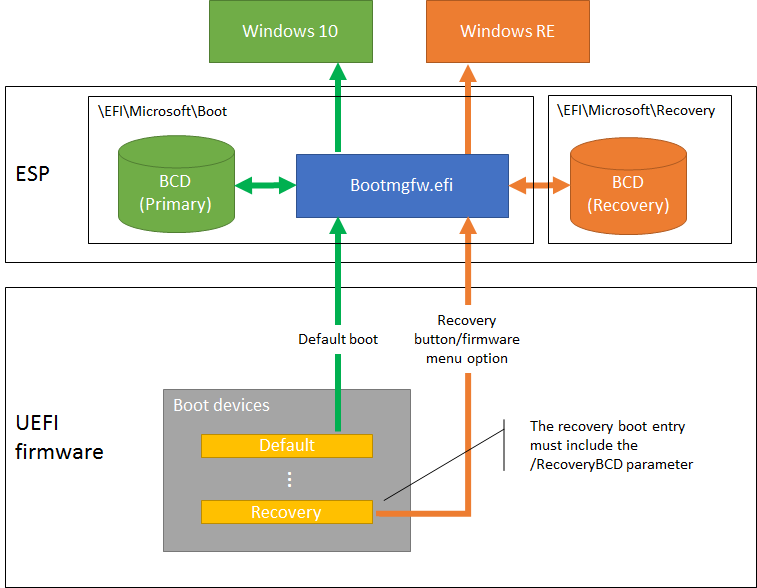

# 添加硬件恢复按钮来启动 Windows RE

在基于 UEFI 的计算机上，您可以配置硬件恢复按钮 （或按钮组合） 来启动 Windows RE，包括按钮重置功能的 Windows 10 桌面版本 （家庭、 Pro、 企业和教育）。 这可以帮助用户更方便地进入 Windows RE 菜单。

相对于 Windows 8/8.1，Windows 10 中的建议的实现这种硬件按钮已经被大大简化。 您不再需要将 Windows 启动文件复制到非托管 EFI 系统分区 (ESP) 来创建一个辅助引导路径位置。 相反，Windows 配置和管理支持的硬件按钮所需的所有磁盘上的资源。 该设计可以归纳为以下几点︰

1.  Windows 10 自动辅助引导配置数据 (BCD) 存储在文件夹中创建\\EFI\\Microsoft\\恢复。

    安装 Windows RE 时，这次的 BCD 存储会自动填入适当的设置启动 Windows RE 默认情况下。

    如果 Windows RE 的位置发生更改 （例如，由于将来的更新），则辅助 BCD 存储会自动更新。

2.  您仍然需要 UEFI 固件引导顺序列表的结尾处创建一个静态的启动条目，表示恢复。

    此引导设备条目应指向 Windows 引导管理器 (bootmgfw.efi) 的文件夹中的默认\\EFI\\Microsoft\\在 ESP 的引导。

    引导设备条目都必须指定`/RecoveryBCD`参数。

    硬件按钮被触发时，应自动选择恢复引导设备条目。

    若要了解详细信息，请参阅硬件制造商提供的说明修改 UEFI 固件设备上。

3.  当启动 Windows 启动管理器是`/RecoveryBCD`参数，则使用辅助 BCD 存储配置为启动 Windows RE，而不是默认的 BCD 存储。

下图说明的建议的实现，不同的引导路径︰

## 硬件按钮的设计建议︰

应可用硬件恢复按钮 （或按钮组合），即使计算机处于关闭状态。 触发时，PC 应打开电源并通过辅助启动路径。 这消除了需要用户在很短的时间窗口内按下按钮，期间和之后开机自检。

为支持固件选项菜单的 Pc，触发按钮 （或按钮组合） 应该首先显示简单的菜单，它为用户提供选项，或者引导 Windows RE，或若要进入固件选项菜单。 因此，无需以支持多个按钮组合。

**请注意** 不会能够启动到 Windows RE 的 PC，直到安装 Windows RE 的硬件按钮。 一般情况下，这意味着 PC 完成专业化配置阶段之后。

 

## 相关的主题

[部署 Windows RE](deploy-windows-re.md)

 

 

