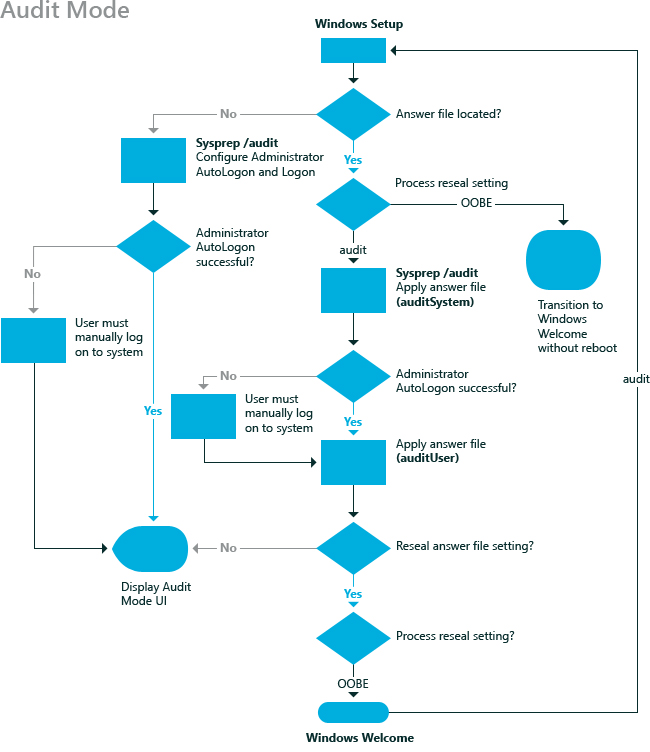

# auditUser

在**auditUser**配置阶段处理无人参与的 Windows® 安装设置在审核模式下的用户上下文中。 在**auditUser**配置阶段始终运行后[auditSystem](auditsystem.md)刀，用于应用在系统上下文中的设置。 通常情况下，在**auditUser**配置阶段用于执行命令**RunSynchronous**或**RunAsynchronous** 。 这些命令用于在审核模式期间运行脚本、 应用程序或其他可执行文件。 当 Windows 启动到审核模式时，无人参与的 Windows 安装程序的 auditSystem 和**auditUser**设置进行处理。

审核模式使 Oem 和公司可以向主 Windows® 映像安装附加的设备驱动程序、 应用程序和其他更新。 使用审核模式，可以维护很少的映像，因为您可以用最小的驱动程序和应用程序集创建参考映像。 在审核模式期间再使用其他驱动程序更新参考映像。 此外，您可以测试和向客户发售计算机前 Windows 映像上解决任何问题相关与出现故障或未正确安装的设备。 审核模式是可选的。

下图演示当**auditUser**配置阶段处理在审核模式下。

仅在您配置 Windows 安装程序启动到审核模式时，将运行**auditUser**配置阶段。 在您能够启动到审核模式使用**sysprep 模式**或**sysprep 通用化模式 /**命令，或者您可以在 Microsoft Windows 部署组件中指定**重新封装**的设置。 有关审核模式的详细信息，请参阅[审核模式概述](audit-mode-overview.md)和[启动到审核模式或 OOBE 的 Windows](boot-windows-to-audit-mode-or-oobe.md)。

## 相关的主题

[配置阶段的工作](how-configuration-passes-work.md)

[auditSystem](auditsystem.md)

[一般化](generalize.md)

[offlineServicing](offlineservicing.md)

[oobeSystem](oobesystem.md)

[专门负责](specialize.md)

[windowsPE](windowspe.md)

 

 

