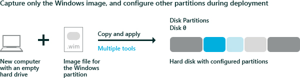

# <a name="capture-and-apply-windows-system-and-recovery-partitions"></a>捕获和应用 Windows、 系统和恢复分区


捕获 Windows 映像 (。WIM) 文件并将其用于将 Windows 部署到新设备。

而不是捕获每个分区，可以捕捉到图像，只是 Windows 分区并将该映像中的文件设置驱动器上的分区的其余部分。

下图阐释了此过程︰



**准备来捕获图像**

-   一般化 Windows 映像，以便可以将它部署到其他设备。 有关详细信息，请参阅[Sysprep （通用化） 的 Windows 安装](sysprep--generalize--a-windows-installation.md)。

**捕获映像**

1.  引导使用[Windows PE](winpe-intro.md)的设备。

2.  可选︰ 加快图像捕获通过高性能设置电源使用方案︰

    ``` syntax
    powercfg /s 8c5e7fda-e8bf-4a96-9a85-a6e23a8c635c
    ```

3.  捕获 Windows 分区。 例如︰

    ``` syntax
    Dism /Capture-Image /ImageFile:"D:\fabrikam.wim" /CaptureDir:C:\ /Name:Fabrikam
    ```

    其中 d︰ 是 USB 闪存驱动器或其他文件的存储位置。

## <a name="span-idapplyingtheimagespanspan-idapplyingtheimagespanspan-idapplyingtheimagespanapplying-the-image"></a><span id="Applying_the_image"></span><span id="applying_the_image"></span><span id="APPLYING_THE_IMAGE"></span>应用映像


下面是几种应用映像的方法︰

**手动应用映像**

1.  在目标设备上，使用 DiskPart 脚本来配置和设置格式的硬盘分区。 有关详细信息，请参阅[Configure UEFI/GPT-Based 硬驱动器分区](configure-uefigpt-based-hard-drive-partitions.md)或[Configure BIOS/MBR-Based 硬驱动器分区](configure-biosmbr-based-hard-drive-partitions.md)。

    **请注意**  
    如果将映像应用到现有的 Windows 安装的卷时，可能不会删除以前的安装中的文件。 格式化该卷，然后再应用新的映像使用 DiskPart 之类的工具。 例如︰

    ``` 
    diskpart /s D:\CreatePartitions-UEFI.txt
    ```
    其中 d︰ 是 USB 闪存驱动器或其他文件的存储位置。

    在**DiskPart**这些示例中，分区指派的盘符︰ 系统 = S，Windows = W 和恢复 = R。

    我们建议将 Windows 的驱动器号更改为末尾的字母，例如 W，以避免驱动器号冲突的信件。 不要使用 X，因为 Windows PE 为保留该驱动器号。 重新启动设备后，Windows 分区分配的字母 C，和其他分区不接收驱动器号。

    如果在重新启动时，Windows PE 重新分配磁盘字母按字母顺序，开头字母 C，而不考虑 Windows 安装程序中的配置。 这种配置可以更改根据存在的不同的驱动器，如 USB 闪存驱动器。

2.  可选︰ 加快图像捕获通过高性能设置电源使用方案︰

    ``` syntax
    powercfg /s 8c5e7fda-e8bf-4a96-9a85-a6e23a8c635c
    ```

3.  将映像应用到 Windows 分区︰

    ``` syntax
    dism /Apply-Image /ImageFile:D:\install.wim /Index:1 /ApplyDir:W:\
    ```

    w︰ 所在的 Windows 分区。

4.  通过使用 BCDBoot 工具配置的系统分区。 此工具将复制并配置通过从 Windows 分区的文件系统分区文件。 例如︰

    ``` syntax
    W:\Windows\System32\bcdboot W:\Windows /s S:
    ```

5.  将 Windows 恢复环境 (RE) 工具复制到恢复工具分区。

    ``` syntax
    md R:\Recovery\WindowsRE
    copy C:\Windows\System32\Recovery\winre.wim R:\Recovery\WindowsRE\winre.wim
    ```

    其中︰ 是恢复分区

6.  通过使用 REAgentC 注册 WindowsRE 工具的位置。

    ``` syntax
    W:\Windows\System32\reagentc /setreimage /path R:\Recovery\WindowsRE /target W:\Windows
    ```

**应用映像使用脚本**

1.  前提条件︰ 创建 DiskPart 脚本来部署您的图像。 对于示例，得到︰ [CreatePartitions UEFI.txt](configure-uefigpt-based-hard-drive-partitions.md)或[CreatePartitions BIOS.txt](configure-biosmbr-based-hard-drive-partitions.md)。

2.  将以下脚本复制到记事本中，然后再将该文件另存为 ApplyImage.bat:

    ``` syntax
    rem == ApplyImage.bat ==

    rem == These commands deploy a specified Windows
    rem    image file to the Windows partition, and configure
    rem    the system partition.

    rem    Usage:   ApplyImage WimFileName 
    rem    Example: ApplyImage E:\Images\ThinImage.wim ==

    rem == Set high-performance power scheme to speed deployment ==
    call powercfg /s 8c5e7fda-e8bf-4a96-9a85-a6e23a8c635c

    rem == Apply the image to the Windows partition ==
    dism /Apply-Image /ImageFile:%1 /Index:1 /ApplyDir:W:\

    rem == Copy boot files to the System partition ==
    W:\Windows\System32\bcdboot W:\Windows /s S:

    :rem == Copy the Windows RE image to the
    :rem    Windows RE Tools partition ==
    md R:\Recovery\WindowsRE
    xcopy /h W:\Windows\System32\Recovery\Winre.wim R:\Recovery\WindowsRE\

    :rem == Register the location of the recovery tools ==
    W:\Windows\System32\Reagentc /Setreimage /Path R:\Recovery\WindowsRE /Target W:\Windows

    :rem == Verify the configuration status of the images. ==
    W:\Windows\System32\Reagentc /Info /Target W:\Windows
    ```

3.  在目标计算机上，运行 Diskpart 和 ApplyImage 脚本应用到计算机的图像和设置系统、 窗口和恢复分区。 例如︰

    ``` syntax
    diskpart /s D:\CreatePartitions-UEFI.txt
    ApplyImage E:\Images\ThinImage.wim
    ```

    其中 d:\\图像\\ThinImage.wim 是 Windows 图像文件的名称。

    **请注意** 如果 DISM /Apply-Image 命令失败，请确保您正在使用的[受支持版本的 DISM](dism-supported-platforms.md)的此 Windows 映像。 例如，要应用 Windows 10 图像，请将需要 DISM 的版本 Windows 10。

     

**捕获和应用单个分区 （只适用于 BIOS 设备）**

1.  在您引用的设备，捕获每个分区单独使用 DISM /Capture-Image，然后将其应用于目标设备使用 DISM /Apply-Image。

    此方法使您可以灵活地设置您的系统分区。 注意，对于基于 UEFI 的设备，不捕获和应用 EFI 系统分区或 MSR 分区 – 这些由设备管理。

2.  使用 BCDBoot 命令设置的系统分区。

    ``` syntax
    bcdboot C:\Windows
    ```

**捕获和应用整个驱动器**

-   全闪存更新 (FFU) 文件格式可用于捕获和应用整个驱动器。 若要了解详细信息，请参阅[部署 Windows 使用全闪存更新 (FFU)](deploy-windows-using-full-flash-update--ffu.md)。

## <a name="span-idrelatedtopicsspanrelated-topics"></a><span id="related_topics"></span>相关的主题


[配置基于 UEFI/GPT 的硬盘分区](configure-uefigpt-based-hard-drive-partitions.md)

[配置基于 BIOS/MBR 硬盘分区](configure-biosmbr-based-hard-drive-partitions.md)

[BCDboot 命令行选项](bcdboot-command-line-options-techref-di.md)

[REAgentC 命令行选项](reagentc-command-line-options.md)

 

 


