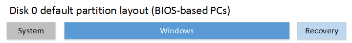

# <a name="biosmbr-based-hard-drive-partitions"></a>基于 BIOS/MBR 硬盘分区


当基于 BIOS 的设备上部署 Windows 时创建自定义的分区布局的硬盘驱动器 (Hdd)、 固态驱动器 (SSDs) 和其它驱动器。

**请注意** 如果您使用 Windows 10 上桌面版本 （家庭、 Pro、 企业和教育），更新按钮恢复脚本自定义的分区布局因此恢复工具可以重建时所需的自定义的分区布局。


## <a name="span-iddiskpartitionrulesspanspan-iddiskpartitionrulesspanspan-iddiskpartitionrulesspandrive-partition-rules"></a><span id="DiskPartitionRules"></span><span id="diskpartitionrules"></span><span id="DISKPARTITIONRULES"></span>驱动器分区规则


在 Windows 部署到基于 BIOS 的设备时，您必须使用 MBR 文件系统格式化硬盘。 在基于 BIOS 的计算机上，Windows 不支持的 GUID 分区表 (GPT) 文件系统。

MBR 驱动器可以有最多四个标准的分区。 通常情况下，这些标准的分区被指定为*主要分区*。 有关如何创建其他分区超过此限制的信息，请参阅[配置超过四个分区上基于 BIOS/MBR 硬盘](configure-more-than-four-partitions-on-a-biosmbr-based-hard-disk.md)。

**Windows 分区要求︰**

-   **系统分区**

    每个可启动驱动器必须包含一个系统分区。 系统分区必须配置为活动分区。

    此分区的最小大小是 100 MB。

-   **Windows 分区**
    -   此分区必须有至少 20 千兆字节 (GB) 的 64 位版本的驱动器空间或 16 GB 的 32 位版本。
    -   必须使用 NTFS 文件格式格式化这个磁盘分区。
    -   用户完成全新体验 (OOBE) 后，该分区必须有足够 10 GB 的可用空间。
    -   此分区可以有最多的 2 千兆字节 (TB) 的空间。 因为它们可能会干扰应用程序兼容性和恢复软件解决方案上 BIOS 不支持软件工具，以扩展超过 2 TB 的可见分区空间。
-   **恢复工具分区**

    Windows 恢复环境 (Windows RE) 工具图像 (winre.wim) 应该比 Windows 分区支持自动故障切换，从而支持启动 Windows BitLocker 驱动器加密加密分区单独的分区中。

    尽管此图像可以包含与系统分区相同的分区上，则建议 Windows 分区后立即将此分区放在一个单独的分区中。 这允许 Windows 修改，如果将来的更新需要更大的恢复映像稍后重新创建该分区。

    此分区必须有足够的空间用于 Windows 恢复环境工具图像 (winre.wim，通常之间 250-300 MB，这取决于基本语言和自定义项添加)，再加上足够的可用空间，以便由备份实用程序可以捕获该分区︰

    -   如果小于 500 MB 的分区，必须至少 50 MB 的可用空间。
    -   如果分区是 500 MB 或更大，它必须具有至少 320 MB 的可用空间。
    -   如果分区大于 1 GB，我们建议，它应该有至少 1 GB 的空闲空间。

    <!-- -->

    -   它必须有至少 320 MB 的可用空间。
    -   我们建议，它应该有至少 1 GB 的空闲空间。
-   **数据分区**

    Windows 10 的建议的分区布局不包括实用程序或数据分区。

    但是，如果需要实用程序或数据分区时，应将它们放 Windows 分区之前或之后的 Windows RE 分区。 通过一起保持 Windows 和恢复分区，则当未来更新的 Windows RE 区域可用，Windows 将能通过收缩 Windows 分区发展 Windows RE 分区。

    此布局，使最终用户能够删除数据分区和合并与 Windows 分区的空间更难。 例如，Windows RE 分区可能需要移到未使用的空间数据分区，从回收的末尾，以便 Windows 分区可以扩展。 Windows 10 不包括功能或实用程序，以促进这一过程。 但是，制造商可以开发和提供这类实用工具，如果电脑附带的数据分区。

    每个分区可以有最多的 2 千兆字节 (TB) 的空间。

    如果您打算把总的四个以上分区添加到磁盘，则看到[四个分区上基于 BIOS/MBR 硬盘配置的多](configure-more-than-four-partitions-on-a-biosmbr-based-hard-disk.md)以获取详细信息。

## <a name="span-idrecommendedpartitionconfigurationsspanspan-idrecommendedpartitionconfigurationsspanspan-idrecommendedpartitionconfigurationsspanpartition-layout"></a><span id="RecommendedPartitionConfigurations"></span><span id="recommendedpartitionconfigurations"></span><span id="RECOMMENDEDPARTITIONCONFIGURATIONS"></span>分区布局


如果安装 Windows 使用由 Windows 图像处理和配置设计器 (ICD) 创建可引导 usb 闪存盘时，默认情况下创建以下布局︰ 一个系统分区，Windows 分区和恢复工具分区。



## <a name="span-idusingsystemandutilitypartitionsspanspan-idusingsystemandutilitypartitionsspanspan-idusingsystemandutilitypartitionsspansystem-and-utility-partitions"></a><span id="UsingSystemAndUtilityPartitions"></span><span id="usingsystemandutilitypartitions"></span><span id="USINGSYSTEMANDUTILITYPARTITIONS"></span>系统和实用程序分区


默认情况下，系统分区未显示在文件资源管理器中。 这有助于防止最终用户意外修改分区。

**若要将分区设置为实用程序分区**

1.  当您正在使用 Windows ICD 部署 Windows 时，则将自动设置分区类型。
2.  当要通过使用**DiskPart**工具来部署 Windows 时，使用**集 id = 27**命令后创建分区。

**若要验证有系统和实用程序分区**

1.  单击**开始**，右键单击**该计算机**，然后单击**管理**。 打开**计算机管理**窗口。
2.  单击**磁盘管理**。 将显示可用的驱动器和分区的列表。
3.  在驱动器和分区的列表中，请确认的系统和实用程序分区存在，并且未分配驱动器号。

## <a name="span-idrelatedsamplefilesspanspan-idrelatedsamplefilesspanspan-idrelatedsamplefilesspansample-files-configuring-disk-layout-by-using-windows-pe-and-diskpart-scripts"></a><span id="RelatedSampleFiles"></span><span id="relatedsamplefiles"></span><span id="RELATEDSAMPLEFILES"></span>示例文件︰ 通过使用 Windows PE 和 DiskPart 脚本来配置磁盘布局


对于基于映像的部署，引导到[Windows PE](winpe-intro.md)，PC，然后使用**DiskPart**工具在目标计算机上创建的分区结构。

**请注意**  
在**DiskPart**这些示例中，分区指派的盘符︰ 系统 = S，Windows = W 和恢复 = R。

我们建议将 Windows 的驱动器号更改为末尾的字母，例如 W，以避免驱动器号冲突的信件。 不要使用 X，因为 Windows PE 为保留该驱动器号。 重新启动设备后，Windows 分区分配的字母 C，和其他分区不接收驱动器号。

如果在重新启动时，Windows PE 重新分配磁盘字母按字母顺序，开头字母 C，而不考虑 Windows 安装程序中的配置。 这种配置可以更改根据存在的不同的驱动器，如 USB 闪存驱动器。

 

以下步骤描述如何在您的硬盘进行分区，并准备好应用映像。 在以下各节来完成这些步骤中，您可以使用代码。

**以硬盘进行分区，并准备好应用映像**

1.  将以下代码保存为文本文件 (CreatePartitions BIOS.txt) 在 USB 闪存驱动器上。

    ``` syntax
    rem == CreatePartitions-BIOS.txt ==
    rem == These commands are used with DiskPart to
    rem    create three partitions
    rem    for a BIOS/MBR-based computer.
    rem    Adjust the partition sizes to fill the drive
    rem    as necessary. ==
    select disk 0
    clean
    rem == 1. System partition ======================
    create partition primary size=100
    format quick fs=ntfs label="System"
    assign letter="S"
    active
    rem == 2. Windows partition =====================
    rem ==    a. Create the Windows partition =======
    create partition primary
    rem ==    b. Create space for the recovery tools  
    shrink minimum=500
    rem       ** NOTE: Update this size to match the
    rem                size of the recovery tools 
    rem                (winre.wim)                 **
    rem ==    c. Prepare the Windows partition ====== 
    format quick fs=ntfs label="Windows"
    assign letter="W"
    rem == 3. Recovery tools partition ==============
    create partition primary
    format quick fs=ntfs label="Recovery"
    assign letter="R"
    set id=27
    list volume
    exit
    ```

2.  使用 Windows PE 启动目标计算机。
3.  清理和分区的驱动器。 在此示例中， *F*是 USB 闪存驱动器的盘符。

    ``` syntax
    DiskPart /s F:\CreatePartitions-BIOS.txt
    ```

4.  如果您使用自定义的分区布局上 Windows 10 对于桌面版本，更新按钮恢复脚本，以便恢复工具可以重新创建自定义的分区布局时需要。

## <a name="span-idnextstepsspanspan-idnextstepsspanspan-idnextstepsspannext-steps"></a><span id="NextSteps"></span><span id="nextsteps"></span><span id="NEXTSTEPS"></span>下一步行动


使用部署脚本将 Windows 映像应用于新创建的分区。 有关详细信息，请参阅[捕获和应用 Windows、 系统和恢复分区](capture-and-apply-windows-system-and-recovery-partitions.md)。

## <a name="span-idrelatedtopicsspanrelated-topics"></a><span id="related_topics"></span>相关的主题


[在基于 BIOS/MBR 硬盘配置四个以上分区](configure-more-than-four-partitions-on-a-biosmbr-based-hard-disk.md)

[配置基于 UEFI/GPT 的硬盘分区](configure-uefigpt-based-hard-drive-partitions.md)

[BitLocker 驱动器加密](bitlocker-drive-encryption.md)

[配置磁盘镜像](http://go.microsoft.com/fwlink/?LinkId=733824)

 

 


