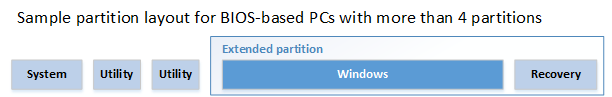

# <a name="configure-more-than-four-partitions-on-a-biosmbr-based-hard-disk"></a>在基于 BIOS/MBR 硬盘配置四个以上分区


本主题介绍如何配置四个以上的磁盘分区，当您部署 Windows 上 BIOS 和主启动记录 (MBR)-基于设备。

## <a name="span-iddiskpartitionrulesspanspan-iddiskpartitionrulesspanspan-iddiskpartitionrulesspandisk-partition-rules"></a><span id="DiskPartitionRules"></span><span id="diskpartitionrules"></span><span id="DISKPARTITIONRULES"></span>磁盘分区规则


-   基于 BIOS 的系统上，可以将这四个标准分区之一指定为*扩展的分区*。

    扩展的分区是可以划分为称为*逻辑分区*的其他分区的特殊分区。 扩展的分区不能存储文件。 扩展的分区不接收驱动器分区 id。

-   可以包括您的磁盘可以容纳尽可能多的逻辑分区。

    逻辑分区可以存储的文件。 您可以使用一个逻辑分区作为 Windows 分区。

有关基于 BIOS 的系统的其他磁盘分区规则，请参阅[Configure BIOS/MBR-Based 硬驱动器分区](configure-biosmbr-based-hard-drive-partitions.md)。

**建议**

1.  添加 Windows 分区之前，则添加系统和实用程序分区。

2.  添加 Windows 分区后立即恢复工具分区。 当您使用此分区的顺序时，然后当需要将来对恢复工具的更新，该分区可以被自动调整大小。

**示例分区布局︰**



## <a name="span-idconfiguringpartitionsusingdiskpartspanspan-idconfiguringpartitionsusingdiskpartspanspan-idconfiguringpartitionsusingdiskpartspanconfiguring-disk-partitions-by-using-a-diskpart-script-in-windows-pe"></a><span id="ConfiguringPartitionsUsingDiskPart"></span><span id="configuringpartitionsusingdiskpart"></span><span id="CONFIGURINGPARTITIONSUSINGDISKPART"></span>在 Windows PE 中使用 DiskPart 脚本配置磁盘分区


对于基于映像的部署中，使用 Windows PE 启动设备，然后使用 DiskPart 工具在目标设备上创建的分区结构。 有关详细信息，请参阅[使用 DISM 应用图像](apply-images-using-dism.md)。

**请注意**  
Windows PE 重新分配磁盘字母按字母顺序，开头字母"C"，而不考虑 Windows 安装程序中的配置。 这种配置可以更改基于不同的驱动器，包括 USB 闪存驱动器中存在。

在 DiskPart 这些示例中，分区指派字母"U"、"V"、"S"、"W"和"R"，以避免驱动器号冲突。 重新启动设备后，Windows PE 自动为 Windows 分区分配的字母"C"。 Utility1、 Utility2、 系统和恢复映像分区不接收驱动器号。

 

以下步骤描述如何在您的硬盘进行分区，并准备好应用映像。 在以下各节来完成这些步骤中，您可以使用代码。

**以硬盘进行分区，并准备好应用映像**

1.  以下各节中将代码保存为文本文件 (PrepareMyPartitions.txt) 在 USB 闪存驱动器上。

2.  使用 Windows PE 启动目标设备。

3.  使用`DiskPart /s F:\PrepareMyPartitions.txt`命令，其中*F*︰ 是 USB 闪存驱动器进行分区的驱动器号。

## <a name="span-idsamplecodespanspan-idsamplecodespanspan-idsamplecodespansample-code"></a><span id="Sample_code"></span><span id="sample_code"></span><span id="SAMPLE_CODE"></span>示例代码


保存下面的代码为"PrepareMyPartitions.txt"，然后通过使用 DiskPart 工具来自动化配置的 Utility1、 Utility2、 系统，扩展、 窗口和恢复工具分区中运行该脚本︰

``` syntax
select disk 0
clean
rem == 1. System partition ======================
create partition primary size=100
format quick fs=ntfs label="System"
assign letter="S"
active
rem == 2. Utility partition =====================
create partition primary size=100
format quick fs=ntfs label="Utility1"
assign letter="U"
set id=27
rem == 3. Utility partition =====================
create partition primary size=200
format quick fs=ntfs label="Utility2"
assign letter="V"
set id=27
rem == 4. Extended partition ====================
create partition extended
rem == 4a. Windows partition ====================
rem ==    a. Create the Windows partition =======
create partition logical
rem ==    b. Create space for the recovery tools  
shrink minimum=500
rem       ** NOTE: Update this size to match the
rem                size of the recovery tools 
rem                (winre.wim)                 **
rem ==    c. Prepare the Windows partition ====== 
format quick fs=ntfs label="Windows"
assign letter="C"
rem == 4b. Recovery tools partition ==============
create partition logical
format quick fs=ntfs label="Recovery"
assign letter="R"
set id=27
list volume
exit
```

## <a name="span-idnextstepsspanspan-idnextstepsspanspan-idnextstepsspannext-steps"></a><span id="Next_Steps"></span><span id="next_steps"></span><span id="NEXT_STEPS"></span>下一步行动


创建分区后，您可以使用部署脚本能够将 Windows 映像应用于新创建的分区。 有关详细信息，请参阅[捕获和应用 Windows、 系统和恢复分区](capture-and-apply-windows-system-and-recovery-partitions.md)。

## <a name="span-idrelatedtopicsspanrelated-topics"></a><span id="related_topics"></span>相关的主题


[配置基于 BIOS/MBR 硬盘分区](configure-biosmbr-based-hard-drive-partitions.md)

 

 


