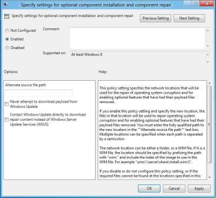

# 部署.NET Framework 3.5 的需求设置使用组策略功能

对于使用 Active Directory 和组策略的环境，需求 (FoD) 策略设置选项上的功能提供了安装.NET Framework 3.5 的最大的灵活性。 此组策略设置指定的网络位置使用来启用可选功能已被删除，其负载文件和文件数据和注册表修复操作失败的更新安装。 如果您禁用或不配置此设置，或者如果在此策略设置中指定的位置找不到所需的文件，这些文件会下载从 Windows Update （如果这允许通过计算机的策略设置）。 组策略设置**指定的可选组件的安装和维修组件设置**位于**计算机配置\\管理模板\\系统**在组策略编辑器。

## 要求

-   活动目录域基础结构支持 Windows 8 和 Windows Server® 2012

-   配置组策略的权限

-   目标计算机还需要网络访问和权限使用备用源或互联网连接来使用 Windows 更新

**图 1 为需即装和功能的存储修复功能的的组策略设置**

启用此策略后，可以为这两个修复的功能文件存储区，并使已删除其有效负载的功能指定网络位置 （例如，文件服务器上）。 **备用的源文件路径**可以指向**\\源\\sxs**文件夹或使用 WIM Windows 映像 (WIM) 文件︰ 前缀。 WIM 文件的优点是它可以保持同步与更新，并提供当前的修复源和.NET Framework 3.5 的二进制文件。 在修复 WIM 可以不同于用于安装初始 WIM 文件。 试图启用可选的 Windows 功能的过程的用户要求文件共享和/或 WIM 文件的访问权限。

如果选择**从不尝试下载从 Windows Update 的有效载荷**，在安装或修复操作期间才联系 Windows 更新。

如果选择**Windows 更新联系人直接下载修复内容而不是 Windows 服务器更新服务驱动程序列表**，添加功能 (例如，.NET Framework 3.5) 或修复功能文件存储，任何尝试使用 Windows 更新来下载文件。 目标计算机需要访问 Internet 和 Windows 更新此选项。

**请注意**  
作为 FoD 或功能文件存储修复的源不支持 Windows 服务器更新设备驱动程序列表）。

对于 Windows 8 和 Windows Server 2012，作为功能安装 （例如，添加.NET Framework 3.5 的功能文件） 或特征文件存储修复操作的源不支持 WSUS。 WSUS 核心方案包括集中的更新管理和修补程序管理自动化，它使管理员能够通过 Microsoft 更新发布到他们的网络中的计算机的更新的分发进行管理。 FoD 和功能文件存储修复依赖于单个文件来执行更新或修复操作的下载。 例如，如果一个文件遭到破坏，之后该文件 （这可能是小到几个千字节为单位） 下载修复来源。 WSUS 可以使用完整或明示的文件来执行处理更新操作;但是，这些文件不是兼容 FoD 或功能文件存储修复的。

 

如果备用源路径用于修复图像，请考虑以下准则︰

-   **服务更新**

    及时修复的任何源的最新服务的更新。 如果将图像从 WIM 文件用于 FoD，可以使用部署映像服务和管理 (DISM) 工具来处理映像。 有关详细信息，请参阅[装载和修改映像使用 DISM](http://go.microsoft.com/fwlink/p/?linkid=329973)。 如果您使用的共享联机 Windows 安装在您的本地网络上作为修复图像，请确保计算机有权访问 Windows 更新。

-   **多语言映像**

    您的映像支持的区域设置对修复源文件必须包含所有相关的语言包。 如果还原而不需要该功能的 Windows 安装的所有本地化文件的功能，则安装将失败。 还原功能后，您可以安装其他语言包。

## 相关的主题

[Microsoft.NET Framework 3.5 部署注意事项](microsoft-net-framework-35-deployment-considerations.md)

 

 

