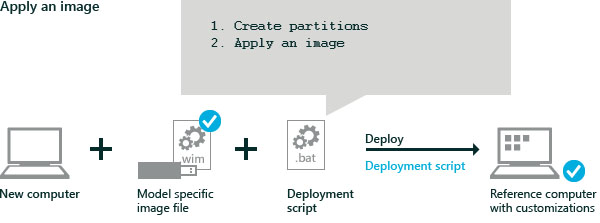

# <a name="lab-2-deploy-windows-using-a-script"></a>实验室 2︰ 部署 Windows 使用脚本

您可以使用脚本来执行 Windows 映像和快速部署到新买的计算机上的 Windows。 您可以修改这些脚本来更改驱动器分区的大小或完全自动化的部署。 

## <a name="spand-idgettheimagespanstep-1-mount-the-image"></a>< spand id ="Get_the_image ></span>第 1 步︰ 装载映像

在技术人员计算机，用鼠标右键单击 Windows 10，1607年版本主页 (X21-08790) 的图像文件并选择装载。 这样会加载的文件到一个临时驱动器号 （例如，d:）。 

## <a name="span-idcopythebaseimagespanstep-2-copy-the-base-windows-image-file-to-the-storage-usb-drive"></a><span id="Copy_the_base_image"></span>步骤 2︰ 将基本的 Windows 映像文件复制到存储 USB 驱动器

1.  将 Windows 映像文件复制到您的 USB 存储驱动器︰

    ``` syntax
    md E:\images
    copy D:\sources\install.wim file E:\images\install.wim.
    ```
    
    其中，d︰ 是从 Windows ISO 和 e︰ 驱动器是 USB 存储驱动器。 

2.  将[示例脚本](windows-deployment-sample-scripts-sxs.md)复制到 USB 存储驱动器的根目录。

## <a name="span-idapplytheimagespanstep-3-apply-the-windows-image-using-a-script"></a><span id="Apply_the_image"></span>步骤 3︰ 将 Windows 映像使用脚本应用

使用部署脚本应用到测试设备上的图像。 这些脚本设置硬盘分区，Windows 映像中的文件添加到分区。

[示例脚本](windows-deployment-sample-scripts-sxs.md)可用于不同的设备固件类型 （更新的基于 UEFI 的 BIOS 或旧的 BIOS）。 某些基于 UEFI 的设备包括旧旧的 BIOS 支持。 有关详细信息，请参阅[UEFI 固件](http://go.microsoft.com/fwlink/?LinkId=526945)。



1.  [引导到 Windows PE 中使用 Windows PE usb 闪存盘的参考设备](install-windows-pe-sxs.md)。

2.  请拿出 Windows PE usb 闪存盘，放入存储 usb 闪存盘。
    
3.  使用 diskpart 中找到 usb 闪存盘驱动器的号︰

    ``` syntax
    diskpart
    DISKPART> list volume
    DISKPART> exit
    ```

    例如，驱动器可以用字母标明如下︰ C = 窗口;D = USB 存储驱动器。

4.  主硬盘进行格式化、 分区，通过创建和应用图像使用预制的[示例脚本](windows-deployment-sample-scripts-sxs.md)。 

脚本**ApplyImage.bat**使用 diskpart 脚本︰ CreatePartitions UEFI.txt，CreatePartitions BIOS.txt，可以创建分区并定义的分区布局。 这些脚本必须放置在同一个文件夹中。 您可以更新这些脚本来更改分区大小。

    ``` syntax
    D:
    D:\ApplyImage.bat D:\Images\install.wim
    ```

    When prompted by the script: 
    
    1.  按 Y 将驱动器格式化。
    2.  按 Y 键选择紧凑 OS 中，或 N 以选择一个非压缩的操作系统︰
        -   **Y**︰ 应用使用精简的操作系统映像。 这是最适合固态驱动器和驱动器可用空间受限的设备。 以此为 1 和 2 的硬件配置。
        -   **N**︰ 将作为完全未压缩图像的图像。 这是最适合于高性能的设备或使用传统硬盘旋转介质的设备。 使用此硬件配置 3。
    3.  按 N 指示图像不包括扩展的属性 (EA)。

    脚本将映像应用到驱动器，然后完成。

    
## <a name="span-idapplydesktopapplicationsspanstep-4-apply-desktop-applications"></a><span id="Apply_desktop_applications"></span>步骤 4︰ 将应用的桌面应用程序

**跳过此步骤**直到您完成了[实验室 12︰ 添加桌面应用程序和设置变得分散化配置软件包 (Spp)](add-desktop-apps-wth-spps-sxs.md)。 此步骤将添加 Windows 桌面应用程序到您的图像。 这必须添加恢复映像之前完成。

1.  应用的桌面应用程序。
    ```syntax
    D:\ADKTools\amd64\WimMountAdkSetupAmd64.exe /Install /q
    D:\ADKTools\amd64\DISM.exe /ImagePath:C:\ /Apply-SiloedPackage /PackagePath:E:\SPPs\office16_base.spp /PackagePath:E:\SPPs\office16_fr-fr.spp /PackagePath:E:\SPPs\office16_de-de.spp
    ```

## <a name="span-idapplytherecoveryimagespanstep-5-set-up-the-system-recovery-tools"></a><span id="Apply_the_recovery_image"></span>步骤 5︰ 设置系统恢复工具

**可选︰ 跳过此步骤**直到完成[实验室 10︰ 更新恢复映像](update-the-recovery-image.md)。 

包括恢复图像，对于最终的图像，但它并不是必需的这些早期测试步骤。 

1.  应用 Windows 恢复环境 (Windows RE) 图像。 这些工具帮助修复无法启动操作系统的常见原因。 图像都存储在单独的驱动器分区。 脚本**ApplyRecovery.bat**使用 diskpart 脚本︰ HidePartitions UEFI.txt，HidePartitions-BIOS.txt 设置此分区。 这些脚本必须放在与 ApplyRecovery.bat 相同的文件夹中。

    ```syntax
    D:\ApplyRecovery.bat
    ```

## <a name="span-idrebootspanstep-6-reboot"></a><span id="Reboot"></span>第 6 步︰ 重新启动

断开连接的驱动器，然后重新启动 (`exit`)。

PC 应到 Windows 重新启动。 正在等待要完成的准备阶段，回到您的技术人员计算机而继续的实验室。

**疑难解答**︰ 如果该设备无法启动，打开该设备，然后按键打开引导设备选择菜单 （如**Esc**键）。 选择硬盘作为启动设备，然后继续。

**可选︰ 测试恢复映像**
1.  完成像普通用户首次登录体验。
2.  选择**开始** &gt; **设置** &gt; **更新和安全** &gt; **恢复**&gt;下**重置此 PC**，请单击**开始** > **中删除所有内容** >  **只是删除我的文件** > **下一步**。
3.  Windows 完成重置后，Windows 应该回到原始的欢迎屏幕，在设备上好像有没有用户帐户。

## <a name="span-idwhatsnextspanwhats-next"></a><span id="Whats_next"></span>接下来是什么

[实验室 3︰ 添加设备驱动程序 （.inf 样式）](add-device-drivers.md)（包括装载映像基础知识）
