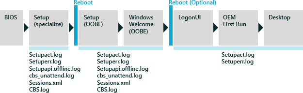
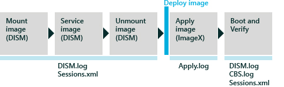
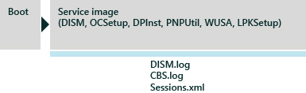

# 部署疑难解答和日志文件

下一节描述了常见部署方案及其相关的日志文件之间的关系。 Windows® 部署是一个高度自定义的过程，有很多点故障的可能性。 确定您遇到的故障的特定点开始的基础技术工作原理的理解。

## Windows 安装程序方案

这种情况下首先完成 Windows 安装程序在新计算机上，以便到达桌面。 创建参考映像时，该方案是最常见的。 此过程也称为是*遇到的第一个用户*。

下面的插图所示，解决失败的关键确定您在安装过程中的位置和发生故障。 要创建新的安装，因为该硬驱不适最初，因此 Windows 安装程序中将日志写入到内存中，Windows PE 会话中专门 (x:\\窗口)。 硬驱动器格式化后，安装程序将继续直接登录新硬盘 (c:\\窗口)。 在 Windows PE 会话过程中创建的日志文件是临时的。

Windows 安装程序失败时，查看 Setuperr.log 文件中的项第一，然后 Setupact.log 文件第二个，然后其他日志文件根据需要。

### Windows 安装程序相关的日志文件

<table>
<colgroup>
<col width="33%" />
<col width="33%" />
<col width="33%" />
</colgroup>
<thead>
<tr class="header">
<th align="left">日志文件</th>
<th align="left">说明</th>
<th align="left">位置</th>
</tr>
</thead>
<tbody>
<tr class="odd">
<td align="left">
Setupact.log
</td>
<td align="left">
在 Windows 安装过程中发生的大多数错误的主日志文件。 有几个实例的 Setupact.log 文件，具体取决于在安装过程中出现故障的哪一阶段。 务必要知道哪个版本的 Setupact.log 文件，查看，根据您所在的阶段。
</td>
<td align="left">
<strong>安装程序 （专门）︰</strong> X:\Windows\panther

<strong>安装 (OOBE) 时，logonui 会，OEM 首次运行︰</strong>%windir%\panther

<strong>全新安装体验 (OOBE):</strong> %windir%\panther\unattendGC
</td>
</tr>
<tr class="even">
<td align="left">
Setuperr.log
</td>
<td align="left">
高级安装的<strong>专用化</strong>阶段的过程中出现的错误列表。 Setuperr.log 文件未提供任何具体细节。
</td>
<td align="left">
<strong>安装程序 （专门）︰</strong> %windir%\panther

<strong>安装程序 （专门）︰</strong> %windir%\panther

<strong>安装 (OOBE) 时，logonui 会，OEM 首次运行︰</strong> %windir%\panther
</td>
</tr>
<tr class="odd">
<td align="left">
Setupapi.offline.log
</td>
<td align="left">
驱动程序在安装<strong>专用化</strong>阶段的组件专业化子阶段的故障。
</td>
<td align="left">
%windir%\inf
</td>
</tr>
<tr class="even">
<td align="left">
Cbs_unattend.log
</td>
<td align="left">
无人参与安装服务失败。
</td>
<td align="left">
%windir%\panther
</td>
</tr>
<tr class="odd">
<td align="left">
Setupapi.dev.log
</td>
<td align="left">
在<strong>oobe</strong>阶段安装的驱动程序故障。
</td>
<td align="left">
%windir%\inf
</td>
</tr>
<tr class="even">
<td align="left">
Sessions.xml
</td>
<td align="left">
基于 XML 的事务日志文件，用于跟踪所有服务活动，根据会话 id、 客户端、 状态、 任务和操作。 如有必要，Sessions.log 文件会指向更多详细信息的 DISM.log 和 CBS.log 文件。
</td>
<td align="left">
%windir%\servicing\sessions
</td>
</tr>
<tr class="odd">
<td align="left">
CBS.log
</td>
<td align="left">
提供有关脱机服务的更多详细信息的服务日志文件故障。
</td>
<td align="left">
%windir%\panther
</td>
</tr>
</tbody>
</table>

 

## 离线维修方案

这种情况下需要添加和删除更新、 驱动程序和语言包并配置其他设置，而无需启动 Windows。 脱机服务是因为它不需要重新创建更新的映像管理存储在服务器的现有映像的有效方式。 您可以执行脱机服务上已装载或应用到的驱动器或目录中的图像。

部署映像服务和管理 (DISM) 工具是用于脱机处理的所有任务的主要工具。 从 Windows PE 或正在运行的 Windows 操作系统的命令提示符下运行 DISM。 如果执行 DISM 命令时出现故障，该工具将提供快速的响应，并在 DISM.log 文件中记录此问题。 Session.xml 文件是捕获目标操作系统上的所有服务活动事务日志文件。 Session.xml 文件可结合使用 DISM.log 文件来确定点的故障和需要的服务活动。

当脱机服务发生故障时，查看具体的错误前的 DISM.log 文件。 如果 DISM.log 文件不包含任何错误，请查看 Sessions.xml 日志文件秒，然后将 CBS.log 文件。

### 离线维修相关的日志文件

<table>
<colgroup>
<col width="33%" />
<col width="33%" />
<col width="33%" />
</colgroup>
<thead>
<tr class="header">
<th align="left">日志文件</th>
<th align="left">说明</th>
<th align="left">位置</th>
</tr>
</thead>
<tbody>
<tr class="odd">
<td align="left">
DISM.log
</td>
<td align="left">
使用 DISM 的所有脱机操作主日志文件。
</td>
<td align="left">
%windir%\logs\dism

您可以使用<strong>/LogPath</strong>选项在不同的位置创建 DISM 日志文件。 使用<strong>/LogLevel</strong>选项，也可以控制数据写入到日志文件的级别。
</td>
</tr>
<tr class="even">
<td align="left">
Sessions.xml
</td>
<td align="left">
一个基于 XML 的事务日志，用于跟踪所有服务活动，根据会话 id、 客户端、 状态、 任务和操作。 如有必要，Sessions.log 文件会指向更多详细信息的 DISM.log 和 CBS.log 文件。
</td>
<td align="left">
%windir%\servicing\sessions
</td>
</tr>
</tbody>
</table>

 

若要了解有关脱机服务的详细信息，请参阅[了解处理策略](understanding-servicing-strategies.md)。

## 联机服务方案

这种情况下所服务的运行状态的操作系统。 此方案涉及到启动到审核模式以添加驱动程序、 应用程序及其他程序包的计算机。 如果驱动程序包有合用安装服务或应用程序依赖关系，在线服务是驱动程序的理想选择。 也是有效的大部分服务程序包已安装、 更新位于.msi 或 KB.exe 文件格式，或应用程序依赖于 Windows 安装服务和技术 （如.NET Framework 或完全即插即用支持） 时。

脱机服务，如 DISM.log、 CBS.log 和 Sessions.xml 文件中捕获所有日志记录。 如果执行 DISM 命令时出现故障，该工具将提供即时响应以及在 DISM.log 文件中记录此问题。 Session.xml 文件是捕获目标操作系统上的所有服务活动事务日志文件。 Session.xml 文件可结合使用 DISM.log 文件来确定点的故障和所需的服务活动。

当脱机服务发生故障时，请看 DISM.log 文件中的特定错误。 如果 DISM.log 文件不包含任何错误，查看 Sessions.xml 日志文件，然后是的 CBS.log 文件。

### 联机服务相关的日志文件

<table>
<colgroup>
<col width="33%" />
<col width="33%" />
<col width="33%" />
</colgroup>
<thead>
<tr class="header">
<th align="left">日志文件</th>
<th align="left">说明</th>
<th align="left">位置</th>
</tr>
</thead>
<tbody>
<tr class="odd">
<td align="left">
DISM.log
</td>
<td align="left">
使用 DISM 的所有联机操作的主日志文件。 如有必要，则 DISM.log 将指向 CBS.log，有关更多详细信息。
</td>
<td align="left">
%windir%\logs\dism

您还可以到另一个位置点 DISM 日志文件使用 /LogPath 命令选项。 日志数据也可以通过使用 /LogLevel 命令选项控制。
</td>
</tr>
<tr class="even">
<td align="left">
CBS.log
</td>
<td align="left">
提供有关联机服务失败的更多详细信息的辅助日志文件。 DISM.log 将引用 CBS.log 了解详情。
</td>
<td align="left">
%windir%\logs\cbs
</td>
</tr>
<tr class="odd">
<td align="left">
Sessions.xml
</td>
<td align="left">
基于 xml 的事务日志，用于跟踪所有服务活动，根据会话 id、 客户端、 状态、 任务和操作。 如有必要，Sessions.log 将指向 DISM.log 和 CBS.log 了解详情。
</td>
<td align="left">
%windir%\servicing\sessions
</td>
</tr>
</tbody>
</table>

 

若要了解有关脱机服务的详细信息，请参阅[了解处理策略](understanding-servicing-strategies.md)。

 

 

