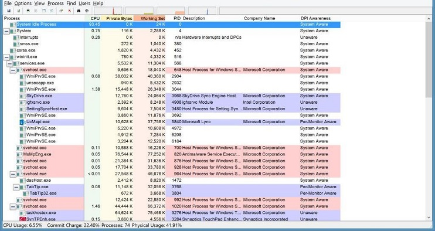
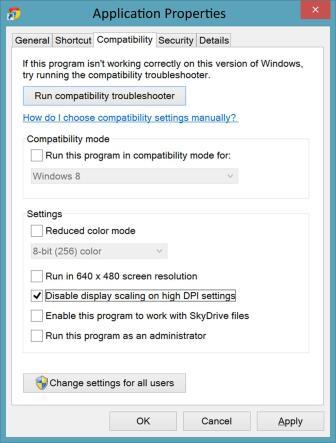
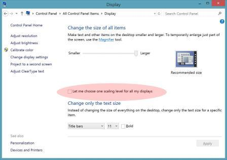

# 为 IT 专业人员在 Windows 8.1 修复模糊文本

Windows® 的桌面应用程序大致分为两类︰ *dpi 的*并不是那些应用程序。 DPI 感知的应用程序主动让 Windows 在应用程序启动过程中知道它们是可以扩展自己在高 DPI 显示器上很好地工作。 这些应用程序包括︰ Internet Explorer、 办公室、 Firefox 和.NET 2.0 + (包括适用于 WPF) 应用程序。 这些应用程序通常工作很好地跨范围广泛的缩放比例。 因此，如果您的业务应用程序的企业行也 dpi，您的用户应该不有任何 Windows 8.1 显示问题或缩放比例。

但是，如果应用程序不识别，DPI，并且在高 DPI 显示器上运行，Windows 缩放应用程序通过应用位图缩放应用程序输出。 这样可以确保应用程序在高 DPI 显示器上的正确大小。 在大多数情况下这将导致在清晰和可用的应用程序，但在某些情况下，结果是不太清晰，可能由于位图缩放具有稍有模糊或模糊的外观。

**本主题︰**

-   [如何判断是否应用程序不是 dpi](#recognize)

-   [如何应对非 DPI 感知的应用程序](#unaware)

-   [告诉 Windows 不能扩展不是 DPI 感知的应用程序](#dontscale)

## 如何判断是否应用程序不是 dpi

[进程管理器工具](http://go.microsoft.com/fwlink/p/?linkid=204774)用于确定应用程序是否 dpi。 *图 1 处理资源管理器*使用**DPI 感知**启用的列中显示此实用程序。 （默认情况下，进程浏览器不显示**DPI 识别**列。 若要打开此列，请单击**视图**菜单上，单击**选择列**、 **DPI 感知**，选中复选框，单击**确定**。）标题为**DPI 感知**列告诉您是否知道 DPI 的特定进程。

**图 1 处理资源管理器**

Windows 8.1 区分三类应用程序。

**表 1 DPI 感知的应用程序**

<table>
<colgroup>
<col width="33%" />
<col width="33%" />
<col width="33%" />
</colgroup>
<thead>
<tr class="header">
<th align="left">DPI 意识</th>
<th align="left">示例</th>
<th align="left">行为</th>
</tr>
</thead>
<tbody>
<tr class="odd">
<td align="left">
不知道
</td>
<td align="left">
<strong>Mmc.exe</strong> （Microsoft 管理控制台和其插件）
</td>
<td align="left">
Windows 位图缩放到任何高 DPI 显示器连接到系统，则为该应用程序可以在 125%和 150%的比例因子模糊。
</td>
</tr>
<tr class="even">
<td align="left">
系统识别
</td>
<td align="left">
Office 应用程序
</td>
<td align="left">
应用程序扩展本身在启动系统 DPI （通常与主显示器 DPI）;Windows 可以扩展到不符合任何显示该应用程序。
</td>
</tr>
<tr class="odd">
<td align="left">
每个监视器感知
</td>
<td align="left">
Internet Explorer 11
</td>
<td align="left">
应用程序动态地扩展本身显示 DPI。
</td>
</tr>
</tbody>
</table>

 

## 如何应对非 DPI 感知的应用程序

### 运行最新版本的应用程序或要求的应用程序供应商联系，以更新他们的应用程序能够识别 DPI

Microsoft 建议，所有的应用程序变得 dpi。 很可能您的应用程序的较新版本已 dpi。 如果不是，您可以要求您的应用程序供应商联系，以更新他们的应用程序能够识别 DPI。 Microsoft 提供了可以帮助他们的开发人员资源更新他们的应用程序，其中包括︰

-   [使您桌面应用程序上发光三大理念 DPI 显示器 （生成 2013年演示文稿）](http://go.microsoft.com/fwlink/p/?linkid=329827)

-   [在 Windows 中 8.1 编写 Dpi 的桌面应用程序](http://go.microsoft.com/fwlink/p/?LinkID=307061)

-   [动态的 DPI 示例](http://go.microsoft.com/fwlink/p/?linkid=329826)

### 告诉 Windows 不能扩展不是 DPI 感知的应用程序

在情况下用户不能处理位图缩放的应用程序不是 dpi （例如，125%的比例和模糊应用程序），单个 Windows 桌面应用程序可以将 shimmed 不进行缩放。 用户可以使用执行此操作的用户界面应用程序的**属性**的**兼容性**选项卡。 例如，*图 2 应用程序属性*显示用户可以禁用位图缩放︰

**图 2 应用程序属性**

可以使用 Compatadmin 工具，可用于 Windows 评估和部署工具包 (ADK) 中包含的应用程序兼容性 Toolkit 管理应用程序的大容量一样。 您可以从[Windows 评估和部署工具包 (ADK) Windows® 8](http://go.microsoft.com/fwlink/p/?linkid=288775)下载 Windows ADK。 有关如何使用 Compatadmin 工具的详细信息，请参阅[如何使用 Windows 的兼容性管理实用程序](http://go.microsoft.com/fwlink/p/?linkid=329828)。

**重要**  
禁用显示缩放可以导致太小而无法读取或可靠; 交互的内容它还可以生成视觉效果，例如剪掉或重叠的内容。 这些问题取决于如何编写应用程序的详细信息。 因此，我们建议只在绝对必要时更改此设置。 到应用程序不需要这样做，或不需要的设备，则不应应用此填充程序。

 

### 使用 Windows 8 DPI 比例 （通常不建议使用）

Windows 8.1 包括 Windows 8 兼容性缩放模式，可以将其部署到所有视觉模糊处理问题的某些显示的地址。 请注意，使用兼容性模式将关闭 Windows 8.1 DPI 功能的所有优点。 此方法只应作为最后的手段，用在企业环境包括太多的应用程序不是 dpi 来缓解通过应用应用程序一样。 用户可以通过选中复选框，说**让我来选择一个缩放级别为所有的显示器**访问 DPI CPL UI 中的该模式︰

**图 3 缩放级别选项**

如果您有许多特定的应用程序，需要补救措施和计划大范围推广到较低或中等密度的显示，也可以在部署过程中应用此设置。 您可以自定义在审核模式下，在部署之前您的图像。 请参阅[审核模式概述](http://go.microsoft.com/fwlink/p/?linkid=214469)。 请参阅下一节解释如何以编程方式执行设备检测和注册表自定义。

### 了解高 DPI 显示类型和缩放窗口

Windows 8.1 缩放调整位图应用程序生成动态非 DPI 感知的应用程序。 位图缩放在整数时最佳缩放工作倍数 （例如，1x、 2 倍、 3 倍），但可以有经常被公认为非整数倍数 （例如，125%、 150%） 在模糊/模糊的视觉效果

Windows 支持一系列屏幕尺寸、 分辨率和 DPI 因此。 将导致欠佳 Windows 用于非 DPI 感知的应用程序扩展一些 DPI 范围。

*表 2 缩放值*描述可能遇到问题的用户可以在不同的窗口缩放值︰

**表 2 的缩放值**

<table>
<colgroup>
<col width="20%" />
<col width="20%" />
<col width="20%" />
<col width="20%" />
<col width="20%" />
</colgroup>
<thead>
<tr class="header">
<th align="left">缩放比例</th>
<th align="left">主流的 100%</th>
<th align="left">125%值</th>
<th align="left">150%的费用</th>
<th align="left">200%的费用</th>
</tr>
</thead>
<tbody>
<tr class="odd">
<td align="left">
缩放的好处
</td>
<td align="left">
N/A
</td>
<td align="left">
尺寸较小的改进
</td>
<td align="left">
大尺寸的改进
</td>
<td align="left">
关键尺寸的改进
</td>
</tr>
<tr class="even">
<td align="left">
位图不知道应用程序的缩放比例
</td>
<td align="left">
N/A
</td>
<td align="left">
最明显的颜色容差
</td>
<td align="left">
不太明显的颜色容差
</td>
<td align="left">
明确而清晰
</td>
</tr>
<tr class="odd">
<td align="left">
注意应用程序的缩放比例
</td>
<td align="left">
N/A
</td>
<td align="left">
明确而清晰
</td>
<td align="left">
明确而清晰
</td>
<td align="left">
明确而清晰
</td>
</tr>
</tbody>
</table>

 

上表中所示，大多数问题清单以缩放比例的 125%。 因此，任何缓解应面向 125%比例仅适用于系统上非 DPI 感知的应用程序。

有关如何识别 125%的系统或恢复到 Windows 8 缩放为 125%系统行为的信息，请参阅[与 DPI 相关的 Api 和注册表设置](dpi-related-apis-and-registry-settings.md)。

## 相关的主题

[面向 IT 专业人员的高 DPI 支持](high-dpi-support-for-it-professionals.md)

 

 

