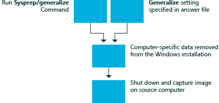

# 一般化

Windows® 安装程序的**一般化**配置阶段用于创建 Windows 参考映像，可用于整个组织。 中的**一般化**配置阶段的设置，您可以自动执行此参考映像的所有部署的行为。 相比之下，在[specialize](specialize.md)配置阶段中应用的设置使您可以重写为单一的特定部署的行为。

当系统通用的时对于给定的 Windows 安装特定的配置数据将被删除。 例如，在**一般化**配置阶段中，唯一的安全 ID (SID) 和其他特定于硬件的设置是从图像中删除。

只有与**一般化 /**选项使用**Sysprep**命令时将运行的**一般化**配置阶段。 应答文件中的设置`<generalize>`部分中的答案文件应用到系统中， **Sysprep**泛化发生之前。 然后关闭系统。

下图显示的**一般化**配置阶段的过程。

在下次系统启动后立即运行在[specialize](specialize.md)配置阶段。 当您运行**Sysprep**时，您可以决定 Windows 将为审计模式或 Windows 欢迎通过**指定/审核**或**/oobe**启动。 **专门负责**配置传递始终运行后已通用化计算机，而不管该计算机是否已配置为启动到审核模式或欢迎使用 Windows。

移动或复制到新计算机的 Windows 映像的任何方法必须准备好与**sysprep 一般化 /**命令。 有关详细信息，请参阅[Sysprep （通用化） 的 Windows 安装](sysprep--generalize--a-windows-installation.md)。

## 相关的主题

[配置阶段的工作](how-configuration-passes-work.md)

[auditSystem](auditsystem.md)

[auditUser](audituser.md)

[offlineServicing](offlineservicing.md)

[oobeSystem](oobesystem.md)

[专门负责](specialize.md)

[windowsPE](windowspe.md)

 

 

