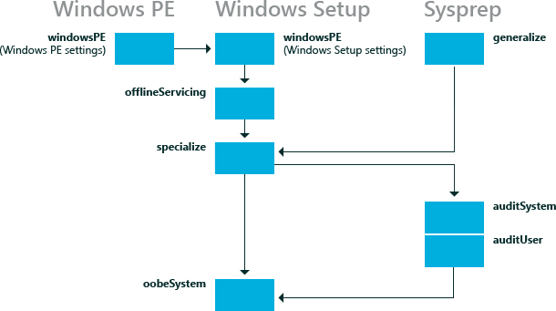

# <a name="how-configuration-passes-work"></a>配置阶段的工作


配置阶段是 Windows® 安装在此期间，您可以自定义图像的阶段。 Windows 无人参与的安装设置可应用于一个或多个配置阶段，具体取决于您使用的设置。 了解如何以及何时运行配置阶段是在开发 Windows 部署策略中非常重要的。

本主题︰

-   [了解配置阶段](#understand)

-   [配置设备驱动程序](#configdevice)

-   [配置国际设置](#configintsettings)

-   [示例](#examples)

## <a name="span-idunderstandspanspan-idunderstandspanunderstanding-configuration-passes"></a><span id="understand"></span><span id="UNDERSTAND"></span>了解配置阶段


下图显示了相对于不同部署工具传递配置之间的关系。



不是所有的配置阶段运行在特定的 Windows 安装。 某些配置阶段，如**auditSystem**和**auditUser**，运行仅当您计算机引导到审核模式。 大多数 Windows 安装程序无人参与的设置可以添加到**专用化**或**oobeSystem**配置阶段。 其他配置阶段也可以在某些情况下非常有用。 下表描述每个配置阶段。

<table>
<colgroup>
<col width="33%" />
<col width="33%" />
<col width="33%" />
</colgroup>
<thead>
<tr class="header">
<th align="left">配置阶段</th>
<th align="left">说明</th>
<th align="left">配置阶段运行的时间</th>
</tr>
</thead>
<tbody>
<tr class="odd">
<td align="left"><p><strong>windowsPE</strong></p></td>
<td align="left"><p>在<strong>windowsPE</strong>配置阶段，可实现自动安装过程的许多方面。 在此阶段中，您可以配置︰</p>
<ul>
<li><p>Windows PE 选项</p>
<p>这些选项包括指定 Windows PE 日志文件，从而使网络或 Windows PE 页面文件的位置。</p></li>
<li><p>Windows 安装程序选项</p>
<p>这些选项包括指定要安装的 Windows 映像，并在目标计算机上配置的磁盘。</p></li>
</ul>
<p>在此配置阶段，进行处理后在<strong>windowsPE</strong>配置中的设置将映像复制到目标计算机的 Windows。</p>
<p>如果您的 Windows PE 安装要求启动关键驱动程序来访问本地硬盘或网络，使用此配置阶段，将驱动程序添加到 Windows PE 驱动程序存储区，以反映所需的启动关键驱动程序</p></td>
<td align="left"><p>发生以下情况之一︰</p>
<ul>
<li><p>启动 Windows 安装媒体</p></li>
<li><p>从以前的 Windows 安装启动 Windows 安装程序</p></li>
</ul>
<p>仅在您从 Windows PE 环境运行 Windows 安装程序时，Windows PE 选项的应用。 从 Windows PE 或以前的 Windows 安装运行时，Windows 安装程序选项的应用。</p></td>
</tr>
<tr class="even">
<td align="left"><p><strong>offlineServicing</strong></p></td>
<td align="left"><p>该配置阶段中用于将更新、 驱动程序或语言包应用于 Windows 映像。</p>
<p>在 Windows 安装过程中，将 Windows 映像应用到硬盘和<strong>offlineServicing</strong>部分中的答案文件中的任何设置随后将应用于该映像之前重新引导计算机。</p>
<p>在此配置阶段中，您可以添加驱动程序对 Windows 映像图像开始之前。 这使您能够安装并在 Windows 安装过程中处理的全新设备驱动程序。</p>
<p>此配置阶段还用于在处理方案将更新应用到 Windows 映像。</p></td>
<td align="left"><ul>
<li><p>自动在<strong>windowsPE</strong>配置阶段之后和之前重新引导计算机。</p></li>
<li><p>在处理方案，当您指定答案文件通过使用部署映像服务和管理工具 (Dism.exe)。</p></li>
</ul></td>
</tr>
<tr class="odd">
<td align="left"><p><strong>专门负责</strong></p></td>
<td align="left"><p>该配置阶段中用于创建和配置信息在 Windows 映像中，并且特定于 Windows 映像安装到该硬件。</p>
<p>第一次启动 Windows 映像后，将运行在<strong>specialize</strong>配置阶段。 在此阶段中，将创建唯一的安全 Id (Sid)。 此外，您可以配置多个 Windows 功能，包括网络设置、 区域设置和域信息。</p>
<p>在审核模式下出现<strong>专门</strong>通过答案文件设置。 在计算机启动到审核模式、 <strong>auditSystem</strong>通过运行和计算机的当处理 auditUser 设置。</p></td>
<td align="left"><ul>
<li><p>自动当 Windows 映像启动第一次。</p></li>
<li><p>在您下次启动的<strong>一般化 /</strong>选项运行<strong>sysprep</strong>命令。</p></li>
</ul></td>
</tr>
<tr class="even">
<td align="left"><p><strong>一般化</strong></p></td>
<td align="left"><p>在此配置阶段中，特定于计算机的信息从使您能够捕获并重新将 Windows 映像应用到不同的计算机的 Windows 安装。 例如，在此阶段中，唯一的安全 ID (SID)，唯一的设备驱动程序和其他特定于硬件的设置是从图像中删除。</p>
<p>该配置阶段中，可最低限度地配置<strong>sysprep 一般化 /</strong>命令，除了主映像上配置必须保持其他 Windows 设置。</p>
<p><strong>一般化</strong>的传递完成下, 一次启动 Windows 映像时后, 在<strong>specialize</strong>配置阶段运行。 如果您想要保留的唯一的设备驱动程序安装到您的 Windows 安装，则可以使用 Microsoft Windows PnpSysprep |<code>PersistAllDeviceInstalls</code>设置。 如果配置了此设置，唯一的设备驱动程序不会从安装。</p></td>
<td align="left"><ul>
<li><p>配置以下设置︰ Microsoft Windows 部署 |<code>Generalize</code>.</p></li>
</ul>
<p>-或-</p>
<ul>
<li><p>运行<strong>sysprep 一般化 /</strong>命令。</p></li>
</ul></td>
</tr>
<tr class="odd">
<td align="left"><p><strong>auditSystem</strong></p></td>
<td align="left"><p>在此配置阶段中，设置在系统上下文中之前用户登录到该计算机在 Aaudit 模式下, 运行 Windows 时处理。</p>
<p>此阶段通常用于制作到安装，例如安装全新的设备驱动程序的其他配置。</p>
<p>此阶段运行，只有当计算机被配置为启动到审核模式。</p></td>
<td align="left"><ul>
<li><p>以下无人参与的安装设置配置︰ Microsoft Windows 部署 |重新封装 |<code> Mode</code>=<strong>Audit</strong>.</p></li>
</ul>
<p>-或-</p>
<ul>
<li><p><strong>使用/审核</strong>选项运行<strong>sysprep</strong>命令。</p></li>
</ul></td>
</tr>
<tr class="even">
<td align="left"><p><strong>auditUser</strong></p></td>
<td align="left"><p>本轮后处理有用户登录到该计算机，在审核模式下，将无人参与的安装设置。</p>
<p>此阶段通常用于运行自定义命令或配置 Windows 外壳程序选项。</p>
<p>此阶段运行，只有当计算机被配置为启动到审核模式。</p></td>
<td align="left"><ul>
<li><p>以下无人参与的安装设置配置︰ Microsoft Windows 部署 |重新封装 |<code> Mode</code>=<strong>Audit</strong>.</p></li>
</ul>
<p>-或-</p>
<ul>
<li><p><strong>使用/审核</strong>选项运行<strong>sysprep</strong>命令。</p></li>
</ul></td>
</tr>
<tr class="odd">
<td align="left"><p><strong>oobeSystem</strong></p></td>
<td align="left"><p>在此配置阶段中，设置应用于 Windows 欢迎使用 Windows 启动之前。</p>
<p>此阶段通常用于配置 Windows 外壳程序选项，创建用户帐户，并指定语言和区域设置。</p>
<p>在欢迎使用 Windows，也称为 OOBE 出现<strong>oobeSystem</strong>阶段的答案文件设置。 在审核模式下未出现进行这些设置。</p></td>
<td align="left"><ul>
<li><p>配置以下设置︰ Microsoft Windows 部署 |<code>Reseal</code> | <code>Mode</code>=<strong>OOBE</strong></p></li>
</ul>
<p>-或-</p>
<ul>
<li><p>使用<strong>/OOBE</strong>选项运行<strong>sysprep</strong>命令。</p></li>
</ul></td>
</tr>
</tbody>
</table>

 

有关 Windows 组件和设置添加到答案文件的详细信息，请参阅无人参与的 Windows 安装程序参考指南 》。 有关日志记录的详细信息，请参阅[部署故障排除和日志文件](deployment-troubleshooting-and-log-files.md)， [Windows 安装程序日志文件和事件日志](windows-setup-log-files-and-event-logs.md)。

## <a name="span-idconfigdevicespanspan-idconfigdevicespanspan-idconfigdevicespanconfiguring-device-drivers"></a><span id="configDevice"></span><span id="configdevice"></span><span id="CONFIGDEVICE"></span>配置设备驱动程序


若要在无人参与安装期间添加的瓜、 启动关键驱动程序，必须确保启动所必需的驱动程序是预安装介质上可用。 引导关键驱动程序应添加在**windowsPE**配置阶段。 所有驱动程序都转移在驱动程序存储区中，但反映或除了 Windows PE 映像脱机 Windows 映像中安装仅启动关键驱动程序。 可以将非引导所必需的驱动程序添加到**offlineServicing**的配置阶段。 这可以确保启动所必需的驱动程序可用，并且在计算机启动时，将加载该驱动程序。

有关详细信息，请参阅[设备驱动程序和部署概述](device-drivers-and-deployment-overview.md)。

## <a name="span-idconfigintsettingsspanspan-idconfigintsettingsspanspan-idconfigintsettingsspanconfiguring-international-settings"></a><span id="configIntSettings"></span><span id="configintsettings"></span><span id="CONFIGINTSETTINGS"></span>配置国际设置


国际设置有多个配置阶段，使您能够自定义 Windows 映像以根据客户的需求和不同的部署方案。

例如，如果生成在美国 （这是 EN-US 区域设置） 的计算机，您可能英语执行所有测试。 但是，如果您想将计算机交付给法国，并需要 Windows 启动在法语中，如果语言包尚未安装，并配置要在**specialize**配置阶段期间应用 FR-FR 设置的 Microsoft Windows 国际核心组件可以添加 FR-FR 语言包。 当计算机启动时，安装将显示英语文本。 但是，专业化配置传递完成后，将显示法语文本。

您可以使用 DISM 配置 Windows 映像 （在线或离线） 的语言设置。 有关详细信息，请参阅[DISM 语言和国际服务命令行选项](dism-languages-and-international-servicing-command-line-options.md)。

默认情况下，欢迎使用 Windows 显示最终用户选择默认语言、 区域设置和输入法的设置区域设置用户界面 (UI) 页面。 可以预先在此用户界面页上的设置配置的指定语言和区域设置在**oobeSystem**配置传入的 Microsoft Windows 国际核心组件。 如果设置在**oobeSystem**配置传递，则跳过页面的区域设置。 如果在专业化过程中配置语言设置，将显示区域设置页。

有关详细信息，请参阅[将语言包添加到 Windows](add-language-packs-to-windows.md)。

## <a name="span-idexamplesspanspan-idexamplesspanspan-idexamplesspanexamples"></a><span id="Examples"></span><span id="examples"></span><span id="EXAMPLES"></span>示例


以下各节描述了示例部署方案，并描述配置阶段运行。

### <a name="span-idtorunwindowssetupspanspan-idtorunwindowssetupspanspan-idtorunwindowssetupspanto-run-windows-setup"></a><span id="To_run_Windows_Setup"></span><span id="to_run_windows_setup"></span><span id="TO_RUN_WINDOWS_SETUP"></span>运行 Windows 安装程序

在此方案中，您将 Windows 安装到一台新电脑。 您从 Windows 产品介质和答案文件开始。

1.  运行 Windows 安装程序并指定答案文件。 Windows 安装程序将启动。

2.  在**windowsPE**配置阶段运行。 设置在`<settings pass="windowsPE">`的答案文件的部分进行处理。 您可以配置在**windowsPE**配置阶段的设置的两种不同类型︰ 适用于 Windows PE 环境，如 Windows PE 的显示分辨率和日志文件位置的设置。 您还可以指定应用于 Windows 安装，如配置磁盘分区或启用动态更新设置。

    -   仅当您从 Windows PE 环境中运行 Windows 安装程序时，才应用答案文件中的特定 Windows PE 的设置。

    -   在**windowsPE**配置选项通过 Windows 安装程序将应用从 Windows PE 或以前的 Windows 安装运行时。

3.  Windows 映像复制到硬盘后， **offlineServicing**配置阶段运行。 中的任何设置`<servicing>`和`<settings pass="offlineServicing">`部分中的答案文件应用于 Windows 映像。 通常情况下，此配置阶段中的操作安装或删除程序包、 语言包或设备驱动程序。

4.  在系统重新启动，Windows 安装程序将运行在**specialize**配置阶段。 在这种情况下，设置在`<settings pass="specialize">`应答文件的部分进行处理。

5.  Windows 安装程序完成后，重新启动计算机。 然后， **oobeSystem**配置传递运行和设置在`<settings pass="oobeSystem>`答案文件的部分进行处理。

    **请注意**  
    您可以创建一个单独的内容文件调用，您可以使用自定义 Windows 欢迎，入门，ISP 注册的 Oobe.xml。 使用 Oobe.xml 可用于组织这些自定义项，因为它使您可以维护一个文件，其中列出了所有的品牌、 许可条款和注册多个国家、 地区和/或语言的机会。 有关详细信息，请参阅[配置 Oobe.xml](configure-oobexml.md)。 通常情况下，Oem 和系统构建者使用 Oobe.xml。 但是 Oobe.xml 的某些方面还可能受益公司部署方案。

     

6.  欢迎使用 Windows 启动，您可以开始使用计算机。

### <a name="span-idtorunthesysprepgeneralizeshutdowncommandspanspan-idtorunthesysprepgeneralizeshutdowncommandspanspan-idtorunthesysprepgeneralizeshutdowncommandspanto-run-the-sysprep-generalize-shutdown-command"></a><span id="To_run_the_Sysprep__generalize__shutdown_command"></span><span id="to_run_the_sysprep__generalize__shutdown_command"></span><span id="TO_RUN_THE_SYSPREP__GENERALIZE__SHUTDOWN_COMMAND"></span>若要运行 Sysprep / 一般化 /shutdown 命令

在此方案中，您将创建在整个环境中使用的 Windows 映像的引用。 开始自定义 Windows 安装。

1.  运行**sysprep**命令**/ 一般化 /shutdown /oobe**选项，以创建一个主映像，将计算机配置为启动到 Windows 欢迎，然后关闭计算机。

2.  在设置`<settings pass="generalize">`应用答案文件部分。

    -   如果您未指定答案文件与**Sysprep**命令，则将使用答案文件缓存到计算机中。 有关如何使用答案文件的详细信息，请参阅[Windows 安装程序自动化概述](windows-setup-automation-overview.md)。

    -   如果您使用**sysprep**命令指定答案文件，该答案文件会缓存到 %WINDIR%\\黑豹 Windows 安装的目录，并将在后续配置阶段中使用。

3.  关闭计算机，使您能够启动到 Windows PE 或另一个操作系统并捕获映像。 下一步在 Windows 映像启动在**specialize**配置阶段运行的时间，Windows 将计算机启动到 Windows 欢迎。

### <a name="span-idusingascripttodeployawindowsimagespanspan-idusingascripttodeployawindowsimagespanspan-idusingascripttodeployawindowsimagespanusing-a-script-to-deploy-a-windows-image"></a><span id="Using_a_Script_to_Deploy_a_Windows_Image"></span><span id="using_a_script_to_deploy_a_windows_image"></span><span id="USING_A_SCRIPT_TO_DEPLOY_A_WINDOWS_IMAGE"></span>使用脚本来部署 Windows 映像

在这种情况下，启动与主映像的计算机上的**sysprep 一般化 /shutdown /oobe /**运行命令并捕获图像。 与主启动图像，Windows PE，DISM 工具。

1.  通过使用**dism**命令使用**/apply-image**选项适用于计算机的主映像。

2.  启动计算机的主映像。 在 Windows 启动。

3.  在**specialize**配置阶段运行。 在设置`<settings pass="specialize">`应答文件的部分进行处理。

4.  重新启动计算机。

5.  在**oobeSystem**配置阶段运行。 在设置`<settings pass="oobeSystem">`应答文件的部分进行处理。

6.  欢迎使用 Windows 启动，您可以开始使用您的计算机。

### <a name="span-idtobootwindowstoauditmodespanspan-idtobootwindowstoauditmodespanspan-idtobootwindowstoauditmodespanto-boot-windows-to-audit-mode"></a><span id="To_boot_Windows_to_audit_mode"></span><span id="to_boot_windows_to_audit_mode"></span><span id="TO_BOOT_WINDOWS_TO_AUDIT_MODE"></span>引导到审核模式的窗口

在此方案中，您将启动配置为在审核模式下启动 Windows 映像。 审核模式是用于向主映像添加自定义应用程序、 驱动程序和其他更新。 您可以配置 Windows 映像以计算机引导到审核模式通过在答案文件中配置以下设置︰ Microsoft Windows 部署 |重新封装 |`Mode` =**审核**或者，运行**Sysprep** **命令/审核**选项。

1.  配置 Windows 映像启动到审核模式的计算机。 在此情况下，使用**/reboot 模式**选项运行**sysprep**命令。

2.  Windows 会重新启动计算机。

3.  **AuditSystem**的配置阶段运行。 在设置`<settings pass="auditSystem">`应答文件的部分进行处理。

4.  内置的管理员帐户被启用。

5.  在**auditUser**配置阶段运行。 在设置`<settings pass="auditUser">`应答文件的部分进行处理。

6.  此时将显示桌面。

下一次重新启动计算机，它将启动到审核模式再次。

若要将计算机引导至 Windows 欢迎的配置，必须使用**/oobe**选项时，使用**sysprep**命令或配置 Microsoft Windows 部署 |重新封装 |`Mode`在应答文件中设置为**oobe** 。

### <a name="span-idtorundismagainstanofflinewindowsimagespanspan-idtorundismagainstanofflinewindowsimagespanspan-idtorundismagainstanofflinewindowsimagespanto-run-dism-against-an-offline-windows-image"></a><span id="To_run_DISM_against_an_offline_Windows_image"></span><span id="to_run_dism_against_an_offline_windows_image"></span><span id="TO_RUN_DISM_AGAINST_AN_OFFLINE_WINDOWS_IMAGE"></span>若要对脱机 Windows 映像运行 DISM

在此方案中，您运行 DISM 脱机 Windows 映像。

1.  对脱机 Windows 映像运行 DISM 工具并指定答案文件。 例如，要列出脱机 Windows 映像中的程序包，请使用下面的命令︰

    ``` syntax
    Dism /image:C:\test\offline /Get-Packages
    ```

2.  在设置`<servicing>`和`<settings pass="offlineServicing">`部分的答案文件应用于 Windows 映像。 下一次启动计算机时，程序包和设置进行处理。

有关详细信息，请参阅[DISM 图像管理命令行选项](dism-image-management-command-line-options-s14.md)。

### <a name="span-idtousedismonarunningwindowsimagespanspan-idtousedismonarunningwindowsimagespanspan-idtousedismonarunningwindowsimagespanto-use-dism-on-a-running-windows-image"></a><span id="To_use_DISM_on_a_running_Windows_image"></span><span id="to_use_dism_on_a_running_windows_image"></span><span id="TO_USE_DISM_ON_A_RUNNING_WINDOWS_IMAGE"></span>在正在运行的 Windows 映像上使用 DISM

在此方案中，您将运行 DISM 工具针对正在运行的 Windows 安装。

-   针对在线的 Windows 映像运行 DISM 和指定答案文件。 例如，列出在 Windows 映像中的驱动程序信息使用下面的命令︰

    ``` syntax
    Dism /online /Get-Drivers
    ```

    **重要**  
    当您使用应答文件针对在线的 Windows 安装使用 DISM 时，应答文件应包含**offlineServicing**配置阶段中的元素。 这是因为在**specialize**配置阶段中的某些设置可能应用到在线的 Windows 安装。

     

在某些情况下，您可能需要重新启动计算机。 例如，如果将语言包添加到 Windows 安装，您必须重新启动计算机。

## <a name="span-idrelatedtopicsspanrelated-topics"></a><span id="related_topics"></span>相关的主题


[auditSystem](auditsystem.md)

[auditUser](audituser.md)

[一般化](generalize.md)

[offlineServicing](offlineservicing.md)

[oobeSystem](oobesystem.md)

[专门负责](specialize.md)

[windowsPE](windowspe.md)

 

 


