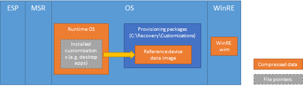

# 依靠以点击方式重置功能的工作方式

## 还原操作系统和自定义项

本节讨论按钮重置功能使用 PC 上的软件恢复的机制。

### 还原窗口

依靠以点击方式重置功能还原 Windows 10 通过构建使用运行时的系统文件，Windows 组件存储在操作系统的新版本 (c:\\Windows\\WinSxS)。 这将允许恢复可能即使没有单独的恢复映像，包含所有的系统文件的备份副本。

此外，按钮重置功能还原 Windows 更新后的状态，而不是工厂预安装状态。 特别是，（如 Windows 10 1511年版本) 的计算机上安装的重要更新的最新版本将恢复之后，将放弃安装其他更新程序同时。

这种方法提供了根据需要重新安装的更新数的用户体验和功能的有效性，解决更新问题之间的平衡。 它还允许 Windows 中删除较旧的系统文件不再需要供运行时使用或恢复，释放磁盘空间。

默认情况下，则不会还原非主要更新。 若要确保在制造过程中预安装的更新不放弃恢复后，他们应将标记作为永久使用 DISM 中与 /StartComponentCleanup 和 /ResetBase 选项的 /Cleanup-Image 命令。 在恢复期间始终还原更新为永久性标记。

### 还原语言包

语言包安装和使用的至少一个用户帐户将被还原。 其他语言包是从存储中移除 Windows 组件之后的全新体验 (OOBE) 7 天。 之后，将不会恢复已删除的语言包，请使用按钮重置功能。

在 Pc 运行单语言版本的 Windows 中，如 Windows 10 家用户无法下载或安装其他语言包，它们不能使用点击式重置功能来切换语言，如果已删除的预安装的语言包。

### 还原驱动程序

驱动程序与操作系统恢复以类似的方式。 而不是从恢复映像还原它们时，在恢复保留现有的驱动程序。 根据使用的系统文件、 驱动程序恢复到状态时它们所处安装最新版本或主要更新。 例如︰

-   如果客户在新 PC 预装了 Windows 10 向上引导后进行恢复，在 OOBE 期间存在的驱动程序将还原，即使由于安装了较新的驱动程序。
-   如果客户从 Windows 10 为 Windows 10，1511，版本升级后执行恢复升级过程中存在的驱动程序将还原，即使由于安装了较新的驱动程序。

作为此过程的一部分，设备小外 INF 驱动程序包安装程序则不会还原。 它们恢复到出厂版本和状态，其他自定义设置，如 Windows 桌面应用程序的方式相同。 （请参阅恢复其他自定义的详细信息）。设备小程序必须始终保持同步 （版本明智） 的驱动程序，如果建议通过同一个 INF 包安装驱动程序和设备小程序。

### 还原以前安装的 Windows 应用程序

预安装的 Windows 应用程序始终还原到其出厂版本和状态。 而不是从恢复映像还原它们时，一份 Windows 应用程序会自动备份调配过程的图像自定义和制造，并使用点击式重置功能时，还原备份时。

### 恢复其他自定义

默认情况下，按钮重置功能恢复仅操作系统文件、 驱动程序和预安装通用的 Windows 应用程序。 不同的机制用于还原其他自定义设置，如设置和 Windows 桌面应用程序。

-   可以使用用户状态迁移工具 (USMT) 捕获**Windows 桌面应用程序**扫描状态到参考设备数据映像供应包中的实用程序。 点击式重置功能查找并自动从众所周知的位置还原此配置包。
-   **设置通用于所有版本的 Windows 10**（包括 Windows 10 Mobile） 可以设置使用 Windows 图像处理和配置设计器 (ICD) 工具和存储资源调配的包中。 依靠以点击方式重置功能查找并自动恢复这些提供包的已知位置。 或者，可以还原这些设置按钮重置为使用无人参与文件和扩展脚本的组合。
-   **设置特定于版本的 Windows 桌面版本 （家庭、 Pro、 企业和教育） 的 10**可以还原按钮重置为使用无人参与文件和扩展脚本的组合。 这些设置的示例包括制造商支持信息、 制造商徽标和 「 开始 」 菜单布局。

**请注意**  
许多设置自定义设置允许或要求的 OPD 为桌面，特定于 Windows 10，不能存储在资源调配使用 Windows ICD 创建的包。 对于 Windows 10 RTM，使用无人参与文件和按钮重置扩展性脚本用于在恢复过程中恢复设置的所有自定义建议。 提供创建使用 Windows ICD 的包的使用完全是可选的。

 

## 刷新您的 PC

**以下步骤可以概括刷新您的 PC 的功能︰**

1.  PC 启动进入 Windows 恢复环境 (Windows RE)。
2.  **可扩展性点 A**: Oem 可以选择添加下面的脚本。 （请参阅本主题中后面[的扩展点](#extensibility-points)）。
3.  用户帐户、 设置和数据收集，并移动到一个临时位置。
4.  操作系统的新版本被构建在使用来自 Windows 组件存储文件的临时位置。
5.  自定义设置存储在资源调配在 c︰ 下的包\\恢复\\的自定义设置应用于新的操作系统。
6.  从现有操作系统复制并注入到新操作系统的驱动程序。
7.  预安装的 Windows 应用程序将从其备份位置还原。
8.  系统关键设置应用到新的操作系统。
9.  现有的操作系统将被移动到 c:\\Windows.old。
10. 新的操作系统被移动到操作系统卷的根目录中。
11. **可扩展性点 B**: Oem 可以选择添加下面的脚本。 （请参阅本主题中后面[的扩展点](#extensibility-points)）。
12. 计算机重新引导到新的操作系统。
13. 在第一次启动时，用户数据和设置都将重新应用。

### 保留的设置

**刷新计算机**的功能保留大量的系统和用户设置所需保持系统运行时用户可以重新配置他们的 Pc 需求降至最低。

保留的设置可大致归类为以下类别之一︰

-   所需的用户运行的**刷新您的 PC**功能后登录到他们的 Pc。
-   影响用户如何访问其文档和个人文件。
-   很难对大多数用户重新创建。
-   影响系统安全或用户的隐私。
-   对 PC 进行个性化设置。

保留的设置概述如下︰

-   （本地、 域、 Microsoft 帐户） 的用户帐户和组成员身份
-   域设置
-   Windows 更新设置
-   库设置
-   锁定屏幕背景
-   桌面主题
-   国际设置
-   无线网络配置文件
-   在欢迎使用 Windows 中配置的设置

### 用户数据

由于用户数据可以存储在多个位置，**刷新您的 PC**功能保留大多数文件夹和文件不是一个标准的 Windows 安装。 **刷新计算机**功能刷新下列系统位置并不会保留内容。

-   \\窗口
-   \\程序文件
-   \\程序 Files(x86)
-   \\ProgramData
-   \\用户\\&lt;用户名&gt;\\（以每个用户的配置文件） 的应用程序数据

**请注意** 某些应用程序用户将数据存储在\\在用户配置文件的应用程序数据文件夹。 \\应用程序数据文件夹位于 c:\\Windows.old 后使用**刷新您的 PC**功能。

 

**刷新计算机**功能绕过的下列位置并保留内容︰

-   文件版本控制历史记录数据
-   所有文件和文件夹在非操作系统分区

### Windows 应用程序

在刷新您 PC 的功能处理应用程序类型以不同的方式以确保 PC，可以恢复到稳定状态。 应用程序按如下方式处理︰

-   从 Windows 应用商店-获得用户的 Windows 应用程序中不保留。 用户将需要从 Windows 应用商店将它们重新安装。 这是从 Windows 8/8.1 中的更改。
-   预安装的 Windows 应用程序恢复到其出厂版本和状态。 将下载和 internet 连接可用时自动重新应用到这些应用程序的更新。
-   用户已获取 Windows 桌面应用程序不会保留。 用户将需要手动重新安装。
-   预安装 Windows 桌面应用程序捕获资源调配的包将被还原到其出厂状态，自定义项中，即使用户以前卸载它们。

**刷新计算机**的功能，不会保留用户安装 Windows 桌面应用程序默认情况下，通常用于存储应用程序设置的位置 (\\应用程序数据和\\ProgramData) 都将被删除。 制造商可以利用按钮重置扩展点，以保存并在以后还原特定的应用程序设置和数据，如有必要。

## 重置您的 PC

**重置您的 PC 的功能可以概括以下步骤︰**

1.  PC 启动进入 Windows 恢复环境 (Windows RE)。
2.  用户帐户、 数据和已安装的 Windows 应用程序和 Windows 桌面应用程序会从 OS 卷。
3.  数据的卷进行格式化 （如果用户请求）。
4.  （如果用户请求），操作系统和数据卷上执行数据擦除。
5.  **可扩展性点 C**: Oem 可以选择添加下面的脚本。 （请参阅本主题中后面[的扩展点](#extensibility-points)）。
6.  操作系统的新版本被构建在使用来自 Windows 组件存储文件的临时位置。
7.  自定义设置存储在资源调配在 c︰ 下的包\\恢复\\的自定义设置应用于新的操作系统。
8.  从现有操作系统复制并注入到新操作系统的驱动程序。
9.  预安装通用的 Windows 应用程序将从其备份位置还原。
10. 将删除现有的操作系统。
11. 新的操作系统被移动到操作系统卷的根目录中。
12. **可扩展性点 D**: Oem 可以选择添加下面的脚本。 （请参阅本主题中后面[的扩展点](#extensibility-points)）。
13. 计算机重新引导到新的操作系统。
14. OOBE 启动。

### 数据删除选项

当用户使用**重置您的 PC**功能时，它们将看到影响，PC 中删除其数据的方式的选项。

-   如果计算机有多个用户访问硬盘卷，用户可以选择删除所有卷或仅 Windows 卷的数据。

    Windows 卷从未格式化，它是重新构建操作系统所必需的文件。 相反，逐个删除用户数据文件。

    如果用户选择删除所有卷中的数据，数据卷进行格式化。
    
-   用户可以选择只删除他们的文件或执行数据擦除驱动器上，以便其他人的数据恢复变得更加困难。

制造商必须配置自定义的实用程序分区，如下所示，若要确保这些分区不受重置过程。

-   基于 UEFI 的计算机 GUID 分区表 (GPT) 磁盘上的实用程序分区应有 GPT\_属性\_平台\_必需的属性集。 请参阅[分区\_信息\_GPT 结构](http://go.microsoft.com/fwlink/?LinkId=617162)了解更多有关 GPT 分区特性。
-   基于 BIOS 的计算机，主启动记录 (MBR) 磁盘上的实用程序分区必须是此类型 0x7、 0x0c、 0x0b、 0x0e、 0x06 和 0x42。

执行数据擦除所花费的时间取决于驱动器的速度，分区大小，以及是否使用 Windows BitLocker 驱动器加密加密驱动器。 数据擦除功能以使用者为目标，并不符合政府和行业数据擦除标准。

如果在重置前操作系统上启用了[精简的操作系统](compact-os.md)，精简的操作系统将保持启用状态后 PC 已被重置。 

## 裸机恢复

如果用户需要更换硬盘或完全擦除它，他们可以使用可引导恢复媒体执行裸机恢复。 裸机恢复删除的系统磁盘上的所有现有分区并将所有分区，重新都创建恢复软件到电脑前。 支持两种类型的恢复介质︰

-   **用户创建恢复媒体**使用 Windows 10 中的**恢复驱动器创建**工具。 这将备份还原到原始状态的 PC 所需的文件。
-   为支持和翻新过的方案，通过将恢复映像放在一个可引导的 Windows RE 媒体**制造商创建恢复媒体**。

**用户创建恢复媒体使用时，可在以下步骤中总结的裸机恢复功能︰**

1.  标识系统磁盘。
2.  删除所有的系统磁盘分区。
3.  （如果用户请求） 的系统磁盘执行数据擦除。
4.  系统磁盘上重新创建工厂或默认的分区布局。
5.  所有分区被都格式化。
6.  从恢复介质恢复文件被复制到操作系统卷。
7.  操作系统的新版本的 OS 卷根本构造。
8.  应用自定义存储在资源调配的包。
9.  驱动程序注入到新的操作系统。
10. 预安装的 Windows 应用程序被恢复。
11. 启动文件的系统分区配置。
12. 计算机重新引导到新的操作系统。
13. OOBE 启动。

### 数据删除选项

当用户使用的裸机恢复功能时，他们可以选择数据擦除磁盘上执行整个系统的出厂分区布局重新应用之前。 大多数的个人电脑上软件，密码随机模式一次写入系统磁盘的 LBA 全部完成此数据擦除过程。

但是，在某些硬件配置中，数据擦除过程执行存储设备的硬件控制器。 这通常需要更少的时间，才能完成，通常更为彻底删除残余部分数据。 基于硬件的数据擦除在 Pc 上支持具有存储设备，它满足下列条件︰

-   eMMC
-   支持安全修整和净化命令

### 系统磁盘选择

裸机恢复自动识别的系统磁盘，使用以下方法︰

-   适配器的位置路径和系统磁盘的 GUID 写入到 UEFI 变量在 OOBE 期间。
    -   仅当系统和 Windows 分区的系统磁盘上时，才执行。

    -   该变量时，更新如有必要禁用并重新启用 Windows RE 获取。

-   裸机恢复，期间如果检测到多个内部磁盘，系统磁盘搜索顺序如下︰
    -   磁盘具有 GUID 匹配 UEFI 变量中存储的值。
    -   磁盘固件中存储的值匹配的位置路径。
    -   对于现有的 ESP 的磁盘。
        -   如果找到多个磁盘，对于 ESP，将不会执行裸机恢复。
    -   未初始化 （裸容量） 的磁盘。
        -   如果找到多个未初始化的磁盘，将不会执行裸机恢复。
-   在旧的 BIOS/MBR 系统上使用 BIOS 报告系统磁盘。

### 用户创建恢复媒体

当用户创建 USB 恢复媒体使用创建的恢复驱动器的实用程序时，生成的媒体始终包含可引导的 Windows RE 副本。 这使用户访问故障诊断和恢复工具时从恢复介质引导。

用户可以有选择地备份执行裸机恢复所需的文件。 选中该选项后，以下复制到 USB 恢复介质︰

-   Windows 组件存储
-   已安装驱动程序
-   预安装 Windows 应用程序的备份
-   资源调配包包含预安装自定义项 (在 c︰ 下\\恢复\\的自定义项)
-   依靠以点击方式重置配置 XML 和脚本 (在 c︰ 下\\恢复\\OEM)

### 制造商创建恢复媒体

裸机恢复支持恢复 WIM 映像的介质由制造商准备时。 这种类型的媒体主要用于支持和翻新过的方案。

制造商创建的介质必须包含以下信息︰

1.  可引导的 Windows RE 映像。
2.  一个按钮重置兼容的恢复映像 (install.wim)。
3.  依靠以点击方式重置配置文件 (Resetconfig.xml) 指定磁盘分区信息。
4.  DISKPART 脚本来执行磁盘的分区。

### 依靠以点击方式重置功能的扩展点

依靠以点击方式重置提供了扩展点，制造商可以插入自定义操作，当用户运行的**刷新您的 PC**和**重置您的 PC**功能。

请参见上面的这些功能可以执行自定义操作显示的位置，请参阅部分。

下表总结了扩展性点的**刷新您的 PC** :

|            |                                                                                                                            |                                                                                                                                                   |
|------------|----------------------------------------------------------------------------------------------------------------------------|---------------------------------------------------------------------------------------------------------------------------------------------------|
| 分机 磅 | 系统状态                                                                                                               | 用法示例                                                                                                                                     |
| 表示网站项目上次更改时间的          | 要迁移的设置和数据移动到一个临时位置                                                   | 将复制的文件、 驱动程序或当用户运行刷新您的 PC 功能，默认情况下不迁移的设置。                                 |
| B          | 重建操作系统。 已重新应用驱动程序和自定义项。 只有重要的系统设置被迁移。 | 恢复 （例如 unattend.xml、 layoutmodification.xml） 的自定义文件或文件和设置，您可能已经在备份扩展性点 a。 |

 

下表总结了扩展性点的**重置您的 PC** :

<table>
<colgroup>
<col width="33%" />
<col width="33%" />
<col width="33%" />
</colgroup>
<tbody>
<tr class="odd">
<td align="left">分机 磅</td>
<td align="left">系统状态</td>
<td align="left">用法示例</td>
</tr>
<tr class="even">
<td align="left">C</td>
<td align="left">从 Windows 分区中删除了所有的用户数据和 （可选） 已格式化的数据分区。</td>
<td align="left">如果需要重新配置数据分区。

<strong>重要</strong> 请不要修改 Windows 分区。

 

</td>
</tr>
<tr class="odd">
<td align="left">D</td>
<td align="left">重建操作系统。 已重新应用驱动程序和自定义项。</td>
<td align="left">还原自定义文件 （例如 unattend.xml、 layoutmodification.xml），或应用其他自定义设置。</td>
</tr>
</tbody>
</table>

 

## 精简的操作系统

精简的操作系统是允许 Windows 10 以部署在 Pc 上存储容量 16 千兆字节 (GB) 为低技术的集合。 下面的两种技术尤其是配合使用点击式重置更改以减少 Windows 的磁盘空间︰

-   每个文件的压缩应用到个人计算机上，引用图像文件 (WIM) 向磁盘中写入文件时可以分别使用 XPRESS 哈夫曼编码解码器进行压缩。 这是相同 Windows 8.1 中的 WIMBoot 技术所使用的编解码器。 当按钮重置功能重建操作系统时，运行时系统文件保持压缩状态。
-   单实例存储安装自定义项 （使用扫描状态） 捕获安装自定义项 （如 Windows 桌面应用程序） 后到参考设备数据映像存储资源调配的包内，这些自定义项的两个副本可以是意见化以减少对磁盘空间的影响。 这可以通过将转换安装自定义项 (例如，c:\\程序文件\\Foo\\Foo.exe) 为参考设备数据映像中的内容链接的文件指针。

下图说明了启用压缩 OS 配置电脑的高级内容版式︰

这两种技术都是可选的并且可以在部署期间配置。

## 更新磁盘上的 Windows 恢复环境

在 Windows 10 Windows RE 的磁盘上复制可以为提供服务作为汇总更新的操作系统。 不是所有的汇总更新将服务的 Windows RE。

与正常的操作系统更新过程中，不同更新为 Windows RE 不要直接维修磁盘上 Windows RE 映像 (winre.wim)。 相反，Windows RE 映像的更新版本替换现有，被注入或迁移到新的图像的以下内容︰

-   引导关键和完整的操作系统环境中的输入的设备驱动程序添加到新的 Windows RE 映像。
-   Windows RE 自定义\\源\\恢复已装入 winre.wim 被迁移到新图像。

以下内容从现有的 Windows RE 映像不会迁移到新的映像︰

-   这是在现有的 Windows RE 映像而不是完整的操作系统环境的驱动程序
-   这不是默认的 Windows RE 映像的一部分 Windows PE 可选组件
-   语言包的 Windows PE 和可选组件

Windows RE 更新过程使尽一切力量来重复使用现有的 Windows RE 分区，而无需任何修改。 但是，现有 Windows RE 分区不适合新的 Windows RE 映像 （以及迁移注入内容） 在某些罕见情况下，更新过程将按如下方式运行︰

-   如果在 Windows 分区后立即定位现有的 Windows RE 分区，Windows 分区将收缩和空间将被添加到 Windows RE 分区。 新的 Windows RE 映像将被安装到 Windows RE 扩展分区。
-   如果在 Windows 分区后立即不位于现有 Windows RE 分区，Windows 分区将收缩，将创建新的 Windows RE 分区。 新的 Windows RE 映像将被安装到此新的 Windows RE 分区。 现有的 Windows RE 分区将被孤立。
-   如果不能重新使用现有的 Windows RE 分区，Windows 分区不能成功地收缩，将被新的 Windows RE 映像安装到 Windows 分区。 现有的 Windows RE 分区将被孤立。

**重要** 若要确保您的自定义继续更新 Windows RE 后的工作，他们必须不依赖 Windows PE 可选组件并非默认 Windows RE 映像 (例如 WinPE NetFX) 中所提供的功能。 为了便于开发的自定义 Windows RE，WinPE HTA 可选组件被添加到默认的 Windows RE 图像窗口 10 中。

 

**请注意** 新的 Windows RE 映像部署为汇总更新的一部分包含仅为系统默认语言的语言资源，即使现有 Windows RE 映像中包含多个语言资源。 在大多数的个人电脑，系统默认语言是在 OOBE 时选择的语言。

 

 

 

