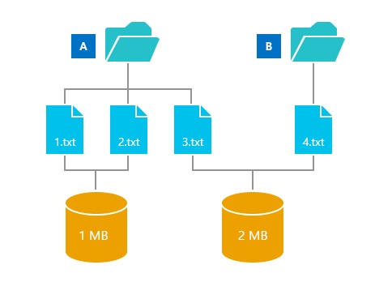

# 管理组件存储

"为什么是 WinSxS 很大？" 已由多个 Windows 用户要求。 虽然这个问题已经在博客文章中讨论此主题进入一些详细信息组件存储 （特别是 WinSxS 文件夹） 的概念，然后提供突出显示的方法来更好地管理 WinSxS 文件夹的大小的主题的链接。

简短的答案是 WinSxS 文件夹不大可能会出现第一次看到由于大小的计算可以包括 Windows 二进制文件位于其他位置，这使得 WinSxS 文件夹看起来比实际更大。

## Windows 组件存储和 WinSxS 文件夹

WinSxS 文件夹位于 Windows 文件夹中，例如**c:\\Windows\\WinSxS**。 它是为 Windows 组件存储文件的位置。 Windows 组件存储用于支持所需的自定义项和 Windows 更新的功能。 下面是如何使用的 Windows 组件存储文件的一些示例︰

-   使用 Windows 更新安装新组件版本。 这将保持系统安全并保持最新。

-   启用或禁用 Windows 功能。

-   添加角色或使用服务器管理器的功能。

-   不同的 Windows 版本之间的移动系统。

-   从损坏或引导故障系统恢复

-   卸载更新有问题

-   正在运行的程序使用的并行程序集

Windows 组件存储在 Windows XP 中以支持并行程序集问世。 开始在 Windows Vista 中，组件存储加强跟踪和服务所有组成操作系统的组件。 这些不同的操作系统组件跟踪对象，例如文件、 目录、 注册表项和服务。 为包然后收集在一起的组件的特定版本。 Windows 更新和 DISM 使用包来更新 Windows。 Windows 组件存储处理的组件和 Windows 安装中使用的包。 确定 Windows 组件存储区的大小是很复杂的事实，许多文件 Windows 使用从外部 Windows 组件存储使用一种称为*硬链接*的目录。 在这种情况下，从一个组件版本的文件显示 Windows 组件存储区内外。 使用*硬链接*，Windows 是能够显示不需要的多个副本添加的空间保持同一文件的多个副本。

## 硬链接

硬链接是文件系统对象，它允许两个文件，使其引用磁盘上的同一位置。 这意味着相同的数据可以引用多个文件，并在一个文件中的数据更改会反映在其他文件中。 这使复杂化目录大小的概念，如可以使用下面的示例所示︰

1.  目录有三个文件︰ 1.txt、 2.txt 和 3.txt

2.  目录 B 有一个文件︰ 4.txt

3.  文件 1.txt 和 2.txt 硬链接在一起，并且包含 1 MB 的数据。

4.  3.txt 文件 4.txt 也硬链接在一起，和 2 兆字节的数据。

在此示例中，您可以看到硬链接，使多个文件来指代一组相同的数据。

现在的目录的大小是什么？

答案取决于您计划如何处理目录答︰

1.  如果您读取目录中的文件读取的所有文件的大小会是每个文件大小的总和。 在此示例中，这将是 4 MB。

2.  如果复制所有文件从一个目录到新位置，然后复制的数据量是从文件链接的所有硬盘的数据总和。 在此示例中，这将是 3 MB。

3.  如果您试图删除目录 A 的释放空间，您将只能看到减少大小的文件的硬链接只能由目录 a。在此示例中，这都可达到节约了 1 MB。

Windows 组件存储区和专门 WinSxS 文件夹使用回多少空间的问题。 在示例中，该目录中的第三个答案最接近使用多少额外的空间。 因此他们不应进行计数，和文件硬链接到组件存储在多个场所应该只有计数的磁盘上存储的大小，文件硬链接到系统的其余部分所需的系统操作。

## 管理 Windows 组件存储

Windows 8.1 和 Windows Server 2012 R2 中的新功能可用于管理 Windows 组件存储︰

[确定 WinSxS 文件夹的实际大小](determine-the-actual-size-of-the-winsxs-folder.md)

[清理 WinSxS 文件夹](clean-up-the-winsxs-folder.md)

[减少脱机 Windows 映像中的组件存储区的大小](reduce-the-size-of-the-component-store-in-an-offline-windows-image.md)

## 相关的主题

[我的共享空间在哪里？（日志）](http://blogs.technet.com/b/askcore/archive/2013/03/01/where-did-my-space-go.aspx)

[更多的硬链接](http://blogs.technet.com/b/joscon/archive/2011/08/26/more-on-hard-links.aspx)

[NTFS 图元文件博客张贴内容](http://blogs.technet.com/b/askcore/archive/2009/12/30/ntfs-metafiles.aspx)

[如何创建和操作 NTFS 联结点](http://support.microsoft.com/kb/205524)

 

 

