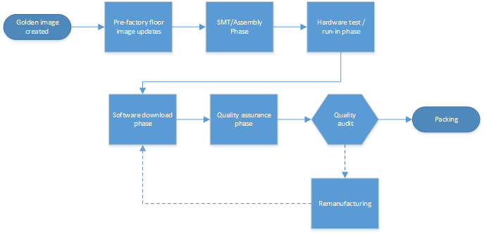
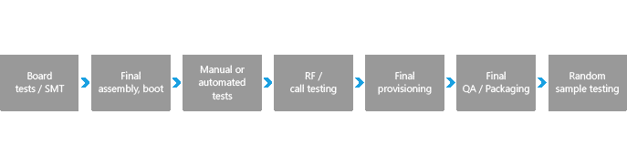
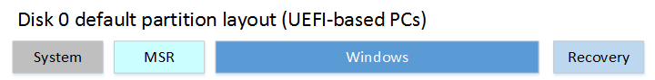
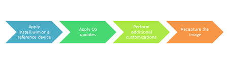

# <a name="manufacturing-windows-engineering-guide-weg"></a>Windows 工程指南 (WEG) 制造

制造 WEG 提供原始设备制造商 (OEM) 和理想的制造过程路线图的 ODM 合作伙伴对于 Windows 10 设备，使用指南的潜在缺陷和优化过程的机会。 

## <a name="manufacturing-overview"></a>生产概览

影响可制造的许多决策进行新的设备，工程努力在早期因此应仔细考虑以确保最低的开销生产过程处于选中状态。 制造车间上花费每一额外分钟等同以最终产品支付额外费用。 制造的 WEG 旨在提供 OEM 和 ODM 合作伙伴提供理想的制造过程的软件和硬件一起在工厂车间的路线图。 此 WEG 还提供了简化的流程和指南如何规划并避免常见的问题的机会。 我们制造和部署的建议旨在帮助您︰ 

- 优化图像占用的磁盘空间在桌面上
- 启用 Windows 部署到台式机上的小容量磁盘上
- 缩短映像部署时间
- 简化了图像处理
- 简化了台式计算机上的 OEM 激活 (OA3) 注入/报告进程。 移动设备不需要激活。
- 测试和校准装配线上的设备
- 支持其他主要方案，构建强大的设备

对于本文档，桌面制造过程的一个泛型版本如下所示︰



移动设备的制造过程如下所示︰



不应制造 WEG [Windows 最低硬件要求](https://msdn.microsoft.com/library/windows/hardware/dn915086.aspx)或 OEM 策略文档 (OPD) 通信。 WHCR 和 OPD 文档优先于制造 WEG 中的任何信息。 您必须遵守 WHCR 和 OPD。

## <a name="overall-considerations"></a>总体考虑

### <a name="manufacturing-path"></a>制造业的路径

有两种常规制造方法，您可以根据您的业务 — — 股票 (BTS) 和生成为订单生产 (BTO) 生成。 当您查看本文档中的指导原则，考虑要在每一阶段优先投资并保存尽可能多的时间，尽可能为您自定义的过程设备的生产路径。 

使用桌面设备的演练，请参阅我们的[制造端到端的实验室](http://go.microsoft.com/fwlink/p/?LinkId=526101)。

对于移动设备，您必须使用 BTS 制造路径。

### <a name="build-to-order-bto"></a>按订单 (生产 BTO)

生产 BTO 设备开始基本图像，然后在制造过程中会收到其自定义设置的大多数。

主要的优点是灵活的软件清单资料，从而为后期发生了更改。 缺点包括一个更复杂的图像创建和制造工艺，更长时间的工厂车间和不断增长的图像大小。 

### <a name="build-to-stock-bts"></a>生成库存 (BTS)

BTS 设备已在实验室中几乎完全自定义的图像。 BTS 进程容易规划和生成，更快地在工厂地板上，具有较高的质量控制，并具有控制的磁盘的大小。 BTS 设备仍然需要，以便最晚在工厂车间的重大更改。 用于桌面版本的 Windows 10 中，许多这些更改可以使用脱机服务。

### <a name="push-button-reset"></a>依靠以点击方式重置

依靠以点击方式重置工具不再需要一个单独的分区上的单独的完整系统恢复映像。 这样可以节省几千兆字节的空间。 当用户需要时刷新或重置该设备时，他们将能够保留其安装 Windows 更新，而不是下载和安装它们再见。 他们将保持所有您所提供的自定义项。 

新的分区布局类似于 Windows 8.1 从传统分区布局、 除 Windows RE 分区现在被移动到的驱动器，结尾，不再需要一个单独的完整系统恢复分区。



有关详细信息，请参见[按钮重置](push-button-reset-overview.md)

依靠以点击方式重置移动设备上不受支持。 相反，您应执行出厂重置。

### <a name="compact-os"></a>精简的操作系统

您可以现在运行整个操作系统，包括预加载的 Windows 桌面应用程序，使用压缩的文件，通过使用精简的操作系统和单实例存储功能。 这些功能替换 Windows 8.1 更新 1，WIM 引导功能，并有助于随着时间的推移维护更小的磁盘空间。 

尽管紧凑操作系统支持为所有的设备，我们建议由于旋转驱动器的速度较慢的性能只能在固态驱动器，具有设备上使用精简的操作系统。 

有关详细信息，请参阅[袖珍 OS，单实例存储和图像优化](compact-os.md)。

精简的操作系统在移动设备上不受支持。

### <a name="provisioning-packages"></a>配置包

若要节省时间，同时构建映像，现在可以捕获并在映像部署期间通过使用设置文件包应用 Windows 的桌面应用程序。 这样可以节省耗时步骤的泛化和重新捕获整个图像，并允许您快速部署生产 BTO 设备。

### <a name="language-packs"></a>语言包

添加完整语言包，而不是通过添加桌面设备需要通过选择各个包的资源显示字符串、 手写输入、 语音和文字到语音功能来节省空间。 稍后，如果您的用户需要更多语言功能，Windows 可以包根据需要下载。 

语言和区域的 SKU 决策可以极大地影响占用的磁盘空间和图像创建系统的复杂性。 应格外小心，以限制的数量和类型的语言包中包含的每个图像。 

移动设备使用世界范围内的图像，使所有语言都包括在每个图像。

### <a name="driver-co-installers"></a>驱动程序辅助安装程序

驱动程序通常是磁盘空间需求量很小部分，但是，辅助安装程序或桌面设备附带的驱动程序的应用程序可以添加数百兆字节。 请仔细考虑是否设备需要伴随经典的 Windows 应用程序，才能充分发挥功能。

### <a name="hardware-components"></a>硬件组件

硬件方面的决定也会影响制造工艺。 除了对硬件的物理组件的难题，包含或排除某些设备可以使工厂过程更加困难。 对于将包含的示例中，如果触摸屏和传感器它们必须校准每个设备上。 如果排除设备如以太网端口，则无法使用 PXE 启动，这意味着额外的成本。

### <a name="antimalware-apps"></a>反恶意软件应用程序

**建议︰**配置设备以避免在第一签入过程中完全磁盘扫描。 请与您的反恶意软件供应商联系，以确定最佳做法来限制这种扫描工作。

我们所看到的几个实例反恶意软件工具在一个完整的磁盘扫描用户的第一个登录过程。 与发生在第一个登录的过程中，从而导致非常慢第一个登录、 降级的开始体验和系统性能缓慢的关键任务，扫描竞争。 

对于 Windows Defender，这可以通过将唯一标识符添加到您的图像配置。 若要了解详细信息，请参阅[配置受信任的图像标识符为 Windows Defender](http://go.microsoft.com/fwlink/?LinkId=532775)。

### <a name="windows-defender"></a>Windows Defender

## <a name="pre-factory-floor-image-updates"></a>预 factory 地面图像更新

黄金的图像通常传递给 ODM 从 OEM 生产开始之前。 这些图像几乎总是需要一些更新。 黄金映像更新时，您不必在每个设备上执行更新。 这导致更少的时间在每个设备的工厂，并提高质量。 

对图像的更新可以包括驱动程序、 Windows 更新、 软件、 OEM 的自定义项和应用程序软件包 (.appx)。

### <a name="considerations"></a>注意事项

如果您更新图像使用脱机服务，您将需要定期维护映像。 在工厂车间保存时应使物有所值。

### <a name="goals"></a>目标

减少每单位在工厂车间所用的时间并减少生产设备的金额的勘误表。

### <a name="implementation"></a>实现

在生产 BTO 系统中，一些可选的驱动程序和一些可选的应用程序可能需要在软件下载站，来容纳该设备上应用。 这些修改应最小化，以减少错误的可能性，并缩短制造时间。

### <a name="image-creation"></a>图像创建

在 OEM 图像实验室整体黄金桌面映像创建过程是类似于现有的过程。



以避免兼容性问题，请使用新版本的 Windows PE 映像创建实验室中的引用设备工作时。 


### <a name="region-specific-policy-for-skype-removal-on-desktop"></a>在台式机上的 Skype 删除特定于区域的策略

默认情况下，Windows 提供的应用程序包含在所有 Windows 映像中。 除不能修改这些应用程序，明确规定在 Windows OEM 策略文档 (OPD) 的位置。

如果您需要删除收件箱 Skype 应用程序由于策略的要求，可以使用 DISM.exe 工具或 DISM Windows PowerShell cmdlet 来移除该应用程序。 有关此策略要求的详细信息，请参阅最新的 OEM 策略文档。 

在审核模式下删除 Windows PowerShell Skype 在线︰

```syntax
get-provisionedappxpackage -online | where-object {$_.displayname -eq "Microsoft.SkypeApp"} | Remove-ProvisionedAppxPackage -online
```

若要删除脱机 Windows PowerShell 与 Skype:

```syntax
get-provisionedappxpackage -path c:\mount | where-object {$_.displayname -eq "Microsoft.SkypeApp"} | Remove-ProvisionedAppxPackage
```

若要删除 Skype 使用 Dism.exe 脱机︰

1. 获取包的全名︰

    ```syntax
    Dism.exe /image:<Windows_volume> /get-provisionedappxpackages
    ```
2. 删除的软件包，使用<PackageName>Microsoft.SkypeApp 列表中︰

    ```syntax
    Dism.exe /image:<Windows_volume> /remove-provisionedappxpackage /PackageName:<PackageName>
    ```
    
我们建议使用 Windows 10 版的 Windows 预安装环境 (WinPE)。

注意︰ 如果您使用 Windows 8 版本的 WinPE，那么任何服务操作之后，必须更新的时间戳的文件;否则可能无法激活图像使用 OEM 激活 3.0 授权的方法。 此外，机箱中授权诊断工具，licensingdiag.exe，将报告该图像已被篡改。 

要解决此问题，，从 Windows 8 版本的 WinPE 运行任何服务操作之后，OEM 必须运行︰ 

```syntax
dir %windir%\System32\catroot\{F750E6C3-38EE-11D1-85E5-00C04FC295EE}
```

### <a name="language-pack-updates"></a>语言包更新

在安装新的语言之后, 您必须重新安装任何 APPX 捆绑和收件箱的 Windows 应用程序来支持新的语言。 否则，APPX 包不包括新的语言的支持。

### <a name="apps-in-audit-mode"></a>在审核模式下的应用程序

在安装新的语言之后, 您必须重新安装任何 APPX 捆绑和收件箱的 Windows 应用程序来支持新的语言。 否则，APPX 包不包括新的语言的支持。

若要禁用应用程序准备服务处于脱机状态︰

1.  创建在 HKLM\Software\Microsoft\Windows\CurrentVersion\AppReadiness DisableInAuditMode 设置为的值为 1 的.reg 文件。
2.  将 Windows 映像进行安装。 例如︰
    
    ```syntax
    Dism /Mount-Image /ImageFile:"C:\Images\ModelSpecificImage.wim" /Name:"Fabrikam" /MountDir:"C:\mount\windows" /Optimize
    ```
    
3.  加载注册表配置单元。 例如︰
    
    ```syntax
    reg load hklm\LoadedHive C:\mount\Windows\System32\config\SYSTEM
    ```
    
4.  添加注册表值。 例如，使用 USB 棒的.reg 文件︰
    
    ```syntax
    regedit /s e:\registry\regFile.reg
    ```
    
5.  卸载该配置单元。

    ```syntax
    reg unload hklm\LoadedHive
    ```
    
6.  卸载 Windows 映像，提交更改。 例如︰

    ```syntax
    Dism /Unmount-Image /MountDir:"C:\mount\windows" /Commit
    ```
    
建议您在进入审核模式之前禁用服务处于脱机状态。 但是，您还可以在审核模式下禁用联机。 禁用此服务后，必须对图像进行一般化。
若要禁用应用程序准备服务︰

1. 在审核模式下，启动`regedit`。
2. 定位到 HKLM\Software\Microsoft\Windows\CurrentVersion\AppReadiness DisableInAuditMode。 
3. 项的值设置为 1。

在继续操作之前一般化运行的 Sysprep。

## <a name="smt-assembly-phase"></a>SMT / 汇编阶段

设备需要校准最佳的客户体验，并通过 Windows 硬件实验室工具包测试。

### <a name="implementation"></a>实现

- 校正
    - 传感器
    - 触摸板
    - 触摸屏
    - RF
    - 照相机

设置为 UTC 时间，下面详细说明的 ACPI 更改生效。

## <a name="hardware-test-and-run-in-phase"></a>硬件测试和接排阶段

我们建议在完整版本的 Windows 上进行测试。 这样可以测试最终的硬件软件交互，因为用户将会看到它们。

### <a name="considerations"></a>注意事项

使用完整版本的 Windows，则将传送具有允许最终用户将会看到完全相同的环境中测试和验证。 Windows PE 不是受支持的操作系统的测试 – 它旨在仅用作部署车辆。

### <a name="goals"></a>目标

提供了可能，同时使制造时间保持在绝对最小最高质量的产品。

### <a name="implementation"></a>实现

可以通过多种方式处理测试操作系统的安装。 由于操作系统的测试更少改动不是装运 OS 映像可以布局磁盘上任何时候，这样可以减少的时间花费在工厂车间应用映像。 选项包括无预刷从 ihv 的网站，或在网站上使用磁盘复制的图像。

**重要提示**︰ 禁用 TPM （可信平台模块） 自动资源调配时引导到测试操作系统以确保这两个较好的性能，并确保用户的操作系统具有所有权的模块。 若要在 Windows 中执行此操作，您需要设置以下注册表项︰ 

```syntax
[HKLM\System\CurrentControlSet\Services\Tpm\WMI\NoAutoProvision] (REG_DWORD) to 1
[HKEY_LOCAL_MACHINE\SYSTEM\CurrentControlSet\Services\TPM\WMI]
"NoAutoProvision"=dword:00000001
```

## <a name="software-download-phase"></a>软件下载阶段

### <a name="considerations"></a>注意事项

应格外小心，尽量减少在这一阶段上花费的时间量。 虽然一些较长的工期是不可避免的 （如生产 BTO 自定义项），我们鼓励合作伙伴与优点，尽可能多地简化次成本计算。 

### <a name="goals"></a>目标

创建一个有效和有弹性成像系统开销很少。 将任意数量的步骤尽可能移前工厂平面布置图像更新。 

### <a name="implementation"></a>实现

1. 启动到 WinPE 机。 若要部署精简的操作系统，您需要使用 Windows 10 版本的 WinPE。 在您能够启动 WinPE 多种方式︰

    - 使用 PXE
    - 使用 USB 棒
    - 在硬盘上预安装 WinPE 
    
2. 创建使用 diskpart 硬盘的分区结构。 

    ```syntax
    diskpart /s F:\CreatePartitions-UEFI.txt
    ```
    
    有关详细信息，请参阅[基于 UEFI/GPT 的硬盘分区](configure-uefigpt-based-hard-drive-partitions.md)
    
3. 适用于 Windows 分区使用 DISM 创建的图像。 

    ```syntax
    ApplyImage F:\Images\ThinImage.wim
    ```
    
    有关详细信息，请参阅[捕获和应用 Windows、 系统和恢复分区](capture-and-apply-windows-system-and-recovery-partitions.md)。
    
    可选︰ 使用单独的 USB 闪存驱动器上的恢复映像相同的图像。 不再需要源于授权复制商此 USB 磁盘。 有关更多信息，请参阅[创建媒体运行按钮重置功能](create-media-to-run-push-button-reset-features-s14.md)。

4.  引导到审核模式下的设备。

    - 进行任何最终图像的修改。 这是由许多生产 BTO 修改。
    - 如果 APPX 应用程序添加其他语言包之前安装，重新安装应用程序，因此它们可以支持新的语言。 这包括收件箱的应用程序。 
    - Microsoft 强烈建议，Oem 运行 DISM /StartComponentCleanup 与 /resetbase 标记，以获得更多的可用磁盘空间。
    - 确保在.NET Framework 应用程序通过运行以下命令来编译
        
        ```syntax
        C:\Windows\Microsoft.NET\Framework\v4.0.30319\ngen.exe update /queue
        C:\Windows\Microsoft.NET\Framework\v4.0.30319\ngen.exe eqi
        ```
        
        在 64 位计算机上的 64 位 CLR 执行相同︰

        ```syntax
        C:\Windows\Microsoft.NET\Framework64\v4.0.30319\ngen.exe update /queue
        C:\Windows\Microsoft.NET\Framework64\v4.0.30319\ngen.exe eqi
        ```
        
    - 创建使用 OAtool.exe OA3 计算机生成报告 (CBR)、 密钥注入固件，并验证了资源调配。
    - 如果您使用 Windows 预安装环境 (WinPE) 5.x 中，修复时间戳。 （此步骤没有必要如果使用 WinPE 的 Windows 10）。

        ```syntax
        dir %windir%\System32\catroot\{F750E6C3-38EE-11D1-85E5-00C04FC295EE}
        ``` 
        
    - 运行 Sysprep /oobe 为最终用户准备系统。
    - 启用安全启动 （如果实现）。
 
## <a name="quality-assurance-phase"></a>质量保证阶段

质量保证应样本的整个生产运行，以确保成功安装所有自定义项的计算机上运行。 QA 本轮也应该用于验证 OA3 实现。

### <a name="considerations"></a>注意事项

一旦系统已完成 OOBE 为此问答阶段，它将需要重置以确保最终用户体验非常好。 

### <a name="goals"></a>目标

确保良好的客户体验并降低所用的时间的重建机器。

### <a name="implementation"></a>实现

设备应回到生产线，为重新映像。

## <a name="remanufacturing"></a>Remanufacturing

一旦该设备已通过 OOBE （出于任何原因） 需要最先设备。 在工厂，可以简单地添加设备软件下载站拖回到后 （如果装备） 已清除 TPM。 

如果设备需要提供服务，在字段中的第三方，则应使用重置按钮。 这将保证计算机将返回到完整的出厂配置时仍易于执行。 

### <a name="considerations"></a>注意事项

虽然 PBR 有 remanufacturing 的工厂所需的所有功能，它不提供脚本操作的能力，并不提供者需要在大规模生产的自动化所需的可操作的错误代码。

### <a name="goals"></a>目标

确保良好的客户体验，同时保护用户数据。

### <a name="implementation"></a>实现

若要清除 TPM，请使用以下命令︰

```syntax
$Tpm = Get-WmiObject -class Win32_Tpm -namespace "root\CIMv2\Security\MicrosoftTpm"
$Tpm.SetPhysicalPresenceRequest(22)
```

若要使用 Windows PE，您将需要使用的自定义的 Windows PE 映像︰

- Ftpm 的 SOC 特定驱动程序。
- 可选组件︰ SecureStartup、 WMI、 PowerShell 和.NET Framework。

## <a name="manufacturing-checklist"></a>制造的核对清单

### <a name="windows-10-manufacturing-task-timeline"></a>Windows 10 制造任务时序表

您可以使用此核对清单计划制造任务。

<table width="97%">
<thead>
<tr>
<td>
<p><strong>任务</strong></p>
</td>
<td>
<p><strong>Pre-EV 阶段</strong></p>
</td>
<td>
<p><strong>EV 阶段</strong></p>
</td>
<td>
<p><strong>DV 阶段</strong></p>
</td>
<td>
<p><strong>PV 阶段</strong></p>
</td>
</tr>
</thead>
<tbody>
<tr>
<td>
<p><strong>系统必备组件的制造工作︰</strong></p>
</td>
<td>
<p><strong>Pre-EV</strong></p>
</td>
<td>
<p><strong>EV</strong></p>
</td>
<td>
<p><strong>DV</strong></p>
</td>
<td>
<p><strong>PV</strong></p>
</td>
</tr>
<tr>
<td>
<p>ODM 选择吗？</p>
</td>
<td></td>
<td>
<p>-</p>
</td>
<td>
<p>-</p>
</td>
<td>
<p>-</p>
</td>
</tr>
<tr>
<td>
<p>OEM 访问 Windows&nbsp;10？</p>
</td>
<td></td>
<td>
<p>-</p>
</td>
<td>
<p>-</p>
</td>
<td>
<p>-</p>
</td>
</tr>
<tr>
<td>
<p>ODM 访问 Windows&nbsp;10？</p>
</td>
<td></td>
<td>
<p>-</p>
</td>
<td>
<p>-</p>
</td>
<td>
<p>-</p>
</td>
</tr>
<tr>
<td>
<p>OEM 制造 WEG 权？</p>
</td>
<td></td>
<td>
<p>-</p>
</td>
<td>
<p>-</p>
</td>
<td>
<p>-</p>
</td>
</tr>
<tr>
<td>
<p>ODM 制造 WEG 权？</p>
</td>
<td></td>
<td>
<p>-</p>
</td>
<td>
<p>-</p>
</td>
<td>
<p>-</p>
</td>
</tr>
<tr>
<td>
<p>ODM 点的标识联系人吗？</p>
</td>
<td></td>
<td>
<p>-</p>
</td>
<td>
<p>-</p>
</td>
<td>
<p>-</p>
</td>
</tr>
<tr>
<td>
<p>OEM 点的标识联系人吗？</p>
</td>
<td></td>
<td>
<p>-</p>
</td>
<td>
<p>-</p>
</td>
<td>
<p>-</p>
</td>
</tr>
<tr>
<td>
<p>ODM 开球？</p>
</td>
<td></td>
<td>
<p>-</p>
</td>
<td>
<p>-</p>
</td>
<td>
<p>-</p>
</td>
</tr>
<tr>
<td>
<p>OEM 开球？</p>
</td>
<td></td>
<td>
<p>-</p>
</td>
<td>
<p>-</p>
</td>
<td>
<p>-</p>
</td>
</tr>
<tr>
<td>
<p>正则制造通话吗？</p>
</td>
<td>
<p>-</p>
</td>
<td></td>
<td>
<p>-</p>
</td>
<td>
<p>-</p>
</td>
</tr>
<tr>
<td>
<p><strong>部署︰</strong></p>
</td>
<td>
<p><strong>Pre-EV</strong></p>
</td>
<td>
<p><strong>EV</strong></p>
</td>
<td>
<p><strong>DV</strong></p>
</td>
<td>
<p><strong>PV</strong></p>
</td>
</tr>
<tr>
<td>
<p>OEM 了解部署概念</p>
</td>
<td></td>
<td>
<p>-</p>
</td>
<td>
<p>-</p>
</td>
<td>
<p>-</p>
</td>
</tr>
<tr>
<td>
<p>ODM 了解部署概念</p>
</td>
<td></td>
<td>
<p>-</p>
</td>
<td>
<p>-</p>
</td>
<td>
<p>-</p>
</td>
</tr>
<tr>
<td>
<p>使用 Windows&nbsp;10 DISM</p>
</td>
<td>
<p>-</p>
</td>
<td></td>
<td>
<p>-</p>
</td>
<td>
<p>-</p>
</td>
</tr>
<tr>
<td>
<p>使用 Windows&nbsp;10 Windows PE</p>
</td>
<td>
<p>-</p>
</td>
<td></td>
<td>
<p>-</p>
</td>
<td>
<p>-</p>
</td>
</tr>
<tr>
<td>
<p>通过 DISM 应用的扩展的属性</p>
</td>
<td>
<p>-</p>
</td>
<td></td>
<td>
<p>-</p>
</td>
<td>
<p>-</p>
</td>
</tr>
<tr>
<td>
<p>WinSxS 检查正在运行？ / AnalyzeComponentStore</p>
</td>
<td>
<p>-</p>
</td>
<td></td>
<td>
<p>-</p>
</td>
<td>
<p>-</p>
</td>
</tr>
<tr>
<td>
<p>清理的图像？ (DISM /Cleanup-Image /StartComponentCleanup /ResetBase)</p>
</td>
<td>
<p>-</p>
</td>
<td></td>
<td>
<p>-</p>
</td>
<td>
<p>-</p>
</td>
</tr>
<tr>
<td>
<p>依靠以点击方式重置</p>
</td>
<td>
<p><strong>Pre-EV</strong></p>
</td>
<td>
<p><strong>EV</strong></p>
</td>
<td>
<p><strong>DV</strong></p>
</td>
<td>
<p><strong>PV</strong></p>
</td>
</tr>
<tr>
<td>
<p>OEM 了解点击式重新设置概念</p>
</td>
<td>
<p>-</p>
</td>
<td></td>
<td>
<p>-</p>
</td>
<td>
<p>-</p>
</td>
</tr>
<tr>
<td>
<p>ODM 了解点击式重新设置概念</p>
</td>
<td>
<p>-</p>
</td>
<td></td>
<td>
<p>-</p>
</td>
<td>
<p>-</p>
</td>
</tr>
<tr>
<td>
<p>用于 Windows RE 和按钮重置的建议的分区布局吗？</p>
</td>
<td>
<p>-</p>
</td>
<td>
<p>-</p>
</td>
<td></td>
<td>
<p>-</p>
</td>
</tr>
<tr>
<td>
<p>如果使用非标准的分区布局，则为配置裸机恢复吗？</p>
</td>
<td>
<p>-</p>
</td>
<td>
<p>-</p>
</td>
<td></td>
<td>
<p>-</p>
</td>
</tr>
<tr>
<td>
<p>恢复图像 ACL 设置是否正确？</p>
</td>
<td>
<p>-</p>
</td>
<td>
<p>-</p>
</td>
<td></td>
<td>
<p>-</p>
</td>
</tr>
<tr>
<td>
<p>刷新/重新启动时间是否符合标准？</p>
</td>
<td>
<p>-</p>
</td>
<td>
<p>-</p>
</td>
<td>
<p>-</p>
</td>
<td></td>
</tr>
<tr>
<td>
<p><strong>Windows RE:</strong></p>
</td>
<td>
<p><strong>Pre-EV</strong></p>
</td>
<td>
<p><strong>EV</strong></p>
</td>
<td>
<p><strong>DV</strong></p>
</td>
<td>
<p><strong>PV</strong></p>
</td>
</tr>
<tr>
<td>
<p>OEM 了解 Windows RE 概念</p>
</td>
<td>
<p>-</p>
</td>
<td></td>
<td>
<p>-</p>
</td>
<td>
<p>-</p>
</td>
</tr>
<tr>
<td>
<p>ODM 了解 Windows RE 概念</p>
</td>
<td>
<p>-</p>
</td>
<td></td>
<td>
<p>-</p>
</td>
<td>
<p>-</p>
</td>
</tr>
<tr>
<td>
<p>已启用 Windows RE</p>
</td>
<td>
<p>-</p>
</td>
<td>
<p>-</p>
</td>
<td></td>
<td>
<p>-</p>
</td>
</tr>
<tr>
<td>
<p>Windows RE 位置正确</p>
</td>
<td>
<p>-</p>
</td>
<td>
<p>-</p>
</td>
<td></td>
<td>
<p>-</p>
</td>
</tr>
<tr>
<td>
<p>Windows RE 的 BCD GUID 与在 Reagent.xml 中的 Windows RE GUID 条目相匹配</p>
</td>
<td>
<p>-</p>
</td>
<td>
<p>-</p>
</td>
<td></td>
<td>
<p>-</p>
</td>
</tr>
<tr>
<td>
<p>图像索引正确</p>
</td>
<td>
<p>-</p>
</td>
<td>
<p>-</p>
</td>
<td></td>
<td>
<p>-</p>
</td>
</tr>
<tr>
<td>
<p><strong>制造︰</strong></p>
</td>
<td>
<p><strong>Pre-EV</strong></p>
</td>
<td>
<p><strong>EV</strong></p>
</td>
<td>
<p><strong>DV</strong></p>
</td>
<td>
<p><strong>PV</strong></p>
</td>
</tr>
<tr>
<td>
<p>Windows RE 分区大小 (MB) 和所选的磁盘上的位置</p>
</td>
<td>
<p>-</p>
</td>
<td></td>
<td>
<p>-</p>
</td>
<td>
<p>-</p>
</td>
</tr>
<tr>
<td>
<p>测试分区使用全窗口</p>
</td>
<td>
<p>-</p>
</td>
<td>
<p>-</p>
</td>
<td></td>
<td>
<p>-</p>
</td>
</tr>
<tr>
<td>
<p>映像部署通过 [NIC] 或者 [消除]</p>
</td>
<td>
<p>-</p>
</td>
<td></td>
<td>
<p>-</p>
</td>
<td>
<p>-</p>
</td>
</tr>
<tr>
<td>
<p>OPM 关键资源调配计划完成？</p>
</td>
<td>
<p>-</p>
</td>
<td></td>
<td>
<p>-</p>
</td>
<td>
<p>-</p>
</td>
</tr>
<tr>
<td>
<p>每 SKU 的语言包</p>
</td>
<td>
<p>-</p>
</td>
<td>
<p>-</p>
</td>
<td></td>
<td>
<p>-</p>
</td>
</tr>
<tr>
<td>
<p><strong>安全启动︰</strong></p>
</td>
<td>
<p><strong>Pre-EV</strong></p>
</td>
<td>
<p><strong>EV</strong></p>
</td>
<td>
<p><strong>DV</strong></p>
</td>
<td>
<p><strong>PV</strong></p>
</td>
</tr>
<tr>
<td>
<p>OEM 了解安全概念</p>
</td>
<td></td>
<td>
<p>-</p>
</td>
<td>
<p>-</p>
</td>
<td>
<p>-</p>
</td>
</tr>
<tr>
<td>
<p>ODM 了解安全概念</p>
</td>
<td></td>
<td>
<p>-</p>
</td>
<td>
<p>-</p>
</td>
<td>
<p>-</p>
</td>
</tr>
<tr>
<td>
<p>经试制签名的安全引导过程？</p>
</td>
<td>
<p>-</p>
</td>
<td>
<p>-</p>
</td>
<td></td>
<td>
<p>-</p>
</td>
</tr>
<tr>
<td>
<p>水位线关闭？</p>
</td>
<td>
<p>-</p>
</td>
<td>
<p>-</p>
</td>
<td>
<p>-</p>
</td>
<td></td>
</tr>
<tr>
<td>
<p>从 IHV/ISV 签名的驱动程序？</p>
</td>
<td>
<p>-</p>
</td>
<td>
<p>-</p>
</td>
<td>
<p>-</p>
</td>
<td></td>
</tr>
<tr>
<td>
<p>由 Microsoft 签名的驱动程序？</p>
</td>
<td>
<p>-</p>
</td>
<td>
<p>-</p>
</td>
<td>
<p>-</p>
</td>
<td></td>
</tr>
<tr>
<td>
<p>重新制造过程完整 [工厂]</p>
</td>
<td>
<p>-</p>
</td>
<td>
<p>-</p>
</td>
<td></td>
<td>
<p>-</p>
</td>
</tr>
<tr>
<td>
<p>重新制造工艺完成 [现场服务]</p>
</td>
<td>
<p>-</p>
</td>
<td>
<p>-</p>
</td>
<td></td>
<td>
<p>-</p>
</td>
</tr>
<tr>
<td>
<p>安全启动和调试策略计划审查按英尺</p>
</td>
<td>
<p>-</p>
</td>
<td></td>
<td>-</td>
<td>
<p>-</p>
</td>
</tr>
<tr>
<td>
<p><strong>OA 3.0:</strong></p>
</td>
<td>
<p><strong>Pre-EV</strong></p>
</td>
<td>
<p><strong>EV</strong></p>
</td>
<td>
<p><strong>DV</strong></p>
</td>
<td>
<p><strong>PV</strong></p>
</td>
</tr>
<tr>
<td>
<p>使用已更新的 OA3tool.exe</p>
</td>
<td>
<p>-</p>
</td>
<td>
<p>-</p>
</td>
<td></td>
<td>
<p>-</p>
</td>
</tr>
<tr>
<td>
<p>验证脱机图像/键</p>
</td>
<td>
<p>-</p>
</td>
<td>
<p>-</p>
</td>
<td></td>
<td>
<p>-</p>
</td>
</tr>
<tr>
<td>
<p>在完成注入`[Windows PE][Windows]`</p><p>请参阅 OEM 激活 3.0 节。</p>
</td>
<td>
<p>-</p>
</td>
<td>
<p>-</p>
</td>
<td></td>
<td>
<p>-</p>
</td>
</tr>
</tbody>
</table>

## <a name="appendix"></a>附录

### <a name="small-disk-footprint-optimization"></a>小的磁盘占用量优化

将包含 Windows 10 x86 办公室和 2 GB 的 RAM 基本磁盘占地面积︰ 

<table width="97%">
<tbody>
<tr>
<td>
<p>窗口 （w/办公室）、 页面文件、 后，交换文件和两个语言包</p>
</td>
<td>
<p>11.7 GB</p>
</td>
</tr>
<tr>
<td>
<p>WinRE</p>
</td>
<td>
<p>500 MB</p>
</td>
</tr>
<tr>
<td>
<p>系统磁盘分区 （MSR，ESP）</p>
</td>
<td>
<p>428 MB</p>
</td>
</tr>
<tr>
<td>
<p>总计</p>
</td>
<td>
<p>~ 23 GB</p>
</td>
</tr>
<tr>
<td>
<p>对于 OEM 自定义项 32 GB (29 GB 可用容量) 设备上的可用空间</p>
</td>
<td>
<p>大约 6 GB</p>
</td>
</tr>
</tbody>
</table>

假设︰

- 使用 GetDiskFreeSpaceEx() 计算所占用的磁盘空间 
- 在操作系统安装过程中之前 NGEN 运行之前空闲任务, 后立即收集数据。 
- 测量包括页面文件
- Windows 更新被禁用
- 生成包含多个运行;本报告中使用是最大的占地面积
- 驱动器容量会转换为二进制大小︰ 32 GB 32,000,000,000 字节 = = = = 30518MiB （或 29GiB）。

### <a name="language-packs"></a>语言包

语言包包含一些 OEM 是些最大磁盘空间增加。 包括所有可选组件使用的语言可以估计为 275 MB （大小可变根据的语言） 虽然 Office 语言包可以估计在 300 MB （还取决于语言）。

最终用户在 OOBE 期间选择主要语言之后，Windows 将裁切未使用的语言包。 正在删除它们后，这些语言不能通过点击式重置。

为了保持较小的磁盘空间，请考虑减少每个装运 SKU 上安装的语言。 

### <a name="servicing"></a>提供服务

添加 Windows 更新知识库包会显著地增加磁盘的大小。 若要添加更新后减少图像的足迹︰

1.  安装 KB，如果系统提示您重新启动
2.  从提升的命令提示符处，运行以下命令︰

    ```syntax
    dism.exe /online /cleanup-image /startcomponent
    ```
    
3.  重新启动设备。

### <a name="real-time-clock-rtc"></a>实时时钟 (RTC)

RTC 是存储和维护设备处于关闭状态时的系统时间的电池供电时间源。 ACPI 5.0 定义工作时间和警报设备抽象化的基础硬件设备维护平台时间。 在 Windows 中，即使在与传统的 CMOS 系统查询平台时基于 RTC 和 ACPI 时间和警报设备被设置的首选的方法。 ACPI 接口提供从获得或写入到 RTC 的时间值的时区偏差。 此额外信息地址的 CMOS 的这一长期问题现场的 RTC，不知道如何解释硬件时钟读取操作系统。

#### <a name="factory-floor-considerations"></a>工厂占地考虑事项

窗口查询以更新系统的 RTC 时间︰

- 没有时间同步服务是可用的。
- 计算机进入休眠 (S3) 或休眠 (S4) 电源状态。
- 启用内核调试器。 

Oem 通常为 Windows 7 所附带的设备设置 RTC 本地时间 (LT)。 Windows 7 以独占方式使用 CMOS 时接口获取 RTC 时间，这将被解释为 LT. 在 Windows 8 中我们添加了支持 ACPI 时间和警报设备，但 Windows 8 还使用 CMOS RTC，如果它不可用，并且将作为 LT.从它返回的时间 这种现象 （与 CMOS RTC 接口） 是与大多数非 Windows 操作系统不兼容。 同样，类似 Azure 托管提供程序需要使用其虚拟化硬件 UTC 时间，简化管理和迁移的可能有多个不同时区的来宾。 

为解决这些问题，将从使用 CMOS RTC 接口，主要依赖于 ACPI 时间和警报设备转换 Microsoft。 

原始设备制造商的准则是︰

- 实现 ACPI 时间和警报设备。
- 设置"CMOS RTC 不存在"的标志在固定 ACPI 说明表 (FADT)。 底层硬件仍可 CMOS 备有 RTC，不过，Windows 将仅使用 ACPI 时间和警报设备如果设置了此标志。
- 不建议平台固件更新 RTC 跨夏边界。 如果是这样，但是，需要确保始终可以加上的时间值，即 UTC 的时区偏差计算协调通用时间 (UTC) 的固件 = LT + TZ。 Windows 将忽略来自 _GRT 控制方法的 DST 字段。 
- 如果 RTC 时间不断更新通过 CMOS RTC 接口，通过固件使 TZ （设置为 0x7FF）。 

### <a name="ensuring-a-good-first-sign-in-experience"></a>确保良好第一个登录体验

Windows 团队已经看到大量的阻塞性能良好的 Windows 中，用户的第一个经验问题，为您的客户准备 OS 映像时，以下指南应解决常见的问题。 

#### <a name="antimalware-tools-scanning-disk-during-first-sign-in"></a>在第一个登录期间扫描磁盘的反恶意软件工具

我们所看到的几个实例反恶意软件工具在一个完整的磁盘扫描用户的第一个登录过程。 与发生在第一个登录的过程中，从而导致非常慢第一个登录、 降级的开始体验和系统性能缓慢的关键任务，扫描竞争。 

**建议**︰ 应将设备配置为避免第一签入过程中完全磁盘扫描。 应按照防病毒供应商提供的 AV 解决方案的特定指导。 

#### <a name="windows-defender"></a>Windows Defender

将唯一标识符添加到您的图像以防止 Windows Defender 重新扫描所有您提供原始磁盘映像中的文件。 若要了解详细信息，请参阅[配置受信任的图像标识符为 Windows Defender](http://go.microsoft.com/fwlink/?LinkId=532775)。

#### <a name="running-ngen-commands"></a>运行 NGEN 命令

本机映像生成本机映像 （平台特定的可执行文件） 到是.NET 框架中的 MSIL （虚拟机代码） 编译的任务。 通常可由多个数量级提高 CLR 应用程序启动时间。 更多详细信息，请参阅[性能好处的 NGen](http://go.microsoft.com/fwlink/?LinkId=532790) 。 

**建议**︰ 按照这些说明来确保.NET Framework 应用程序进行编译。 请安装的所有操作系统更新后，运行以下命令︰ 

在 32 位 x86 或 ARM 设备︰

```syntax
C:\Windows\Microsoft.NET\Framework\v4.0.30319\ngen.exe update /queue
C:\Windows\Microsoft.NET\Framework\v4.0.30319\ngen.exe eqi
```

在 64 位的设备，这两个版本的.NET framework 中执行此操作︰

```syntax
C:\Windows\Microsoft.NET\Framework\v4.0.30319\ngen.exe update /queue
C:\Windows\Microsoft.NET\Framework\v4.0.30319\ngen.exe eqi
C:\Windows\Microsoft.NET\Framework64\v4.0.30319\ngen.exe update /queue
C:\Windows\Microsoft.NET\Framework64\v4.0.30319\ngen.exe eqi
```

#### <a name="graphics-drivers"></a>图形驱动程序

Windows 设备应随附的系统硬件正确 DirectX 图形驱动程序。 无法安装正确的驱动程序导致了回退到基于软件的图形驱动程序。 这会导致降级体验 Windows，包括第一号中性能下降。

**建议**︰ 安装在审核模式下您的硬件正确的图形驱动程序。

### <a name="frequently-asked-questions"></a>常见问题及的解答

#### <a name="windows-pe"></a>Windows PE

- **问题**︰ 我可以使用新的 WinPE 来部署、 维护和处理以前的 Windows 版本？

    **答案**︰ 对 WinPE 的更新不会影响当前受支持的 Windows 版本。 更新后的 WinPE 可用于部署包括 Windows 7 的以前的 Windows 版本。

-   **问题**︰ 是否需要迁移到新的部署工具作为 Windows 10 的一部分？

    **答案**︰ 不。 您只需更新到新版本的部署工具 （WinPE，DISM），如果想要实现精简的操作系统。

- **问题**︰ 磁盘空间优化如何影响我的 PXE 环境？

    **答案**︰ 您只需更新到新版本的部署工具 （WinPE，DISM） PXE 环境，是否在执行"应用"在 PXE 环境中。 如果只能执行一个下载 （将文件副本从服务器到客户端），您不需要更新 PXE 环境。

#### <a name="push-button-recovery-pbr-and-windows-recovery-environment-winre"></a>依靠以点击方式恢复 (PBR) 和 Windows 恢复环境 (WinRE)

- **问题**︰ 您还可以通过将 WinRE 吗？

    **答案**︰ 是的需要新的 WinRE.wim。
    
- **问题**︰ 用户仍然可以创建 PBR USB 钥匙吗？

    **答案**︰ 是的。 如果使用默认的分区布局，再没有其他设置需要 OEM 要启用此功能。

#### <a name="storage"></a>Storage

- **问题**︰ 请不要只支持固态磁盘？

    **答案**︰ 不，我们现在支持固态和传统旋转介质。 我们建议，单实例存储仅可用于固态磁盘，由于性能问题。

- **问题**︰ 使用单实例存储的资源调配上的双磁盘配置 （HDD + SSD） 包吗？

    **答案**︰ 只能在同一个磁盘上实现单实例存储。
    
#### <a name="disk-footprint"></a>占用的磁盘空间

- **问题**︰ 如何删除用户不会在 OOBE 期间选择的语言包？

    **答案**︰ 语言包删除的设备和按钮恢复操作期间将不再可用。
    
- **问题**︰ 如何在计算磁盘大小？ 例如，您报告 14.8 GB 磁盘大小 16 GB 磁盘上。

    **答案**︰ 磁盘容量将被转换为二进制。 例如，16,000,000,000 （几十亿美元字节为单位） 等于 ~14.8 GB。

- **问题**︰ 我只能使用精简的操作系统在小型设备，如具有 1 GB RAM 和 16 GB 磁盘上吗？

    **答案**︰ 精简的操作系统可以应用于任何 32 位或 64 位平台上用 > = 16GB 的固态存储。

- **问题**︰ 您是否建议在 64 位平台上运行 64 位 Windows 中使用 16 GB 的磁盘？

    **答案**︰ 建议 64 位 windows 32 GB 的容量小。 

#### <a name="imaging-and-deployment"></a>映像和部署

- **问题**︰ 什么是支持精简的操作系统使用 DISM 命令的更改？

    **答案**︰ 可以使用 DISM /Apply-Image... /Compact 和 /Apply-CustomDataImage。 有关详细信息，请参阅[DISM 图像管理命令行选项](http://go.microsoft.com/fwlink/?LinkId=532791)。

- **问题**︰ 精简的操作系统是否支持 GPT 和 MBR 分区布局？

    **答案**︰ 是的。

- **问题**︰ 是使用 Windows 10 所需更新的 OA3 工具吗？
    
    **答案**︰ 是的。

- **问题**︰ 是否可以仍然使用 Windows SIM，无人参与的答案文件和设置 Windows 10？

    **答案**︰ 是的尽管某些设置可能已更改。 请参阅[更改从 Windows 8.1 和 Windows Server 2012 R2 的答案文件设置](http://go.microsoft.com/fwlink/?LinkId=532812)。

#### <a name="language-packs-and-apps"></a>语言包和应用程序

- **问题**︰ 我们是否可以使用多个语言包？

    **答案**︰ 是的但是，我们强烈建议您每个图像验证语言 （窗口、 办公室、 驱动程序和应用程序） 的数目的磁盘占用量影响。 

- **问题**︰ 有没有安装语言包的方式的变化吗？

    **答案**︰ 是的您将应用基 lp.cab 以相同的方式就像之前要使多个用户界面选项，但能够输入文本或获取支持，您将需要添加可选语言组件。 有关详细信息，请参阅[将语言包添加到 Windows](http://go.microsoft.com/fwlink/?LinkId=532792)。
    
- **问题**︰ 有没有我如何安装桌面或 Windows 应用商店应用程序中的更改？

    **答案**︰ 如何从 Windows 8.1 安装桌面或 Windows 应用商店应用程序中没有变化。

- **问题**︰ 什么是多语言配置的用户体验，或当用户添加其他语言包吗？

    **答案**︰ 语言包将继续使用 Windows 的以前版本中相同的方式。
    
- **问题**︰ 是否有与桌面应用程序的兼容性问题？

    **回答**︰ 下面列出的应用程序类型需要仔细验证。 
    
    - 整卷加密工具应加密 WIM 映像来限制对性能的影响。 这种工具应检查完整性的未加密的 WIM 以防止篡改。
    - 将系统文件写入任何工具可能会受到影响︰
        - 图像处理应用程序应该执行块级别备份和恢复的所有卷。
        - 不完整故障/恢复操作会导致系统无法启动。
        - 加密/后退-向上/磁盘碎片整理程序工具可能无意中使膨胀的系统文件。 

- **问题**︰ 是精简的操作系统也适用于 Windows Embedded 吗？

    **答案**︰ 紧凑操作系统的实现和功能设计，我们共享仅限于 Windows 10 （家庭、 专业版和企业） 的桌面版本。 但是，应与 Windows Embedded 代表联系，并询问其磁盘空间优化计划。

#### <a name="policy"></a>策略

- **问题**︰ 有没有对现有的 10 GB 可用磁盘空间策略要求更改？ 

    **答案**︰ 指更新 Windows 硬件兼容性要求。

#### <a name="servicing"></a>提供服务

- **问题**︰ 如何将升级工作特别是在恢复图像与磁盘空间优化上的吗？

    **答案**︰ 升级将继续工作。


