# 桌面版本的 Windows 10 的 OEM 部署

本指南介绍的指导方法来部署 Windows 10 版本 1511年使用经典的部署工具。 许多工具和 Windows 8.1 典型部署中使用的方法都适用于 Windows 10。 最大的变化是恢复过程中，Windows 10，使图像的恢复。  

本指南适用于 Oem，和桌面版 （家庭、 Pro、 企业和教育） 适用于 Windows 10。 IT 专业人员使用本指南应该事先了解 Windows 基本管理和故障排除。 有关什么是新 Windows 10 部署中的详细信息，请参阅[Windows 10 部署和工具](https://technet.microsoft.com/library/mt297512.aspx)。

最新版本，请参阅[Windows 10、 本指南的 1607年版本](oem-deployment-for-desktop-1607.md)。 

## 关于本手册

本指南的组织围绕三个硬件和软件配置。

| 硬件配置       | 1            | 1b           | 2            |
|------------------------------|--------------|--------------|--------------|
| 窗体因子                  | 小触 | 2--1       | 笔记本     |
| RAM                          | 1 GB         | 2 GB         | 4 GB         |
| 磁盘容量和类型       | 16 GB eMMC   | 32 GB eMMC   | 500 GB 的硬盘驱动器   |
| 显示大小                 | 8"           | 10"          | 14 英寸          |
| Windows 的 SKU                  | 核心         | 专业人员          | 核心         |
| 语言                  | EN-US        | EN-US，DE-DE | EN-US，DE-DE |
| Cortana                      | 是          | 是          | 是          |
| 收件箱的应用程序 （通用）       | 是          | 是          | 是          |
| 绘图笔                          | 否           | 是          | 否           |
| 办公室 （通用）           | 是          | 是          | 是          |
| Windows 桌面应用程序 | 否           | 是          | 是          |
| Office 2016 年                  | 否           | 是          | 是          |
| 精简的操作系统                   | 是          | 是          | 否           |

许多工具和部署技术是用于 Windows 8.1 的相同。 Windows 10 已不建议使用 WIMBoot 和替换[精简的操作系统](compact-os.md)。 

### OEM 激活 3.0

与**OEM 激活 3.0 (OA 3.0)**启用部署系统的 oem，请支付特别重视的重要附加步骤和指导的**OA 3.0**注意事项。

### 部署和图像处理工具环境

Windows 评估和部署工具包 (Windows ADK) 是一套工具和 Oem、 Odm 和 IT 专业人员使用可自定义、 评估并部署到新计算机的 Windows 操作系统的文档。 部署工具使您能够自定义、 管理和部署 Windows 映像。 它们还可用于自动执行 Windows 部署，需要进行用户交互，在 Windows 安装过程中删除。

您要自定义的图像，必须使用 Windows ADK 的匹配版本。 例如，如果您将自定义映像基于 Windows 10 版 1511，必须使用 Windows 10，1511年版本 Windows ADK。  

|  Windows 版本  | 要运行 ADKSetup.exe 的链接      |
|-------------------|-------------------------------|
| Windows 10 RTM    | [**Windows ADK**](http://download.microsoft.com/download/8/1/9/8197FEB9-FABE-48FD-A537-7D8709586715/adk/adksetup.exe)  |
| 第 10 Windows 版本 1511 | [**Windows ADK**](https://go.microsoft.com/fwlink/p/?LinkId=823089) |

内部将与本指南使用的 Windows ADK 的工具︰

-   Windows 10 PE

-   部署映像服务和管理 (DISM) 工具

-   Windows 系统映像管理器 (SIM)

-   OSCDIMG、 BCDBoot，和其他工具和接口

-   用户状态迁移工具 (USMT)

-   Windows 覆盖 (WOF) 筛选器驱动程序︰

    -   WOF 驱动程序 Windows 10 版本支持精简的操作系统

    -   在较低版本操作系统的 WIMBoot 版本 1 的向后兼容

    -   在 Windows 中 10 的收件箱和 Windows 10 PE

    -   使用部署工具类别支持的下级主机 （与 Windows 7) 与安装

### 先决条件

若要完成本指南中概述的步骤，Oem 将需要︰

-   **技术人员计算机**︰ 运行 Windows 10 或 Windows 8.1 将在其安装[Windows ADK](http://go.microsoft.com/fwlink/?LinkId=293840)的 PC。 32 位 Pc 需要 32 位版本的 Windows 使用的一些工具。

注意︰ 本指南提供了示例 Windows PowerShell 脚本来自动执行脱机服务部分。 若要使用此脚本，您需要运行 Windows 10 的技术人员计算机。

-   **参考计算机**︰ PC 表示所有的 Pc 中的单个模型行;例如，Fabrikam 笔记本 PC 系列。
    
    对于这台电脑，从类似的硬件配置表的选择。

    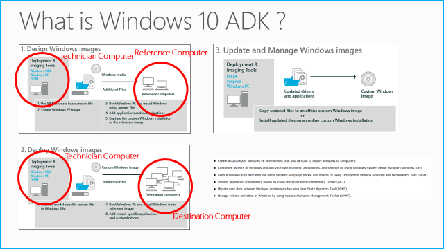

    注意︰ 我们建议在技术人员计算机上使用 32 位版本的 Windows，因为 32 位版本支持 32 位和 64 位的部署。

    请按照屏幕说明来安装**Windows 10 ADK**，包括**部署工具**、 **Windows 预安装环境**和**评估 Toolkit Windows**功能。

    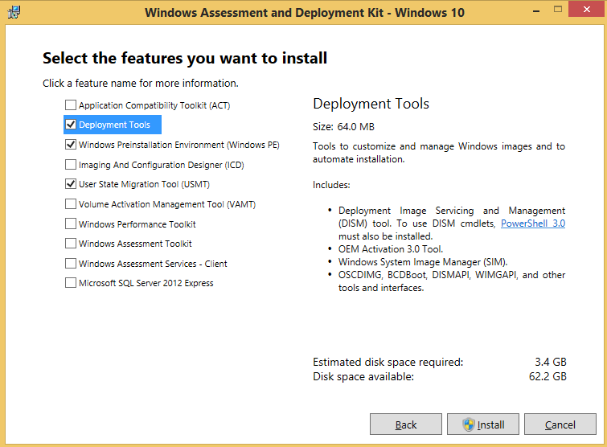

    如果将成功安装，请单击**安装**。

#### 创建我的 USB-B

-   本指南中的部署步骤取决于**USB B**中包括的示例配置文件。 您可以从 Microsoft 下载中心下载[USB B.zip](http://download.microsoft.com/download/5/8/4/5844EE21-4EF5-45B7-8D36-31619017B76A/USB-B.zip) 。 

-   **USB B**中所包含的配置文件的内容是根据品牌和制造选项，您可以更改的示例。 但是，文件的名称和文件夹和文件的层次结构必须是以便协调您的部署过程，本指南所示的相同。

您所需的 USB 驱动器进行格式化并命名它，如下所示︰

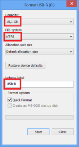 

### 软件下载

若要完成本指南，许多 OPK 下载所需从<https://www.microsoftoem.com>。 下表显示必选和可选下载的成像过程开始之前。

本指南使用 Windows 10 RTM 图像作为示例来创建图像。 您应检查<https://www.microsoftoem.com>上最新的 OPK 前完成本指南中的各节。

**重要提示︰ Windows 组件，Windows ADK、 语言包、 FOD 和语言界面包的版本必须匹配窗口 10 映像版本。**

#### Windows 10 RTM 图像和更新

|           |                                  |
|-----------|----------------------------------|
| X20 09658 | Windows 10 家庭 32 64 英语 OPK    |
| X20 09716 | Windows 10 家庭 SL 32 64 英语 OPK |
| X20 09737 | Windows 10 专业 32 64 英语 OPK     |

#### 可选︰ Windows 10 的语言包，FODs 和 Appx 捆绑包

注意︰ 当安装新的或附加语言包、 FODs 和 Appx 包是所需下载产品。

|           |                                            |
|-----------|--------------------------------------------|
| X20 20209 | Windows 10 32 64 MultiLang OPK LangPackAll     |
| X20 53652 | Windows 桌面版本的 OPK Supp 更新 Sep15 10     |
| X20 52949 | 办公移动 MultiLang OPK-2             |
| X19 96440 | 办公 2013年单个图像 v15.4 英语 OPK |

#### Windows 10、 版本 1511年图像和更新

|  |       |
|-----------|----------------------------------------|
| X20 74664 | Windows 10 家版 1511年 32/64 位英语 OPK     |
| X20 74668 | Windows 10 家庭 SL，版 1511年 32/64 位英语 OPK  |
| X20 74669 | Windows 10 家庭 SL，版 1511年 32/64 位 Eng 国际 OPK |
| X20 74672 | Windows 10 Pro，版 1511年 32/64 位英语 OPK      |

#### 可选︰ Windows 10、 1511年版本的语言包，FODs 和 Appx 捆绑包

注意︰ 当安装新的或附加语言包、 FODs 和 Appx 包是所需下载产品。

|   |   |
|-----------|-------------------------------------------------|
| X20 74675 | Windows 10 版 1511年 32/64 位 MultiLang OPK LangPackAll/唇 |
| X20 74677 | Windows 10 版 1511年 32/64 位 MultiLang OPK 特征即需即装  |
| X20 87906 | 第 10 Windows OPK 1511 32-64 位/X MultiLang 的应用程序更新的版本 |
| X20 52949 | 办公移动 MultiLang OPK-2                  |
| X19 96440 | 办公 2013年单个图像 v15.4 英语 OPK      |

## Windows 10 部署过程

这一节将指导您完成脚本和创建 Windows 10 映像的步骤。

本指南使用的配置文件和脚本，以及存储副本的 usb 闪存盘上的 Windows 安装文件的示例。 在开始之前本指南，完成[创建我 USB-B](#creating-my-usb-b)中的步骤操作。

此流程图显示了部署步骤︰

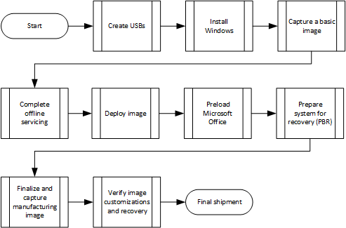

### 创建可引导 USB WinPE

1.  按 Windows 键以显示**开始**菜单。 类型：
    
        Deployment and Imaging Tools Environment

    用鼠标右键单击该工具的名称，然后单击**以管理员身份运行**。

    可选︰ 加快优化和映像捕获过程的性能将电源方案设置为高︰

    -   单击**开始**，键入**powercfg.cpl**。 **电源选项**控制面板会显示。

    -   选择**高性能**电源使用方案。 （如果尚未显示出来，选择**显示其他计划**）。

1.  从"部署工具环境命令提示符"将基 WinPE 复制到技术人员计算机上的新文件夹。
    
    如果您使用**x64** Windows 10 图像，复制 x64 WinPE 文件夹结构︰

        Copype amd64 C:\winpe_amd64

    如果您使用**x86** Windows 10 图像，复制 x86 WinPE 文件夹结构︰

        Copype x86 C:\winpe_x86

1.  **可选**︰ 若要添加其他程序包和语言的装载 WinPE 映像。
   
    如果您使用**x64** Windows 10 图像，装载 x64 WinPE 映像︰

        Dism /mount-image /imagefile:c:\WinPE_amd64\media\sources\boot.wim /index:1 /mountdir:c:\winpe_amd64\mount

    如果您使用**x86** Windows 10 图像，装载 x86 WinPE 映像︰

        Dism /mount-image /imagefile:c:\WinPE_x86\media\sources\boot.wim /index:1 /mountdir:c:\winpe_x86\mount

#### 添加包、 相关性和语言包

使用**/Add-Package**选项使用**Dism**命令。 例如，要使用 WinPE Windows PowerShell，NetFx 依赖项和语言包必须安装。

如果您使用**x64** Windows 10 图像︰

    dism /image:C:\winpe_amd64\mount /Add-Package /PackagePath:"C:\Program Files (x86)\Windows Kits\10\Assessment and Deployment Kit\Windows Preinstallation Environment\amd64\WinPE_OCs\WinPE-NetFx.cab"
    dism /image:C:\winpe_amd64\mount /Add-Package /PackagePath:"C:\Program Files (x86)\Windows Kits\10\Assessment and Deployment Kit\Windows Preinstallation Environment\amd64\WinPE_OCs\en-us\WinPE-NetFx_en-us.cab"
    dism /image:C:\winpe_amd64\mount /Add-Package /PackagePath:"C:\Program Files (x86)\Windows Kits\10\Assessment and Deployment Kit\Windows Preinstallation Environment\amd64\WinPE_OCs\WinPE-PowerShell.cab"
    dism /image:C:\winpe_amd64\mount /Add-Package /PackagePath:"C:\Program Files (x86)\Windows Kits\10\Assessment and Deployment Kit\Windows Preinstallation Environment\amd64\WinPE_OCs\en-us\WinPE-Powershell_en-us.cab"

如果您使用 Windows 10 的**x86**映像︰

    dism /image:C:\winpe_x86\mount /Add-Package /PackagePath:"C:\Program Files (x86)\Windows Kits\10\Assessment and Deployment Kit\Windows Preinstallation Environment\x86\WinPE_OCs\WinPE-NetFx.cab"
    dism /image:C:\winpe_x86\mount /Add-Package /PackagePath:"C:\Program Files (x86)\Windows Kits\10\Assessment and Deployment Kit\Windows Preinstallation Environment\x86\WinPE_OCs\en-us\WinPE-NetFx_en-us.cab"
    dism /image:C:\winpe_x86\mount /Add-Package /PackagePath:"C:\Program Files (x86)\Windows Kits\10\Assessment and Deployment Kit\Windows Preinstallation Environment\x86\WinPE_OCs\WinPE-PowerShell.cab"
    dism /image:C:\winpe_x86\mount /Add-Package /PackagePath:"C:\Program Files (x86)\Windows Kits\10\Assessment and Deployment Kit\Windows Preinstallation Environment\x86\WinPE_OCs\en-us\WinPE-Powershell_en-us.cab"

#### 添加驱动程序 

使用 /Add-Driver 选项使用 Dism 命令。 

注意︰ 此方法要求将基于的 INF 驱动程序。 建议从 IHV 供应商获取基于 INF 驱动程序。

如果您使用**x64** Windows 10 图像︰

    dism /image:C:\winpe_amd64\mount /Add-Driver /driver:"C:\Out-of-Box Drivers\mydriver.inf"

如果您使用 Windows 10 的**x86**映像︰

    dism /image:C:\winpe_x86\mount /Add-Driver /driver:"C:\Out-of-Box Drivers\mydriver.inf"

注意︰ 要安装所有的驱动程序在某个文件夹及其所有子文件夹使用 /recurse 选项。 

如果您使用**x64** Windows 10 图像︰

    dism /Image:C:\Winpe_amd64 /Add-Driver /Driver:c:\drivers /Recurse

如果您使用 Windows 10 的**x86**映像︰

    dism /Image:C:\Winpe_x86 /Add-Driver /Driver:c:\drivers /Recurse

#### 清理 boot.wim

运行清理减少的 WinPE，适合于低规范设备 （例如，具有 1 GB Ram 或 16 GB 存储设备） 的磁盘和内存占用空间。 这会增加与更广泛的设备的兼容性。 开头第 10 Windows 版本 1607，可以在 /Resetbase 将推迟到下一步的自动维护任何长时间运行清理操作中指定 /Defer 参数。 但我们极力建议您**只**将 /Defer 用作其中 DISM /Resetbase 需要 30 分钟以上才能完成的工厂中的一个选项。

如果您使用**x64** Windows 10 图像︰

    dism /image:c:\winpe_amd64\mount /Cleanup-image /StartComponentCleanup /ResetBase

如果您使用 Windows 10 的**x86**映像︰

    dism /image:c:\winpe_x86\mount /Cleanup-image /StartComponentCleanup /ResetBase 

#### 优化启动 Winpe

通过将电源方案设置为高性能优化在线 winpe:

注意︰ 设置高性能会影响散热设备的 performnce。

如果您使用**x64** Windows 10 图像︰

    Notepad.exe c:\winpe_amd64\mount\windows\system32\startnet.cmd

输入到记事本中︰

    powercfg /s 8c5e7fda-e8bf-4a96-9a85-a6e23a8c635c

关闭并保存记事本。

如果您使用 Windows 10 的**x86**映像︰

    Notepad.exe c:\winpe_x86\mount\windows\system32\startnet.cmd

输入到记事本中︰ 

    powercfg /s 8c5e7fda-e8bf-4a96-9a85-a6e23a8c635c

关闭并保存记事本。

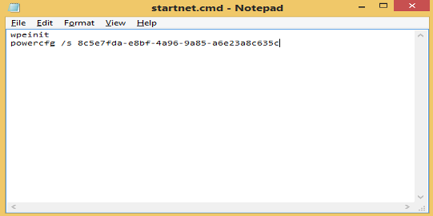

#### 将更改提交到 WinPE 

下表将更改提交到 WinPE 并将标记为删除的文件中运行命令。

如果您使用**x64** Windows 10 图像︰

    dism /unmount-image /mountdir:c:\winpe_amd64\mount /commit
    dism /export-image /sourceimagefile:c:\winpe_amd64\media\sources\boot.wim /sourceindex:1 /DestinationImageFile:c:\winpe_amd64\mount\boot2.wim
    Del c:\winpe_amd64\media\sources\boot.wim
    Copy c:\winpe_amd64\mount\boot2.wim c:\winpe_amd64\media\sources\boot.wim
   
如果您使用 Windows 10 的**x86**映像︰

    dism /unmount-image /mountdir:c:\winpe_x86\mount /commit
    dism /export-image /sourceimagefile:c:\winpe_x86\media\sources\boot.wim /sourceindex:1 /DestinationImageFile:c:\winpe_x86\mount\boot2.wim
    Del c:\winpe_x86\media\sources\boot.wim
    Copy c:\winpe_x86\mount\boot2.wim c:\winpe_x86\media\sources\boot.wim

#### 创建可引导的 usb 闪存盘

1.  连接**USB 的**驱动器。 请确保驱动器容量至少 4 GB。

2.  请插入的 USB WinPE 可引导 USB 驱动器。

    注意︰ 如果已标记为 USB 的杆，下面的脚本将覆盖到"WinPE"的标签。 

    如果您使用**x64** Windows 10 图像︰

        MakeWinPEMedia /UFD /f C:\winpe_amd64 E:

    如果您使用 Windows 10 的**x86**映像︰

        MakeWinPEMedia /UFD /f C:\winpe_x86 E:    
    
    (e︰ 所在的驱动器号**USB A**)

### 具有基本的自定义安装 Windows

要帮助您定制 unattend.xml 文件中定义的自定义项的文档，请参阅[Windows 10 更新 OEM 策略文档 (OPD)](https://myoem.microsoft.com/oem/myoem/en/topics/Licensing/roylicres/ost2016/Pages/COMM-Win10-OPD-RTM-Now-Avail.aspx)。

从[数字运营中心](http://www.microsoftoem.com/)的软件订单中心下载 Windows 10 专业并使用 Microsoft 媒体创建工具从[SOC 资源](https://moo.microsoftoem.com/okdnet/SOCResources.aspx)生成的 ISO 文件。 Oem 可以下载适用于它们的语言和版 Windows 工具包。

#### 创建应答文件

"应答文件"是包含设置定义和值在 Windows 安装过程中使用基于 XML 的文件。 在答案文件中，您可以指定不同的安装选项，包括如何进行分区的磁盘，要安装的 Windows 映像和应用的产品密钥的位置。 应用于 Windows 安装，例如用户帐户的名称值显示设置，也可以指定 Internet Explorer 收藏夹。 应答文件为安装程序通常称为**Unattend.xml**。

应答文件创建在 Windows 系统映像管理器 (Windows SIM) 是与特定的 Windows 映像。 这使验证应答文件与 Windows 映像中的可用设置中的设置。 但是，因为任何答案文件可用于安装任何 Windows 映像，如果组件不存在 Windows 映像中的答案文件中的设置，这些设置将被忽略。

本指南使用三个不同的答案文件︰

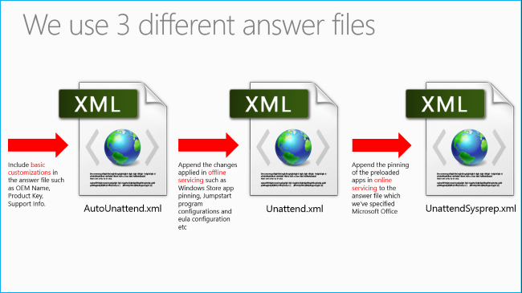

注意︰ 您需要点 Windows 系统映像管理器 (SIM) 到 install.wim 然后才能创建和自定义答案文件。

1.  在技术人员计算机上安装 Windows （见下文） 通过双击它的 ISO 镜像。 突出显示装载 ISO 到 E:\MyWindows 上的所有文件，如下面的关系图中所示。

    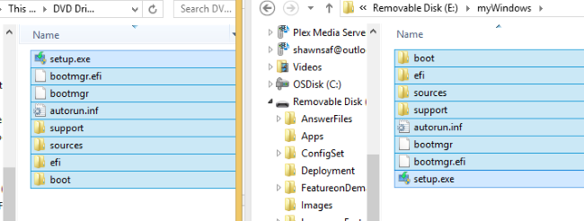

1.  运行**Windows 系统映像管理器**开始从头创建答案文件。 此工具允许创建或应答文件管理变得简单而有条理的方式。
    
    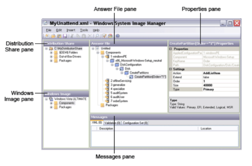  
    
    引用︰ 请参考[WSIM 概述](https://technet.microsoft.com/library/hh825214.aspx)有关 Windows 系统映像管理器 (SIM) 用户界面的详细信息。

1.  单击**文件** > **选择的 Windows 映像**。 浏览到 E:\MyWindows\Sources\*Install.wim*。 编录文件将为该特定的 wim （.clg 文件） 创建。

    疑难解答︰ 目录创建可能失败由于几个原因。 您可能会收到以下错误信息︰

    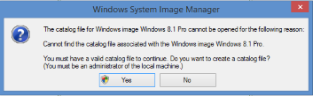

1.  单击**是**。

    注意︰ 请确保 install.wim 具有读/写权限，并且用户将创建此本地计算机的管理员。 Install.wim 图像和 Windows 10 ADK 版本必须相同。 如果下面会显示错误，请确保在技术人员计算机上安装正确的体系结构 （x86 或 x64） Windows 10。 
    
    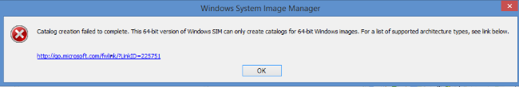

1.  打开示例答案文件或新建一个。 我们建议使用**USB B**中提供的示例答案文件。
    
    <table>
    <tr>
    <td>对于 OA 3.0 系统︰
    </td>
    <td>**USB B**\ConfigSet\\**OA3.0**\AutoUnattend.xml
    </td>
    </tr>
    <tr>
    <td>对于 OA 3.0 系统︰
    </td>
    <td>**USB B**\ConfigSet\\**Non_OA3.0**\AutoUnattend.xml
    </td>
    </tr>
    </table>
   
1.  若要将答案文件与 Windows 映像相关联，请单击**确定**当系统提示您。

#### 自定义答案文件

注意︰ 专用化中的空白字符 |Microsoft Windows 外壳程序安装 |应答文件的计算机名称部分将导致 Windows 安装失败。

1.  基本自定义设置，请查看**USB B**中提供的示例答案文件。 请注意，示例答案文件， **USB B**中的使用之前必须更改的占位符值。 我们建议 Oem 构建他们自己的应答文件和用作起始点或引用下列文件︰

    <table>
    <tr>
    <td>对于 OA 3.0 系统︰
    </td>
    <td>**USB B**\ConfigSet\\**OA3.0**\AutoUnattend.xml
    </td>
    </tr>
    <tr>
    <td>对于 OA 3.0 系统︰
    </td>
    <td>**USB B**\ConfigSet\\**Non_OA3.0**\\AutoUnattend.xml
    </td>
    </tr>
    </table>
   
    加法示例，请参阅[Technet 引用无人参与的示例](https://technet.microsoft.com/library/cc732280.aspx)。

1.  在答案文件中指定的产品密钥。 **USB B**中的示例答案文件中包含该自定义项。 有两种不同方法在答案文件中指定的产品密钥︰

    -   使用此[产品密钥](http://technet.microsoft.com/library/cc721925.aspx)设置 Microsoft Windows 安装程序组件中在**windowsPE 传递**过程中以指定要在 Windows 安装过程中安装的 Windows 映像。 安装完成后，如果计算机上存储此设置中指定的产品密钥。 窗口被激活时，将使用此产品密钥。

    -   使用此[产品密钥](http://technet.microsoft.com/library/cc749389.aspx)设置 Microsoft Windows 外壳程序安装组件中**专门传递**过程以指定一个不同的产品密钥来激活 Windows。 例如，可以指定一个产品密钥以与在 Microsoft Windows 安装程序组件，产品密钥安装 Windows，然后指定其他产品密钥来激活 Windows。

请参考工具包指南 Windows 10 默认制造键 OEM PDF 查找默认为**OA3.0**的产品密钥和**非 OA3.0**键。

示例︰ 导航到 OPK X20 74664 Win 家庭英语 OPK\Print Content\X20 09791 套件手册 》 赢得 10 个默认制造关键 OEM\X2009791GDE.pdf 10 1511年 32 64。

#### 安装 Windows

1.  连接**USB 的**推动和引导参考计算机。

    注意︰ 如果使用 USB 驱动器启动失败，请确保已确定 USB 启动优先级而不是硬盘启动。 若要执行此操作，可能有必要去参考计算机 / 设备的 BIOS 菜单并调整启动优先级顺序，使 usb 闪存盘位于列表的顶部。

1.  已启动 WinPE 之后，插入**USB-B**。

2.  在**X:\windows\system32 >**提示类型***diskpart*** ，按**&lt;输入&gt;**键启动 Diskpart。

3.  在**\DISKPART&gt;**提示键入***列表卷***。

    注︰ 检查 USB-B"从左向右"列下已指派哪些字母 (示例︰ E)。 这是在安装中使用的驱动器号。

1.  键入***退出***以退出 Diskpart。

    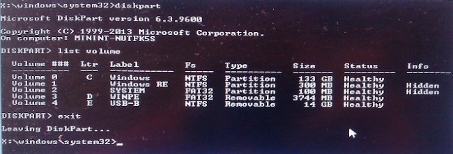
    
1.  使用应答文件执行***setup.exe*** ，并与其他 OEM 自定义安装 Windows 10 更新。 下表中复制命令。

    <table>
    <tr>
    <td>对于 OA 3.0 系统︰
    </td>
    </tr>
    <tr>
    <td><code> Xcopy /herky e:\configset\$oem$ e:\MyWindows\Sources\$OEM$ 
     E:\MyWindows\Setup.exe /unattend:E:\Configset\OA3.0\AutoUnattend.xml
     </code>
    
目录出现提示时，请按 D。
    

    </td>
    </tr>
    </table>
    
    <table>
    <tr>
    <td>对于 OA 3.0 系统︰
    </td>
    </tr>
    <tr>
    <td><code> Xcopy /herky e:\configset\$oem$ e:\MyWindows\Sources\$OEM$ 
     E:\MyWindows\Setup.exe /unattend:E:\Configset\non_oa3.0\AutoUnattend.xml
     </code>
    
目录出现提示时，请按 D。
    

    </td>
    </tr>
    </table>
  
1.  复制安装文件后，断开**USB A**。

2.  计算机重新启动后立即断开**USB-B** 。

如果您使用 AutoUnattend，系统将自动引导到审核模式下，系统准备工具 (sysprep) 出现。 如果设备启动的语言或那里你好而是屏幕，请按 Ctrl + Shift + F3 进入审核模式。 该设备将重新启动到桌面并系统准备工具 (sysprep) 出现。 暂时忽略 Sysprep。

注意︰ 许多 Windows 功能，包括开始菜单和设置菜单中，在这种环境不适。

#### 应用程序和存储销售机会

通过 Windows 10 和 Windows 应用商店，您具有品牌和设备优势，收入创建和客户访问的巨大机会。

Windows 应用商店应用程序是在 Windows 10 体验中心。 它们是通用应用程序窗口，使您能够生成的台式计算机、 平板电脑或运行 Windows 10 的电话应用程序。 为 OEM，可以提供吸引人的用户体验，并通过提供一套非常棒的增值软件和服务，构建高质量的硬件以及提高品牌忠诚度。

重要提示︰ 以下密钥必须设置在审核模式下。 如果您已完成[安装 Windows](#install-windows)部分中，您应在审核模式下。

更改注册表设置，并添加 OEM id。 OEM Windows 存储程序的参与者，请联系<PartnerOps@microsoft.com>以获取您的 OEM id。

| **项目**  | **在注册表中的位置**                                                                   |
|-----------|--------------------------------------------------------------------------------------------|
| **OEMID** | HKEY_LOCAL_MACHINE\Software\Microsoft\Windows\CurrentVersion\Store，(REG_SZ) OEMID |

***Regedit.exe***

1.  在命令提示符下运行 regedit.exe。

2.  定位到 HKEY_LOCAL_MACHINE\Software\Microsoft\Windows\CurrentVersion\Store。

3.  右击下 （默认值） 的&gt;单击**新建**。

4.  单击**字符串值**。

5.  类型： 

        OEMID

6.  双击**OEMID**并输入中的 OEM 名称**值数据︰**文本字段。

    重要提示︰ OEMID 注册表项不会自动在期间恢复 PBR Windows 10 中。 有关如何还原 PBR 操作期间 OEMID 注册表项的详细信息，请参阅[准备系统恢复推按钮重置方案](#prepare-system-for-recovery-push-button-reset-scenarios)。

#### 验证在审核模式下自定义项

不推荐在生产阶段将计算机连接到互联网。 不建议在审核模式中从 Windows Update 获取更新。 这可能会产生错误，当您运行一般化 + syspreping 在审核模式下的计算机上。

1.  完成安装后，计算机登录到 Windows 在审核模式下自动以管理员身份。

2.  验证所述应答文件 （请参阅制造商的名称、 支持电话号码和其他自定义） 的更改。

3.  图像必须推广之前被用作制造图像;选择**通用化**复选框。

4.  在系统清理操作框中，选择**输入系统的现成经验**。

5.  在关机选项框中选择**关机**。

    

重要提示︰ 系统必须设置为归纳，并为了进一步处理映像 OOBE。 在下面的章节中，将使用无人参与文件在 OOBE 密封系统返回到审核模式。 不建议在这一阶段，它将重新封装到审核模式时，一些已知问题。

### 捕获基本映像

1.  连接"**USB A**"并引用计算机启动。

2.  已启动 WinPE 之后，连接到**USB-B**。

    解决︰ 在上一节[在审核模式下自定义的验证设置](#verify-customizations-in-audit-mode)结束时，参考系统而瘫痪。 Windows 将打开如果继续从内部硬盘引导系统，同时输入专用刀，然后 OOBE 传递。 **为了捕获任何窗口传递通用和稳定映像，必须完成。若要解决此问题，我们需要再次一般化映像。在 OOBE 屏幕上，按** &lt;Ctrl&gt;+&lt;班次&gt;+&lt;F3&gt;。 在审核模式下重新启动系统。 在审核模式下，Sysprep 使用 OOBE 关机和通用化系统切换时，前面的图中所示。 在系统重新启动后，请务必从启动**USB A**到 WinPE。

    如果系统仍然可以启动与内部硬盘，请确保 USB 引导优先顺序而不是硬盘启动。 若要执行此操作，则可能是 neceesary 输入参考计算机的 BIOS 菜单和调整的启动优先级顺序，使 usb 闪存盘位于列表的顶部。

1.  标识 Windows 分区的驱动器号。

    -   在**X:\windows\system32&gt;**提示类型***diskpart*** ，按**&lt;输入&gt;**开始 Diskpart。

    -   在**\DISKPART&gt;**提示键入***列表卷***。

    -   在"标签"列中，找到该卷标记为"窗口"。

    -   请注意这是什么字母已分配"从左向右"列下 (示例︰ C)。 这是需要使用的驱动器号。

    -   键入***退出***以退出 Diskpart。

    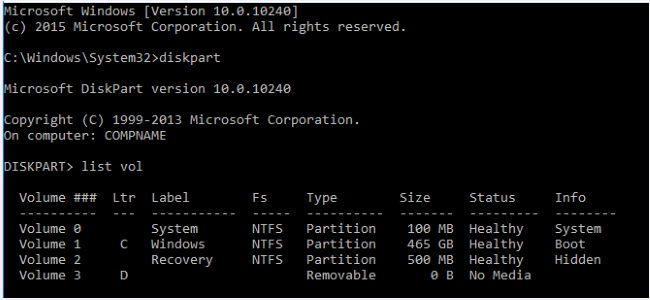

1.  捕获的映像的 windows 分区到**USB B**。 此过程需要几分钟的时间。

    注意︰ 建议运行 dism 操作使用缓存目录。 对于本示例，我们上 USB B 键用于临时文件，将其分配在示例中的驱动器字母"e:"创建一个临时目录。 

        MD e:\scratchdir

        Dism /Capture-Image /CaptureDir:C:\ /ImageFile:E:\Images\BasicImage.wim /Name:"myWinImage" /scratchdir:e:\scratchdir

### 脱机服务

修改您的图像通过添加和删除语言、 驱动程序和程序包。

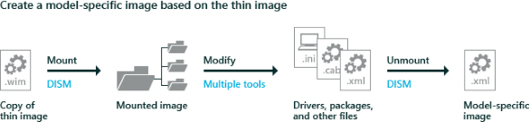

#### 将映像装载

技术人员计算机中插入**USB-B** 。

1.  装载 Windows 映像 (BasicImage.wim) 这一过程中提取到的位置的图像文件的内容已装入映像的位置可以查看和修改

        Md C:\mount\windows

        Dism /Mount-Wim /WimFile:E:\Images\BasicImage.wim /index:1 /MountDir:C:\mount\windows

    （其中 E:\ 是**USB-B**的驱动器号）

1.  图像文件重新安装 Windows。

        Md c:\mount\winre

        Dism /Mount-Image /ImageFile:C:\mount\windows\Windows\System32\Recovery\winre.wim /index:1 /MountDir:C:\mount\winre

    疑难解答︰ 如果在指定的目录下，无法看到 winre.wim，使用下面的命令将文件设置为可见︰

        attrib -h -a -s C:\mount\windows\Windows\System32\Recovery\winre.wim

进行故障诊断︰ 如果安装操作失败，请确保 DISM 的 Windows 10 版本安装与 Windows ADK。 请确保正在使用的版本，而不从技术人员计算机较旧版本。 不装入图像到受保护的文件夹，如 User\Documents 文件夹。 如果 DISM 进程被打断，可以考虑暂时断开与网络的连接和禁用防病毒保护。

#### 添加驱动程序

1.  添加驱动程序程序包 （.inf 文件） 一个一个地。 SampleDriver\driver.inf 是特定于计算机模型的**示例**驱动程序包。 （键入特定的驱动程序路径）。 **如果有多个驱动程序程序包请跳到下一步**。

2.  如果一个文件夹指定.inf 文件而是可以在一个命令行添加多个驱动程序。 要安装所有的驱动程序文件夹及其所有子文件夹中，请使用**/recurse**选项。

        Dism /Image:C:\mount\windows /Add-Driver /Driver:c:\SampleDrivers /Recurse

        Dism /Add-Driver /Image:C:\mount\windows /Driver:"C:\SampleDriver\driver.inf"

1.  检查 %WINDIR%\Inf\ 中的内容 (C:\mount\windows\Windows\Inf\)目录中安装的 Windows 映像，以确保已安装程序的.inf 文件。 添加到 Windows 映像的驱动程序称为 OEM\*。 inf。 这是为了确保添加到计算机的新驱动程序命名的唯一性。 例如，MyDriver1.inf 和 MyDriver2.inf 的文件被重命名为 Oem0.inf 和 Oem1.inf。

2.  验证驱动程序已安装这两个图像。

        Dism /Image:C:\mount\windows /Get-Drivers
        

重要说明︰ 如果该驱动程序包含仅安装程序包并没有.inf 文件，在审核模式下的驱动程序可能安装通过双击相应的安装程序包。 某些驱动程序可能会使用 Sysprep 工具; 不兼容sysprep 一般化，即使他们有注入离线后，他们将被删除。 

在这种情况下，您需要添加 PersistAllDeviceInstalls 和 DoNotCleanupNonPresentDevices （以下部分） 到 UnattendSysprep.xml 的额外参数。

<table>
<tr>
<td>对于 OA 3.0 系统︰
</td>
<td>**USB B**\AnswerFiles\\**OA3.0**\UnattendSysprep.xml
</td>
</tr>
<tr>
<td>对于 OA 3.0 系统︰
</td>
<td>**USB B**\AnswerFiles\\**Non_OA3.0**\UnattendSysprep.xml
</td>
</tr>
</table>

##### PersistAllDeviceInstalls

为了节省时间，在安装过程中的，加快最终用户的全新体验，指示 Windows 安装程序参考计算机和目标计算机上的硬件相同。 通过执行此操作时，Windows 安装程序图像捕获和部署期间维护驱动程序配置。

以下 XML 输出指定的通用化处理过程中设备驱动程序将不会卸载。

&lt;PersistAllDeviceInstalls&gt;为&lt;/PersistAllDeviceInstalls&gt;

设置下表中添加**USB B**\Answerfiles\OA3.0\UnattendSysprep.xml。

***x64/x86 的区别***

Oem 使用 x64 Windows 10 图像， **USB B**\Answerfiles\OA3.0\UnattendSysprep.xml 中添加以下设置︰

    <settings pass="generalize">
        <component name="Microsoft-Windows-PnpSysprep" processorArchitecture="amd64" publicKeyToken="31bf3856ad364e35" language="neutral" versionScope="nonSxS" xmlns:wcm="http://schemas.microsoft.com/WMIConfig/2002/State" xmlns:xsi="http://www.w3.org/2001/XMLSchema-instance">
            <PersistAllDeviceInstalls>true</PersistAllDeviceInstalls>
        </component>
    </settings>

Oem 使用**x86 映像窗口 10**， **USB B**\AnswerFiles\OA3.0\UnattendSysprep.xml 中添加以下设置︰

    <settings pass="generalize">
        <component name="Microsoft-Windows-PnpSysprep" processorArchitecture="x86" publicKeyToken="31bf3856ad364e35" language="neutral" versionScope="nonSxS" xmlns:wcm="http://schemas.microsoft.com/WMIConfig/2002/State" xmlns:xsi="http://www.w3.org/2001/XMLSchema-instance">
            <PersistAllDeviceInstalls>true</PersistAllDeviceInstalls>
        </component>
    </settings>

##### DoNotCleanupNonPresentDevices

**DoNotCleanUpNonPresentDevices**设置用于指定是否在计算机上保留插未检测到的设备的计算机上的信息目标在下一步的专业化。

但是，当**PersistAllDeviceInstalls**和**DoNotCleanUpNonPresentDevices**设置为**true**时，设备信息保留在计算机上。 有关详细信息，请参阅[DoNotCleanUpNonPresentDevices](https://msdn.microsoft.com/library/windows/hardware/dn915711.aspx)。

下图描述了 Windows 安装程序用来确定是否插的信息将保留在计算机中，或被删除，或删除和重新初始化的过程。

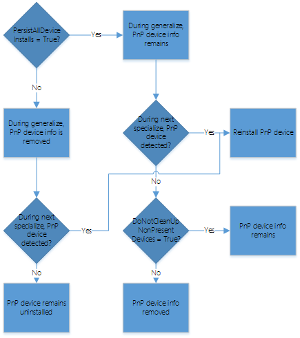

以下 XML 输出指定的通用化处理过程中设备驱动程序将不会卸载。

Oem 使用**x64** Windows 10 映像，添加**USB B**\AnswerFiles\OA3.0\UnattendSysprep.xml 以下设置︰

    <settings pass="generalize">
        <component name="Microsoft-Windows-PnpSysprep" processorArchitecture="amd64"
        publicKeyToken="31bf3856ad364e35" language="neutral" versionScope="nonSxS" 
        xmlns:wcm="http://schemas.microsoft.com/WMIConfig/2002/State" 
        xmlns:xsi="http://www.w3.org/2001/XMLSchema-instance">
            <DoNotCleanUpNonPresentDevices>true</DoNotCleanUpNonPresentDevices >
        </component>
    </settings>

Oem 使用**x86**的 Windows 10 映像，添加**USB B**\AnswerFiles\OA3.0\UnattendSysprep.xml 以下设置︰

    <settings pass="generalize">
        <component name="Microsoft-Windows-PnpSysprep" processorArchitecture="x86" 
        publicKeyToken="31bf3856ad364e35" language="neutral" versionScope="nonSxS" 
        xmlns:wcm="http://schemas.microsoft.com/WMIConfig/2002/State" 
        xmlns:xsi="http://www.w3.org/2001/XMLSchema-instance">
            <DoNotCleanUpNonPresentDevices>true</DoNotCleanUpNonPresentDevices >
        </component>
    </settings>

#### 添加 lp 转换 / 嘴唇 / FoDs / Gdr

下表列出了语言包组件的任何依赖项。 有关详细信息，请参阅[语言包](language-packs-and-windows-deployment.md)和[按需 (FoD) 的功能](features-on-demand-v2--capabilities.md)。

<table border="1" cellpadding="0">
    <tbody>
        <tr>
            <td>
                

                    <strong>组件</strong>
                

            </td>
            <td>
                

                    <strong>示例文件名称</strong>
                

            </td>
            <td>
                

                    <strong>依赖项</strong>
                

            </td>
            <td>
                

                    <strong>说明</strong>
                

            </td>
        </tr>
        <tr>
            <td>
                

语言包 

            </td>
            <td>
                

                    <code>Microsoft-Windows-Client-Language-Pack_x64_es-es.cab</code>
                

            </td>
            <td>
                

无 

            </td>
            <td>
                

包括基本的 Cortana 功能的用户界面文本。
                

            </td>
        </tr>
        <tr>
            <td>
                

语言界面包 

            </td>
            <td>
                

                    <code>Microsoft-Windows-Client-Language-Interface-Pack_x64_ca-es.cab</code>
                

            </td>
            <td>
                

要求特定的完全本地化或部分本地化的语言包。 示例︰ ca-ES 要求 es-ES。
                

            </td>
            <td>
                

包括基本的 Cortana 功能的用户界面文本。
                

                

不是所有的用户界面语言资源纳入唇。 所以 Lip 需要至少一个语言包 （或父语言）。 父语言包提供了 LIP 的支持。 未翻译为 LIP 语言的用户界面部分以母语显示。 在国家或区域通常使用两种语言中，您可以通过应用 LIP 语言包通过提供更好的用户体验。
                

            </td>
        </tr>
        <tr>
            <td>
                

基本 

            </td>
            <td>
                

                    <code>Microsoft-Windows-LanguageFeatures-Basic-fr-fr-Package</code>
                

            </td>
            <td>
                

无 

            </td>
            <td>
                

拼写检查，文本预测、 断字，断字和可用的语言。
                

                

添加任何以下组件之前，您必须添加此组件。
                

            </td>
        </tr>
        <tr>
            <td>
                

字体 

            </td>
            <td>
                

                    <code>Microsoft-Windows-LanguageFeatures-Fonts-Thai-Package</code>
                

            </td>
            <td>
                

无 

            </td>
            <td>
                

字体。
                

                

所需的某些地区呈现出现在文档中的文本。 示例，TH-TH 要求泰国字体包。 
                

            </td>
        </tr>
        <tr>
            <td>
                

光学字符识别 

            </td>
            <td>
                

                    <code>Microsoft-Windows-LanguageFeatures-OCR-fr-fr-Package</code>
                

            </td>
            <td>
                

基本 

            </td>
            <td>
                

识别并输出图像中的文本。
                

            </td>
        </tr>
        <tr>
            <td>
                

手写识别 

            </td>
            <td>
                

                    <code>Microsoft-Windows-LanguageFeatures-Handwriting-fr-fr-Package</code>
                

            </td>
            <td>
                

基本 

            </td>
            <td>
                

使设备用笔输入的手写识别。
                

            </td>
        </tr>
        <tr>
            <td>
                

文本到语音转换 

            </td>
            <td>
                

                    <code>Microsoft-Windows-LanguageFeatures-TextToSpeech-fr-fr-Package</code>
                

            </td>
            <td>
                

基本 

            </td>
            <td>
                

使文本到语音转换，由 Cortana 和讲述人。
                

            </td>
        </tr>
        <tr>
            <td>
                

语音识别 

            </td>
            <td>
                

                    <code>Microsoft-Windows-LanguageFeatures-Speech-fr-fr-Package</code>
                

            </td>
            <td>
                

基本的文本到语音识别 

            </td>
            <td>
                

识别语音输入，由 Cortana 和 Windows 语音识别。
                

            </td>
        </tr>
    </tbody>
</table>

始终使用的语言包和按需登录功能 (FOD) 包相匹配的语言和平台的 Windows 映像。

按需 (FODs) 的功能是可以在任何时候添加的 Windows 功能包。 当用户需要一种新功能时，它们可以从 Windows Update 请求功能包。 Oem 可以预安装这些功能，使他们在他们的设备--全新。

常见功能包括像手写识别的语言资源。 这些功能是启用完整的 Cortana 功能所需要的。

获得胜利 10 32 64 MultiLang OPK LangPackAll，赢取 10 32 位 x64 MultiLang OPK[文档中心](https://www.microsoftoem.com)的需求上的特征。

注意︰ 您必须使用 Microsoft 媒体工具从[SOC 资源](https://moo.microsoftoem.com/okdnet/SOCResources.aspx)合并到一个可装载的映像 DDP 文件夹结构，赢得 10 的 32 位 x64 MultiLang OPK 文档中心从需求上的特征。

1.  X86 和 x64 语言包.cab 文件复制到 E:\Languagepacks\。

1.  复制到**USB B**部分语言包。

3.  突出显示需文件的所有重复消除功能，并将复制到 E:\LanguageFeaturePacks\。

    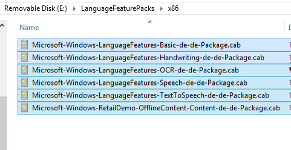

    其中 e︰ 是**USB B**的驱动器号

重要提示︰ 不要更新之后安装语言包。 如果安装的更新 （修补程序、 常规分发版本 [GDR] 或服务包 [SP]） 是之前安装语言包包含依赖于语言的资源，则不会应用更新中包含的特定于语言的更改更新将需要重新安装。 总是在安装更新之前安装语言包。

将语言和点播功能添加到 Windows 映像。

对于具有依赖关系的软件包，请确保按顺序安装软件包。 例如，若要启用 Cortana，安装︰ 语言包.cab 文件，然后 –**基本**，然后 –**TextToSpeech**，然后--**语音**，按此顺序。 如果您不能确定的依赖项，则确定以将它们放在同一文件夹中，并将其所有相同的 DISM /Add-Package 命令，使用下面的表 （其中 e︰ 是语言包所在的驱动器） 中的示例所示。 自 Windows 版本 1607年 10 起，包括 Windows 版、 平台体系结构和区域设置语言包文件的名称。 功能上的需求 (FOD) 包应从设备的平台体系结构匹配的媒体。 例如，使用 x64 FOD 包用于基于 x64 的计算机媒体。  

如果您使用**x64** Windows 10 图像︰

    Dism /Add-Package /Image:"C:\mount\windows" /PackagePath:"E:\LanguagePacks\Microsoft-Windows-Client-Language-Pack_x64_de-de.cab" /PackagePath:"E:\LanguageFeaturePacks\x64\Microsoft-Windows-LanguageFeatures-Basic-de-de-Package.cab" /PackagePath:"E:\LanguageFeaturePacks\x64\Microsoft-Windows-LanguageFeatures-OCR-de-de-Package.cab" /PackagePath:"E:\LanguageFeaturePacks\x64\Microsoft-Windows-LanguageFeatures-Handwriting-de-de-Package.cab" /PackagePath:"E:\LanguageFeaturePacks\x64\Microsoft-Windows-LanguageFeatures-TextToSpeech-de-de-Package.cab" /PackagePath:"E:\LanguageFeaturePacks\x64\Microsoft-Windows-LanguageFeatures-Speech-de-de-Package.cab" /packagepath:"e:\LanguageFeaturePacks\x64\Microsoft-Windows-RetailDemo-OfflineContent-Content-de-de-Package.cab"

如果您使用 Windows 10 的**x86**映像︰

    Dism /Add-Package /Image:"C:\mount\windows" /PackagePath:"E:\LanguagePacks\Microsoft-Windows-Client-Language-Pack_x86_de-de.cab" /PackagePath:"E:\LanguageFeaturePacks\x86\Microsoft-Windows-LanguageFeatures-Basic-de-de-Package.cab" /PackagePath:"E:\LanguageFeaturePacks\x86\Microsoft-Windows-LanguageFeatures-OCR-de-de-Package.cab" /PackagePath:"E:\LanguageFeaturePacks\x86\Microsoft-Windows-LanguageFeatures-Handwriting-de-de-Package.cab" /PackagePath:"E:\LanguageFeaturePacks\x86\Microsoft-Windows-LanguageFeatures-TextToSpeech-de-de-Package.cab" /PackagePath:"E:\LanguageFeaturePacks\x86\Microsoft-Windows-LanguageFeatures-Speech-de-de-Package.cab" /packagepath:"E:\LanguageFeaturePacks\x86\Microsoft-Windows-RetailDemo-OfflineContent-Content-de-de-Package.cab"

验证包已安装到 Windows 映像︰

    Dism /Get-Packages /Image:C:\mount\windows

##### [可选]使用其他字体添加语言

作为 Windows 10 重新分解语言包的一部分，某些语言中使用的字体已分解到他们自己语言中的 cab 文件。 在此部分，JA-JP 语言添加到图像与字体 cab 除了其他功能语言包的语言中。

如果您使用**x64** Windows 10 图像︰

    Dism /Add-Package /Image:"C:\mount\windows" /PackagePath:"E:\LanguagePacks\Microsoft-Windows-Client-Language-Pack_x64_ja-jp.cab" /PackagePath:"E:\LanguageFeaturePacks\x64\Microsoft-Windows-LanguageFeatures-Basic-ja-jp-Package.cab" /PackagePath:"E:\LanguageFeaturePacks\x64\Microsoft-Windows-LanguageFeatures-OCR-ja-jp-Package.cab" /PackagePath:"E:\LanguageFeaturePacks\x64\Microsoft-Windows-LanguageFeatures-Handwriting-ja-jp-Package.cab" /PackagePath:"E:\LanguageFeaturePacks\x64\Microsoft-Windows-LanguageFeatures-TextToSpeech-ja-jp-Package.cab" /PackagePath:"E:\LanguageFeaturePacks\x64\Microsoft-Windows-LanguageFeatures-Speech-ja-jp-Package.cab" **/PackagePath:"E:\LanguageFeaturePacks\x64\Microsoft-Windows-LanguageFeatures-Fonts-Jpan-Package.cab"** /packagepath:"E:\LanguageFeaturePacks\x86\Microsoft-Windows-RetailDemo-OfflineContent-Content-ja-jp-Package.cab

如果您使用 Windows 10 的**x86**映像︰

    Dism /Add-Package /Image:"C:\mount\windows" /PackagePath:"E:\LanguagePacks\Microsoft-Windows-Client-Language-Pack_x86_ja-jp.cab" /PackagePath:"E:\LanguageFeaturePacks\x86\Microsoft-Windows-LanguageFeatures-Basic-ja-jp-Package.cab" /PackagePath:"E:\LanguageFeaturePacks\x86\Microsoft-Windows-LanguageFeatures-OCR-ja-jp-Package.cab" /PackagePath:"E:\LanguageFeaturePacks\x86\Microsoft-Windows-LanguageFeatures-Handwriting-ja-jp-Package.cab" /PackagePath:"E:\LanguageFeaturePacks\x86\Microsoft-Windows-LanguageFeatures-TextToSpeech-ja-jp-Package.cab" /PackagePath:"E:\LanguageFeaturePacks\x86\Microsoft-Windows-LanguageFeatures-Speech-ja-jp-Package.cab" **/PackagePath:"E:\LanguageFeaturePacks\x86\Microsoft-Windows-LanguageFeatures-Fonts-Jpan-Package.cab"** /packagepath:"E:\LanguageFeaturePacks\x86\Microsoft-Windows-RetailDemo-OfflineContent-Content-ja-jp-Package.cab"

#### 将语言添加到 Windows RE

当语言添加到 Windows 时，则将它们添加到 Windows RE，以确保在恢复方案中提供一致的语言体验。

疑难解答︰ 如果在指定的目录下，无法看到 winre.wim，使用下面的命令以使其显示︰

    attrib -h -a -s C:\mount\windows\Windows\System32\Recovery\winre.wim

如果您使用**x64** Windows 10 图像︰

    Dism /image:C:\mount\winre /add-package /packagepath:"C:\Program Files (x86)\Windows Kits\10\Assessment and Deployment Kit\Windows Preinstallation Environment\amd64\WinPE_OCs\de-de\lp.cab"    
    Dism /image:C:\mount\winre /add-package /packagepath:"C:\Program Files (x86)\Windows Kits\10\Assessment and Deployment Kit\Windows Preinstallation Environment\amd64\WinPE_OCs\de-de\WinPE-Rejuv_de-de.cab"
    Dism /image:C:\mount\winre /add-package /packagepath:"C:\Program Files (x86)\Windows Kits\10\Assessment and Deployment Kit\Windows Preinstallation Environment\amd64\WinPE_OCs\de-de\WinPE-EnhancedStorage_de-de.cab"
    Dism /image:C:\mount\winre /add-package /packagepath:"C:\Program Files (x86)\Windows Kits\10\Assessment and Deployment Kit\Windows Preinstallation Environment\amd64\WinPE_OCs\de-de\WinPE-Scripting_de-de.cab"
    Dism /image:C:\mount\winre /add-package /packagepath:"C:\Program Files (x86)\Windows Kits\10\Assessment and Deployment Kit\Windows Preinstallation Environment\amd64\WinPE_OCs\de-de\WinPE-SecureStartup_de-de.cab"
    Dism /image:C:\mount\winre /add-package /packagepath:"C:\Program Files (x86)\Windows Kits\10\Assessment and Deployment Kit\Windows Preinstallation Environment\amd64\WinPE_OCs\de-de\WinPE-SRT_de-de.cab"
    Dism /image:C:\mount\winre /add-package /packagepath:"C:\Program Files (x86)\Windows Kits\10\Assessment and Deployment Kit\Windows Preinstallation Environment\amd64\WinPE_OCs\de-de\WinPE-WDS-Tools_de-de.cab"
    Dism /image:C:\mount\winre /add-package /packagepath:"C:\Program Files (x86)\Windows Kits\10\Assessment and Deployment Kit\Windows Preinstallation Environment\amd64\WinPE_OCs\de-de\WinPE-WMI_de-de.cab"
    Dism /image:C:\mount\winre /add-package /packagepath:"C:\Program Files (x86)\Windows Kits\10\Assessment and Deployment Kit\Windows Preinstallation Environment\amd64\WinPE_OCs\de-de\WinPE-StorageWMI_de-de.cab"
    Dism /image:C:\mount\winre /add-package /packagepath:"C:\Program Files (x86)\Windows Kits\10\Assessment and Deployment Kit\Windows Preinstallation Environment\amd64\WinPE_OCs\de-de\WinPE-HTA_de-de.cab"

如果您使用 Windows 10 的**x86**映像︰

    Dism /image:C:\mount\winre /add-package /packagepath:"C:\Program Files (x86)\Windows Kits\10\Assessment and Deployment Kit\Windows Preinstallation Environment\x86\WinPE_OCs\de-de\lp.cab"
    Dism /image:C:\mount\winre /add-package /packagepath:"C:\Program Files (x86)\Windows Kits\10\Assessment and Deployment Kit\Windows Preinstallation Environment\x86\WinPE_OCs\de-de\WinPE-Rejuv_de-de.cab"
    Dism /image:C:\mount\winre /add-package /packagepath:"C:\Program Files (x86)\Windows Kits\10\Assessment and Deployment Kit\Windows Preinstallation Environment\x86\WinPE_OCs\de-de\WinPE-EnhancedStorage_de-de.cab"
    Dism /image:C:\mount\winre /add-package /packagepath:"C:\Program Files (x86)\Windows Kits\10\Assessment and Deployment Kit\Windows Preinstallation Environment\x86\WinPE_OCs\de-de\WinPE-Scripting_de-de.cab"
    Dism /image:C:\mount\winre /add-package /packagepath:"C:\Program Files (x86)\Windows Kits\10\Assessment and Deployment Kit\Windows Preinstallation Environment\x86\WinPE_OCs\de-de\WinPE-SecureStartup_de-de.cab"   
    Dism /image:C:\mount\winre /add-package /packagepath:"C:\Program Files (x86)\Windows Kits\10\Assessment and Deployment Kit\Windows Preinstallation Environment\x86\WinPE_OCs\de-de\WinPE-SRT_de-de.cab"
    Dism /image:C:\mount\winre /add-package /packagepath:"C:\Program Files (x86)\Windows Kits\10\Assessment and Deployment Kit\Windows Preinstallation Environment\x86\WinPE_OCs\de-de\WinPE-WDS-Tools_de-de.cab"
    Dism /image:C:\mount\winre /add-package /packagepath:"C:\Program Files (x86)\Windows Kits\10\Assessment and Deployment Kit\Windows Preinstallation Environment\x86\WinPE_OCs\de-de\WinPE-WMI_de-de.cab"
    Dism /image:C:\mount\winre /add-package /packagepath:"C:\Program Files (x86)\Windows Kits\10\Assessment and Deployment Kit\Windows Preinstallation Environment\x86\WinPE_OCs\de-de\WinPE-StorageWMI_de-de.cab"
    Dism /image:C:\mount\winre /add-package /packagepath:"C:\Program Files (x86)\Windows Kits\10\Assessment and Deployment Kit\Windows Preinstallation Environment\x86\WinPE_OCs\de-de\WinPE-HTA_de-de.cab"

1.  验证语言包是图像的一部分︰

        Dism /Get-Packages /Image:"C:\mount\winre"

    其中 C 是驱动器的包含图像的驱动器号。

    检查生成的软件包列表并验证列表包含的软件包。 例如︰

        Package Identity : Microsoft-Windows-WinPE-Rejuv_de-de ... de-de~10.0.9926.0 State : Installed

##### [可选]添加 ja jp 语言包

从可选部分[添加一种语言与其他字体](#add-a-language-with-additional-fonts)添加 ja jp 语言包，才完成这部分。

如果您使用**x64** Windows 10 图像︰

    Dism /image:C:\mount\winre /add-package /packagepath:"C:\Program Files (x86)\Windows Kits\10\Assessment and Deployment Kit\Windows Preinstallation Environment\amd64\WinPE_OCs\ja-jp\lp.cab"
    Dism /image:C:\mount\winre /add-package /packagepath:"C:\Program Files (x86)\Windows Kits\10\Assessment and Deployment Kit\Windows Preinstallation Environment\amd64\WinPE_OCs\ja-jp\WinPE-Rejuv_ja-jp.cab"
    Dism /image:C:\mount\winre /add-package /packagepath:"C:\Program Files (x86)\Windows Kits\10\Assessment and Deployment Kit\Windows Preinstallation Environment\amd64\WinPE_OCs\ja-jp\WinPE-EnhancedStorage_ja-jp.cab"
    Dism /image:C:\mount\winre /add-package /packagepath:"C:\Program Files (x86)\Windows Kits\10\Assessment and Deployment Kit\Windows Preinstallation Environment\amd64\WinPE_OCs\ja-jp\WinPE-Scripting_ja-jp.cab"
    Dism /image:C:\mount\winre /add-package /packagepath:"C:\Program Files (x86)\Windows Kits\10\Assessment and Deployment Kit\Windows Preinstallation Environment\amd64\WinPE_OCs\ja-jp\WinPE-SecureStartup_ja-jp.cab"
    Dism /image:C:\mount\winre /add-package /packagepath:"C:\Program Files (x86)\Windows Kits\10\Assessment and Deployment Kit\Windows Preinstallation Environment\amd64\WinPE_OCs\ja-jp\WinPE-SRT_ja-jp.cab"
    Dism /image:C:\mount\winre /add-package /packagepath:"C:\Program Files (x86)\Windows Kits\10\Assessment and Deployment Kit\Windows Preinstallation Environment\amd64\WinPE_OCs\ja-jp\WinPE-WDS-Tools_ja-jp.cab"
    Dism /image:C:\mount\winre /add-package /packagepath:"C:\Program Files (x86)\Windows Kits\10\Assessment and Deployment Kit\Windows Preinstallation Environment\amd64\WinPE_OCs\ja-jp\WinPE-WMI_ja-jp.cab"
    Dism /image:C:\mount\winre /add-package /packagepath:"C:\Program Files (x86)\Windows Kits\10\Assessment and Deployment Kit\Windows Preinstallation Environment\amd64\WinPE_OCs\ja-jp\WinPE-StorageWMI_ja-jp.cab"
    Dism /image:C:\mount\winre /add-package /packagepath:"C:\Program Files (x86)\Windows Kits\10\Assessment and Deployment Kit\Windows Preinstallation Environment\amd64\WinPE_OCs\ja-jp\WinPE-HTA_ja-jp.cab"

如果您使用 Windows 10 的**x86**映像︰

    Dism /image:C:\mount\winre /add-package /packagepath:"C:\Program Files (x86)\Windows Kits\10\Assessment and Deployment Kit\Windows Preinstallation Environment\x86\WinPE_OCs\ja-jp\lp.cab"
    Dism /image:C:\mount\winre /add-package /packagepath:"C:\Program Files (x86)\Windows Kits\10\Assessment and Deployment Kit\Windows Preinstallation Environment\x86\WinPE_OCs\ja-jp\WinPE-Rejuv_ja-jp.cab"
    Dism /image:C:\mount\winre /add-package /packagepath:"C:\Program Files (x86)\Windows Kits\10\Assessment and Deployment Kit\Windows Preinstallation Environment\x86\WinPE_OCs\ja-jp\WinPE-EnhancedStorage_ja-jp.cab"
    Dism /image:C:\mount\winre /add-package /packagepath:"C:\Program Files (x86)\Windows Kits\10\Assessment and Deployment Kit\Windows Preinstallation Environment\x86\WinPE_OCs\ja-jp\WinPE-Scripting_ja-jp.cab"
    Dism /image:C:\mount\winre /add-package /packagepath:"C:\Program Files (x86)\Windows Kits\10\Assessment and Deployment Kit\Windows Preinstallation Environment\x86\WinPE_OCs\ja-jp\WinPE-SecureStartup_ja-jp.cab"
    Dism /image:C:\mount\winre /add-package /packagepath:"C:\Program Files (x86)\Windows Kits\10\Assessment and Deployment Kit\Windows Preinstallation Environment\x86\WinPE_OCs\ja-jp\WinPE-SRT_ja-jp.cab"
    Dism /image:C:\mount\winre /add-package /packagepath:"C:\Program Files (x86)\Windows Kits\10\Assessment and Deployment Kit\Windows Preinstallation Environment\x86\WinPE_OCs\ja-jp\WinPE-WDS-Tools_ja-jp.cab"
    Dism /image:C:\mount\winre /add-package /packagepath:"C:\Program Files (x86)\Windows Kits\10\Assessment and Deployment Kit\Windows Preinstallation Environment\x86\WinPE_OCs\ja-jp\WinPE-WMI_ja-jp.cab"
    Dism /image:C:\mount\winre /add-package /packagepath:"C:\Program Files (x86)\Windows Kits\10\Assessment and Deployment Kit\Windows Preinstallation Environment\x86\WinPE_OCs\ja-jp\WinPE-StorageWMI_ja-jp.cab"
    Dism /image:C:\mount\winre /add-package /packagepath:"C:\Program Files (x86)\Windows Kits\10\Assessment and Deployment Kit\Windows Preinstallation Environment\x86\WinPE_OCs\ja-jp\WinPE-HTA_ja-jp.cab"

#### [可选]删除英语语言使单一语言图像

在 Windows 10，Microsoft 将仅使 EN-US 版本可用。 在上一节中安装 DE-DE 后使图像单个图像，您可以 EN-US 从映像中删除，使其成为唯一 DE-DE。

Oem 需要从系统中卸下所有 EN-US 语言包。 下面的示例删除 Windows 10 专业预安装的语言。

如果您使用**x64** Windows 10 图像︰

    Dism /image:"c:\mount\windows" /remove-package /packagename:Microsoft-Windows-Client-LanguagePack-Package~31bf3856ad364e35~amd64~en-US~10.0.10240.16384 /packagename: Microsoft-Windows-LanguageFeatures-Basic-en-us-Package~31bf3856ad364e35~amd64~~10.0.10240.16384 /packagename:Microsoft-Windows-LanguageFeatures-Handwriting-en-us-Package~31bf3856ad364e35~amd64~~10.0.10240.16384 /packagename:Microsoft-Windows-LanguageFeatures-OCR-en-us-Package~31bf3856ad364e35~amd64~~10.0.10240.16384 /packagename:Microsoft-Windows-LanguageFeatures-Speech-en-us-Package~31bf3856ad364e35~amd64~~10.0.10240.16384 /packagename:Microsoft-Windows-LanguageFeatures-TextToSpeech-en-us-Package~31bf3856ad364e35~amd64~~10.0.10240.16384 /packagename:Microsoft-Windows-Prerelease-Client-Package~31bf3856ad364e35~amd64~en-US~10.0.10240.16384 /packagename:Microsoft-Windows-RetailDemo-OfflineContent-Content-en-us-Package~31bf3856ad364e35~amd64~~10.0.10240.16384

如果您使用 Windows 10 的**x86**映像︰

    Dism /image:"c:\mount\windows" /remove-package /packagename:Microsoft-Windows-Client-LanguagePack-Package~31bf3856ad364e35~x86~en-US~10.0.10240.16384 /packagename:Microsoft-Windows-LanguageFeatures-Basic-en-us-Package~31bf3856ad364e35~x86~~10.0.10240.16384 /packagename:Microsoft-Windows-LanguageFeatures-Handwriting-en-us-Package~31bf3856ad364e35~x86~~10.0.10240.16384 /packagename:Microsoft-Windows-LanguageFeatures-OCR-en-us-Package~31bf3856ad364e35~x86~~10.0.10240.16384 /packagename:Microsoft-Windows-LanguageFeatures-Speech-en-us-Package~31bf3856ad364e35~x86~~10.0.10240.16384 /packagename:Microsoft-Windows-LanguageFeatures-TextToSpeech-en-us-Package~31bf3856ad364e35~x86~~10.0.10240.16384 /packagename:Microsoft-Windows-Prerelease-Client-Package~31bf3856ad364e35~x86~en-US~10.0.10240.16384 /packagename:Microsoft-Windows-RetailDemo-OfflineContent-Content-en-us-Package~31bf3856ad364e35~x86~~10.0.10240.16384

疑难解答︰ 如果如删除包时出错︰

    Error: 0x800f0825
    Package Microsoft-Windows-LanguageFeatures-Basic-en-us-Package may have failed due to pending updates to servicing components in the image. Try the command again. The command completed with errors. For more information, refer to the log file. The DISM log file can be found at C:\windows\Logs\DISM\dism.log. 
    
仅故障包上再次运行 dism.exe 删除软件包。

#### [可选]从 WinRE 中删除其他语言

如果您删除的任何语言，它们也必须删除从 WinRE。

如果您使用**x64** Windows 10 图像︰

    Dism /image:"c:\mount\winre" /remove-package /packagename:Microsoft-Windows-WinPE-LanguagePack-Package~31bf3856ad364e35~amd64~en-US~10.0.10240.16384 /packagename:WinPE-EnhancedStorage-Package~31bf3856ad364e35~amd64~en-US~10.0.10240.16384 /packagename:WinPE-HTA-Package~31bf3856ad364e35~amd64~en-US~10.0.10240.16384 /packagename:WinPE-Rejuv-Package~31bf3856ad364e35~amd64~en-US~10.0.10240.16384 /packagename:WinPE-Scripting-Package~31bf3856ad364e35~amd64~en-US~10.0.10240.16384 /packagename:WinPE-SecureStartup-Package~31bf3856ad364e35~amd64~en-US~10.0.10240.16384 /packagename:WinPE-SRT-Package~31bf3856ad364e35~amd64~en-US~10.0.10240.16384 /packagename:WinPE-StorageWMI-Package~31bf3856ad364e35~amd64~en-US~10.0.10240.16384 /packagename:WinPE-WDS-Tools-Package~31bf3856ad364e35~amd64~en-US~10.0.10240.16384 /packagename:WinPE-WMI-Package~31bf3856ad364e35~amd64~en-US~10.0.10240.16384

如果您使用 Windows 10 的**x86**映像︰

    Dism /image:"c:\mount\winre" /remove-package /packagename:Microsoft-Windows-WinPE-LanguagePack-Package~31bf3856ad364e35~x86~en-US~10.0.10240.16384 /packagename:WinPE-EnhancedStorage-Package~31bf3856ad364e35~x86~en-US~10.0.10240.16384 /packagename:WinPE-HTA-Package~31bf3856ad364e35~x86~en-US~10.0.10240.16384 /packagename:WinPE-Rejuv-Package~31bf3856ad364e35~x86~en-US~10.0.10240.16384 /packagename:WinPE-Scripting-Package~31bf3856ad364e35~x86~en-US~10.0.10240.16384 /packagename:WinPE-SecureStartup-Package~31bf3856ad364e35~x86~en-US~10.0.10240.16384 /packagename:WinPE-SRT-Package~31bf3856ad364e35~x86~en-US~10.0.10240.16384 /packagename:WinPE-StorageWMI-Package~31bf3856ad364e35~x86~en-US~10.0.10240.16384 /packagename:WinPE-WDS-Tools-Package~31bf3856ad364e35~x86~en-US~10.0.10240.16384 /packagename:WinPE-WMI-Package~31bf3856ad364e35~x86~en-US~10.0.10240.16384

#### 验证语言组件是图像的一部分

使用 Dism 验证语言组件是图像的一部分。

    Dism /Get-Capabilities /Image:"C:\mount\windows"

#### 设置区域设置的语言

1.  使用 Dism 将图像的默认语言设置︰

        Dism /Image:C:\mount\windows /Set-AllIntl:de-DE

        Dism /Image:C:\mount\winre /Set-AllIntl:de-DE

1.  验证您的更改︰

        Dism /Image:C:\mount\windows /Get-Intl

1.  设置的区域应用默认语言的时区︰

        Dism /Image:C:\mount\windows /set-timezone:"W. Europe Standard Time"

#### 向图像中添加更新程序包 （KB 包）

使用 Dism 应用最新的 GDR 和任何先决条件 Kb。 请验证在[SOC （软件订单中心）](https://www.microsoftoem.com)最新版本的"Windows 桌面 OPK 补充"包。 例如，本指南将使用最新的 GDR 2015.11 D.KB3118754。 

**重要提示︰ 不要更新之后安装语言包。如果安装了更新 （如热修复程序，或常规分发版本 [GDR] 或服务包 [SP]） 包含依赖于语言的资源，在安装语言包之前，不会应用更新中包含特定于语言的更改，并更新将需要重新安装。总是在安装更新之前安装语言包。**

下面的示例演示如何从 OPK 下载从 SOC.中提取 KBs

1.  复制到**USB B**\Updates KB3081452 这两种体系结构的文件夹。

    导航到 X20 53652 Windows 桌面 OPK Supp 更新 Sep15\Software-DVD\X20 53672 软件 DVD5 Windows Supp Sep15 磁盘 1 OEM\x20-53672.img，然后双击。 如下图所示找到 3081452 文件夹。
    
    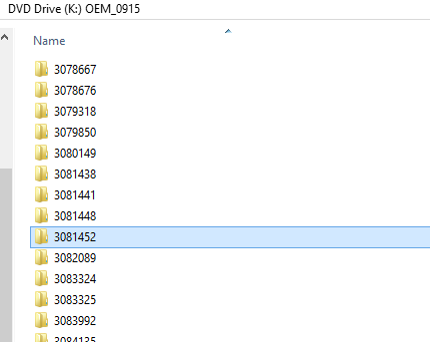
    
1.  复制到**USB B**\Updates KB3097617 这两种体系结构的文件夹。

    导航到 X20 86795 Windows 桌面 OPK Supp 更新 Oct15\Software-DVD\X20 86816 SW DVD5 Windows Supp Oct15 OEM\x20-86816.img，然后双击。 如下图所示找到 3097617 文件夹。

    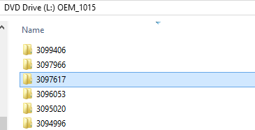

##### 应用 GDR 2015.11 D.KB3118754

如果您使用**x64** Windows 10 图像︰

    Dism /Add-Package /Image:C:\mount\windows /PackagePath:"E:\updates\KB3118754\x64\NEU\Windows10.0-KB3118754-x64.msu"      

如果您使用 Windows 10 的**x86**映像︰

    Dism /Add-Package /Image:C:\mount\windows /PackagePath:"E:\updates\KB3118754\x86\NEU\Windows10.0-KB3118754-x86.msu"

注意︰ 每个包通常是新的知识库，而且会增加修订版本号的 Windows 在该设备上。 Windows 的修订号的设备可以找到以下注册表项中︰ 

HKEY_LOCAL_MACHINE\SOFTWARE\Microsoft\Windows NT\CurrentVersion\UBR

#### 将更新程序包添加到 WinRE

重要提示︰ KB3118754 必须也可应用到 WinRE.wim，以解决已知的问题︰ 在重置/刷新过程中在扫描状态包 (USMT.ppkg) 中包含有带前导空格的路径的应用程序时恢复失败。 示例︰ c: \Program Files\ Contoso\RunMe.exe。

应用 GDR 2015.11 D.KB3118754

如果您使用**x64** Windows 10 图像︰

    Dism /Add-Package /Image:C:\mount\winre /PackagePath:"E:\updates\KB3118754\x64\NEU\Windows10.0-KB3118754-x64.msu"

如果您使用 Windows 10 的**x86**映像︰

    Dism /Add-Package /Image:C:\mount\windows /PackagePath:"E:\updates\KB3118754\x86\NEU\Windows10.0-KB3118754-x86.msu"

#### 重新安装应用程序的收件箱

添加语言包时，应重新收件箱的应用程序安装每个应用程序中移除，然后在使用 DISM 再次安装它。 下面的过程演示如何重新安装开始收件箱应用程序中，但是步骤适用于所有应用程序，只需替换适当的包内。

请验证在[SOC （软件订单中心）](https://www.microsoftoem.com)最新版本的"Windows 桌面 OPK 补充"包。

*注意︰*就不再需要删除收件箱获得启动应用程序。 如果要将其使用 DISM 删除，该命令可能会失败。

1.  用鼠标右键单击每个文件夹并解压缩所有到 e:\apps。

    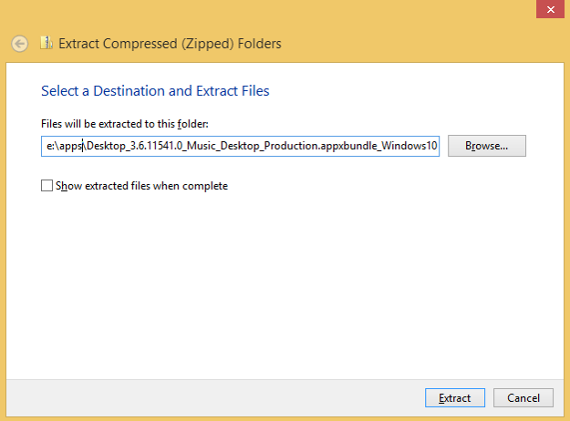

安装应用程序

**注意︰ 有 27 框中应用程序来重新安装图像。使用下面的列表来标识要重新应用到图像的应用程序。如果 Windows 10 补充更新不包含所有 27 应用程序，从以前的 Windows 10 补充 OPK 安装剩余的应用程序。**

[Desktop_2015.1071.40.0_Microsoft.Camera.appxbundle_Windows10_PreinstallKit]

[Desktop_Builder3D_10.9.50.0_x86_x64.appxbundle_Windows10_PreinstallKit]

[Desktop_Mobile_x86_ARM_1.10.26007.0_MicrosoftMessaging.appxbundle_Windows10_PreinstallKit]

[Desktop_x86_x64_10.1510.9010.0_WindowsPhone.appxbundle_Windows10_PreinstallKit]

[Desktop_x86_x64_15.1001.16470.0_WindowsPhotos.appxbundle_Windows10_PreinstallKit]

[Desktop_x86_x64_3.6.13281.0_Music_Desktop_Production.appxbundle_Windows10_PreinstallKit]

[Desktop_x86_x64_3.6.13571.0_Video_Desktop_Production.appxbundle_Windows10_PreinstallKit]

[Desktop_x86_x64_ARM_10.0.2840.0_MicrosoftPeople.appxbundle_Windows10_PreinstallKit]

[Desktop_x86_x64_ARM_10.1510.13110.0_SoundRecorder.appxbundle_Windows10_PreinstallKit]

[GetSkype_3.2.1.0_x86_bundle.appxupload_Windows10_PreinstallKit]

[Microsoft.ConnectivityStore_8wekyb3d8bbwe.appxbundle_Windows10_PreinstallKit]

[Microsoft.WindowsStore_8wekyb3d8bbwe_2015.1013.14.0.1509.Universal.appxbundle_Windows10_PreinstallKit]

[Mobile_Desktop_x86_x64_ARM_1.10.23004.0_CommsPhone.appxbundle_Windows10_PreinstallKit]

[MoneyApp_4.6.169.0_x86.appxbundle_Windows10_PreinstallKit]

[News_4.6.169.0_x86.appxbundle_Windows10_PreinstallKit]

[PC_storeandTH2_6314.2375.officehubim.appxbundle_Windows10_PreinstallKit]

[PC_Sway_6216.2025.storyim.appxbundle_Windows10_PreinstallKit]

[PC_TH2RC_store.16.0.6131.1005.onenoteim.appxbundle_Windows10_PreinstallKit]

[PC_TH2_store.16.0.6308.4227.Sc6131.1009.outlookim.appxbundle_Windows10_PreinstallKit]

[Solitaire_3.4.9241.0_x86_x64.appxbundle_Windows10_PreinstallKit]

[Universal_Maps.Windows_4.1509.50911.0_ARM_x64_x86.appxbundle_Windows10_PreinstallKit]

[Universal_Sports_4.6.169.0_x86.appxbundle_Windows10_PreinstallKit]

[Universal_Weather_4.6.169.0_x86.appxbundle_Windows10_PreinstallKit]

[Universal_x86_x64_ARM_10.1510.13020_WindowsCalculator.appxbundle_Windows10_PreinstallKit]

[Universal_x86_x64_ARM_10.1510.14020.0_WindowsAlarms.appxbundle_Windows10_PreinstallKit]

[Universal_x86_x64_ARM_2.4.13.0_GetStarted.appxbundle_Windows10_PreinstallKit]

[XboxApp_9.9.30030.0]

重要提示︰ appx 包必须安装匹配的依赖包或应用程序将无法在 OOBE 后起作用。 在中定义正确的依赖关系的软件包\*.provxml 应用程序文件夹中的文件。 下面的示例包含每个应用程序的正确的相关性程序包︰

    dism /image:"c:\mount\windows" /Add-ProvisionedAppxPackage /PackagePath:"E:\apps\Universal_Microsoft.GetStarted_2.2.7.0_8wekyb3d8bbwe.appxbundle_Windows10_PreinstallKit\aed1db6c4a954880b3ff43b8e4d1a76d.appxbundle" /DependencyPackagePath:"E:\Apps\Universal_Microsoft.GetStarted_2.2.7.0_8wekyb3d8bbwe.appxbundle_Windows10_PreinstallKit\Microsoft.NET.Native.Framework.1.0_1.0.22929.0_ARM__8wekyb3d8bbwe.appx" /DependencyPackagePath:"E:\Apps\Universal_Microsoft.GetStarted_2.2.7.0_8wekyb3d8bbwe.appxbundle_Windows10_PreinstallKit\Microsoft.NET.Native.Runtime.1.0_1.0.22929.0_ARM__8wekyb3d8bbwe.appx" /DependencyPackagePath:"E:\Apps\Universal_Microsoft.GetStarted_2.2.7.0_8wekyb3d8bbwe.appxbundle_Windows10_PreinstallKit\Microsoft.VCLibs.140.00_14.0.22929.0_ARM__8wekyb3d8bbwe.appx" /licensepath:"E:\apps\Universal_Microsoft.GetStarted_2.2.7.0_8wekyb3d8bbwe.appxbundle_Windows10_PreinstallKit\aed1db6c4a954880b3ff43b8e4d1a76d_License1.xml"

#### 添加 Windows 通用 Office Mobile

获取 X20 88613 办公移动 MultiLang v1.2 OPK （本指南发布时，这是最新的更新。 请验证在[www.microsoftoem.com](http://www.microsoftoem.com) > SOC （软件订单中心） 如果更新的较新版本的软件包将退出。

请有关更多详细信息参阅[Office 移动通讯](https://myoem.microsoft.com/oem/myoem/en/product/office/Pages/COMM-OfficeUnvrslAppsOPKRlsTmng.aspx)。

注意︰ Microsoft Office 单个映像安装是一节介绍[预加载 Microsoft Office 单个图像 v15.4](#preload-microsoft-office-single-image-v15.4) 10.1"上方的屏幕大小的设备。

预安装 Office 单个图像 (或者用出永久或订购许可证) 或办公室移动。  必须与屏幕大小的 10.1"和下面的设备上使用办公移动，必须上方 10.1" 屏幕大小的设备上使用 Office 单个图像。 对于有一个固定的存储驱动器具有小于 32 GB 的设备，Oem 可能预办公室移动安装与屏幕大小无关。 一次，Oem 必须在客户系统上有只有一个 Office 图像。

1.  提取到 E:\Universal_Office 的所有文件夹

    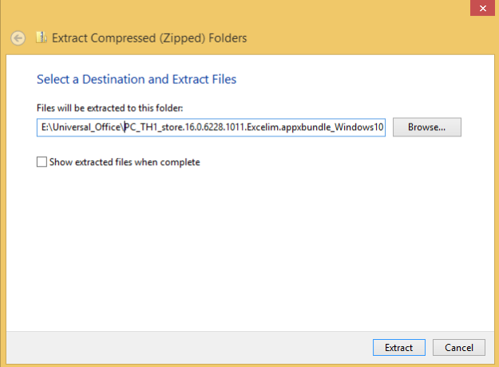

        dism /image:"c:\mount\windows" /add-provisionedappxpackage /packagepath:"e:\Universal_office\PC_TH1_store.16.0.6228.1011.Excelim.appxbundle_Windows10_PreinstallKit\1b0569bd5fbd41d6bf0669beb013073c.appxbundle" /dependencypackagepath:"e:\Universal_office\PC_TH1_store.16.0.6228.1011.Excelim.appxbundle_Windows10_PreinstallKit\Microsoft.VCLibs.140.00_14.0.22929.0_x86__8wekyb3d8bbwe.appx" /licensepath:"e:\Universal_office\PC_TH1_store.16.0.6228.1011.Excelim.appxbundle_Windows10_PreinstallKit\1b0569bd5fbd41d6bf0669beb013073c_License1.xml"

        dism /image:"c:\mount\windows" /add-provisionedappxpackage /packagepath:"e:\Universal_office\PC_TH1_store.16.0.6228.1011.Pptim.appxbundle_Windows10_PreinstallKit\7f255062294a415a974b4958961df056.appxbundle" /dependencypackagepath:"e:\Universal_office\PC_TH1_store.16.0.6228.1011.Pptim.appxbundle_Windows10_PreinstallKit\Microsoft.VCLibs.140.00_14.0.22929.0_x86__8wekyb3d8bbwe.appx" /licensepath:"e:\Universal_office\PC_TH1_store.16.0.6228.1011.Pptim.appxbundle_Windows10_PreinstallKit\7f255062294a415a974b4958961df056_License1.xml"

        dism /image:"c:\mount\windows" /add-provisionedappxpackage /packagepath:"e:\Universal_office\PC_TH1_store.16.0.6228.1011.Wordim.appxbundle_Windows10_PreinstallKit\532f710ca9d34f0aae6af4abe0af0592.appxbundle" /dependencypackagepath:"e:\Universal_office\PC_TH1_store.16.0.6228.1011.Wordim.appxbundle_Windows10_PreinstallKit\Microsoft.VCLibs.140.00_14.0.22929.0_x86__8wekyb3d8bbwe.appx" /licensepath:"e:\Universal_office\PC_TH1_store.16.0.6228.1011.Wordim.appxbundle_Windows10_PreinstallKit\532f710ca9d34f0aae6af4abe0af0592_License1.xml"

#### 修改开始布局

在 Windows 10 开始麻将牌布局提供 Oem 追加默认开始布局包括 Web 链接、 辅助磁贴、 Windows 桌面应用程序和通用的 Windows 应用程序图块的能力。 Oem 可以使用此布局，使其适用于多个地区或市场而无需复制了大量的工作。 另外，Oem 可以添加最多三个默认的系统区域中，提供给用户，其中包括重要的或经常访问系统位置的系统驱动列表中的常用应用程序部分的应用程序和最近安装的应用程序。

要充分利用所有这些新功能并具有 Windows 10 的最可靠、 最完整的开始自定义体验，请考虑创建一个 LayoutModification.xml 文件。 此文件指定如何 OEM 图块布局应在开始。 有关如何自定义新的开始布局的详细信息，请参阅[自定义 Windows 10 启动屏幕](https://msdn.microsoft.com/library/windows/hardware/Mt170651.aspx)。

1.  创建 Layoutmodification.xml。

    注意︰ 建议开始与在 USB-B\StartLayout\layoutModification.xml 样本符合例本文档中的示例。

    示例 LayoutModification.xml 显示两组称为"Fabrikam 组 1"和"Fabrikam 组 2"，其中包含国家/地区设备匹配所指定区域中应用的拼贴 （在这种情况下，区域是德国和美国）。 每个组包含三个拼贴，您需要根据您想要开始锁定该图块使用的各种元素。

    创建 LayoutModification.xml 文件时，请牢记以下︰

    -   如果您不知道应用程序的应用程序用户模型 ID 固定使用**开始︰ DesktopApplicationTile**标记的 Windows 桌面应用程序，您需要在第一次启动之前传统 「 开始 」 菜单目录下创建一个.lnk 文件。

    -   如果**开始︰ DesktopApplicationTile**标记用于固定传统.url 的快捷方式启动，必须创建.url 文件，并将此文件添加到 「 开始 」 菜单目录前第一次启动传统。

    对于这些情况，可以使用以下目录放置.url 或.lnk 文件︰

    -   %APPDATA%\Microsoft\Windows\Start Menu\Programs\

    -   %ALLUSERSPROFILE%\Microsoft\Windows\Start Menu\Programs\

1.  将 LayoutModification.xml 文件保存。

2.  将 LayoutModification.xml 文件添加到 Windows 映像。 您需要将文件放在第一次启动之前以下特定位置。 如果该文件存在，则应当替换图像中已包含 LayoutModification.XML。

        Copy E:\StartLayout\layoutmodification.xml c:\mount\windows\users\default\AppData\Local\Microsoft\Windows\Shell\

    其中 e︰ 是**USB-B**的驱动器号。

1.  如果您锁定要求.url 或.lnk 文件的图块，请将文件添加到以下的传统开始菜单目录︰

    1.  %APPDATA%\Microsoft\Windows\Start Menu\Programs\

    2.  %ALLUSERSPROFILE%\Microsoft\Windows\Start Menu\Programs\

            Copy e:\StartLayout\Bing.url "C:\mount\windows\ProgramData\Microsoft\Windows\Start Menu\Programs\"

            copy e:\StartLayout\Paint.lnk "c:\mount\windows\ProgramData\Microsoft\Windows\Start Menu\Programs"

            Copy E:\StartLayout\Bing.url "c:\mount\windows\users\All Users\Microsoft\Windows\Start Menu\Programs"

            Copy E:\StartLayout\Paint.lnk "C:\Mount\Windows\Users\All Users\Microsoft\Windows\Start Menu\Programs"

注意︰ 如果不创建 LayoutModification.xml 文件并继续使用启动无人参与的设置，操作系统将使用无人参与的答案文件并采取前 12 SquareTiles 或 DesktoporSquareTiles 中指定的设置无人参与文件。 系统将自动在新创建的组的这些图块开始的结尾 — — 前六个图块都放在第一的 OEM 组和第二组 6 个拼贴都放在第二个的 OEM 组。 如果在无人参与文件中指定 OEMName，则此元素的值用于命名将要创建的 OEM 组。

##### 添加 OEM 特定许可证

1.  OEM 可以添加其 OEM 许可协议条款的许可协议屏幕中首次体验到。 

    注意︰ 如果许可协议条款包括，OEM 必须包含版本的许可条款中每种语言都预安装到计算机上。 许可条款文字必须是。另存为**rtf**文件。**rtf**格式。

1.  创建以下目录下的文件夹︰ 

    C:\mount\windows\Windows\System32\oobe\info\default\

2.  作为**语言十进制标识符**相对应的语言命名每个 C:\mount\windows\Windows\System32\oobe\info\default\ 目录下的文件夹。 执行此步骤，每个语言包添加到 Windows 映像。

    语言的相应语言的十进制标识符的完整列表，请参阅[可用语言包的 Windows](available-language-packs-for-windows.md)。

    例如，如果 en-我们，de de 语言包添加到 Windows 映像，添加一个名为"1033"文件夹 (表示 en-我们语言) 在 C:\mount\windows\Windows\System32\oobe\info\default\.然后添加名为"1031"（表示 de de 语言） 在同一个目录下的文件夹。

        MD c:\mount\windows\windows\system32\oobe\info\default\1033

        MD c:\mount\windows\windows\system32\oobe\info\default\1031

1.  创建每种语言指定许可术语的文档。 将每个许可证术语文档移动到相应语言文件夹。

    例如，移动 agreement.rtf 文件**以英文**为︰
    
    C:\mount\windows\Windows\System32\oobe\info\default\\**1033年**\  
    
    和 agreement.rtf 文件**以德语**为移动︰ 
    
    C:\mount\windows\Windows\System32\oobe\info\default\\**1031年**\ 

        Copy E:\resources\agreement.rtf c:\mount\windows\windows\system32\oobe\info\default\1033

1.  创建**oobe.xml**文件以指定的 agreement.rtf 文件的路径。 在以下图像中，您可以看到示例 oobe.xml 位于**USB B**\ConfigSet\oobe.xml 目标。

    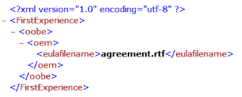

2.  将**oobe.xml 文件**复制到每个语言文件夹。

    例如，将 oobe.xml 复制到 C:\mount\windows\Windows\System32\oobe\info\default\\**1033年**\ 其中英文 agreement.rtf 是有效和 C:\mount\windows\Windows\System32\oobe\info\default\\**1031年**\ 其中德语 agreement.rtf 是有效的目录。

        Copy e:\configset\oobe.xml c:\mount\windows\windows\system32\oobe\info\default\1033

1.  最后，每个语言文件夹必须包含**oobe.xml**文件和 agreement.rtf 文件中的相应的语言。

    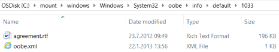
    
    
#### 修改应答文件

1.  OEM 可能希望创建新的应答文件。 下面的示例答案文件涵盖大多数[Windows OEM 策略文档 (OPD)](http://click.email.microsoftemail.com/?qs=4e5762cd9d90bfec0d11dfa9bca1a9efd4924672c363af092f176011a77178f6f1caa72260b9766a)的所需的设置。 因此建议使用此答案文件︰

    <table>
    <tr>
    <td>对于 OA 3.0 系统︰
    </td>
    <td><code>Copy /y E:\AnswerFiles\OA3.0\Unattend.xml C:\Mount\Windows\Windows\Panther</code>
（其中 E:\ 是**USB-B**）

    </td>
    </tr>
    <tr>
    <td>对于 OA 3.0 系统︰
    </td>
    <td><code>Copy /y E:\AnswerFiles\Non_OA3.0\Unattend.xml C:\Mount\Windows\Windows\Panther</code>
（其中 E:\ 是**USB-B**）

    </td>
    </tr>
    </table>

#### 优化 WinRE

1.  增加 scratchspace 大小。

        Dism /image:"c:\mount\winre" /set-scratchspace:512

1.  清理未使用的文件并减少 winre.wim 的大小。

        dism /image:"c:\mount\winre" /Cleanup-Image /StartComponentCleanup /Resetbase 

#### 卸载映像

1.  关闭所有应用程序可能会访问从图像文件。

2.  提交更改并卸载 Windows RE 映像︰

        Dism /Unmount-Image /MountDir:"C:\mount\winre" /Commit

    其中 C 是驱动器的包含图像的驱动器号。

    此过程可能需要几分钟的时间。

1.  使已更新的 Windows RE 映像的备份副本︰

    疑难解答︰ 如果看不到的指定目录下的 winre.wim，使用下面的命令以使其显示︰

        attrib -h -a -s C:\mount\windows\Windows\System32\Recovery\winre.wim

        dism /export-image /sourceimagefile:c:\mount\windows\windows\system32\recovery\winre.wim /sourceindex:1 /DestinationImageFile:e:\images\winre_bak.wim

        Del c:\mount\windows\windows\system32\recovery\winre.wim

        Copy e:\images\winre_bak.wim c:\mount\windows\windows\system32\recovery\winre.wim

    出现提示时，请为文件指定"F"。

1.  检查 Windows RE 映像的新大小。

        Dir "C:\mount\windows\Windows\System32\Recovery\winre.wim"

    使用以下分区布局大小指导来确定以 createartitions-您恢复分区的大小&lt;固件&gt;.txt 文件。 将 winre.wim 复制到隐藏分区后的剩余可用空间量。

    请有关详细信息，参阅[磁盘分区规则](configure-uefigpt-based-hard-drive-partitions.md#DiskPartitionRules)。

    -   如果小于 500 MB 的分区，必须至少 50 MB 的可用空间。

    -   如果分区是 500 MB 或更大，它必须具有至少 320 MB 的可用空间。

    -   如果分区大于 1 GB，我们建议，它应该有至少 1 GB 的空闲空间。

            rem == Windows RE tools partition =============== 
            create partition primary size=500

    可选︰ 本部分假定您希望保密的 winre.wim 在 install.wim，使您的语言和驱动程序的同步。 如果您想要在工厂车间，节省时间和您单独确定管理这些图像，您可能更愿意拉 winre.wim 图像并将其分别应用。

1.  提交更改并卸载 Windows 映像︰

        Dism /Unmount-Image /MountDir:"C:\mount\windows" /Commit

    其中 C 是驱动器的包含图像的驱动器号。

此过程可能需要几分钟。

### 将映像部署到新计算机

在此部分中，该设备通过引导到 WinPE，创建分区布局，并在部署映像准备部署。

#### 引导至 WinPE

1.  在技术人员计算机上， **USB B**/Deployment 目标中找到下列文件。 请参阅[创建我 USB-B](#creating-my-usb-b)来创建，并将这些文件放在正确的路径。 如果它以前已完成，请跳过此步骤。

2.  连接**USB 的**推动和引导参考计算机。

3.  已启动 WinPE 之后，连接**USB-B**。

4.  在**X:\Windows\system32&gt;**命令行类型***diskpart*** ，按&lt;输入&gt;开始 Diskpart。

5.  在**\DISKPART&gt;**命令行中，键入***列表卷***。

6.  在下"*标签"*列中，识别**USB B**硬盘并记下卷的字母"*Ltr"*列 (例如，E)。

7.  键入***退出***以退出 Diskpart。

#### 部署映像

使用**USB B**/Deployment 文件夹中部署脚本演练 deploy.bat，布置设备上的分区和应用映像。 

**重要提示︰ 恢复分区必须是分区后 Windows 分区，以确保 winre.wim 可以保持最新的设备的生命周期内。**

在 Windows 10 版 1511，我们正在更改我们的推荐，以具有放置在操作系统分区后的 WinRE 分区。 这将允许未来增长的 WinRE 分区更新过程。 今天 WinRE 前部的磁盘分区，它的大小可以永远不会更改，因此很难更新时所需的 WinRE。 我们将继续支持有 WinRE 分区位于不同部分的磁盘，但我们鼓励您可以遵循的新建议。

    E:\Deployment\walkthrough-deploy.bat E:\Images\BasicImage.wim
    

有几个脚本中的暂停。 您可以应用操作提示 Y/N，如果这是一种精简的操作系统部署。

注意︰ 仅使用精简的操作系统基于闪存驱动器设备因为紧凑 OS 性能很大程度取决于存储设备功能。 在旋转设备上不建议精简的操作系统。 有关详细信息，请参阅[压缩的操作系统](compact-os.md)。

计算机启动到 OOBE 屏幕后，按此组合键启动到审核模式下︰

    Ctrl+Shift+F3

### 预加载 Microsoft Office

本部分提供了预加载 Office 2016 和 Office v15.4 的指南。

#### 预加载 Microsoft Office 2016 年

本指南提供有关如何使用 Office 部署工具预办公室 2016年安装到运行 Windows 操作系统的设备许可的原始设备制造商 (Oem) 的信息。

注意︰ 本指南不覆盖 oem 在日本的 PIPC 方案。 

##### 在技术人员计算机上的 Office 文件准备

从 X20 92403 办公室 2016 v16 部署工具获取 OEM OPK Office 部署工具。

1.  对于 OEM OPK\Software-OEM\x20 92404.img 的 DVD\X20 92404 软件 DVD5 办公室 2016 v16 部署工具装入 X20 92403 办公室 2016 v16 部署工具。
2.  已装入的驱动器的文件复制到 USB-B （其中 E:\ 是驱动程序号 USB-B） E:\OfficeV16。
3.  双击 e:\Officev16\officedeploymenttool.exe。
4.  提供要提取的文件 E:\Officev16 文件夹路径。

    Setup.exe 和 configuration.xml 到 E:\Officev16 提取。

    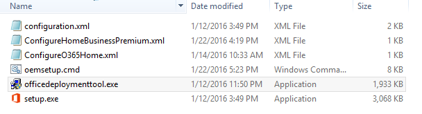
    
    获取所需的语言; 办公室 v16此示例使用英语 X20 39283 Office 2016 v16 32 位 X64 英语 OPK。
    
5. 将 Office 文件夹复制从装入的驱动器 X20 39283 Office 2016 v16 32 位 X64 英语 OPK\Software-DVD\X20 37728 软件 DVD5 办公室专业 2016 32 64 英语 C2ROPK Pro HS HB OEM\X20-37728.img USB-B （其中 E:\ 是 USB-B 的驱动器号） 为 E:\OfficeV16。

    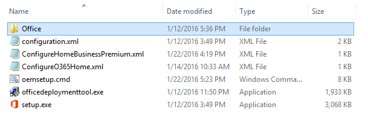
    
    [可选]如果应用语言界面包时，您可能需要添加语言界面包办公室 2016 年也。 下面的示例将显示与应用的语言界面包。    

6. 记事本 E:\Officev16\ConfigureO365Home.xml

7. 添加语言 ID，然后验证源路径，如下面的屏幕快照中所示。

    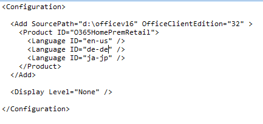
    
8. 关闭并保存 ConfigureO365Home.xml。

9. 以管理员身份打开提升的命令提示符。

10. 从 E:\Officev16，键入并运行 setup.exe /download ConfigureO365Home.xml:

    CD E:\Officev16 Setup.exe /download ConfigureO365Home.xml
    
    这将下载德语和日语语言包。
    
11. 键入运行 echo %错误等级 %并验证返回代码是 0。

12. 从技术人员计算机中拔下 USB-B。 

##### 在参考计算机上安装 Office 2016

1. 参考计算机，在审核模式中插入 USB-B。
2.  驱动器号查找 USB-B;对于本示例 USB-B 是 E:\。
3.  记事本 ConfigureO365Home.xml。
4.  配置源路径以指向 USB B E:\Officev16。

    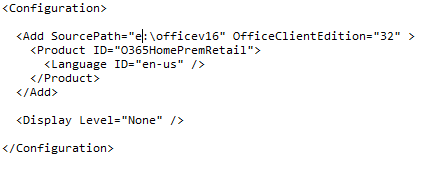
    
    注意︰ 唯一需要在 configuration.xml 文件中指定的产品 ID 是 O365HomePremRetail。 如果用户输入另一个产品密钥，如面向 Office 家庭及学生 2016年然后 Office 将自动配置为与该密钥关联的产品。
    
5.  关闭并保存 ConfigureO365Home.xml。
6.  打开命令提示窗口，定位到 d:\Officev16。
7.  类型：

    Setup.exe 配置 ConfigureO365Home.xml /

##### 附到 「 开始 」 菜单的办公室拼贴

您必须锁定到 「 开始 」 菜单的办公室拼贴，否则 Windows 将在 OOBE 引导阶段删除 Office 文件。

注意︰ 您必须使用至少 Windows 10 版本 10.0.10586.0。 使用早期版本的 Windows 10，以下步骤不起作用。

1. 打开一个命令提示符并键入︰

        notepad C:\Users\Default\AppData\Local\Microsoft\Windows\Shell\layoutmodification.xml.
        
2. 添加&lt;AppendOfficeSuiteChoice 选择 ="Desktop2016"/&gt; layoutmodification 为您请参阅下面的示例中突出显示︰

    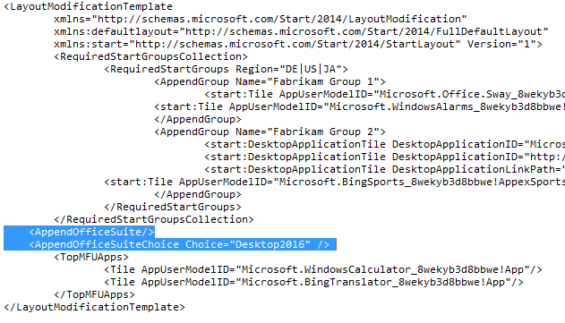

    注意︰ 选择特性是新的。 这样，不同版本的 Office 可以在同一时间被固定到开始屏幕。 目前，Desktop2016 是唯一有效的值。 在将来将提供其他值。

3. 关闭并保存 layoutmodification.xml。

    注意︰ 出于恢复目的而 layoutmodification.xml 将需要在恢复过程中被复制。 
    
4.  打开一个命令提示符并键入︰

        copy C:\Users\Default\AppData\Local\Microsoft\Windows\Shell\layoutmodification.xml c:\recovery\OEM   

    一旦机器经过 OOBE 之后引导至桌面，开始菜单将具有这些附加以下图中所示的三个拼贴︰ 
    
    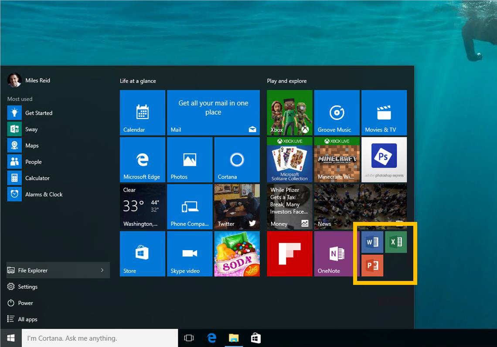
    
#####  配置用户的安装体验   

在设备上安装 Office 之后，您还需要配置用户的安装体验。 这是体验用户可以看到他们时第一次在设备上打开 Office 应用程序。 这也是为了确保 Office 正确授权和激活。

|   安装模式  | 说明   |
|---------------|---------------|
|   OEM         | 在此模式下，客户可以选择重试、 购买或使用现有帐户、 PIN 或产品密钥激活 Office。 这种模式下不支持 Office (AFO) 或 AFO 后期绑定激活。 因此，如果您选择这种模式下，您需要向客户提供一个激活卡 （以前称为产品密钥卡或 Microsoft 产品标识符 (MPI) 卡）。 |
|   OEMTA       |   此模式支持尝试、 购买或激活的 OEM 模式以及支持 AFO 和 AFO 经验后期绑定。 该模式通过设备的 Windows 产品密钥，这意味着客户不需要输入一个 5 x 5 产品密钥代码支持 Office 激活。 |

OEM 模式-提供用户激活卡
1.  在命令提示符下转到驱动器盘符的 USB-B\Officev16
2.  键入并运行︰ 

    oemsetup.cmd 模式 = OEM

OEMTA 模式-激活是通过设备的 Windows 产品密钥。

1. 键入并运行︰
 
    oemsetup.cmd 模式 = OEMTA 引用 =####

#### 预加载 Microsoft Office 单个图像 v15.4

当前的 Office 2013 预加载方法是不同于其他桌面应用程序。 Oem 预安装的桌面应用程序，以便安装应用程序。 这意味着当用户启动该应用程序，该应用程序已安装并自动打开，并且没有其他安装任务，而不是最终用户许可协议接受和 （或） 用户注册。 与 Office 一起压缩的安装文件复制到磁盘除了捕获 Office 文件关联，并为用户提供了一个入口点来尝试、 购买或激活 Office 应用程序的全新安装体验 (OOBE)。 他们启动 Office OOBE 都通常可作为平铺在开始屏幕上的用户没有访问到 Word 或 Excel 在启动屏幕上或所有应用程序视图中。 当用户启动 Office OOBE 时，开始安装的 Office 程序。 Office 安装程序完成后，不再需要压缩的安装程序文件是从磁盘上删除。

-   预安装 Office 单个图像 (具有或不具有永久或订购许可证) 或办公室移动。  必须与屏幕大小的 10.1"和下面的设备上使用办公移动，必须上方 10.1" 屏幕大小的设备上使用 Office 单个图像。 对于有一个固定的存储驱动器具有小于 32 GB 的设备，Oem 可能预办公室移动安装与屏幕大小无关。 Oem 必须只能有一个办公室映像的客户系统上一次。

-   「 开始 」 菜单图块的 Microsoft 组的一部分固定针办公室拼贴到此类的插槽中都是可见而无需滚动，无论 OEM 系统 「 开始 」 菜单的布局，除非办公室拼贴或办公平铺，作为适用，是开始菜单。

获取︰ Office 单个图像 OPK 语言的区域。 本文中，我们将使用 en-我们样本 OPK X19 96440 办公室 2013年单个图像 v15.4 的 OPK 英语 OPK。  这是最新的 Office OPK 时发布本指南。 请验证在 SOC ([https://www.microsoftoem.com](https://www.microsoftoem.com) &gt;软件订单中心) 如果新版 Office 单个图像 OPK 的存在。

注意︰ 如果 Office 麻将牌自动锁定 「 开始 」 菜单图块的 Microsoft 组的一部分中，跳过有关图块替换整个下的一节。

-   对于 Office 单个图像 v15，针办公室拼贴为中等大小的磁贴或更大。

-   办公移动或 Office 单个图像 v15 后续任务，为收回 3 办公室拼贴 (Word、 Excel PowerPoint 拼贴) 以小尺寸的平铺方式或使用 2x2 方向更大。

<table width="462" border="0" cellspacing="0" cellpadding="0">
    <tbody>
        <tr>
            <td width="110" valign="top">
            </td>
            <td width="167" valign="top">
                

Windows 8 8.1 

            </td>
            <td width="185" valign="top">
                

Windows 10 

            </td>
        </tr>
        <tr>
            <td width="110" valign="top">
                

一个图像 

            </td>
            <td width="167" valign="top">
                

15 = 1 平铺 

                

下一版本 = 3 的拼贴 

            </td>
            <td width="185" valign="top">
                

15 = 1 平铺 

                

下一版本 = 3 的拼贴 

            </td>
        </tr>
        <tr>
            <td width="110" valign="top">
                

"通用"的 office 应用程序 

            </td>
            <td width="167" valign="top">
                

N/A 

            </td>
            <td width="185" valign="top">
                

3 平铺 

            </td>
        </tr>
    </tbody>
</table>

3 平铺钉住的示例                   

  

1 平铺钉住的示例

1.  多语言版本的 Office 单个图像 v15.4 OPK 可能预加载。 下载所有 Microsoft Office 单个图像 v15.4 OPK 语言与语言添加到 Windows 映像相关的。 例如，如果将英语和法语语言包添加到 Windows 映像，请下载︰

    -   Office 2013 32 64 位单个图像 v15.4**英语**OPK

    -   Office 2013 32 64 位单个图像 v15.4**法语**OPK

    注︰ 获得连续安装 Office 的不同语言，有不同的语言每个其他机构将占据 ~ 300 MB 的磁盘空间，而不是 ~ 1 GB。 例如，当安装英语 Office15 和 Office15 法语，所需的总磁盘空间将 ~1.3GB 而不是 ~ 2 GB。

1.  打开提升的命令提示符 （具有管理权限）。

2.  OPK 的内容复制到一个目录，将 OfficeSingleImagev15.4 InstallationDirectory。

3.  导航到安装目录。 安装目录是包含下图所示的文件的文件夹︰

    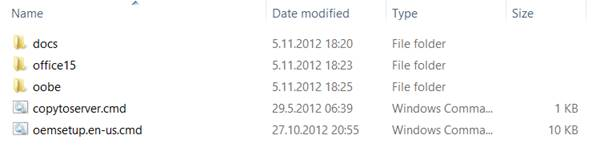
    
    例如︰ Cd c:\&lt; OfficeSingleImagev15.4 InstallationDirectory&gt;

    注意︰ OPK 安装过程是相同的运行 32 位操作系统和 64 位操作系统的计算机。 运行 32 位或 64 位操作系统的计算机上，可能会预加载 Office 2013 的 32 位版本。 仅在运行 64 位操作系统的计算机上，可以预先加载 Office 2013 的 64 位版本。 为了防止外接程序或第三方应用程序，预加载图像的*只有 32 位版本*Office 单个 32 位和 64 位计算机上可能存在兼容性问题。

1.  通过运行 office 的安装脚本来开始安装。

    安装 office 单个图像︰

        Oemsetup.en-us.cmd

    使用 AFO （激活 office） 安装 office 单个图像

        Oemsetup.en-us.oa30.cmd

此过程完成后，Microsoft Office 应用程序图块将放置在开始屏幕上。 但是，用户可以安装 Office 单个图像 v15.4 只有一个语言版本。 默认情况下，OOBE 应用程序的语言版本与 Windows 语言设置，并会在计算机预加载 Office 单个图像 v15.1 语言匹配。 如果不执行此匹配，语言对话框中将包含基于预加载 Office 2013 语言的语言。

### 系统准备恢复按钮重置方案

点击式重新设置，在 Windows 8 中首次引入是一个内置的恢复工具，允许用户同时保留其数据和重要的自定义设置，而无需备份其数据提前恢复操作系统。 它减少了自定义恢复应用程序需要用户提供多个恢复选项，并能够自信地修复自己的计算机。

在 Windows 10 按钮重置功能已更新，以包括以下改进︰

-   **图像的恢复**

    点击式重置功能不再需要或支持单独的恢复映像或媒体上本地分区。 这大大减少了支持功能，所需的磁盘空间并使恢复可能甚至在设备上存储容量有限。

-   **为已更新状态恢复**

依靠以点击方式重置功能现在为已更新状态恢复的操作系统 (OS) 和驱动程序 （包括基于 INF 驱动程序包的一部分安装的设备小程序） 这可以减少用户必须执行一次恢复后重新安装操作系统更新和驱动程序花费的时间。

依靠以点击方式重置用户体验不断提供的自定义机会。 制造商可以插入自定义脚本，安装应用程序或保留在可扩展性点的其他数据。

以下按钮重置功能可供用户与 Windows 10 台 Pc:

-   **刷新您的 PC**

    通过重新安装 OS，同时保留用户数据、 用户帐户和重要设置修复的软件问题。 所有其他预安装自定义项将还原到其出厂状态。 在 Windows 10 此功能将不再保留用户已获取通用 Windows apps1。

-   **重置您的 PC**

    通过重新安装 OS、 删除所有用户帐户和内容 （如数据、 Windows 桌面应用程序和通用的 Windows 应用程序），并还原到出厂状态的预安装自定义项准备 PC 回收或转让所有权。

-   **裸机恢复**

    还原默认或预配置的分区系统磁盘上的布局，并重新安装操作系统和预安装自定义项从外部介质。

有关详细信息，请参阅︰
- [依靠以点击方式重置](push-button-reset-overview.md)
- [Windows 恢复环境 (Windows RE)](windows-recovery-environment--windows-re--technical-reference.md)
- [硬盘驱动器和分区](hard-drives-and-partitions.md)

#### 准备扫描状态工具 

准备获取 Windows 桌面应用程序后安装了这些以及其他设置注册表扫描状态工具。

注意︰ 您将执行此操作技术人员系统上。

1.  在技术人员计算机上插入 USB b。

    如果您使用**x64** Windows 10 图像︰

        md E:\ScanState_amd64
        copy "C:\Program Files (x86)\Windows Kits\10\Assessment and Deployment Kit\User State Migration Tool\amd64" E:\ScanState_amd64
        copy /Y "C:\Program Files (x86)\Windows Kits\10\Assessment and Deployment Kit\Windows Setup\amd64\Sources" E:\ScanState_amd64
        
    如果您使用 Windows 10 的**x86**映像︰
    
        md E:\ScanState_x86
        copy "C:\Program Files (x86)\Windows Kits\10\Assessment and Deployment Kit\User State Migration Tool\x86" E:\ScanState_x86
        copy /Y "C:\Program Files (x86)\Windows Kits\10\Assessment and Deployment Kit\Windows Setup\x86\Sources" E:\ScanState_x86

    其中 e︰ 是 USB-B 的驱动器号。

#### 创建扫描状态配置文件

OEM 可以使用配置文件来还原和 PBR 过程中排除注册表项和文件。

**重要事项︰ 本部分包括解决已知问题的方法在 Windows 10。您必须应用此变通方法，要避免 PBR 进程的问题。**

在某些情况下，Windows Defender 设置和检测历史记录可能捕获到的自定义软件包扫描状态工具。 这可能会导致冲突的文件，因为恢复过程失败，将导致计算机重新启动并重复输入"安装 Windows"阶段。

注意︰ 您可以使用在 USB-B\Recovery\recoveryimage\pbr_config.xml，包含以下步骤的示例配置文件。

1.  **在审核模式下运行参考 PC**上使用扫描状态工具。

    如果您使用**x64** Windows 10 图像︰
    
        MD c:\Recovery\OEM
        E:\ScanState_amd64\ScanState.exe /apps /genconfig:C:\Recovery\OEM\pbr_config.xml
    
    如果您使用 Windows 10 的**x86**映像︰
     
        MD c:\Recovery\OEM
        E:\ScanState_x86\ScanState.exe /apps /genconfig:C:\Recovery\OEM\pbr_config.xml
    

1.  在记事本中打开配置文件

        Notepad c:\Recovery\OEM\pbr_config.xml

1.  搜索配置文件中的以下行︰

    &lt;组件的显示名称 ="窗口-Defender-AM-Sigs"迁移"是"=...

    &lt;组件的显示名称 ="Windows Defender-AM-引擎"迁移"是"=...

    &lt;组件的显示名称 ="安全的恶意软件的 Windows-Defender"迁移"是"=...

1.  修改"移植"值从"是"与"否"的每一行。 例如︰

    &lt;组件的显示名称 ="窗口-Defender-AM-Sigs"迁移 ="**不**"...

    &lt;组件的显示名称 ="Windows Defender-AM-引擎"迁移 ="**不**"...

    &lt;组件的显示名称 ="安全的恶意软件的 Windows-Defender"迁移 ="**不**"...

#### 创建扫描状态迁移文件

OEM 可能会使用配置文件来还原注册表项和文件。

创建用来还原注册表值在生产过程中手动输入的迁移 XML 文件。 下面的示例将恢复此文档中前面设置 OEMID 注册表值。

注︰ USB-B\recovery\recoveryimage\regrecover.xml 示例中已包含注册表值。

    <migration urlid="http://www.microsoft.com/migration/1.0/migxmlext/test">

     <component type="System" context="UserAndSystem">

       <displayName>OEMID</displayName>

       <role role="Settings">

       <rules>

         <include>

            <objectSet>

               <pattern type="Registry">HKLM\Software\Microsoft\Windows\CurrentVersion\Store [OEMID]</pattern>

            </objectSet>

         </include>

       </rules>

       </role>

     </component>
    
    </migration>

#### 创建使用扫描状态恢复包

使用扫描状态工具捕获到资源调配包，安装自定义项并将其保存在文件夹 c:\Recovery\customizations。 本文档使用**USB-B**\Recovery\RecoveryImage 的采样以创建扫描状态包。

重要提示︰ 使用 PBR 扫描状态包必须是存储在 C:\Recovery\Customizations 文件夹中的.ppkg 文件或 PBR 将不能恢复软件包。

1.  创建恢复 OEM 文件夹和复制**USB B**\Recovery\RecoveryImage 中的内容。

        Copy E:\Recovery\recoveryimage c:\recovery\OEM

        Copy E:\StartLayout\layoutmodification.xml c:\recovery\OEM

1.  运行扫描状态收集应用程序和自定义项。

   如果您使用**x64** Windows 10 图像︰
    
    '' 语法 Mkdir c:\recovery\customizations E:\ScanState_amd64\scanstate.exe /apps /ppkg C:\Recovery\Customizations\apps.ppkg /i:c:\recovery\oem\regrecover.xml /config:C:\Recovery\OEM\pbr_config.xml /o /c /v:13 /l:C:\ScanState.log ' '
    
   如果您使用 Windows 10 的**x86**映像︰
    
    '' 语法 Mkdir c:\recovery\customizations E:\ScanState_x86\scanstate.exe /apps /ppkg C:\Recovery\Customizations\apps.ppkg /i:c:\recovery\oem\regrecover.xml /config:C:\Recovery\OEM\pbr_config.xml /o /c /v:13 /l:C:\ScanState.log ' '
    
   其中 e︰ 是**USB-B**的驱动器号*

#### 创建扩展脚本来还原其他设置

配置扩展点，可以自定义的按钮重置体验。 这使您可以运行自定义脚本、 安装其他应用程序，或保留更多的用户、 应用程序或注册表数据。

示例脚本 EnableCustomizations.cmd PBR 过程中将调用，并将做两件事︰

1.  将复制 unattend.xml 文件用于初始部署到 \windows\panther 文件夹中。

2.  将 layoutmodification.xml 复制到系统中。

这将从这两个答案文件期间 PBR 还原其他布局设置。

**重要提示︰ 恢复脚本和 unattend.xml 必须复制到 c:\Recovery\OEM 文件夹 PBR 挑选和恢复正常。**

复制 unattend.xml 文件还原设置。

对于 OA 3.0 系统︰ 

    '''syntax
    Copy /y E:\AnswerFiles\OA3.0\Unattend.xml C:\Mount\Windows\Windows\Panther
    '''
    
对于 OA 3.0 系统︰

    '''syntax
    Copy /y E:\AnswerFiles\Non_OA3.0\Unattend.xml C:\Mount\Windows\Windows\Panther
    '''
    
其中 E:\ 是**USB-B**

#### 复制 winre.wim 备份

在部署期间被移动的 winre.wim 文件。 必须重新复制捕获最终映像备份 4.5.17 一节中创建的 winre.wim 之前否则恢复环境不会对最终的映像部署。

    Copy e:\images\winre_bak.wim c:\windows\system32\recovery\winre.wim

### 确定和捕获制造图像

1.  删除已创建的例如，预加载应用程序*C:\Office-SingleImagev15.4-Setup*的安装文件夹和文件。 获取捕获的映像的 Windows 驱动器时，这些文件夹存在可能会增加.wim 文件的大小。

2.  如果 SysPrep 工具处于打开状态，请将其关闭并打开命令提示符，以管理员身份。

3.  一般化映像时使用应答文件的其他设置。

    '' 语法 C:\Windows\System32\Sysprep\sysprep /unattend:c:\recovery\oem\Unattend.xml / 一般化 /oobe /shutdown ' '

1.  连接"**USB A**"并引用计算机启动。

2.  已启动 WinPE 之后，连接**USB-B**。

    参考系统进行故障诊断︰ 而瘫痪。 同时开启，如果系统仍然无法从内部硬盘，引导 Windows 将进入专业化阶段，然后在 OOBE 传递。 为了捕获通用且稳定的图像，无窗口刀必须完成。 若要解决此问题，我们需要再次，一般化映像并在 OOBE 屏幕上，按&lt;Ctrl&gt;+&lt;班次&gt;+&lt;F3&gt;。 系统将重新启动，并将在审核模式下引导。 在审核模式下，Sysprep 使用 OOBE 关机和通用化系统切换，如先前所述。 在系统重新启动后，请务必从 USB A 引导到 WinPE。 

    如果系统仍然可以启动与内部硬盘，请确保 USB 引导优先顺序而不是硬盘启动。 若要执行此操作，则可能有必要输入参考计算机的 BIOS 菜单和调整的启动优先级顺序，使 usb 闪存盘位于列表的顶部。

1.  标识 Windows 分区的驱动器号。

    -   在**X:\windows\system32&gt;**提示类型***diskpart*** ，按**&lt;输入&gt;**键启动 Diskpart。

    -   在**\DISKPART&gt;**提示键入***列表卷***。

    -   在"标签"列中，找到该卷标记为"窗口"。

    -   请注意这是什么字母已分配"从左向右"列下 (示例︰ C)。 这是需要使用的驱动器号。

    -   键入***退出***以退出 Diskpart。

        
        
#### [精简的操作系统限制仅存储设备]转换安装自定义项

如果要部署到的有限的存储设备，则仅执行此步骤。 单个实例会影响某些桌面应用程序的启动性能。

请有关详细信息，参考[精简的操作系统](compact-os.md)。

    DISM /Apply-CustomDataImage /CustomDataImage:C:\Recovery\Customizations\apps.ppkg /ImagePath:C:\ /SingleInstance

#### 减少制造图像的大小

制造图像已准备好后，选择以减少澄清一下使用 DISM 脱机服务 SXS 存储图像的图像的大小。 切换到技术人员计算机并安装映像。

重要提示︰ 默认情况下，非主要更新 （例如 ZDPs、 KB 的、 LCUs） 则不会还原。 为了确保恢复后不丢弃的在生产过程中预安装的更新，它们应标记作为永久使用 /StartComponentCleanup 的 /Cleanup-Image 命令在 DISM 和 [/ ResetBase [/Defer]] 选项。 在恢复期间始终还原更新为永久性标记。 运行这是必须要保留应用在制造顺序 PBR 还原前的 28 天更新。

    MD c:\scratchdir

    Dism /Cleanup-Image /Image:C:\ /StartComponentCleanup /resetbase /scratchdir:c:\scratchdir

    RD c:\scratchdir

#### 捕获最终制造图像

注意︰ 建议运行 dism 操作使用缓存目录。 对于本示例，我们在临时文件的 USB-B 键上创建 scratchdir。 但是，您可以选择任何硬盘都有大量的可用空间来创建临时目录。

    MD c:\scratchdir

    Dism /Capture-Image /CaptureDir:C:\ /ImageFile:E:\Images\FinalImage.wim /Name:"FinalImage" /scratchdir:c:\scratchdir

    RD c:\scratchdir

#### 最后为验证映像部署

运行部署的 finalimage.wim 示例演练 deploy.cmd 脚本。

    E:\Deployment\walkthrough-deploy.cmd E:\Images\FinalImage.wim

### 验证映像自定义设置并恢复

-   计算机将重新启动并开始。 这可能需要几分钟的时间。

-   在 OOBE 模式下启动计算机。 创建一个虚拟用户的后面部分将被删除。

-   请验证您的应用程序的添加和离线的自定义设置都是有效。

    例如︰

    -   任务栏

    -   固定的应用程序

    -   网站

    -   桌面墙纸

    -   OEM 信息

    -   OEM 应用程序 ID

    -   默认主题

    -   确定启动应用程序

注︰ 第一个启动到桌面可能显示重复的拼贴没有标题。 这与 Windows 10 的应用程序的促销活动。

**应用程序升级的工作原理**

右后 OOBE Windows 10 台 Pc 上安装升级应用程序。 两个图块都将下载应用程序和三种图块将深层链接到存储区。 此组合可随时间变化。 如果在 OOBE 期间电脑没有连接到互联网，才将此电脑连接将使用占位符拼贴。

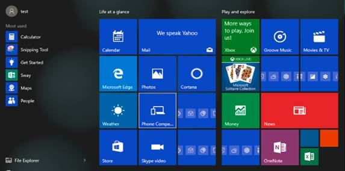

#### 验证恢复

1.  确认您的自定义，还原恢复之后，而且他们继续通过运行下面的入口点的**刷新您的 PC**和**重置您的 PC**功能正常工作︰

    -   Settings

        1. 从开始菜单上，单击**设置**。

        2. 在设置应用程序中，单击**更新和安全**，然后单击**恢复**。

        3. 单击**重置此电脑**下的**开始**，然后按照屏幕上的说明。

    -   Windows RE

        1. 从 Windows RE 中的**选择一个选项**屏幕中，单击**疑难解答**。

        2. 单击**重置此计算机**，然后按照屏幕上的说明。

1.  验证恢复介质可以创建，然后通过运行的裸机恢复功能来验证其功能︰

    1.  启动**创建恢复驱动器**从控制面板。

    2.  请按照屏幕上的说明创建 USB 恢复驱动器。

    3. 引导的 USB 恢复驱动器的 PC。

    4. 从**选择选项**屏幕中，单击**疑难解答**。

    5. 单击**恢复从驱动器**中，然后按照屏幕上的说明。

注意︰ 按钮重置用户界面经过重新设计，在 Windows 10。 **将文件保存**选项用户界面中的现在对应于**刷新您的 PC**功能，而**删除所有内容**的选项对应于**重置您的 PC**功能。 验证可以创建介质的恢复。

### 最后装运

Oem 必须至少一次，打开 PC 电源并允许专业化配置传递的 Windows 安装程序完成之前向客户发运电脑。

专业化的配置阶段将硬件特定的信息添加到 PC 和 Windows OOBE 出现时完成。

请参阅[OEM 策略文档](https://myoem.microsoft.com/oem/myoem/en/topics/Licensing/roylicres/ost2016/Pages/COMM-Win10-OPD-RTM-Now-Avail.aspx)。

### 创建恢复媒体

选择**选项 1**以创建恢复媒体制造图像相同。 这是默认设置，并建议恢复介质配置选项，但请记住制造图像可能会大于 4.6 GB 大小。 如果是，您使用的 DVD 作为恢复介质恢复文件的大小将超过 DVD 容量。

#### 选项 1︰ 从制造自定义映像创建恢复媒体

1.  在技术人员计算机上，它是用作恢复媒体制造映像的装入。 装载的最终图像。

        Dism /Mount-Wim /WimFile:E:\Images\FinalImage.wim /index:1 /MountDir:C:\mount\windows 
                                                                                            
        (where E:\ is the volume label of **USB-B**)      
        
1.  创建 Windows PE 的文件夹结构。 用提升的权限运行部署和图像处理工具环境，键入︰

    如果您使用**x64** Windows 10 图像︰
    
        copype amd64 C:\resetmedia
    
    如果您使用 Windows 10 的**x86**映像︰
    
        copype x86 C:\resetmedia
    
1.  带有 Windows RE 映像的装入的制造图像替换默认 Windows PE 启动映像 (Boot.wim)。

        xcopy C:\mount\windows\Windows\System32\Recovery\winre.wim C:\resetmedia \media\sources\boot.wim /H

1.  卸载 Windows 映像。

        dism /Unmount-Image /MountDir:C:\mount\windows /Discard 

1.  将 Windows 映像复制到 Windows PE 正在恢复媒体图像的文件夹。

        copy E:\Images\FinalImage.wim C:\resetmedia \media\sources\install.wim 
                                                                               
        (where E:\ is the volume label of **USB-B**)  
        
1.  运行部署和图像处理工具环境并进行 iso 文件。

        Makewinpemedia /iso C:\resetmedia C:\MyRecoveryImage.iso 

1.  过程完成后，右键单击 RecoveryImage.iso，然后选择**刻录光盘映像**。

2.  恢复媒体将系统引导到 Windows 10 恢复屏幕︰

    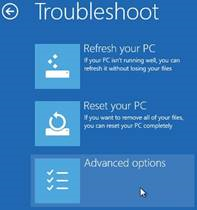

有关创建的恢复映像的详细信息，请参阅[的裸露金属的重置恢复︰ 在部署新设备的过程创建恢复媒体](create-media-to-run-push-button-reset-features-s14.md)。

#### 选项 2︰ 从基本的 Windows 10 OPK 创建恢复媒体

选择**选项 2** ，使用基本的 Windows 10 OPK 从头创建恢复媒体。

1.  将基本的 Windows 10 映像 (**USB B**\myWindows) 复制到一个名为"my_distribution"位于 c︰ 文件夹\.

        md C:\my_distribution                                                    
                                                                                
        xcopy /s E:\myWindows\*.\* C:\my_distribution\                        
                                                                                
        md C:\mount\boot                                                          
                                                                                
        md C:\mount\windows                                                       
                                                                                
        copy E:\Images\FinalImage.wim C:\my_distribution\sources\install.wim  
    
    （其中 E:\ 是**USB B**卷标）                             

##### 将语言包添加到 Windows 安装程序

1.  以便将语言包添加到 Windows 安装程序，必须将语言包文件添加到的目标 Windows distributon install.wim 和 winre.wim 的图像。

2.  第二个映像装载 （索引 2） Boot.wim 中使用**Dism /Mount-Image**命令的本地装入目录。 例如︰

        Dism /mount-image /imagefile:C:\my_distribution\sources\boot.wim /index:2 /mountdir:C:\Mount\boot

1.  添加 Windows PE 安装可选组件，并为已装载的映像使用**Dism /Add-Package**命令为您想要支持的每种语言的语言包。 Windows PE 语言包有 Windows ADK。 例如︰

        Dism /image:C:\mount\boot /add-package /packagepath:"C:\Program Files (x86)\Windows Kits\10\Assessment and Deployment Kit\Windows Preinstallation Environment\amd64\WinPE_OCs\fr-fr\lp.cab"                        
                                                                                                                                                                                                                                 
        Dism /image:C:\mount\boot /add-package /packagepath:"C:\Program Files (x86)\Windows Kits\10\Assessment and Deployment Kit\Windows Preinstallation Environment\amd64\WinPE_OCs\fr-fr\WinPE-Setup_fr-fr.cab"         
                                                                                                                                                                                                                                 
        Dism /image:C:\mount\boot /add-package /packagepath:"C:\Program Files (x86)\Windows Kits\10\Assessment and Deployment Kit\Windows Preinstallation Environment\amd64\WinPE_OCs\fr-fr\WinPE-Setup-Client_fr-fr.cab"  

1.  日语 (JA-JP)，朝鲜 (KO-KR) 和中文 （zh 香港、 ZH-CN，ZH-TW），您必须添加其他字体支持到图像。 例如，若要添加日语字体的支持，请输入以下命令。 例如︰

        Dism /image:C:\mount\boot /add-package /packagepath:"C:\Program Files (x86)\Windows Kits\10\Assessment and Deployment Kit\Windows Preinstallation Environment\amd64\WinPE_OCs\WinPE-FontSupport-JA-JP.cab" 

1.  重新创建 Lang.ini 文件，以反映使用**Dism /Gen-LangINI**命令附加的语言支持。

        Dism /image:C:\mount\boot /gen-langINI /distribution:C:\my_distribution 

1.  通过使用 DISM 更改 Windows 安装程序的默认语言。 例如︰

        Dism /image:C:\mount\boot /Set-SetupUILang:fr-FR /distribution:C:\my_distribution 

1.  保存您的更改回使用**Dism 卸载 — 图像 /Commit**命令的图像。

        Dism /unmount-image /mountdir:C:\mount\boot /commit 

1.  如果默认 boot.wim 图像中添加字体支持日语 (JA-JP)、 朝鲜 (KO-KR) 或中文 （zh 香港、 ZH-CN，ZH-TW），您还必须向 Boot.wim 文件中的第一个图像 （索引 1） 添加字体支持。

    使用**Dism /Mount-Image**命令来装载 Boot.wim 文件到本地装载目录中的第一个图像 （索引为 1）。 例如︰

        Md C:\mount\boot1                                                                                      
                                                                                                           
        Dism /mount-image /imagefile:C:\my_distribution\sources\boot.wim /index:1 /mountdir:C:\Mount\boot1  

1.  添加相同的字体支持添加到上一步中的 boot.wim 默认启动映像。 例如，若要添加日语字体的支持，请输入以下命令︰

        Dism /image:C:\mount\boot1 /add-package /packagepath:"C:\Program Files (x86)\Windows Kits\10\Assessment and Deployment Kit\Windows Preinstallation Environment\amd64\WinPE_OCs\WinPE-FontSupport-JA-JP.cab" 

1.  保存您的更改回使用**Dism 卸载映像 /Commit**命令的图像︰

        Dism /unmount-image /mountdir:C:\mount\boot1 /commit 

##### 使用 oscdimg 工具创建可启动的 DVD

1.  使用管理员提升开始**部署和图像处理工具**。

2.  使用以下参数运行**oscdimg**工具。 例如︰

        oscdimg -m -o -u2 -udfver102 -bootdata:2#p0,e,bc:\my_distribution\boot\etfsboot.com#pEF,e,bc:\my_distribution\efi\microsoft\boot\efisys.bin c:\my_distribution c:\myISOname.iso

       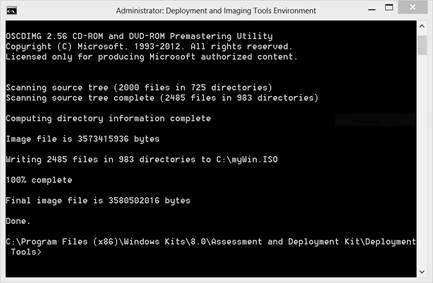

1.  刻录到新 DVD.iso 文件。 此 DVD 将恢复媒体。

2.  恢复媒体将引导至 Windows 安装程序可通过删除您的文件以常规的方式安装 Windows 10。

