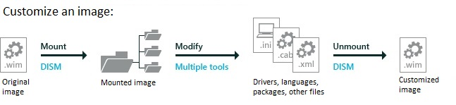

# OEM Windows 桌面部署和成像实验室

准备进行生成和测试 Windows 10 台式 Pc？ 该实验室提供了创建基本的图像，以及使用命令行工具对它们进行更新的策略。 可编写脚本的命令，以帮助您快速自定义为特定的市场，以满足客户需求的新图像。

此实验室︰ 中的新增功能 

* 与各自为政的供应包现在可以捕获并在部署期间，一次一个地应用 Windows 桌面应用程序。 这样可以避免一些参与泛化和重新捕获映像的费时的步骤。

让我们开始吧 ！

**准备工作**

*  [规划︰ 为不同的观众的自定义引用图像](planning-create-different-product-designs-for-different-market-segments-sxs.md)

**部署映像**

*  [获取自定义 Windows 所需的工具](get-the-tools-needed-to-customize-windows-sxs.md)
*  [获取示例脚本](windows-deployment-sample-scripts-sxs.md)
*  [实验室 1︰ 安装 Windows PE](install-windows-pe-sxs.md)
*  [实验室 2︰ 部署 Windows 使用脚本](deploy-windows-with-a-script-sxs.md)

**自定义窗口图像**

在这些实验室中，您将修改 Windows 映像 (install.wim)。 可以按任意顺序执行这些任务的大部分，而少数具有依赖项︰
*    **添加更新语言之前。** 其中包括的修补程序、 常规分发版本或服务包。 如果您以后添加更新，您将需要重新添加该语言。
*    **在应用程序之前添加语言**。 这包括通用的 Windows 应用程序和桌面应用程序。 如果您以后添加一种语言，您需要重新添加应用程序。

若要使所做的更改，将图像内容装入一个临时文件夹中，并使用 DISM 之类的工具来进行更改。 卸载映像并重新部署。
   

*  [实验室 3︰ 添加设备驱动程序 （.inf 样式）](add-device-drivers.md)（包括装载映像基础知识）
*  [实验室 4︰ 添加更新和升级版](servicing-the-image-with-windows-updates-sxs.md)
*  [实验室 5︰ 添加语言](add-drivers-langs-universal-apps-sxs.md)
*  [实验室 6︰ 添加通用的 Windows 应用程序，启动图块和任务栏的针脚](add-universal-apps-sxs.md)
*  [实验室 7︰ 更改设置，输入产品密钥，并使用应答文件 (unattend.xml) 运行脚本](update-windows-settings-and-scripts-create-your-own-answer-file-sxs.md)
*  [实验 8︰ 添加许可协议 (OOBE.xml)](add-a-license-agreement.md)
*  [实验室 9︰ 从 Windows （审核模式） 进行的更改](prepare-a-snapshot-of-the-pc-generalize-and-capture-windows-images-blue-sxs.md)

**最后的任务**

*  [实验室 10︰ 更新恢复映像](update-the-recovery-image.md)
*  [实验室 11︰ 缩小图像大小](shrink-your-image-size.md)
*  [实验室 12︰ 添加桌面应用程序和设置变得分散化配置软件包 (Spp)](add-desktop-apps-wth-spps-sxs.md)（包括 Windows 应用商店设置，Microsoft Office）
