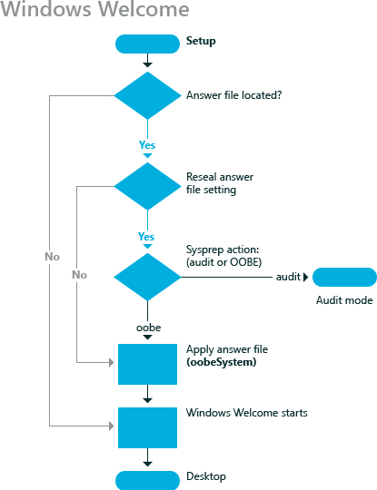

# oobeSystem

在**oobeSystem**配置阶段配置在最终用户首次启动体验，也称为的全新体验 (OOBE) 过程中应用的设置。 **OobeSystem**配置阶段的设置进行处理之前用户第一个登录到 Windows®。

出的体验 (OOBE) 运行在用户启动新配置的计算机第一次。 OOBE 之前运行 Windows 外壳程序或任何其他软件运行，并执行一组少的配置和运行 Windows 所需的任务。

下图说明了最终用户首次启动新配置的计算机时，会发生的过程。 其结果是 OOBE 或用户首次启动体验。

您可以将 Windows 配置为通过使用**/oobe**选项运行**sysprep**命令引导至 OOBE。 默认情况下，运行 Windows 安装程序后 OOBE 启动。

## 相关的主题

[配置阶段的工作](how-configuration-passes-work.md)

[auditSystem](auditsystem.md)

[auditUser](audituser.md)

[一般化](generalize.md)

[offlineServicing](offlineservicing.md)

[专门负责](specialize.md)

[windowsPE](windowspe.md)

 

 

