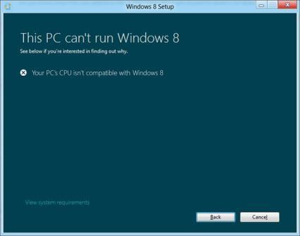

# <a name="paenxsse2-support-requirement-guide-for-windows-8"></a>Windows 8 的 PAE/NX/SSE2 支持要求指南


本主题描述处理器支持 PAE/NX/SSE2 要求在 Windows 8 的错误情况和计算机不满足要求时，客户可能会遇到的情况。

此内容适用于 Windows 8 和 Windows Server® 2012年。

**本主题︰**

-   [概述](#overview)

-   [影响范围](#scope)

-   [支持要求](#support)

-   [常见问题解答](#faq)

## <a name="span-idoverviewspanspan-idoverviewspanoverview"></a><span id="overview"></span><span id="OVERVIEW"></span>概述


### <a name="span-idno-executenxspanspan-idno-executenxspanspan-idno-executenxspanno-execute-nx"></a><span id="No-eXecute__NX_"></span><span id="no-execute__nx_"></span><span id="NO-EXECUTE__NX_"></span>不执行 (NX)

不执行 (NX) 是一种允许被标记为不可执行的内存页面的处理器功能。 该功能使 CPU 要帮助防止恶意软件攻击的系统。 NX 功能可防止恶意软件的可执行代码被放在可访问的内存区域中。 Windows 8 要求系统具有支持 NX，处理器和 NX 必须为重要的安全保护措施，有效地工作并避免潜在的安全漏洞开启。

在本主题中，的术语*NX*专门指的就是位 NX 处理器由 AMD 或由 Microsoft Windows 中的数据执行保护 (DEP) 功能支持英特尔的等效 XD 处理器位。

DEP 可帮助阻止恶意代码数据页执行。 32 位版本的 Windows 使用 DEP 支持以下功能之一︰

-   AMD 定义不执行 (NX) 页面保护处理器功能

-   英特尔定义执行禁用 (XD) 位功能

若要使用这些处理器功能，x86 处理器 （32 位） 必须在物理地址扩展 (PAE) 模式下运行。 64 位版本的 Windows 64 位扩展使用 NX 处理器功能，处理器英特尔安腾处理器家族 (IPF) 的访问权限页表项 (PTE) 字段中的某些值。

DEP，除了地址空间布局随机化 (ASLR) 进入可执行映像随机位置时引导系统，从而使其更难预知运行恶意代码。 仅当一起使用时，ASLR 和 DEP 都有效。 必须为以下两个重要 Windows 采取安全防范措施才能有效地启用 NX。 有关详细信息，请参阅[Windows ISV 软件安全防御措施](http://go.microsoft.com/fwlink/p/?LinkId=698535)。

### <a name="span-idphysicaladdressextensionpaespanspan-idphysicaladdressextensionpaespanspan-idphysicaladdressextensionpaespanphysical-address-extension-pae"></a><span id="Physical_Address_Extension__PAE_"></span><span id="physical_address_extension__pae_"></span><span id="PHYSICAL_ADDRESS_EXTENSION__PAE_"></span>物理地址扩展 (PAE)

处理器必须运行在物理地址扩展 (PAE) 模式下使用 NX 处理器功能。 PAE 是处理器的功能，使 x86 处理器访问超过 4 GB 的物理内存可用版本的 Windows 上。 英特尔安腾和 x64 处理器的体系结构可以以本机方式，访问超过 4 GB 的物理内存，并不提供 PAE 的等效项。 在基于 x86 的系统上运行的 Windows 32 位版本支持 PAE。

具有支持 NX 功能的处理器的系统上启用 DEP 时，会自动启用 PAE。

### <a name="span-idstreamingsimdextensions2sse2spanspan-idstreamingsimdextensions2sse2spanspan-idstreamingsimdextensions2sse2spanstreaming-simd-extensions-2-sse2"></a><span id="Streaming_SIMD_Extensions_2__SSE2_"></span><span id="streaming_simd_extensions_2__sse2_"></span><span id="STREAMING_SIMD_EXTENSIONS_2__SSE2_"></span>SIMD 流技术扩展 2 (SSE2)

所有处理器，都支持 NX 还都支持单指令多数据扩展指令集 2 (SSE2)。 SSE2 是英特尔单指令多数据 (SIMD) 处理器附属的指令集。 AMD 还包括皓龙和速龙 64 区域 AMD64 处理器的 SSE2 支持。 所有处理器，都支持 NX 还都支持 SSE2。 许多 Windows 8 应用程序必须具有的 SSE2 指令集的代码路径。 SSE2 是 Windows 8 的要求。

## <a name="span-idscopespanspan-idscopespanscope-of-implications"></a><span id="scope"></span><span id="SCOPE"></span>影响范围


所有现代的处理器支持 NX。 NX 可以在 BIOS 中关闭。 根据可用的遥测数据，显示该 1%的系统正在运行 Windows® 7 有 NX 由于配置不正确的 BIOS 设置中关闭。

NX 要求 32 位版本的 Windows 上支持 PAE 的处理器。 所有 64 位处理器都支持 NX，因为这些地址窗口化扩展 (AWE) 的注意。 因此，旧的 32 位处理器不是支持 PAE 的问题也没有工单协议影响 Windows Server 含义 （Windows Server 2012 仅 64 位）。 处理器要求不会影响在现代系统上，客户或系统满足徽标要求的 Windows 7，因为这些系统的支持 PAE 的 32 位处理器，支持 NX 并使 NX 打开。 只有少数不支持 PAE/NX 非常旧的 32 位处理器上运行的 Windows 7 的客户会受到影响。

Windows 8 和 Windows Server 2012 要求 PAE。 此要求会影响少数较旧的硬件不支持 PAE 的客户。 错误配置的虚拟机 (Vm) 上安装有 Windows 8 时出现故障。 Windows 安装程序出现错误 0xc0000260 安装失败并回滚到 Windows 7。

默认情况下，Visual Studio 发出 SSE2 指令集。 请联系系统上不支持 SSE2，老款处理器[SSE2 指令集生成指定 /arch:SSE，则](http://connect.microsoft.com/VisualStudio/feedback/details/565959)所述这些说明故障的应用程序。

## <a name="span-idsupportspanspan-idsupportspansupport-requirements"></a><span id="support"></span><span id="SUPPORT"></span>支持要求


本部分介绍的措施，以确保处理器上运行的 Windows 8 的系统满足 PAE、 NX 和 SSE2 支持需求。

### <a name="span-idwindows8logorequirementspanspan-idwindows8logorequirementspanspan-idwindows8logorequirementspanwindows-8-logo-requirement"></a><span id="Windows_8_Logo_requirement"></span><span id="windows_8_logo_requirement"></span><span id="WINDOWS_8_LOGO_REQUIREMENT"></span>Windows 8 的徽标要求

Windows 8 硬件认证要求要求所有驱动程序必须正常运行，以及执行保护，以确保适当的设备和驱动程序的系统行为。 驱动程序不能执行代码从堆栈、 页面缓冲的池和会话池。 驱动程序不能加载时启用了 PAE 模式。 系统固件必须拥有 NX 并不必须将 DEP 策略设置为**始终关闭**。 目的是为了验证系统符合此 NX 支持要求认证测试。

有关详细信息，请参阅[Windows 硬件认证要求](http://go.microsoft.com/fwlink/p/?linkid=329939)。

### <a name="span-idhardwarecompatibilitycheckinwindowssetupspanspan-idhardwarecompatibilitycheckinwindowssetupspanspan-idhardwarecompatibilitycheckinwindowssetupspanhardware-compatibility-check-in-windows-setup"></a><span id="Hardware_compatibility_check_in_Windows_Setup"></span><span id="hardware_compatibility_check_in_windows_setup"></span><span id="HARDWARE_COMPATIBILITY_CHECK_IN_WINDOWS_SETUP"></span>在 Windows 安装的硬件的兼容性检查

Windows 安装程序在硬件的兼容性检查的 PAE、 NX 和 SSE2 支持安装系统上。 出故障的处理器支持 PAE、 NX 和 SSE2 要求的系统报告为硬块的 Windows 8 中兼容性问题报告中，并显示此邮件︰**您的 PC CPU 不兼容 Windows 8**。



**图 1 CPU 不兼容的错误消息**

**请注意**  
此支持要求检查才可用于新的 Windows 安装程序和升级助手。 Windows 8 安装媒体中，不包括此项检查的源文件夹中包括其他版本的 Windows 安装。 尝试使用该备用版本的 Windows 安装程序不能满足 PAE/NX/SSE2 的系统上的客户支持安装过程要求遇到错误并回滚到以前的操作系统。

在从介质或网络安装 Windows 部署服务 (WDS) 如引导，没有兼容性检查发生在 Windows 安装过程。 对于这些情况，系统没有 NX 或 SSE2 支持将导致错误检查 （所述以下**内核增强**部分） 在安装程序尝试启动 Windows。

 

### <a name="span-idkernelenhancementspanspan-idkernelenhancementspanspan-idkernelenhancementspankernel-enhancement"></a><span id="Kernel_enhancement"></span><span id="kernel_enhancement"></span><span id="KERNEL_ENHANCEMENT"></span>内核增强

以满足 Windows 8 的必要条件 NX 功能和 SSE2 指令支持，Windows 8 内核初始化过程中检查这些功能。 系统不支持 NX 或 SSE2 无法初始化了 Windows 8 的内核。 可以禁用 NX 固件中的系统可以选择重写;因此，错误配置的固件不会导致启动失败。 尝试引导系统在进行错误检测没有 NX 或 SSE2 支持的结果。 用户得到不支持\_处理器代码 (0x0000005D) 错误，以及四行在 32 位系统上的信息︰

-   行 1 – 指示已丢失的功能的代码和 CPU 的标识符

-   2-4 – 供应商 ID 字符串行

在 64 位系统上，错误检查显示同一个不支持\_处理器代码为在 32 位系统上，以及信息的以下四行︰

-   行 1 – 标准功能寄存器的内容

-   线路 2 – 扩展的功能寄存器的内容

-   3-4 – 这两个 0 的行

## <a name="span-idfaqspanspan-idfaqspanfaqs"></a><span id="faq"></span><span id="FAQ"></span>常见问题解答


### <a name="span-idsupportnxspanspan-idsupportnxspanhow-do-i-know-if-my-system-supports-nx-or-sse2"></a><span id="supportnx"></span><span id="SUPPORTNX"></span>如何知道我的系统是否支持 NX 或 SSE2？

可以使用[Coreinfo](http://go.microsoft.com/fwlink/p/?linkid=246771)命令行实用程序来获取系统的处理器信息并查看 PAE、 NX 和 SSE2 输出列表中的条目。 A**\***的受支持的功能名称旁边显示的字符。 A**-**字符显示如果不支持该功能。 例如︰

``` syntax
Coreinfo v3.04 - Dump information on system CPU and memory topology
Copyright (C) 2008-2012 Mark Russinovich
Sysinternals - www.sysinternals.com

AMD Athlon(tm) 64 X2 Dual Core Processor 4600+
x86 Family 15 Model 75 Stepping 2, AuthenticAMD
HTT*       Hyperthreading enabled
HYPERVISOR      -       Hypervisor is present
VMX             -       Supports Intel hardware-assisted virtualization
SVM             *       Supports AMD hardware-assisted virtualization
EM64T           *       Supports 64-bit mode

SMX             -       Supports Intel trusted execution
SKINIT          -       Supports AMD SKINIT
EIST            -       Supports Enhanced Intel Speedstep

NX              *       Supports no-execute page protection
PAGE1GB         -       Supports 1 GB large pages
PAE             *       Supports > 32-bit physical addresses
PAT             *       Supports Page Attribute Table
PSE             *       Supports 4 MB pages
PSE36           *       Supports > 32-bit address 4 MB pages
PGE             *       Supports global bit in page tables
SS              -       Supports bus snooping for cache operations
VME             *       Supports Virtual-8086 mode

FPU             *       Implements i387 floating point instructions
MMX             *       Supports MMX instruction set
MMXEXT          *       Implements AMD MMX extensions
3DNOW           *       Supports 3DNow! instructions
3DNOWEXT        *       Supports 3DNow! extension instructions
SSE             *       Supports Streaming SIMD Extensions
SSE2            *       Supports Streaming SIMD Extensions 2
SSE3            *       Supports Streaming SIMD Extensions 3
SSSE3           -       Supports Supplemental SIMD Extensions 3
SSE4.1          -       Supports Streaming SIMD Extensions 4.1
SSE4.2          -       Supports Streaming SIMD Extensions 4.2
……..
……..
```

如果 PAE 显示为输出中不支持 Coreinfo，这意味着系统已不能 PAE 和无法支持 NX 的处理器。 如果 PAE 则会显示为支持，但不是显示 NX，支持 Coreinfo 的输出︰

-   由 CPU 制造商联系，以确定是否在系统上的处理器支持 NX 发布的功能集，请参阅。

-   如果处理器有 NX 支持，系统可能有的错误配置的 BIOS 设置 NX 支持选项。

### <a name="span-idturnonnxspanspan-idturnonnxspanif-nx-is-supported-on-my-system-how-do-i-turn-on-nx"></a><span id="turnonnx"></span><span id="TURNONNX"></span>如果 NX 支持我的系统上，如何打开 NX？

在系统中具有 NX 支持，请参阅系统制造商的指南，以进入 BIOS 设置选项并在**安全**选项卡打开 NX 支持下的 NX 或 XD 设置查找。 如果系统上没有 NX 支持的 BIOS 设置，您可能需要与制造商联系以更新 BIOS。

**请注意**  
在 64 位系统上，如果 NX 支持系统，通过系统配置的设置不允许设置 DEP 策略设置为**始终关闭**。 系统范围的 DEP 的配置有关的详细信息，请参阅[Windows XP 服务包 2，Windows Server 2003 和 Windows XP Tablet PC 版 2005 年中的数据执行保护 (DEP) 功能的详细的说明](http://support.microsoft.com/kb/875352)。

 

针对 Windows 8 系统上的处理器必须支持 NX 和 SSE2 系统成功启动。 如果系统中安装了支持，但这些设置配置不正确，选项将被覆盖之前在内核引导系统。

### <a name="span-idwhatshouldidowhenwindows8failedtoinstallonavmwitherror0x0000260spanspan-idwhatshouldidowhenwindows8failedtoinstallonavmwitherror0x0000260spanspan-idwhatshouldidowhenwindows8failedtoinstallonavmwitherror0x0000260spanwhat-should-i-do-when-windows-8-failed-to-install-on-a-vm-with-error-0x0000260"></a><span id="What_should_I_do_when_Windows_8_failed_to_install_on_a_VM_with_error_0x0000260_"></span><span id="what_should_i_do_when_windows_8_failed_to_install_on_a_vm_with_error_0x0000260_"></span><span id="WHAT_SHOULD_I_DO_WHEN_WINDOWS_8_FAILED_TO_INSTALL_ON_A_VM_WITH_ERROR_0X0000260_"></span>在出现错误 0x0000260 虚拟机上安装 Windows 8 失败时，该怎么办？

如果 VM 支持 NX 的系统上，必须在中启用 PAE/NX 的 VM 设置或配置管理器时设置 Windows 8 VM。 有关如何启用 PAE/NX VM 的请参阅虚拟化产品安装指南中的说明进行操作。

**请注意**  
如果您尝试在一个位于正在运行的已禁用的 NX 的 Windows 版本的系统的虚拟机上安装 Windows 8，您必须按照中的说明[如何知道我的系统是否支持 NX 或 SSE2？](#supportnx)和[如果 NX 支持我的系统上，如何打开 NX？](#turnonnx)之前可以对虚拟机启用 PAE/NX 系统上启用 NX。

 

 

 


