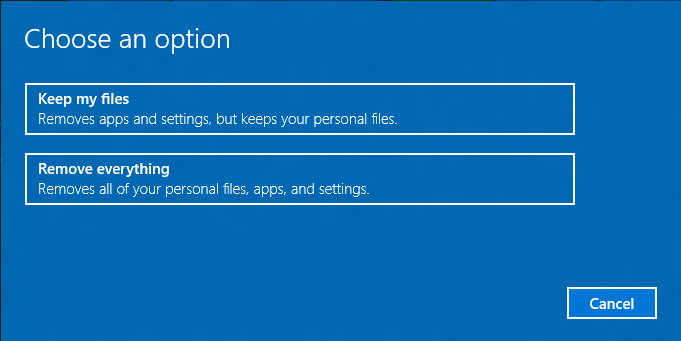

# 依靠以点击方式重置

本主题适用于原始设备制造商 (Oem) 想要将按钮重置功能添加到 Windows 10 桌面计算机制造工艺。 如果您想要重置运行 Windows 10 的计算机的用户，请参阅[Windows 10 中的恢复选项](http://windows.microsoft.com/en-us/windows-10/windows-10-recovery-options)。

依靠以点击方式重置是一个恢复工具，同时保留数据和重要的自修复操作系统。 它减少了自定义恢复应用程序需要用户提供多个恢复选项，并能够自信地修复自己的计算机。

依靠以点击方式重置桌面版本 （家庭、 Pro、 企业和教育），包含在 Windows 10 和 Windows 8 中引入了。

## Windows 10 中的新增功能

在第 10 Windows 版本 1607年按钮重置进行了更新以包括以下更改︰

-   **改进可靠性︰**设置应用程序从启动按钮重置功能时，Windows 将扫描 Windows 组件存储中损坏的系统文件。 是否找到损坏的文件，并可以下载通过 Windows Update 的替换部件，它会自动修复该问题。 尽管这会增加整体的恢复时间，但它提高了计算机的可靠性。
-   **从失败重置恢复︰**在 Windows 10、 版本 1507年和 Windows 10 版本 1511年过程中出现的故障重置几乎总是呈现 PC 无法启动/恢复这台电脑。 这项功能已经过重新设计此纪念日更新以支持有限的回滚功能，如果计算机在 Windows RE 时出现问题。
-   **从恢复媒体启动恢复选项︰**从恢复介质启动 PC 时，刷新此 PC 和重置此 PC 的功能不再受支持。 从介质引导时可用只按钮重置功能是裸机恢复 （即从驱动器中恢复）。

以前版本的 Windows 10 提供点击式重置的以下改进︰

-   **图像的恢复**︰ 按钮重置不再需要或在本地分区或媒体支持单独的恢复映像。 这大大减少了支持功能，所需的磁盘空间并使恢复可能甚至在设备上存储容量有限。
-   **恢复为已更新状态**︰ 按钮重置功能立即恢复操作系统 (OS) 和驱动程序 （包括基于 INF 驱动程序包的一部分安装的设备小程序），为已更新状态。 这可以减少用户必须执行一次恢复后重新安装操作系统更新和驱动程序花费的时间。

依靠以点击方式重置用户体验不断提供的自定义机会。 制造商可以插入自定义脚本，安装应用程序或保留在可扩展性点的其他数据。

以下按钮重置功能可供用户与 Windows 10 台 Pc 和设备︰

-   **刷新您的 PC**通过重新安装 OS，同时保留用户数据、 用户帐户和重要设置修复的软件问题。 所有其他预安装自定义项将还原到其出厂状态。 在 Windows 10 此功能将不再保留用户已获取 Windows 应用程序。
-   **重置您的 PC**通过重新安装 OS、 删除所有用户帐户和内容 （如数据、 Windows 桌面应用程序和通用的 Windows 应用程序），并还原到出厂状态的预安装自定义项准备 PC 回收或转让所有权。
-   **裸机恢复**还原默认或预配置的分区系统磁盘上的布局，并重新安装操作系统和预安装自定义项从外部介质。

<table>
<colgroup>
<col width="50%" />
<col width="50%" />
</colgroup>
<thead>
<tr class="header">
<th align="left">内容类型</th>
<th align="left">参考</th>
</tr>
</thead>
<tbody>
<tr class="odd">
<td align="left">
<strong>概述</strong>
</td>
<td align="left">
[依靠以点击方式重置功能的工作方式](how-push-button-reset-features-work.md) | [针对常见的自定义的恢复策略](recovery-strategy-for-common-customizations.md) | [Siloed 设置包](siloed-provisioning-packages.md) 
</td>
</tr>
<tr class="even">
<td align="left">
<strong>硬盘安装</strong>
</td>
<td align="left">
[硬盘驱动器和分区](hard-drives-and-partitions.md) | [基于 UEFI/GPT 的硬盘分区](configure-uefigpt-based-hard-drive-partitions.md) | [基于 BIOS/MBR 硬盘分区](configure-biosmbr-based-hard-drive-partitions.md)
</td>
</tr>
<tr class="odd">
<td align="left">
<strong>操作</strong>
</td>
<td align="left">
[部署使用扫描状态的按钮重置功能](deploy-push-button-reset-features.md) | [裸露金属的重置恢复︰ 使用户可以创建恢复媒体](bare-metal-resetrecovery-enable-your-users-to-create-media-and-to-recover-hard-drive-space.md) | [裸露金属的重置恢复︰ 在部署新设备的过程创建恢复媒体](create-media-to-run-push-button-reset-features-s14.md) | [添加到按钮重置功能脚本](add-a-script-to-push-button-reset-features.md) | [创建具有 Windows 桌面应用程序的资源调配软件包](combine-provisioning-packages-into-a-new-image.md) 
</td>
</tr>
<tr class="even">
<td align="left">
<strong>配置文件</strong>
</td>
<td align="left">
[ResetConfig XML 参考](resetconfig-xml-reference-s14.md)
</td>
</tr>
<tr class="odd">
<td align="left">
<strong>这些技术由按钮重置</strong>
</td>
<td align="left">
[Windows 恢复环境](windows-recovery-environment--windows-re--technical-reference.md) | [Windows PE (WinPE)](winpe-intro.md) | [扫描状态](deploy-push-button-reset-features.md)
</td>
</tr>
</tbody>
</table>

 

 

 

