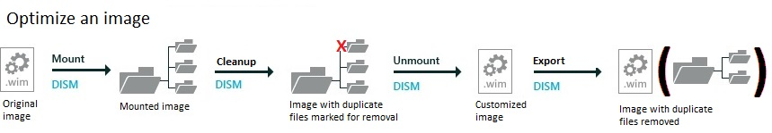

# <a name="lab-11-shrink-your-image-size"></a>实验室 11︰ 缩小图像大小

优化您的 Windows 映像保存在 PC 上，以到新设备，提高传输速度并更容易地存储空间。

要做到这一点，我们将使用 DISM 工具检查重复的文件。 我们会将标记为删除的文件。 直到我们导出映像，则不会删除这些文件。 

   


我们还将优化 WinRE 图像，其中包括在 Windows 10 和 Windows 服务器 2016年的图像，并最终将被复制到目标计算机或设备上的 Windows RE 工具分区。 要对其进行修改，将装载 Windows 映像，然后装载 WinRE 映像内。 进行更改，卸载 WinRE 映像，然后卸载 Windows 映像。 

   

## <a name="span-idmounttheimagesspanmount-the-images"></a><span id="Mount_the_images"></span>将这些映像装载

**步骤 1︰ 将 Windows 映像安装**

使用步骤，可从[实验室 3︰ 添加设备驱动程序 （.inf 样式）](add-device-drivers.md)安装的 Windows 映像。 短的版本︰

1.  打开命令行以管理员身份 (**开始**> 键入**部署**> 右键单击**部署和图像处理工具环境** > **以管理员身份运行**。)

2.  对该文件进行备份 (`copy "C:\Images\Win10_x64\sources\install.wim" C:\Images\install-backup.wim`)

3.  装入该映像 (`md C:\mount\windows`，然后`Dism /Mount-Image /ImageFile:"C:\Images\install.wim" /Index:1 /MountDir:"C:\mount\windows" /Optimize`)


## <a name="span-idoptimizingtheimagepart1spanspan-idoptimizingtheimagepart1spanspan-idoptimizingtheimagepart1spanstep-2-optimizing-the-image-part-1-optional"></a><span id="Optimizing_the_image_part_1"></span><span id="optimizing_the_image_part_1"></span><span id="OPTIMIZING_THE_IMAGE_PART_1"></span>步骤 2︰ 优化图像，第 1 （可选） 部分

添加语言或 Windows 更新包之后, 可以通过检查重复的文件，并将标记为取代旧的版本来减少图像大小。

1.  优化图像︰

    ``` syntax
    Dism /Image:c:\mount\windows /Cleanup-Image /StartComponentCleanup /ResetBase
    ```

2.  以后，将导出的图像中删除旧的文件。

## <a name="span-idbkmksaveimagespanspan-idbkmksaveimagespanspan-idbkmksaveimagespanstep-3-unmount-the-windows-image"></a><span id="BKMK_SaveImage"></span><span id="bkmk_saveimage"></span><span id="BKMK_SAVEIMAGE"></span>第 3 步︰ 卸载 Windows 映像


-   卸载，然后将图像保存为︰

    ``` syntax
    Dism /Unmount-Image /MountDir:C:\mount\windows /Commit
    ```

## <a name="span-idoptimizingtheimagepart2spanspan-idoptimizingtheimagepart2spanspan-idoptimizingtheimagepart2spanstep-4-optimizing-the-image-part-2-optional"></a><span id="Optimizing_the_image_part_2"></span><span id="optimizing_the_image_part_2"></span><span id="OPTIMIZING_THE_IMAGE_PART_2"></span>步骤 4︰ 优化图像，部分 2 （可选）

如果已经优化图像，您将需要将映像导出以便查看文件大小的更改。 在导出过程中，DISM 删除文件所取代。

1.  将 Windows 映像导出到新的映像文件。

    ``` syntax
    Dism /Export-Image /SourceImageFile:"C:\Images\Win10_x64\sources\install.wim" /SourceIndex:1 /DestinationImageFile:"C:\Images\Win10_x64\sources\install-optimized.wim"
    ```

下一步︰[实验室 12︰ 添加桌面应用程序和设置变得分散化配置软件包 (Spp)](add-desktop-apps-wth-spps-sxs.md)