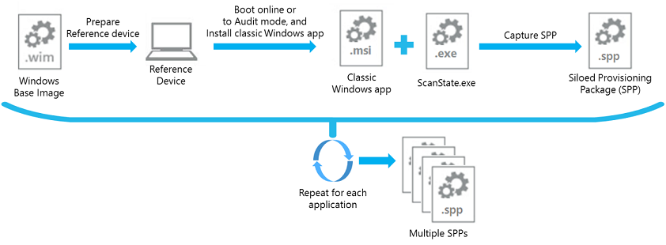
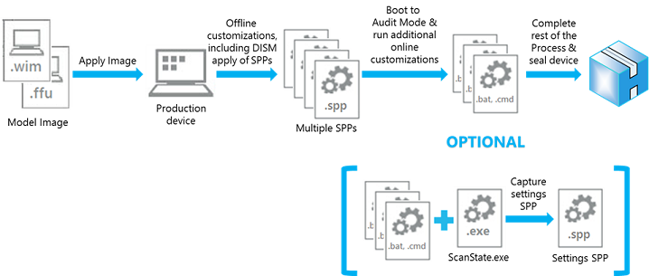
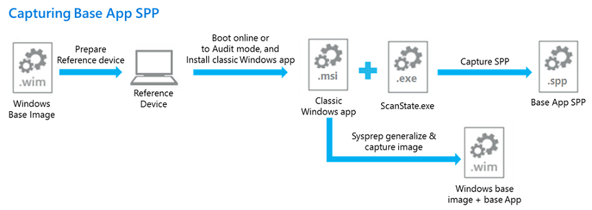
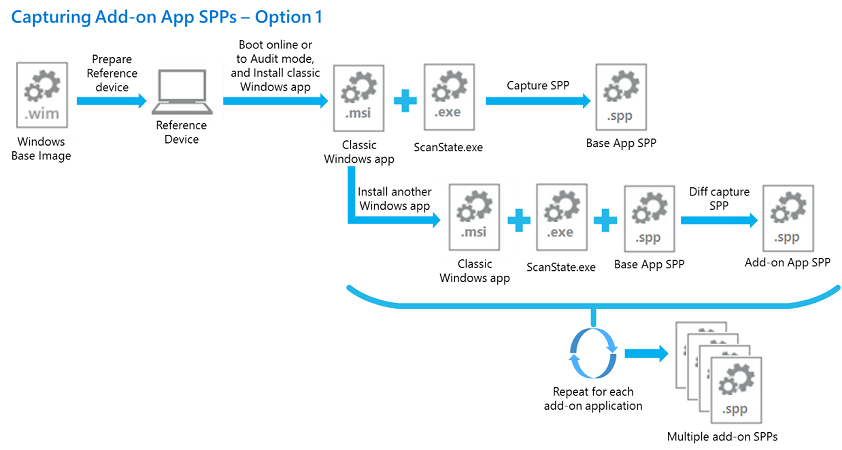
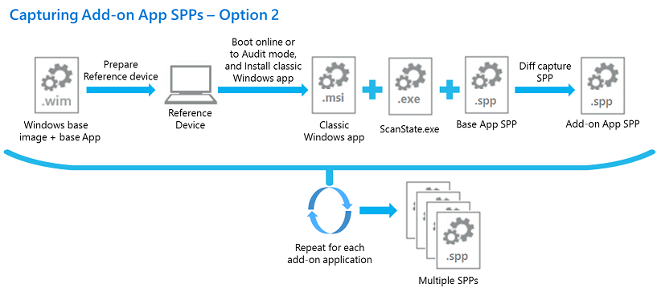
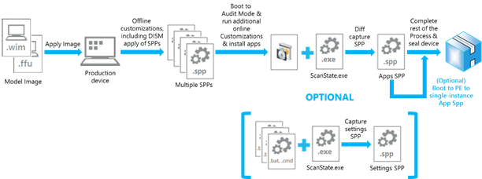

# <a name="siloed-provisioning-packages"></a>各自为政的供应包

孤立供应包是一种新型的供应包可用于 Windows 10，1607年版本。 在传统的供应包可以捕获所有传统的 Windows 应用程序和安装的 Windows 映像的设置、 各自为政的供应包可以分别捕获经典 Windows 应用程序驱动程序和应用程序、 设置或供应以前捕获的数据包的捕获加载项。 这为生产过程提供了更大的灵活性，有助于降低构建在工厂中的基于 Windows 的计算机所需的时间。

## <a name="performance-comparison"></a>性能比较

下表显示了使用 Office 安装 vs 典型工厂占地过程中使用孤立的供应包之间的比较。  当使用孤立的资源调配程序包来安装 Office，基本办公室 en-我们打包，以及加载项办公室 fr-fr 和 Office de de 包捕获作为一个一次性的过程，在成像实验室使用用户状态迁移工具 (USMT) ScanState.exe 实用程序。
下表中的数据被从 Windows 10，1607年版本的桌面映像与虚拟机上运行的示例。  在工厂车间的节约而异的实际时间的数量和所安装的应用程序的大小和物理设备的硬件规范基础。  可以通过计算节省时间︰

(时间到 Sysprep 与启动到审核模式 + 时安装应用程序并以捕获 PPKG 中的应用程序的时间 + _< 可选_> 时间单实例 PPKG) – （适用于 Sysprep 并引导到审核模式的 Spp + 时的时间）

| 阶段/任务 | 工厂使用 Office 安装程序的过程 | 使用孤立的供应包的制作过程 |
|------------|----------------------------------------|----------------------------------------------------|
| 将映像应用到设备 | 4 分钟。                  | 4 分钟。                                             |
| 安装语言包 – fr fr 和消除重复 | 20 分钟。    | 20 分钟。                                            |
| 运行 BCDBoot.exe | 可忽略不计                        | 可忽略不计                                         |
| 运行 DISM 应用各自为政的办公室 en-我们基、 Office fr-fr，以及办公室 de de 包 | N/A | 3 分钟。       |
| 运行 Sysprep 并启动到审核模式 |10 分钟。           | 19 分钟。                                            |
| 安装 Office 2016 en-我们、 fr fr 和消除重复 | 12 分钟。 | N/A                                                |
| 运行扫描状态捕获到配置软件包 （PBR) 的办公室 | 10 分钟。 | N/A                      |
| （可选-磁盘空间不足）单实例存储 Office 文件中提供的包捕获 | 7 分钟。 | N/A |
| **总计**  | **56-63 分钟。**                         | **46 分钟。**                                        |
| **整个应用程序安装时** |              | **快 45-65%**                                  |
| **整体的 E2E 部署时间** |                   | **快 18-30%**                                  |

## <a name="capturing-a-siloed-provisioning-package"></a>捕获各自为政的供应包

USMT ScanState.exe 增强可以捕获单个的经典 Windows 应用程序，并将仅捕获 Windows 命名空间中的组件。 可以指定一个配置文件来缩小要捕获捕获单个经典 Windows 应用程序的组件。 默认配置文件为此目的提供在 Windows ADK，USMT 安装时可以找到以下文件夹中︰

*< %Windows ADK 安装根目录 %>*\User 状态迁移工具\\*< 弧*> \Config_AppsOnly.xml

可以自定义此配置文件，以捕获更多或更少各自为政的供应包中的组件。 此配置文件时在成像实验室中，您只是想要捕获应用程序文件和单个 Win32 应用程序，而非相关的其他设置的设置。 

注意︰ 建议总是启动与干净 Windows 安装并只安装一个应用程序来捕获各自为政的供应包。 这种做法可以防止被包含在包中任何可能有害的设置。 

下面的示例捕获一个经典 Windows 应用程序引用的设备上安装一个孤立供应包︰

```syntax
ScanState.exe /apps:-sysdrive /o /v:13 /config:Config_AppsOnly.xml /ppkg e:\repository\office16_base.spp
```

下表说明的某些参数。

<table border="1" cellspacing="0" cellpadding="0">
    <tbody>
        <tr>
            <td width="96" valign="top">
                <p>
参数 </p>
            </td>
            <td width="528" valign="top">
                <p>
说明 </p>
            </td>
        </tr>
        <tr>
            <td width="96" valign="top">
                <p>
-sysdrive (或 + sysdrive) </p>
            </td>
            <td width="528" valign="top">
                <p>
告诉扫描忽略 Windows 命名空间之外的所有文件夹的状态。 例如，如果文件夹 c:\Folder，该文件夹将捕获运行 /apps 时 (或 /apps: + sysdrive)，但它不会被捕获时使用 /apps 运行:-sysdrive。
                    <br/>
通常使用 + sysdrive，如果您想要捕获到单个的各自为政资源调配的整个状态机的包;如果您想要捕获一个应用程序 （或一组小应用程序），请使用-sysdrive。
                </p>
                <p>
Windows 命名空间是一组通常由 Windows 安装，创建的文件夹︰ </p>
                <ul>
                    <li>
%systemdrive%\Users </li>
                    <li>
%systemdrive%\ProgramData </li>
                    <li>
%systemdrive%\Program 文件 </li>
                    <li>
%systemdrive%\Program 文件 (x86) </li>
                    <li>
%systemdrive%\Windows </li>
                    <li>
%systemdrive%\Inetpub </li>
                </ul>
            </td>
        </tr>
        <tr>
            <td width="96" valign="top">
                <p>
/o </p>
            </td>
            <td width="528" valign="top">
                <p>
覆盖任何现有的数据存储区中。 如果未指定，如果存储库已包含数据将失败扫描状态。
                </p>
            </td>
        </tr>
        <tr>
            <td width="96" valign="top">
                <p>
/v:13 </p>
            </td>
            <td width="528" valign="top">
                <p>
生成表示捕获内容的 MigLog.xml 文件。
                </p>
            </td>
        </tr>
    </tbody>
</table>

/Diff 交换机可以使用 /apps 命令选项，用于捕获应用程序加载项组件相对于父应用程序各自为政的供应包已捕获。 例如︰

```syntax
ScanState.exe /apps:-sysdrive /o /v:13 /config:Config_AppsOnly.xml /diff:e:\repository\office16_base.spp /ppkg e:\repository\office16_fr-fr.spp
```

在 ADK Windows 中提供的另一个配置文件可以用于没有捕获任何应用程序负载捕获各自为政的供应包中的系统设置。  此配置文件可用于包可以放在设备上恢复文件夹以便在工厂占地过程中，最后一步捕获仅系统设置。  在系统恢复期间 PBR 将处理各自为政供应包文件夹中的恢复还原系统设置捕获的包中。  

USMT 安装时，可以在以下文件夹中找到默认配置文件。  此配置文件也是可自定义的。

*< %Windows ADK 安装根目录 %>*\User 状态迁移工具\\*< 弧*> \Config_SettingsOnly.xml

下面的示例捕获设备上的系统设置的各自为政供应包︰

```syntax
ScanState.exe /apps:-appfiles /o /v:13 /config:Config_SettingsOnly.xml /ppkg %systemdrive\Recovery\Customizations\systemsettings.spp
```

例如，假设在工厂地板上，完成所有设备的部署任务并无 Win32 应用程序已安装。 扫描状态可以捕获没有捕获任何应用程序的.spp 文件中使用 Config_SettingsOnly.xml 的系统设置。 各自为政的供应包可以放在恢复文件夹期间 PBR 恢复这些设置。

另外，还有第三个默认配置文件︰

*< %Windows ADK 安装根目录 %>*\User 状态迁移工具\\*< 弧*> \Config_AppsAndSettingsOnly.xml

此配置文件也是可自定义以及旨在捕获最新安装的.spp 或.ppkg 中的 Win32 应用程序和系统设置，并将其放 PBR 用法的恢复文件夹中。 

例如，假设引导到审核模式下在工厂车间的设备后，几个更多的 Win32 应用程序安装并需要捕获。 在这种情况下，有两个选项︰

- 捕获的其他应用程序和其相关的设置中使用的 /diff 交换机和 Config_AppsOnly.xml 的一个.spp。 然后捕获使用扫描状态命令 Config_SettingsOnly.xml 单独.spp 中的系统设置。
- 捕获的其他应用程序和系统设置为使用 /diff 开关和 Config_AppsAndSettings.xml 的一个 SPP。

使用 Config_AppsAndSettingsOnly.xml 文件的另一个例子是想要捕获所有应用程序和设置放在一个.spp 文件，在成像实验室或工厂。 

## <a name="applying-a-siloed-provisioning-package"></a>应用各自为政的供应包

DISM 还改进以支持将各自为政的供应包应用于 Windows 映像已应用的设备上。  新 DISM 的提供商，这是只有 Windows ADK，支持各自为政的供应包。  第 10 Windows 版本 1607，唯一支持的功能是将应用各自为政的供应包。 

应用使用 DISM 各自为政的供应包的功能仅限于支持下列方案︰

- DISM SiloedPackageProvider 不包括在 Windows 映像中，也不包含在 Windows PE，1607年版本。  DISM 的 Windows ADK 版本必须安装在服务的主机，并启动 Windows ADK 从 DISM.exe 然后安装位置。  不受 Windows ADK 安装程序，如 Windows PE 的主机上需要的二进制文件可以复制到主机使用中的 CopyDandI.cmd 脚本*< %Windows ADK 安装根目录 %> \Deployment 工具*。
- DISM 仅支持应用各自为政置备程序包添加到已应用的设备，例如"C:\"上的磁盘卷的根目录中的 Windows 映像。  它不支持将各自为政的供应包应用于 Windows 映像装入脱机服务。  典型的情况是引导到 Windows PE 中，设备和运行 Windows ADK 的 DISM 版本在 Windows PE 应用各自为政的供应包后将 Windows 映像应用于该设备。
- 可以一次运行 DISM 命令将各自为政的供应包应用于 Windows 映像 (DISM 应用-SiloedPackage)。  必须按正确的顺序中的一个命令操作指定所有各自为政的供应包应用于 Windows 映像。 将保留的安装顺序，以便 PBR 期间以相同的顺序恢复软件包。
- 如果其他各自为政的供应包需要应用于已经历了整个部署过程以使用 DISM 应用一系列孤立的供应包的 Windows 桌面图像，图像可以是 Sysprep 通用并作为新模型图像捕获。  DISM 可以然后再次运行此新模型映像部署到其他设备上时应用更孤立的供应包。
- 各自为政的供应包必须应用于相同的体系结构上捕获它们。 不支持捕获 x86 在.spp 应用程序并将其应用于 x64 平台。 
- 各自为政的供应包可以应用于其他版本的 Windows。 例如，在 Windows 10 企业上捕获应用程序可对 Windows 10 专业。
- 第 10 Windows 版本 1607年不支持设置为启动到审核模式的通用图像上应用各自为政的供应包。 如果需要启动到审核模式时，使用 Unattend.xml 重新封装到审核模式。

下面的示例在 Windows PE 应用各自为政的资源调配办公室 en 包运行 DISM-我们、 fr fr 和 de-de 到设备上的应用 Windows 映像︰

```syntax
C:\ADKTools\DISM.exe /Apply-SiloedPackage /ImagePath:C:\ /PackagePath:e:\repository\office16_base.spp /PackagePath:e:\repository\office16_fr-fr.spp /PackagePath:e:\repository\office16_de-de.spp
```

有关语法，请参阅[DISM 图像管理命令行选项](dism-image-management-command-line-options-s14.md)，或运行``` DISM.exe /Apply-SiloedPackage /? ```CopyDandI.cmd 的目标位置。 

所有由 DISM 应用各自为政的供应包将被置于 %systemdrive%\Recovery\Customizations 文件夹。  

当 DISM 应用于设备应用作为精简的操作系统 OS 映像各自为政的供应包时，默认情况下包将应用与单一实例 （使用 WIMBoot 版本 1 样式） 的应用程序文件保存在设备上的磁盘空间。  在设备上不紧凑的 OS 映像的情况下，设备引导到 Windows PE 为单实例应用各自为政的供应包时，可以运行 DISM /Apply-CustomDataImage 命令。 例如︰

```syntax
DISM.exe /Apply-CustomDataImage /ImagePath:C:\ /CustomDataImage:C:\Recovery\Customizations\myApp.spp /SingleInstance 
```

/Apply-SiloedPackage 命令也可以使用.ppkg 文件，您可以应用除了传统的供应包各自为政供应包。 

## <a name="push-button-reset"></a>依靠以点击方式重置

当使用扫描状态捕获传统供应包，所有应用程序和系统设置的只有一个包可以放在 %systemdrive%\Recovery\Customizations 文件夹中。  点击式重置 (PBR)，期间处理单个资源调配包还原应用程序和系统设置。

开头第 10 Windows 版本 1607，应用程序可以捕获多个各自为政的供应包中，还可以在单独孤立的供应包捕获系统设置。 因此，PBR 功能得到增强，以允许多个各自为政的供应包应用在其中应用了这些使用 Dism Apply-Siloed 软件包的顺序保留。 包可以进行排队和 PBR 还原应用程序和系统设置在这些包中捕获过程中按正确的顺序处理。 如果使用单实例存储应用程序包，将得到遵守，当 PBR 将将其还原到此设备。 

单实例存储可就会自动使用精简的操作系统时，或者手动。 

- 如果您使用 WinPE，然后应用作为精简的操作系统映像，然后 Spp 对其应用，Windows 自动单实例包装中的内容。 若要了解详细信息，请参阅[实验室 12︰ 添加桌面应用程序和设置变得分散化配置软件包 (Spp)](add-desktop-apps-wth-spps-sxs.md)
- 如果在审核模式下创建设置文件包时，可以选择对单个实例内容通过使用 DISM /Apply-CustomDataImage /SingleInstance 命令。 若要了解详细信息，请参阅[实验室 9︰ 从 Windows （审核模式） 更改](prepare-a-snapshot-of-the-pc-generalize-and-capture-windows-images-blue-sxs.md)。

## <a name="copy-script"></a>复制脚本

在 Windows PE，ADK Windows 安装程序不支持，如主机平台上获取各自为政的资源调配包功能工具必须从多个文件夹在 Windows ADK 下复制二进制文件所需的 ScanState.exe 和 DISM.exe 另一个受支持的主机上安装位置。  为了简化复制过程，在 Windows ADK，找不到以下文件夹中安装部署工具类别时提供了一个脚本︰

*< %Windows ADK 安装根目录 %>*\Deployment Tools\CopyDandI.cmd

例如，若要将 amd64 体系结构的必要工具复制到可移动驱动器 E 上的文件夹\:

```syntax
CopyDandI.cmd amd64 D:\ADKTools
```
在使用该工具之前，您将需要再次将 ADK 工具复制到目标设备的非可移动驱动器。 将文件复制到一个固定位置，避免了与安装 DISM 从可移动驱动器关联的错误。

```syntax
xcopy D:\ADKTools\ W:\ADKTools\ /s
```

然后，您需要安装工具︰
```syntax
W:\ADKTools\amd64\WimMountAdkSetupAmd64.exe /Install /q
```

然后从该位置运行工具︰
```syntax
W:\ADKTools\amd64\DISM.exe /Apply-SiloedPackage /ImagePath:C:\ /PackagePath:e:\repository\office16_base.spp /PackagePath:e:\repository\office16_fr-fr.spp /PackagePath:e:\repository\office16_de-de.spp
```

有关完整的演练，请参见[实验室 12︰ 添加桌面应用程序和设置变得分散化配置软件包 (Spp)](add-desktop-apps-wth-spps-sxs.md)

## <a name="scenarios-for-using-siloed-provisioning-packages"></a>使用孤立的供应包的方案

本部分介绍用于捕获和应用各自为政的供应包的方案。 

### <a name="capturing-and-applying-independent-applications"></a>捕获和应用独立应用程序

Microsoft 合作伙伴可以捕获各自为政设置单独的经典 Windows 应用程序时在成像的实验室中，包，并在工厂车间自定义顺序安装各自为政的供应包的任意组合。  例如，合作伙伴无法捕获各自为政供应包办公室 2016年、 Adobe Acrobat Reader，和平均的保护，并在特定的设备模型在工厂地板上安装 Office 2016 和 AVG 保护包。



1.  全新安装 Windows 10 版本 1607年参考设备上。
2.  在桌面上，安装 Office 2016。
3.  运行 ScanState.exe 来捕获 Office 2016 各自为政的供应包。
4.  擦除和全新安装参考设备
5.  重复步骤 2-4 对 Adobe Acrobat Reader 和 AVG 保护。

或者，可以使用虚拟机，而不一个物理设备捕获各自为政的供应包︰

1.  创建虚拟机并引导它联机使用 Windows 10 版本 1607 VHD/VHDX 图像。
2.  在虚拟机上创建全新的操作系统安装的检查点。
3.  在桌面上，安装 Office 2016。
4.  运行 ScanState.exe 来捕获 Office 2016 各自为政的供应包。
5.  恢复到检查点的虚拟机。
6.  在桌面上，安装 Adobe Acrobat Reader。
7.  运行 ScanState.exe 来捕获 Adobe Acrobat Reader 各自为政的供应包。
8.  重复步骤 5-7 来捕获平均保护各自为政的供应包。



1.  在目标设备上，引导到 Windows PE 并应用窗口 10、 版本 1607年桌面映像。
2.  在 Windows PE 与 Office 2016 和 AVG 保护包应用到已应用的桌面映像的软件包中的应用程序文件中运行 DISM /Apply-SiloedPackage 命令。
3.  完成脱机的自定义任务的其余部分。
4.  经过第一次启动并运行通过专门进入审核模式。
5.  完成在线的自定义配置任务。
6.  （可选）在审核模式下，运行扫描状态捕获的系统设置将到各自为政的供应包并将其放置在恢复文件夹中。
7.  完成其余的工厂平面布置任务和关机/密封产品。

### <a name="capturing-and-applying-applications-with-dependencies"></a>捕获和应用具有依赖项的应用程序 

Microsoft 合作伙伴可以使用比较捕获支持生成补充 （或附加） 变得分散化资源调配与以前捕获的父各自为政供应包相关的包。  各自为政的供应包可以然后在工厂车间的设备上软件包一起安装父第一次跟补充包的自定义顺序的组合。 例如︰

- 无法捕获平均保护基各自为政供应包，然后比较捕获变得分散化的修补程序 (MSP) 资源调配基础产品包用作父包的平均保护。  在工厂车间，平均保护基本产品包和补丁包，按所需顺序指定的选择可以再安装在特定型号的设备上。
- 或者，您可以捕获 Office 2016 en-我们作为基各自为政资源调配进行包装，并比较捕获 Office 2016 其他语言变得分散化调配然后打包使用基本产品包。  在工厂地板、 Office 2016 基本产品包，和选择性的任何顺序指定的语言包可以再安装在特定型号的设备上。







1.  全新安装窗口 10 版本 1607年参考设备上。
2.  在桌面上，安装 Office 2016 en-我们。
3.  Sysprep 归纳并捕获操作系统映像从参考设备。
4.  运行 ScanState.exe 来捕获 Office 2016 en-我们基础各自为政的供应包。
5.  安装 Office 2016 fr-fr。
6.  到比较捕获 Office 2016 fr fr 各自为政供应包使用 Office 2016 基本产品包运行 ScanState.exe。
7.  继续使用比较开关与已捕获的基本驱动程序和语言包捕获另一个 Office 2016 语言各自为政供应包︰
    1. 安装 Office 2016 de de。
    2. 到比较捕获 Office 2016 de de 各自为政供应包使用 Office 2016 基本产品包和 fr fr 包运行 ScanState.exe。
8. 或擦除和开始清理再次上进行比较的参照设备捕获另一个 Office 2016 语言各自为政供应包︰
    1. 擦除和全新安装使用在步骤 3 中捕获操作系统映像的参考设备。
    2. 在桌面上，安装 Office 2016 de de。
    3. 到比较捕获 Office 2016 de de 各自为政供应包使用 Office 2016 基本产品包捕获在步骤 4 中运行 ScanState.exe。
9. 重复第 7 步，或是 8 捕获 Office 2016 变得分散化的语言设置包的其余部分。

或者，可以使用虚拟机，而不一个物理设备捕获各自为政的供应包。  当使用一个虚拟机︰

1.  创建虚拟机并引导它联机使用窗口 10 版本 1607 VHD/VHDX 图像。
2.  在桌面上，安装 Office 2016 en-我们。
3.  创建检查点 （也称为快照） 的 OS 安装 Office 2016 en-我们在虚拟机上。
4.  运行 ScanState.exe 来捕获 Office 2016 en-我们基础各自为政的供应包。
5.  安装 Office 2016 fr-fr。
6.  运行 ScanState.exe 到比较捕获 Office 2016 fr fr 各自为政供应包，使用 Office 2016 基本产品包作为参考。
7.  可以继续使用比较开关与已捕获的基本驱动程序和语言包捕获另一个 Office 2016 语言各自为政供应包︰
    1. 安装 Office 2016 de de。
    2. 引用比较捕获 Office 2016 运行 ScanState.exe de de 变得分散化资源调配使用 Office 2016 基本产品包的包和 fr fr 包。
8.  或重启 VM 进行比较捕获另一个 Office 2016 语言各自为政供应包︰
    1. 还原在步骤 3 中生成的检查点的虚拟机。
    2. 在桌面上，安装 Office 2016 de de。
    3. 到比较捕获 Office 2016 de de 各自为政供应包使用 Office 2016 基本产品包捕获在步骤 4 中运行 ScanState.exe。
9.  重复第 7 步，或是 8 捕获 Office 2016 变得分散化的语言设置包的其余部分。

各自为政的供应包还可以捕获具有依赖项的应用程序。 例如，若要捕获依赖于.NET Framework 的多个应用程序︰

1.  创建虚拟机并引导它联机使用窗口 10 版本 1607 VHD/VHDX 图像。
2.  安装.NET Framework。 
3.  创建的检查点与.NET Framework 的操作系统安装。
4.  捕获基.spp，例如，DotNet.spp。
5.  安装 app1 发出，则将其作为 App1.spp，使用 /diff:DotNet.spp。
6.  还原在步骤 3 中创建的检查点的虚拟机。
7.  安装 App2，则将其作为 App2.spp，使用 /diff:DotNet.spp。

为了保持相关性，应用此订单中的程序包︰

- DotNet.spp，App1.spp，App2.spp

-或者-

- DotNet.spp，App2.spp，App1.spp

重要的是必须首先应用 DotNet.spp。 

### <a name="capturing-and-applying-applications-for-bto-model"></a>捕获和应用生产 BTO 模型的应用程序

在生产 BTO 模型中，最后一分钟在工厂车间自定义项可能包括安装在基础模型图像中已安装什么经典 Windows 应用程序。  如果有任何传统的 Windows 应用程序中成像实验室各自为政的供应包中未捕获了，工厂占地过程中将包含以下图中所示的任务。



1.  在目标设备上，引导到 Windows PE 并应用窗口 10，1607年版本的桌面映像。
2.  在 Windows PE 运行 DISM /Apply-SiloedPackage 命令指定所有各自为政的供应包应用到已应用的桌面映像的软件包中的应用程序文件。
3.  完成脱机的自定义任务的其余部分。
4.  经过第一次启动并运行通过专门进入审核模式。
5.  联机安装在审核模式下传统的 Windows 应用程序。
6.  完成在线的自定义配置任务。
7.  运行的 ScanState.exe 进行比较捕获单个孤立供应包，到第 5 步中安装的应用程序使用在作为参考的基本模型图像中已安装的应用程序各自为政的供应包。
8.  （可选）运行扫描状态捕获的系统设置将到各自为政的供应包并将其放置在恢复文件夹中。
9.  （可选）引导设备连接到 Windows PE 并孤立置备封装在步骤 7 中捕获运行 DISM 命令为单实例应用程序文件。
10. 完成其余的工厂平面布置任务和关机/密封产品。

**为生产 BTO 模型的首选过程准则**︰ 如在前面的步骤中所述，比较捕获支持提供了灵活性，允许作为最后的自定义安装在工厂车间经典 Windows 应用程序。 但是，比较捕获操作可能需要一些时间才能完成，根据数量和需要对照比较孤立供应包的大小。 此外还有其他步骤过程中的开支。 因此，在生产 BTO 模型中安装传统的 Windows 应用程序的首选的准则是捕获成像实验室中的这些应用程序各自为政的供应包的一次性成本。 然后他们可以在工厂车间所需的最后的自定义项应用。   
