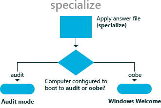

# 专门负责

Windows® 安装程序在**specialize**配置阶段，应用映像的计算机特定信息。 例如，您可以配置网络设置、 区域设置和域信息。

在**specialize**配置阶段一起的[一般化](generalize.md)配置阶段。 通用化阶段用于创建 Windows 参考映像，可用于整个组织。 此基本的 Windows 参考映像，您可以添加其他自定义项应用于组织中的不同部门或不同的 Windows 安装。 移动或复制到新计算机的 Windows 映像的任何方法必须准备好与**sysprep 一般化 /**命令。 有关详细信息，请参阅[Sysprep （系统准备） 概述](sysprep--system-preparation--overview.md)和[Sysprep 命令行选项](sysprep-command-line-options.md)。

下面的关系图说明了如何使用在**specialize**配置阶段来应用这些特定自定义设置。

例如，在**specialize**配置阶段中，可以指定不同的主页 Internet Explorer® 在不同的部门或分支机构在业务中。 然后，此设置将覆盖默认主页。

## 相关的主题

[配置阶段的工作](how-configuration-passes-work.md)

[auditSystem](auditsystem.md)

[auditUser](audituser.md)

[一般化](generalize.md)

[offlineServicing](offlineservicing.md)

[oobeSystem](oobesystem.md)

[windowsPE](windowspe.md)

 

 

