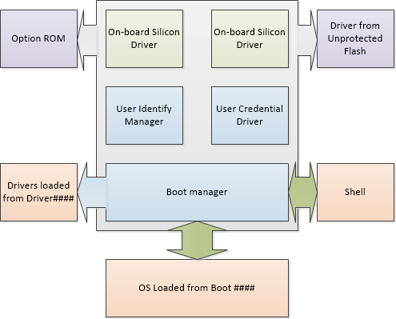

# <a name="uefi-validation-option-rom-guidance"></a>（uefi） 验证选项 ROM 指南


Vishal Manan，架构师、 咨询、 OEM<vmanan@microsoft.com>

Jeremiah Cox，sr。 SDET、 Windows 安全和标识团队[jerecox@microsoft.com](mailto:%20jerecox@microsoft.com)

Tony 林，工程服务工程师，TW 胜利计划的生态系统，[tolin@microsoft.com](mailto:%20tolin@microsoft.com)

1.3 版

此文档可帮助 Oem 和 Odm 验证固件检查作为部分信任的安全启动链及其选项 ROM 的签名。

本指南假定您知道 （uefi），基本了解安全启动 (章 1、 2、 13、 20 和 27 UEFI 规范的) 和 PKI 安全模型的基本知识。

在此页上︰

-   [介绍](#introduction)

-   [1.UEFI 和选项 Rom](#uefiandoptionroms)

-   [2.问题陈述](#problemstatement)

-   [3.谁会受到影响？](#whoisaffected)

-   [4.如何对其进行测试？](#howtotestforit)

-   [5.如何修复它](#howtofixit)

-   [6.资源](#resources)

-   [测试使用的驱动程序签名的选项 ROM 附录 a︰ 另一种方法](#alternateapproachtotestingusingunsignedoptionromdrivers)

-   [附录 b︰ 使用空数据库启用安全启动脚本](#scriptsforenablingsecurebootwithnulldb)

## <a name="span-idintroductionspanspan-idintroductionspanspan-idintroductionspanintroduction"></a><span id="Introduction"></span><span id="introduction"></span><span id="INTRODUCTION"></span>介绍


选项 Rom （或 OpROMs） 是运行平台初始化过程由计算机 BIOS 固件。 它们通常存储在插件卡，但它们可以驻留在系统主板上。

通常需要选项 Rom 的设备是视频卡、 网络适配器和存储 RAID 模块的驱动程序。 这些选项 Rom 通常还提供到 PC 的固件驱动程序。

它们包括各种类型的固件驱动程序，包括传统的 PC AT、 打开固件和 EFI 选项 Rom。 固件驱动程序包括视频 BIOS 在视频卡、 PXE 引导以太网适配器的驱动程序和存储在 RAID 控制器上的驱动程序。 这些设备通常具有固件驱动程序提供的选项 Rom。

统一可扩展固件接口 (UEFI) 还支持旧版模式选项 Rom。

根据最新 UEFI 规范 （目前在 2.3.1 堪误表 C – 2.5.1.2 节)，ISA （传统） 选项 Rom 未 UEFI 规范的一部分。 为了进行此讨论，将被视为仅是基于 PCI 的 UEFI 兼容选项 Rom。

它已不可能在计算机固件中嵌入设备的固件时，可以使用选项 Rom。 当选项 ROM 执行驱动程序时，IHV 可以利用该驱动程序，并保留在一个位置的驱动程序和设备。

本文档讨论为什么您需要验证选项 Rom，显示的这样一些技术。

### <a name="span-idsupportingbothuefibiosandlegacybiosspanspan-idsupportingbothuefibiosandlegacybiosspanspan-idsupportingbothuefibiosandlegacybiosspansupporting-both-uefi-bios-and-legacy-bios"></a><span id="Supporting_both_UEFI_BIOS_and_Legacy_BIOS"></span><span id="supporting_both_uefi_bios_and_legacy_bios"></span><span id="SUPPORTING_BOTH_UEFI_BIOS_AND_LEGACY_BIOS"></span>支持 UEFI BIOS 和旧的 BIOS

许多制造商创建包括适用于许多类型的 Pc 选项 Rom 和固件的设备。 常见的组合包括︰

-   只有传统 ROM

-   UEFI 本机 OpROM

-   传统的 ROM + UEFI EBC OpROM

-   传统的 ROM + UEFI x64 OpROM

-   传统的 ROM + UEFI x64 + UEFI IA32

-   传统的 ROM + UEFI x64 + UEFI IA32 + UEFI EBC OpROM

（uefi) BIOS 可以加载并执行旧固件驱动程序兼容性支持模块 (CSM) 启用。 请注意启用安全启动时，兼容性支持模块和旧式的 Rom 的执行禁止因为旧的固件驱动程序不支持身份验证。如果在 BIOS 配置的选项 ROM 格式设置为传统的 ROM，它将始终在设备上使用旧式的 ROM。

如果选项 ROM 格式设置为**UEFI 兼容**，它将使用较新的 EFI ROM，如果有的话，旧式的 ROM，如果其中一个不是。

UEFI 驱动程序所必需的许多新固件级别的安全功能也可以使 UEFI 引导序列。 例如，Windows 安装光盘所附加到的非 UEFI 兼容的存储控制器中不能启用安全启动后在 UEFI 模式下启动系统时。

## <a name="span-iduefiandoptionromsspanspan-iduefiandoptionromsspanspan-iduefiandoptionromsspan1-uefi-and-option-roms"></a><span id="UEFIandOptionROMs"></span><span id="uefiandoptionroms"></span><span id="UEFIANDOPTIONROMS"></span>1.UEFI 和选项 Rom




*图 2: UEFI 驱动程序的安全注意事项，源︰ UEFI 2.3.1 堪误表 C*

**从 UEFI 2.3.1 节 31.1.4 从堪误表 c:**

由于 UEFI 用户配置文件详细说明了大量的与安全相关的特权，很重要是受信任用户标识管理器和用户凭据提供程序并执行顺序的环境。

这包括︰

-   保护存储这些驱动程序存储区。

-   保护这些驱动程序选择所依据的方法。

-   这些驱动程序的执行环境防止未验证的驱动程序。

-   不被这些驱动程序使用的数据结构破坏由未经授权的驱动程序，而仍然使用。

像用户标识管理器，用户凭据的驱动程序和驱动程序在安全的位置可能位于主板组件，如写保护的闪存驱动器的受信任的平台策略。

其他某些驱动程序可能位于未受保护的存储位置选项 Rom 或硬盘分区和可以很容易地更换。 这些驱动程序必须进行验证。

例如，默认平台策略成功必须能够验证驱动程序中列出的驱动程序\#\# \# \#加载选项，否则用户都必须在处理这些驱动程序之前标识。 否则，驱动程序执行应被推迟。 如果用户配置文件更改通过后续调用为标识 （） 或通过动态的身份验证，该驱动程序\#\# \# \#可能无法处理选项。

用户配置文件数据库已关闭使用不同 UEFI 信号事件根据是否对它进行保护。

UEFI 驱动程序和 UEFI 选项 Rom 只能将针对设备的引导路径中执行。

PCI 规范允许多个选项 ROM 映像相同的设备上。 这些选项 ROM 可能是旧式 x86 和 （uefi）。 UEFI 固件设置平台策略选取选项 rom。 它可以使执行作为控制设备的可选适配器的 ROM。

固件 BDS 和 DXE 阶段验证的签名。 事件的顺序如下所示︰

1.  PCI 和衍生总线初始化

2.  探测器的选项 Rom 的 PCI 设备

3.  找到内存映射选项 Rom

4.  DXE 阶段加载在 Rom 中的任何 UEFI 驱动程序

（uefi） 选项 Rom 可以在内存中的任意位置。 默认设置是让卡管理设备的 ROM。 （uefi） 允许围绕哪些选项 ROM 控制使用 EFI 哪些设备的控制策略为平台\_平台\_驱动程序\_重写。 （uefi） 支持注册配置界面选项 Rom。

在具有启用安全的引导 PC 上，选项 ROM 驱动程序未签名或没有验证时构成安全威胁。 签名验证的选项 Rom 是 WHCK 的要求。 这同样适用时服务选项 Rom，以确保在安装前验证该更新了。

从 UEFI 2.3.1 Eratta C 规范︰

9. 必填字段。 **签名的固件代码完整性检查**。 固件由 OEM 安装并且是只读或受安全固件更新过程中，所定义的上方，可能被视为受保护的。 **系统应验证所有不受保护的固件组件、 UEFI 驱动程序和 （uefi） 的应用程序是否使用 sha-256 最低的 RSA 2048 sigend （MD5 和 sha-1 禁止的）**，并验证 （uefi） 应用程序和按照这些要求未签名的驱动程序将无法运行 （这是可接受的签名算法的默认策略）。 如果图像签名授权数据库中找不到或禁止数据库中找到，该图像不能开始，并相反，有关它的信息应放置在图像执行信息 Table.11。 必填字段。 **验证签名的所有启动应用程序和引导加载程序。** 在加电时平台应开始执行启动固件，并使用公钥加密算法策略根据验证引导顺序上移至并包括 Windows 启动管理器中的所有图像的签名。

## <a name="span-idproblemstatementspanspan-idproblemstatementspanspan-idproblemstatementspan2-problem-statement"></a><span id="ProblemStatement"></span><span id="problemstatement"></span><span id="PROBLEMSTATEMENT"></span>2.问题陈述


一些安全启动启用 UEFI BIOS，包括建东核心的生成、 未默认身份验证 UEFI 选项 Rom 因为签名的 UEFI 选项 Rom 中曾经不可用期间安全启动开发。 这样会暴露在 UEFI 安全引导攻击面/漏洞。

### <a name="span-id21vulnerabilityspanspan-id21vulnerabilityspanspan-id21vulnerabilityspan21-vulnerability"></a><span id="2.1._Vulnerability"></span><span id="2.1._vulnerability"></span><span id="2.1._VULNERABILITY"></span>2.1。 漏洞

此漏洞是 EDK II 以及 UDK2010 8 月 2013 年仍然存在。 源维护者问题的了解，并归档 bug。 从 EDK II 和 UDK2010 任何固件应该验证选项 ROM 验证的管理方式。 验证服务器选项 ROM 的行为受 PCD 值`PcdOptionRomImageVerificationPolicy`EDK II SecurityPkg 包中。

TianoCore 漏洞的源代码是 SecurityPkg\\SecurityPkg.dec 文件︰

``` syntax
## Pcd for OptionRom.
  #  Image verification policy settings:
  #  ALWAYS_EXECUTE                         0x00000000
  #  NEVER_EXECUTE                          0x00000001
  #  ALLOW_EXECUTE_ON_SECURITY_VIOLATION    0x00000002
  #  DEFER_EXECUTE_ON_SECURITY_VIOLATION    0x00000003
  #  DENY_EXECUTE_ON_SECURITY_VIOLATION     0x00000004
  #  QUERY_USER_ON_SECURITY_VIOLATION       0x00000005
gEfiSecurityPkgTokenSpaceGuid.PcdOptionRomImageVerificationPolicy|0x00|UINT32|0x00000001
```

默认值 (0x00) 是始终\_执行，不正确执行已签名的驱动程序的验证选项 Rom 中的外接程序中的外围设备。 这不是实现 （uefi） 安全引导功能的任何系统的理想值。

建议的值 （最安全）︰`DENY_EXECUTE_ON_SECURITY_VIOLATION (0x04)`

建议的值 （最佳灵活性）︰`QUERY_USER_ON_SECURITY_VIOLATION (0x05)`

在 EDK II 和 UDK2010，正确编码练习使用重写机制修改平台固件的 PCD 值。 因此的值`PcdOptionRomImageVerificationPolicy`不应在更改`SecurityPkg\SecurityPkg.dec`。 该平台的 DSC 文件中应设置的替代值。 示例如下所示使用 Nt32Pkg\\Nt32Pkg.dsc:

``` syntax
[PcdsFixedAtBuild]
gEfiSecurityPkgTokenSpaceGuid.PcdOptionRomImageVerificationPolicy|0x04
```

PCD 重写应放置在`[PcdsFixedAtBuild]`的 DSC 文件部分。 重写参数的确切机制而 BIOS 供应商工具可能会有所不同。

**请注意**  
此漏洞可能存在独立 BIOS 供应商早期实现 UEFI 安全启动 BIOS 中。 请联系您的 BIOS 供应商联系以确定您的版本也可能受到影响。

 

## <a name="span-idwhoisaffectedspanspan-idwhoisaffectedspanspan-idwhoisaffectedspan3-who-is-affected"></a><span id="WhoIsAffected"></span><span id="whoisaffected"></span><span id="WHOISAFFECTED"></span>3.谁会受到影响？


实现安全启动并已 UEFI UEFI PC 选项 ROM 未签名驱动程序。 此外，兼容性，可获得工作的现有卡的固件可以有一个安全漏洞，它并不验证选项 Rom。

**笔记本电脑，netbooks，ultrabooks 和平板电脑︰ 大多数不会影响**。 选项 Rom 组件通常位于 PCI/e、 ISA 和其衍生产品等的背板总线 (ExpressCard，miniPCI，cardbus 启动 PCCard、 LPC、 ThunderBolt 等)。 如果膝上型计算机有任何的这些公开，将大大减少其受攻击面。 此外，它是可能 UEFI 驱动程序为板载笔记本电脑组件集成到核心 BIOS 固件卷，不位于一个单独的选项 rom。 因此大多数便携式计算机不会有危险。 此外，禁用了旧版选项 Rom，它看起来 UEFI 仅支持基于 PCI 的选项 Rom。

但是，如果您有一个桌面、 主板或有 UEFI BIOS 并实现安全启动一个服务器，您可能会受到影响。 在服务器的专用的 RAID 控制器或外接存储控制器 SATA 或 FC 等也 PCIe 以太网网络上卡可能有选项 Rom。 在服务器上支持丰富的外接程序控制器是功能的通用的所以这尤其适用于服务器空间。

这可能会影响 32 位和 64 位个人电脑，第 2 类和 3 类。

如果安全启动平台支持选项 Rom 从永久连接到平台的设备，而且它支持的功能来验证这些选项 Rom，则它必须支持的网络协议中所述的选项 ROM 验证方法 — UDP 和 MTFTP 和经过身份验证的 EFI 变量所述 UEFI 规范 2.3.1 堪误表 C 节 7.2。

## <a name="span-idhowtotestforitspanspan-idhowtotestforitspanspan-idhowtotestforitspan4-how-to-test-for-it"></a><span id="HowToTestForIt"></span><span id="howtotestforit"></span><span id="HOWTOTESTFORIT"></span>4.如何对其进行测试？


如果您正在开发固件并基于建东核心请检查第 2.1 节中提到的漏洞。 如果您正在使用另一个 IBV 固件请检查它们。 或者也可以采用测试它自己正如下面所述。

您将需要以下︰

-   在 UEFI 固件测试下的 PC

-   与在 PC 上测试 （如显卡） 的选项 ROM 的 PCI 设备

-   请确保已启用安全启动

进行测试的步骤如下︰

1.  插入 （uefi） 添加与受测电脑 UEFI 选项 ROM 的 PCI 卡上。

    如果正在使用 PCI 视频卡进行测试，挂钩外部监视着。

2.  使用下面的设置启用安全启动︰

    -   PK︰ 您 PK 或自签名的测试 PK

    -   KEK: MS KEK、 PK 签名 Fabrikam 测试 KEK 或另一个 KEK

    -   DB︰ 空。 （这必须是 NULL）。

    -   DBX︰ 空。

    -   SecureBoot: UEFI 变量应设置为 true

3.  重新启动计算机

4.  预计以下结果︰

    -   如果正确实现了 UEFI 固件，因为选项 ROM 的存在将使固件检查证书"Db"岂不加载 UEFI 选项 ROM 驱动程序。 由于"Db"为的 NULL UEFI 驱动程序将无法加载。 例如，如果您使用显卡测试，您将看到，未显示在显示器上。

    -   如果固件没有正确实现，因为固件不检查签名在"数据库"将从选项 ROM 中加载 UEFI 驱动程序。 例如，如果使用的视频卡进行测试，您将看到挂钩选项 ROM 卡到显示器会显示。

**请注意**  
如果 UEFI 选项 ROM 驱动程序进行签名与否并不重要，DB 为 null 和 SB 被启用时，将不会加载选项 ROM （PK 和 KEK 注册）。

 

请参阅生成 PK 和 KEK WHCK 中提供的示例脚本。 您可以从此处下载脚本︰ <http://go.microsoft.com/fwlink/?LinkId=321292> 。 附录 B 包含示例脚本和更多详细信息。

还可以参考附录 A 以执行上述测试的另一种方法。 这种方法不需要将数据库设置为 Null，但需要未签名 （uefi） 选项 ROM 驱动程序从 IHV。

## <a name="span-idhowtofixitspanspan-idhowtofixitspanspan-idhowtofixitspan5-how-to-fix-it"></a><span id="HowToFixIt"></span><span id="howtofixit"></span><span id="HOWTOFIXIT"></span>5.如何修复它


如果上面的测试失败，使用您 IBV 要获得必要的版本并将它们配置为验证选项 Rom。 请确保固件通过了测试。 对于个人电脑必须附带的需要做安全固件更新。 请参考[NIST 800-147 出版物](http://go.microsoft.com/fwlink/p/?linkid=321186)和/或[Windows 8.1 安全启动密钥创建和管理指南](windows-secure-boot-key-creation-and-management-guidance.md)，请参阅。

可以测试计算机并测试安全固件更新作为一种测试工具 （未认证工具） 利用 Windows HCK。

### <a name="span-id51signingthedriverspanspan-id51signingthedriverspanspan-id51signingthedriverspan51-signing-the-driver"></a><span id="5.1._Signing_the_driver"></span><span id="5.1._signing_the_driver"></span><span id="5.1._SIGNING_THE_DRIVER"></span>5.1。 签名的驱动程序

在种情况下，您会发现您可能签名 UEFI 选项 Rom 有关如何解决此问题，请阅读下面的驱动程序。

分别对每个选项 ROM 驱动程序进行签名。 否则会破坏格式的 PCI 选项 rom。 您只需对 UEFI 驱动程序签名之前创建组合的选项 rom。

前插入 OpROM UEFI 驱动程序，签署 UEFI 图像和与安全启动打开和关闭在 UEFI 外壳 （加载/卸载驱动程序文件） 对其进行测试。 然后，已签名的驱动程序放入组合选项 rom。

您可以指示您 IHV 到 Microsoft SysDev 中心以获得其 UEFI 选项 Rom 签名通过可通过 SysDev 中心服务。

### <a name="span-id52validationofupdatespanspan-id52validationofupdatespanspan-id52validationofupdatespan52-validation-of-update"></a><span id="5.2._Validation_of_update"></span><span id="5.2._validation_of_update"></span><span id="5.2._VALIDATION_OF_UPDATE"></span>5.2。 更新的验证

上述验证不存在漏洞的测试运行。 使用 HCK 测试来确保无功能的回归。

## <a name="span-idresourcesspanspan-idresourcesspanspan-idresourcesspan6-resources"></a><span id="Resources"></span><span id="resources"></span><span id="RESOURCES"></span>6.资源


-   UEFI 平台初始化规范，第 5 期标准 1.2.1 堪误表答︰ <http://go.microsoft.com/fwlink/p/?linkid=220187>

-   规格从 UEFI 2.3.1 相关信息︰

    -   2.5.1︰ 传统选项 ROM 问题

    -   10︰ 协议 – UEFI 驱动程序模型

    -   13.4.2: PCI 选项 Rom

    -   20: EFI 字节代码虚拟机

    -   28: HII 概述

    -   29: HII 协议

    -   30: HII 配置处理和浏览器协议

-   [UEFI 论坛学习中心](http://go.microsoft.com/fwlink/p/?LinkId=321289)

-   [UEFI IHV 资源@intel.com](http://go.microsoft.com/fwlink/?LinkId=321290)

-   [TianoCore edk2-devel 邮寄列表](http://go.microsoft.com/fwlink/?LinkId=398276)用于其他 UEFI 开发人员支持

-   TechNet:[企业安全的最佳做法︰ 安全策略](http://go.microsoft.com/fwlink/p/?linkid=321288)

-   [UEFI 规范](http://go.microsoft.com/fwlink/p/?LinkID=220187)堪误表 C

-   [受信任计算组](http://go.microsoft.com/fwlink/p/?LinkID=78378)

-   [Tianocore （uefi） 开发工具包](http://go.microsoft.com/fwlink/?LinkId=398277)

-   [UEFI 固件](uefi-firmware.md)

-   [英特尔按︰ BIOS 之外第二版](http://go.microsoft.com/fwlink/?LinkId=398278)

-   [Windows 8.1 安全启动密钥创建和管理指南](windows-secure-boot-key-creation-and-management-guidance.md)

-   [验证 Windows UEFI 固件更新平台功能](http://go.microsoft.com/fwlink/?LinkId=321291)

## <a name="span-idalternateapproachtotestingusingunsignedoptionromdriversspanspan-idalternateapproachtotestingusingunsignedoptionromdriversspanspan-idalternateapproachtotestingusingunsignedoptionromdriversspanappendix-a-alternate-approach-to-testing-using-unsigned-option-rom-drivers"></a><span id="AlternateApproachToTestingUsingUnsignedOptionROMDrivers"></span><span id="alternateapproachtotestingusingunsignedoptionromdrivers"></span><span id="ALTERNATEAPPROACHTOTESTINGUSINGUNSIGNEDOPTIONROMDRIVERS"></span>测试使用的驱动程序签名的选项 ROM 附录 a︰ 另一种方法


这种方法依赖于工具获得 IHV 以确保 UEFI 选项 ROM 驱动程序进行签名。

您将需要以下︰

-   在 UEFI 固件测试下的 PC

-   PCI 设备连接到 PC （如显卡） 的测试签名选项 ROM 驱动程序

-   请确保已启用安全启动

-   如果不是明显的选项 ROM 驱动程序进行签名，或未检测到选项 ROM 驱动程序签名选项 IHV 工具

如果固件已实现正确，并且选项 ROM 未签名卡应由固件故障检查并加载卡上的驱动程序。 PC 应如报告错误代码**EFI\_图像\_执行\_身份验证\_SIG\_FOUND**。 如果您使用的视频卡，您可能会看到电脑显示黑色的屏幕，因为选项 ROM 驱动程序未加载。

如果固件未正确实现，此测试将起作用。

## <a name="span-idscriptsforenablingsecurebootwithnulldbspanspan-idscriptsforenablingsecurebootwithnulldbspanspan-idscriptsforenablingsecurebootwithnulldbspanappendix-b-scripts-for-enabling-secure-boot-with-null-db"></a><span id="ScriptsForEnablingSecureBootWithNULLdb"></span><span id="scriptsforenablingsecurebootwithnulldb"></span><span id="SCRIPTSFORENABLINGSECUREBOOTWITHNULLDB"></span>附录 b︰ 使用空数据库启用安全启动脚本


可以使用您当前的安全引导变量 （PK 和 KEK） 集，也可以生成用于测试该测试的。

以下步骤用于生成测试 PK、 KEK 和设置数据库为空。 请确保没有启用安全引导;否则这些步骤将需要签署的 UEFI bin 文件。

**请注意**  
我们将设置安全引导变量 – Db，KEK PK 按相反的顺序，因此我们没有 UEFI bin 文件进行签名。

 

在这一步之前电脑应安装模式下。

1.  **创建 KEK 和 PK 证书**

    此步骤需要[Windows SDK](http://go.microsoft.com/fwlink/?LinkId=271979)中提供的 makecert.exe 工具。

    ``` syntax
    MakeCert.exe -cy authority -len 2048 -m 60 -a sha256  -pe -ss my -n "CN=DO NOT SHIP - Fabrikam Test KEK CA" Fabrikam_Test_KEK_CA.cer
    MakeCert.exe -cy authority -len 2048 -m 60 -a sha256  -pe -ss my -n "CN=DO NOT SHIP - Fabrikam Test PK" TestPK.cer
    ```

2.  **脚本来生成测试 PK**

    您可以使用您自己的 PK 也利用来自此<http://go.microsoft.com/fwlink/?LinkId=321292>的 WHCK 脚本

    下面提供了一个示例。

        # this scripts demonstrates how to format the Platform key 
        # NOTE The PK is actually set in the Enable_OEM_SecureBoot.ps1 script 
        Import-Module secureboot
        $d = (pwd).Path

        ###############################################################################
        # Complete the following parameters
        ###############################################################################

        $certname = "TestPK"
        # TODO change this path to where you have the PK.cer file 
        # This is where you plugin the certificate generated by the HSM 
        $certpath = $d + "\" + $certname + ".cer"

        # Each signature has an owner SignatureOwner, which is a GUID identifying the agent which inserted the signature in the database. 
        # Agents might include the operating PC or an OEM-supplied driver or application. 
        # Agents may examine this field to understand whether they should manage the signature or not.
        # TODO replace with OEM SignatureOwner GUID.
        # You can use tools like Guidgen.exe tool in SDK or a similar tool to generate a GUID
        $sigowner = "55555555-5555-5555-5555-555555555555"

        $var = "PK"
        $efi_guid = "{8BE4DF61-93CA-11d2-AA0D-00E098032B8C}"
        $append = $false

        ###############################################################################
        # Everything else is calculated
        ###############################################################################

        # Workaround relative path bug
        # TODO substitute OEM with your OEM name 
        $siglist =  $certname + "_SigList.bin"
        $serialization = $certname + "_SigList_Serialization_for_" + $var + ".bin"
        $signature = $serialization + ".p7"

        $appendstring = "set_" 
        $attribute = "0x27"
        $example = "Example_SetVariable_Data-" + $certname + "_" + $appendstring + $var + ".bin" 

        Format-SecureBootUEFI -Name $var -SignatureOwner $sigowner -ContentFilePath $siglist -FormatWithCert -Certificate $certpath -SignableFilePath $serialization -Time 2011-05-21T13:30:00Z  -AppendWrite:$append

        # OutputFilePath - Specifies the name of the file created that contains the contents of what is set. 
        # If this parameter is specified, then the content are not actually set, just stored into this file.
        # Please note if -OutputFilePath is provided the PK is not set like in this case. The master script sets it at the end.

        # Time - you can change the time below as long as it isn't in the future. Nothing wrong with keeping it as is.
        
        Set-SecureBootUEFI -Name $var -Time 2011-05-21T13:30:00Z -ContentFilePath $siglist  -OutputFilePath $example -AppendWrite:$append
    

3.  **生成测试 KEK 或使用您自己的 OEM KEK**

    为此，您可以利用自己的 OEM KEK 或从 WHCK 脚本。 您还可以使用 Fabrikam\_PK\_SigList.bin <http://go.microsoft.com/fwlink/?LinkId=321292>而不是生成您自己的测试 KEK 从。

    下面提供了一个示例。

        # script to add option OEM KEK
        Import-Module secureboot
        $d = (pwd).Path

        ###############################################################################
        # Complete the following parameters
        ###############################################################################

        $certname = "Fabrikam_Test_KEK_CA"
        # TODO change this path to where you have the PK.cer file 
        # This is where you plugin the certificate generated by the HSM 
        $certpath = $d + "\" + $certname + ".cer"

        # TODO change this path to where you have the OEM_KEK.cer file 
        # Each signature has an owner SignatureOwner, which is a GUID identifying the agent which inserted the signature in the database. 
        # Agents might include the operating system or an OEM-supplied driver or application. 
        # Agents may examine this field to understand whether they should manage the signature or not.
        # TODO replace with OEM SignatureOwner GUID.
        # You can use tools like Guidgen.exe tool in SDK or a similar tool to generate a GUID
        
        $sigowner = "00000000-0000-0000-0000-000000000000"

        $var = "KEK"
        $efi_guid = "{8BE4DF61-93CA-11d2-AA0D-00E098032B8C}"
        $append = $false

        ###############################################################################
        # Everything else is calculated
        ###############################################################################

        $siglist = $certname + "_SigList.bin"
        $serialization = $certname + "_SigList_Serialization_for_" + $var + ".bin"
        $signature = $serialization + ".p7"
        if ($append -eq $false) 
        { 
            $appendstring = "set_" 
            $attribute = "0x27"
        } else 
        {   
            $appendstring = "append_" 
            $attribute = "0x67"
        }
        $example = "Example_SetVariable_Data-" + $certname + "_" + $appendstring + $var + ".bin" 

        Format-SecureBootUEFI -Name $var -SignatureOwner $sigowner -ContentFilePath $siglist -FormatWithCert -CertificateFilePath $certpath -SignableFilePath $serialization -Time 2011-05-21T13:30:00Z -AppendWrite:$append 

        # -Time You can change the time below as long as it isn't in the future. Nothing wrong with keeping it as is.
        
        Set-SecureBootUEFI -Name $var -Time 2011-05-21T13:30:00Z -ContentFilePath $siglist -OutputFilePath $example -AppendWrite:$append
    

4.  **将数据库设置为 Null，设置 KEK 和 PK**

    此脚本的作用的第一件事是将数据库设置为 Null。

    **请注意**  
    请记住如果 Fabrikam 测试 KEK CA 是唯一存在的 KEK CA （意味着没有任何 Windows KEK CA），PC 能引导到 Windows RE。
    
        # Prior to script execution, run "Set-ExecutionPolicy Bypass -Force"
        
        Import-Module secureboot
        try 
        {
            Write-Host "Deleting db..."
            Set-SecureBootUEFI -Name db -Time "2011-06-06T13:30:00Z" -Content $null
        }
        catch
        {
        }
        Write-Host "Setting Fabrikam KEK..."
        Set-SecureBootUEFI -Time 2011-05-21T13:30:00Z  -ContentFilePath Fabrikam_Test_KEK_CA_SigList.bin  -Name KEK

        Write-Host "Setting self-signed Test PK..."
        Set-SecureBootUEFI -Time 2011-05-21T13:30:00Z -ContentFilePath TestPK_SigList.bin  -Name PK

        Write-Host "`n... operation complete.  `nSetupMode should now be 0 and SecureBoot should also be 0. Reboot and verify that Windows is correctly authenticated, and that SecureBoot changes to 1."

5.  **插入选项 ROM 卡并测试**

    测试应通过或失败基础上的固件的正确性。 例如︰

    如果固件中的选项 ROM 正确实现，并且您要用于测试的视频卡，然后应该有附加的监视器不显示。

    但是，如果您正在使用错误的固件，显卡应具有输出显示屏上。

## <a name="span-idrelatedtopicsspanrelated-topics"></a><span id="related_topics"></span>相关的主题


[Windows 安全启动密钥创建和管理指南](windows-secure-boot-key-creation-and-management-guidance.md)

[安全引导概述](secure-boot-overview.md)

[验证 Windows UEFI 固件更新平台功能](validating-windows-uefi-firmware-update-platform-functionality.md)

 

 


