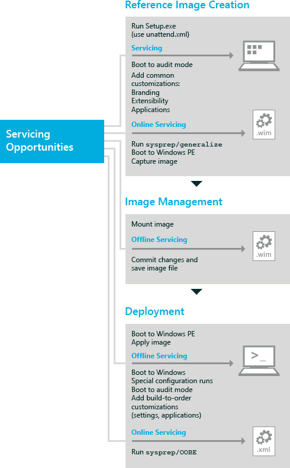

# 了解处理策略

可以通过以下方式在各个部署阶段服务 A Windows® 图像︰ 在自动安装过程中脱机或联机。 您选择的部署阶段取决于您的部署策略。

[离线维修](#offlineservicingstrategy)︰ 包括添加和删除更新、 驱动程序和语言包并配置其他设置，而无需启动 Windows。 脱机服务是管理因为它无需重新创建更新的图像存储在服务器的现有映像的有效方式。 您可以执行脱机服务上已装载或应用到的驱动器或目录中的图像。

[处理使用 Windows 安装程序映像](#servicingdeploymentstrategy)︰ 涉及提供答案文件 (Unattend.xml)，Windows 安装程序实现。 答案文件包含特定处理操作，如添加驱动程序、 更新、 语言包和其他软件包。 自动化安装过程中处理映像实现起来非常容易，是基于安装程序部署的理想选择。

[处理运行的操作系统](#onlineservicingstrategy)︰ 也称为联机处理，此方法涉及启动到审核模式，以添加驱动程序、 应用程序及其他程序包。 联机处理适于驱动程序时驱动程序包有合用安装服务或应用程序依赖关系。 也是有效时大部分服务程序包已安装程序，或更新.msi 或 KB.exe 文件格式，或应用程序依赖于 Windows 安装服务和技术 （如.NET Framework 或完全即插即用支持）。

下图显示了部署的各个阶段过程中可用的处理机会。

## 脱机服务

脱机服务是随 Windows Vista 引入的。 当您修改或服务完全脱机 Windows 映像而不首先将其启动时，即开始脱机服务。 对于 Windows Vista 中，程序包管理器命令行工具提供用于更新 Windows 映像。 在 Windows 7 和 Windows 8，部署映像服务和管理 (DISM) 替换程序包管理器。 针对 Windows 8，为提供服务操作的大多数操作系统可以使用 DISM 命令行工具执行脱机 Windows 映像上。 DISM 安装与 Windows 8，并还分发 Windows 评估和部署工具包 (Windows ADK) 中。 有关 DISM 的详细信息，请参阅[DISM 的部署映像服务和 M\\管理 Windows 技术参考](dism---deployment-image-servicing-and-management-technical-reference-for-windows.md)。

DISM 可以在脱机映像上使用︰

-   装载、 重新装载和卸载处理.wim 文件中的映像。

-   查询有关 Windows 映像的信息。

-   添加、 删除和枚举驱动程序.inf 文件提供。

-   添加、 删除和枚举程序包，包括以.cab 文件形式提供的语言包。

-   添加.msu 文件。

-   配置国际设置。

-   启用、 禁用和枚举的 Windows 操作系统功能。

-   升级到更高版本的 Windows。

-   检查 Windows 安装程序应用程序修补程序 （.msp 文件） 的适用性。

-   枚举的应用程序和应用程序在 Windows 映像中安装的修补程序。

-   应用无人参与的答案文件的脱机服务部分。

-   更新 Windows 预安装环境 (Windows PE) 映像。

有关如何处理已装入的映像的详细信息，请参阅[安装的 Windows 映像提供服务](service-a-mounted-windows-image.md)。

有关如何处理应用的映像的详细信息，请参阅[为应用 Windows 映像提供服务](service-an-applied-windows-image.md)。

## 通过使用 Windows 安装程序处理映像

用于无人参与的答案文件与 Windows 安装程序在 Windows 安装程序的各个配置阶段过程中处理映像。 答案文件包含用于配置和更新 Windows 映像的所有设置。 安装程序调用答案文件多次部署过程。 在安装操作系统之后，您可以启动到审核模式或欢迎使用 Windows。 有关 Windows 安装程序的详细信息，请参阅[Windows 安装程序技术参考](windows-setup-technical-reference.md)。 有关配置阶段的详细信息，请参阅[Windows 安装程序配置阶段](windows-setup-configuration-passes.md)。

无人参与的答案文件可用于在安装过程︰

-   添加或删除语言包。

-   配置国际设置。

-   添加和删除驱动程序。

-   添加和删除程序包。

-   启用和禁用 Windows 操作系统功能。

## 处理运行的操作系统

有几种工具可以用来处理正在运行的操作系统 （也称为处理联机映像）。 应引导到审核模式将更新添加到 Windows 映像。 审核模式不需要 Windows 欢迎使用中要应用的设置允许更快地访问桌面。 启动到审核模式后，您可以添加插设备驱动程序，安装应用程序和系统组件和测试安装的有效性。 有关如何使用审核模式，请参阅[启动到审核模式或 OOBE 的 Windows](boot-windows-to-audit-mode-or-oobe.md)的详细信息。

以下工具通常用于更新正在运行的 Windows 操作系统︰

-   使用 DISM 枚举驱动程序、 国际设置、 程序包和功能，并应用无人参与的答案文件设置。 有关详细信息，请参阅[DISM 的部署映像服务和管理技术参考的窗口](dism---deployment-image-servicing-and-management-technical-reference-for-windows.md)。

-   使用 DPInst 添加检测到的硬件的驱动程序。 有关 DPInst 和其他 Windows 驱动程序工具包 (WDK) 中可用的工具的信息，请参阅[下载工具包和工具窗口](http://go.microsoft.com/fwlink/?LinkId=89603)。

-   使用 PNPUtil 来添加、 删除和枚举驱动程序。 有关详细信息，请参阅[使用 PnPUtil 命令行来安装即插即用设备](http://go.microsoft.com/fwlink/?LinkId=139151)。

-   使用 Windows 更新独立安装程序来添加 service pack 或其他.msu 文件。 有关详细信息，请参阅[Windows 更新独立安装程序 (Wusa.exe) 以及在 Windows Vista 中.msu 文件的说明](http://go.microsoft.com/fwlink/?LinkId=90850)

-   使用 LPKSetup 添加或删除语言包。

## 相关的主题

[部署映像服务和管理 (DISM) 最佳做法](deployment-image-servicing-and-management--dism--best-practices.md)

[DISM 的部署 windows 映像服务和管理技术参考](dism---deployment-image-servicing-and-management-technical-reference-for-windows.md)

 

 

