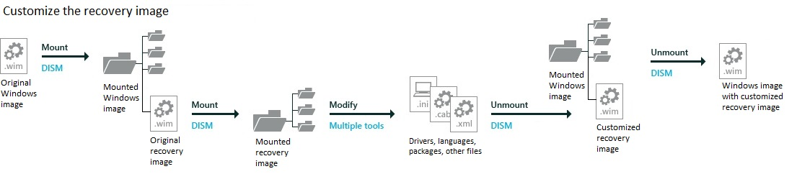

# <a name="lab-10-update-the-recovery-image"></a>实验室 10︰ 更新恢复映像

如果系统无法启动进入 Windows 映像，它将故障转移到 Windows 恢复环境 (WinRE)。 WinRE 可以修复无法启动操作系统的常见原因。 WinRE 基于 Windows 预安装环境 (WinPE)，以使其工作为您的客户，您可以添加驱动程序、 语言、 Windows PE 可选组件和其他故障排除和诊断工具。 

WinRE 图像包含在 Windows 10 和 Windows 服务器 2016年的图像，并最终将被复制到目标计算机或设备上的 Windows RE 工具分区。 要对其进行修改，将装载 Windows 映像，然后装载 WinRE 映像内。 进行更改，卸载 WinRE 映像，然后卸载 Windows 映像。 

   

您应更新恢复图像，以确保一致性恢复每当遇到您︰
* 添加启动关键.inf 式的驱动程序，例如图形和存储驱动程序[实验室 1︰ 安装 Windows PE](install-windows-pe-sxs.md)。
* 添加到 Windows，类似常规分发版本的主要更新 ([实验室 4︰ 添加更新和升级版](servicing-the-image-with-windows-updates-sxs.md))。   
* 添加新的语言，一样[实验室 5︰ 添加语言](add-drivers-langs-universal-apps-sxs.md)。  （这并不总是可行的因为并不是所有的语言都有 Windows RE 等价物。）

 **备注**  
 -  该实验假设您希望保密的 winre.wim 在 install.wim，使您的语言和驱动程序的同步。 如果您想要在工厂车间，节省时间和您单独确定管理这些图像，您可能想要从映像中删除 winre.wim 并将其分别应用。

-  服务堆栈更新 (SSU): 应用最新的常规分发版本 （GDR） 当前 KB3200970 或任何未来的 Gdr 之前需要[KB3199209](http://www.catalog.update.microsoft.com/Search.aspx?q=KB3199209) 。

## <a name="span-idmountthewindowsimagespanstep-1-mount-the-windows-image"></a><span id="Mount_the_Windows_image"></span>步骤 1︰ 将 Windows 映像安装

使用步骤，可从[实验室 3︰ 添加设备驱动程序 （.inf 样式）](add-device-drivers.md)安装的 Windows 映像。 短的版本︰

1.  打开命令行以管理员身份 (**开始**> 键入**部署**> 右键单击**部署和图像处理工具环境** > **以管理员身份运行**。)

2.  对该文件进行备份 (`copy "C:\Images\Win10_x64\sources\install.wim" C:\Images\install-backup.wim`)

3.  装入该映像 (`md C:\mount\windows`，然后`Dism /Mount-Image /ImageFile:"C:\Images\install.wim" /Index:1 /MountDir:"C:\mount\windows" /Optimize`)

## <a name="span-idmounttherecoveryimagespanstep-1-mount-the-recovery-image"></a><span id="Mount_the_recovery_image"></span>步骤 1︰ 装载恢复映像

-   装载 Windows RE 图像文件。 

    ``` syntax
    md C:\mount\winre
    ```

    ``` syntax
    Dism /Mount-Image /ImageFile:"C:\mount\windows\Windows\System32\Recovery\winre.wim" /Index:1 /MountDir:"C:\mount\winre"
    ```

    其中*C*是驱动器的包含图像的驱动器号。

    此步骤可能需要几分钟。

    **疑难解答**︰ 如果在指定的目录下，无法看到 winre.wim，使用下面的命令将文件设置为可见︰

    `attrib -h -a -s C:\mount\windows\Windows\System32\Recovery\winre.wim`

## <a name="span-idadddriverstotheimagespanstep-3-add-boot-critical-drivers-to-winre"></a><span id="Add_drivers_to_the_image"></span>步骤 3︰ 添加到 WinRE 启动关键驱动程序

1.  添加所有.inf 式的驱动程序所需的硬件。

    ``` syntax
    Dism /Add-Driver /Image:"C:\mount\winre" /Driver:"C:\Drivers\PnP.Media.V1\media1.inf" /LogPath=C:\mount\dism.log
    ```

## <a name="span-idaddupdatestotheimagespanstep-4-add-updates-to-the-image"></a><span id="Add_updates_to_the_image"></span>步骤 4︰ 将更新添加到映像

1.  获取 Windows 更新软件包。 使用用于 Windows 中的同一个更新软件包[实验室 4︰ 添加更新和升级版本](servicing-the-image-with-windows-updates-sxs.md)。 例如，抓取在从[Windows 10 更新历史记录](https://support.microsoft.com/en-us/help/12387/windows-10-update-history)中列出的最新的累积更新 (Microsoft 更新目录] (http://www.catalog.update.microsoft.com/)。 提取到一个文件夹，例如，c:.msu 文件更新\\WindowsUpdates\\windows10.0-kb3194798-x64_8bc6befc7b3c51f94ae70b8d1d9a249bb4b5e108.msu。

2.  将更新添加到图像中。 对于具有依赖关系的软件包，请确保按顺序安装软件包。 如果您不能确定的依赖项，则确定以将它们放在同一文件夹中，并将其所有通过添加多个 /PackagePath 项目使用相同的 DISM /Add-Package 命令。

    示例︰ 将添加一个累积更新︰

    ``` syntax
    Dism /Add-Package /Image:"C:\mount\winre" /PackagePath="C:\WindowsUpdates\windows10.0-kb3194798-x64_8bc6befc7b3c51f94ae70b8d1d9a249bb4b5e108.msu"  /LogPath=C:\mount\dism.log
    ```

    示例︰ 将添加多个更新程序︰

    ``` syntax
    Dism /Add-Package /Image:"C:\mount\winre" /PackagePath="C:\WindowsUpdates\windows10.0-kb00001-x64.msu" /PackagePath="C:\WindowsUpdates\windows10.0-kb00002-x64.msu" /PackagePath="C:\WindowsUpdates\windows10.0-kb00003-x64.msu" /LogPath=C:\mount\dism.log
    ```

## <a name="span-idaddlanguagestotheimagespanstep-5-add-languages-to-the-image"></a><span id="Add_languages_to_the_image"></span>步骤 5︰ 向映像中添加语言

如果 PC 运行陷入困境时，您的用户可能不能阅读/理解恢复屏幕除非到 WinRE 中添加相应的语言资源。

1.  添加语言。 这些语言还包括 Windows ADK。 您必须使用 Windows ADK 的匹配版本 Windows RE 映像提供服务。

    **请注意** Windows RE 现在需要 WinPE HTA 程序包，这是新的 Windows 10。

    **请注意** WinPE WiFi 包不是特定于语言的并且不需要添加其他语言时要添加。 这是新的 Windows 10。

    ``` syntax
    Dism /Add-Package /image:C:\mount\winre /PackagePath:"C:\Program Files (x86)\Windows Kits\10\Assessment and Deployment Kit\Windows Preinstallation Environment\amd64\WinPE_OCs\fr-fr\lp.cab" 

    Dism /Add-Package /image:C:\mount\winre /PackagePath:"C:\Program Files (x86)\Windows Kits\10\Assessment and Deployment Kit\Windows Preinstallation Environment\amd64\WinPE_OCs\fr-fr\WinPE-Rejuv_fr-fr.cab"

    Dism /Add-Package /image:C:\mount\winre /PackagePath:"C:\Program Files (x86)\Windows Kits\10\Assessment and Deployment Kit\Windows Preinstallation Environment\amd64\WinPE_OCs\fr-fr\WinPE-EnhancedStorage_fr-fr.cab"

    Dism /Add-Package /image:C:\mount\winre /PackagePath:"C:\Program Files (x86)\Windows Kits\10\Assessment and Deployment Kit\Windows Preinstallation Environment\amd64\WinPE_OCs\fr-fr\WinPE-Scripting_fr-fr.cab"

    Dism /Add-Package /image:C:\mount\winre /PackagePath:"C:\Program Files (x86)\Windows Kits\10\Assessment and Deployment Kit\Windows Preinstallation Environment\amd64\WinPE_OCs\fr-fr\WinPE-SecureStartup_fr-fr.cab"

    Dism /Add-Package /image:C:\mount\winre /PackagePath:"C:\Program Files (x86)\Windows Kits\10\Assessment and Deployment Kit\Windows Preinstallation Environment\amd64\WinPE_OCs\fr-fr\WinPE-SRT_fr-fr.cab"

    Dism /Add-Package /image:C:\mount\winre /PackagePath:"C:\Program Files (x86)\Windows Kits\10\Assessment and Deployment Kit\Windows Preinstallation Environment\amd64\WinPE_OCs\fr-fr\WinPE-WDS-Tools_fr-fr.cab"

    Dism /Add-Package /image:C:\mount\winre /PackagePath:"C:\Program Files (x86)\Windows Kits\10\Assessment and Deployment Kit\Windows Preinstallation Environment\amd64\WinPE_OCs\fr-fr\WinPE-WMI_fr-fr.cab"

    Dism /Add-Package /image:C:\mount\winre /PackagePath:"C:\Program Files (x86)\Windows Kits\10\Assessment and Deployment Kit\Windows Preinstallation Environment\amd64\WinPE_OCs\fr-fr\WinPE-StorageWMI_fr-fr.cab"

    Dism /Add-Package /image:C:\mount\winre /PackagePath:"C:\Program Files (x86)\Windows Kits\10\Assessment and Deployment Kit\Windows Preinstallation Environment\amd64\WinPE_OCs\fr-fr\WinPE-HTA_fr-fr.cab"
    ```

2.  设置默认恢复语言以匹配您的客户的首选的语言。

    ``` syntax
    Dism /Set-AllIntl:fr-fr /Image:C:\mount\winre
    ```

3.  可选︰ 从 Windows RE （仅对于非英语区域需要） 删除语言

    当从 Windows 中删除语言时，请从 Windows RE 以节省空间移除它们。

    您可以使用 /PackagePath 开关 （这需要匹配版本的 Windows 和 Windows ADK） 或 /PackageName 交换机 （这需要标识包包括版本号）。

    示例：

    ``` syntax
    Dism /Remove-Package /Image:"C:\mount\winre" /PackageName:WinPE-Rejuv-Package~31bf3856ad364e35~amd64~en-US~10.0.14393.0 /LogPath=C:\mount\dism.fod2.log
    Dism /Remove-Package /Image:"C:\mount\winre" /PackageName:WinPE-HTA-Package~31bf3856ad364e35~amd64~en-US~10.0.14393.0 /LogPath=C:\mount\dism.fod2.log
    Dism /Remove-Package /Image:"C:\mount\winre" /PackageName:WinPE-StorageWMI-Package~31bf3856ad364e35~amd64~en-US~10.0.14393.0 /LogPath=C:\mount\dism.fod2.log
    Dism /Remove-Package /Image:"C:\mount\winre" /PackageName:WinPE-WMI-Package~31bf3856ad364e35~amd64~en-US~10.0.14393.0 /LogPath=C:\mount\dism.fod2.log
    Dism /Remove-Package /Image:"C:\mount\winre" /PackageName:WinPE-WDS-Tools-Package~31bf3856ad364e35~amd64~en-US~10.0.14393.0 /LogPath=C:\mount\dism.fod2.log
    Dism /Remove-Package /Image:"C:\mount\winre" /PackageName:WinPE-SRT-Package~31bf3856ad364e35~amd64~en-US~10.0.14393.0 /LogPath=C:\mount\dism.fod2.log
    Dism /Remove-Package /Image:"C:\mount\winre" /PackageName:WinPE-SecureStartup-Package~31bf3856ad364e35~amd64~en-US~10.0.14393.0 /LogPath=C:\mount\dism.fod2.log
    Dism /Remove-Package /Image:"C:\mount\winre" /PackageName:WinPE-Scripting-Package~31bf3856ad364e35~amd64~en-US~10.0.14393.0 /LogPath=C:\mount\dism.fod2.log
    Dism /Remove-Package /Image:"C:\mount\winre" /PackageName:WinPE-EnhancedStorage-Package~31bf3856ad364e35~amd64~en-US~10.0.14393.0 /LogPath=C:\mount\dism.fod2.log
    Dism /Remove-Package /Image:"C:\mount\winre" /PackageName:Microsoft-Windows-WinPE-LanguagePack-Package~31bf3856ad364e35~amd64~en-US~10.0.14393.0 /LogPath=C:\mount\dism.fod2.log
    ```

4.  验证语言包是图像的一部分︰

    ``` syntax
    Dism /Get-Packages /Image:"C:\mount\winre"
    ```

    其中*C*是驱动器的包含图像的驱动器号。

5.  检查生成的软件包列表并验证列表包含的软件包。 例如︰

    ``` syntax
    Package Identity : Microsoft-Windows-WinPE-Rejuv_fr-fr ...  fr-FR~10.0.14393.0
    State : Installed
    ```

## <a name="span-idoptimizingtheimagepart1spanspan-idoptimizingtheimagepart1spanspan-idoptimizingtheimagepart1spanstep-6-optimizing-the-image-part-1-optional"></a><span id="Optimizing_the_image_part_1"></span><span id="optimizing_the_image_part_1"></span><span id="OPTIMIZING_THE_IMAGE_PART_1"></span>第 6 步︰ 优化图像，第 1 （可选） 部分

添加语言或 Windows 更新包后, 可以通过检查重复的文件，并将标记为取代旧的版本来减少最终 Windows RE 包的大小。

1.  优化图像︰

    ``` syntax
    Dism /Image:c:\mount\winre /Cleanup-Image /StartComponentCleanup /ResetBase
    ```

2.  以后，将导出的图像中删除旧的文件。

## <a name="span-idbkmksaveimagespanspan-idbkmksaveimagespanspan-idbkmksaveimagespanstep-7-unmount-the-winre-image"></a><span id="BKMK_SaveImage"></span><span id="bkmk_saveimage"></span><span id="BKMK_SAVEIMAGE"></span>第 7 步︰ 卸载 WinRE 映像

-   卸载，然后将图像保存为︰

    ``` syntax
    Dism /Unmount-Image /MountDir:C:\mount\winre /Commit
    ```

## <a name="span-idoptimizingtheimagepart2spanspan-idoptimizingtheimagepart2spanspan-idoptimizingtheimagepart2spanstep-8-optimizing-the-image-part-2-optional"></a><span id="Optimizing_the_image_part_2"></span><span id="optimizing_the_image_part_2"></span><span id="OPTIMIZING_THE_IMAGE_PART_2"></span>步骤 8︰ 优化图像，部分 2 （可选）


如果已经优化图像，您将需要将映像导出以便查看文件大小的更改。 在导出过程中，DISM 删除文件所取代。

1.  将 Windows RE 映像导出到新的 Windows 位图文件。

    ``` syntax
    Dism /Export-Image /SourceImageFile:c:\mount\windows\windows\system32\recovery\winre.wim /SourceIndex:1 /DestinationImageFile:c:\mount\winre-optimized.wim
    ```

2.  旧的 Windows RE 映像替换新优化的图像。

    ``` syntax
    del c:\mount\windows\windows\system32\recovery\winre.wim

    copy c:\mount\winre-optimized.wim c:\mount\windows\windows\system32\recovery\winre.wim
    ```

4.  检查 Windows RE 映像的新大小。

    ``` syntax
    Dir "C:\mount\windows\Windows\System32\Recovery\winre.wim"
    ```

    如果分区的大小大于 524,288,000 字节，兆字节转换文件大小、 添加的可用空间，和修改部署脚本︰ CreatePartitions-&lt;固件&gt;.txt 的新值。 若要了解有关可用空间的建议的详细信息，请参阅[基于 UEFI/GPT 的硬盘分区](http://go.microsoft.com/fwlink/?LinkId=526950)。 示例：

    ``` syntax
    rem == 3. Windows RE tools partition ===============
    create partition primary size=600
    ```

5.  提交更改并卸载 Windows 映像︰

    ``` syntax
    Dism /Unmount-Image /MountDir:"C:\mount\windows" /Commit
    ```

    其中*C*是驱动器的包含图像的驱动器号。

    此过程可能需要几分钟。

## <a name="span-idtryitoutspantry-it-out"></a><span id="Try_it_out"></span>试一下

**第 9 步︰ 将映像应用到新的 PC**使用步骤，可从[实验室 2︰ 使用脚本的部署 Windows](deploy-windows-with-a-script-sxs.md)将映像复制到 USB 驱动器的存储中，将 Windows 映像和恢复映像，应用和启动它。 

请注意，您现在将包含添加恢复映像的步骤︰

短的版本︰

1.  将图像文件复制到的存储驱动器。

2.  [引导到 Windows PE 中使用 Windows PE usb 闪存盘的参考设备](install-windows-pe-sxs.md)。

3.  查找存储驱动器的驱动器号 (`diskpart, list volume, exit`)。

4.  将映像应用︰ `D:\ApplyImage.bat D:\Images\install.wim`。

5.  适用于恢复映像︰`D:\ApplyRecovery.bat`
    
    注意︰ 若要测试不同的恢复图像，将其添加相同的方式，指定恢复映像︰ 
    ``` syntax
    D:\ApplyRecovery.bat D:\Images\winre_custom.wim
    ```

5.  断开连接的驱动器，然后重新启动 (`exit`)。
    
**第 10 步︰ 验证驱动程序和程序包**
1.  计算机启动后，或者创建新的用户帐户，否则按 Ctrl + Shift + F3 要重新启动到内置的管理员帐户 （也称为是审核模式）。

2.  单击**开始**按钮，单击该电源图标，然后按住**Shift 键**并选择**重新启动**。

    如果已成功应用的启动关键驱动程序，您应看到 Windows 恢复环境。

    如果已成功添加的语言，您将可以看到 （对于单语言图像） 的新语言或系统会提示您为您的语言 （为多语言映像）。 
    
下一步︰[实验室 11︰ 缩小图像大小](shrink-your-image-size.md)