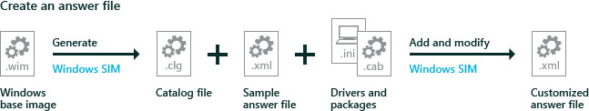

# <a name="span-idaddsettingsspanlab-7-change-settings-enter-product-keys-and-run-scripts-with-an-answer-file-unattendxml"></a><span id="Add_settings"></span>实验室 7︰ 更改设置，输入产品密钥，并使用应答文件 (unattend.xml) 运行脚本

应答文件 （或无人参与文件） 可以用于在安装过程中修改图像中的窗口设置。 您还可以创建触发脚本运行后的第一个用户创建自己的帐户并挑选他们的默认语言将图像中的设置。

若要了解有关 Windows 自定义，请参阅[第 10 Windows 版本 1607 OEM 策略文档 (OPD)](https://myoem.microsoft.com/oem/myoem/en/topics/Licensing/roylicres/ost2017/Pages/DP-OPDRoyWin10v1607CL.aspx)。

举一个例子，我们将添加一个演示如何自动引导至维护模式，称为审计模式的设置。 此模式允许您执行其他测试，并捕获更改。 下一步的几个实验室里，我们将使用审核模式。



## <a name="span-idoverviewspanspan-idoverviewspanwindows-settings-overview"></a><span id="overview"></span><span id="OVERVIEW"></span>Windows 设置概述

虽然可以在审核模式下设置多个 Windows 设置，某些设置只能设置使用答案文件或 Windows 图像处理和配置设计器 (ICD)，如添加制造商的支持信息。 （无人参与的设置，也称为） 的答案文件设置的完整列表是在[无人参与的 Windows 安装程序参考](https://msdn.microsoft.com/library/windows/hardware/dn923277)。

企业可以通过使用组策略来控制其他设置。 有关详细信息，请参阅[组策略](http://go.microsoft.com/fwlink/p/?linkid=268543)。

您可以指定哪个配置阶段来添加新的设置︰

-   **1 windowsPE**: Windows 安装程序的安装程序可以使用这些设置。 如果正在修改现有的图像，您通常可以忽略这些设置。
-   **4 专用化**︰ 应在此处添加大多数设置。 这些设置是在审核模式的开头和 OOBE 开始触发的。 如果您需要进行多个更新或测试设置，再次对该设备进行一般化并且在 Specialize 配置阶段中添加另一个批次的设置。
-   **6 auditUser**︰ 一旦您开始运行审核模式。

    这是极好的运行系统测试脚本-我们将添加[Microsoft Windows 部署\\RunAsynchronousCommand](https://msdn.microsoft.com/library/windows/hardware/dn915797)作为示例。 若要了解详细信息，请参阅[添加到 Windows 安装程序的自定义脚本](add-a-custom-script-to-windows-setup.md)。

-   **7 oobeSystem**︰ 慎用。 其中的大部分设置运行后用户完成 OOBE。 例外情况是 Microsoft Windows 部署\\重新封装\\[模式](https://msdn.microsoft.com/library/windows/hardware/dn923110)= 审核设置，我们将使用来绕过 OOBE 和计算机启动到审核模式。

    如果您的脚本依赖于知道用户在 OOBE 期间选择哪种语言，会将其添加到 oobeSystem 阶段。

-   有关其他配置阶段的信息，请参阅[Windows 安装程序配置阶段](windows-setup-configuration-passes.md)。

**请注意** 如果用户重置其 PC 使用内置的恢复工具，这些设置可能会丢失。 如何确保这些设置重置期间留在该设备，请参阅[示例脚本](windows-deployment-sample-scripts-sxs.md)︰ 保持 Windows 设置通过恢复。

## <a name="span-idcreateanswerspanspan-idcreateanswerspancreate-and-modify-an-answer-file"></a><span id="createanswer"></span><span id="CREATEANSWER"></span>创建和修改应答文件

**步骤 1︰ 创建编录文件**

1.  启动**Windows 系统映像管理器**。

2.  单击**文件** > **选择的 Windows 映像**。

3.  在**选择 Windows 映像**中，浏览到并选择图像文件 (D:\install.wim)。 接下来，选择版本的 Windows 中，例如，对于 Windows 10 专业，然后单击**确定**。 单击**是**创建编录文件。 Windows SIM 创建基于图像文件，该文件并将其保存为图像文件所在的文件夹。 此过程可能需要几分钟的时间。

    **Windows 映像**窗格中显示目录文件。 Windows SIM 中列出的可配置的组件和该映像中的程序包。

    **进行故障排除︰**如果 Windows SIM 不创建编录文件时，请尝试以下步骤︰

    -   若要创建编录文件的 32 位或基于 ARM 的设备，使用 32 位设备。

    -   请确保 Windows 基础图像文件**(\\源\\Install.wim**) 是具有读写权限，如 USB 闪存驱动器的文件夹中或在您的硬盘上。

**步骤 2︰ 创建应答文件**

-   单击**文件** > **新的应答文件**。

    在**应答文件**窗格中将显示新的应答文件。

    **请注意**  如果您打开现有答案文件，则可能会提示您将答案文件与映像相关联。 单击**是**。

**步骤 3︰ 添加新的答案文件设置**

1.  添加 OEM 信息︰

    在**Windows 映像**窗格中，展开**组件**中，右键单击**amd64\_Microsoft Windows 外壳程序安装\_（版本）**，然后选择**将设置添加到传递 4 专用化**。

    在**应答文件**窗格中，选择**组件\\4 擅长\\amd64\_Microsoft Windows 外壳程序安装\_中性\\OEMInformation**。

    在**OEMInformation 属性**窗格中的**设置**部分中，选择︰
    
    -   制造商 =`Fabrikam`
    -   模型 =`Notebook Model 1`
    -   徽标 =`C:\Fabrikam\Fabrikam.bmp`
        
    创建 32 位颜色与最大为 120 x 120 像素，保存它为 c:\\AnswerFiles\\Fabrikam.bmp 文件在本地计算机上，或使用从 USB B 项的示例︰ `C:\USB-B\ConfigSet\$OEM$\$$\System32\OEM\Fabrikam.bmp`。 
    
    我们可以将徽标复制到 Windows 映像中的几个步骤。

2.  将设备设置为自动[启动到审核模式](https://msdn.microsoft.com/library/windows/hardware/dn923110.aspx)︰

    在**Windows 映像**窗格中，展开**组件**中，右键单击**amd64\_Microsoft Windows 部署\_（版本）**，然后选择**添加到传递 7 oobeSystem 的设置**。

    在**应答文件**窗格中，选择**组件\\7 oobeSystem\\amd64\_Microsoft Windows 部署\_中性\\重新封装**。

    在**重新封装属性**窗格中的**设置**部分中，选择模式 =`Audit`。

3.  准备要审核模式开始之后运行的[脚本](https://msdn.microsoft.com/library/windows/hardware/dn915797.aspx)。

    在**Windows 映像**窗格中，右键单击**amd64\_ Microsoft Windows 部署\_（版本）** ，然后单击**添加到传递 6 auditUser 的设置**。

    在**应答文件**窗格中，展开**组件\\6 auditUser\\amd64\_Microsoft Windows 部署\_中性\\RunAsynchronous**。 右键单击**RunAsynchronousCommand 属性**，然后单击**插入新 AsynchronousCommand**。

    在**AsynchronousCommand 属性**窗格中的**设置**部分中，添加下列值︰

    `Path = C:\Fabrikam\SampleCommand.cmd`

    `Description = Sample command to run a system diagnostic check.`

    `Order = 1`

较常见的设置︰ 

*  通过[添加产品密钥](https://msdn.microsoft.com/library/windows/hardware/dn915735.aspx)激活 Windows 没有 OEM 激活 3.0 (OA3.0): `Microsoft-Windows-Shell-Setup\ProductKey`。 对于企业来说，这可能是批量许可证密钥。

*  第一次启动加速[维护驱动程序配置时捕获图像](maintain-driver-configurations-when-capturing-a-windows-image.md)的︰ `Microsoft-Windows-PnpSysprep/DoNotCleanUpNonPresentDevices`， `Microsoft-Windows-PnpSysprep/PersistAllDeviceInstalls`。

**步骤 4︰ 保存答案文件**

-   保存答案文件中，例如︰ **c:\\AnswerFiles\\BootToAudit x64.xml**。

    **请注意**  Windows sim 卡将不允许您将答案文件保存到已装载的映像文件夹。
     
**步骤 5︰ 创建脚本**

-   将下面的示例脚本复制到记事本中，然后另存为**c:\\AnswerFiles\\SampleCommand.cmd**。

    ``` syntax
    @rem Scan the integrity of system files 
    @rem (Required after removing the base English language from an image)
    sfc.exe /scannow

    @rem Check to see if your drivers are digitally signed, and send output to a log file.
    md C:\Fabrikam
    C:\Windows\System32\dxdiag /t C:\Fabrikam\DxDiag-TestLogFiles.txt
    ```

## <a name="span-idaddtheanswerfileandscripttotheimagespanspan-idaddtheanswerfileandscripttotheimagespanspan-idaddtheanswerfileandscripttotheimagespanadd-the-answer-file-and-script-to-the-image"></a><span id="Add_the_answer_file_and_script_to_the_image"></span><span id="add_the_answer_file_and_script_to_the_image"></span><span id="ADD_THE_ANSWER_FILE_AND_SCRIPT_TO_THE_IMAGE"></span>将答案文件和脚本添加到映像

### <a name="span-idmounttheimagespanmount-the-image"></a><span id="Mount_the_image"></span>装入该映像

**步骤 6︰ 将这些映像装载**

使用步骤，可从[实验室 3︰ 添加设备驱动程序 （.inf 样式）](add-device-drivers.md)装载映像。 短的版本︰

1.  打开命令行以管理员身份 (**开始**> 键入**部署**> 右键单击**部署和图像处理工具环境** > **以管理员身份运行**。)

2.  对该文件进行备份 (`copy "C:\Images\Win10_x64\sources\install.wim" C:\Images\install-backup.wim`)

3.  装入该映像 (`md C:\mount\windows`，然后`Dism /Mount-Image /ImageFile:"C:\Images\install.wim" /Index:1 /MountDir:"C:\mount\windows" /Optimize`)

### <a name="span-idaddtheanswerfilespanadd-the-answer-file"></a><span id="Add_the_answer_file"></span>将答案文件添加
**步骤 7︰ 添加应答文件**
2.  将答案文件复制到图像分解成\\Windows\\黑豹文件夹，并将其命名为 unattend.xml。 如果它不存在，则创建该文件夹。 如果没有现有的应答文件，替换它，或使用 Windows 系统映像管理器编辑/组合的设置在必要时。

    ``` syntax
    MkDir c:\mount\windows\Windows\Panther
    Copy C:\AnswerFiles\BootToAudit-x64.xml  C:\mount\windows\Windows\Panther\unattend.xml
    MkDir c:\mount\windows\Fabrikam
    Copy C:\AnswerFiles\Fabrikam.bmp    C:\mount\windows\Fabrikam\Fabrikam.bmp
    Copy C:\AnswerFiles\SampleCommand.cmd    C:\mount\windows\Fabrikam\SampleCommand.cmd
    ```
## <a name="span-idunmounttheimagesspan-unmount-the-images"></a><span id="Unmount_the_images"></span>卸载映像

**步骤 8︰ 卸载映像**

1.  关闭所有应用程序可能会访问从图像文件。

2.  提交更改并卸载 Windows 映像︰

    ``` syntax
    Dism /Unmount-Image /MountDir:"C:\mount\windows" /Commit
    ```

    其中*C*是驱动器的包含图像的驱动器号。

    此过程可能需要几分钟。

## <a name="span-idtryitoutspantry-it-out"></a><span id="Try_it_out"></span>试一下

**第 9 步︰ 将映像应用到新的 PC**使用步骤，可从[实验室 2︰ 使用脚本的部署 Windows](deploy-windows-with-a-script-sxs.md)将映像复制到 USB 驱动器的存储中，将 Windows 映像和恢复映像，应用和启动它。 短的版本︰

1.  将图像文件复制到的存储驱动器。
2.  [引导到 Windows PE 中使用 Windows PE usb 闪存盘的参考设备](install-windows-pe-sxs.md)。
3.  查找存储驱动器的驱动器号 (`diskpart, list volume, exit`)。
4.  将映像应用︰ `D:\ApplyImage.bat D:\Images\install.wim`。
5.  断开连接的驱动器，然后重新启动 (`exit`)。
    
**第 10 步︰ 验证设置和脚本**

如果您审核模式设置过，PC 应该启动到审核模式自动。  当审核模式启动时，您的脚本应该自动启动。

1.  文件资源管理器中检查是否文件︰ **c:\\Fabrikam\\DxDiag TestLogFiles.txt**存在。 如果是这样，您的示例脚本正确运行。

将计算机引导到审核模式下，继续执行下面的实验室︰

下一步行动︰[实验室 9︰ 更改从 Windows （审核模式）](prepare-a-snapshot-of-the-pc-generalize-and-capture-windows-images-blue-sxs.md)